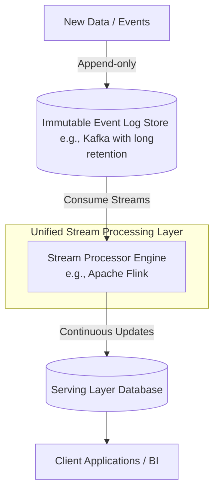
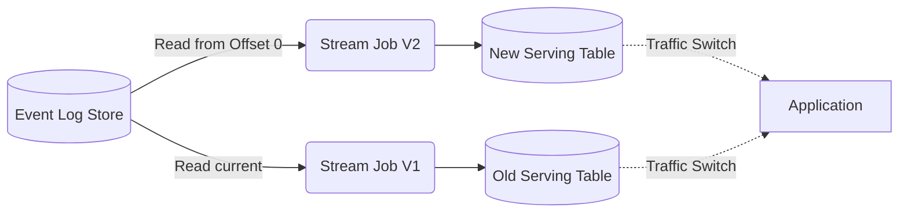

Khi thiết kế các hệ thống dữ liệu lớn, việc dung hòa giữa nhu cầu báo cáo thời gian thực (Real-time) và tính toán số liệu lịch sử chính xác (Batch) luôn là một bài toán hóc búa. Trong nhiều năm, kiến trúc Lambda đã thống trị như một giải pháp tiêu chuẩn. Thế nhưng, việc phải vận hành song song hai hệ thống độc lập trong Lambda đã mang lại gánh nặng bảo trì khổng lồ cho các kỹ sư dữ liệu. Để giải quyết triệt để nút thắt này, một mô hình kiến trúc tinh giản và thanh lịch hơn đã ra đời: **Kiến trúc Kappa** (Kappa Architecture).

## Khi mọi thứ đều là dòng chảy (Stream)

Kiến trúc Kappa là một mô hình kiến trúc phần mềm tập trung hoàn toàn vào việc xử lý dữ liệu dưới dạng luồng (Stream Processing) mà không cần đến lớp xử lý lô (Batch Layer) riêng biệt. Triết lý của Kappa coi tất cả mọi dữ liệu trong doanh nghiệp — cho dù là một giao dịch vừa phát sinh mili-giây trước hay dữ liệu lịch sử của 5 năm về trước — đều là các sự kiện thuộc về một chuỗi dòng chảy liên tục.

Mô hình này được đề xuất bởi Jay Kreps (nhà đồng sáng lập của [Apache Kafka](/concepts/4-realtime/streaming-processing/apache-kafka/) và công ty Confluent) vào năm 2014 như một sự thay thế gọn gàng hơn cho kiến trúc Lambda. Bằng cách loại bỏ hoàn toàn tầng Batch, Kappa sử dụng một công cụ xử lý luồng mạnh mẽ duy nhất (như Apache Flink, Spark Streaming hoặc Kafka Streams) để đảm nhận cả nhiệm vụ tính toán thời gian thực lẫn xử lý lại dữ liệu lịch sử. Trong thế giới của Kappa, xử lý lô (Batch) thực chất chỉ là một trường hợp đặc biệt của xử lý luồng (khi điểm bắt đầu đọc được tua lại quá khứ và điểm kết thúc nằm ở hiện tại).

## Lời tuyên chiến với sự phức tạp của Lambda

Mặc dù kiến trúc Lambda rất mạnh mẽ, nó lại mang tới một vấn đề nhức nhối cho các doanh nghiệp: **Nợ kỹ thuật và chi phí vận hành quá cao** (Operational Complexity).

Với Lambda, các kỹ sư dữ liệu bắt buộc phải viết, kiểm thử và duy trì cùng một logic nghiệp vụ hai lần bằng hai ngôn ngữ hoặc công nghệ khác nhau: một lần cho lớp Batch (như [Apache Spark](/concepts/3-integration/batch-processing/apache-spark/), Hadoop) và một lần cho lớp Stream (như Apache Storm, Flink). Mỗi khi thay đổi một quy tắc tính toán nhỏ, họ phải đảm bảo cập nhật đồng bộ ở cả hai nơi. Bất kỳ sự lệch pha nào giữa hai lớp này cũng sẽ dẫn đến việc số liệu hiển thị trên Dashboard bị sai lệch.

Jay Kreps lập luận rằng: Với sự tiến bộ vượt bậc của các công cụ xử lý luồng phân tán chịu lỗi cao cùng khả năng lưu trữ không giới hạn của các hệ thống log sự kiện (như Apache Kafka), chúng ta hoàn toàn có thể hợp nhất hai lớp này làm một. Việc loại bỏ hoàn toàn luồng Batch vẫn đảm bảo tính chính xác tuyệt đối của dữ liệu và khả năng tính toán lại lịch sử (re-computation).

## Các trụ cột cốt lõi của Kappa

Kiến trúc Kappa vận hành dựa trên ba nguyên lý nền tảng:

* **Mọi thứ đều là Stream**: Toàn bộ dữ liệu được tổ chức dưới dạng một chuỗi các sự kiện bất biến, chỉ ghi tiếp (Append-only Log).
* **Một mã nguồn duy nhất (Single Codebase)**: Chỉ duy trì một logic nghiệp vụ và một framework xử lý dữ liệu thống nhất cho cả dữ liệu cũ lẫn mới.
* **Tua lại sự kiện khi cần xử lý lại (Reprocessing via Replay)**: Mỗi khi có sự thay đổi về mặt logic thuật toán, hệ thống không chạy lại một job Batch. Thay vào đó, nó sẽ khởi chạy một ứng dụng stream mới, tua ngược thời gian đọc dữ liệu từ đầu log sự kiện (Offset = 0), tính toán lại từ đầu và ghi đè kết quả vào một bảng hiển thị mới.

## Quy trình hoạt động và cơ chế tính toán lại (Reprocessing)

Về mặt kiến trúc, Kappa cực kỳ tinh giản khi chỉ bao gồm hai thành phần cốt lõi:


1. **Immutable Event Log Store (Kho lưu trữ sự kiện bất biến)**: Đóng vai trò là nguồn chân lý duy nhất. Thông thường, các doanh nghiệp sử dụng Apache Kafka hoặc Apache Pulsar cấu hình thời gian lưu trữ dài hạn (hoặc vô hạn).
2. **Stream Processing Engine (Công cụ xử lý luồng)**: Sử dụng các công cụ mạnh mẽ như Apache Flink để liên tục đọc dữ liệu từ Log Store, tính toán và đẩy kết quả cập nhật trực tiếp xuống cơ sở dữ liệu phục vụ (Serving Layer) để hiển thị lên Dashboard của người dùng.

### Cơ chế xử lý lại (Reprocessing) khi logic nghiệp vụ thay đổi

Khi bạn phát hiện ra code của phiên bản cũ (V1) có lỗi, hoặc khi cần áp dụng một công thức tính toán mới (V2):


1. Bạn triển khai ứng dụng Stream phiên bản V2 lên cụm máy chủ xử lý luồng.
2. Cấu hình cho ứng dụng V2 tiến hành đọc lại (replay) toàn bộ dữ liệu lịch sử từ điểm khởi đầu (Offset = 0) của Event Log Store với tốc độ tối đa của phần cứng (Catch-up phase), rồi ghi kết quả vào một bảng dữ liệu phục vụ mới (New Serving Table).
3. Trong suốt thời gian này, ứng dụng phiên bản V1 vẫn chạy bình thường để phục vụ người dùng.
4. Khi ứng dụng V2 đã hoàn tất việc tính toán lại dữ liệu lịch sử và bắt kịp dòng chảy thời gian thực, kỹ sư chỉ việc chuyển hướng truy cập (Traffic Switch) của ứng dụng hoặc Dashboard sang bảng dữ liệu mới của V2, rồi tắt nhẹ nhàng ứng dụng V1. Tiến trình chuyển đổi diễn ra êm đẹp và không gây ra bất kỳ thời gian gián đoạn (zero-downtime) nào.

Dưới đây là đoạn mã Java minh họa cách cấu hình cho một consumer trong Apache Flink tua lại dữ liệu lịch sử từ đầu để phục vụ reprocessing:
```java
// Khởi tạo Kafka Consumer đọc luồng sự kiện
FlinkKafkaConsumer<String> consumer = new FlinkKafkaConsumer<>(
    "call_drops_log", 
    new SimpleStringSchema(), 
    properties
);

// Khi cần chạy lại dữ liệu lịch sử (Reprocessing) cho Job V2:
// Thay vì đọc từ sự kiện mới nhất, ta set đọc từ đầu Log (Offset 0)
consumer.setStartFromEarliest();

DataStream<String> stream = env.addSource(consumer);
// ... tiếp tục với logic xử lý stream ...
```

## Những chỉ dẫn "vàng" cho kỹ sư

* **Cấu hình Retention Policy cho Kafka hợp lý**: Hãy đảm bảo thời gian lưu giữ dữ liệu của Kafka đủ lâu để phục vụ cho nhu cầu tua lại. Bạn nên kết hợp tính năng Tiered Storage của Kafka để tự động đẩy các log sự kiện cũ xuống các dịch vụ lưu trữ giá rẻ như Amazon S3 nhằm tiết kiệm chi phí đĩa cứng đắt đỏ của các Broker.
* **Chú trọng năng lực quản lý trạng thái (Stateful Processing)**: Hãy chọn các framework xử lý luồng hỗ trợ lưu trữ trạng thái tốt (như RocksDB StateBackend trong Apache Flink) để quản lý các tác vụ phức tạp như gom nhóm theo thời gian ([windowing](/concepts/4-realtime/streaming-processing/windowing/)) hay ghép nối các luồng dữ liệu lịch sử khổng lồ.
* **Lập trình tuyệt đối dựa trên Event Time**: Khi chạy tua lại dữ liệu lịch sử (replay), mốc thời gian máy chủ xử lý dữ liệu (Processing Time) sẽ hoàn toàn mất đi giá trị (vì hàng triệu sự kiện của 5 năm trước đều được xử lý vào ngày hôm nay). Bạn bắt buộc phải lập trình dựa trên thời điểm sự kiện thực tế phát sinh (Event Time), kết hợp với cấu hình [Watermark](/concepts/4-realtime/streaming-processing/watermark/) để xử lý các sự kiện bị đến trễ.

## Điểm mạnh (Pros) và điểm yếu (Cons)

### Điểm mạnh (Pros)
* **Chỉ duy trì một mã nguồn duy nhất**: Rút ngắn thời gian phát triển, kiểm thử và đồng bộ hóa logic hệ thống.
* **Kiến trúc tinh gọn**: Cắt giảm đáng kể chi phí vận hành và quản lý hạ tầng do không phải duy trì các cụm máy chủ Hadoop hay Spark Batch.
* **Dễ dàng thử nghiệm**: Bạn có thể triển khai chạy thử nghiệm thuật toán mới song song với thuật toán cũ trên cùng một luồng dữ liệu thực tế mà không sợ làm ảnh hưởng đến người dùng hiện tại.

### Điểm yếu (Cons)
* **Chi phí lưu trữ log sự kiện đắt đỏ**: Việc lưu giữ hàng Petabytes dữ liệu lịch sử lâu dài trong Kafka tốn kém hơn nhiều so với việc lưu trữ các tệp tĩnh trên các [Data Lake](/concepts/2-storage/data-lake-lakehouse/data-lake/) giá rẻ (như Amazon S3 hay HDFS).
* **Hiệu năng xử lý Batch thuần túy**: Mặc dù Flink xử lý luồng rất mạnh mẽ, nhưng đối với các truy vấn phân tích yêu cầu JOIN hàng chục bảng dữ liệu khổng lồ (Heavy [OLAP](/concepts/2-storage/database-storage/olap/)), các công cụ chạy Batch truyền thống (như [Spark SQL](/concepts/3-integration/batch-processing/spark-sql/) hay [Google BigQuery](/concepts/2-storage/cloud-data-platform/google-bigquery/)) vẫn cho thấy sự vượt trội về mặt tốc độ và tối ưu hóa bộ nhớ.

---

## Khi nào nên dùng

### Nên dùng Kappa khi:
* Hệ thống của bạn được thiết kế theo kiến trúc hướng sự kiện (Event-driven Architecture), nơi phần lớn dữ liệu đầu vào là dạng log, clickstream hoặc telemetry từ thiết bị IoT.
* Bạn muốn tối ưu hóa đội ngũ kỹ sư dữ liệu nhỏ bằng cách giảm thiểu gánh nặng vận hành hai công nghệ độc lập.

### Không nên dùng Kappa khi:
* Dữ liệu của doanh nghiệp có tính quan hệ chặt chẽ, đòi hỏi các phép JOIN phức tạp trên các bảng dữ liệu khổng lồ liên tục.
* Doanh nghiệp có lượng dữ liệu lưu trữ lịch sử quá lớn, khiến việc duy trì lưu trữ vô hạn trên Kafka không khả thi về mặt tài chính.

## Trọng tâm ôn luyện phỏng vấn

### Câu hỏi 1: Kiến trúc Kappa thực hiện việc tính toán lại dữ liệu lịch sử (Reprocessing) như thế nào và điểm cải tiến của nó so với kiến trúc Lambda là gì?
**Trả lời:**
Trong kiến trúc Lambda, khi cần tính toán lại do thay đổi logic, chúng ta phải sửa code ở lớp Batch, chạy một job tính toán lại (Recompute) quét qua toàn bộ dữ liệu tĩnh trên Data Lake để ghi đè lại kết quả hiển thị.
Trong kiến trúc Kappa, chúng ta loại bỏ hoàn toàn lớp Batch. Việc xử lý lại được thực hiện bằng cơ chế tua lại (Replay). Chúng ta chỉ cần chạy song song một phiên bản ứng dụng Stream thứ hai (V2), cấu hình cho nó đọc lại luồng sự kiện lịch sử từ điểm bắt đầu (Offset 0) của Event Log Store. Khi ứng dụng V2 đã hoàn tất việc catch-up dữ liệu thời gian thực, chúng ta chỉ việc chuyển hướng người dùng sang bảng kết quả mới và tắt ứng dụng cũ đi. Điểm cải tiến lớn nhất là Kappa chỉ sử dụng một codebase duy nhất, loại bỏ hoàn toàn việc trùng lặp code và giảm thiểu tối đa chi phí vận hành hạ tầng.

### Câu hỏi 2: Tại sao khái niệm Event Time lại đóng vai trò quyết định đến sự thành bại của cơ chế Reprocessing trong kiến trúc Kappa?
**Trả lời:**
Khi chúng ta thực hiện tua lại (replay) dữ liệu của 1 năm trước vào ngày hôm nay, hàng triệu sự kiện lịch sử sẽ đổ về máy chủ streaming cùng một lúc. Nếu hệ thống được lập trình dựa trên thời gian máy chủ nhận tin (Processing Time), tất cả các sự kiện của năm ngoái sẽ được hệ thống hiểu là xảy ra vào "ngày hôm nay", khiến các báo cáo tổng hợp theo thời gian (windowing) bị sai lệch hoàn toàn. Vì vậy, hệ thống bắt buộc phải được lập trình dựa trên thời gian thực tế sự kiện phát sinh ở nguồn (Event Time). Kết hợp với công cụ xử lý Watermarks để xác định giới hạn dữ liệu đến trễ, hệ thống mới có thể tái hiện chính xác bức tranh lịch sử của dữ liệu khi tua lại.

---

## English Summary

The Kappa Architecture is a simplified, stream-first architectural pattern that discards the separate Batch Layer found in the Lambda Architecture. Treating all data as an immutable stream of events, it uses a unified stream processing engine (like Apache Flink or Kafka Streams) to handle both real-time data and historical data reprocessing. Reprocessing is achieved by simply spinning up a new version of the streaming application that replays the event log from offset zero. This model radically reduces operational complexity and code duplication, though it places heavy demands on the event broker's long-term storage capacity and the state-management capabilities of the stream processor.

---

## Xem thêm các khái niệm liên quan
* [Data Fabric](/concepts/1-foundations/system-architecture/data-fabric/)
* [Data Mesh](/concepts/1-foundations/system-architecture/data-mesh/)
* [Kiến trúc Nền tảng Dữ liệu & Modern Data Stack](/concepts/1-foundations/system-architecture/data-platform-architecture/)

## Tài liệu tham khảo

* [O'Reilly - Questioning the Lambda Architecture by Jay Kreps](https://www.oreilly.com/content/questioning-the-lambda-architecture/)
* [AWS Architecture Blog - Build a Kappa Architecture Pipeline on AWS](https://aws.amazon.com/blogs/big-data/build-a-kappa-architecture-data-stream-pipeline-using-amazon-kinesis-and-apache-flink/)
* [Google Cloud Blog - Demystifying Data Architectures: Lambda vs Kappa](https://cloud.google.com/blog/products/data-analytics/demystifying-data-architectures-lambda-vs-kappa)
* [Confluent - Lambda vs Kappa Architectures for Event Streaming](https://www.confluent.io/blog/lambda-vs-kappa-architectures-for-event-streaming/)
* [Apache Flink - Official Use Cases and Streaming Design](https://flink.apache.org/usecases.html)
* [O'Reilly - Streaming Systems by Tyler Akidau](https://www.oreilly.com/library/view/streaming-systems/9781491983812/)