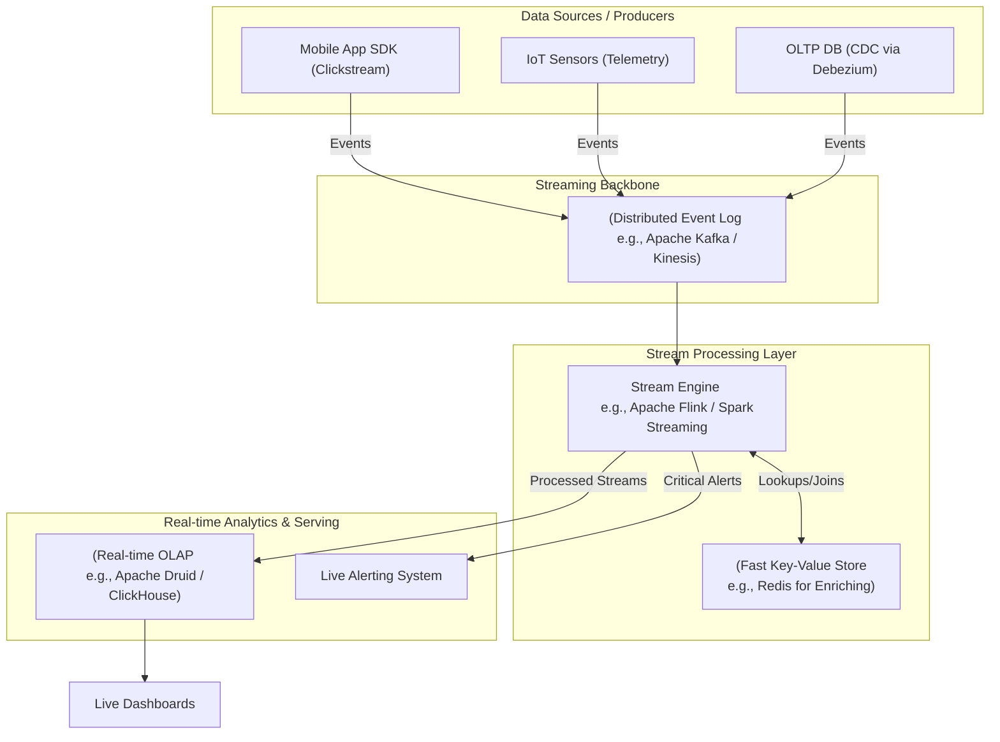

Trong thế giới công nghệ hiện đại, dữ liệu không còn là những khối thông tin tĩnh lặng nằm im trong các ổ đĩa cứng chờ được xử lý vào cuối ngày. Dữ liệu ngày nay giống như một dòng nước chảy xiết liên tục. Doanh nghiệp nào có khả năng thấu hiểu và phản ứng với dòng chảy đó nhanh hơn sẽ chiếm được lợi thế cạnh tranh vượt trội. Đó là lý do **Real-time Architecture (Kiến trúc thời gian thực)** ra đời và trở thành xương sống cho các hệ thống công nghệ hàng đầu thế giới.

## Dữ liệu không ngừng chuyển động: Kiến trúc Real-time là gì?

Kiến trúc thời gian thực là phương pháp thiết kế hệ thống dữ liệu tập trung vào việc thu thập, xử lý và phân phối các luồng dữ liệu liên tục (data streaming) với độ trễ cực thấp – thường chỉ tính bằng mili-giây đến vài giây. 

Thay vì gom dữ liệu lại thành từng lô lớn rồi mới đem đi xử lý như mô hình [Batch Processing](/concepts/3-integration/batch-processing/batch-processing/) truyền thống, kiến trúc Real-time xử lý dữ liệu theo mô hình **"dữ liệu đang chuyển động" (data in motion)**. Mọi hành động của người dùng (nhấp chuột trên web, quẹt thẻ tín dụng, tín hiệu cảm biến IoT gửi về...) được coi là một **Sự kiện (Event)**. Hệ thống sẽ xử lý và đưa ra phản hồi đối với sự kiện đó ngay khi nó đang di chuyển trên đường truyền, trước khi nó kịp cập bến và lưu trữ cố định vào database.

## Sự suy giảm giá trị của thời gian trong dữ liệu

Đối với nhiều bài toán kinh doanh số, giá trị của dữ liệu sẽ giảm dần theo thời gian. Có những tình huống mà dữ liệu chậm trễ dù chỉ 1 giờ cũng đã trở nên vô dụng:

* **Phát hiện gian lận tài chính**: Nếu thẻ tín dụng của khách hàng bị đánh cắp, hệ thống phải phát hiện và khóa giao dịch ngay trong vòng vài chục mili-giây, chứ không thể đợi đến đợt quét dữ liệu vào cuối ngày.
* **Gợi ý sản phẩm tức thời (Dynamic Recommendation)**: Khi khách hàng chuẩn bị rời trang web thương mại điện tử, việc đưa ra một chương trình khuyến mãi flash-sale dựa trên hành vi duyệt web vừa rồi phải diễn ra ngay lập tức để giữ chân họ.
* **Vận hành xe tự hành và ứng dụng gọi xe**: Các ứng dụng như Grab, Uber hay hệ thống định vị của xe tự lái yêu cầu cập nhật vị trí của tài xế và khách hàng liên tục từng giây để tối ưu hóa lộ trình và tính toán giá cả linh hoạt (dynamic pricing).

Các kiến trúc xử lý theo lô truyền thống (như [Data Warehouse](/concepts/2-storage/data-warehouse/data-warehouse/) hay Hadoop) hoàn toàn bất lực trước những yêu cầu khắt khe này. Kiến trúc thời gian thực ra đời chính là để khai thác tối đa giá trị thời gian của dữ liệu.

## Những triết lý thiết kế cốt lõi

* **Tách rời hệ thống (Decoupling)**: Hệ thống tạo ra dữ liệu (Producers) và hệ thống xử lý dữ liệu (Consumers) không bao giờ giao tiếp trực tiếp với nhau. Chúng được kết nối gián tiếp qua một hệ thống nhật ký sự kiện phân tán (Distributed Event Log) có khả năng chịu lỗi cao.
* **Xử lý luồng có trạng thái (Stateful Stream Processing)**: Các động cơ xử lý (engine) duy trì một bộ nhớ trạng thái đệm bên trong (state store) để thực hiện các phép tính như đếm, nhóm theo thời gian ([windowing](/concepts/4-realtime/streaming-processing/windowing/)) và so khớp trực tiếp trên dòng dữ liệu vô tận mà không cần liên tục gọi truy vấn vào database vật lý.
* **Chủ động đẩy dữ liệu (Push over Pull)**: Thay vì hệ thống đích phải định kỳ chạy lệnh hỏi *"Có dữ liệu mới không?"* (Pull), hệ thống xử lý sẽ chủ động đẩy (Push) kết quả tính toán tới ứng dụng hiển thị ngay khi công việc hoàn tất.

## Các mảnh ghép trong một hệ thống Real-time tiêu chuẩn

Một hệ thống Real-time hoàn chỉnh thường được cấu thành từ 4 lớp công nghệ chính:

1. **Lớp Thu thập dữ liệu (Ingestion Layer)**: Sử dụng các công cụ [Change Data Capture](/concepts/3-integration/etl-elt/change-data-capture/) (CDC) như Debezium để theo dõi và bắt lại mọi sự thay đổi (INSERT, UPDATE, DELETE) từ các database nghiệp vụ, hoặc thu nhận trực tiếp các dòng sự kiện clickstream từ ứng dụng.
2. **Lớp Lưu trữ sự kiện (Message/Event Broker)**: Sử dụng [Apache Kafka](/concepts/4-realtime/streaming-processing/apache-kafka/), Amazon Kinesis hoặc Google Pub/Sub làm xương sống. Lớp này chịu trách nhiệm tiếp nhận hàng triệu sự kiện mỗi giây, sắp xếp thứ tự và lưu giữ chúng an toàn trên bộ nhớ đệm phân tán.
3. **Lớp Xử lý luồng dữ liệu (Stream Processing Engine)**: Sử dụng Apache Flink, Spark Streaming hoặc ksqlDB để tiêu thụ dữ liệu từ Broker. Lớp này thực hiện các công việc tính toán thời gian thực như lọc dữ liệu, làm giàu thông tin (JOIN sự kiện với dữ liệu tĩnh trong cache Redis) và gom nhóm theo cửa sổ thời gian.
4. **Lớp Phục vụ và Phân tích (Real-time Serving & Analytics)**: Kết quả sau khi xử lý được đẩy trực tiếp qua WebSockets lên màn hình người dùng, hoặc lưu vào các database In-memory / [OLAP](/concepts/2-storage/database-storage/olap/) hỗ trợ chỉ mục cao như Redis, Apache Druid, ClickHouse hay Apache Pinot để phục vụ báo cáo trực tiếp.

## Sơ đồ kiến trúc luồng dữ liệu thời gian thực


## Ví dụ thực tế: Hệ thống phát hiện gian lận thẻ tín dụng

Hãy xem cách một ngân hàng số phát hiện thẻ tín dụng bị đánh cắp bằng kiến trúc thời gian thực:

1. Khách hàng thực hiện quẹt thẻ tại một máy POS ở Hà Nội. CSDL giao dịch ghi nhận thay đổi. **Debezium (CDC)** phát hiện sự kiện này và đẩy ngay thông điệp `TransactionEvent(Card=123, Amount=5000, Location=Hanoi)` vào Kafka topic `card_transactions`.
2. Hệ thống **Apache Flink** đang chạy lắng nghe liên tục topic này để nhận diện giao dịch.
3. Flink nhận sự kiện và tra cứu tức thì thông tin lịch sử của thẻ 123 trong **Redis**. Kết quả tra cứu cho thấy: *Cách đây 5 phút, thẻ này vừa được quẹt mua sắm trực tiếp tại một cửa hàng ở TP.HCM*.
4. Flink áp dụng luật nghiệp vụ: Một người không thể di chuyển từ TP.HCM ra Hà Nội trong vòng 5 phút. Xác suất giao dịch gian lận được đánh giá ở mức 99%.
5. Flink lập tức đẩy sự kiện cảnh báo `FraudAlert(Card=123)` vào một Kafka topic khác để kích hoạt hệ thống tự động khóa thẻ và gửi tin nhắn cảnh báo cho khách hàng.
Toàn bộ chuỗi hành động trên diễn ra chỉ trong vòng **200 mili-giây**.

Dưới đây là một đoạn truy vấn Flink SQL minh họa cách gom nhóm các giao dịch bất thường trong vòng 5 phút (Sliding Window):
```sql
SELECT 
    card_id, 
    COUNT(*) as transaction_count,
    SUM(amount) as total_amount
FROM card_transactions
-- Thiết lập cửa sổ trượt dài 5 phút, cập nhật kết quả sau mỗi 1 phút
GROUP BY 
    HOP(transaction_time, INTERVAL '1' MINUTE, INTERVAL '5' MINUTE),
    card_id
HAVING COUNT(*) > 3 AND SUM(amount) > 10000;
-- Nếu thỏa mãn điều kiện lọc, kết quả lập tức được chuyển sang Kafka Fraud Topic
```

## Những lưu ý thực chiến khi thiết kế hệ thống

### Những nguyên tắc vàng (Best Practices)
* **Thiết kế tính lũy đẳng ([Idempotency](/concepts/3-integration/etl-elt/idempotency/))**: Trong hệ thống phân tán, lỗi kết nối mạng là điều không thể tránh khỏi và Broker có thể gửi lặp lại một sự kiện. Hệ thống xử lý luồng bắt buộc phải có cơ chế nhận diện và bỏ qua các sự kiện trùng lặp này (Exactly-once semantics).
* **Xử lý dữ liệu đến muộn (Late Data)**: Do sự cố mạng ở thiết bị di động, dữ liệu có thể bị đẩy lên chậm vài tiếng so với thời điểm thực tế phát sinh. Thiết kế hệ thống thời gian thực cần sử dụng khái niệm **Event Time** (thời gian sự kiện thực sự xảy ra) phối hợp với cơ chế **Watermarks** để xử lý dữ liệu trễ một cách hợp lý, thay vì dùng `Processing Time` (thời gian hệ thống nhận được dữ liệu).
* **Áp dụng kiến trúc CQRS**: Không bao giờ ghi ngược kết quả phân tích thời gian thực trực tiếp vào cơ sở dữ liệu [OLTP](/concepts/2-storage/database-storage/oltp/) đang vận hành ứng dụng chính, vì điều này rất dễ gây ra tình trạng khóa bảng (deadlocks). Hãy sử dụng các kho lưu trữ chuyên đọc và truy vấn nhanh như Elasticsearch hoặc Druid.

### Những sai lầm kinh điển cần tránh
* **Micro-batching trá hình**: Nhiều người thiết kế pipeline bằng cách định kỳ chạy câu lệnh SQL quét database (Pull) mỗi 1 phút một lần và gọi đó là "real-time". Đây thực chất chỉ là xử lý lô siêu nhỏ (Micro-batch). Cách làm này không chỉ gây lãng phí tài nguyên database khi không có dữ liệu mới, mà còn dễ bị nghẽn hệ thống khi lượng dữ liệu đột ngột tăng cao.
* **Tính toán quá tải trong Stream**: Việc cố gắng thực hiện các phép JOIN phức tạp giữa 5-7 bảng dữ liệu lịch sử khổng lồ ngay trong Stream Engine sẽ khiến bộ nhớ trạng thái (State) của Flink phình to không giới hạn, dẫn đến lỗi tràn bộ nhớ (Out of Memory). Hãy giữ luồng xử lý stream gọn nhẹ và nhường các phép tính toán phức tạp cho hệ thống Batch xử lý sau (áp dụng kiến trúc Lambda).

## Điểm mạnh (Pros) và điểm yếu (Cons)

### Điểm mạnh (Pros)
* **Trải nghiệm người dùng tuyệt vời**: Các tính năng cập nhật tức thì giúp doanh nghiệp tương tác và giữ chân khách hàng hiệu quả hơn.
* **San phẳng tải trọng dữ liệu (Load Smoothing)**: Thay vì dồn hàng trăm GB dữ liệu về xử lý nặng nề vào ban đêm làm nghẽn hệ thống, dữ liệu thời gian thực được chia nhỏ và xử lý đều đặn từng kilobyte suốt 24/7.
* **Tối ưu hóa giá trị thời gian của dữ liệu**: Giúp doanh nghiệp phản hồi ngay lập tức đối với các sự kiện nhạy cảm về thời gian (như gian lận thẻ tín dụng).

### Điểm yếu (Cons)
* **Độ phức tạp cực cao**: Tư duy lập trình trên luồng dữ liệu vô tận khó hơn nhiều so với thao tác trên các bảng dữ liệu tĩnh. Việc debug và kiểm thử hệ thống cũng phức tạp hơn gấp bội.
* **Chi phí hạ tầng lớn**: Hệ thống phải hoạt động liên tục (Always-on) 100% công suất kể cả trong các khung giờ thấp điểm. Việc vận hành một cụm Kafka và Flink đòi hỏi đội ngũ kỹ sư hệ thống phân tán có trình độ chuyên môn cao.

---

## Khi nào nên dùng

### Nên dùng Real-time Architecture khi:
1. Hệ thống phát hiện gian lận tài chính, cảnh báo bảo mật, giám sát an ninh mạng.
2. Hệ thống IoT theo dõi sức khỏe thiết bị, dữ liệu viễn thông từ xe thông minh.
3. Các tính năng định giá linh hoạt theo thời gian thực hoặc gợi ý sản phẩm tức thời cho khách hàng.

### Không nên dùng Real-time Architecture khi:
1. Khi nhu cầu thực tế chỉ là làm báo cáo kinh doanh định kỳ theo tuần hoặc theo tháng cho các phòng ban kế toán, nhân sự.
2. Khi ngân sách hạ tầng còn mỏng và đội ngũ kỹ thuật chưa có kinh nghiệm vận hành các hệ thống phân tán phức tạp.

---

## Trọng tâm ôn luyện phỏng vấn

### Câu hỏi 1: Khái niệm Windowing trong xử lý stream là gì? Hãy phân biệt Tumbling Window và Sliding Window.
**Trả lời:**
Vì luồng dữ liệu stream là vô tận, chúng ta không thể thực hiện các phép tính tổng hợp như `SUM()` hay `COUNT()` trên toàn bộ tập dữ liệu. Do đó, ta cần chia luồng dữ liệu thành các khoảng thời gian hữu hạn để tính toán, khái niệm này gọi là Window.
- **Tumbling Window** (Cửa sổ nhào lộn): Chia dòng thời gian thành các khoảng cố định không chồng lấn lên nhau (ví dụ: [08:00 - 08:05], [08:05 - 08:10]). Một sự kiện chỉ có thể thuộc về duy nhất một cửa sổ.
- **Sliding Window** (Cửa sổ trượt): Cửa sổ có độ dài cố định nhưng sẽ liên tục trượt lên phía trước sau một khoảng thời gian ngắn hơn (ví dụ: Cửa sổ dài 5 phút nhưng cứ mỗi 1 phút lại cập nhật tính toán lại một lần). Như vậy, một sự kiện có thể nằm trong nhiều cửa sổ chồng lấn lên nhau. Sliding Window rất hữu ích cho các bài toán tính toán trung bình trượt (Moving Average).

### Câu hỏi 2: Hãy so sánh sự khác biệt giữa CDC (Change Data Capture) và phương pháp Batch ETL Query-based. Tại sao kiến trúc Real-time luôn ưu ái CDC?
**Trả lời:**
- **Query-based [ETL](/concepts/3-integration/etl-elt/etl/)** định kỳ chạy các câu lệnh query dạng `SELECT * WHERE updated_at > X` trực tiếp vào database nguồn. Cách làm này gây áp lực đọc rất lớn lên database nghiệp vụ và hoàn toàn không bắt được các sự kiện xóa vật lý (DELETE) trừ khi có thiết kế Soft Delete phức tạp.
- **CDC** (như Debezium) hoạt động bằng cách đọc trực tiếp file ghi log giao dịch (Write-Ahead Log / Binlog) của database. Phương pháp này có độ trễ gần như bằng không, không gây ảnh hưởng đến hiệu năng truy vấn của database chính, và bắt được 100% mọi sự thay đổi (gồm cả lệnh DELETE vật lý). Do đó, CDC là nguồn cung cấp dữ liệu đầu vào hoàn hảo cho các kiến trúc thời gian thực.

---

## English Summary

Real-time Architecture shifts data processing from a static, scheduled batch paradigm to continuous, event-driven streaming. Utilizing distributed message brokers (like Apache Kafka) and stateful stream processing engines (like Apache Flink), the architecture ingests, processes, and acts upon data points in milliseconds. It is crucial for use cases where the time-value of data decays rapidly—such as fraud detection, dynamic pricing, and live recommendations—though it significantly increases the complexity of infrastructure management, state recovery, and programming models (e.g., handling event time vs. processing time).

---

## Xem thêm các khái niệm liên quan
* [Data Fabric](/concepts/1-foundations/system-architecture/data-fabric/)
* [Data Mesh](/concepts/1-foundations/system-architecture/data-mesh/)
* [Kiến trúc Nền tảng Dữ liệu & Modern Data Stack](/concepts/1-foundations/system-architecture/data-platform-architecture/)

## Tài liệu tham khảo

* [AWS Solution - Real-Time Data Streaming with Amazon Kinesis](https://aws.amazon.com/solutions/real-time-data-streaming-with-amazon-kinesis/)
* [Google Cloud - Real-Time Data Processing with Cloud Dataflow](https://cloud.google.com/architecture/real-time-data-processing-with-dataflow)
* [Microsoft Azure - Big Data Real-Time Processing Architectures](https://learn.microsoft.com/en-us/azure/architecture/data-guide/big-data/real-time-processing)
* [Snowflake Blog - Real-Time Data Pipelines with Snowpipe](https://www.snowflake.com/blog/real-time-data-pipelines-with-snowflake-snowpipe/)
* [Confluent - Real-Time Data Architectures with Apache Kafka](https://www.confluent.io/blog/real-time-data-architectures-with-apache-kafka/)
* [O'Reilly - Streaming Systems by Tyler Akidau](https://www.oreilly.com/library/view/streaming-systems/9781491983812/)
* [Confluent - Designing Event-Driven Systems by Ben Stopford](https://www.confluent.io/designing-event-driven-systems/)