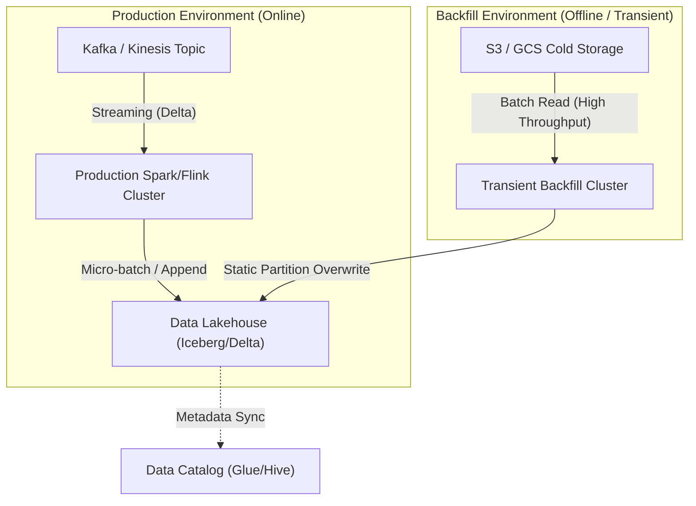

Trong môi trường phân tán (Distributed Systems) và xử lý dữ liệu quy mô lớn (Petabyte-scale), **Backfill** (Quá trình tái cấu trúc trạng thái lịch sử - Historical State Reconciliation) không đơn thuần là việc "chạy lại" (re-run) một Data Pipeline. Tại các công ty công nghệ lớn như Uber hay Netflix, Backfill là một operation class hạng nhất (First-class Operation), đòi hỏi kiến trúc chuyên biệt để đảm bảo tính toàn vẹn dữ liệu (Data Integrity) mà không làm gián đoạn các luồng xử lý thời gian thực (Real-time Ingestion).

Là một Data Engineer thực thụ, bạn phải nhìn nhận Backfill dưới lăng kính của những sự đánh đổi hệ thống (Systemic Trade-offs): Compute vs. Storage, Latency vs. Throughput, và Online vs. Offline Resource Isolation.

---

## 1. Bản chất Hệ thống của Backfill (System Engineering Context)

Trong các Data Pipeline hiện đại (như Lambda hoặc Kappa Architecture), dữ liệu được nạp theo kiểu **Incremental** (Tăng dần/Delta). Việc chỉ xử lý Delta tối ưu chi phí, nhưng đặt ra bài toán phức tạp khi cần thay đổi hồi tố (Retroactive Changes) trên toàn bộ dữ liệu (Time-series Data) của nhiều năm trước.

**Các Triggers Kích Hoạt Backfill Kinh Điển:**
- **Schema Evolution & Data Contract Violation:** Thêm dimension hoặc feature mới cho Machine Learning Models (ví dụ: backfill cột `Customer_LTV` trong 3 năm quá khứ).
- **Algorithmic Restatements:** Lỗi trong UDF (User Defined Function) tính sai doanh thu, yêu cầu xóa và tính toán lại toàn bộ.
- **Late-arriving Events (Sự kiện đến trễ):** Xử lý Watermarks trễ trong Flink/Spark Streaming. Sự kiện đến muộn sau khi cửa sổ thời gian (Time Window) đã đóng, đòi hỏi backfill định kỳ để đảm bảo tính exactly-once.
- **Data Migration:** Chuyển đổi kiến trúc hệ thống (ví dụ: Migrate từ kho dữ liệu On-premise Hadoop sang Apache Iceberg / Delta Lake trên Cloud).

---

## 2. Kiến Trúc Cô Lập Tài Nguyên (Resource Isolation Architecture)

Quy tắc sinh tử: **Không bao giờ dùng chung Compute Cluster của Production cho tác vụ Backfill.**

Quá trình quét lại toàn bộ dữ liệu lịch sử (Full Table Scan) của 3 năm sẽ tạo ra một cơn bão I/O (I/O Storm), vắt kiệt Network Bandwidth và chắc chắn làm sập các luồng Real-time đang chạy.



### 2.1. Infrastructure-as-Code (Terraform) cho Transient Backfill Cluster
Để tối ưu chi phí, các công ty lớn áp dụng mô hình **Ephemeral Compute** (Cụm máy tính tạm thời). Bạn dùng Terraform dựng một cụm siêu to khổng lồ, chạy Backfill xong và tự động hủy để không tốn tiền duy trì. Dưới đây là cấu hình Terraform cho AWS EMR tối ưu bộ nhớ (Memory-Optimized) để tránh OOMKilled khi Shuffle:

```hcl
resource "aws_emr_cluster" "backfill_cluster" {
  name          = "transient-historical-backfill"
  release_label = "emr-6.10.0"
  applications  = ["Spark", "Hudi"]

  # Master node cho Orchestration
  master_instance_group {
    instance_type = "m5.xlarge"
  }
  
  # Core nodes chuyên dụng cho Backfill, ưu tiên RAM (R5 class)
  core_instance_group {
    instance_type  = "r5.8xlarge"
    instance_count = 20
  }
  
  # Tự động hủy sau 1 giờ rảnh rỗi để tiết kiệm Compute Cost
  auto_termination_policy {
    idle_timeout = 3600
  }
}
```

---

## 3. Các Chiến Lược & Patterns Trong Backfill

### 3.1. Tính Lũy Đẳng (Idempotency) & Static Partition Overwrite
Backfill script **bắt buộc** phải là Idempotent (chạy 1 hay 100 lần kết quả vẫn ra giống hệt nhau). Tuyệt đối không dùng `INSERT INTO`. Pattern tiêu chuẩn được khuyến nghị là **Static Partition Overwrite**.

Ví dụ với Spark SQL / Delta Lake:
```sql
-- Thay thế hoàn toàn phân vùng (Partition) lịch sử thay vì UPDATE từng dòng
-- Pattern này giảm lock contention và ngăn ngừa duplicate data
INSERT OVERWRITE TABLE datamart.events_fact
PARTITION (dt)
SELECT 
    event_id,
    user_id,
    complex_ml_udf(payload) AS processed_payload,
    dt
FROM raw_zone.raw_events
WHERE dt BETWEEN '2022-01-01' AND '2023-12-31';
```

### 3.2. Chuyển Đổi Nguồn (Source Switching) Trong Stream-Processing
Trong hệ thống Streaming, Kafka không được thiết kế để lưu trữ dữ liệu vĩnh viễn (Retention Period thường là 7 ngày). Khi cần backfill 2 năm, bạn không thể đọc từ Kafka.
**Kiến trúc xử lý:** Tái sử dụng cùng một logic code Flink, nhưng đổi Source từ Kafka sang S3 (Cold Storage) và chuyển Runtime Mode sang BATCH.

```yaml
# flink-backfill-conf.yaml
execution:
  # Chuyển từ STREAMING sang BATCH để tối ưu throughput thay vì latency
  runtime-mode: BATCH 
  checkpointing:
    # Tắt Checkpointing vì Batch Job có thể retry toàn bộ nếu fail
    interval: 0
pipeline:
  watermark-interval: 0ms
```

### 3.3. Chunking & Windowing (Chia Nhỏ Window Bằng Airflow)
Thay vì ném truy vấn 5 năm vào một Spark Job (chắc chắn sẽ văng `OOMKilled`), ta dùng Airflow để chia nhỏ thành từng ngày (Chunking).

```python
# Airflow DAG for Controlled Backfill
from airflow.models.dag import DAG
from airflow.providers.apache.spark.operators.spark_submit import SparkSubmitOperator
from datetime import datetime

with DAG(
    dag_id="historical_backfill_events",
    schedule_interval="@daily",
    start_date=datetime(2021, 1, 1),
    end_date=datetime(2023, 1, 1),
    catchup=True, # Kích hoạt Backfill tự động lùi về quá khứ
    max_active_runs=10 # Tránh DDoS hệ thống nguồn (Concurrency Limit)
) as dag:

    # Job sẽ chạy độc lập (Chunking) cho từng execution_date
    backfill_task = SparkSubmitOperator(
        task_id="spark_backfill_chunk",
        application="s3://scripts/backfill_events.py",
        application_args=["--target_date", "{{ ds }}"]
    )
```

---

## 4. Sự Cố Thực Tế và Gỡ Lỗi (Real-world Incidents)

Backfill là ngọn nguồn của những vụ sập hệ thống kinh điển nhất trong Data Engineering.

### 🚨 Incident 1: `OOMKilled` (Out Of Memory) Do Data Skew
- **Triệu chứng:** Khi backfill dữ liệu lịch sử, Spark Executors liên tục văng lỗi `java.lang.OutOfMemoryError`, container bị K8s/YARN kill với mã `Exit Code 137`. Job treo (hanging) vô thời hạn.
- **Nguyên nhân (Root Cause):** Phân phối dữ liệu lịch sử không đồng đều (Data Skew). Ví dụ những ngày siêu sale (Black Friday) có lượng traffic gấp 50 lần ngày thường. Khi `GROUP BY` hoặc `JOIN`, một Task đơn lẻ phải "nuốt" toàn bộ cục dữ liệu khổng lồ này, làm phình to bộ nhớ Shuffle và làm nổ tung Executor.
- **Khắc phục [Remediation]:** 
  - Tách các ngày có lưu lượng đột biến ra xử lý bằng một job riêng biệt với tài nguyên lớn hơn.
  - Áp dụng kỹ thuật **Salting** (thêm muối ngẫu nhiên vào khóa Join) để phân tán khối lượng của partition bị Skew ra nhiều Executors khác nhau.
  - Kích hoạt **Adaptive Query Execution (AQE)** trong Spark 3.x (`spark.sql.adaptive.enabled=true`) để Spark tự chẻ nhỏ các Skewed Partitions khi runtime.

### 🚨 Incident 2: Consumer Lag Spikes & Tắc Nghẽn Streaming
- **Triệu chứng:** Khi kích hoạt quá trình Backfill, các hệ thống Real-time Pipeline khác lập tức báo động (Alert PagerDuty) `High Consumer Lag`. Dữ liệu realtime bị nghẽn (Delay) hàng giờ.
- **Nguyên nhân:** Backfill Job vô tình dùng chung Network Bandwidth / IOPS của Storage Cluster (ví dụ: chọc chung vào một Database OLTP Primary), làm cạn kiệt tài nguyên (Hiện tượng Noisy Neighbor). Tốc độ sinh tin (Producer) vượt xa tốc độ tiêu thụ (Consumer).
- **Khắc phục:**
  - **Quy tắc Vàng:** Không bao giờ đọc dữ liệu Backfill trực tiếp từ Primary OLTP Database hoặc Operational Kafka. Hãy cấu hình Backfill đọc từ **Read Replicas**, hoặc tốt nhất là từ Datalake Cold Storage (S3/GCS).
  - Thiết lập QoS (Quality of Service) / Rate Limiting chặt chẽ ở tầng Network hoặc cấu hình Fair Scheduler Pool trong Spark/YARN.

---

## 5. Nguồn Tham Khảo (References)

1. [Uber Engineering: Data Lake Processing with Apache Hudi](https://www.uber.com/en-VN/blog/hudi-meetup-2021/)
2. [Netflix TechBlog: Maestro - Netflix’s Workflow Orchestrator](https://netflixtechblog.com/maestro-netflixs-workflow-orchestrator-15104dfc9497)
3. [Databricks: Incremental Data Processing with Auto Loader](https://www.databricks.com/blog/2020/02/24/introducing-databricks-ingest-easy-data-ingestion-into-delta-lake.html)
4. *Designing Data-Intensive Applications* - Martin Kleppmann (Chương 11: Stream Processing - Idempotence & State Reconciliation).
