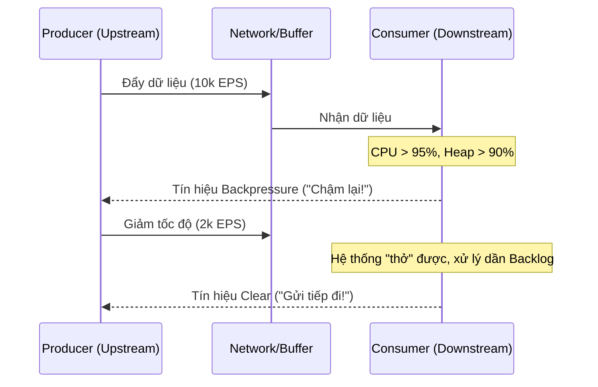

Trong các hệ thống phân tán quy mô lớn (Distributed Systems) và đặc biệt là hệ thống xử lý dữ liệu luồng (Stream Processing), lưu lượng dữ liệu hiếm khi tuyến tính và dễ đoán. Các đợt bùng nổ lưu lượng (Traffic Spikes) do sự kiện Black Friday, Push Notification hàng loạt, hoặc lỗi Retry-Storm từ hàng triệu client có thể đẩy tốc độ sinh dữ liệu (Ingestion Rate) lên gấp hàng chục lần công suất thiết kế của hệ thống.

Khi Producer (hệ thống thượng nguồn) đẩy dữ liệu nhanh hơn tốc độ tiêu thụ của Consumer (hệ thống hạ nguồn), Consumer sẽ đối mặt với tình trạng cạn kiệt tài nguyên vật lý. **Backpressure** (Áp lực ngược) không chỉ là một cơ chế phòng thủ, nó là một triết lý thiết kế bắt buộc (Mandatory Design Philosophy) để đảm bảo tính sẵn sàng cao (High Availability) cho nền tảng dữ liệu của bạn.

---

## 1. Bản Chất của Sự Sụp Đổ (The Death Spiral)

Nếu không có cơ chế kiểm soát luồng (Flow Control / Backpressure), một hệ thống Ingestion ngây thơ (naive system) sẽ sụp đổ theo một kịch bản dây chuyền gọi là "Vòng xoáy tử thần":

1. **Bộ đệm phình to (Buffer Bloat):** Consumer không xử lý kịp dữ liệu đến, dữ liệu bắt đầu bị dồn ứ vào bộ nhớ (RAM/JVM Heap) hoặc các hàng đợi mạng (TCP Listen Backlog).
2. **GC Pause (Stop-The-World):** Trong các ứng dụng chạy trên JVM (Spark, Kafka, Flink), Heap đầy sẽ kích hoạt bộ dọn rác (Garbage Collector) chạy liên tục (Full GC). Lúc này, CPU spike lên 100% nhưng Throughput (thông lượng xử lý thực tế) rớt xuống 0 vì hệ thống bị "đóng băng" (Stop-The-World).
3. **OOMKilled:** Khi GC bất lực, tiến trình vỡ bộ nhớ và bị hệ điều hành (hoặc Kubernetes) bắn hạ bằng lỗi `Out-Of-Memory (OOMKilled)`.
4. **Cascading Failure (Sụp đổ dây chuyền):** Kubernetes tự động restart lại Pod Consumer. Pod mới vừa khởi động xong, ngay lập tức bị lượng dữ liệu khổng lồ đang dồn ứ (Backlog) đè bẹp và tiếp tục crash. Toàn bộ Pipeline tê liệt.

**Backpressure** giải quyết bài toán này bằng cách thiết lập một kênh phản hồi (feedback loop) từ Downstream ngược lên Upstream với thông điệp: *"Tôi đang quá tải, hãy giảm tốc độ hoặc dừng gửi dữ liệu ngay lập tức"*.



---

## 2. Các Chiến Lược (Systemic Strategies) Kiểm Soát Luồng

Là một Staff Data Engineer, việc lựa chọn chiến lược xử lý Backpressure đòi hỏi bạn phải cân đo đong đếm (Trade-offs) giữa Latency (Độ trễ), Throughput (Thông lượng) và Data Completeness (Tính toàn vẹn dữ liệu).

### 2.1. Pull-based Architecture (Implicit Backpressure)
Thay vì Upstream chủ động đẩy (Push) dữ liệu xuống, Downstream sẽ chủ động kéo (Pull) dữ liệu về khi nó rảnh rỗi.
- **Cách hoạt động:** Sử dụng Message Broker làm bộ đệm bền vững (Durable Buffer) nằm giữa như Apache Kafka, Amazon Kinesis, hoặc RabbitMQ.
- **Trade-off (Đánh đổi):** 
  - *Điểm lợi:* Downstream không bao giờ bị ngợp. Mức độ Backpressure được điều tiết tự nhiên bởi tốc độ Pull của Consumer. Đảm bảo 100% Data Completeness vì dữ liệu được lưu an toàn trên ổ cứng của Kafka.
  - *Điểm yếu:* Chấp nhận tăng **Latency** (thời gian dữ liệu nằm chờ trong queue) và tốn kém chi phí lưu trữ (Storage Cost).

### 2.2. Explicit Flow Control (Credit-based)
Upstream và Downstream liên tục đàm phán với nhau về dung lượng bộ đệm khả dụng thông qua mạng.
- **Cách hoạt động:** Tương tự cơ chế TCP Sliding Window. Ví dụ: Apache Flink sử dụng Credit-based Flow Control. Node nhận cấp cho node gửi một lượng "Credit" tương ứng với số byte bộ đệm còn trống.
- **Trade-off:** Bảo vệ hệ thống cực kỳ linh hoạt với độ trễ siêu thấp (Ultra-low latency), nhưng rủi ro cao gây ra hiệu ứng nghẽn mạng dây chuyền ngược về tận cùng Source (Cascading Backpressure) nếu bottleneck kéo dài.

### 2.3. Load Shedding (Vứt bỏ dữ liệu)
Khi hệ thống đối mặt với nguy cơ sập toàn tập và không thể scale kịp, việc hy sinh một phần dữ liệu là bắt buộc.
- **Cách hoạt động:** Drop (vứt bỏ) các event có độ ưu tiên thấp (ví dụ: Telemetry logs, Clickstream vô thưởng vô phạt) để dồn tài nguyên xử lý các event sống còn (ví dụ: Billing, Payment transactions).
- **Trade-off:** Ưu tiên **Availability** (Hệ thống sống sót) và **Latency** thay vì **Completeness** (Chấp nhận mất dữ liệu).

---

## 3. Triển Khai Trong Các Framework Hiện Đại (Implementation)

### 3.1. Apache Kafka: Làm chủ Pull-model
Kafka sinh ra để làm shock-absorber (bộ giảm xóc) cho Data Pipeline. Trách nhiệm chống quá tải hoàn toàn nằm ở phía Consumer. Bạn điều khiển nó qua các tham số:

```yaml
# Cấu hình Kafka Consumer (Kafka Properties / YAML)
spring:
  kafka:
    consumer:
      # Giới hạn số lượng records tối đa lấy về mỗi lần poll()
      max-poll-records: 500
      
      # Giới hạn dung lượng RAM tối đa cấp cho mỗi phân vùng (bytes)
      # Ngăn chặn OOM nếu 1 record có kích thước quá lớn (VD: Message 10MB)
      max-partition-fetch-bytes: 1048576 
      
      # Quan trọng: Thời gian tối đa để xử lý xong 1 batch.
      # Nếu vượt quá số này, Kafka tưởng Consumer đã chết và kích hoạt Rebalance.
      max-poll-interval-ms: 300000 
```
*Troubleshooting Rule:* Nếu Database đích (Sink) bị chậm, bạn không cần sửa code. Chỉ cần giảm `max-poll-records` xuống (ví dụ 100) để Consumer có đủ thời gian xử lý batch mà không bị dính OOM hoặc Timeout Rebalance.

### 3.2. Apache Flink: Credit-Based Flow Control & Unaligned Checkpoints
Khác với Spark, Flink là nền tảng streaming thuần túy (Continuous streaming). Các TaskManager giao tiếp trực tiếp qua mạng. Flink sử dụng cơ chế **Credit-based Flow Control** để tránh hiện tượng TCP Head-of-line blocking.

Mỗi khi TaskManager B (Downstream) xử lý xong dữ liệu và giải phóng Network Buffer, nó gửi một số "Credits" ngược lại cho TaskManager A (Upstream). TaskManager A chỉ được phép nén dữ liệu và gửi đi qua TCP khi số Credit > 0. Nếu B quá tải, Credit = 0, A sẽ ngưng gửi. Hệ quả là bộ đệm của A cũng sẽ đầy, và A sẽ tiếp tục gây Backpressure lên nguồn phát (Source Kafka).

**Unaligned Checkpoints (Cứu cánh khi Backpressure):**
Khi Backpressure xảy ra khốc liệt, các rào cản checkpoint (Checkpoint Barriers) bị kẹt lại phía sau hàng đợi dữ liệu khổng lồ, khiến Checkpoint bị timeout.
Flink 1.11+ giới thiệu Unaligned Checkpoints:
```yaml
# flink-conf.yaml
execution.checkpointing.unaligned: true
execution.checkpointing.aligned-checkpoint-timeout: 10s
```
Nó cho phép Barrier "nhảy cóc" qua hàng đợi dữ liệu, đảm bảo Checkpoint vẫn thành công dù hệ thống đang tắc nghẽn nghiêm trọng, giúp phục hồi (Recovery) nhanh chóng nếu hệ thống sập.

### 3.3. Spark Structured Streaming: Dynamic PID Controller
Spark không dùng luồng liên tục mà dùng Micro-batch. Nó chống ngợp bằng cách tự động điều chỉnh tốc độ đọc (Ingestion Rate) thông qua một bộ điều khiển PID (Proportional-Integral-Derivative) thuật toán điều khiển tự động học từ thời gian xử lý của các batch trước.

```scala
// Bật cấu hình Backpressure trong Spark Structured Streaming
val spark = SparkSession.builder
  .appName("ResilientStreamingApp")
  // Bật thuật toán PID Controller
  .config("spark.streaming.backpressure.enabled", "true")
  
  // RẤT QUAN TRỌNG: Khóa tốc độ khởi điểm.
  // Tránh trường hợp batch đầu tiên kéo về 10 triệu records làm sập ngay lập tức.
  .config("spark.streaming.backpressure.initialRate", "5000") 
  
  // Tốc độ trần (Ceiling rate) cứng trên mỗi partition của Kafka
  .config("spark.streaming.kafka.maxRatePerPartition", "10000")
  .getOrCreate()
```

---

## 4. Real-world Incident: Database "Choking" Kéo Sập Pipeline

**Bối cảnh Sự cố [Incident]:** 
Hệ thống Flink đọc Log sự kiện từ Kafka, biến đổi và ghi (Sink) vào Elasticsearch (ES). Trong ngày hội Sale lớn, Traffic tăng x5. Elasticsearch bị quá tải IOPS ổ đĩa, không kịp Index dữ liệu và bắt đầu trả về lỗi HTTP 429 (Too Many Requests).

**Hiệu ứng Domino:**
1. Flink Sink nhận HTTP 429, thực hiện cơ chế Exponential Backoff Retry (thử lại với độ trễ tăng dần).
2. Các Thread ghi vào ES bị block hoàn toàn.
3. Network Buffer của Flink Sink đầy, nó ngưng cấp Credit cho Flink Map (Upstream).
4. Flink Map ngừng kéo dữ liệu từ Flink Source.
5. Flink Source ngừng gọi `poll()` tới Kafka.
6. **Hậu quả cuối cùng:** Lượng Consumer Lag trong Kafka tăng phi mã lên hàng trăm triệu messages, báo động đỏ (P1 Incident) trên toàn hệ thống Grafana.

**Cách Khắc phục (Troubleshooting & Architecture Fix):**

- **Ngắn hạn (Tức thời):** 
  - Scale-out thêm Data Nodes cho Elasticsearch.
  - Tăng tham số `index.refresh_interval` trên ES từ 1s lên 30s để giảm I/O cực đại.
- **Dài hạn (Sửa đổi Kiến trúc): Áp dụng Dead Letter Queue (DLQ) & Load Shedding.**
  Bạn không thể bắt toàn bộ Pipeline phải chết chỉ vì một vài batch bị ES từ chối. Hãy thiết lập cơ chế: Nếu ES từ chối sau 3 lần Retry, Flink sẽ đẩy các message lỗi này sang một Kafka Topic khác (gọi là DLQ - Dead Letter Queue). Flink Sink báo cáo xử lý thành công (Ack) và tiếp tục luồng dữ liệu chính, giải phóng Backpressure. Dữ liệu trong DLQ sẽ được một batch job khác quét và ghi lại vào ban đêm khi ES rảnh rỗi.

---

## 5. Giám sát (Monitoring & Alerting)

Một Staff Data Engineer không bao giờ chờ hệ thống sập mới bắt đầu đi mò mẫm logs. Các Metrics sau bắt buộc phải có trên Dashboard (Grafana/Datadog):

- **Kafka Consumer Lag:** Số lượng messages chưa được xử lý. Cài đặt Alert cảnh báo nếu đường xu hướng (Trend) tăng liên tục không có dấu hiệu giảm trong 15 phút.
- **Flink `isBackPressured`:** Nếu một Task báo cáo > 50% thời gian nó đang trong trạng thái Backpressured, đó chính xác là nút thắt cổ chai (Bottleneck). Nguyên nhân luôn nằm ở các node ở phía DOWNSTREAM của node báo lỗi này.
- **JVM Heap / GC Time:** Giám sát tỷ lệ thời gian CPU dành cho Garbage Collection. Nếu GC Time > 15%, hệ thống của bạn đang chật vật sống sót và chuẩn bị OOM.
- **Dropped/DLQ Metrics:** Đo lường tỷ lệ dữ liệu bị chủ động loại bỏ hoặc đẩy vào DLQ để tính toán mức độ suy giảm dịch vụ (SLA degradation).

---

## Nguồn Tham Khảo (References)

* [Apache Flink Documentation: Network Flow Control and Backpressure](https://flink.apache.org/2019/07/23/flink-network-stack-2.html)
* [Databricks: Understanding Spark Streaming Backpressure](https://www.databricks.com/blog/2015/11/12/introducing-backpressure-in-apache-spark.html)
* [Netflix Tech Blog: Mantis - A Stream Processing System](https://netflixtechblog.com/)
* Sách *Designing Data-Intensive Applications* (Martin Kleppmann, Chương 11: Stream Processing - Flow Control).
