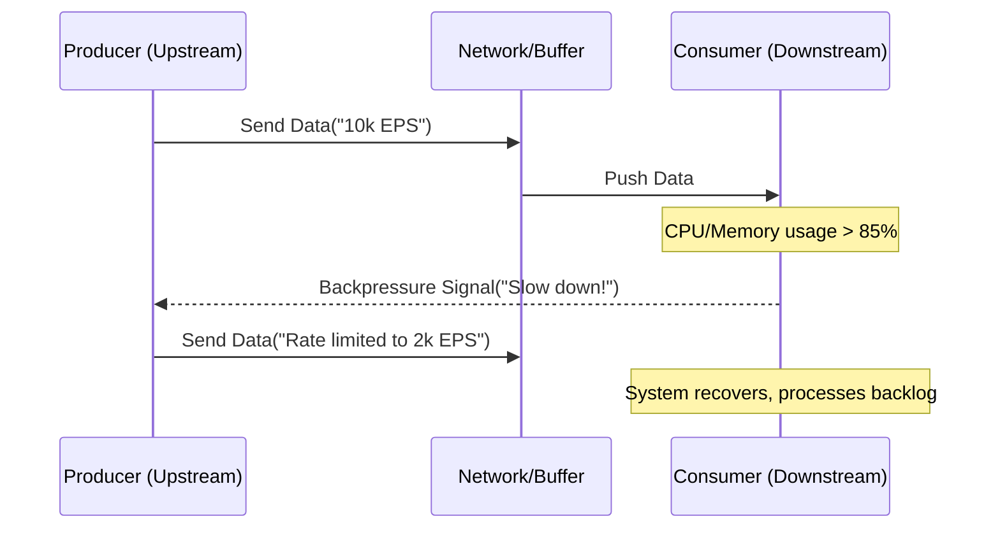

Trong các hệ thống phân tán quy mô lớn (Distributed Systems) và đặc biệt là hệ thống xử lý dữ liệu luồng (Stream Processing), lưu lượng dữ liệu hiếm khi tuyến tính. Các đợt bùng nổ lưu lượng (Traffic Spikes) do sự kiện Black Friday, push notification, hoặc lỗi retry-storm từ client có thể đẩy rate sinh dữ liệu (Ingestion Rate) lên gấp hàng chục lần công suất thiết kế.

Khi Producer đẩy dữ liệu nhanh hơn tốc độ tiêu thụ của Consumer, hệ thống hạ nguồn (Downstream) sẽ đối mặt với tình trạng cạn kiệt tài nguyên. **Backpressure** (Áp lực ngược) không chỉ là một cơ chế phòng thủ, nó là triết lý thiết kế bắt buộc (mandatory design philosophy) để đảm bảo tính sẵn sàng cao (High Availability) cho nền tảng dữ liệu.

---

## 1. Bản Chất của Backpressure

Nếu không có cơ chế kiểm soát luồng (Flow Control), một hệ thống ingestion ngây thơ (naive system) sẽ sụp đổ theo kịch bản "Death Spiral" (Vòng xoáy tử thần):

1. **Bộ đệm phình to (Buffer Bloat):** Consumer không xử lý kịp, dữ liệu bị dồn vào bộ nhớ (RAM/Heap).
2. **GC Pause (Stop-The-World):** Trong các ứng dụng JVM (Spark, Kafka, Flink), Heap đầy kích hoạt Garbage Collection liên tục, làm CPU spike lên 100% nhưng Throughput bằng 0.
3. **OOMKilled:** Tiến trình sụp đổ do Out-Of-Memory. 
4. **Cascading Failure:** Hệ thống orchestrator (ví dụ Kubernetes) restart lại pod, pod mới lên lại ngay lập tức bị lượng dữ liệu tồn đọng (backlog) đè bẹp và tiếp tục crash.

**Backpressure** giải quyết vấn đề này bằng cách thiết lập một kênh phản hồi (feedback loop) từ Downstream ngược lên Upstream: *"Tôi đang quá tải, hãy giảm tốc độ hoặc dừng gửi dữ liệu"*.



---

## 2. Các Chiến Lược (Systemic Strategies) Xử Lý Quá Tải

Là một Data Engineer, việc chọn chiến lược xử lý backpressure đòi hỏi bạn phải đánh đổi (Trade-offs) giữa Latency, Throughput và Data Completeness.

### 2.1. Pull-based Architecture (Implicit Backpressure)
Thay vì Upstream đẩy (push) dữ liệu xuống, Downstream sẽ chủ động kéo (pull) dữ liệu khi nó rảnh.
- **Cách hoạt động:** Sử dụng Message Broker làm bộ đệm bền vững (Durable Buffer) như Apache Kafka hoặc Amazon Kinesis.
- **Trade-off:** Chấp nhận tăng **Latency** (thời gian dữ liệu nằm trong queue) và chi phí lưu trữ (Storage Cost) để bảo vệ Downstream và giữ **Data Completeness** (Không mất dữ liệu).

### 2.2. Explicit Rate Limiting / Flow Control
Upstream và Downstream liên tục đàm phán về dung lượng khả dụng.
- **Cách hoạt động:** TCP Sliding Window, hoặc Credit-based flow control (như trong Apache Flink). Node nhận cấp cho node gửi một lượng "Credit" tương ứng với số buffer còn trống.
- **Trade-off:** Bảo vệ hệ thống một cách linh hoạt, nhưng có thể gây hiệu ứng nghẽn mạng dây chuyền ngược về phía Client (Cascading Backpressure).

### 2.3. Load Shedding (Vứt bỏ dữ liệu)
Khi hệ thống đối mặt với nguy cơ sập toàn tập, việc hy sinh một phần dữ liệu là cần thiết.
- **Cách hoạt động:** Drop các event có độ ưu tiên thấp (ví dụ: telemetry logs) để dồn tài nguyên xử lý các event quan trọng (ví dụ: billing/payment transactions).
- **Trade-off:** Ưu tiên **Availability** và **Latency** thay vì **Consistency/Completeness**.

---

## 3. Triển Khai Trong Các Framework Hiện Đại

### 3.1. Apache Kafka: Làm chủ Pull-model
Kafka sinh ra để làm shock-absorber (bộ giảm xóc) cho data pipeline. Consumer tự định đoạt tốc độ đọc thông qua các tham số cấu hình:

```yaml
# Cấu hình Kafka Consumer (Java/Spring)
spring:
  kafka:
    consumer:
      # Giới hạn số lượng records mỗi lần poll
      max-poll-records: 500
      # Giới hạn dung lượng tối đa mỗi phân vùng trả về (bytes)
      max-partition-fetch-bytes: 1048576 
      # Khoảng thời gian tối đa để xử lý xong 1 batch trước khi bị rebalance
      max-poll-interval-ms: 300000 
```
*Kỹ thuật:* Nếu downstream database bị chậm, bạn không thay đổi code Kafka, bạn chỉ cần giảm `max-poll-records` để ứng dụng không bị timeout và dính OOM.

### 3.2. Apache Flink: Credit-Based Flow Control
Flink là nền tảng streaming độ trễ thấp (low-latency). Thay vì dùng Kafka ở giữa các task, Flink TaskManagers giao tiếp trực tiếp qua network và sử dụng cơ chế **Credit-based Flow Control** để tránh TCP Head-of-line blocking.

```mermaid
graph LR
    subgraph TaskManager A("Upstream")
        S["Sender Task"] --> NB1["Network Buffers"]
    end
    subgraph TaskManager B("Downstream")
        NB2["Network Buffers"] --> R["Receiver Task"]
    end
    
    NB1 -- "Data("Deducts Credit") --> NB2
    NB2 -. "Send Credits("Announce capacity") .-> NB1
```
Mỗi khi TaskManager B xử lý xong dữ liệu và giải phóng buffer, nó gửi "Credits" cho TaskManager A. TaskManager A chỉ gửi dữ liệu khi số Credit > 0. Nếu B quá tải, Credit = 0, A sẽ ngưng gửi (Backpressured).

### 3.3. Apache Spark Streaming: Dynamic PID Controller
Trong Structured Streaming, Spark có thể tự động điều chỉnh tốc độ Ingestion nhờ vào thuật toán PID (Proportional-Integral-Derivative) controller, đánh giá thời gian xử lý của các micro-batch trước đó.

```scala
// Bật cấu hình Backpressure trong Spark
val spark = SparkSession.builder
  .appName("ResilientStreamingApp")
  .config("spark.streaming.backpressure.enabled", "true")
  // Giới hạn tốc độ khởi điểm để hệ thống không bị ngợp ở batch đầu tiên
  .config("spark.streaming.backpressure.initialRate", "5000") 
  // Giới hạn trần tốc độ cho Kafka
  .config("spark.streaming.kafka.maxRatePerPartition", "10000")
  .getOrCreate()
```

---

## 4. Troubleshooting & Real-world Incidents

### Incident 1: Elasticsearch "Too Many Requests" (HTTP 429) kéo sập Data Ingestion
**Ngữ cảnh:** Hệ thống Flink đọc từ Kafka và ghi vào Elasticsearch (ES). ES bị quá tải IOPS do spike indexing, bắt đầu trả về HTTP 429.
**Triệu chứng:**
1. Flink Sink nhận 429, thực hiện Exponential Backoff Retry.
2. Thread bị block, Flink ngưng cấp Credit cho upstream task.
3. Backpressure lan ngược lên source (Kafka Consumer).
4. Consumer Lag trong Kafka tăng vọt (hàng triệu messages).
**Giải quyết:** 
- **Ngắn hạn:** Scale-out ES cluster hoặc tăng `index.refresh_interval` trên ES để giảm I/O.
- **Dài hạn (Kiến trúc):** Đưa Dead Letter Queue (DLQ) vào. Nếu ES từ chối sau 3 lần retry, đẩy message lỗi vào S3/Kafka DLQ để xử lý sau (Load Shedding), giữ cho pipeline chính tiếp tục trôi.

### Giám sát (Monitoring) Backpressure
Staff Engineer không chờ hệ thống sập mới debug. Các metrics bắt buộc phải có trên Grafana/Datadog:
- **Kafka Consumer Lag:** Số lượng messages chưa được xử lý. Cảnh báo (Alert) nếu đường xu hướng (trend) tăng liên tục trong 15 phút.
- **Flink `isBackPressured` metric:** Nếu Task báo > 50% thời gian đang trong trạng thái backpressured, đó là dấu hiệu nghẽn cổ chai (bottleneck) tại node đó.
- **JVM Heap / GC Time:** Theo dõi `OOMKilled` và tỷ lệ thời gian CPU dành cho Garbage Collection (> 10% là hệ thống đang chật vật).
- **Dropped Metrics:** Tracking tỷ lệ dữ liệu bị chủ động loại bỏ bởi Load Shedder.

---

## 5. Kết Luận
Thiết kế hệ thống Ingestion chịu lỗi (Fault-Tolerant) là phải giả định rằng mọi downstream đều có thể và sẽ bị chậm. Cơ chế Backpressure biến một kịch bản "thảm họa sụp đổ dây chuyền" thành một sự "suy giảm hiệu năng có kiểm soát" (graceful degradation). Bằng việc tinh chỉnh bộ đệm, flow control, và áp dụng load shedding hợp lý, bạn đảm bảo được Data Platform của mình luôn "sống sót" qua những đợt sóng dữ liệu khắc nghiệt nhất.

---

## Nguồn Tham Khảo (References)
* [Netflix Tech Blog: Mantis - A Stream Processing System](https://netflixtechblog.com/)
* [Apache Flink Documentation: Network Flow Control and Backpressure](https://flink.apache.org/2019/07/23/flink-network-stack-2.html)
* [Databricks: Understanding Spark Streaming Backpressure](https://www.databricks.com/blog/2015/11/12/introducing-backpressure-in-apache-spark.html)
* [AWS Architecture Blog: Decoupling Microservices with Queues](https://aws.amazon.com/blogs/architecture/)
* **Designing Data-Intensive Applications** - Martin Kleppmann (Chương 11: Stream Processing)
