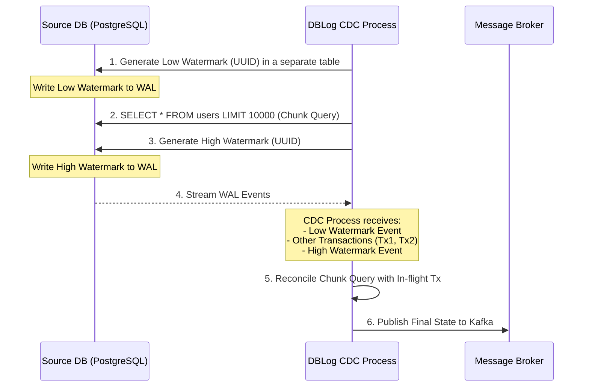
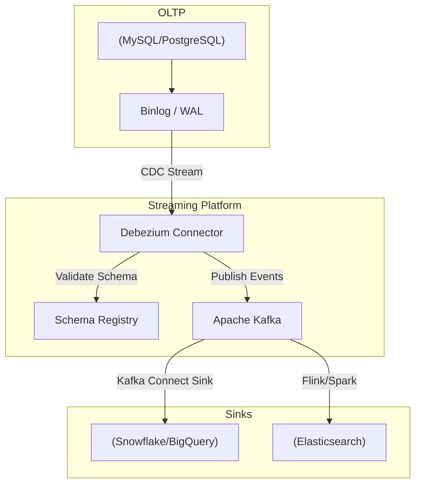

Trong các hệ thống phân tán (Distributed Systems) hiện đại, việc sử dụng chung một database duy nhất là điều bất khả thi (nguyên lý Polyglot Persistence). Dữ liệu được tạo ra ở hệ thống OLTP (PostgreSQL, MySQL) nhưng cần được phân phối đến Search Engine (Elasticsearch), Cache (Redis), và Data Warehouse/Lakehouse (Snowflake, Databricks). 

**Change Data Capture (CDC)** là cơ chế "bắt" các thay đổi dữ liệu (INSERT, UPDATE, DELETE) ở cấp độ bản ghi (row-level) và stream chúng đến các hệ thống hạ nguồn (downstream) với độ trễ (latency) tính bằng mili-giây.

Dưới góc nhìn của một Staff Engineer, CDC không phải là một "công cụ", mà là một **Pattern Kiến Trúc** cốt lõi để giải quyết bài toán Data Replication và Event-Driven Architecture.

---

## 1. Bản Chất Kỹ Thuật Của CDC (The Engineering Reality)

Phương pháp CDC hiện đại nhất dựa trên **Transaction Log (Log-based CDC)**. Thay vì query trực tiếp vào database, chúng ta parse các file log mà database dùng để đảm bảo tính ACID (như `binlog` trong MySQL hoặc `WAL` trong PostgreSQL).

### Tại sao Log-based CDC lại thống trị?
- **Lock-free (Không gây khoá bảng):** Việc đọc log xảy ra ở mức độ file system hoặc qua replication protocol, hoàn toàn cách ly với write-path của transaction chính.
- **Micro-batching / Streaming:** Cho phép hệ thống tiệm cận Real-time thay vì batch delay như query-based.
- **Bắt được Hard Deletes:** Query-based không thể biết một bản ghi đã bị xóa vật lý. Transaction log ghi nhận rõ event `DELETE`.

---

## 2. Systemic Trade-offs Trong Kiến Trúc CDC

Việc thiết kế hệ thống CDC đòi hỏi các quyết định đánh đổi (Trade-offs) khắt khe:

1. **Throughput vs. Latency:** Nếu batch size lớn, throughput sẽ cao nhưng latency tăng. Trong môi trường High-Frequency Trading hoặc Dynamic Pricing (như Uber), latency phải < 50ms, đòi hỏi flush data liên tục, gây tốn resource network/CPU.
2. **Exactly-Once vs. At-Least-Once Delivery:** Đa số các message broker (như Kafka) mặc định là At-Least-Once. Downstream (người tiêu thụ) **bắt buộc phải thiết kế Idempotent** (có thể chạy đi chạy lại một message mà trạng thái cuối không đổi, ví dụ dùng `UPSERT` thay vì `INSERT`).
3. **Snapshotting vs. Streaming:** Khi onboard một bảng mới, CDC cần kéo toàn bộ lịch sử (Initial Snapshot) trước khi stream các thay đổi mới (Log tailing). Quá trình snapshot truyền thống đòi hỏi Read Lock (như `FLUSH TABLES WITH READ LOCK` trong MySQL) gây downtime cho Write. 

---

## 3. Bài Toán Hóc Búa: Lock-Free Snapshotting & Kiến Trúc Netflix DBLog

Netflix gặp phải vấn đề nghiêm trọng với Snapshotting: database của họ quá lớn, việc lock table để snapshot gây downtime không thể chấp nhận được. Họ đã phát triển **DBLog** - một framework CDC với cơ chế **Watermark-based Snapshotting**.

### Cơ Chế Watermark của Netflix DBLog

Thay vì lock bảng, DBLog xen kẽ quá trình đọc Transaction Log và thực hiện SELECT các chunk dữ liệu.



**Nguyên lý:** Bằng cách ghi 2 watermark (Low và High) trực tiếp vào transaction log trước và sau khi query một block dữ liệu (Chunk), hệ thống có thể đối chiếu (reconcile) dữ liệu được select với các transaction đang bay (in-flight) trong khoảng thời gian đó để lấy ra trạng thái chuẩn nhất mà không cần bất kỳ lock nào.

---

## 4. Kiến Trúc Triển Khai Thực Tế

### 4.1. Kiến Trúc Tiêu Chuẩn (Debezium + Kafka)

Kiến trúc phổ biến nhất hiện nay sử dụng **Debezium** (chạy trên nền Kafka Connect).



### 4.2. Cấu Hình Thực Tế (Debezium JSON & Terraform)

Dưới đây là một cấu hình Debezium MySQL Connector production-grade, bao gồm xử lý schema registry và drop các tombstone events:

```json
{
  "name": "inventory-connector",
  "config": {
    "connector.class": "io.debezium.connector.mysql.MySqlConnector",
    "tasks.max": "1",
    "database.hostname": "mysql.internal.network",
    "database.port": "3306",
    "database.user": "debezium_user",
    "database.password": "${hidden}",
    "database.server.id": "184054",
    "database.server.name": "oltp_cluster",
    "database.include.list": "inventory",
    "table.include.list": "inventory.orders,inventory.customers",
    "schema.history.internal.kafka.bootstrap.servers": "kafka:9092",
    "schema.history.internal.kafka.topic": "schema-changes.inventory",
    "transforms": "unwrap",
    "transforms.unwrap.type": "io.debezium.transforms.ExtractNewRecordState",
    "transforms.unwrap.drop.tombstones": "false",
    "key.converter": "io.confluent.connect.avro.AvroConverter",
    "key.converter.schema.registry.url": "http://schema-registry:8081",
    "value.converter": "io.confluent.connect.avro.AvroConverter",
    "value.converter.schema.registry.url": "http://schema-registry:8081"
  }
}
```

Nếu dùng Managed Service trên Cloud như AWS MSK, mã Terraform để provision Kafka cluster:

```hcl
resource "aws_msk_cluster" "cdc_kafka" {
  cluster_name           = "production-cdc-cluster"
  kafka_version          = "3.4.0"
  number_of_broker_nodes = 3

  broker_node_group_info {
    instance_type   = "kafka.m5.large"
    ebs_volume_size = 1000
    client_subnets  = [aws_subnet.private_1.id, aws_subnet.private_2.id, aws_subnet.private_3.id]
    security_groups = [aws_security_group.msk_sg.id]
  }

  encryption_info {
    encryption_in_transit {
      client_broker = "TLS"
      in_cluster    = true
    }
  }
}
```

---

## 5. Thực Chiến: Incidents & Troubleshooting (War Stories)

Trong quá trình vận hành CDC ở quy mô hàng nghìn transactions/second, bạn sẽ gặp những sự cố kinh điển sau:

### Incident 1: Debezium OOMKilled (Out of Memory)
- **Nguyên nhân:** Một developer chạy câu lệnh `DELETE FROM orders WHERE created_at < '2020-01-01'` xóa 50 triệu bản ghi trong 1 transaction duy nhất. Debezium cố gắng parse toàn bộ transaction này vào bộ nhớ (RAM) trước khi commit lên Kafka, dẫn đến tràn RAM và Pod bị Kubernetes OOMKilled. Pod restart, lại đọc lại transaction đó, tạo thành vòng lặp crash (CrashLoopBackOff).
- **Cách khắc phục:** 
  1. Cấu hình Debezium `max.queue.size` và `max.batch.size` hợp lý.
  2. Bắt buộc rule ở phía OLTP: Các script xóa/update hàng loạt (bulk operations) phải chia nhỏ theo chunk (ví dụ: `LIMIT 10000`).

### Incident 2: Consumer Lag Bùng Nổ
- **Nguyên nhân:** Lượng traffic tăng đột biến (Spike) vào ngày Black Friday. Hệ thống target (như Snowflake) không kịp ingest dữ liệu từ Kafka, khiến Lag tăng lên hàng triệu messages. Dữ liệu real-time bị delay > 2 tiếng.
- **Cách khắc phục:** Tăng số lượng Partitions của Kafka topic. Kafka chỉ cho phép xử lý song song tối đa bằng số lượng partition. Tuy nhiên, thay đổi số lượng partition sẽ làm mất (break) thứ tự (ordering) của các bản ghi cùng một `id` (nếu không thiết kế key cẩn thận).

### Incident 3: Schema Evolution Breakage
- **Nguyên nhân:** DBA thực hiện lệnh `ALTER TABLE users DROP COLUMN phone_number`. Pipeline downstream đang mong đợi cột `phone_number` bị crash.
- **Cách khắc phục:** 
  - Tích hợp **Confluent Schema Registry** sử dụng định dạng Avro hoặc Protobuf. 
  - Áp dụng chính sách **Forward/Backward Compatibility**. Việc drop column phải được khai báo trên Registry trước, cập nhật code downstream, sau đó mới thực sự Drop ở Database (Multiple-phase rollout).

---

## Nguồn Tham Khảo (References)

1. [DBLog: A Watermark Based Change-Data-Capture Framework (Netflix Engineering)](https://netflixtechblog.com/dblog-a-generic-change-data-capture-framework-69351fb9099b)
2. [DBEvents: Uber's Standardized CDC Framework (Uber Blog)](https://www.uber.com/blog/dbevents/)
3. [Debezium Official Documentation & Architecture](https://debezium.io/documentation/reference/stable/architecture.html)
4. *Designing Data-Intensive Applications* - Martin Kleppmann (Chương: Derived Data)
5. Confluent Schema Registry Best Practices cho CDC
