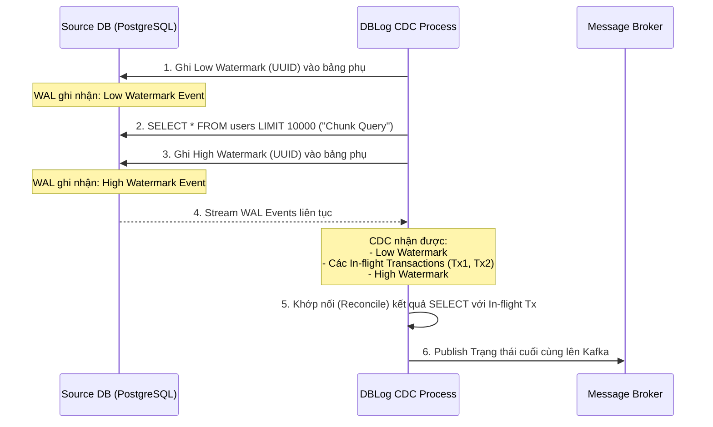
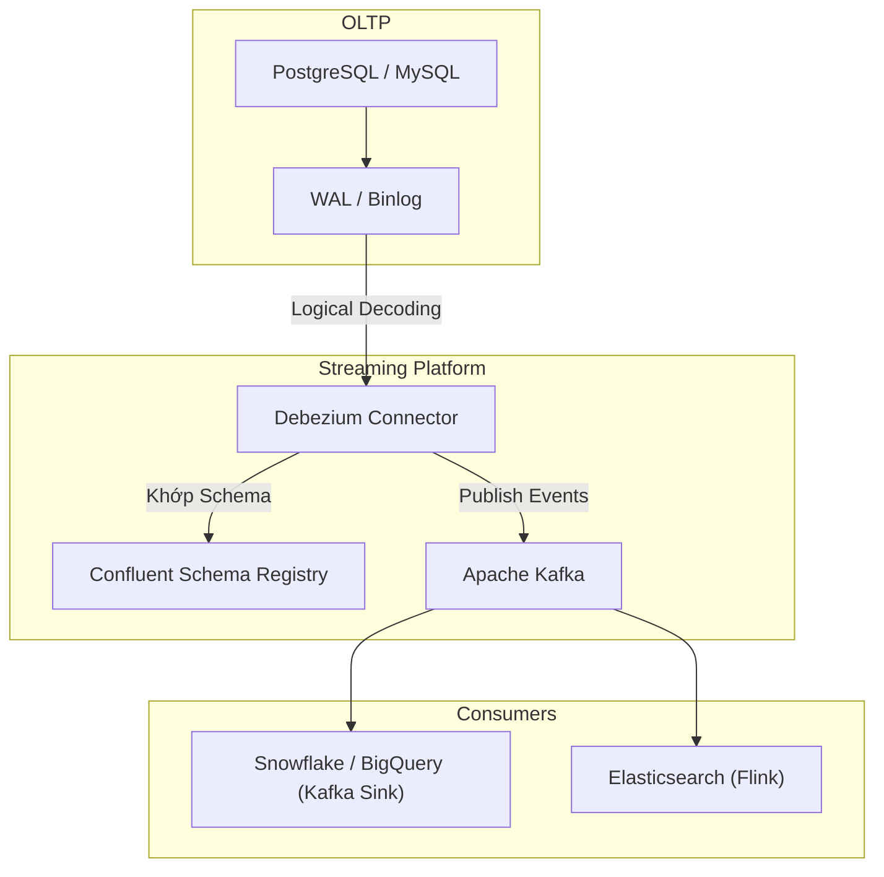

Trong các hệ thống phân tán (Distributed Systems) quy mô lớn, việc sử dụng chung một database duy nhất cho mọi tác vụ là điều bất khả thi (nguyên lý Polyglot Persistence). Dữ liệu được tạo ra ở hệ thống giao dịch OLTP (PostgreSQL, MySQL) nhưng cần được đồng bộ ngay lập tức đến Search Engine (Elasticsearch), Cache (Redis), và Data Warehouse (Snowflake, BigQuery) để phục vụ phân tích.

Làm thế nào để đồng bộ dữ liệu mà không làm chậm database chính? Câu trả lời là **Change Data Capture (CDC)**. CDC là cơ chế "bắt" các thay đổi dữ liệu (INSERT, UPDATE, DELETE) ở cấp độ bản ghi (row-level) và stream chúng đến các hệ thống hạ nguồn (downstream) với độ trễ (latency) tính bằng mili-giây.

Dưới góc nhìn của một Staff Engineer, CDC không phải là một "công cụ" (tool), mà là một **Pattern Kiến Trúc** cốt lõi để giải quyết bài toán Data Replication và Event-Driven Architecture.

---

## 1. Bản Chất Kỹ Thuật: Tại sao Log-based CDC thống trị?

Trước đây, người ta thường dùng kỹ thuật Query-based CDC (chạy lệnh `SELECT * FROM users WHERE updated_at > ?` mỗi 5 phút). Cách này rất tệ vì nó liên tục giã tải (Polling) vào database và không thể bắt được các sự kiện xóa vật lý (Hard Deletes).

CDC hiện đại dựa hoàn toàn vào **Transaction Log (Log-based CDC)**.
Mọi Relational Database đều có một tệp nhật ký để đảm bảo tính ACID và phục hồi sự cố:
- PostgreSQL gọi nó là **Write-Ahead Log (WAL)** (với cấu hình `wal_level = logical`).
- MySQL gọi nó là **Binlog**.

Thay vì query vào bảng dữ liệu, hệ thống CDC (như Debezium) sẽ giả lập làm một Replica Node (Nút sao chép) để đọc trực tiếp các tệp Log này ở tầng File System/Replication Protocol.

**Ưu điểm tuyệt đối:**
- **Lock-free (Không gây khoá bảng):** Hoàn toàn cách ly với Write-path của ứng dụng chính. Database của bạn không hề hay biết sự tồn tại của CDC.
- **Tiệm cận Real-time:** Dữ liệu được stream đi ngay khi transaction commit.
- **Bắt được mọi thao tác:** Nhận diện rõ ràng `INSERT`, `UPDATE` (kèm theo dữ liệu Before/After), và `DELETE`.

---

## 2. Systemic Trade-offs Trong Kiến Trúc CDC

Thiết kế hệ thống CDC là nghệ thuật của sự đánh đổi (Trade-offs):

1. **Exactly-Once vs. At-Least-Once Delivery:** Đa số các Message Broker (như Kafka) kết hợp với CDC thường cung cấp bảo đảm "At-Least-Once" (Gửi ít nhất 1 lần). Điều này có nghĩa là khi mạng bị lỗi, một sự kiện CDC có thể bị gửi đúp (Duplicate). Do đó, **luật bất thành văn**: Mọi Downstream Consumer phải được thiết kế Idempotent (Chạy đi chạy lại 1 sự kiện vẫn cho ra trạng thái cuối cùng không đổi - dùng `UPSERT` thay vì `INSERT`).
2. **Snapshotting vs. Streaming:** Khi bạn cài đặt CDC cho một bảng đã có sẵn 1 tỷ dòng, CDC phải kéo toàn bộ 1 tỷ dòng đó (Initial Snapshot) trước khi bắt đầu stream các thay đổi mới (Log Tailing). Quá trình Snapshot truyền thống đòi hỏi **Read Lock** (như `FLUSH TABLES WITH READ LOCK` trong MySQL) để đảm bảo tính nhất quán. Đối với database lớn, việc Lock bảng vài tiếng đồng hồ là không thể chấp nhận được (Gây Downtime toàn hệ thống).

---

## 3. Lời Giải Cho Bài Toán Snapshotting: Kiến Trúc Netflix DBLog

Netflix gặp phải bài toán Snapshotting khổng lồ. Họ đã phát triển **DBLog** - một framework CDC với cơ chế **Watermark-based Snapshotting** (Snapshot dựa trên Đánh dấu mực nước) hoàn toàn không cần Lock bảng.

### Cơ Chế Watermark của Netflix DBLog

Thay vì Lock bảng, DBLog xen kẽ quá trình đọc Transaction Log và thực hiện `SELECT` từng cụm (Chunk) dữ liệu.



**Nguyên lý siêu việt:** Bằng cách chủ động ghi 2 dấu (Low/High Watermark) thẳng vào Transaction Log, hệ thống CDC có thể gom các In-flight Transactions (các thay đổi xảy ra đồng thời lúc đang chạy `SELECT`) nằm giữa 2 dấu watermark này, sau đó áp dụng đè chúng lên kết quả `SELECT`. Kết quả cuối cùng là một bản Snapshot hoàn hảo mà không tốn một giây Lock bảng nào. Debezium hiện tại cũng đã áp dụng cơ chế Incremental Snapshotting tương tự.

---

## 4. Kiến Trúc Triển Khai Tiêu Chuẩn (Production Standard)

Kiến trúc "Trấn phái" hiện nay là sự kết hợp giữa **Debezium + Kafka Connect + Apache Kafka**.



### Cấu Hình Debezium PostgreSQL Thực Chiến (JSON)

Một cấu hình Debezium PostgreSQL trên Kafka Connect để chạy trên Production:

```json
{
  "name": "postgres-cdc-connector",
  "config": {
    "connector.class": "io.debezium.connector.postgresql.PostgresConnector",
    "tasks.max": "1",
    "database.hostname": "pg.internal.network",
    "database.port": "5432",
    "database.user": "debezium_cdc_user",
    "database.password": "${hidden}",
    "database.dbname": "production_db",
    "database.server.name": "oltp_prod_1",
    
    "plugin.name": "pgoutput",
    "table.include.list": "public.orders,public.payments",
    
    "slot.name": "debezium_slot",
    "publication.name": "debezium_publication",

    "key.converter": "io.confluent.connect.avro.AvroConverter",
    "key.converter.schema.registry.url": "http://schema-registry:8081",
    "value.converter": "io.confluent.connect.avro.AvroConverter",
    "value.converter.schema.registry.url": "http://schema-registry:8081",
    
    "transforms": "unwrap",
    "transforms.unwrap.type": "io.debezium.transforms.ExtractNewRecordState",
    "transforms.unwrap.drop.tombstones": "false"
  }
}
```

---

## 5. Thực Chiến: Incidents & Troubleshooting [War Stories]

Triển khai CDC trên giấy thì dễ, nhưng vận hành ở Scale hàng nghìn Transactions/second, bạn sẽ đối mặt với các sự cố sinh tử sau:

### Incident 1: Nổ Đĩa Máy Chủ Database (WAL Disk Full)
- **Triệu chứng:** Máy chủ PostgreSQL báo động xám (P0 Incident) vì ổ đĩa đầy 100%. Database ngừng tiếp nhận Write.
- **Nguyên nhân (Root Cause):** Debezium/Kafka Connect bị crash, hoặc Consumer bị nghẽn mạng không kéo được dữ liệu. PostgreSQL sử dụng cơ chế Replication Slot: Nếu CDC Consumer chưa xác nhận (Ack) đã đọc Log, PostgreSQL sẽ không bao giờ xóa file WAL đó đi. Hậu quả là WAL file tích tụ lại hàng trăm GB cho đến khi nổ ổ đĩa.
- **Khắc phục:** Cài đặt Alert cực kỳ khắt khe trên Cloudwatch/Datadog cho metric `replication_slot_lag_bytes`. Đặt tham số bảo vệ `max_slot_wal_keep_size` trong Postgres (nếu WAL vượt quá giới hạn này, Postgres sẽ chủ động hy sinh Replication Slot để cứu sống Database chính).

### Incident 2: Debezium OOMKilled do Bulk Operation
- **Triệu chứng:** Debezium Pod bị Kubernetes `OOMKilled` (Exit code 137). Pod restart, lại bị kill tiếp (CrashLoopBackOff).
- **Nguyên nhân:** Một ông tướng Backend Engineer chạy lệnh `DELETE FROM logs WHERE created_at < '2022-01-01'`, xóa 100 triệu dòng trong 1 transaction duy nhất. Debezium cố gắng parse toàn bộ transaction 100 triệu dòng này vào RAM (Heap memory) trước khi đẩy lên Kafka. Hệ quả: Tràn RAM chết tươi.
- **Khắc phục:** 
  - Cấu hình lại Debezium giới hạn `max.queue.size` và `max.batch.size`.
  - Ban hành Rule hệ thống: Nghiêm cấm chạy Bulk Update/Delete trên OLTP Database. Mọi script xóa dữ liệu phải chia nhỏ (Chunking) theo ID (VD: `LIMIT 5000`).

### Incident 3: Gãy Đổ Do Schema Drift (Lệch Cấu Trúc)
- **Triệu chứng:** DBA `ALTER TABLE users DROP COLUMN phone_number`. Pipeline downstream đẩy vào Data Warehouse bị Crash hàng loạt.
- **Khắc phục:** Áp dụng **Confluent Schema Registry** với định dạng Avro/Protobuf. Bắt buộc thiết lập chính sách **Forward/Backward Compatibility**. Việc thay đổi Schema ở Database phải được khai báo trên Registry trước, cập nhật code Downstream, sau đó mới thực sự Drop ở DB (Multiple-phase Rollout).

---

## Nguồn Tham Khảo (References)

- [DBLog: A Generic Change-Data-Capture Framework - Netflix Technology Blog](https://netflixtechblog.com/dblog-a-generic-change-data-capture-framework-69351fb9099b)
- [Debezium Official Architecture Documentation](https://debezium.io/documentation/reference/stable/architecture.html)
- [Uber Engineering: DBEvents - Standardized CDC](https://www.uber.com/blog/dbevents/)
- *Designing Data-Intensive Applications* - Martin Kleppmann (Chương 11: Derived Data & Log-based Message Brokers).
