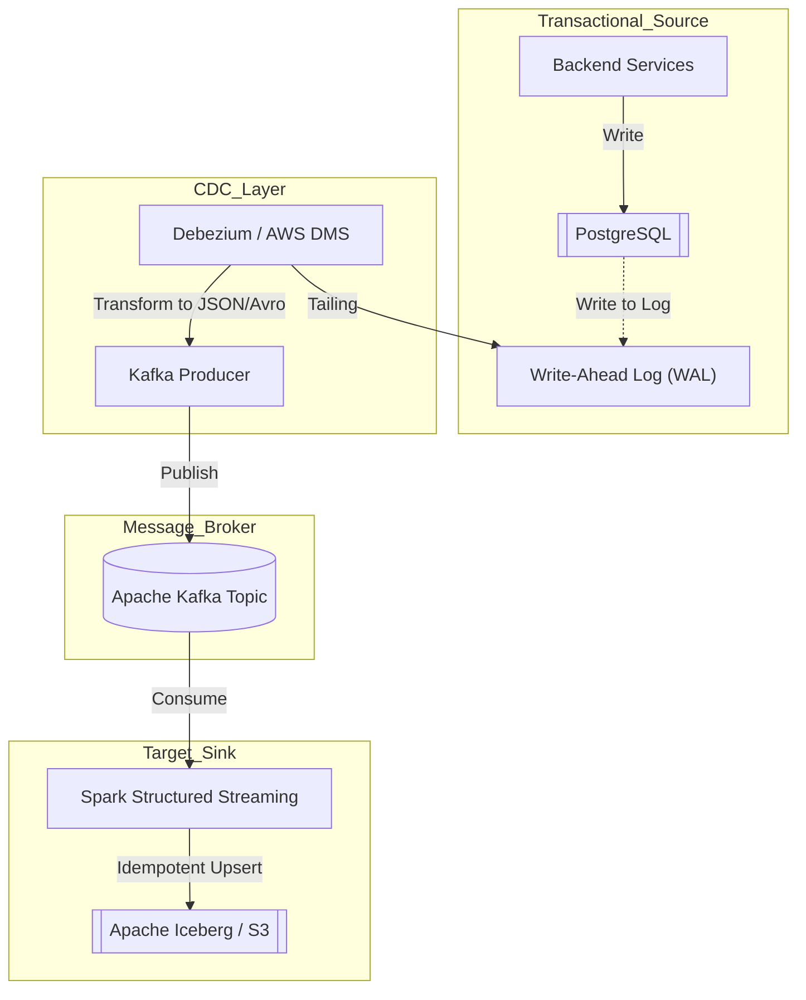

Data Ingestion không chỉ đơn thuần là việc viết vài dòng script Python (như Airbyte, Fivetran hay các tool kéo-thả) để sao chép dữ liệu từ điểm A sang điểm B. Dưới góc nhìn của một Staff Data Engineer, Data Ingestion là bài toán xây dựng các hệ thống phân tán (Distributed Systems) có khả năng chịu lỗi (Fault-tolerant), đảm bảo tính lũy đẳng (Idempotency), và tối ưu hóa tài nguyên vi mô dưới áp lực của hàng triệu sự kiện mỗi giây (events per second).

Nếu Data Ingestion được thiết kế tồi, Data Lake của bạn sẽ nhanh chóng biến thành Data Swamp (Đầm lầy dữ liệu) ngập ngụa trong dữ liệu rác, trùng lặp và độ trễ không thể kiểm soát.

## 1. Phân loại Mô hình Thu nạp Dữ liệu (Ingestion Paradigms)

Kiến trúc thu nạp dữ liệu được chia làm 2 trường phái chính, phục vụ cho các SLA (Service-Level Agreement) hoàn toàn khác nhau.

### 1.1. Batch Ingestion (Thu nạp theo lô)
Batch processing xử lý một khối lượng lớn dữ liệu đóng khung (Bounded data) theo từng chu kỳ thời gian (Hourly, Daily).
*   **Cơ chế:** Thường sử dụng phương thức kéo (Pull-based). Orchestrator (như Apache Airflow, Dagster) sẽ kích hoạt các Worker để quét cơ sở dữ liệu nguồn thông qua các câu lệnh `SELECT` lớn.
*   **Trade-off (Đánh đổi):** Tối ưu hóa được băng thông mạng (Network I/O) vì dữ liệu được nén lại thành khối lớn. Đổi lại, độ trễ rất cao (High latency). Nếu hệ thống nguồn không có Index tốt, các câu lệnh Query-based CDC (dựa trên cột `updated_at`) có thể gây ra hiện tượng Full Table Scan, làm sập Database của team Backend.

### 1.2. Streaming Ingestion (Thu nạp thời gian thực)
Xử lý chuỗi sự kiện liên tục, không có điểm dừng (Unbounded stream).
*   **Cơ chế:** Đẩy (Push-based) qua các Event Brokers trung gian như Apache Kafka, Amazon Kinesis, hoặc Google Pub/Sub.
*   **Trade-off:** Mang lại độ trễ cực thấp (Sub-second latency) để phục vụ Real-time Analytics. Nhưng đổi lại, kiến trúc hạ tầng cực kỳ phức tạp. Bạn phải quản lý State (trạng thái), xử lý Late-arriving data (dữ liệu đến trễ) qua cơ chế Watermarks và đối mặt với rủi ro Consumer Lag tăng vọt.

## 2. Nghệ thuật Change Data Capture (CDC)

Đối với các hệ thống Transactional Database (MySQL, PostgreSQL), việc dùng Batch Ingestion (chạy `SELECT * FROM table WHERE updated_at > ?`) là một "Anti-pattern" chết người khi bảng đạt kích thước hàng tỷ dòng. Giải pháp Enterprise duy nhất là **Log-based CDC**.

Kỹ thuật này khai thác nhật ký thay đổi của hệ thống (Transaction Log Mining, ví dụ: MySQL Binlog, PostgreSQL WAL) để phát luồng (stream) các thay đổi ở cấp độ dòng (Row-level mutations: `INSERT`, `UPDATE`, `DELETE`) với tác động tiệm cận 0 (Zero-impact) lên hiệu năng của Database nguồn.



**Mã nguồn Thực chiến: Khai báo Debezium Connector (JSON)**
Để ingest từ PostgreSQL vào Kafka một cách an toàn mà không làm treo Replication Slot, chúng ta cấu hình Debezium như sau:
```json
{
  "name": "inventory-connector",
  "config": {
    "connector.class": "io.debezium.connector.postgresql.PostgresConnector",
    "database.hostname": "postgres-prod.internal",
    "database.port": "5432",
    "database.user": "cdc_user",
    "database.password": "secret",
    "database.dbname": "inventory",
    "database.server.name": "prod_server",
    "plugin.name": "pgoutput",
    "slot.name": "debezium_slot",
    "publication.name": "dbz_publication",
    "table.include.list": "public.orders, public.customers",
    "snapshot.mode": "initial",
    "heartbeat.interval.ms": "5000"
  }
}
```
*Lưu ý: Thuộc tính `heartbeat.interval.ms` cực kỳ quan trọng để giữ cho WAL không bị phình to vô hạn khi hệ thống ít có transaction mới.*

## 3. Các Thỏa hiệp Hệ thống (Systemic Trade-offs)

Thiết kế Ingestion ở quy mô lớn là nghệ thuật của việc đánh đổi.

### 3.1. Latency vs. Throughput (Trong hệ sinh thái Kafka)
Bạn không thể có cả độ trễ bằng 0 và thông lượng vô cực.
- **Tối ưu Throughput:** Tăng `batch.size` (ví dụ 64KB) và `linger.ms` (ví dụ 50ms) trên Kafka Producer. Hệ thống sẽ chờ 50ms để gom đủ một lô dữ liệu trước khi nén và truyền đi. Điều này giảm thiểu TCP requests, tối ưu hóa I/O, nhưng tăng độ trễ (Latency).
- **Tối ưu Latency:** Đặt `linger.ms = 0` để gửi event ngay lập tức. Đổi lại, việc tạo ra hàng triệu Network Request nhỏ lẻ sẽ gây nghẽn cổ chai CPU ở Broker và làm sập Throughput.

### 3.2. Delivery Semantics (Tính toàn vẹn Dữ liệu)
Khi xảy ra sự cố gián đoạn mạng (Network Partition), pipeline buộc phải chọn:
- **At-Least-Once (Availability):** Producer vẫn gửi message và Consumer vẫn nhận dù một số Broker Replicas rớt mạng. Hệ thống không bao giờ sập, nhưng dữ liệu có thể bị gửi trùng (Duplicates). Hệ thống Sink bắt buộc phải có cơ chế Lũy đẳng (Idempotent MERGE).
- **Exactly-Once (Consistency):** Cấu hình `acks=all` trên Producer. Khi có sự cố, hệ thống từ chối Write requests (hy sinh Availability) cho đến khi số lượng Replicas đạt Quorum. Dữ liệu tuyệt đối an toàn.

## 4. Xử lý sự cố thực tế (Troubleshooting Incidents)

### Incident 1: Tràn RAM (OOMKilled) khi Backfill lịch sử
**Ngữ cảnh:** Airflow kích hoạt một task Python lấy lại dữ liệu 50 triệu dòng của bảng `Users` từ PostgreSQL để nạp vào BigQuery. Script sử dụng `cursor.fetchall()` đưa toàn bộ Query Result vào RAM (List) trước khi ghi ra tệp CSV. Kubernetes Pod cạn kiệt bộ nhớ và lập tức bị hệ điều hành tiêu diệt (OOMKilled).
**Khắc phục:** Tuyệt đối không load Dataframe khổng lồ vào RAM. Áp dụng Server-side Cursors và Python Generators (`yield`) để Stream dữ liệu theo từng Chunk nhỏ 10,000 dòng, đẩy trực tiếp xuống đĩa hoặc S3.

```python
import psycopg2

def fetch_data_in_chunks(conn_string, query, chunk_size=10000):
    with psycopg2.connect(conn_string) as conn:
        # Sử dụng Server-side cursor để tiết kiệm RAM trên Client Pod
        with conn.cursor(name='server_side_cursor') as cur:
            cur.itersize = chunk_size
            cur.execute(query)
            while True:
                records = cur.fetchmany(chunk_size)
                if not records:
                    break
                yield records # Trả về từng chunk thay vì toàn bộ
```

### Incident 2: Consumer Lag tăng vọt mất kiểm soát
**Ngữ cảnh:** Lượng Traffic Black Friday tăng vọt, Kafka Topic nhận lượng event gấp 10 lần. Nhóm Consumer insert từng dòng (Single-record Insert) vào Data Warehouse không xử lý kịp khiến Consumer Lag lên đến hàng giờ.
**Khắc phục:** Thay đổi logic Consumer sang thiết kế **Micro-batching**. Thay vì insert từng dòng, Consumer gom 5000 events thành một DataFrame và thực hiện Bulk Upsert bằng `MERGE`.

```sql
-- Micro-batching Idempotent Upsert cho Data Warehouse (Snowflake / BigQuery / Iceberg)
MERGE INTO target_orders AS T
USING staging_orders_batch AS S
ON T.order_id = S.order_id
WHEN MATCHED THEN 
  UPDATE SET 
    T.status = S.status, 
    T.updated_at = S.updated_at
WHEN NOT MATCHED THEN 
  INSERT (order_id, customer_id, status, updated_at) 
  VALUES (S.order_id, S.customer_id, S.status, S.updated_at);
```

## 5. Cơ sở hạ tầng dưới dạng Mã (Infrastructure as Code)

Để tự động hóa việc thu nạp CDC thay vì cấu hình thủ công dễ gây lỗi, một Staff Engineer sẽ dùng Terraform để triển khai AWS Database Migration Service (DMS) đẩy dữ liệu từ RDS sang Kinesis Data Streams.

```hcl
resource "aws_dms_endpoint" "source_postgres" {
  endpoint_id                 = "source-postgres-prod"
  endpoint_type               = "source"
  engine_name                 = "postgres"
  server_name                 = var.db_host
  port                        = 5432
  database_name               = "core_db"
  username                    = "dms_user"
  password                    = var.db_password
}

resource "aws_dms_endpoint" "target_kinesis" {
  endpoint_id                 = "target-kinesis-stream"
  endpoint_type               = "target"
  engine_name                 = "kinesis"
  kinesis_settings {
    message_format          = "JSON"
    stream_arn              = aws_kinesis_stream.cdc_stream.arn
    service_access_role_arn = aws_iam_role.dms_kinesis_role.arn
  }
}

resource "aws_dms_replication_task" "cdc_task" {
  replication_task_id      = "postgres-to-kinesis-cdc"
  migration_type           = "cdc" # Chỉ thực hiện Change Data Capture
  table_mappings           = file("table_mappings.json")
  replication_instance_arn = aws_dms_replication_instance.dms_instance.arn
  source_endpoint_arn      = aws_dms_endpoint.source_postgres.arn
  target_endpoint_arn      = aws_dms_endpoint.target_kinesis.arn
}
```

## 6. Nguồn Tham Khảo [References]
- [AWS Database Blog: Stream changes from Amazon RDS for PostgreSQL using Amazon Kinesis Data Streams](https://aws.amazon.com/blogs/database/stream-changes-from-amazon-rds-for-postgresql-using-amazon-kinesis-data-streams-and-aws-lambda/)
- [AWS Documentation: Using an Amazon Kinesis data stream as a target for AWS DMS](https://docs.aws.amazon.com/dms/latest/userguide/CHAP_Target.Kinesis.html)
- Kleppmann, M. (2017). *Designing Data-Intensive Applications*. O'Reilly Media.
- [Debezium Documentation: PostgreSQL Connector](https://debezium.io/documentation/reference/connectors/postgresql.html)
