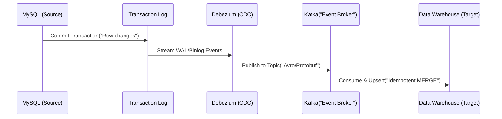

Data Ingestion không chỉ đơn thuần là việc sao chép dữ liệu từ điểm A sang điểm B. Ở cấp độ thiết kế Staff Engineer, Data Ingestion là bài toán xây dựng các hệ thống phân tán (Distributed Systems) có khả năng chịu lỗi (Fault-tolerant), đảm bảo tính lũy đẳng (Idempotency), và quản lý tài nguyên vi mô tối ưu dưới áp lực của hàng triệu sự kiện mỗi giây (events per second).

Bài viết này đi sâu vào kiến trúc cốt lõi, những thỏa hiệp hệ thống (Systemic Trade-offs) và các phương pháp xử lý sự cố thực tế (Real-world Incidents) khi vận hành Data Ingestion pipelines quy mô lớn.

## 1. Phân loại Mô hình Thu nạp Dữ liệu (Ingestion Paradigms)

### 1.1. Batch Ingestion (Thu nạp theo lô)
Batch processing xử lý một khối lượng lớn dữ liệu đóng khung (Bounded data) được định nghĩa trước bởi khoảng thời gian hoặc kích thước tệp.
*   **Cơ chế:** Thường sử dụng phương thức kéo (Pull-based) định kỳ theo lịch trình (Cron-based triggers) hoặc dựa vào sự kiện (Event-driven orchestration).
*   **Đặc điểm:** Tối ưu hóa băng thông mạng và I/O của đĩa (Disk I/O). Tận dụng tối đa sức mạnh tính toán (Compute) trong thời gian thấp điểm (Off-peak hours).
*   **Thách thức:** Độ trễ cao (High latency). Có nguy cơ xảy ra lỗi dữ liệu lệch (Data Skew) dẫn đến tràn bộ nhớ (OOMKilled) nếu hệ thống không được cấu hình phân tách (Chunking) đúng cách.

### 1.2. Streaming Ingestion (Thu nạp thời gian thực)
Xử lý chuỗi sự kiện liên tục, không có điểm dừng (Unbounded stream).
*   **Cơ chế:** Đẩy (Push-based) hoặc Pub/Sub qua các Event Brokers (Apache Kafka, Amazon Kinesis, Google Pub/Sub).
*   **Đặc điểm:** Độ trễ thấp (Sub-second latency), cho phép phản ứng ngay lập tức với các sự kiện kinh doanh.
*   **Thách thức:** Cực kỳ phức tạp trong vận hành. Đòi hỏi kỹ thuật quản lý luồng dữ liệu trễ (Late-arriving data) qua cơ chế Watermarks, và kiểm soát độ trễ tiêu thụ (Consumer Lag).

### 1.3. Change Data Capture (CDC)
Kỹ thuật khai thác nhật ký thay đổi của hệ thống lưu trữ (Transaction Log Mining, ví dụ: MySQL Binlog, PostgreSQL WAL) để phát luồng (stream) các thay đổi ở cấp độ dòng (Row-level mutations: INSERT, UPDATE, DELETE) theo thời gian thực với tác động tiệm cận 0 (Zero-impact) lên Database nguồn.



## 2. Các Thỏa hiệp Hệ thống (Systemic Trade-offs)

Thiết kế Ingestion ở quy mô lớn là nghệ thuật của việc đánh đổi. Không có kiến trúc hoàn hảo, chỉ có thiết kế phù hợp với SLA (Service-Level Agreement) của doanh nghiệp.

### 2.1. Latency vs. Throughput (Độ trễ vs. Thông lượng)
Trong các Event Brokers như Kafka, bạn không thể đạt được cả độ trễ thấp nhất và thông lượng cao nhất cùng lúc:
- **Tối ưu Throughput:** Tăng `batch.size` và `linger.ms` trên Kafka Producer. Hệ thống sẽ chờ lâu hơn để gom đủ một lô dữ liệu trước khi nén và truyền qua mạng, làm tăng Latency nhưng lại tăng cường hiệu năng I/O đáng kể.
- **Tối ưu Latency:** Cài đặt `linger.ms = 0` để gửi event ngay lập tức. Đổi lại, việc này tạo ra quá tải các request mạng nhỏ lẻ (Network I/O overhead), làm giảm Throughput trầm trọng và gây nghẽn Broker.

### 2.2. Consistency vs. Availability (Định lý CAP)
Khi xảy ra sự cố gián đoạn mạng (Network Partition), pipeline Ingestion buộc phải ưu tiên:
- **Tối ưu Availability (At-Least-Once):** Producer vẫn gửi message và Consumer vẫn nhận dù một số Broker Replicas mất kết nối. Đổi lại, bạn chấp nhận dữ liệu có thể bị gửi trùng (Duplicates), phá vỡ Consistency trừ khi hệ thống đích (Sink) là thiết kế hoàn toàn Lũy đẳng (Idempotent).
- **Tối ưu Consistency (Exactly-Once):** Cấu hình `acks=all` trên Producer và yêu cầu cơ chế Exactly-Once Semantics qua 2-Phase Commit (2PC). Khi có sự cố, hệ thống chặn Write requests (hy sinh Availability) cho đến khi số lượng Replicas đạt Quorum, đảm bảo không event nào bị mất hay lặp lại.

### 2.3. Compute vs. Storage Cost (Chi phí Xử lý vs. Lưu trữ)
Để giảm chi phí lưu trữ và tăng tốc độ chuyển qua mạng, dữ liệu Ingestion thường được nén (Zstandard, Snappy) và mã hóa sang dạng Columnar (Parquet/ORC). Tuy nhiên, Compute Node (EC2, Spark Workers) sẽ phải gánh thêm chi phí CPU nặng nề cho quá trình tuần tự hóa/giải tuần tự hóa (Serialization/Deserialization). Khi RAM cạn kiệt, dữ liệu sẽ bị ép ghi tạm xuống ổ cứng (Spill-to-disk), gây ra tình trạng nghẽn I/O (Disk thrashing).

## 3. Real-world Incidents & Troubleshooting (Xử lý sự cố thực tế)

### Incident 1: Tràn RAM (OOMKilled) khi Backfill quy mô lớn
**Ngữ cảnh:** Airflow kích hoạt một task Python lấy lại dữ liệu 50 triệu dòng của bảng Users từ PostgreSQL để nạp vào BigQuery. Script sử dụng `fetchall()` đưa toàn bộ Query Result vào RAM (List) trước khi ghi ra tệp định dạng CSV. Kubernetes Pod cạn kiệt bộ nhớ và lập tức bị kill bởi OS (OOMKilled).
**Khắc phục:** Tuyệt đối không load Dataframe khổng lồ vào RAM. Áp dụng Server-side Cursors và Python Generators (`yield`) để Stream dữ liệu theo từng Chunk nhỏ, đẩy trực tiếp xuống đĩa.

```python
import psycopg2
import csv

def fetch_data_in_chunks(conn, query, chunk_size=10000):
    # Sử dụng Server-side cursor để tiết kiệm Client RAM
    with conn.cursor(name='server_side_cursor') as cur:
        cur.itersize = chunk_size
        cur.execute(query)
        while True:
            records = cur.fetchmany(chunk_size)
            if not records:
                break
            yield records

def export_to_csv():
    conn = psycopg2.connect(dsn="...")
    with open('users_dump.csv', 'w') as f:
        writer = csv.writer(f)
        for chunk in fetch_data_in_chunks(conn, "SELECT * FROM users"):
            writer.writerows(chunk)
```

### Incident 2: Retry Storms làm sập Third-party API
**Ngữ cảnh:** Hệ thống gọi API của SaaS để pull dữ liệu. API trả về lỗi `HTTP 429 Too Many Requests`. Cơ chế lỗi thời của Ingestion Script liên tục retry 500 requests không khoảng nghỉ, tạo ra một cơn bão Retries (Retry Storm), khiến Load Balancer của SaaS khóa hoàn toàn dải IP công ty.
**Khắc phục:** Implement thuật toán **Exponential Backoff with Jitter** (Chờ theo cấp số nhân cộng thêm một độ nhiễu ngẫu nhiên) để "làm mềm" áp lực phục hồi lên các dịch vụ đích.

### Incident 3: Consumer Lag tăng vọt mất kiểm soát
**Ngữ cảnh:** Lượng Traffic Black Friday tăng vọt, Kafka Topic `orders` nhận lượng event gấp 10 lần. Nhóm Kafka Consumers không xử lý kịp khiến độ trễ (Consumer Lag) lên đến hàng giờ.
**Khắc phục:** 
1. Tạm thời tăng số lượng Partitions (Lưu ý: Không thể giảm Partition sau đó).
2. Scale-out số node Consumer sao cho tương đương số Partitions. 
3. Nếu Database đích (Sink) xử lý ghi (Write I/O) quá chậm, thay đổi logic Consumer từ Single-record Insert sang thiết kế **Micro-batching** sử dụng `MERGE` statement.

```sql
-- Micro-batching Idempotent Upsert cho Data Warehouse (Snowflake / BigQuery)
MERGE INTO target_orders AS T
USING staging_orders_batch AS S
ON T.order_id = S.order_id
WHEN MATCHED THEN 
  UPDATE SET 
    T.status = S.status, 
    T.updated_at = S.updated_at
WHEN NOT MATCHED THEN 
  INSERT (order_id, customer_id, status, updated_at) 
  VALUES (S.order_id, S.customer_id, S.status, S.updated_at);
```

## 4. Cơ sở hạ tầng dưới dạng Mã (Infrastructure as Code)

Mọi thành phần trong kiến trúc Data Ingestion (Event Brokers, Connectors, DWH) đều phải được quản lý khai báo (Declarative). Đây là cấu hình Terraform kinh điển cho một cụm AWS MSK (Managed Streaming for Apache Kafka) với khối lượng ổ cứng đủ sâu để tránh Spill-to-disk quá tải:

```hcl
resource "aws_msk_cluster" "ingestion_cluster" {
  cluster_name           = "core-data-ingestion"
  kafka_version          = "3.5.1"
  number_of_broker_nodes = 3

  broker_node_group_info {
    instance_type   = "kafka.m5.large"
    ebs_volume_size = 2000 # 2TB/Broker cho High-throughput & Data retention dài ngày
    client_subnets = [
      aws_subnet.private_a.id,
      aws_subnet.private_b.id,
      aws_subnet.private_c.id,
    ]
    security_groups = [aws_security_group.kafka_sg.id]
  }

  configuration_info {
    arn      = aws_msk_configuration.kafka_config.arn
    revision = aws_msk_configuration.kafka_config.latest_revision
  }
}
```

## 5. Kết luận

Data Ingestion trong thực tế doanh nghiệp không đơn giản là các tool low-code "Kéo - Thả". Phía sau một pipeline ổn định 99.99% SLA là kiến thức sâu sắc về Hệ thống phân tán, xử lý I/O Bottlenecks, và tinh thần vận hành phòng thủ (Defensive Engineering). Hãy luôn kiến trúc Ingestion với giả định tồi tệ nhất: Network sẽ chia cắt, Database sẽ timeout, và Memory sẽ tràn.

## Nguồn Tham Khảo (References)
* [AWS Architecture Blog: Designing robust data ingestion pipelines](https://aws.amazon.com/blogs/architecture/)
* [AWS Architecture Blog: Event-driven Architecture Patterns](https://aws.amazon.com/blogs/architecture/event-driven-architecture-patterns/)
* [The Pragmatic Engineer: Scaling Data Engineering](https://blog.pragmaticengineer.com/)
* [Designing Data-Intensive Applications (Martin Kleppmann)](https://dataintensive.net/)
* [Apache Kafka Documentation - Message Delivery Semantics](https://kafka.apache.org/documentation/#semantics)
