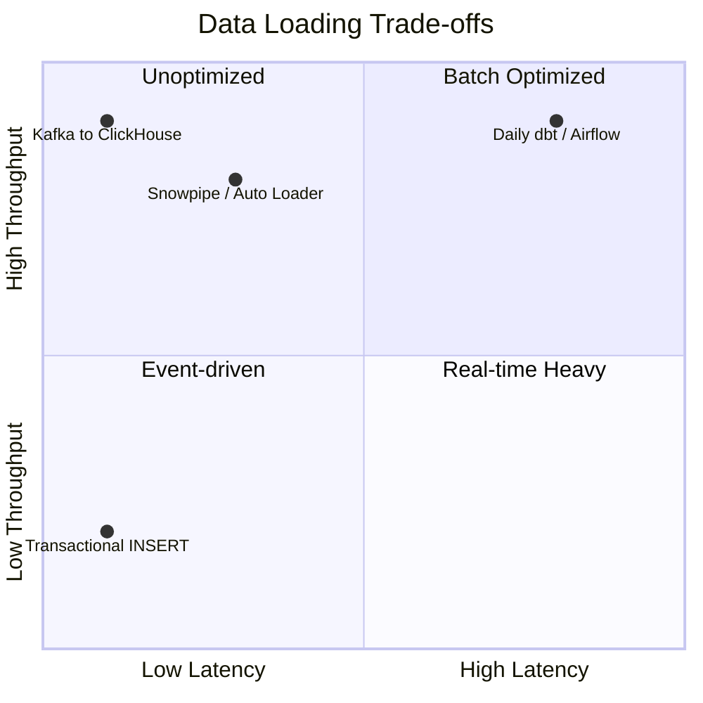
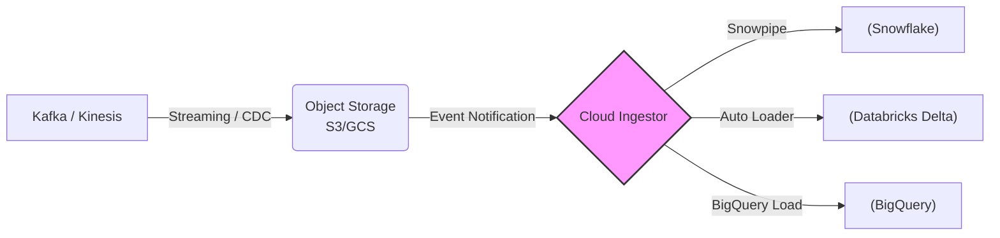

Data Loading (Tải/Nạp dữ liệu) là chốt chặn cuối cùng (The "L") trong kiến trúc **ETL/ELT**. Ở góc độ Data Engineering, đây không đơn thuần là việc "INSERT" dữ liệu. Với Scale hàng trăm triệu đến hàng tỷ rows mỗi ngày, Data Loading là bài toán tối ưu hóa I/O, quản lý Memory/CPU bottleneck, và đảm bảo tính nguyên vẹn dữ liệu (Idempotency) trên Data Warehouse/Data Lake.

Khác với OLTP sử dụng Row-based `INSERT` (chi phí Transaction Log rất cao), OLAP/Data Warehouse yêu cầu **Bulk Loading** (Ghi theo lô) thông qua Columnar Formats (Parquet/ORC) để tối ưu hóa Throughput.

## Systemic Trade-offs: Latency vs. Throughput

Kiến trúc Data Loading xoay quanh việc đánh đổi giữa **Độ trễ (Latency)** và **Thông lượng (Throughput)**. 

*   **Batch Processing (High Throughput, High Latency):** Phù hợp với Reporting/Analytics nội bộ. Dữ liệu được gom thành các Parquet files (256MB - 1GB) trước khi COPY vào Warehouse. 
*   **Micro-batch / Streaming (Low Latency, Variable Throughput):** Phù hợp với Fraud Detection, Real-time Personalization. Đánh đổi bằng chi phí Compute đắt đỏ và rủi ro Small File Problem trên Object Storage.



## Các Chiến Lược Nạp Dữ Liệu (Data Loading Strategies)

### 1. Full Overwrite (Tải Toàn Bộ / Ghi Đè)

**Mô tả:** Xóa sạch dữ liệu (Truncate/Drop) ở bảng đích (Target Table) và thay thế bằng toàn bộ Dataset mới. 

**Engineering View:**
*   **Cơ chế:** Thường dùng `CREATE OR REPLACE TABLE` hoặc `TRUNCATE` + `COPY INTO`. Các Modern Data Warehouse (như Snowflake) hỗ trợ **Zero-copy Cloning** hoặc **Time Travel**, giúp quá trình Swap table diễn ra trong một Transaction duy nhất mà không gây Downtime.
*   **Khi nào dùng:** Kích thước bảng nhỏ (Dimension tables < 1GB) hoặc logic Transform quá phức tạp để track Change Data Capture (CDC).
*   **Rủi ro:** Lãng phí Compute/I/O nếu dữ liệu chỉ thay đổi 1%.

```sql
-- Snowflake Full Overwrite pattern
BEGIN;
CREATE TRANSIENT TABLE dim_users_staging AS 
SELECT * FROM raw.users;

-- Swap atomic, zero downtime
ALTER TABLE dim_users SWAP WITH dim_users_staging;
DROP TABLE dim_users_staging;
COMMIT;
```

### 2. Incremental Load (Tải Tăng Dần)

Chỉ xử lý các bản ghi mới (New) hoặc bị thay đổi (Modified) (hay còn gọi là Delta data) kể từ lần tải cuối cùng (High Watermark).

#### 2.1 Append-Only (Insert Only)

Chuyên trị cho Immutable Data (Events, Logs, Clickstreams). Tối ưu 100% cho Throughput vì không cần check Duplicate hay Update.
*   **Vấn đề hệ thống:** Không xử lý được Late-arriving data hoặc Data duplication từ phía nguồn (at-least-once delivery).

#### 2.2 Upsert / Merge (Update + Insert)

Logic kiểm tra Khóa chính (Primary Key). Nếu Tồn tại -> Update, Chưa Tồn tại -> Insert.

**Engineering View:**
Trong hệ thống phân tán (Distributed Systems), lệnh `MERGE` cực kì đắt đỏ. Nó yêu cầu Full Scan ở bảng đích (hoặc Bloom Filters scanning) và Shuffle data qua Network để thực hiện JOIN giữa Target và Source.

```sql
-- Databricks / Delta Lake MERGE
MERGE INTO target_orders AS t
USING source_orders_updates AS s
ON t.order_id = s.order_id
WHEN MATCHED AND t.updated_at < s.updated_at THEN
  UPDATE SET *
WHEN NOT MATCHED THEN
  INSERT *;
```

## Kiến trúc Ingestion Hiện Đại (Modern Ingestion Architectures)

Các nền tảng Data Engineering hiện đại đang dịch chuyển sang **Declarative Data Loading** thay vì viết các Custom Scripts.



*   **Cloud-Native Ingestors:** Thay vì dùng Airflow schedule 5 phút 1 lần, hãy dùng Event Notifications (AWS SQS/SNS) trigger Snowflake **Snowpipe** hoặc Databricks **Auto Loader** khi có Parquet file mới rớt xuống S3. Điều này chuyển đổi từ `Pull-based` sang `Push-based` architecture, giảm Latency xuống mức seconds.

## Real-world Incidents & Troubleshooting

Dưới đây là một số bài học xương máu (Post-mortems) khi vận hành Data Loading ở Scale lớn:

### 1. Vấn đề "Small File Problem" (HDFS/S3 Bottleneck)
*   **Triệu chứng:** Streaming pipeline (Spark/Flink) write dữ liệu liên tục ra S3 mỗi 10 giây. Sau vài ngày, Query Athena/Presto chậm đột biến, Job bị treo.
*   **Root Cause:** 1 triệu file 10KB (total 10GB) sẽ tốn thời gian list file (metadata operations) và open/close file nhiều gấp 1000 lần so với 10 file 1GB.
*   **Khắc phục (Fix):**
    *   Tăng buffer time trước khi flush.
    *   Thiết lập **Compaction Job** (vd: Databricks `OPTIMIZE`) chạy ngầm mỗi đêm để gom các file nhỏ thành Parquet block tối ưu (ví dụ 128MB - 512MB).

### 2. OOMKilled trong quá trình Bulk Load
*   **Triệu chứng:** Airflow task chạy pandas `to_sql` hoặc Spark DataFrame write bị Kubernetes văng lỗi `OOMKilled` (Exit Code 137).
*   **Root Cause:** Worker cố gắng load file CSV/JSON khổng lồ vào RAM (Memory) trước khi push lên DB.
*   **Khắc phục (Fix):** 
    *   **Ngừng dùng ORM/Pandas cho Bulk Data.** 
    *   Dump dữ liệu xuống Local/Cloud Storage và gọi Native Database Bulk Command (ví dụ Postgres `COPY`, Snowflake `COPY INTO`, Redshift `COPY`).

```python
# Bad practice:
df.to_sql('target_table', engine, if_exists='append')

# Staff Engineer practice (Python -> Postgres):
with open('data.csv', 'r') as f:
    cursor.copy_expert("COPY target_table FROM STDIN WITH CSV HEADER", f)
```

### 3. Kafka Consumer Lag & Throttling
*   **Triệu chứng:** Lượng data spike trong giờ cao điểm làm Streaming Loader không theo kịp. Consumer Lag tăng mạnh.
*   **Root Cause:** Target Database (ví dụ Elasticsearch / RDS) hạn chế Write IOPS (Throttling) hoặc Deadlock do quá nhiều concurrent Threads ghi đè.
*   **Khắc phục (Fix):** 
    *   Scale-out Kafka Partitions đi kèm với Worker Threads.
    *   Triển khai **Dead Letter Queue (DLQ)** cho các bản ghi lỗi format để không block luồng xử lý chính.
    *   Triển khai cơ chế Exponential Backoff cho các Retry connections.

## Idempotency (Tính lũy đẳng) trong Pipeline

Luật tối cao của Data Engineering: **"Pipelines sẽ hỏng, quan trọng là hỏng xong chạy lại (Retry) phải không làm nhân đôi (Duplicate) dữ liệu"**.

Để đảm bảo Idempotent, Data Loading không bao giờ nên dùng logic `INSERT` thuần túy nếu có khả năng chạy lại. Bạn phải dùng:
1. `UPSERT/MERGE` với Primary Keys rõ ràng.
2. `DELETE` by `Partition/Execution_Date` trước khi `INSERT` (Ví dụ: `DELETE FROM table WHERE date = '2026-06-26'; INSERT INTO table...`).

## Nguồn Tham Khảo (References)

*   **[Designing Data-Intensive Applications](https://dataintensive.net/)** - Martin Kleppmann. (The Bible cho System Design, đặc biệt phần Batch & Stream Processing).
*   **[Databricks Blog: Delta Lake vs. Parquet](https://databricks.com/blog/2019/04/24/delta-lake-open-source-storage-layer-for-data-lakes.html)** - Phân tích kiến trúc storage và Data Loading ACID Transactions.
*   **[AWS Architecture Blog: Data Lake Ingestion](https://aws.amazon.com/blogs/architecture/)** - Các mẫu kiến trúc cân bằng giữa Latency và Throughput.
*   **Fundamentals of Data Engineering** - Joe Reis & Matt Housley.
