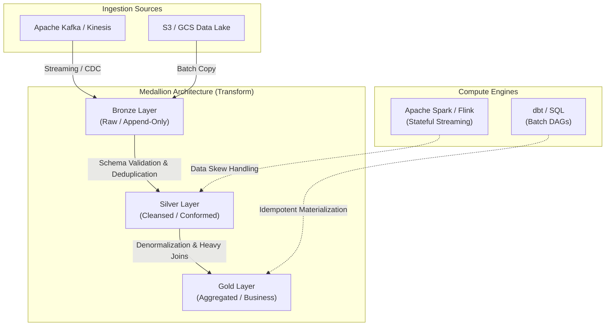

Nếu coi dữ liệu thô (raw data) giống như dầu mỏ vừa khai thác từ lòng đất, thì **Data Transformation (Biến đổi dữ liệu)** chính là tổ hợp các nhà máy lọc hóa dầu. 

Dưới góc nhìn của một Staff Data Engineer, Data Transformation không đơn thuần là việc viết các câu lệnh `SELECT`, `JOIN` hay `GROUP BY` bâng quơ. Ở quy mô hàng trăm Terabyte hoặc Petabyte, Transformation là một bài toán hệ thống (Systems Engineering) cực kỳ phức tạp xoay quanh việc: **Quản lý tài nguyên phân tán (Distributed Compute)**, **xử lý sự cố mạng (Network Partitions)**, đối mặt với **dữ liệu đến trễ (Late-Arriving Data)**, và đảm bảo **tính lũy đẳng (Idempotency)** trong một môi trường luôn luôn có rủi ro Crash.

## 1. Kiến trúc Hệ thống: Từ ETL, ELT đến EtLT

Cuộc chiến vô tiền khoáng hậu giữa ETL (Extract, Transform, Load) và ELT (Extract, Load, Transform) đã ngã ngũ với phần thắng nghiêng về ELT trong kỷ nguyên Cloud Data Warehouse (Snowflake, BigQuery, Redshift). Tuy nhiên, trên thực tế tại các tập đoàn lớn (Enterprise), kiến trúc thường mang hình hài lai tạo: **EtLT (Extract, *tiny* Transform, Load, *Big* Transform)**.

- **ETL Truyền thống:** Phù hợp với các luồng dữ liệu nhạy cảm (PII/PHI) cần được Che giấu (Mask/Hash) bằng một lớp Compute trung gian trước khi chạm vào Storage tĩnh, hoặc khi cần lọc rác (filtering) ở mức Network layer để giảm chi phí băng thông mạng.
- **ELT (Modern Data Stack):** Tận dụng tối đa sức mạnh phần cứng của Massively Parallel Processing (MPP). Tuy nhiên, rủi ro lớn nhất là **Compute Cost Spikes** (đội chi phí máy chủ lên mây) do các Data Analyst viết những câu lệnh SQL kém tối ưu (Full table scans, Cross joins nổ Cartesian).
- **Tiêu chuẩn Kỹ thuật (EtLT):** Sử dụng `t` (tiểu transform) ngay tại tầng Streaming/Ingestion (ví dụ Kafka Connect) để chuẩn hóa định dạng (JSON sang Parquet Columnar), đổi Timezone; sau đó mới dùng `T` (đại transform) trên Data Warehouse / Data Lakehouse để chạy Business Logic phức tạp.

## 2. Medallion Architecture (Kiến trúc Huy chương)

Để duy trì tính toàn vẹn và khả năng kiểm toán (Audit), Databricks và cộng đồng Data Engineering đã chuẩn hóa **Medallion Architecture**. Kiến trúc này cô lập rõ ràng các vòng đời của dữ liệu nhằm hạn chế hiệu ứng bùng nổ (Blast Radius) khi có lỗi logic xảy ra.



### Nguyên tắc Thiết kế Bất Biến (Design Principles):
1. **Bronze (Raw):** Dữ liệu phải được giữ nguyên bản (Immutable & Append-Only). Tuyệt đối không thay đổi giá trị gốc. Điều này cung cấp khả năng "Time Travel" để kỹ sư có thể Replay (chạy lại) hoặc Backfilling khi logic ở tầng Silver/Gold phát hiện lỗi sau vài tháng.
2. **Silver (Cleansed/Conformed):** Nơi diễn ra các trận chiến đẫm máu nhất của Transformation. Áp dụng Schema Enforcement, Deduplication (khử trùng lặp), SCD (Slowly Changing Dimensions) Type 2. Chuẩn hóa Data Types và chuyển đổi Timezone về chuẩn UTC.
3. **Gold (Curated):** Tổ chức dữ liệu theo Star Schema hoặc OBT (One Big Table). Tối ưu hóa cực độ cho thao tác Đọc (Read Latency) của BI Dashboards, Machine Learning Feature Stores.

## 3. Nỗi Ám Ảnh Kỹ Thuật (Engineering Nightmares) & Trade-offs

Transformation không bao giờ là con đường màu hồng. Dưới đây là các sự cố (Incidents) kinh điển và cách giải quyết.

### 3.1. Late-Arriving Data (Dữ liệu đến trễ) trong dbt
Trong hệ thống phân tán, sự kiện X xảy ra lúc 10:00 (Event Time) nhưng do rớt mạng, đến 11:30 dữ liệu mới chạy về tới Server (Processing Time). Nếu Pipeline dbt của bạn chạy Incremental theo lịch lúc 11:00, sự kiện X sẽ bị bỏ sót hoàn toàn.

**Giải pháp (Sliding Window & Microbatch trong dbt):**
- Luôn phải dùng **Event Time** làm chuẩn lọc, tuyệt đối không dùng Processing Time.
- Dùng kỹ thuật "Lookback Window" quét lại vài ngày trước để vớt dữ liệu đến trễ.

```yaml
-- Code Thực chiến: Xử lý Late-arriving data bằng Incremental dbt
{{
    config(
        materialized='incremental',
        unique_key='event_id',
        incremental_strategy='merge',
        partition_by={"field": "event_timestamp", "data_type": "timestamp", "granularity": "day"}
    )
}}

SELECT *
FROM {{ source('raw_events', 'clickstream') }}


    -- Thay vì lấy max time, ta giật lùi (Lookback) 3 ngày 
    -- để rà soát và Merge đè lại các bản ghi tới trễ
    WHERE event_timestamp >= (
        SELECT date_sub(max(event_timestamp), interval 3 day) 
        FROM {{ this }}
    )

```

### 3.2. Data Skew & Lỗi OOMKilled trong Apache Spark
Khi một khóa (Key) trong tập dữ liệu phân tán lớn bất thường (ví dụ: hàng chục triệu bản ghi có `user_id = NULL` hoặc `tenant_id = 'DEFAULT'`). Trong bước Shuffle (của lệnh JOIN hoặc GROUP BY), toàn bộ khối dữ liệu khổng lồ này sẽ bị nhồi nhét vào **MỘT Executor duy nhất**.
- **Triệu chứng:** Task bị treo ở mức 99%. GC (Garbage Collection) Time chiếm 80% thời lượng, và kết thúc bằng cái chết OOMKilled (Out Of Memory).

**Giải pháp Thực chiến (Kỹ thuật Salting):**
Thêm nhiễu ngẫu nhiên (Salt) vào Key bị lệch để băm nhỏ dữ liệu ra, ép Spark chia đều cho các Executors khác. Đánh đổi (Trade-off) của kỹ thuật này là tốn thêm Compute để nhân bản (Explode) bảng Dimension lên.

```python
# PySpark Code Thực chiến: Kỹ thuật Salting chống Data Skew
from pyspark.sql.functions import rand, col, concat, lit, explode, array

# 1. Băm nhỏ bảng Fact (bảng bị Skew) bằng cách gắn thêm Salt (số từ 0 đến 9) vào Key
fact_skewed = fact_skewed.withColumn(
    "salted_key", 
    concat(col("tenant_id"), lit("_"), (rand() * 10).cast("int"))
)

# 2. Nhân bản bảng Dimension lên 10 lần (Explode) để khớp với mọi trường hợp Salt của Fact
dim_df = dim_df.withColumn(
    "salt", explode[array([lit(i] for i in range(10)]))
).withColumn(
    "salted_key", concat(col("tenant_id"), lit("_"), col("salt"))
)

# 3. Thực hiện JOIN trên Salted Key. Dữ liệu giờ đây đã phân tán đều trên 100 cluster nodes!
optimized_joined_df = fact_skewed.join(dim_df, on="salted_key", how="left")
```

## 4. Kiểm Soát Chất Lượng (Data Contracts & Circuit Breakers)

Ở quy mô Enterprise, Transformation layer không thể đóng vai trò "công nhân dọn rác" mãi mãi cho các lỗi Schema Drift [trôi dạt cấu trúc] từ phía Software Engineers. Nguyên lý là: **Garbage In, Garbage Out**.

- **Data Contracts (Hợp đồng Dữ liệu):** Bắt buộc các team Backend upstream phải đăng ký schema (thông qua Schema Registry hoặc Protobuf/Thrift). Mọi payload vi phạm cấu trúc hợp đồng sẽ bị ngắt (Block) ngay tại cổng Producer, không cho phép dữ liệu hỏng xâm nhập vào Data Lake.
- **Circuit Breakers (Cầu dao tự ngắt):** Dùng các công cụ test Data Quality như Great Expectations hoặc dbt tests. Nếu tỷ lệ `NULL` của cột `revenue` đột nhiên vượt mức 5%, hệ thống sẽ tự động văng lỗi và ngắt cầu dao luồng Transformation, ngăn chặn dữ liệu bẩn lọt lên bảng Dashboard báo cáo tài chính của CEO.

```yaml
# dbt test: Triển khai Circuit Breaker chặn dữ liệu bẩn
models:
  - name: fct_revenue_daily
    columns:
      - name: net_revenue
        tests:
          - not_null:
              config:
                severity: error # Nếu NULL, DAG sẽ Failed và dừng ngay lập tức
          - dbt_expectations.expect_column_values_to_be_between:
              min_value: 0
              max_value: 100000000
```

## 5. DLQ (Dead Letter Queue): Nghệ thuật cô lập lỗi
Data Transformation giỏi không bao giờ được phép làm sập (Fail-fast) cả một hệ thống Streaming Pipeline chỉ vì **1 dòng JSON** bị sai định dạng. 
- Tại môi trường Production, thay vì quăng Exception và ngắt Job, bạn phải thiết kế logic `try-catch` để bắt dòng dữ liệu hỏng đó, gắn kèm mã lỗi (Error Code), và ném nó sang một **Dead Letter Queue** (ví dụ: lưu vào bucket S3 `s3://data-lake-dlq/errors/`).
- Các bản ghi hợp lệ còn lại vẫn tiếp tục đi qua. Đội Data Quality sẽ định kỳ query bảng DLQ này để phân tích và phàn nàn với team Backend sau.

## Nguồn Tham Khảo (References)

* **Fundamentals of Data Engineering** - Joe Reis & Matt Housley (Must-read về Data Architecture).
* **Designing Data-Intensive Applications** - Martin Kleppmann (Sách gối đầu giường về Replication, Partitioning & Batch Processing).
* [The dbt Viewpoint - What is Data Transformation?][https://www.getdbt.com/analytics-engineering/transformation/]
* [Databricks Blog - What is a Medallion Architecture?][https://www.databricks.com/glossary/medallion-architecture]
* [Netflix Tech Blog - Handling Consumer Lag and Stateful Streaming](https://netflixtechblog.com/]
