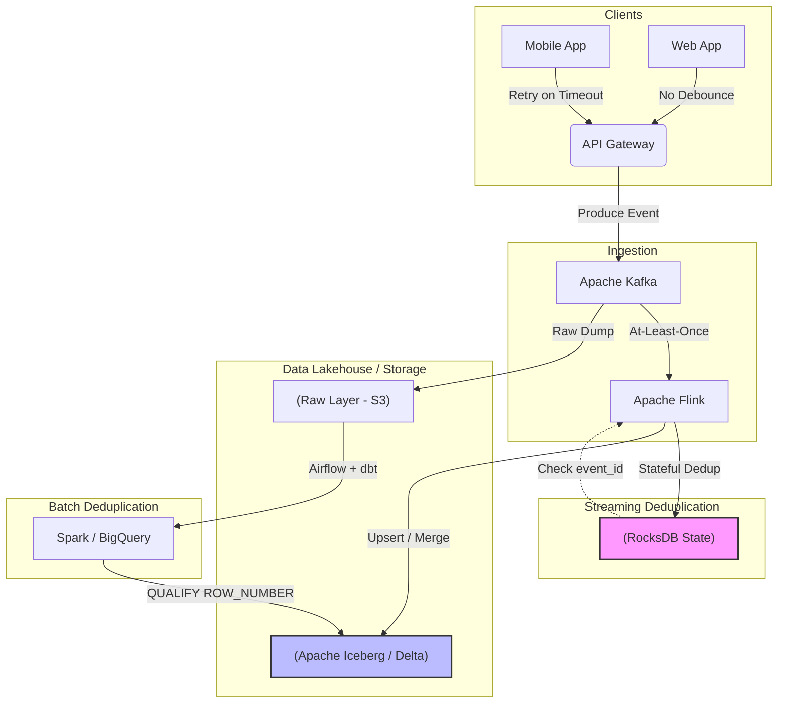

## Khái Niệm Deduplication (Khử Trùng Lặp)

Trong thế giới của hệ thống phân tán (Distributed Systems) và Data Engineering, **Deduplication** (Khử trùng lặp) không chỉ đơn thuần là việc "xóa dòng trùng". Dưới góc nhìn Staff Engineer, deduplication là cơ chế phòng thủ cốt lõi để duy trì **Data Integrity** (Tính toàn vẹn dữ liệu) khi đối mặt với các bản chất khắc nghiệt của mạng: Network Partitions, Node Failures và giới hạn của định lý CAP.

Bất kỳ hệ thống nào trao đổi dữ liệu qua mạng đều phải tuân theo một trong các Semantics giao nhận (Delivery Semantics). Hầu hết các hệ thống Streaming và Message Broker (như Apache Kafka, RabbitMQ) mặc định cung cấp **At-Least-Once Delivery** (Giao ít nhất một lần) để đảm bảo không mất mát dữ liệu (Zero Data Loss). Sự đánh đổi của At-Least-Once chính là dữ liệu trùng lặp (Duplicates). Vì vậy, Deduplication là mảnh ghép bắt buộc để đạt được lý tưởng **Exactly-Once Processing (EoP)**.

## Tại Sao Dữ Liệu Lại Bị Trùng Lặp? (Root Causes)

Trùng lặp dữ liệu (Data Duplication) hiếm khi là do lỗi cố ý, mà thường xuất phát từ cơ chế tự phục hồi (Resilience) của hệ thống:

1. **Producer Retries (Thử lại từ phía gửi):** Khi Producer gửi một message tới Kafka/Kinesis nhưng gặp Network Timeout và không nhận được ACK. Producer không thể biết message đã được ghi thành công hay chưa (Two Generals' Problem), nó buộc phải retry. Kết quả: Message được ghi 2 lần.
2. **Consumer Rebalancing & Unacknowledged Offsets:** Consumer đọc một batch dữ liệu, lưu thành công vào Database nhưng Crash (hoặc bị Rebalance) trước khi kịp Commit Offset về Broker. Khi Consumer mới tiếp quản Partition đó, nó sẽ đọc và xử lý lại từ Offset cũ.
3. **Application Bugs (Lỗi Client-Side):** Thiếu cơ chế Debounce/Throttling ở Frontend, dẫn đến người dùng click API tạo đơn hàng 2 lần liên tiếp.
4. **ETL Backfills:** Chạy lại Historical Pipeline mà không có cơ chế **Idempotent** (Không thay đổi trạng thái nếu chạy nhiều lần), dẫn tới việc Append đè lên dữ liệu cũ thay vì Upsert/Overwrite.

## Kiến Trúc Hệ Thống: Exactly-Once Pipeline

Dưới đây là sơ đồ mô tả cách một Data Pipeline xử lý trùng lặp từ End-to-End:



## Các Chiến Lược Deduplication Phân Tầng

### 1. Ingestion Layer: Idempotent Producers

Cách tốt nhất để xử lý trùng lặp là chặn nó ngay tại cửa. Kafka cung cấp tính năng Idempotent Producer, gán một `ProducerId` và `SequenceNumber` cho mỗi message. Broker sẽ tự động reject nếu nhận được Sequence Number đã tồn tại.

**Kafka Producer Configuration (Java):**
```java
Properties props = new Properties();
props.put(ProducerConfig.BOOTSTRAP_SERVERS_CONFIG, "broker1:9092,broker2:9092");
// Bật Idempotence để chống duplicate do retry
props.put(ProducerConfig.ENABLE_IDEMPOTENCE_CONFIG, "true");
props.put(ProducerConfig.ACKS_CONFIG, "all");
props.put(ProducerConfig.MAX_IN_FLIGHT_REQUESTS_PER_CONNECTION, "5");
```

**Terraform Kafka Topic Cấu Hình Chống Mất Mát:**
```hcl
resource "kafka_topic" "financial_events" {
  name               = "financial-events-v1"
  replication_factor = 3
  partitions         = 12
  config = {
    "min.insync.replicas" = "2"
    "retention.ms"        = "604800000" # 7 days
  }
}
```

### 2. Streaming Layer: Stateful Processing (Flink/Spark)

Trong xử lý dòng chảy vô tận (Unbounded Streams), bạn không thể join với toàn bộ lịch sử. Thay vào đó, ta dùng **State Store** (như RocksDB trong Flink) để nhớ các ID đã gặp. 

**Systemic Trade-off (Đánh đổi hệ thống):** State Size (RAM/Disk) vs. Deduplication Window. Nếu bạn giữ state mãi mãi, Job sẽ chết vì Out-Of-Memory (OOM). Phải sử dụng **TTL (Time-To-Live)** hoặc **Watermarks**.

**Cấu hình Flink RocksDB (flink-conf.yaml):**
```yaml
state.backend: rocksdb
state.backend.incremental: true
# Quan trọng: Kích hoạt TTL để dọn dẹp state cũ
state.ttl: 24h 
```

**Spark Structured Streaming (Python):**
```python
# Giữ state trong 24 giờ. Bất kỳ event_id nào đến trễ hơn 24h sẽ bị drop (hoặc đưa vào Dead Letter Queue)
deduped_df = streaming_df \
    .withWatermark("event_timestamp", "24 hours") \
    .dropDuplicates(["event_id", "event_timestamp"])
```

### 3. Batch / Data Warehouse Layer: SQL Window Functions

Trong BigQuery, Snowflake, hay Spark SQL, sử dụng `ROW_NUMBER()` là tiêu chuẩn (Gold Standard). Tuy nhiên, các kỹ sư lão luyện sẽ dùng mệnh đề `QUALIFY` để làm code ngắn gọn và tối ưu Execution Plan hơn việc dùng CTE.

```sql
-- Thay vì dùng CTE (WITH) phức tạp, sử dụng QUALIFY trong BigQuery/Snowflake
SELECT 
    event_id,
    user_id,
    event_payload,
    ingested_at
FROM raw.events
WHERE date_partition >= CURRENT_DATE() - 7
QUALIFY ROW_NUMBER() OVER (
    PARTITION BY event_id 
    ORDER BY ingested_at DESC
) = 1;
```

**Systemic Trade-off:** `ROW_NUMBER()` yêu cầu **Network Shuffle** khổng lồ. Đánh đổi ở đây là **Compute Cost vs. Storage Cost**. Quét (Scan) toàn bộ bảng 10TB để deduplicate tốn kém hơn nhiều so với việc chỉ xử lý trên phân vùng (Partition) của ngày hiện tại.

### 4. Storage Layer: Upsert / Merge (Lakehouse)

Với Apache Iceberg, Delta Lake hoặc Hudi, ta đẩy logic Deduplication xuống tầng lưu trữ thông qua `MERGE` statement. Bản chất đây là **Idempotent Storage**.

```sql
MERGE INTO prod.transactions T
USING staging.new_transactions S
ON T.transaction_id = S.transaction_id
WHEN MATCHED AND S.updated_at > T.updated_at THEN
  UPDATE SET 
    status = S.status, 
    updated_at = S.updated_at
WHEN NOT MATCHED THEN
  INSERT (transaction_id, user_id, amount, status, updated_at)
  VALUES (S.transaction_id, S.user_id, S.amount, S.status, S.updated_at);
```

## Real-world Incidents & Troubleshooting (Kinh Nghiệm Thực Chiến)

### 1. Incident: Flink OOMKilled do State Quá Lớn
**Bối cảnh:** Pipeline deduplicate lượt xem video quảng cáo theo `user_id` và `ad_id`.
**Sự cố:** TaskManagers liên tục bị Kubernetes restart với mã lỗi `OOMKilled`. 
**Root Cause:** Kỹ sư cấu hình state cho Flink nhưng **quên thiết lập State TTL**. Hàng tỷ tổ hợp `user_id + ad_id` được lưu trữ vĩnh viễn trên RocksDB tràn ra ngoài disk, làm Disk IOPS chạm trần, kéo theo timeout heartbeat tới JobManager.
**Khắc phục:** Áp dụng State TTL 48h. Lượt xem quảng cáo thường chỉ bị gửi trùng trong vòng vài giờ đầu do retry, việc giữ state quá lâu là không cần thiết.

### 2. Incident: Kafka Consumer Lag Spike do RDBMS Upsert
**Bối cảnh:** Ingestion layer đọc từ Kafka và ghi thẳng vào PostgreSQL bằng `INSERT ... ON CONFLICT DO UPDATE` (Upsert).
**Sự cố:** Trong đợt Sale ngày lễ, lưu lượng tăng 10x. Consumer Lag tăng vọt lên hàng triệu messages.
**Root Cause:** PostgreSQL bị lock contention (cạnh tranh khóa) trên Primary Key Index khi có hàng ngàn threads cố gắng thực hiện Upsert đồng thời. I/O Disk của DB lên 100%.
**Khắc phục:** Chuyển chiến lược sang ELT: Consumer chỉ thực hiện Batch Insert (Append-only) vào một bảng RAW tạm thời (không index, tốc độ cực nhanh). Sau đó dùng dbt chạy batch job 5 phút/lần dùng `ROW_NUMBER()` để hợp nhất (Merge) vào bảng chính.

## Nguồn Tham Khảo (References)

1. [Exactly-Once Semantics in Apache Flink - Flink Documentation](https://nightlies.apache.org/flink/flink-docs-stable/docs/learn-flink/fault_tolerance/)
2. [Exactly-Once Processing in Kafka Streams - Confluent Blog](https://www.confluent.io/blog/enabling-exactly-once-kafka-streams/)
3. [Data Engineering at Scale: Netflix Tech Blog](https://netflixtechblog.com/)
4. [Uber Engineering: Designing Real-time Data Pipelines](https://www.uber.com/en-VN/blog/engineering/)
5. **Designing Data-Intensive Applications** - Martin Kleppmann (Chapter 11: Stream Processing)
