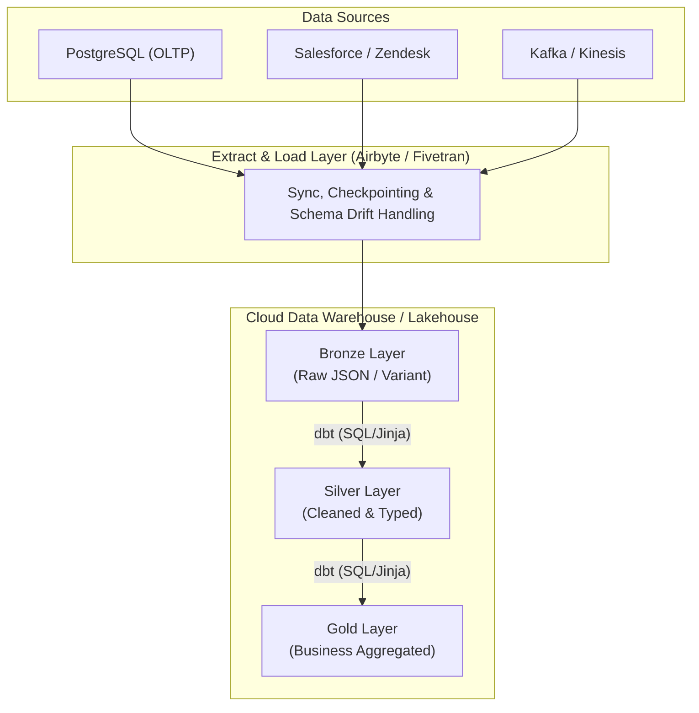

Trong nhiều thập kỷ, ETL (Extract, Transform, Load) là mô hình chuẩn mực độc tôn của Data Engineering. Các công cụ như Informatica hay Talend yêu cầu một Server trung gian chuyên dụng chỉ để biến đổi dữ liệu trước khi nạp vào kho. Tuy nhiên, với sự ra đời của Cloud Data Warehouse (Snowflake, BigQuery) và Data Lakehouse (Databricks), mô hình **ELT (Extract, Load, Transform)** đã trỗi dậy, định hình lại toàn bộ hệ sinh thái **Modern Data Stack (MDS)**.

---

## 1. Kiến Trúc Cốt Lõi Của ELT (Architectonics of ELT)

**ELT (Extract, Load, Transform)** đại diện cho sự chuyển dịch kiến trúc từ xử lý dữ liệu nguyên khối (Monolithic Data Processing) sang kiến trúc phi tập trung, dựa trên sự tách biệt giữa **Tính toán (Compute)** và **Lưu trữ (Storage)**.

Thay vì xử lý dữ liệu trên "đường bay" (in-flight), dữ liệu thô (Raw Data) được Trích xuất (Extract) và Nạp (Load) thẳng vào vùng đổ dữ liệu (Landing Zone) của kho. Toàn bộ logic Biến đổi (Transform) được đẩy sâu vào bên trong Data Warehouse / Lakehouse, tận dụng sức mạnh xử lý song song khổng lồ (MPP - Massively Parallel Processing).



### Kiến trúc Medallion (Huy Chương)
Sự kết hợp giữa ELT và Data Lakehouse đẻ ra khái niệm **Medallion Architecture (Bronze-Silver-Gold)** của Databricks:
- **Bronze (Landing Zone):** Chứa dữ liệu gốc 100%, không mất mát (Lossless). Dùng làm nguồn phục hồi (Source of Truth) nếu logic transform bị lỗi.
- **Silver (Staging Zone):** Dữ liệu được làm sạch, ép kiểu (Casting), khử trùng lặp (Deduplication).
- **Gold (Serving Zone):** Dữ liệu được tổng hợp (Aggregated), join từ nhiều bảng Silver để phục vụ trực tiếp cho BI Dashboards hoặc Machine Learning.

---

## 2. Đánh Giá Đánh Đổi Hệ Thống (Systemic Trade-offs)

Là một kỹ sư, chọn ELT đồng nghĩa với việc chấp nhận một số đánh đổi (Trade-offs) khốc liệt:

### 2.1. Thông lượng (Throughput) vs. Độ trễ (Latency)
- **ELT tối ưu hóa cực đại cho Throughput:** Bằng cách loại bỏ Server Transform trung gian, ELT cho phép bơm hàng Terabyte dữ liệu thẳng vào Cloud Storage (như Amazon S3) với băng thông mạng cực đại.
- **Đánh đổi về Latency (Độ trễ):** Vì dữ liệu phải được lưu xuống đĩa (disk/blob) ở layer Bronze trước, sau đó mới dùng SQL để Transform sang Silver, độ trễ end-to-end thường rơi vào vài phút (micro-batch) thay vì mili-giây như Stream Processing thuần túy (Flink). 

### 2.2. Chi phí Tính toán (Compute Cost) vs. Chi phí Kỹ sư (Engineering Overhead)
- **Tăng Compute Cost:** Mọi tác vụ `JOIN`, `GROUP BY` hay `MERGE` đều tiêu tốn Credit/Compute trên Snowflake hoặc Databricks. Nếu Analytics Engineer viết SQL cẩu thả (ví dụ: Full Table Scan thay vì Incremental Load), hóa đơn đám mây sẽ phình to không tưởng.
- **Giảm Engineering Overhead (Cực kỳ giá trị):** Đổi lại, kỹ sư không cần duy trì Spark clusters, không cần cấu hình YARN/Mesos, cũng không cần viết mã Scala phức tạp. Quá trình Transform được dân chủ hóa bằng SQL qua công cụ **dbt (Data Build Tool)**. Chi phí nhân sự đắt hơn rất nhiều chi phí server, do đó trade-off này là hoàn toàn xứng đáng.

---

## 3. Triển Khai Kỹ Thuật (Technical Implementation)

Một quy trình ELT Production-grade yêu cầu tính lũy đẳng (Idempotency) và quản lý cơ sở hạ tầng dưới dạng mã (IaC).

### 3.1. Infrastructure as Code với Terraform (Airbyte & Snowflake)
Quá trình Extract & Load (E&L) thường được ủy thác hoàn toàn cho các SaaS như Fivetran hoặc Airbyte. Bạn sẽ không bao giờ code tay Python script để gọi API của Salesforce nữa. Dưới đây là cấu hình Terraform để dựng pipeline:

```hcl
# Thiết lập nguồn PostgreSQL (Extract) qua Airbyte
resource "airbyte_source_postgres" "prod_db" {
  name         = "production-postgres"
  workspace_id = var.workspace_id
  configuration = {
    host     = "db.internal.network"
    port     = 5432
    database = "orders_db"
    username = var.db_user
    password = var.db_pass
    ssl_mode = "require"
    # Bắt buộc dùng Logical Replication (CDC) thay vì Full Load
    replication_method = {
      logical_replication = {
        plugin = "pgoutput"
        publication = "airbyte_pub"
      }
    }
  }
}

# Thiết lập đích Snowflake (Load)
resource "airbyte_destination_snowflake" "data_warehouse" {
  name         = "snowflake-raw-zone"
  workspace_id = var.workspace_id
  configuration = {
    host      = "xyz123.snowflakecomputing.com"
    role      = "AIRBYTE_ROLE"
    warehouse = "LOAD_WH"
    database  = "RAW_DB"
    schema    = "BRONZE"
    username  = var.sf_user
    password  = var.sf_pass
  }
}
```

### 3.2. Biến đổi dữ liệu (Transform) với dbt
Tại tầng Transform, `dbt` biên dịch mã SQL + Jinja thành các DAG (Directed Acyclic Graphs). Nó hỗ trợ Incremental Load để tiết kiệm Compute Cost.

```sql
-- dbt models/silver/stg_orders.sql
{{ config(
    materialized='incremental', 
    unique_key='order_id',
    incremental_strategy='merge'
) }}

WITH raw_data AS (
    SELECT 
        CAST(json_extract_path_text(_airbyte_data, 'id') AS INT) AS order_id,
        CAST(json_extract_path_text(_airbyte_data, 'user_id') AS INT) AS user_id,
        CAST(json_extract_path_text(_airbyte_data, 'amount') AS DECIMAL(10,2)) AS amount,
        CAST(json_extract_path_text(_airbyte_data, 'updated_at') AS TIMESTAMP) AS updated_at
    FROM {{ source('bronze', 'raw_orders') }}
)

SELECT * FROM raw_data

    -- Lũy đẳng (Idempotency): Chỉ quét dữ liệu mới thay vì Full Scan
    WHERE updated_at >= (SELECT MAX(updated_at) FROM {{ this }})

```

---

## 4. Sự Cố Thực Tế và Gỡ Lỗi (Troubleshooting)

Hệ thống ELT trong thực tế không bao giờ hoàn hảo. Dưới đây là các "vết sẹo" chiến trường khi vận hành ELT ở quy mô Enterprise.

### 4.1. Sự cố OOMKilled trên Kubernetes [Airbyte/Singer Workers]
- **Triệu chứng:** Khi chạy Sync một bảng MySQL quá lớn (vài tỷ dòng) trong lần đầu (Initial Sync), Pod chạy container Extract liên tục bị Kubernetes Evicted với `Exit Code 137` (OOMKilled).
- **Nguyên nhân (Root Cause):** Trình kết nối (Connector) cố gắng fetch quá nhiều bản ghi vào bộ nhớ Heap (RAM) trước khi flush qua network. Nếu bảng có các cột `TEXT` hoặc `BLOB` dung lượng khổng lồ, RAM sẽ cạn kiệt.
- **Khắc phục (Remediation):**
  1. Tăng `resources.limits.memory` cho Worker Pods trong cấu hình Helm chart.
  2. Bật Cursor-based Pagination (Phân trang bằng con trỏ) trên source database. Cấu hình `fetchSize` của JDBC driver xuống thấp (ví dụ: `fetchSize=1000` thay vì mặc định lấy toàn bộ ResultSet).

### 4.2. Consumer Lag Trong Hệ Thống Real-time Ingestion
- **Triệu chứng:** Sử dụng Kafka Connect để nạp trực tiếp Stream Events vào bảng Bronze của Snowflake (Snowpipe). Trong giờ cao điểm (Burst Traffic), cảnh báo PagerDuty réo liên tục vì Consumer Lag lên tới hàng triệu messages. Dữ liệu trễ hàng tiếng đồng hồ.
- **Nguyên nhân:** Thiếu cơ chế **Áp lực ngược (Back-pressure)**. Tốc độ ghi vào Cloud Data Warehouse (I/O Bound) không bao giờ có thể theo kịp tốc độ sản sinh thông điệp (Producer rate). Snowflake phải tốn thời gian tạo micro-batch tệp Parquet để gộp vào bảng.
- **Khắc phục:**
  1. Tăng song song hóa (Parallelism): Tăng số lượng Kafka Partitions và tương ứng tăng số lượng `tasks.max` của Kafka Connect.
  2. Tối ưu hóa kích thước lô nạp (Batch Size): Đừng gọi API nạp mỗi khi có 100 messages. Hãy nén thành file 100MB-200MB (giao động 1-2 triệu bản ghi) trước khi đẩy vào Snowpipe. Điều này làm tăng Latency nhưng cứu sống toàn bộ Throughput.

---

## 5. Nguồn Tham Khảo (References)
* [What is a Data Lakehouse? (Databricks Blog]][https://www.databricks.com/blog/2020/01/30/what-is-a-data-lakehouse.html]
* [Medallion Architecture (Databricks Glossary]][https://www.databricks.com/glossary/medallion-architecture]
* [Designing Data-Intensive Applications (Martin Kleppmann]][https://dataintensive.net/]
* [dbt Labs - The Analytics Engineering Guide](https://docs.getdbt.com/docs/analytics-engineering]
