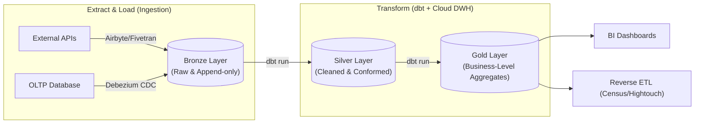

Ở cấp độ **Staff Data Engineer**, ETL không chỉ đơn thuần là việc viết vài đoạn script Python (pandas) hay sử dụng các công cụ kéo-thả (GUI) để di chuyển dữ liệu từ điểm A sang điểm B. Đó là bài toán thiết kế hệ thống phân tán ở quy mô Petabyte, nơi bạn phải liên tục đánh đổi (Systemic Trade-offs) giữa **Độ trễ (Latency)**, **Thông lượng (Throughput)**, **Chi phí Compute (Cost)**, và **Độ tin cậy (Reliability)**. 

Bài viết này sẽ mổ xẻ quá trình Tích hợp dữ liệu dưới lăng kính của một kỹ sư hệ thống, đi sâu vào sự tiến hóa của các kiến trúc hiện đại, cách xử lý sự cố thực tế (production incidents) và các tiêu chuẩn thiết kế khắt khe.

## 1. Sự tiến hóa của Kiến trúc: Từ ETL đến Zero-ETL

Kiến trúc luân chuyển dữ liệu đã thay đổi chóng mặt trong 10 năm qua, định hình bởi sự phát triển của Cloud Computing.

### 1.1. ETL (Extract -> Transform -> Load)
* **Cơ chế:** Dữ liệu được trích xuất từ nguồn, biến đổi (làm sạch, join) trên một server trung gian (ví dụ: Spark Cluster, Informatica), sau đó mới nạp vào Data Warehouse.
* **Trade-off:** 
  * *Điểm mạnh:* Quản lý bảo mật tuyệt đối. Bạn có thể mask (che giấu) dữ liệu nhạy cảm (PII/PHI) ngay trên RAM của máy chủ trung gian trước khi nó chạm vào ổ cứng của Data Warehouse.
  * *Điểm yếu:* Nút thắt cổ chai ở máy chủ Transform. Khó scale và tốn kém chi phí bảo trì.

### 1.2. ELT (Extract -> Load -> Transform) và dbt
* **Cơ chế:** "Dump" toàn bộ dữ liệu thô (Raw) vào Cloud Data Warehouse (BigQuery, Snowflake), sau đó tận dụng sức mạnh Compute vô tận của chính Warehouse đó để thực hiện Transform bằng SQL.
* **Trade-off:** 
  * *Điểm mạnh:* Developer Velocity cực cao. Công cụ **dbt (data build tool)** trở thành tiêu chuẩn công nghiệp vì nó cho phép viết Transform bằng SQL như viết mã nguồn phần mềm (có Version Control, CI/CD).
  * *Điểm yếu:* Nếu thiếu Data Governance, Data Warehouse sẽ nhanh chóng biến thành "Data Swamp" (Đầm lầy dữ liệu) với hàng ngàn bảng rác làm hóa đơn Cloud phình to.

### 1.3. Reverse ETL (ETL Đảo ngược)
* **Cơ chế:** Đưa dữ liệu đã được tổng hợp, làm sạch từ Data Warehouse (Single Source of Truth) đẩy ngược trở lại các hệ thống vận hành (SaaS, Salesforce, Hubspot) để phục vụ team Business.
* **Mục đích:** Biến Data Warehouse từ một nơi "chỉ để ngắm report" thành một bộ não điều khiển trực tiếp các chiến dịch Marketing và Sale tự động.

### 1.4. Zero-ETL
* **Cơ chế:** Loại bỏ hoàn toàn Data Pipeline. Cơ sở dữ liệu nguồn (OLTP) tự động đồng bộ sang Data Warehouse (OLAP) ở cấp độ Storage / Transaction Log. Ví dụ: Amazon Aurora Zero-ETL to Redshift.
* **Trade-off:** Độ trễ (Latency) tính bằng giây, không tốn công bảo trì DAGs trên Airflow. Tuy nhiên, nó đi kèm rủi ro Vendor Lock-in (bị trói buộc vào hệ sinh thái AWS) và thiếu linh hoạt nếu cần Transform phức tạp ở giữa.

## 2. Giải phẫu hệ thống ELT với dbt & Medallion Architecture

Trong kiến trúc Data Lakehouse hiện đại, ELT thường được triển khai theo mô hình Huy chương (Medallion Architecture) để phân lớp chất lượng dữ liệu.



**Mã nguồn Thực chiến: dbt SQL cho lớp Silver (Tính lũy đẳng)**
Trong dbt, mọi mô hình phải mang tính lũy đẳng (Idempotent). Nếu chạy lại lệnh `dbt run` 100 lần, kết quả vẫn không đổi. Chúng ta sử dụng cơ chế Incremental Load thay vì Full Refresh để tiết kiệm hàng ngàn USD tiền Compute.

```sql
{{
    config(
        materialized='incremental',
        unique_key='transaction_id',
        incremental_strategy='merge'
    )
}}

SELECT 
    transaction_id,
    user_id,
    amount_usd,
    -- Chuẩn hóa dữ liệu bị lỗi
    COALESCE(status, 'UNKNOWN') AS status,
    updated_at
FROM {{ source('bronze', 'raw_transactions') }}


  -- Chỉ lấy các dòng dữ liệu mới hoặc bị thay đổi kể từ lần chạy cuối cùng
  WHERE updated_at >= (SELECT MAX(updated_at) FROM {{ this }})

```

## 3. Rủi ro Vận hành và Khắc phục (Troubleshooting Incidents)

Dưới đây là những "vết sẹo chiến trường" mà các kỹ sư dữ liệu tại Uber, Netflix thường xuyên đối mặt.

### Sự cố 1: Spark Executor `OOMKilled` do Data Skew
*   **Triệu chứng:** Pipeline chạy mượt mà nhiều tháng, bỗng nhiên một ngày bị crash liên tục với lỗi `java.lang.OutOfMemoryError` trên 1 task duy nhất trong quá trình Transform.
*   **Nguyên nhân:** Lệch dữ liệu (Data Skew). Khi thực hiện JOIN hai bảng lớn, hàng triệu bản ghi có `user_id = NULL` bị băm (Hash) vào cùng một Executor, làm nổ tung RAM của Node đó.
*   **Khắc phục (Staff-level fix):** 
    1. Filter bỏ `NULL` keys trước khi JOIN.
    2. Bật Adaptive Query Execution (AQE) trong Spark 3+ để hệ thống tự động chẻ nhỏ (split) các partition bị lệch.
    3. Nếu không có AQE, sử dụng kỹ thuật **Salting** (thêm tiền tố ngẫu nhiên vào khóa Join để rải đều dữ liệu ra toàn cụm).

### Sự cố 2: Lỗi Dữ Liệu Câm (Silent Data Corruption)
*   **Triệu chứng:** Pipeline báo xanh (Success) trên Airflow, nhưng CEO báo cáo Dashboard doanh thu bị tụt 50%.
*   **Nguyên nhân:** Lỗi nguy hiểm nhất là hệ thống chạy thành công nhưng dữ liệu bên trong bị sai. Có thể do API nguồn đổi schema, hoặc một bảng upstream bị thiếu dữ liệu ngày hôm đó.
*   **Khắc phục:** Triển khai **Data Contracts** và **Circuit Breakers (Cầu dao tự động)**. 
    Trong `dbt`, thêm các bài test (như `not_null`, `unique`) hoặc dùng *Great Expectations* để kiểm tra tính hợp lệ của dữ liệu. Nếu Test Fail, hệ thống sẽ tự ngắt, cấm không cho đẩy dữ liệu bẩn sang lớp Gold.

## 4. Tiêu chuẩn Thiết kế của Staff Engineer

Mọi Data Pipeline cấp độ Enterprise phải tuân thủ 2 nguyên tắc vàng:

1. **Khả năng Backfill không sửa code:** Khi Business Logic thay đổi, bạn có thể phải tính lại toàn bộ dữ liệu của 3 năm trước. Pipeline phải được tham số hóa hoàn toàn theo thời gian (`execution_date`). Việc backfill chỉ đơn giản là gọi lại Airflow DAG từ năm 2021 đến 2024.
2. **Infrastructure as Code (IaC):** Pipeline không được cấu hình bằng tay trên UI. 

**Mã nguồn Thực chiến: Tích hợp AWS Zero-ETL bằng Terraform**
```hcl
# Thiết lập Zero-ETL Integration giữa Aurora MySQL và Redshift
resource "aws_redshiftserverless_namespace" "analytics" {
  namespace_name = "core-analytics"
}

resource "aws_rds_integration" "aurora_to_redshift" {
  integration_name = "zero-etl-prod"
  source_arn       = aws_rds_cluster.aurora_prod.arn
  target_arn       = aws_redshiftserverless_namespace.analytics.arn
  
  # Yêu cầu bật Binlog ở Aurora Cluster Parameters
  depends_on = [ aws_rds_cluster_parameter_group.enable_binlog ]
}
```

## 5. Nguồn Tham Khảo [References]

*   [Designing Data-Intensive Applications][https://dataintensive.net/] - Martin Kleppmann.
*   [AWS Architecture Blog: Zero-ETL integration between Amazon Aurora and Amazon Redshift][https://aws.amazon.com/blogs/big-data/create-a-zero-etl-integration-between-amazon-aurora-and-amazon-redshift/]
*   [dbt Documentation: Reverse ETL][https://www.getdbt.com/blog/what-is-reverse-etl]
*   [Netflix Tech Blog: Data Engineering at Scale](https://netflixtechblog.com/]
