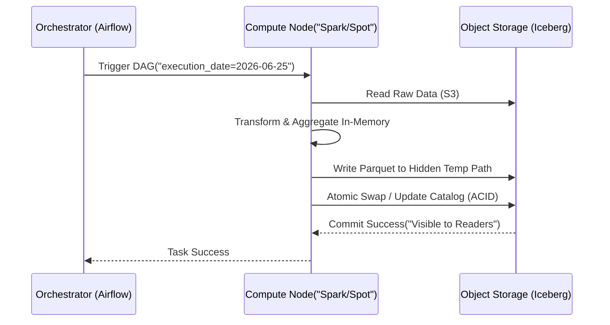

Ở cấp độ **Staff Data Engineer**, ETL không chỉ đơn thuần là việc viết vài đoạn script Python để di chuyển dữ liệu từ điểm A sang điểm B. Đó là bài toán thiết kế hệ thống phân tán ở quy mô Exabyte, nơi bạn phải liên tục đánh đổi (trade-offs) giữa **Độ trễ (Latency)**, **Thông lượng (Throughput)**, **Chi phí (Cost)**, và **Độ tin cậy (Reliability)**. 

Bài viết này sẽ mổ xẻ ETL dưới lăng kính của một kỹ sư hệ thống, đi sâu vào các kiến trúc hiện đại, cách xử lý sự cố thực tế (production incidents) và các tiêu chuẩn thiết kế khắt khe.

---

## 1. Giải phẫu hệ thống ETL ở quy mô lớn

Dưới góc nhìn kiến trúc, quá trình ETL hiện đại là sự kết hợp của các hệ thống xử lý phân tán (Distributed Processing Systems) và kiến trúc Lakehouse (Iceberg, Delta Lake, Hudi).

```mermaid
graph LR
    subgraph "Extract("Ingestion")
        DB["(OLTP MySQL/PG)"] -->|CDC / Debezium| Kafka["Apache Kafka"]
        API["External SaaS"] -->|Airflow DAG| Raw["S3 / GCS Raw"]
        Kafka -->|Kafka Connect| Raw
    end
    
    subgraph "Transform & Load("Lakehouse / Medallion")
        Raw -->|Spark / Flink| Bronze["(Bronze\nAppend-only)"]
        Bronze -->|Spark SQL / dbt| Silver["(Silver\nDeduplicated & Cleaned)"]
        Silver -->|Spark SQL / dbt| Gold["(Gold\nAggregated Data Mart)"]
    end
```

### Extract (Trích xuất)
Trích xuất dữ liệu ở quy mô lớn không phải là việc chạy lệnh `SELECT * FROM table`. Nó tiềm ẩn rủi ro đánh sập hệ thống production (OLTP) của người dùng cuối do quá tải I/O.

*   **Change Data Capture (CDC):** Thay vì query database, chúng ta đọc trực tiếp từ transaction logs (Binlog trong MySQL, WAL trong PostgreSQL). Debezium là standard pattern cho việc này.
*   **Backpressure & Rate Limiting:** Khi pull từ API bên thứ ba, bạn phải xử lý HTTP 429 (Too Many Requests). Thiết kế hệ thống Extract phải triển khai cơ chế Exponential Backoff có Jitter.

*Ví dụ cấu hình Kafka Connect (Debezium) trích xuất dữ liệu không xâm lấn (Non-intrusive Extraction):*
```json
{
  "name": "inventory-connector",
  "config": {
    "connector.class": "io.debezium.connector.mysql.MySqlConnector",
    "tasks.max": "1",
    "database.hostname": "mysql.production.internal",
    "database.include.list": "inventory",
    "snapshot.mode": "initial",
    "snapshot.locking.mode": "none" 
  }
}
```
> [!NOTE]
> `snapshot.locking.mode = none` là yếu tố sống còn để không block database production khi chạy schema snapshot lần đầu.

### Transform (Biến đổi)
Đây là nơi tiêu tốn hàng triệu đô la chi phí cloud compute mỗi năm. Transform ở quy mô Big Data yêu cầu hiểu biết sâu sắc về cấu trúc dữ liệu (Data Structures) và cách hệ thống phân tán quản lý bộ nhớ.

Các thao tác Transform cốt lõi:
*   **Deduplication (Khử trùng lặp):** Hệ thống phân tán như Kafka chỉ đảm bảo "At-least-once delivery", dẫn đến dữ liệu có thể bị trùng. Transform layer phải xử lý việc này dựa trên event_id hoặc watermark.
*   **Handling Late-arriving Data:** Dữ liệu có thể đến trễ vài ngày do thiết bị IoT mất mạng. Hệ thống Transform phải áp dụng cơ chế Watermarking (trong Flink/Spark Streaming) để update lại kết quả đã tính toán trước đó.

### Load (Nạp)
Trong kỷ nguyên của Data Lakehouse (S3 + Apache Iceberg/Delta Lake), Load không chỉ là ghi file parquet, mà là đảm bảo tính chất **ACID** cho dữ liệu Big Data, ngăn chặn tình trạng "Dirty Reads".

*Ví dụ SQL Idempotent Merge trên Delta Lake:*
```sql
MERGE INTO silver_users target
USING new_users_batch source
ON target.user_id = source.user_id
WHEN MATCHED AND source.updated_at > target.updated_at THEN
  UPDATE SET *
WHEN NOT MATCHED THEN
  INSERT *;
```

---

## 2. Thiết kế hệ thống: Đánh đổi Kiến trúc (Systemic Trade-offs)

Một Staff Engineer không chọn công cụ vì nó "đang hot", mà dựa trên sự đánh đổi.

### ETL vs. ELT vs. Zero-ETL
*   **ETL (Extract -> Transform -> Load):** Compute tách biệt hoàn toàn khỏi Storage. Tối ưu khi dữ liệu chứa thông tin nhạy cảm (PII/PHI) cần được mask/ẩn danh ngay trong memory của Spark Cluster trước khi chạm vào ổ cứng. Kiến trúc này bền vững nhưng pipeline dễ bị đứt gãy (brittle) khi upstream đổi schema.
*   **ELT (Extract -> Load -> Transform):** "Dump" mọi thứ vào Cloud Data Warehouse (BigQuery, Snowflake) rồi dùng SQL (dbt) để transform. **Trade-off:** Developer velocity cực cao, nhưng chi phí compute có thể phình to nhanh chóng và dễ biến thành "Data Swamp" (Đầm lầy dữ liệu) nếu thiếu Data Governance.
*   **Zero-ETL:** Amazon Aurora đồng bộ thẳng sang Redshift thông qua binlog replication ở storage level. **Trade-off:** Độ trễ cực thấp, không phải bảo trì pipeline orchestration, nhưng bị khóa chặt vào hệ sinh thái của nhà cung cấp (Vendor Lock-in) và chi phí ẩn khá cao.

### Batch vs. Streaming (Lambda & Kappa Architectures)
*   **Batch (Airflow + Spark):** Thông lượng cao (High Throughput), chi phí thấp, xử lý lại dữ liệu lịch sử cực kỳ dễ dàng. Độ trễ (Latency) tính bằng giờ hoặc ngày. Thích hợp cho Báo cáo tài chính, Machine Learning Training.
*   **Streaming (Kafka + Flink):** Độ trễ tính bằng mili-giây. Cần thiết cho Fraud Detection, Dynamic Pricing. **Trade-off:** Kiến trúc cực kỳ phức tạp (xử lý out-of-order events), chi phí hạ tầng luôn bật (always-on compute) đắt đỏ, và việc backfill dữ liệu lịch sử là một thử thách lớn. Kiến trúc **Kappa** cố gắng hợp nhất tất cả bằng cách coi Batch chỉ là một Streaming flow chạy từ offset 0.

---

## 3. Các sự cố thực tế & Khắc phục (Real-world Incidents)

Dưới đây là những "vết sẹo chiến trường" mà các kỹ sư dữ liệu tại Uber, Netflix và Databricks thường xuyên đối mặt.

### Sự cố 1: Spark Executor `OOMKilled` do Data Skew
*   **Triệu chứng:** Pipeline chạy mượt mà nhiều tháng, bỗng nhiên một ngày bị crash liên tục với lỗi `java.lang.OutOfMemoryError` trên 1 task duy nhất (ví dụ task 199/200 đã xong, task 200 treo mãi rồi sập).
*   **Nguyên nhân:** Data Skew (Lệch dữ liệu). Khi Join hoặc GroupBy, một lượng khổng lồ các record có giá trị `user_id = NULL` hoặc một "Super User" (như bot) được đẩy vào cùng một phân vùng (partition) khiến node đó hết RAM.
*   **Khắc phục (Staff-level fix):** 
    1. Filter bỏ `NULL` keys trước khi join nếu chúng không mang ý nghĩa nghiệp vụ.
    2. Sử dụng **Salting technique** (thêm chuỗi ngẫu nhiên 0-9 vào khóa để phân tán đều dữ liệu sang các reducers khác nhau).
    3. Ép dùng **Broadcast Hash Join** nếu một trong hai bảng nhỏ hơn bộ nhớ RAM của một Node (ví dụ bảng Lookup Dimension).

### Sự cố 2: Silent Data Corruption (Lỗi dữ liệu câm)
*   **Triệu chứng:** Pipeline báo xanh (Success) trên Airflow, nhưng CEO báo cáo Dashboard doanh thu bị tụt 50%.
*   **Nguyên nhân:** API nguồn thay đổi cấu trúc schema, hoặc upstream database bị rớt mạng một phần. Pipeline trích xuất được số lượng record ít hơn bình thường nhưng không ném ra Exception (API trả về HTTP 200 OK nhưng body bị cụt).
*   **Khắc phục:** Triển khai **Data Contracts** và **Circuit Breakers**. 
    * Sử dụng [Great Expectations](https://greatexpectations.io/) hoặc `dbt tests` để assert số lượng row (`row_count >= average(last_7_days) - 10%`). Nếu Anomalous Data Detection test fail, tự động kích hoạt Circuit Breaker chặn không cho ghi đè vào bảng production (Halt the pipeline) và trigger PagerDuty.

### Sự cố 3: Kafka Consumer Lag Tăng Vọt
*   **Triệu chứng:** Hệ thống Streaming bị nghẽn, biểu đồ Consumer Lag trên Grafana liên tục lập đỉnh, cảnh báo "SLA Breach".
*   **Nguyên nhân:** Logic Transform quá nặng (như gọi External API cho mỗi event) hoặc hệ thống database đích bị chậm (slow writes), khiến throughput của Consumer giảm sút, không theo kịp tốc độ Ingestion từ Producer.
*   **Khắc phục:** 
    1. Scale out (Tăng số lượng Partition của Topic và thêm các Consumer Instance tương ứng - số Consumer tối đa bằng số Partition).
    2. Áp dụng kỹ thuật **Micro-batching**: Gom 1000 events lại và ghi/gọi API 1 lần thay vì 1000 lần.

---

## 4. Tiêu chuẩn Thiết kế Pipeline của Staff Engineer

Để hệ thống sống sót qua các bài stress-test và audit, mọi đường ống dữ liệu phải đáp ứng:

1.  **Tính lũy đẳng tuyệt đối (Absolute Idempotency):** Hàm số pipeline phải tuân thủ nguyên tắc $f(x) = f(f(x))$. Nếu bạn chạy một task Airflow 10 lần cho cùng một `execution_date`, dữ liệu đích chỉ thay đổi đúng 1 lần. Tuyệt đối không dùng `INSERT` thuần túy trong ETL. Phải dùng **Upsert/Merge**, **Overwrite phân vùng**, hoặc xóa (DELETE) dữ liệu của window đó trước khi nạp lại.
2.  **Khả năng Backfill không sửa code:** Khi logic kinh doanh thay đổi, bạn có thể phải tính lại toàn bộ dữ liệu của 3 năm trước. Pipeline phải được parameterized hoàn toàn (tham số hóa theo thời gian). Việc backfill chỉ đơn giản là chạy lại lệnh CLI với tham số `--start-date 2023-01-01 --end-date 2026-01-01`.
3.  **Tách rời vòng đời Lưu trữ và Điện toán (Decoupled Compute/Storage Commit):** Nếu một Spot Instance của AWS bị thu hồi giữa chừng khi Spark đang ghi dữ liệu, task đó phải fail an toàn mà không để lại các file rác (orphan files) trên S3. Giải pháp: Ghi dữ liệu vào Staging/Hidden Path, sau đó thực hiện **Atomic Swap/Commit** siêu dữ liệu (Metadata) như cách Apache Iceberg/Delta Lake hoạt động.



---

## Nguồn Tham Khảo (References)

*   **[Designing Data-Intensive Applications](https://dataintensive.net/)** - Martin Kleppmann (Sách gối đầu giường để hiểu về Distributed Systems và Data Trade-offs).
*   **[Data Engineering at Scale: Netflix Tech Blog](https://netflixtechblog.com/)** - Tham khảo kiến trúc Maestro orchestrator và cách Netflix scale ETL workflows.
*   **[Medallion Architecture (Databricks Blog)](https://www.databricks.com/glossary/medallion-architecture)** - Tiêu chuẩn thiết kế lớp lưu trữ logic cho hệ sinh thái Data Lakehouse.
*   **Uber Engineering Blog** - [Building Uber's Data Infrastructure](https://eng.uber.com/category/data/) và cách giải quyết bài toán Consumer Lag trong kiến trúc Kappa.
