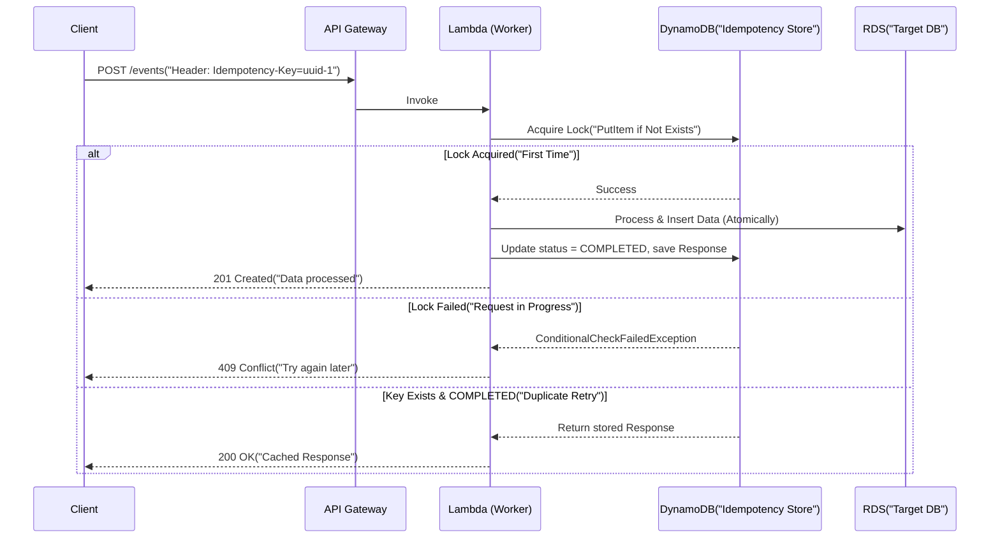

Trong các hệ thống phân tán (distributed systems) quy mô lớn, lỗi không phải là xác suất mà là một hằng số. Network partition, Database deadlock, Pod bị OOMKilled, hoặc Spot Instances bị thu hồi (preempted) luôn rình rập ở mọi khâu. Để đảm bảo tính toàn vẹn của dữ liệu (data integrity) trong một môi trường "thù địch" như vậy, các hệ thống bắt buộc phải liên tục thực hiện Retry (thử lại). 

Tuy nhiên, nếu bạn retry một thao tác non-idempotent, hậu quả sẽ là duplicate records, dirty state, và corrupt data. Đây là lúc **Tính lũy đẳng (Idempotency)** trở thành ranh giới sinh tử giữa một Data Platform cấp doanh nghiệp và một script chạy cho vui.

Bài viết này đi sâu vào kiến trúc, code thực tế, và systemic trade-offs của Idempotency dưới góc nhìn của một Staff Data Engineer.

---

## 1. Bản Chất Toán Học và Hệ Thống Của Idempotency

Về mặt toán học, thao tác $f(x)$ là lũy đẳng nếu $f(f(x)) = f(x)$. 
Trong Engineering, Idempotency (Tính lũy đẳng) đảm bảo rằng: Việc thực thi một operation (gọi API, consume Kafka message, chạy Spark job) **một lần hay $N$ lần** đều cho ra cùng một trạng thái hệ thống cuối cùng (final system state) và không gây ra side effects (tác dụng phụ) không mong muốn.

### Tại sao chúng ta cần nó? "Failures are a feature, not a bug"

1. **At-Least-Once Delivery**: Hầu hết các message brokers (Kafka, SQS, RabbitMQ) mặc định đảm bảo gửi tin nhắn "ít nhất một lần". Một message **có thể và sẽ** bị duplicate do Consumer bị timeout trước khi kịp gửi ACK, hoặc do split-brain / network partition.
2. **Zombie Tasks & Speculative Execution**: Trong Spark hoặc Hadoop, khi một node có vẻ chậm (straggler), Master node có thể spawn một task tương tự trên node khác (Speculative Execution). Cả hai task cùng ghi dữ liệu. Nếu không có idempotency, bạn sẽ bị double-counting.
3. **Backfill & Reprocessing**: Business logic thay đổi liên tục. Bạn phải chạy lại toàn bộ pipeline 3 năm qua (Backfill). Một pipeline idempotent cho phép bạn truyền vào `execution_date` và chạy mà không cần viết script `DELETE` dọn dẹp thủ công.

---

## 2. Kiến Trúc (Architecture) & Pattern Idempotency

### 2.1. Idempotency Key & Idempotency Store Pattern

Trong các hệ thống API ingestion hoặc Microservices (như Stripe, Uber), client tạo ra một UUID duy nhất gọi là **Idempotency Key** và gửi kèm request. Backend sử dụng một Idempotency Store (thường là Redis, DynamoDB có TTL) để chặn các duplicate request.



**Terraform cấp phát DynamoDB Idempotency Store:**
```hcl
resource "aws_dynamodb_table" "idempotency_table" {
  name           = "data-pipeline-idempotency"
  billing_mode   = "PAY_PER_REQUEST"
  hash_key       = "idempotency_key"

  attribute {
    name = "idempotency_key"
    type = "S"
  }

  ttl {
    attribute_name = "expiration_ts"
    enabled        = true
  }

  tags = {
    Environment = "Production"
    Purpose     = "IdempotencyStore"
  }
}
```

### 2.2. Deterministic Partition Overwrite (Data Lake/Warehouse)

Trong Data Lake (S3, GCS) hoặc Data Warehouse (BigQuery, Snowflake), pattern phổ biến nhất là **đọc tĩnh, biến đổi stateless, và ghi đè toàn bộ phân vùng (Partition Overwrite)**.

Tuyệt đối không dùng `INSERT INTO` (append-only) mà không có logic deduplication.

**SQL Example (Hive/Spark SQL):**
```sql
-- Dù Airflow retry task này 100 lần, partition 2024-03-01 vẫn chỉ chứa dữ liệu chuẩn của ngày đó.
INSERT OVERWRITE TABLE gold_fact_sales 
PARTITION (ds = '2024-03-01')
SELECT 
    order_id,
    customer_id,
    amount
FROM silver_cleaned_sales 
WHERE ds = '2024-03-01' 
  AND status = 'COMPLETED';
```

### 2.3. Upsert / Merge / Mutable Data Structures

Với các hệ thống hỗ trợ ACID transactions như PostgreSQL hoặc Modern Data Lakehouse (Delta Lake, Apache Hudi, Apache Iceberg), lệnh `MERGE INTO` (Upsert) dựa trên Primary Key là "chén thánh".

**Delta Lake (PySpark) Merge Code:**
```python
from delta.tables import DeltaTable

# Khởi tạo Delta Table đang tồn tại
deltaTable = DeltaTable.forPath(spark, "s3a://data-lake/gold/users")

# Upsert (Merge) dựa trên Primary Key
deltaTable.alias("target").merge(
    source=df_updates.alias("source"),
    condition="target.user_id = source.user_id"
).whenMatchedUpdateAll(
).whenNotMatchedInsertAll(
).execute()
```
*Trade-off:* Lệnh `MERGE` rất an toàn, nhưng tốn chi phí I/O (Read-Modify-Write) và dễ gây ra Write Amplification lớn so với Partition Overwrite tĩnh.

---

## 3. Systemic Trade-offs: Latency vs. Throughput vs. Idempotency

Idempotency không đến miễn phí. Nó đòi hỏi hệ thống phải duy trì State (trạng thái) để biết việc gì đã làm và chưa làm.

1. **Latency Overhead:** Việc thêm một lượt check DynamoDB (Idempotency Store) trước khi xử lý làm tăng latency (độ trễ) thêm khoảng 5-20ms. Trong các hệ thống Ultra-Low Latency (HFT - High Frequency Trading), kỹ sư có thể bỏ qua Idempotency ở tầng ingestion và chấp nhận dùng Batch Deduplication ở cuối ngày.
2. **Storage Costs (Throughput vs. TTL):** Lưu trữ 100% Idempotency Keys là không tưởng với Big Data. Giải pháp: Sử dụng Time-To-Live (TTL). Ví dụ, Stripe lưu Idempotency Keys trong 24 giờ. Nếu request retry sau 24h, nó sẽ bị coi là request mới và backend sẽ không check cache nữa.
3. **Exactly-Once Semantics (EOS) Penalty:** Kafka Transaction (EOS) đòi hỏi Two-Phase Commit (2PC) giữa Producer và Broker, làm giảm Throughput (băng thông) tới 30-50% so với At-Least-Once. Bạn phải cân nhắc xem sự trùng lặp (duplication) có tốn kém hơn chi phí suy giảm hiệu năng hay không.

---

## 4. Real-world Incidents & Troubleshooting (Kinh Nghiệm Thực Chiến)

### 4.1. Sự cố `datetime.now()` (Non-deterministic inputs)
*   **Incident:** Báo cáo doanh thu bị sai lệch dữ liệu nặng nề sau khi Data Engineer bấm "Clear & Retry" task của tuần trước trên Airflow.
*   **Root Cause:** Script Python gọi hàm `datetime.now()` để lấy "ngày hôm qua" thay vì dùng `execution_date` do Airflow truyền vào. Khi chạy lại task tuần trước vào hôm nay, hàm `datetime.now()` vẫn trả về hôm nay, dẫn đến việc xử lý sai timeframe.
*   **Fix (Airflow Context):**
```python
# BAD: Non-idempotent (phụ thuộc vào thời gian thực tế chạy code)
def process_data():
    date = (datetime.now() - timedelta(days=1)).strftime('%Y-%m-%d')
    # ...

# GOOD: Idempotent using logical date context
def process_data(**kwargs):
    logical_date = kwargs['ds'] # '2024-03-01' stays constant even on retries in 2026
    # ...
```

### 4.2. Consumer Lag do "Poison Pill" & Infinite Retry
*   **Incident:** Kafka consumer lag tăng vọt lên hàng triệu messages. Pipeline streaming bị chặn hoàn toàn.
*   **Root Cause:** Một message bị lỗi định dạng (Poison Pill) làm ứng dụng throw Exception. Hệ thống streaming (Flink/Spark) restart task và retry cái message đó mãi mãi (Infinite Retry). Vì operation không idempotent một cách graceful (xử lý lỗi sạch sẽ), nó block toàn bộ luồng.
*   **Troubleshooting:** Áp dụng **Dead Letter Queue (DLQ)** cho các messages không thể xử lý. Đồng thời thiết kế logic catch Exception và ghi đè / bỏ qua nếu Idempotency check xác nhận message đã gây crash $N$ lần.

### 4.3. Data Lake Split-Brain (Eventual Consistency & OOMKilled)
*   **Incident:** Ghi đè partition bằng Spark chạy ra kết quả 0 bytes.
*   **Root Cause:** Job 1 đang ghi dữ liệu vào thư mục S3 và sập giữa chừng (Pod bị OOMKilled). Dữ liệu rác còn nằm trên bucket. Job 2 (Retry) chạy và đọc nhầm dữ liệu rác của Job 1 (vì nằm chung folder). Khi Job 2 ghi đè đè lên chính nó, kết quả là hỏng file hoàn toàn.
*   **Solution:** Sử dụng kiến trúc Staging Area, ghi vào một temp path có Unique Task ID (`UUID`), sau đó dùng lệnh Move/Rename nguyên tử (Atomic Rename) để tráo đổi thư mục vào path chính thức. (Tính năng này được support built-in bởi thuật toán v2 của Hadoop `FileOutputCommitter`).

---

## Tổng kết

Idempotency là một nguyên tắc không thể thoái hiệp đối với Staff/Senior Data Engineers. Nó là tiền đề để xây dựng những hệ thống tự phục hồi (Self-healing systems) và DataOps automation. 
Thay vì hỏi *"Làm sao để hệ thống của tôi không bao giờ sập?"*, hãy hỏi *"Hệ thống của tôi sẽ an toàn thế nào nếu nó sập và tự động chạy lại 100 lần?"*. Khi mọi pipeline đều là idempotent, những ca trực đêm khắc phục sự cố (on-call) của bạn sẽ chỉ đơn giản là một cú click "Rerun" trên màn hình và yên tâm đi ngủ tiếp.

---

## Nguồn Tham Khảo (References)
* **AWS Architecture Blog:** [Handling Lambda functions idempotency with AWS Lambda Powertools](https://aws.amazon.com/blogs/compute/handling-lambda-functions-idempotency-with-aws-lambda-powertools/)
* **Stripe Engineering:** [Designing robust and predictable APIs with idempotency](https://stripe.com/blog/idempotency)
* **Netflix TechBlog:** [How Netflix scales its API with GraphQL Federation and Idempotent Mutations](https://netflixtechblog.com/)
* **Databricks Blog:** [Idempotency and Incremental Data Ingestion with Auto Loader](https://databricks.com/blog/category/engineering)
* **Martin Kleppmann:** *Designing Data-Intensive Applications* (O'Reilly Media) - Chương 11: Stream Processing.
