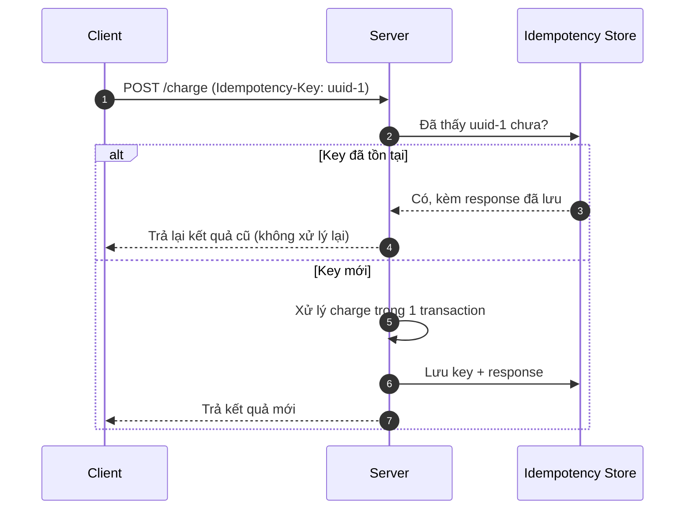

Một task ETL fail lúc 2 giờ sáng. Scheduler retry nó. Đến sáng, báo cáo doanh thu cao gấp đôi vì cùng một ngày dữ liệu bị nạp hai lần. Đây không phải tình huống hiếm, mà là mặc định của hầu hết hệ thống phân tán: mạng rớt, pod bị OOMKilled, consumer timeout trước khi kịp ACK. Retry là cách duy nhất để sống sót qua những lỗi đó, nhưng retry chỉ an toàn khi thao tác được thiết kế để chạy lại mà không đổi kết quả.

Tính chất đó gọi là idempotency.

## Idempotency là gì, và vì sao nó không tùy chọn

Về mặt toán học, một hàm là lũy đẳng nếu $f(f(x)) = f(x)$. Trong kỹ thuật, một thao tác là idempotent nếu thực thi nó một lần hay $N$ lần đều để hệ thống ở cùng một trạng thái cuối, không sinh side effect ngoài ý muốn. Gọi API charge tiền một lần hay năm lần, khách vẫn chỉ bị trừ một lần. Chạy lại Spark job cho ngày `2024-03-01` bao nhiêu lần, partition đó vẫn chứa đúng dữ liệu của ngày đó.

Stripe mô tả lý do gốc rễ rất gọn: mạng vốn không đáng tin, và khi một request fail giữa chừng, client rơi vào trạng thái mơ hồ, không biết server đã xử lý hay chưa ([Stripe, *Designing robust and predictable APIs with idempotency*](https://stripe.com/blog/idempotency)). Client chỉ có một cách thoát khỏi sự mơ hồ đó: retry cho đến khi chắc chắn thành công. Nhưng retry một thao tác không idempotent thì mỗi lần thử lại là một lần rủi ro nhân đôi dữ liệu.

Có ba nguồn lặp mà một Data Engineer gần như chắc chắn sẽ gặp:

Message broker giao "ít nhất một lần". Kafka, SQS, RabbitMQ mặc định đảm bảo at-least-once. Một message sẽ bị giao lại nếu consumer xử lý xong nhưng chết trước khi commit offset. Consumer buộc phải chịu được việc thấy cùng một message hai lần.

Retry của orchestrator. Airflow, Dagster hay bất kỳ scheduler nào đều retry task khi fail. Tài liệu Airflow nói thẳng: task nên được thiết kế như một transaction — chạy nhiều lần với cùng tham số phải cho cùng kết quả, để scheduler có thể an toàn thử lại ([Apache Airflow, *Best Practices*](https://airflow.apache.org/docs/apache-airflow/stable/best-practices.html)).

Backfill. Logic nghiệp vụ đổi, và bạn phải chạy lại pipeline cho ba năm dữ liệu cũ. Nếu pipeline idempotent, backfill chỉ là chạy lại với `logical_date` khác. Nếu không, bạn phải viết script `DELETE` dọn dẹp thủ công trước mỗi lần chạy — và đó là nơi lỗi sinh ra.

## Idempotency key: cách của Stripe

Với thao tác *mutating* như charge tiền, HTTP không có sẵn ngữ nghĩa an toàn (`POST` không idempotent như `PUT`/`DELETE`). Stripe giải quyết bằng idempotency key: client tự sinh một ID duy nhất cho mỗi ý định thao tác (khuyến nghị UUID v4) và gửi kèm trong header `Idempotency-Key`. Server lưu kết quả của lần xử lý đầu tiên gắn với key đó. Mọi request sau mang cùng key đều nhận lại kết quả đã lưu, kể cả khi lần đầu trả lỗi ([Stripe API Reference, *Idempotent requests*](https://docs.stripe.com/api/idempotent_requests)).

Điều đáng chú ý là bản chất tối giản của nó. Không cần "kiến trúc ba tầng" gì cả — cốt lõi chỉ là: lưu key, tra key, trả lại kết quả cũ nếu key đã thấy. Stripe cho phép xóa key sau tối thiểu 24 giờ, vì cửa sổ retry thực tế rất ngắn ([Stripe blog](https://stripe.com/blog/idempotency)).



Một điểm Stripe nhấn mạnh mà nhiều bài tóm tắt bỏ qua: retry phải "lịch sự". Nếu server đang sự cố, hàng loạt client retry cùng lúc sẽ dồn tải và làm nó sập sâu hơn — thundering herd. Cách xử lý là exponential backoff (chờ theo $2^n$ sau mỗi lần fail) cộng thêm jitter ngẫu nhiên để các client không retry đồng loạt ([Stripe blog](https://stripe.com/blog/idempotency)). Idempotency ở server và backoff ở client là hai nửa của cùng một thiết kế.


*Thundering herd: khi server gặp sự cố, hàng loạt client retry đồng loạt càng dồn tải khiến nó sập sâu hơn. Nguồn: [Stripe — Designing robust and predictable APIs with idempotency](https://stripe.com/blog/idempotency).*

## Trong pipeline dữ liệu, idempotency thường nằm ở tầng ghi

API idempotency giải quyết một request. Pipeline dữ liệu xử lý hàng triệu bản ghi mỗi lần chạy, nên cách làm khác. Ý tưởng chung: đừng append mù, hãy làm cho lần ghi thứ hai ghi đè hoặc hợp nhất với lần đầu.

Upsert bằng khóa chính là cách phổ biến nhất trên lakehouse. `MERGE INTO` của Delta Lake hay Iceberg update nếu khóa đã tồn tại và insert nếu chưa. Airflow retry task này một lần hay trăm lần, trạng thái cuối vẫn nhất quán.

```python
from delta.tables import DeltaTable

target = DeltaTable.forPath(spark, "s3a://data-lake/gold/users")

(target.alias("t")
    .merge(df_updates.alias("s"), "t.user_id = s.user_id")
    .whenMatchedUpdateAll()
    .whenNotMatchedInsertAll()
    .execute())
```

Partition overwrite là cách của thế giới không có table format. Thay vì `INSERT INTO` (append-only, retry là nhân đôi), dùng `INSERT OVERWRITE` cho đúng partition. Kết quả cuối của partition chỉ phụ thuộc vào input, không phụ thuộc số lần chạy.

```sql
-- Chạy lại bao nhiêu lần, partition ds='2024-03-01' vẫn chỉ chứa dữ liệu đúng của ngày đó.
INSERT OVERWRITE TABLE gold_fact_sales
PARTITION (ds = '2024-03-01')
SELECT order_id, customer_id, amount
FROM silver_cleaned_sales
WHERE ds = '2024-03-01' AND status = 'COMPLETED';
```

Tài liệu Airflow tóm tắt đúng bộ nguyên tắc này cho task lặp lại được: thay `INSERT` bằng upsert, tránh hàm volatile trong tính toán quan trọng, và không đọc "dữ liệu mới nhất" mà đọc từ một partition xác định ([Apache Airflow, *Best Practices*](https://airflow.apache.org/docs/apache-airflow/stable/best-practices.html)).

## Kafka: idempotency ở tầng producer và exactly-once

Kafka tách bài toán làm hai mức. Idempotent producer chống trùng do retry của chính producer: broker gán mỗi producer một Producer ID và theo dõi số thứ tự (sequence number) cho từng partition; nếu một message tới hai lần do retry, broker so sánh sequence number và bỏ qua bản trùng thay vì ghi lại. Từ Kafka 3.0, idempotence bật mặc định, với ràng buộc `acks=all`, `retries > 0` và `max.in.flight.requests.per.connection <= 5` ([Apache Kafka, KIP-98](https://cwiki.apache.org/confluence/display/KAFKA/KIP-98+-+Exactly+Once+Delivery+and+Transactional+Messaging)).

Transaction là mức trên: ghi nguyên tử qua nhiều partition/topic. Một Transaction Coordinator trong broker điều phối two-phase commit — hoặc tất cả message trong batch được commit, hoặc không cái nào. Gán `transactional.id` cố định còn cho phép Kafka "fence" các producer zombie (instance cũ chưa tắt hẳn), tránh split-brain ([KIP-98](https://cwiki.apache.org/confluence/display/KAFKA/KIP-98+-+Exactly+Once+Delivery+and+Transactional+Messaging)). Đây là nền cho exactly-once giữa các stage Kafka.

Điểm dễ hiểu sai: exactly-once của Kafka đảm bảo trong phạm vi Kafka. Khi consumer ghi ra một hệ ngoài (database, S3), tính idempotent của lần ghi đó vẫn là trách nhiệm của bạn — quay lại upsert và partition overwrite ở trên. Và transaction không miễn phí: two-phase commit thêm overhead, nên trước khi bật, hãy cân xem chi phí trùng lặp có thực sự đắt hơn chi phí throughput hay không.

## Nơi idempotency hay vỡ: input không xác định

Hầu hết sự cố idempotency không đến từ thuật toán ghi, mà từ một input lẽ ra phải tĩnh nhưng lại thay đổi theo thời điểm chạy.

Ví dụ kinh điển: script lấy "hôm qua" bằng `datetime.now()`. Chạy đúng lịch thì không sao. Nhưng khi bạn "Clear & Retry" task của tuần trước, `datetime.now()` lại trả về hôm nay, và task xử lý nhầm khung thời gian. Cách sửa là dùng logical date do orchestrator truyền vào — giá trị này không đổi khi rerun hay backfill, đúng như thiết kế của Airflow ([Apache Airflow, *Best Practices*](https://airflow.apache.org/docs/apache-airflow/stable/best-practices.html)).

```python
# Sai: phụ thuộc thời điểm chạy thực tế
def process_data():
    date = (datetime.now() - timedelta(days=1)).strftime("%Y-%m-%d")

# Đúng: dùng logical date từ context, tĩnh với mọi lần rerun
def process_data(ds=None):
    logical_date = ds  # '2024-03-01' bất kể chạy lại năm nào
```

Cùng loại lỗi còn xuất hiện dưới dạng khác: khóa dedup sinh từ `uuid4()` thay vì từ nội dung bản ghi (mỗi lần chạy ra khóa mới, dedup vô nghĩa), hay đọc "bảng nguồn hiện tại" thay vì snapshot của đúng khoảng thời gian. Kleppmann gọi chung nhóm này là vấn đề của thao tác phụ thuộc trạng thái ngoài, và lời khuyên xuyên suốt là tách phần quyết định (dựa trên input tĩnh) khỏi phần thực thi ([Kleppmann, *Designing Data-Intensive Applications*, Ch. 11](https://dataintensive.net/)).

## Điểm mạnh và điểm yếu

Cái được lớn nhất của idempotency là hệ thống tự phục hồi: retry và backfill trở thành thao tác an toàn, không cần script dọn dẹp thủ công, và một sự cố ban đêm không kéo theo lệch số liệu ban ngày. Đổi lại, nó buộc hệ thống phải giữ thêm trạng thái để biết việc gì đã làm — bảng idempotency key, sequence number, hay metadata của table format. Trạng thái đó tốn lưu trữ và thêm một lượt tra cứu trước khi ghi. Với phần lớn pipeline dữ liệu, chi phí này nhỏ so với cái giá của dữ liệu sai; chỉ trong các hệ siêu nhạy độ trễ, người ta mới cân nhắc bỏ idempotency ở tầng nhận và dồn việc chống trùng về một bước dedup theo lô ở cuối.

## Khi nào nên và không nên dùng

Không có một cơ chế idempotency đúng cho mọi tầng. Nếu là API mutating có side effect tiền bạc, dùng idempotency key với backoff và jitter ở client. Nếu ghi vào lakehouse có khóa chính rõ, dùng `MERGE`/upsert. Nếu ghi theo lô vào bảng phân vùng và không có table format, dùng `INSERT OVERWRITE` theo partition. Nếu cần đảm bảo giữa các stage trong Kafka, bật idempotent producer (gần như miễn phí) và chỉ dùng transaction khi thực sự cần ghi nguyên tử đa partition.

Chỗ duy nhất nên cân nhắc bỏ qua idempotency là khi trùng lặp rẻ hơn nhiều so với chi phí giữ trạng thái, và có một bước dedup đáng tin ở hạ nguồn gánh phần đó. Ngoài trường hợp này, câu hỏi thiết kế nên hỏi không phải "làm sao để pipeline không bao giờ fail", mà "pipeline sẽ ra sao nếu nó fail và tự chạy lại 100 lần". Nếu câu trả lời là "vẫn đúng", bạn đã có idempotency.

## Thuật ngữ chính (Key terms)

| Term | Nghĩa ngắn |
| --- | --- |
| Idempotency | Chạy một thao tác một lần hay N lần đều cho cùng trạng thái cuối, không side effect thừa |
| Idempotency key | ID duy nhất client gửi kèm request để server nhận ra và trả lại kết quả của lần xử lý đầu |
| At-least-once delivery | Broker đảm bảo giao tin ít nhất một lần, nên bản trùng là chuyện bình thường |
| Idempotent producer | Producer Kafka tự khử trùng khi retry nhờ Producer ID + sequence number |
| Exactly-once semantics | Đảm bảo mỗi bản ghi được xử lý đúng một lần, trong phạm vi Kafka |
| Upsert / MERGE | Ghi hợp nhất theo khóa: update nếu tồn tại, insert nếu chưa |
| Logical date | Mốc thời gian tĩnh orchestrator truyền vào, không đổi khi rerun/backfill |

## References

- Brandur Leach, Stripe — [Designing robust and predictable APIs with idempotency](https://stripe.com/blog/idempotency)
- Stripe — [Idempotent requests (API Reference)](https://docs.stripe.com/api/idempotent_requests)
- Apache Kafka — [KIP-98: Exactly Once Delivery and Transactional Messaging](https://cwiki.apache.org/confluence/display/KAFKA/KIP-98+-+Exactly+Once+Delivery+and+Transactional+Messaging)
- Apache Airflow — [Best Practices](https://airflow.apache.org/docs/apache-airflow/stable/best-practices.html)
- Martin Kleppmann — *Designing Data-Intensive Applications*, Chương 11: Stream Processing (O'Reilly)
