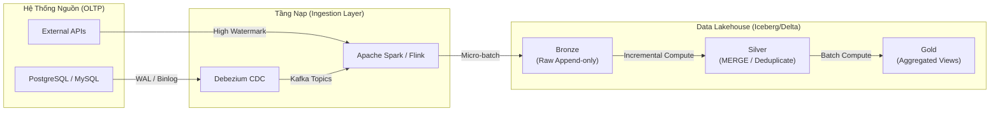

Ở quy mô dữ liệu nhỏ (vài GB), Full Load (Snapshot toàn bộ dữ liệu định kỳ mỗi đêm) là phương pháp an toàn, dễ code và dễ bảo trì nhất. Tuy nhiên, khi hệ thống vươn lên quy mô Terabyte hoặc Petabyte, việc Full Load trở thành thảm họa. Nó đốt cháy tài nguyên (Compute & Network IO) và phá vỡ hoàn toàn các hợp đồng SLA (Service Level Agreement) về độ trễ dữ liệu (Data Freshness).

**Incremental Load (Nạp dữ liệu gia tăng)** không chỉ đơn thuần là câu lệnh "lấy dữ liệu mới". Dưới lăng kính của một Data Engineer / Staff Engineer, đây là bài toán kinh điển về **quản lý trạng thái (State Management)**, đảm bảo **tính lũy đẳng (Idempotency)**, xử lý sự bất đồng bộ của hệ thống phân tán (Late-arriving data, Clock Skew) và thiết kế chiến lược giải quyết xung đột (Conflict Resolution) tại hệ thống đích.

## 1. Kiến Trúc Tổng Thể (System Architecture)

Ngày nay, Incremental Load thường được thiết kế gắn liền với **Medallion Architecture** và các định dạng **Open Table Formats** (Apache Iceberg, Apache Hudi, Delta Lake) để hỗ trợ Transactional ACID ngay trên Data Lake.



Sự kết hợp giữa **CDC (Change Data Capture)** và **Open Table Formats** cho phép hệ thống chuyển từ xử lý Batch cổ điển (chạy lúc 2h sáng) sang **Micro-batching** hoặc **Continuous Processing**, mang lại độ trễ tính bằng phút (Near real-time) trong khi vẫn duy trì băng thông xử lý khổng lồ.

## 2. Các Mô Hình Incremental Load (Incremental Load Patterns)

Có 2 chiến lược thiết kế chính để kéo dữ liệu gia tăng từ hệ thống nguồn, mỗi chiến lược mang trong mình một Systemic Trade-off riêng biệt.

### 2.1. Dựa trên State / High-water mark (Query-based)

Phương pháp kinh điển nhất: Data Pipeline lưu lại một **High-water mark** (thường là timestamp `updated_at` hoặc auto-increment `id`) từ lần chạy thành công trước đó (Checkpointing). Lần chạy tiếp theo, Pipeline chỉ query các bản ghi có giá trị lớn hơn mốc này.

**Vấn đề vật lý (Clock Skew & Late-arriving Data):**
Trong môi trường cơ sở dữ liệu ACID (như PostgreSQL), một Transaction mở lúc `10:00` nhưng kéo dài tới `10:05` mới Commit. Nếu Pipeline quét data lúc `10:04` với mốc watermark là `10:04`, thì ở lần chạy tiếp theo (quét từ `10:04`), transaction kia (mang timestamp `10:00`) sẽ mãi mãi bị bỏ sót. Đây gọi là hiện tượng *In-flight Data Loss*.

**Code Thực Chiến (SQL Extraction với Lookback Window):**
Để khắc phục, kỹ sư phải sử dụng kỹ thuật **Lookback Window** (Trích xuất giật lùi).
```sql
-- Trích xuất dữ liệu dựa trên High-water mark kết hợp Lookback window (2 giờ)
-- Kỹ thuật này ép hệ thống phải đọc lại một phần dữ liệu cũ để không sót transaction
SELECT * 
FROM production.orders
WHERE updated_at >= (SELECT max_watermark - INTERVAL '2 hours' FROM pipeline_state)
  AND updated_at < CURRENT_TIMESTAMP;
```

**Đánh đổi Hệ thống (Trade-offs):**
- **Ưu điểm:** Dễ cài đặt, không cần cấp quyền Admin/Replication vào hạ tầng DB nguồn. Tương thích với hầu hết mọi loại DB và REST API.
- **Nhược điểm (Hard Deletes):** Bị mù hoàn toàn trước các sự kiện `DELETE` vật lý (vì record đã biến mất khỏi bảng, không thể so sánh watermark). Đòi hỏi hệ thống đích phải thực thi `UPSERT` cực nặng để đè lại dữ liệu (Deduplication). Gây áp lực Table Scan nếu DB nguồn không có Index trên cột `updated_at`.

### 2.2. Change Data Capture (Log-based CDC)

Kỹ thuật tiêu chuẩn ở quy mô siêu lớn (FAANG). Thay vì query trực tiếp (Pull) gây tốn CPU của DB, Ingestion Layer "nghe lén" (Listen) trực tiếp từ **Transaction Log** (WAL của PostgreSQL, Binlog của MySQL). 

**Code Thực Chiến (Debezium Kafka Connector JSON):**
```json
{
  "name": "inventory-cdc-connector",
  "config": {
    "connector.class": "io.debezium.connector.postgresql.PostgresConnector",
    "database.hostname": "postgres.production.internal",
    "database.port": "5432",
    "database.user": "replication_user",
    "database.password": "${hidden}",
    "database.server.name": "prod_db",
    "plugin.name": "pgoutput",
    "table.include.list": "public.orders,public.customers",
    "snapshot.mode": "initial"
  }
}
```

**Đánh đổi Hệ thống (Trade-offs):**
- **Ưu điểm:** Bắt được 100% mọi sự thay đổi (Insert, Update, Delete) với độ trễ Sub-second. Hoàn toàn không ăn một tí CPU nào của Query Engine (do chỉ đọc tệp tin Log nhị phân). Giải quyết triệt để bài toán Hard Deletes.
- **Nhược điểm:** Biến kiến trúc thành một "Con quái vật" phân tán. Đội ngũ Data phải biết cách quản trị ZooKeeper, Kafka Brokers, Schema Registry và Debezium Connectors.

## 3. Quản lý Trạng Thái Tại Đích (Target State Management & UPSERT)

Việc lôi được mớ dữ liệu gia tăng (Delta) về Data Lake mới chỉ là 50% chặng đường. 50% còn lại là làm sao "nhồi" mớ Delta này vào bảng đích mà không sinh ra dữ liệu rác (Duplicates). Đây là lúc lệnh `MERGE` (UPSERT) tỏa sáng.

### 3.1. Dbt Incremental Model & Lệnh MERGE
Trong kiến trúc hiện đại, công cụ như `dbt` (Data Build Tool) quản lý cực tốt các logic này. Dưới mui xe (Under the hood), nó biên dịch thành lệnh `MERGE INTO` để đè (Overwrite) dòng cũ bằng dòng mới.

**Mã Thực Chiến (dbt model config cho Delta Lake / BigQuery):**
```yaml
{{
    config(
        materialized='incremental',
        unique_key='order_id',  -- Chìa khóa để Deduplicate
        incremental_strategy='merge', -- Sử dụng MERGE thay vì Append
        partition_by={
            "field": "created_at",
            "data_type": "timestamp",
            "granularity": "day"
        }
    )
}}

-- Logic SQL Transformation
WITH source_data AS (
    SELECT 
        order_id,
        user_id,
        status,
        updated_at
    FROM {{ source('raw_bronze', 'orders_cdc_stream') }}
)

SELECT * FROM source_data

  -- Filter này dùng để giảm Compute Cost khi tính toán Transformation
  WHERE updated_at > (SELECT max(updated_at) FROM {{ this }})

```

### 3.2. Cạm bẫy của MERGE (The UPSERT Bottleneck)
Lệnh `MERGE` là một con dao hai lưỡi. Để tìm ra record cần Update, Engine (như Spark hoặc BigQuery) bắt buộc phải quét (Scan) lại các phân vùng của bảng Target. 
- **Cảnh báo (Warning):** Nếu bảng Target quá lớn (hàng tỷ dòng) và không được phân vùng (Partitioning) hoặc không có Clustering Key chuẩn xác, lệnh MERGE sẽ quét Full Table để tìm kiếm `unique_key`. Lúc này, Incremental Load lại trở thành một cái Full Load chìm (Hidden Full Load), đốt cháy hàng ngàn đô la Compute Cost vô ích.
- **Khắc phục:** Luôn phân vùng bảng Target theo thời gian (Time-partitioned) và nhồi thêm điều kiện Partition vào mệnh đề `ON` của lệnh MERGE để giới hạn phạm vi quét (Partition Pruning).

## 4. Xử lý Sự cố Thực tế (Real-world Troubleshooting)

Vận hành Incremental Load ở quy mô vài nghìn bảng (Tables) chắc chắn sẽ đụng độ các sự cố hạ tầng khét tiếng sau:

### 4.1. Consumer Lag (Độ trễ Consumer)
- **Hiện tượng:** Tốc độ Ingest của Spark Streaming chậm hơn tốc độ DB nguồn tạo ra transaction. Kafka Consumer Lag tăng vọt lên hàng triệu messages.
- **Xử lý vật lý:** Không thể cứ tăng cấu hình bừa bãi. Phải kiểm tra xem Partition của Kafka Topic có đủ lớn chưa. Tăng số lượng Kafka Partitions (ví dụ: từ 10 lên 50) và scale-out số lượng Executors tương ứng của Spark để tận dụng tối đa Parallelism. Tránh xa các UDF (User Defined Functions) nặng trong quá trình Ingest.

### 4.2. OOMKilled (Tràn Bộ Nhớ RAM)
- **Hiện tượng:** Hệ thống Data Pipeline bảo trì (downtime) suốt 5 tiếng đồng hồ. Khi bật lại, mớ Backlog dữ liệu Incremental dồn ứ quá khổng lồ ập vào cùng lúc. Task Executor bị YARN/K8s bắn hạ với mã lỗi `SIGKILL 137` (OOMKilled).
- **Xử lý vật lý:** Cấu hình giới hạn kích thước mỗi mẻ nạp (Micro-batch). Ví dụ: set tham số `maxOffsetsPerTrigger` trong Spark Structured Streaming, hoặc `max_bytes` trong Kafka Consumer. Việc này ép hệ thống chia nhỏ mớ Backlog khổng lồ thành nhiều lô nhỏ an toàn, "tiêu hóa" từ từ cho đến khi bắt kịp thời gian thực (Catch up).

### 4.3. Schema Drift (Trôi dạt cấu trúc)
- **Hiện tượng:** Kỹ sư Backend vô tình chạy `ALTER TABLE DROP COLUMN` trên DB nguồn. Pipeline CDC đang chạy mượt mà bỗng Crash 502 liên tục vì Schema không khớp với bảng Target.
- **Xử lý kỹ thuật:** Tích hợp **Schema Registry** (Avro / Protobuf). Bật tính năng **Schema Evolution** (Auto Merge Schema) trên Iceberg hoặc Delta Lake. Đảm bảo toàn công ty tuân thủ quy trình "Backward Compatibility" [Tương thích ngược] khi thay đổi DB schema.

## Nguồn Tham Khảo (References)

* [Netflix TechBlog: How Netflix Uses Apache Iceberg for Incremental Processing](https://netflixtechblog.com/)
* [Uber Engineering: Apache Hudi - Transactional Data Lakes](https://eng.uber.com/)
* [AWS Architecture Blog: Design log-based CDC architectures with AWS DMS and Apache Iceberg](https://aws.amazon.com/blogs/architecture/)
* Thiết kế Hệ thống Dữ liệu Chuyên sâu (Designing Data-Intensive Applications - Martin Kleppmann) - Phân tích chi tiết về Stream Processing và Batch Processing.
