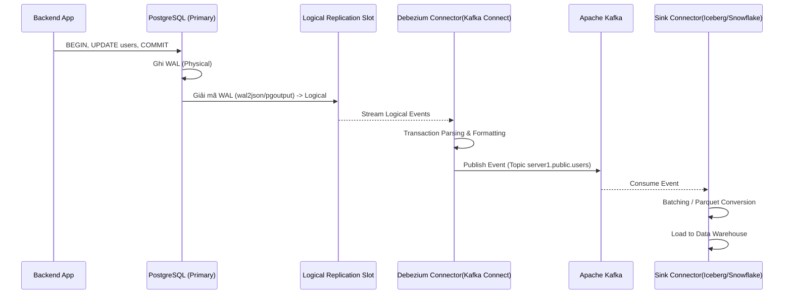

Thay vì liên tục query database định kỳ [Polling] và làm cạn kiệt tài nguyên I/O (Query-based CDC), **Log-based Change Data Capture (CDC)** tận dụng chính cơ chế transaction logging nội tại của Database Engine để capture thay đổi dữ liệu theo thời gian thực. Phương pháp này mang lại low-latency streaming pipeline, giảm thiểu tải (zero-impact) trên Primary Database, và đảm bảo 100% tính nguyên vẹn (consistency) của dữ liệu.

Bài viết này đi sâu vào internals (bên dưới engine) của Log-based CDC, từ cơ chế Write-Ahead Log (WAL), transaction parsing, việc vận hành Debezium trên production, cho đến những giải pháp tùy biến từ các gã khổng lồ như Netflix và Uber.

---

## 1. Bản Chất của Transaction Logs (WAL / Binlog)

Bất kỳ hệ quản trị cơ sở dữ liệu quan hệ (RDBMS) nào tuân thủ ACID đều không ghi (flush) data trực tiếp vào các table data files trên đĩa cứng ngay lập tức. Hành động này tạo ra Random I/O và sẽ giết chết hiệu năng. Thay vào đó, chúng sử dụng **Sequential I/O** để ghi các thay đổi vào một append-only log file trước khi xác nhận (commit) transaction.

*   **PostgreSQL**: Write-Ahead Log (WAL)
*   **MySQL**: Binary Log (Binlog) và InnoDB Redo Log
*   **Oracle**: Redo Log

### Cơ Chế Fsync và Độ Trễ (Latency)
Độ trễ của hệ thống CDC phụ thuộc trực tiếp vào cách Database engine flush log xuống đĩa. Ví dụ, trong MySQL, tham số `sync_binlog` quyết định bao lâu hệ thống gọi lệnh `fsync()` của OS.
*   `sync_binlog=1`: An toàn nhất (ACID strictest), nhưng I/O penalty cao nhất. Mỗi transaction commit đều trigger fsync.
*   `sync_binlog=0` hoặc `>1`: Hệ điều hành (OS) quyết định lúc nào flush. Tăng throughput nhưng có rủi ro mất data khi host crash.

Hệ thống Log-based CDC đóng vai trò như một **Replica node (bản sao) giả mạo**, connect trực tiếp vào Primary DB và yêu cầu stream các file log này qua network.

---

## 2. Kiến Trúc End-to-End với Debezium và Kafka

[Debezium](https://debezium.io/] là chuẩn công nghiệp (de-facto standard) cho CDC mã nguồn mở, thường chạy như một tập hợp các source connectors trên nền Apache Kafka Connect.

### Luồng Hoạt Động (Data Flow)

Dưới đây là một Mermaid diagram mô tả chi tiết luồng xử lý từ Database đến Data Warehouse/Lakehouse:



### Các Pha Xử Lý Cốt Lõi:
1.  **Logical Decoding (Đặc thù PostgreSQL)**: WAL lưu trữ physical blocks (block số mấy, byte nào thay đổi). CDC lại cần logical row changes (Cột X đổi từ A sang B). PostgreSQL cung cấp *Logical Replication Slots* kết hợp với output plugins (như `pgoutput` có sẵn từ PG 10+) để dịch byte arrays thành các sự kiện Insert/Update/Delete dễ hiểu.
2.  **Transaction Parsing & Buffering**: Một transaction có thể đổi 10,000 rows. CDC engine phải buffer tất cả các rows này trong RAM. Nếu gặp lệnh `COMMIT`, nó mới emit toàn bộ các sự kiện này xuống Kafka. Nếu gặp `ROLLBACK`, nó sẽ drop hoàn toàn buffer đó.
3.  **Schema Registry Integration**: Để quản lý schema evolution (ví dụ thêm cột mới), Debezium được cấu hình gắn liền với Confluent Schema Registry. Các sự kiện được serialize sang định dạng Avro hoặc Protobuf để tối ưu I/O và đảm bảo backward/forward compatibility.

---

## 3. Bài Toán Tại Big Tech: Netflix DBLog & Uber CDC

Khi bạn chạy CDC ở quy mô hàng chục ngàn bảng (tables) và hàng triệu QPS, những công cụ out-of-the-box như Debezium lộ ra điểm yếu.

### 3.1. Bài Toán Snapshot và Netflix DBLog
**Vấn đề:** Khi một CDC Connector mới khởi động, nó chưa có state. Nó phải làm một bước gọi là "Initial Snapshot" (dump toàn bộ database hiện tại) rồi mới bắt đầu tail log (đọc log mới). Quá trình snapshot truyền thống của Debezium (phiên bản cũ) yêu cầu **khóa bảng (Global Table Lock)** để đảm bảo tính nhất quán. Đối với Netflix, việc khóa một bảng Production trong vài tiếng đồng hồ để snapshot là điều **không thể chấp nhận được**.

**Giải pháp của Netflix (DBLog):**
Netflix đã xây dựng một framework mã nguồn mở tên là **DBLog**. Nó phát minh ra kỹ thuật **Watermark-based Chunking**. 
DBLog chia bảng thành các chunk nhỏ (ví dụ: chia theo Primary Key). Thay vì khóa toàn bộ bảng, DBLog ghi các điểm đánh dấu (Watermarks) trực tiếp vào một bảng phụ nằm trên chính Database nguồn. Bằng cách đọc xen kẽ giữa các bản ghi lịch sử (từ SELECT) và các sự kiện real-time (từ Binlog) dựa vào khoảng giữa 2 Watermarks, DBLog có thể tạo ra một Initial Snapshot hoàn toàn lock-free và không gây gián đoạn hệ thống. (Lưu ý: Debezium các phiên bản mới sau này cũng đã học hỏi và áp dụng Incremental Snapshotting tương tự).

### 3.2. Uber: Hệ sinh thái CDC khổng lồ
Tại Uber, dữ liệu từ các chuyến xe, thanh toán, và người dùng thay đổi hàng triệu lần mỗi giây. Việc chỉ đẩy vào Kafka là chưa đủ. Uber xây dựng các pipeline sử dụng CDC kết hợp với **Apache Flink** để thực hiện Stateful Stream Processing, và ghi trực tiếp vào **Apache Pinot** để phục vụ Real-time Analytics (dashboard động cho vận hành và người dùng). Kiến trúc này đòi hỏi mọi thành phần từ DB, CDC đến Kafka phải đảm bảo Exactly-Once Semantics (EOS).

---

## 4. Cấu Hình Thực Tế (Infrastructure as Code)

Một kỹ sư Staff sẽ không bao giờ thao tác click chuột trên UI để setup CDC. Mọi thứ được định nghĩa qua IaC và YAML manifests.

### Terraform: Provision PostgreSQL cho CDC
Bạn phải config các parameters của PostgreSQL chính xác để cho phép replication ở cấp độ logical.
```terraform
resource "aws_db_parameter_group" "pg_cdc_params" {
  name   = "postgres-cdc-params"
  family = "postgres15"

  parameter {
    # Bắt buộc để PostgreSQL ghi đủ thông tin log cho Logical Decoding
    name  = "rds.logical_replication"
    value = "1"
    apply_method = "pending-reboot"
  }
  parameter {
    name  = "max_replication_slots"
    value = "10"
  }
  parameter {
    name  = "wal_sender_timeout"
    value = "0"
  }
}
```

### Kafka Connect Connector Config (Debezium JSON)
Khi deploy Debezium lên Kafka Connect cluster, chúng ta call REST API với payload sau:
```json
{
  "name": "inventory-connector",
  "config": {
    "connector.class": "io.debezium.connector.postgresql.PostgresConnector",
    "database.hostname": "pg-cluster.internal",
    "database.port": "5432",
    "database.user": "cdc_admin",
    "database.password": "${secretsmanager:cdc_db_pass}",
    "database.dbname": "inventory",
    "topic.prefix": "prod_db",
    "plugin.name": "pgoutput",
    "table.include.list": "public.orders,public.customers",
    "snapshot.mode": "initial",
    "key.converter": "io.confluent.connect.avro.AvroConverter",
    "key.converter.schema.registry.url": "http://schema-registry:8081",
    "value.converter": "io.confluent.connect.avro.AvroConverter",
    "value.converter.schema.registry.url": "http://schema-registry:8081"
  }
}
```

---

## 5. Systemic Trade-offs & Incidents [Thực Chiến]

Thiết kế hệ thống phân tán luôn là nghệ thuật của sự đánh đổi (Trade-offs).

### 5.1. Trade-offs (Sự đánh đổi)
1.  **Latency vs. Throughput**: Nếu cấu hình Kafka producer trong Debezium là `linger.ms = 0` và `batch.size = 1`, bạn được ultra-low latency, nhưng CPU overhead và network calls sẽ bóp nghẹt throughput của Kafka broker. Ngược lại, batching lớn giúp tăng throughput nhưng đẩy P99 latency lên vài giây.
2.  **Exactly-Once vs. At-Least-Once Delivery**: Kafka Connect mặc định cung cấp *At-Least-Once*. Nếu worker crash sau khi publish event nhưng trước khi commit offset về Kafka, khi restart nó sẽ đọc lại từ log position cũ và sinh ra duplicate events. Do đó, hệ thống downstream (Data Warehouse) **bắt buộc phải** được thiết kế để handle idempotency (ví dụ dùng Apache Hudi/Iceberg UPSERTs hoặc SQL MERGE dựa trên Primary Key).

### 5.2. Incident 1: Replication Slot Bloat & Database Outage
*   **Triệu chứng:** Cảnh báo Disk FreeSpace trên RDS Primary giảm đột ngột và liên tục xuống 0%.
*   **Root Cause:** Kafka Connect cluster bị OOMKilled, container rơi vào trạng thái restart loop. Logical replication slot trên DB không có consumer nào đứng ra đọc và xác nhận (ACK). DB đành phải giữ lại các WAL files không dám xóa (sợ CDC mất data). WAL file phình to hàng chục GB mỗi giờ cho đến khi ổ cứng đầy và gây sập toàn bộ Production DB.
*   **Fix/Mitigation:** 
    - Từ PostgreSQL 13+, cấu hình `max_slot_wal_keep_size`. Nếu vượt quá giới hạn này, DB thà hy sinh replication slot (drop slot, làm CDC bị lỗi) chứ không tự sát vì đầy disk. Debezium sau đó sẽ phải chạy lại quá trình snapshot từ đầu.
    - Xóa slot thủ công trong tình huống khẩn cấp: `SELECT pg_drop_replication_slot('debezium_slot');`

### 5.3. Incident 2: Debezium OOMKilled do Transaction Khổng Lồ
*   **Triệu chứng:** Pod Debezium liên tục bị kill bởi Kubernetes do vượt quá Memory Limit.
*   **Root Cause:** Một Data Analyst chạy câu lệnh `UPDATE users SET status='inactive' WHERE last_login < '2025-01-01'` trên Production, làm thay đổi 50 triệu records trong 1 transaction duy nhất. Debezium buộc phải buffer toàn bộ 50 triệu records này vào memory để chờ bắt được event `COMMIT`. Dẫn đến tràn RAM.
*   **Fix/Mitigation:** 
    - Giới hạn size của transaction tại source DB (ví dụ: bắt buộc chia nhỏ thành batch update mỗi 10,000 records).
    - Cấu hình buffer streaming của Debezium: Điều chỉnh các thông số `max.queue.size` và `max.batch.size`.

---

## Nguồn Tham Khảo (References)

1.  [Debezium Architecture Documentation][https://debezium.io/documentation/reference/architecture.html]
2.  [PostgreSQL Logical Decoding Explained][https://www.postgresql.org/docs/current/logicaldecoding-explanation.html]
3.  [AWS Architecture Blog: Real-time CDC pipelines with MSK and Debezium][https://aws.amazon.com/blogs/architecture/implementing-real-time-change-data-capture-with-debezium-for-amazon-aurora-postgresql-and-amazon-rds-for-postgresql/]
4.  Martin Kleppmann (2017), *Designing Data-Intensive Applications*, O'Reilly Media.
5.  Uber Engineering Blog: [Uber’s Real-Time Data Intelligence Platform][https://www.uber.com/en-VN/blog/real-time-data-intelligence/]
6.  Netflix TechBlog: [DBLog: A Watermark Based Change-Data-Capture Framework](https://netflixtechblog.com/dblog-a-generic-change-data-capture-framework-69351fb9099b]
