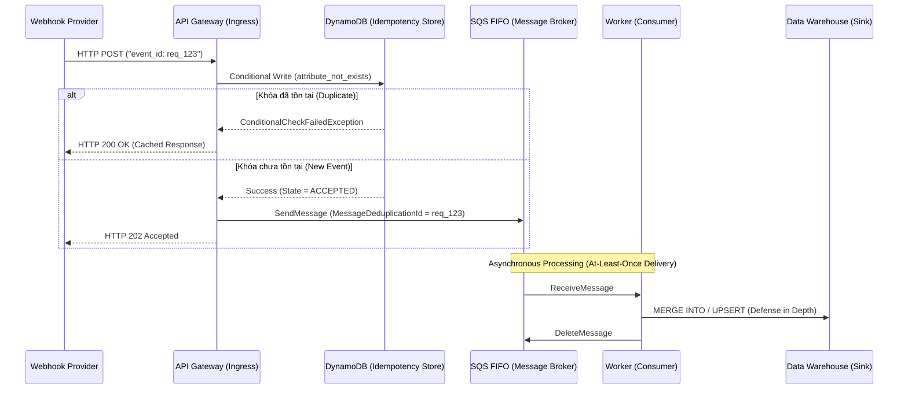

Trong kiến trúc hướng sự kiện (Event-Driven Architecture - EDA), Webhooks là cơ chế đẩy (push-based mechanism) phổ biến bậc nhất để ingest dữ liệu theo thời gian thực (Real-time). Tuy nhiên, môi trường mạng (Network) luôn tiềm ẩn độ trễ (latency), rớt gói tin (packet loss), và chia cắt mạng (network partition). 

Bài viết này đi sâu vào giải phẫu **Tính luỹ đẳng (Idempotency)** - vũ khí tối thượng giúp các công ty như Stripe, Shopify, và Netflix giải quyết triệt để bài toán trùng lặp dữ liệu trong các Data Pipeline quy mô lớn.

---

## 1. At-Least-Once Delivery & Sự huyễn hoặc về mạng lưới (The Fallacy of the Network)

Các hệ thống Webhook cấp production như Stripe hay GitHub đều được thiết kế dựa trên ngữ nghĩa phân phối **At-Least-Once (Giao ít nhất một lần)**. Nguyên tắc ở đây là: *Việc mất dữ liệu (Data Loss) tồi tệ hơn hàng trăm lần so với việc trùng lặp dữ liệu (Data Duplication).*

Kịch bản kinh điển tạo ra dữ liệu trùng lặp (Timeout-induced duplicates):
1. Hệ thống của bạn xử lý thành công Webhook thanh toán nhưng tốn 6 giây.
2. Provider (ví dụ: Stripe) cấu hình timeout là 5 giây. Stripe không nhận được phản hồi HTTP 200 kịp thời.
3. Provider tự động hủy kết nối (Drop connection) và tự động Retry lại cùng một Webhook payload đó sau vài phút.
4. Kết quả: Một sự kiện, xử lý 2 lần. Khách hàng bị trừ tiền 2 lần (Double-charging).

Để ngăn chặn thảm họa này, khái niệm **Tính luỹ đẳng (Idempotency)** ra đời. Hàm toán học $f(x)$ được gọi là Idempotent khi áp dụng nó 1 lần hay $N$ lần đều cho ra cùng một trạng thái (State) cuối cùng: 
$$f(f(x)) = f(x)$$

---

## 2. Giải phẫu một hệ thống Idempotent (Anatomy of an Idempotent System)

Để đạt được tính luỹ đẳng, cốt lõi nằm ở việc nhận diện và từ chối các sự kiện trùng lặp thông qua **Idempotency Key**.

### 2.1. Idempotency Key (Khóa Luỹ Đẳng)
Mọi Webhook uy tín đều đính kèm một định danh duy nhất (Unique Identifier) ở HTTP Header (như `Idempotency-Key` của Stripe, `X-GitHub-Delivery`) hoặc trong Body payload (`event.id`).
*Trong trường hợp Provider thiết kế tồi và không cung cấp ID, bạn bắt buộc phải tạo Deterministic ID bằng cách băm (hashing) nội dung payload (tuyệt đối không dùng random UUID).* 

### 2.2. The Check-and-Set (CAS) Atomic Operation
Quá trình xử lý (Idempotency Flow) không thể là hai thao tác tách biệt (Read-then-Write). Dưới áp lực của High Concurrency, 2 requests trùng lặp có thể cùng đọc trạng thái `Trống` và cùng ghi vào DB (Race Condition). Bạn bắt buộc phải dùng **Atomic Operations**.

**State Machine Chuẩn Mực:**
1. Nhận Request.
2. Thử tạo bản ghi trạng thái bằng Idempotency Key (ví dụ: `SETNX` trong Redis hoặc `attribute_not_exists` trong DynamoDB).
3. Nếu trạng thái là `PROCESSING`: Trả về `HTTP 409 Conflict` (để Provider retry sau, tránh song thủ tranh giành).
4. Nếu trạng thái là `COMPLETED`: Trả về `HTTP 200 OK` ngay lập tức cùng với HTTP Response payload của lần chạy trước (Cached Response).
5. Nếu là request mới tinh: Chuyển sang `PROCESSING`, thực hiện Bussiness Logic, sau đó commit state thành `COMPLETED` và lưu lại Cached Response.

---

## 3. Kiến trúc Accept-then-Queue (Decoupling Ingestion & Processing)

Một "Anti-pattern" phổ biến là thực hiện các tác vụ nặng (Synchronous DB calls, Transform dữ liệu) trực tiếp trong Webhook Handler. Điều này làm tăng độ trễ API và trực tiếp gây ra Retry Storms (Bão thử lại).

**Staff Engineer Pattern:** Sử dụng mô hình **Accept-then-Queue** kết hợp với kiến trúc **Layered Idempotency** (Idempotency nhiều lớp). Bạn phải phản hồi `HTTP 202 Accepted` nhanh nhất có thể.



### 3.1. Idempotency Store: Phân tích Trade-offs (Sự đánh đổi)
Việc chọn công nghệ lưu trữ cho hệ thống Idempotency quyết định đến năng lực của toàn bộ Pipeline.

| Data Store | Latency | Throughput | Durability |" Trade-offs & Ghi chú (Notes) "|
| :--- | :--- | :--- | :--- | :--- |
|" **Redis (In-Memory)** "| Ultra-low (<1ms) | Rất Cao | Thấp-Trung bình |" Cực nhanh nhờ lệnh `SETNX`. Rủi ro mất khóa nếu Node crash trước khi flush ra đĩa (AOF fsync). "|
| **Amazon DynamoDB** | Low (~10ms) |" Cao (Scalable) "| Rất Cao |" Lý tưởng nhờ `ConditionExpression`. Hỗ trợ TTL (Time-to-live) bản địa để tự động xóa khóa cũ. Tốn tiền hơn khi scale Write Capacity. "|
|" **PostgreSQL (RDBMS)** "| Medium (20-50ms) | Trung bình | Rất Cao | ACID compliance. Dùng `UNIQUE Constraint` cực an toàn nhưng dễ xảy ra Transaction Lock Contention khi High TPS. |

### 3.2. Cơ sở hạ tầng dưới dạng Code (Terraform)
Amazon SQS FIFO có sẵn tính năng chống trùng lặp (Deduplication) trong vòng 5 phút. Dưới đây là cách khai báo bằng Terraform để đẩy trách nhiệm chống trùng cho AWS:

```hcl
resource "aws_sqs_queue" "webhook_ingestion_queue" {
  name                        = "webhook-events.fifo"
  fifo_queue                  = true
  
  # Kích hoạt tính năng chống trùng lặp nội tại của SQS FIFO
  content_based_deduplication = false
  
  # Bắt buộc phải cung cấp MessageDeduplicationId khi SendMessage (chính là Idempotency Key)
  deduplication_scope         = "messageGroup"
  fifo_throughput_limit       = "perMessageGroupId"
  
  # Cấu hình Dead Letter Queue (DLQ) cho các Webhook bị lỗi xử lý (Poison Pills)
  redrive_policy = jsonencode({
    deadLetterTargetArn = aws_sqs_queue.webhook_dlq.arn
    maxReceiveCount     = 3
  })
}
```

---

## 4. End-to-End Idempotency (Defense in Depth)

Bắt trùng lặp ở Gateway là chưa đủ, vì bản thân Worker phía sau Queue cũng có thể bị rớt mạng và thực thi lại logic (At-Least-Once của SQS). Lớp bảo vệ cuối cùng luôn luôn phải nằm ở **Data Warehouse / Database**.

Thay vì dùng lệnh `INSERT` thông thường, ta bắt buộc phải áp dụng thao tác `MERGE` (Upsert) dựa vào Idempotency Key.

```sql
-- Pattern chuẩn mực cho Idempotent Ingestion tại Snowflake/BigQuery
MERGE INTO prod.core.fct_transactions AS target
USING stg.raw_webhook_events AS source
ON target.event_id = source.event_id
WHEN MATCHED THEN
  -- Idempotent action: Chỉ update timestamp thay vì tạo thêm 1 dòng doanh thu
  UPDATE SET updated_at = CURRENT_TIMESTAMP(),
             retry_count = target.retry_count + 1
WHEN NOT MATCHED THEN
  INSERT (event_id, event_type, payload, created_at)
  VALUES (source.event_id, source.event_type, source.payload, source.created_at);
```

---

## 5. Sự cố thực tế & Gỡ lỗi (Production Troubleshooting)

Việc vận hành hệ thống Idempotency ở scale hàng ngàn requests/giây đòi hỏi kỹ năng xử lý sự cố (Incident Management) sắc bén.

### 🚨 Sự cố 1: OOMKilled (Out of Memory) do Unbounded Buffers
- **Triệu chứng:** Worker (Consumer) pod trên Kubernetes liên tục bị CrashLoopBackOff với mã lỗi `OOMKilled` (Exit Code 137).
- **Nguyên nhân (Root Cause):** Provider gửi một lượng lớn sự kiện đột biến (Thundering Herd). Worker kéo (poll) một batch 10,000 messages vào RAM, nhưng Database phía sau bị chậm (Slow Query). Object trong RAM không được Garbage Collector giải phóng kịp, gây tràn bộ nhớ.
- **Khắc phục (Remediation):**
  - Thực thi **Backpressure**: Cấu hình `max_poll_records` trong Kafka/SQS xuống mức an toàn (ví dụ 500). 
  - Điều chỉnh Idempotency Store (Redis/API Gateway) trả về lỗi `HTTP 429 Too Many Requests` sớm nếu Queue size vượt ngưỡng.

### 🚨 Sự cố 2: Row Lock Contention (Nghẽn cổ chai Database)
- **Triệu chứng:** Consumer Lag tăng từ 5 giây lên 4 tiếng. Log báo lỗi `Deadlock found when trying to get lock`.
- **Nguyên nhân:** Dùng PostgreSQL làm Idempotency Store. Khi 1 Entity sinh ra nhiều sự kiện cùng lúc (ví dụ: Update Profile 10 lần trong 1 giây), các Transaction tranh giành khóa (Lock) trên cùng một dòng dữ liệu (Row).
- **Khắc phục:**
  - Chuyển hướng lưu trạng thái luỹ đẳng sang Redis/DynamoDB (thiết kế NoSQL key-value cực kỳ phù hợp cho bài toán check-and-set).
  - Áp dụng Optimistic Concurrency Control (OCC).

### 🚨 Sự cố 3: Cạm bẫy TTL (The TTL Trap)
- **Triệu chứng:** Dữ liệu vẫn bị duplicate mặc dù code Idempotency hoàn hảo.
- **Nguyên nhân:** Bạn đặt TTL (Time-To-Live) của Idempotency Key trong Redis là 24 giờ. Tuy nhiên, một Webhook bị lỗi và nằm trong Dead Letter Queue (DLQ). 3 ngày sau, Data Engineer mới vào `re-drive` (chạy lại) DLQ. Lúc này, Key trong Redis đã "bốc hơi". Message đi lọt và tạo ra dữ liệu kép.
- **Khắc phục:** Nguyên tắc thiết kế: *TTL của Idempotency Store phải luôn lớn hơn [>] Thời gian lưu giữ tối đa (Retention Period) của Message Broker.* (Ví dụ: SQS lưu 14 ngày -> TTL Redis phải >= 15 ngày).

---

## Nguồn Tham Khảo (References)

1. [Stripe API Reference - Idempotent Requests][https://stripe.com/docs/api/idempotent_requests]
2. [Implementing Stripe-like Idempotency Keys in Postgres (Brandur Blog]][https://brandur.org/idempotency-keys]
3. [AWS Architecture Blog: Building Webhook Receivers with Idempotency](https://aws.amazon.com/blogs/architecture/]
4. *Designing Data-Intensive Applications* - Martin Kleppmann (Chương 11: Stream Processing - Idempotence).
