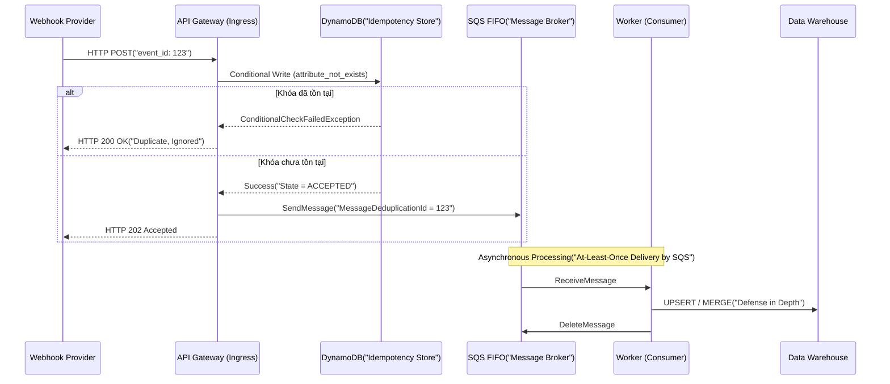

## 1. At-Least-Once Delivery & Sự huyễn hoặc về mạng lưới (The Fallacy of the Network)

Trong kiến trúc hướng sự kiện (Event-Driven Architecture - EDA), Webhooks là cơ chế đẩy (push-based mechanism) phổ biến để ingest dữ liệu theo thời gian thực (Real-time). Tuy nhiên, môi trường mạng (Network) luôn có độ trễ (latency), rớt gói tin (packet loss), và chia cắt mạng (network partition). 

Các hệ thống Webhook cấp production như Stripe, Shopify, hay GitHub đều được thiết kế dựa trên ngữ nghĩa phân phối **At-Least-Once (Giao ít nhất một lần)**. Nguyên tắc ở đây là: *Việc mất dữ liệu (Data Loss) tồi tệ hơn nhiều so với việc trùng lặp dữ liệu (Data Duplication).*

Kịch bản kinh điển tạo ra dữ liệu trùng lặp (Timeout-induced duplicates):
1. Hệ thống của bạn xử lý thành công Webhook nhưng tốn 6 giây.
2. Provider (e.g., Stripe) cấu hình timeout là 5 giây.
3. Provider hủy kết nối (Drop connection) và tự động Retry lại cùng một Webhook payload đó.
4. Kết quả: Một sự kiện, xử lý 2 lần.

Việc không kiểm soát chặt chẽ điều này sẽ dẫn đến những thảm họa về tính toàn vẹn dữ liệu (Data Integrity), ví dụ như double-charging khách hàng hoặc báo cáo tài chính sai lệch. Khái niệm **Tính luỹ đẳng (Idempotency)** sinh ra để giải quyết triệt để vấn đề này. Hệ thống Idempotent đảm bảo rằng hàm $f(x)$ khi gọi 1 lần hay $N$ lần đều cho cùng một trạng thái (State) cuối cùng: $f(f(x)) = f(x)$.

---

## 2. Giải phẫu một hệ thống Idempotent (Anatomy of an Idempotent System)

Để đạt được tính luỹ đẳng, cốt lõi nằm ở việc nhận diện và từ chối các sự kiện trùng lặp thông qua **Idempotency Key**.

### 2.1. Idempotency Key
Mọi Webhook uy tín đều đính kèm một định danh duy nhất (Unique Identifier) ở HTTP Header (như `Stripe-Signature`, `X-GitHub-Delivery`) hoặc trong Body payload (`event_id`).
*Trong trường hợp Provider thiết kế tồi và không cung cấp ID, bạn bắt buộc phải tạo Deterministic ID bằng cách băm (hashing) payload:* `hash(payload + timestamp_truncated_to_minute)`.

### 2.2. The Check-and-Set (CAS) Atomic Operation
Quá trình xử lý (Idempotency Flow) không thể là hai thao tác tách biệt (Read-then-Write), vì nó sẽ dẫn tới Race Condition khi chịu tải cao (High Concurrency). Bạn bắt buộc phải dùng **Atomic Operations**.

Quy trình chuẩn mực (State Machine):
1. Nhận Request.
2. Thử tạo bản ghi trạng thái bằng Idempotency Key (ví dụ: `INSERT ... ON CONFLICT` trong RDBMS hoặc `SETNX` trong Redis).
3. Nếu trạng thái là `PROCESSING`: Block hoặc trả về `HTTP 409 Conflict` (để Provider retry sau).
4. Nếu trạng thái là `COMPLETED`: Trả về `HTTP 200 OK` ngay lập tức cùng với HTTP Response payload của lần chạy trước (Cached Response).
5. Nếu mới tinh: Chuyển sang `PROCESSING`, thực hiện Bussiness Logic, sau đó commit state thành `COMPLETED`.

---

## 3. Kiến trúc Accept-then-Queue (Decoupling Ingestion & Processing)

Một thiết kế "Anti-pattern" phổ biến là thực hiện các tác vụ nặng (Synchronous DB calls, API calls) trực tiếp trong Webhook Handler. Điều này làm tăng độ trễ (Latency) của API và trực tiếp gây ra Retry Storms.

**Staff Engineer Pattern:** Sử dụng mô hình **Accept-then-Queue** kết hợp với kiến trúc **Layered Idempotency** (Idempotency nhiều lớp).



### 3.1. Idempotency Store: Phân tích Trade-offs
Việc chọn công nghệ lưu trữ cho hệ thống Idempotency quyết định đến Systemic Trade-offs của toàn bộ Data Pipeline.

| Data Store | Latency | Throughput | Durability | Trade-offs & Notes |
| :--- | :--- | :--- | :--- | :--- |
| **Redis (In-Memory)** | Ultra-low (<1ms) | Very High | Low to Medium | Nhanh, hỗ trợ `SETNX`. Rủi ro mất trạng thái khi Node crash (nếu AOF fsync=everysec) gây lọt trùng lặp. Phù hợp hệ thống cho phép thất thoát nhỏ. |
| **Amazon DynamoDB** | Low (single-digit ms) | High (Scalable) | High | Cực kỳ phù hợp nhờ `ConditionExpression`. Hỗ trợ TTL bản địa. Đắt tiền hơn khi scale Write Capacity Units (WCU). |
| **PostgreSQL/MySQL** | Medium (10-50ms) | Medium | Very High | ACID compliance. Dùng `UNIQUE Constraint` cực an toàn nhưng dễ xảy ra Transaction Lock Contention khi TPS (Transactions Per Second) cao. |

### 3.2. Cơ sở hạ tầng dưới dạng Code (Terraform)
Sử dụng SQS FIFO (First-In-First-Out) để tự động hóa việc chống trùng lặp trong một cửa sổ thời gian (5 phút) mà không cần tự code thêm logic:

```hcl
resource "aws_sqs_queue" "webhook_ingestion_queue" {
  name                        = "webhook-events.fifo"
  fifo_queue                  = true
  content_based_deduplication = true
  deduplication_scope         = "messageGroup"
  fifo_throughput_limit       = "perMessageGroupId"
  
  # Dead Letter Queue config for unprocessable webhooks
  redrive_policy = jsonencode({
    deadLetterTargetArn = aws_sqs_queue.webhook_dlq.arn
    maxReceiveCount     = 3
  })
}
```

---

## 4. End-to-End Idempotency (Layered Idempotency)

Bắt trùng lặp ở Gateway (Ingress) là chưa đủ. Các hệ thống phân tán (Distributed Systems) đều có thể bị lỗi nội bộ. Lớp bảo vệ cuối cùng luôn luôn phải nằm ở **Data Warehouse / Database (Sink)**.

Thay vì dùng lệnh `INSERT` thông thường vào Data Warehouse (như BigQuery, Snowflake), ta bắt buộc phải áp dụng thao tác `MERGE` (Upsert) dựa vào Idempotency Key. Đây gọi là **Defense in Depth**.

```sql
-- Pattern chuẩn mực cho Idempotent Ingestion tại Data Warehouse
MERGE INTO prod.core.fct_transactions AS target
USING stg.raw_webhook_events AS source
ON target.event_id = source.event_id
WHEN MATCHED THEN
  -- Idempotent action: Update timestamp thay vì duplicate row
  UPDATE SET updated_at = CURRENT_TIMESTAMP(),
             retry_count = target.retry_count + 1
WHEN NOT MATCHED THEN
  INSERT (event_id, event_type, payload, created_at)
  VALUES (source.event_id, source.event_type, source.payload, source.created_at);
```

---

## 5. Real-world Incidents & Troubleshooting

Việc vận hành hệ thống Idempotency ở quy mô lớn (High Scale) không hề đơn giản. Dưới đây là các sự cố kinh điển ở cấp độ Production:

### 5.1. OOMKilled (Out of Memory) do Unbounded Buffers
*   **Triệu chứng:** Worker (Consumer) pod trên Kubernetes liên tục bị CrashLoopBackOff với mã lỗi `OOMKilled`.
*   **Nguyên nhân:** Webhook provider gửi một lượng lớn sự kiện đột biến (Spike/Thundering Herd). Consumer kéo (poll) một batch quá lớn vào RAM để xử lý đồng thời, nhưng các hệ thống Downstream (Database) phản hồi chậm, dẫn tới memory buffer phình to và tràn RAM.
*   **Giải pháp:** Implement **Backpressure**. Cấu hình `max_poll_records` trong Kafka/SQS chặt chẽ. Đảm bảo Idempotency store (như Redis) phải trả về lỗi `HTTP 429 Too Many Requests` ở Gateway nếu Queue length đã vượt quá ngưỡng an toàn.

### 5.2. Consumer Lag do Database Row Locks
*   **Triệu chứng:** Độ trễ từ lúc sự kiện xảy ra đến lúc vào Data Warehouse (Data Freshenss) tăng từ 5 giây lên 4 tiếng (Consumer Lag).
*   **Nguyên nhân:** Khi lưu Idempotency key bằng RDBMS, nhiều Webhooks cùng liên quan đến một Entity (ví dụ: Update User Profile 10 lần trong 1 giây) gây ra hiện tượng **Row Lock Contention** (Nhiều Transaction tranh giành khóa một dòng).
*   **Giải pháp:** Phân mảnh dữ liệu bằng Hash-based partitioning. Sử dụng kiến trúc Optimistic Concurrency Control (OCC) thay vì Pessimistic Locking, hoặc chuyển hướng lưu state sang DynamoDB / Redis.

### 5.3. Trùng lặp do TTL Configuration sai (The TTL Trap)
*   **Triệu chứng:** Dữ liệu vẫn bị trùng lặp mặc dù logic Idempotency đã đúng.
*   **Nguyên nhân:** Bạn đặt TTL (Time-To-Live) của Idempotency Key trong Redis là 24 giờ. Tuy nhiên, một luồng xử lý bị lỗi treo (Dead Letter Queue), 3 ngày sau Data Engineer re-drive (chạy lại) các message lỗi này. Lúc này, Key trong Redis đã hết hạn và bốc hơi. Kết quả là message đi lọt và tạo ra duplicate.
*   **Giải pháp:** Đặt TTL của Idempotency Store dài hơn ít nhất 2 lần so với thời gian lưu trữ tối đa (Retention Period) của Message Broker (Ví dụ SQS lưu tối đa 14 ngày, TTL phải >= 30 ngày).

---

## Nguồn Tham Khảo (References)

1. [Stripe API Reference - Idempotent Requests](https://stripe.com/docs/api/idempotent_requests)
2. [AWS Architecture Blog: Building Webhook Receivers with Idempotency](https://aws.amazon.com/blogs/architecture/)
3. [AWS Lambda Powertools Idempotency Utility](https://docs.powertools.aws.dev/lambda/python/latest/utilities/idempotency/)
4. [Designing Data-Intensive Applications - Martin Kleppmann](https://dataintensive.net/)
5. Uber Engineering: [Reliable Webhooks and Distributed Tracing](https://www.uber.com/en-VN/blog/engineering/)
6. Hookdeck Engineering: [The Idempotency Hole in Production Systems](https://hookdeck.com)
