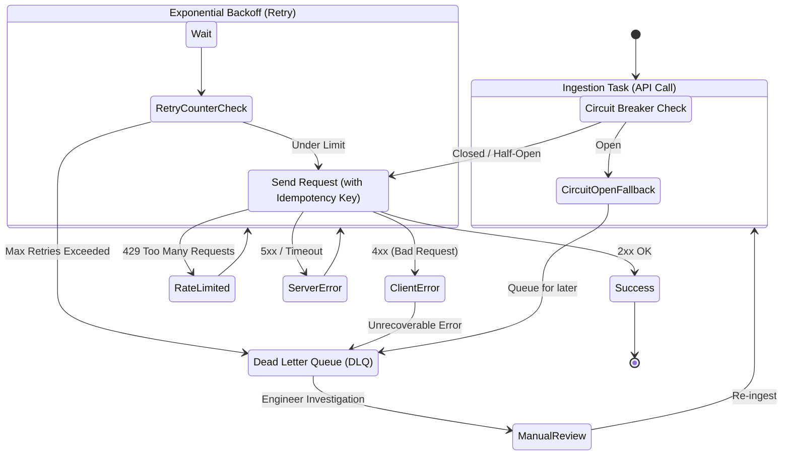

# API Ingestion Patterns: Rate Limiting, Exponential Backoff & DLQ

Trong quá trình xây dựng các pipeline Data Ingestion từ các nguồn API (như REST, GraphQL), việc đảm bảo tính ổn định, độ tin cậy và không làm sập hệ thống nguồn là một thách thức lớn. Bài viết này sẽ đi sâu vào các khái niệm cốt lõi: Rate Limiting, Exponential Backoff, Dead Letter Queue (DLQ) và Idempotency Key.

## Thuật toán Rate Limiting: Token Bucket vs Leaky Bucket

Rate limiting là cơ chế kiểm soát tốc độ gửi request đến một API, nhằm bảo vệ server khỏi bị quá tải. Hai thuật toán phổ biến nhất được các hệ thống lớn sử dụng là Token Bucket và Leaky Bucket.

### 1. Token Bucket
- **Cơ chế hoạt động**: Tưởng tượng có một cái xô (bucket) chứa các token. Mỗi token đại diện cho quyền được gửi một request. Các token được tự động thêm vào xô theo một tốc độ không đổi (ví dụ: 10 token/giây) cho đến khi xô đầy. Khi một request được gửi đi, nó phải lấy ra một token từ xô. Nếu xô rỗng, request sẽ bị từ chối (báo lỗi 429 Too Many Requests).
- **Ưu điểm**: Cho phép các "cú nổ" (burst) traffic ngắn hạn. Nếu hệ thống đang rảnh, xô sẽ tích đầy token, cho phép một lượng lớn request được gửi đi cùng một lúc ngay sau đó.
- **Ứng dụng**: Phù hợp cho các API cho phép tải không đồng đều nhưng có giới hạn trung bình theo thời gian (như Stripe API).

### 2. Leaky Bucket
- **Cơ chế hoạt động**: Khác với Token Bucket, Leaky Bucket hoạt động như một cái phễu bị rò rỉ. Các request đổ vào xô từ trên xuống (có thể với tốc độ bất kỳ). Dưới đáy xô có một lỗ thủng, và các request sẽ "rỉ" ra (được xử lý) với một tốc độ cố định. Nếu lượng request đổ vào quá nhanh khiến xô bị tràn, các request mới sẽ bị vứt bỏ.
- **Ưu điểm**: Tạo ra một luồng traffic mượt mà (traffic smoothing). Dù client có gửi request ồ ạt tới mức nào, server cũng chỉ phải xử lý với một tốc độ đều đặn.
- **Ứng dụng**: Rất hữu ích trong hệ thống Message Queue hoặc các API cần bảo vệ chặt chẽ các tài nguyên phía sau khỏi những đợt tăng vọt traffic.

## Tại sao Idempotency Key là "Xương sống" của Data Ingestion?

Trong môi trường mạng không ổn định, lỗi là điều không thể tránh khỏi. Khi một request gửi đi và bị timeout, hệ thống ingestion không biết được liệu server đã xử lý request đó hay chưa. 

**Idempotency (Tính luỹ đẳng)** đảm bảo rằng một thao tác có thể được thực hiện nhiều lần nhưng kết quả cuối cùng trên hệ thống chỉ thay đổi ở lần thực hiện đầu tiên, các lần sau không tạo ra thêm tác động nào khác.

**Idempotency Key** là một chuỗi định danh duy nhất (ví dụ: UUID) do client (hệ thống ingestion) tạo ra và gửi kèm theo mỗi request. 
- **Cách hoạt động**: Khi server nhận được request, nó kiểm tra xem Idempotency Key này đã từng được xử lý thành công trước đó chưa. Nếu chưa, nó tiến hành xử lý và lưu trạng thái của key lại. Nếu rồi, nó chỉ cần trả về kết quả đã được cache lại của lần xử lý trước mà không thay đổi dữ liệu bên trong.
- **Tầm quan trọng trong Data Ingestion**:
  - **Tránh trùng lặp dữ liệu (Duplicate Data)**: Khi có lỗi mạng, pipeline có thể an toàn retry (thử lại) request mà không lo dữ liệu bị chèn vào cơ sở dữ liệu hai lần.
  - **Retries an toàn**: Kết hợp hoàn hảo với các chiến lược như Exponential Backoff để phục hồi hệ thống một cách tự động và đáng tin cậy.

## Luồng Xử lý Lỗi: Circuit Breaker, Exponential Backoff & DLQ

Khi API nguồn gặp sự cố hoặc trả về lỗi Rate Limit, việc cứ tiếp tục gửi request sẽ làm tình hình tồi tệ hơn. Đây là lúc các pattern xử lý lỗi phát huy tác dụng.

- **Exponential Backoff**: Thay vì retry ngay lập tức sau mỗi lần thất bại, thời gian chờ giữa các lần retry sẽ được nhân lên theo cấp số nhân (ví dụ: 1s, 2s, 4s, 8s...). Điều này giúp giảm tải cho API nguồn khi nó đang gặp vấn đề. Kỹ thuật *Jitter* (thêm độ trễ ngẫu nhiên) thường được kết hợp để tránh hiện tượng thundering herd (hiệu ứng bầy đàn) khi nhiều client cùng retry cùng một lúc.
- **Circuit Breaker**: Lấy cảm hứng từ cầu dao điện. Nếu số lần gọi API thất bại vượt qua một ngưỡng nhất định, "cầu dao" sẽ ngắt (trạng thái Open), chặn tất cả các request gửi đi ngay lập tức và trả về lỗi, giúp API nguồn có thời gian phục hồi. Sau một khoảng thời gian, nó sẽ chuyển sang trạng thái "nửa mở" (Half-Open) để thử nghiệm vài request, nếu thành công sẽ đóng lại (Closed) để hoạt động bình thường.
- **Dead Letter Queue (DLQ)**: Sau khi đã thử retry nhiều lần mà vẫn thất bại (do lỗi logic, data sai định dạng hoặc API sập quá lâu), request hoặc bản ghi dữ liệu đó sẽ được chuyển vào một hàng đợi đặc biệt gọi là DLQ. Kỹ sư dữ liệu có thể vào đây kiểm tra, sửa lỗi và đẩy dữ liệu quay lại luồng chính (re-ingest) sau này, đảm bảo không bị thất thoát dữ liệu.

Dưới đây là sơ đồ minh họa luồng xử lý lỗi kết hợp các pattern này:

## Nguồn gốc

[Stripe: Designing robust and predictable APIs with idempotency](https://stripe.com/blog/idempotency)
[Spotify: Reliable event delivery at Spotify](https://engineering.atspotify.com/2016/02/25/spotify-event-delivery-the-road-to-the-cloud-part-2/)
[Stripe: Scaling your API with rate limiters](https://stripe.com/blog/rate-limiters)
[Pinterest: Using Apache Kafka for Reliable Logging](https://medium.com/@Pinterest_Engineering/using-apache-kafka-for-reliable-logging-b789e900c427)
[Pinterest: Building a reliable and scalable event logging infrastructure](https://medium.com/@Pinterest_Engineering/building-a-reliable-and-scalable-event-logging-infrastructure-3d77cc49d6da)
