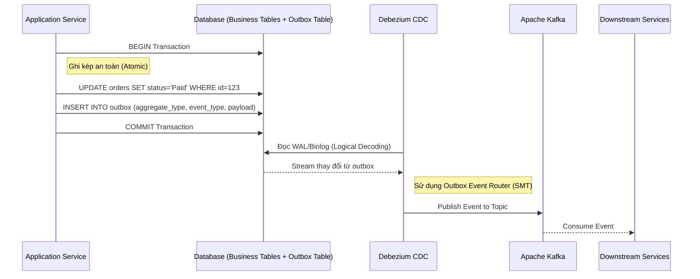

# Change Data Capture: Debezium Internals & Transactional Outbox

Change Data Capture (CDC) là một kỹ thuật mạnh mẽ để nhận diện và bắt các thay đổi dữ liệu trong cơ sở dữ liệu theo thời gian thực. Debezium là một nền tảng mã nguồn mở, phân tán dựa trên Apache Kafka chuyên biệt cho CDC. Bài viết này sẽ đi sâu vào kiến trúc bên trong của Debezium, cách nó tương tác với các hệ quản trị cơ sở dữ liệu ở mức thấp, và cách sử dụng mẫu thiết kế Transactional Outbox để giải quyết bài toán Dual-write kinh điển trong Microservices.

## 1. Debezium Internals & Logical Decoding

Debezium hoạt động dựa trên nguyên lý đọc trực tiếp vào các transaction log (nhật ký giao dịch) của hệ quản trị cơ sở dữ liệu, chẳng hạn như Write-Ahead Log (WAL) trong PostgreSQL hay Binary Log (Binlog) trong MySQL. Quá trình này được gọi là **Logical Decoding** (giải mã logic).

### Logical Decoding ở mức thấp hoạt động như thế nào?

Khi một thao tác thao tác thay đổi dữ liệu (`INSERT`, `UPDATE`, `DELETE`) diễn ra trong Database:

1. **Ghi Nhật Ký:** Database engine không chỉ ghi dữ liệu vào các page/block trên đĩa mà còn ghi sự kiện đó vào một nhật ký tuần tự (append-only log). Nhật ký này vốn được sinh ra cho mục đích phục hồi khi có sự cố (crash recovery) và nhân bản (replication) tới các standby nodes.
2. **Replication Connection:** Thay vì liên tục truy vấn định kỳ (polling) dữ liệu từ bảng – một cách làm gây áp lực lớn lên Database và dễ bỏ sót các giao dịch ngắn hạn – Debezium kết nối với Database như một bản sao (replica node) thực thụ và yêu cầu Database stream các thay đổi từ nhật ký này qua mạng.
3. **Giải mã (Decoding) trong PostgreSQL:** Debezium sử dụng tính năng Logical Decoding được giới thiệu từ Postgres 9.4. Nó cài đặt một `output plugin` (thường là `pgoutput` hoặc `wal2json`). Plugin này có nhiệm vụ đọc WAL (vốn lưu thông tin thay đổi ở mức nhị phân, bộ nhớ đĩa vật lý) và chuyển đổi (decode) nó sang một định dạng có ý nghĩa logic (như chuỗi JSON, protobuf, hoặc format chuẩn của pgoutput đại diện cho các row bị thay đổi).
4. **Giải mã trong MySQL:** Debezium kết nối giả lập thành một slave server để đọc các `binlog events`. Nó ưu tiên cấu hình MySQL sử dụng `Row-based replication` để mọi thay đổi đều được ghi chép tường minh trên từng dòng dữ liệu, từ đó dịch ngược thành các thông điệp thay đổi rõ ràng.

Phương pháp lấy từ log này đảm bảo **mọi thay đổi** (kể cả một row bị tạo và xóa ngay lặp tức trong tích tắc) đều bị bắt lại mà không bị bỏ sót, đồng thời bảo toàn độ trễ cực thấp và giữ đúng thứ tự giao dịch gốc.

## 2. Snapshotting vs Streaming

Một thách thức lớn của kiến trúc CDC dựa trên log là: làm thế nào để có được **trạng thái toàn bộ dữ liệu hiện tại** trước khi bắt đầu lắng nghe các thay đổi mới? Lịch sử log (WAL/Binlog) của database thường không được lưu trữ vĩnh viễn; chúng bị xoay vòng (rotate) và dọn dẹp theo thời gian hoặc theo dung lượng.

Debezium giải quyết bằng một quy trình chuyển giao trạng thái hoàn hảo gồm hai giai đoạn:

### Snapshotting (Chụp ảnh nhanh dữ liệu gốc)
Khi Debezium khởi chạy lần đầu kết nối tới một database, nó thường kích hoạt quá trình Snapshot để lấy baseline:
- Debezium sẽ xin một cơ chế khóa (lock) tinh tế hoặc sử dụng tính năng quản lý giao dịch để đảm bảo tính nhất quán của dữ liệu (ví dụ: `REPEATABLE READ` trong MySQL, hoặc exported snapshot trong PostgreSQL).
- Sau khi thiết lập được ngữ cảnh đọc nhất quán, Debezium ghi nhận lại vị trí hiện tại của transaction log (ví dụ: `LSN - Log Sequence Number` trong Postgres, `GTID - Global Transaction Identifier` trong MySQL).
- Sau đó, Debezium quét (scan) tuần tự bảng dữ liệu bằng câu lệnh `SELECT * FROM table`.
- Mỗi bản ghi trong bảng được chuyển đổi thành một sự kiện "Read" (mang ý nghĩa như Create/Insert) và gửi liên tục tới Kafka.

### Streaming (Luồng thay đổi liên tục)
- Ngay khi quá trình Snapshot quét xong row cuối cùng, Debezium tự động chuyển sang chế độ Streaming.
- Nó bắt đầu đọc transaction log từ **chính vị trí LSN/GTID đã lưu lại** ở bước Snapshot.
- Bất kỳ sự kiện thay đổi (`Create`, `Update`, `Delete`) nào diễn ra trong lúc quét snapshot hoặc sau đó sẽ được liên tục capture lại và đẩy vào Kafka.

Cơ chế chuyển tiếp liền mạch giữa Snapshotting và Streaming này giúp hệ thống đảm bảo tính chất **At-least-once delivery**, không làm hỏng cấu trúc dữ liệu và cho phép các downstream consumer xây dựng lại bức tranh dữ liệu đồng bộ 100%.

## 3. Vấn đề Dual-write và Transactional Outbox Pattern

Trong kiến trúc Microservices phân tán, một service thường phải đối mặt với một tác vụ:
1. Cập nhật trạng thái nghiệp vụ vào Database của chính nó.
2. Gửi một thông báo (event/message) tới Message Broker (như Kafka) để các service khác (downstream) biết về sự thay đổi này.

Đây chính là **Dual-write problem** (Vấn đề ghi kép). Làm sao để đảm bảo cả hai hệ thống phân tán (Database và Kafka) cùng ghi thành công hoặc cùng thất bại (Atomic)?
- Nếu cập nhật DB thành công nhưng gửi Kafka thất bại (do mạng chập chờn) -> Các hệ thống khác không biết dữ liệu đã thay đổi, dẫn đến Inconsistency (bất đồng bộ hệ thống).
- Nếu gửi Kafka thành công nhưng cập nhật DB thất bại (do vi phạm constraint, rollback) -> Dữ liệu phát đi cho hệ thống khác là dữ liệu sai lệch ("ma").

Sử dụng Distributed Transaction (như Two-Phase Commit - 2PC) thường gây ra độ trễ cao và ảnh hưởng nặng nề đến khả năng mở rộng. Giải pháp kiến trúc thanh lịch và phổ biến nhất là **Transactional Outbox**.

### Kiến trúc Transactional Outbox với Debezium

Thay vì để tầng Application cố gắng gọi API gửi message trực tiếp đến Kafka, ta lưu thông điệp vào một bảng `outbox` ngay trong Database bằng cùng một Local Transaction.

**Cách hoạt động chi tiết:**

1. **Local Transaction:** Service bắt đầu một transaction. Nó thực hiện các thay đổi trên bảng nghiệp vụ (ví dụ: `Orders`). Đồng thời, nó sinh ra một thông điệp (chứa JSON payload sự kiện như `OrderPaid`) và `INSERT` thông điệp đó vào bảng `outbox` **trong cùng một transaction**.
2. **Atomic Commit:** Khi transaction được Commit, cơ sở dữ liệu đảm bảo cả dữ liệu đơn hàng và sự kiện outbox được lưu nguyên tử xuống đĩa. Khắc phục triệt để bài toán Dual-write.
3. **Debezium CDC:** Debezium được cấu hình để theo dõi bảng `outbox` thông qua WAL/Binlog.
4. **Đẩy lên Kafka:** Khi Debezium nhận diện sự kiện chèn vào bảng Outbox, nó đọc được nội dung event. Sử dụng tính năng Single Message Transform (SMT) có tên là `Outbox Event Router`, Debezium trích xuất `payload` và route (định tuyến) event đó vào chính xác Topic tương ứng trên Kafka.
5. **Dọn dẹp:** Một khi event đã nằm an toàn trên Kafka, tiến trình background của Application có thể định kỳ xóa các bản ghi cũ trong bảng `outbox` để tránh đầy dung lượng đĩa.

Sự kết hợp giữa Debezium (CDC) và Transactional Outbox mang lại sự bảo đảm tuyệt đối về mặt nguyên tử (Atomicity), thứ tự sự kiện (Ordering) và giải phóng Application khỏi gánh nặng chờ đợi phản hồi từ Message Broker, nâng cao hiệu năng toàn hệ thống.

---

https://debezium.io/documentation/reference/architecture.html
https://debezium.io/documentation/reference/transformations/outbox-event-router.html
https://developers.redhat.com/blog/2019/02/19/reliable-microservices-data-exchange-with-the-outbox-pattern
https://martin.kleppmann.com/2015/04/23/bottled-water-real-time-integration-of-postgresql-and-kafka.html
https://developers.redhat.com/articles/2021/08/19/change-data-capture-debezium
