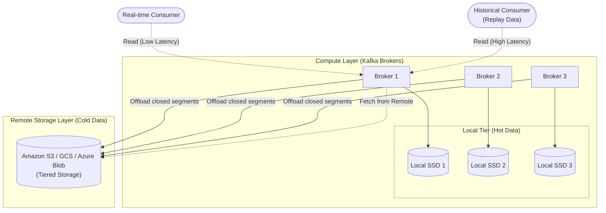

# Kiến trúc Kafka Tiered Storage (KIP-405)

## Lời mở đầu

Trước đây, Apache Kafka lưu trữ toàn bộ dữ liệu trên các ổ đĩa cục bộ (local disks) của Broker. Thiết kế này ràng buộc chặt chẽ giữa **Compute** (khả năng xử lý của Broker, CPU, RAM) và **Storage** (dung lượng lưu trữ của ổ đĩa). Khi bạn cần giữ dữ liệu trong Kafka lâu hơn (ví dụ: vài tháng thay vì vài ngày), bạn buộc phải thêm Broker mới chỉ để lấy thêm dung lượng ổ cứng, dẫn đến sự lãng phí tài nguyên Compute và làm tăng độ phức tạp của toàn bộ cluster.

**KIP-405 (Kafka Tiered Storage)** ra đời để giải quyết triệt để vấn đề này bằng cách phân tách Compute và Storage. Dữ liệu nóng được giữ lại trên Broker, trong khi dữ liệu cũ (lạnh) được đẩy sang các hệ thống Object Storage chuyên biệt, giá rẻ và có khả năng mở rộng vô hạn.

## Phân tách Compute và Storage

Kiến trúc Tiered Storage chia dữ liệu của một partition thành hai tầng (tiers):
1. **Local Tier (Hot Data)**: Chứa các log segments mới nhất, được lưu trên ổ đĩa cục bộ của Broker để đảm bảo độ trễ cực thấp (low latency) cho thao tác đọc và ghi (tương tự như Kafka truyền thống).
2. **Remote Tier (Cold Data)**: Chứa các log segments đã đóng (closed segments) cũ hơn, được tự động đẩy (offload) sang hệ thống lưu trữ bên ngoài như Amazon S3, Google Cloud Storage (GCS), hoặc HDFS.

Sơ đồ dưới đây minh họa sự phân tách giữa luồng xử lý Compute (Broker) và lưu trữ dữ liệu Cold (Object Storage):

## Phân tích sâu (Deep-dive)

### Tại sao Tiered Storage giúp giảm thời gian Rebalancing?

Trong Kafka truyền thống, khi thêm một Broker mới vào cluster hoặc thực hiện luân chuyển partition (rebalance), quá trình này đòi hỏi phải sao chép toàn bộ dữ liệu của partition từ Broker cũ sang Broker mới qua mạng lưới (network). Nếu mỗi Broker chứa hàng Terabytes dữ liệu, quá trình này có thể mất nhiều giờ, thậm chí nhiều ngày. Hệ quả là gây quá tải network (network saturation) và làm suy giảm performance của các producer/consumer đang hoạt động.

Với KIP-405 Tiered Storage, cơ chế rebalance thay đổi hoàn toàn:
- **Dữ liệu lạnh (Cold Data)** đã nằm sẵn trên Remote Storage (S3/GCS) và được cấu hình để truy cập toàn cục (globally accessible) bởi bất kỳ Broker nào.
- Khi một Broker mới được chỉ định làm replica cho một partition, nó **không cần phải sao chép toàn bộ cold data**. Nó chỉ thực hiện các bước sau:
  1. Đồng bộ phần **metadata** (cực kỳ nhỏ) chỉ định vị trí các segment trên Remote Storage.
  2. Chỉ sao chép phần **dữ liệu nóng (hot data)** hiện đang nằm trên Local Tier từ Broker leader hiện tại.
  
Nhờ vậy, lượng dữ liệu cần chuyển qua mạng giữa các Broker giảm đi một cách đáng kinh ngạc (thường chỉ còn vài Gigabytes thay vì Terabytes). Quá trình rebalancing từ chỗ mất nhiều ngày giảm xuống chỉ còn vài phút hoặc vài giây. Điều này cho phép Kafka cluster trở nên vô cùng "elastic" (đàn hồi): dễ dàng scale out (thêm node) khi tải tăng và scale in (bớt node) khi tải giảm một cách mượt mà.

### Đánh đổi (Trade-off): Độ trễ khi đọc dữ liệu lạnh

Mặc dù việc chuyển cold data sang Object Storage mang lại lợi ích to lớn về chi phí và vận hành, nó cũng mang đến một sự đánh đổi (trade-off) tất yếu về **độ trễ (latency)**.

1. **Dữ liệu thời gian thực (Hot Data)**: Đối với các Consumer đọc dữ liệu mới nhất (tailing consumers), họ tiếp tục tiêu thụ dữ liệu từ Page Cache của OS hoặc trực tiếp từ Local Disk. Độ trễ vẫn duy trì ở mức mili-giây (ms), hoàn toàn không bị ảnh hưởng bởi Tiered Storage.

2. **Dữ liệu lịch sử (Cold Data)**: Khi một Consumer cần tải lại dữ liệu cũ (replay historical data), ví dụ như để chạy lại pipeline do lỗi logic hoặc train mô hình Machine Learning, Broker buộc phải tìm nạp (fetch) các log segments từ S3/GCS.
   - **Time-to-First-Byte (TTFB)** của Object Storage thường cao hơn đáng kể so với việc đọc qua Local NVMe/SSD.
   - Băng thông mạng từ Cloud Provider (ví dụ AWS) về Broker có thể bị nghẽn (bottleneck) so với bus tốc độ cao của ổ cứng nội bộ.
   - Broker cần phải buffer các block dữ liệu lấy từ remote storage vào bộ nhớ, tiêu thụ thêm tài nguyên CPU và RAM trước khi trả về cho Consumer.

Kết quả là thao tác đọc lịch sử (historical reads) sẽ chịu độ trễ cao hơn, và thông lượng đọc tối đa phụ thuộc mạnh vào hiệu năng của Object Storage backend. Thiết kế này được đánh đổi một cách có chủ đích: tối ưu hóa chi phí lưu trữ (Cost) và sự linh hoạt (Elasticity), thay vì tối đa hóa hiệu suất cho việc đọc dữ liệu cũ vốn không đòi hỏi thời gian thực.

---

## Nguồn Tham Khảo

[KIP-405: Kafka Tiered Storage](https://cwiki.apache.org/confluence/display/KAFKA/KIP-405%3A+Kafka+Tiered+Storage)
[Uber Engineering: Kafka Tiered Storage at Uber](https://www.uber.com/en-VN/blog/kafka-tiered-storage/)
[Confluent: Infinite Storage in Kafka](https://www.confluent.io/blog/infinite-kafka-tiered-storage-in-confluent-platform/)
[Confluent: Tiered Storage in Apache Kafka](https://www.confluent.io/blog/tiered-storage-in-apache-kafka/)
[Apache Kafka Documentation: Tiered Storage](https://kafka.apache.org/documentation/#tiered_storage)
