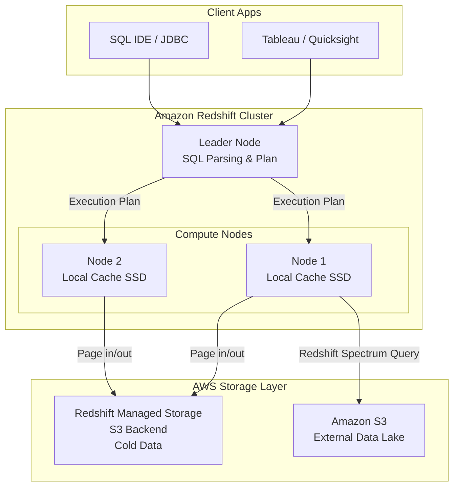

Vào năm 2012, Amazon Web Services (AWS) đã tạo nên một bước ngoặt lớn trong ngành dữ liệu khi giới thiệu **Amazon Redshift** – dịch vụ kho dữ liệu ([Data Warehouse](/concepts/2-storage/data-warehouse/data-warehouse/)) trên đám mây ở quy mô Petabyte đầu tiên trên thế giới. 

Bằng cách kết hợp kiến trúc Xử lý Song song Khổng lồ (Massively Parallel Processing - MPP) và lưu trữ dạng cột ([Columnar Storage](/concepts/2-storage/database-storage/columnar-storage/)), Redshift cho phép các doanh nghiệp thực thi các câu lệnh SQL phức tạp trên lượng dữ liệu khổng lồ với tốc độ cực nhanh. Cho đến nay, Redshift vẫn là một trong những cột trụ vững chắc và phổ biến nhất trong hệ sinh thái của AWS.

## Cuộc cách mạng "dân chủ hóa" kho dữ liệu

Để hiểu được tại sao Redshift lại gây tiếng vang lớn như vậy khi ra mắt, chúng ta hãy nhìn lại bối cảnh trước năm 2012. Vào thời điểm đó, nếu một tập đoàn lớn muốn xây dựng một hệ thống Data Warehouse để phân tích số liệu, họ bắt buộc phải:

1. Đầu tư hàng triệu USD để mua các thiết bị phần cứng chuyên dụng đắt đỏ từ các hãng lớn như Teradata, Oracle Exadata hay Netezza.
2. Vận hành tốn kém, đòi hỏi một đội ngũ quản trị viên cơ sở dữ liệu (DBA) đông đảo và chuyên nghiệp để duy trì hệ thống.
3. Chờ đợi hàng tháng trời để mua thêm phần cứng và nâng cấp cấu hình (Scale-up) khi dung lượng lưu trữ bị đầy.

Amazon Redshift ra đời và thay đổi hoàn toàn luật chơi. Lần đầu tiên trong lịch sử, một công ty khởi nghiệp nhỏ cũng có thể sở hữu một cụm Data Warehouse mạnh mẽ ngang ngửa với các ngân hàng lớn chỉ với mức giá khởi điểm cực kỳ rẻ khoảng \$0.25/giờ, khởi tạo nhanh chóng trong 15 phút và có thể tắt đi khi không còn nhu cầu sử dụng.

## Trái tim của Redshift: Kiến trúc xử lý song song khổng lồ (MPP)

Redshift được xây dựng dựa trên lõi của hệ quản trị cơ sở dữ liệu mã nguồn mở PostgreSQL, nhưng cấu trúc bên dưới đã được viết lại hoàn toàn để tối ưu hóa riêng cho các tác vụ phân tích (OLAP). Khi bạn gửi một câu lệnh SQL đến Redshift, nó sẽ được xử lý bởi một cụm máy chủ (Cluster) gồm hai thành phần chính:

* **Leader Node (Nút chỉ huy):** Đóng vai trò là người tiếp đón và điều phối. Khi bạn chạy một câu lệnh SQL từ các công cụ BI (như Tableau) hoặc SQL IDE, Leader Node sẽ tiếp nhận, phân tích cú pháp (parsing), tối ưu hóa đường đi của truy vấn, biên dịch thành mã thực thi và phân phát "mệnh lệnh" xuống các nút con.
* **Compute Nodes (Các nút tính toán):** Đây là đội ngũ trực tiếp thực thi công việc tính toán. Mỗi Compute Node được chia nhỏ thành các **Slices (lát cắt)**. Dữ liệu nạp vào Redshift sẽ được chia nhỏ và phân tán đều xuống các Slices này. Mỗi Slice sở hữu tài nguyên ổ cứng, bộ nhớ riêng và xử lý độc lập phần việc của mình (Kiến trúc Shared-nothing). Sau khi hoàn thành, các nút con sẽ gửi kết quả ngược lại cho Leader Node để tổng hợp lại và trả về cho người dùng.

## Từ "Shared-Nothing" truyền thống đến bước nhảy vọt RA3

Trong thiết kế truyền thống của Redshift, năng lực tính toán (CPU) và dung lượng lưu trữ (Disk) được liên kết chặt chẽ với nhau trong mỗi Compute Node. Khi kho dữ liệu của bạn phình to nhưng nhu cầu tính toán không đổi, bạn vẫn buộc phải mua thêm Node mới chỉ để lấy dung lượng ổ đĩa. Việc này dẫn đến việc bạn phải trả tiền cho lượng tài nguyên CPU dư thừa không dùng tới.

Để giải quyết bài toán này và cạnh tranh sòng phẳng với các đối thủ hiện đại như Snowflake hay Google BigQuery, AWS đã giới thiệu thế hệ máy chủ mới gọi là **RA3 Instances (Redshift Managed Storage - RMS)**:

* **Tách rời tính toán và lưu trữ:** Với RA3, dữ liệu cũ hoặc ít khi dùng tới (Cold Data) sẽ được tự động đẩy xuống Amazon S3 với chi phí lưu trữ cực rẻ.
* **Tối ưu hóa bộ nhớ đệm (Caching):** Máy chủ RA3 chỉ giữ lại các dữ liệu thường xuyên được truy cập (Hot Data) trên ổ cứng SSD tốc độ cao của nó.
* **Mở rộng linh hoạt:** Giờ đây, bạn có thể mở rộng khả năng lưu trữ của Redshift lên vô hạn mà không cần phải trả thêm tiền cho các Compute Node không cần thiết.

## Những tính năng làm nên tên tuổi của Redshift

### 1. Redshift Spectrum (Truy vấn trực tiếp trên Hồ dữ liệu)
Thay vì phải tốn thời gian và chi phí thiết lập các đường ống [ETL](/concepts/3-integration/etl-elt/etl/) phức tạp để nạp dữ liệu từ Amazon S3 vào Redshift, Spectrum cho phép bạn viết câu lệnh SQL để kết hợp (JOIN) trực tiếp các bảng dữ liệu bên trong Redshift với các file định dạng Parquet/CSV đang nằm tự do trên S3 mà không cần di chuyển dữ liệu.

### 2. Các kiểu phân phối dữ liệu vật lý (Distribution Styles)
Để tận dụng tối đa sức mạnh xử lý song song của kiến trúc MPP, dữ liệu khi nạp vào Redshift cần được phân chia đồng đều giữa các node. Bạn có quyền cấu hình các chiến lược phân phối sau:
* **EVEN (Phân phối đều):** Dữ liệu được chia đều tuần tự theo kiểu chia bài (Round-robin). Phù hợp cho các bảng độc lập, ít khi thực hiện phép JOIN.
* **KEY (Phân phối theo khóa):** Gom các dòng dữ liệu có chung một giá trị khóa (ví dụ: `user_id`) về cùng một Compute Node vật lý. Cách này giúp tăng tốc độ xử lý phép JOIN giữa hai bảng lớn lên rất nhiều vì không tốn tài nguyên truyền dữ liệu qua mạng giữa các node.
* **ALL (Phân phối toàn bộ):** Nhân bản toàn bộ bảng dữ liệu sang tất cả các Compute Node. Kiểu này cực kỳ hữu ích cho các bảng danh mục nhỏ (ví dụ bảng mã quốc gia), giúp các node con có sẵn dữ liệu cục bộ để thực hiện JOIN tức thì.

### 3. Tùy chọn không máy chủ (Redshift Serverless)
Được thiết kế theo mô hình pay-as-you-go, Redshift Serverless tự động khởi tạo năng lực tính toán (đo bằng RPU - Redshift Processing Units) khi có truy vấn chạy và tự động tắt đi khi hệ thống rảnh rỗi. Đây là giải pháp hoàn hảo cho các doanh nghiệp có lượng công việc không cố định, giúp tối ưu hóa chi phí đến mức tối đa.

## Sơ đồ kiến trúc tổng quan của Amazon Redshift

Hãy cùng xem sơ đồ dưới đây để hình dung cách các thành phần trong Redshift phối hợp xử lý yêu cầu:


## Bắt tay vào tối ưu: Sức mạnh của Distribution Style trong thực tế

Giả sử bạn có hai bảng: `orders` (1 tỷ dòng) và `customers` (10 triệu dòng) và bạn thường xuyên phải chạy câu lệnh JOIN sau để tính doanh thu theo khu vực:
```sql
SELECT c.region, SUM(o.total_amount) 
FROM orders o 
JOIN customers c ON o.customer_id = c.id
GROUP BY c.region;
```

**Cách thiết kế chưa tối ưu (Dùng mặc định EVEN):**
Nếu bạn không khai báo kiểu phân phối, Redshift sẽ mặc định phân bổ đều dữ liệu. Khi đó, thông tin của khách hàng số 5 nằm ở Node A, nhưng dữ liệu đơn hàng của họ lại nằm rải rác ở Node B, C, D. Khi chạy câu lệnh `JOIN`, Redshift buộc phải copy và chuyển dữ liệu qua mạng giữa các node để khớp nối (hiện tượng Network Broadcast). Phép tính này có thể mất tới 5 phút để hoàn thành.

**Cách thiết kế tối ưu (Chỉ định DISTKEY):**
Bằng cách chỉ định phân phối dữ liệu dựa trên một khóa chung, bạn có thể gom dữ liệu liên quan về cùng một vị trí vật lý:
```sql
CREATE TABLE orders (
    order_id INT,
    customer_id INT,
    total_amount DECIMAL(18,2)
) DISTSTYLE KEY DISTKEY (customer_id);

CREATE TABLE customers (
    id INT,
    name VARCHAR(100),
    region VARCHAR(50)
) DISTSTYLE KEY DISTKEY (id);
```

Vì cả hai bảng đều sử dụng chung một khóa phân phối (`customer_id` và `id`), Redshift sẽ đảm bảo thông tin của khách hàng số 5 và toàn bộ đơn hàng của họ nằm chung trên một ổ cứng vật lý của một Compute Node. Phép toán `JOIN` lúc này diễn ra cục bộ (Local JOIN) ngay trên ổ đĩa đó mà không cần di chuyển dữ liệu qua mạng. Thời gian truy vấn giảm từ 5 phút xuống còn 10 giây.

## Những "bí kíp" giúp Redshift vận hành trơn tru

* **Định kỳ dọn dẹp hệ thống (VACUUM):** Khác với BigQuery, Redshift thừa hưởng nhiều đặc tính của RDBMS truyền thống. Khi bạn chạy lệnh `DELETE` hoặc `UPDATE`, dữ liệu cũ không thực sự biến mất khỏi ổ đĩa mà chỉ được đánh dấu ẩn. Bạn cần lập lịch chạy lệnh `VACUUM` thường xuyên để dọn dẹp các tệp tin rác này và sắp xếp lại thứ tự dữ liệu trên đĩa (mặc dù các phiên bản Redshift mới đã tích hợp tính năng Auto-Vacuum tự động).
* **Thiết lập Sort Keys thông minh:** Tương tự như cơ chế [Clustering](/concepts/2-storage/database-storage/clustering/), việc chỉ định Sort Key trên các cột thường dùng để lọc (như cột ngày tháng `order_date`) giúp Redshift nhanh chóng bỏ qua các block dữ liệu không liên quan (Zone Maps), cải thiện tốc độ quét dữ liệu.
* **Kiểm tra sơ đồ thực thi (EXPLAIN):** Trước khi đưa các câu truy vấn phức tạp vào vận hành thực tế, hãy chạy lệnh `EXPLAIN` trước câu SQL để kiểm tra xem hệ thống có cảnh báo các tác vụ truyền tải mạng nặng như `DS_BCAST_INNER` hay không, từ đó điều chỉnh lại DistKey cho phù hợp.

## Những sai lầm kinh điển cần tránh

* **Sử dụng Redshift như một database giao dịch ([OLTP](/concepts/2-storage/database-storage/oltp/)):** Thiết lập các ràng buộc khóa ngoại (Foreign Key) hay khóa duy nhất (Unique) và mong chờ Redshift tự động báo lỗi khi chèn dữ liệu trùng lặp như PostgreSQL. Trong thực tế, Redshift **bỏ qua việc kiểm tra ràng buộc** này để ưu tiên tốc độ ghi dữ liệu ở quy mô lớn. Việc kiểm tra và làm sạch dữ liệu trùng lặp phải được xử lý chủ động thông qua code ETL (ví dụ dùng logic UPSERT/Merge).
* **Ghi dữ liệu bằng các lệnh INSERT nhỏ lẻ:** Chạy hàng trăm nghìn lệnh `INSERT INTO table VALUES(...)` liên tục sẽ tạo ra nút thắt cổ chai cực lớn tại Leader Node. Cách làm đúng là đẩy dữ liệu lên S3 dưới dạng các tệp tin CSV/Parquet, sau đó chạy một câu lệnh `COPY` duy nhất để tất cả các Compute Node cùng kéo dữ liệu song song vào kho.

## Điểm mạnh (Pros)

### Ưu điểm:
* Nằm sâu trong hệ sinh thái của AWS, tích hợp hoàn hảo với các dịch vụ bảo mật (IAM, VPC) và các công cụ xử lý dữ liệu khác như AWS Glue, Kinesis, Athena.
* Cho phép các kỹ sư dữ liệu kiểm soát cực kỳ chi tiết cấu trúc vật lý của cơ sở dữ liệu để tinh chỉnh hiệu năng tối đa trên mỗi đồng chi phí bỏ ra.

### Nhược điểm:
* **Chi phí vận hành cao (High Maintenance):** Ngoại trừ bản Serverless mới, phiên bản Provisioned truyền thống đòi hỏi kỹ sư phải có kiến thức sâu về quản trị hệ thống (Database Administration) để liên tục cấu hình, chạy Vacuum và giám sát tài nguyên cụm máy.
* Trải nghiệm giao diện quản trị Web UI và các công cụ bổ trợ đôi khi cho cảm giác hơi thô ráp và kém mượt mà hơn so với đối thủ trực tiếp là Snowflake.

## Khi nào nên dùng

* **Nên dùng khi:**
  * Doanh nghiệp của bạn đã xây dựng toàn bộ hạ tầng trên AWS và không có kế hoạch chuyển dịch sang mô hình đa đám mây (Multi-cloud).
  * Bạn có đội ngũ [Data Engineering](/concepts/1-foundations/foundation/data-engineering/) mạnh, muốn chủ động kiểm soát chi phí hạ tầng ở mức tối ưu nhất thông qua việc tự cấu hình hệ thống.
  * Bạn muốn xây dựng mô hình [Lakehouse](/concepts/2-storage/data-lake-lakehouse/lakehouse/), kết hợp linh hoạt giữa lưu trữ dữ liệu có cấu trúc trong kho và truy vấn file thô trên S3.

* **Không nên dùng khi:**
  * Doanh nghiệp đang sử dụng Google Cloud hoặc Azure làm nền tảng đám mây chính.
  * Đội ngũ của bạn chủ yếu là Analysts và không có kỹ sư chuyên trách về vận hành hệ thống dữ liệu (khi đó BigQuery hay Snowflake với cơ chế tự động hóa 100% sẽ là lựa chọn phù hợp hơn).

## Các khái niệm liên quan

* [Google BigQuery](/concepts/2-storage/cloud-data-platform/google-bigquery/)
* [Snowflake](/concepts/2-storage/cloud-data-platform/snowflake/)
* [OLAP vs OLTP](/concepts/2-storage/database-storage/olap/)

## Trọng tâm ôn luyện phỏng vấn

### 1. Hãy phân biệt ba kiểu phân phối dữ liệu (Distribution Styles) trong Redshift: EVEN, KEY và ALL.
* **Gợi ý trả lời:** 
  * **EVEN:** Phân bổ dữ liệu đều theo lượt (round-robin) đến các node con. Giúp cân bằng dung lượng lưu trữ trên các node nhưng làm giảm hiệu năng khi thực hiện các phép JOIN lớn do phải chuyển dữ liệu qua mạng.
  * **KEY:** Sử dụng hàm băm trên một cột khóa được chọn để gom các dòng dữ liệu có cùng giá trị khóa về cùng một node vật lý. Tối ưu cực mạnh cho các phép JOIN giữa hai bảng lớn nếu cả hai bảng đều chọn chung một khóa phân phối.
  * **ALL:** Sao chép toàn bộ bảng dữ liệu sang tất cả các node con. Cực kỳ tối ưu cho các bảng danh mục nhỏ vì các node con có sẵn dữ liệu cục bộ để thực hiện phép JOIN ngay lập tức, nhưng nhược điểm là tốn dung lượng lưu trữ và làm chậm tốc độ ghi dữ liệu mới.

### 2. Sự khác biệt chính về mô hình tính phí (Pricing) giữa Redshift (bản Provisioned) và Google BigQuery là gì?
* **Gợi ý trả lời:** Redshift bản Provisioned hoạt động theo mô hình thuê phần cứng cố định: bạn thuê một cụm máy chủ với cấu hình cụ thể (số lượng CPU, dung lượng RAM/SSD) và trả tiền theo giờ/tháng cố định, bất kể bạn có chạy câu truy vấn nào hay không. Ngược lại, Google BigQuery hoạt động theo mô hình Serverless hoàn toàn: bạn không cần thuê máy chủ, hệ thống sẽ tính phí trực tiếp dựa trên số lượng Byte dữ liệu bị quét qua mỗi khi bạn chạy câu lệnh SQL. (Lưu ý: hiện nay Redshift cũng đã cung cấp phiên bản Serverless để hỗ trợ tính phí linh hoạt tương tự).

### 3. Tại sao trong các tài liệu hướng dẫn của AWS, người ta luôn khuyên dùng lệnh COPY từ S3 để nạp dữ liệu thay vì dùng lệnh INSERT?
* **Gợi ý trả lời:** Khi sử dụng lệnh `INSERT` từng dòng, toàn bộ luồng dữ liệu phải đi qua Leader Node duy nhất, tạo ra nút thắt cổ chai về băng thông. Ngược lại, lệnh `COPY` tận dụng tối đa kiến trúc MPP: Leader Node chỉ làm nhiệm vụ điều phối, ra lệnh cho tất cả các Compute Node con đồng loạt kết nối trực tiếp vào S3 và kéo các file dữ liệu song song về ổ cứng của riêng chúng. Phương pháp này giúp tốc độ nạp dữ liệu nhanh hơn gấp hàng nghìn lần so với lệnh `INSERT` truyền thống.

## Xem thêm các khái niệm liên quan
* [Azure Synapse Analytics](/concepts/2-storage/cloud-data-platform/azure-synapse/)
* [Google BigQuery Optimization & Storage Write API](/concepts/2-storage/cloud-data-platform/bigquery-optimization/)
* [Tối ưu hóa Slot & Chi phí BigQuery](/concepts/2-storage/cloud-data-platform/bigquery-slot-optimization/)

## Tài liệu tham khảo

1. [Amazon Redshift Database Developer Guide](https://docs.aws.amazon.com/redshift/latest/dg/welcome.html) - Official developer documentation for designing tables, queries, and managing cluster performance.
2. [Amazon Redshift RA3 Nodes Under the Hood](https://aws.amazon.com/blogs/big-data/amazon-redshift-ra3-nodes-with-managed-storage/) - AWS Engineering blog post detailing decoupled compute and managed S3 storage architecture.
3. [Choosing a Data Distribution Style in Redshift](https://docs.aws.amazon.com/redshift/latest/dg/c_choosing_dist_style.html) - AWS documentation guidance on selecting KEY, ALL, EVEN, or AUTO distribution styles for table optimization.
4. [Amazon Redshift Pricing Guide](https://aws.amazon.com/redshift/pricing/) - Detailed overview of pricing structures for provisioned and serverless Redshift clusters.
5. [Amazon Redshift Serverless Guide](https://docs.aws.amazon.com/redshift/latest/mgmt/serverless.html) - AWS documentation for deploying and managing serverless analytics resources.

## English Summary

Amazon Redshift is AWS's flagship, petabyte-scale Cloud Data Warehouse powered by Massively Parallel Processing (MPP) and columnar storage. Historically utilizing a shared-nothing architecture, it recently evolved via RA3 instances (Redshift Managed Storage) to separate compute and storage layers, effectively competing with modern decoupled architectures. To achieve its industry-leading query speeds, data engineers must actively manage the physical layout of the database using Distribution Styles (KEY, ALL, EVEN) and Sort Keys to minimize network broadcast during massive JOINs. While it offers unparalleled integration with the AWS ecosystem and fine-grained hardware control, it traditionally demands a higher level of database administration and maintenance (e.g., periodic Vacuuming) compared to fully serverless alternatives like BigQuery, although Redshift Serverless now aims to bridge this gap.