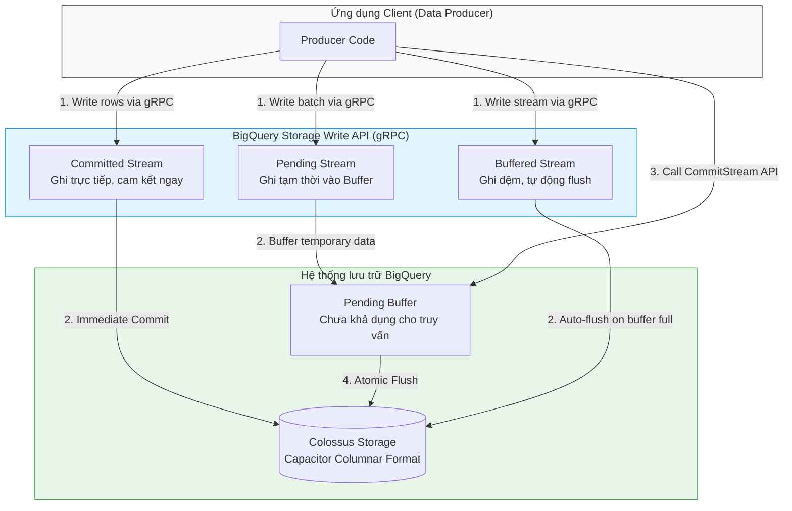

Trong các hệ thống phân tích dữ liệu quy mô lớn (Enterprise Data Warehouse), việc cân bằng giữa hiệu năng truy vấn và chi phí vận hành luôn là một bài toán hóc búa. Với mô hình Serverless hoàn toàn của [Google BigQuery](/concepts/2-storage/cloud-data-platform/google-bigquery/), người dùng có thể quét qua hàng Petabyte dữ liệu chỉ trong vài giây. Tuy nhiên, nếu không hiểu rõ nguyên lý hoạt động bên dưới, các kỹ sư dữ liệu (Data Engineers) rất dễ rơi vào tình trạng tối ưu hóa kém, dẫn đến thời gian thực thi kéo dài và chi phí hóa đơn tăng vọt.

Bài viết này cung cấp một cái nhìn chuyên sâu và toàn diện về các phương pháp tối ưu hóa hiệu năng, kiểm soát chi phí trên Google BigQuery, đồng thời phân tích chi tiết cơ chế nạp dữ liệu thời gian thực thế hệ mới – **Storage Write API**.

---

## Kiến trúc phân tách Lưu trữ và Tính toán (Decoupled Storage & Compute)

Sức mạnh vượt trội và khả năng mở rộng không giới hạn của BigQuery bắt nguồn từ triết lý kiến trúc phân tách hoàn toàn giữa lớp Lưu trữ (Storage) và lớp Tính toán (Compute). Hai lớp này hoạt động độc lập và giao tiếp với nhau qua mạng truyền dẫn nội bộ siêu tốc.

### 1. Lớp lưu trữ (Storage) - Colossus
Dữ liệu của BigQuery được lưu trữ vật lý trên **Colossus** – hệ thống tệp phân tán thế hệ thứ hai của Google. 
- **Định dạng Capacitor**: Dữ liệu khi nạp vào sẽ được nén và tổ chức theo định dạng hướng cột (Columnar Format) độc quyền tên là Capacitor. Thay vì đọc toàn bộ dòng dữ liệu từ đĩa như các cơ sở dữ liệu dòng truyền thống ([OLTP](/concepts/2-storage/database-storage/oltp/)), BigQuery chỉ đọc đúng những cột được chỉ định trong câu lệnh `SELECT`.
- **Độ bền vững cao**: Colossus tự động nhân bản (replicate) dữ liệu trên nhiều vùng địa lý, mã hóa dữ liệu ở trạng thái nghỉ (encryption at rest) và tự động khôi phục dữ liệu khi có sự cố phần cứng.

### 2. Lớp tính toán (Compute) - Dremel
**Dremel** là cỗ máy thực thi truy vấn song song phân tán (Massively Parallel Processing - MPP) cực mạnh.
- Khi một câu lệnh SQL được gửi lên, Dremel Coordinator đóng vai trò điều phối sẽ phân tích cú pháp và dịch chuyển nó thành một cây thực thi (Execution Tree).
- Truy vấn được chia nhỏ thành nhiều tác vụ nhỏ hơn và phân bổ cho hàng ngàn máy chủ con (Workers), chạy dưới dạng các đơn vị tài nguyên ảo gọi là **Slots**.
- Các Slots này thực hiện đọc dữ liệu từ Colossus, lọc, gom nhóm, và tính toán kết quả trung gian, sau đó đẩy ngược lên các nút cha để tổng hợp kết quả cuối cùng.

### 3. Mạng kết nối siêu tốc (Network) - Jupiter
Để giải quyết nút thắt cổ chai về băng thông khi truyền tải dữ liệu khổng lồ giữa lớp lưu trữ Colossus và hàng ngàn Slots tính toán của Dremel, Google sử dụng mạng cáp quang nội bộ **Jupiter**. Với băng thông cực khủng lên đến **1 Petabit/giây**, Jupiter cho phép truyền dữ liệu nhanh như thể đĩa lưu trữ đang được cắm trực tiếp vào bo mạch chủ của máy tính xử lý.

---

## Quản lý tài nguyên tính toán: Slots Allocation

Trong BigQuery, tài nguyên tính toán không được đo bằng số lượng CPU hay dung lượng RAM cụ thể, mà được chuẩn hóa thành khái niệm **Slot** (đơn vị tính toán ảo tích hợp CPU, RAM và tài nguyên mạng). Hiệu năng của một câu truy vấn tỷ lệ thuận với số lượng Slots mà nó được phân bổ.

BigQuery cung cấp hai mô hình phân bổ Slots chính để tối ưu hóa chi phí:

### 1. Mô hình On-Demand (Theo yêu cầu - Trả theo dung lượng quét)
- **Cơ chế**: Đây là mô hình mặc định. Người dùng không cần quan tâm đến việc mua hay thiết lập Slots. Khi chạy truy vấn, BigQuery sẽ tự động phân bổ động (dynamic allocation) một lượng Slots cần thiết (tối đa lên đến 2,000 slots cho mỗi dự án) để xử lý.
- **Tính phí**: Google tính phí dựa trên **dung lượng dữ liệu thực tế bị quét** qua bởi câu truy vấn (mức giá chuẩn là **\\$6.25 cho mỗi Terabyte - TB**). Nếu bạn không chạy câu truy vấn nào, chi phí tính toán bằng \\$0.
- **Đối tượng phù hợp**: Phù hợp cho các dự án nhỏ, startup hoặc các đội ngũ có tần suất truy vấn không liên tục, lượng dữ liệu quét hàng tháng biến động và muốn tối ưu hóa chi phí theo dạng dùng bao nhiêu trả bấy nhiêu.

### 2. Mô hình Capacity Commitment (Cam kết năng lượng tính toán)
- **Cơ chế**: Doanh nghiệp mua trước một lượng Slots cố định (tối thiểu là 100 slots) dưới dạng cam kết tài nguyên. Bạn sẽ trả một khoản phí cố định hàng tháng hoặc hàng năm cho lượng Slots này.
- **Autoscaling Slots**: BigQuery hỗ trợ tự động co giãn Slots. Bạn cấu hình một lượng Slots cơ sở (baseline slots) và lượng Slots tối đa (maximum slots). Khi có tải cao, hệ thống tự động tăng Slots để đảm bảo hiệu năng và giảm về mức baseline khi nhãn rỗi để tiết kiệm chi phí.
- **Reservation**: Cho phép doanh nghiệp phân bổ lượng Slots đã mua thành các nhóm độc lập (Reservations) và gán các nhóm này cho từng dự án (Projects), thư mục (Folders) cụ thể trong GCP Organization. Điều này giúp ngăn chặn tình trạng một câu truy vấn lỗi của nhóm phân tích ad-hoc chiếm dụng hết tài nguyên của hệ thống báo cáo (Dashboard) thời gian thực của doanh nghiệp.
- **Đối tượng phù hợp**: Các doanh nghiệp lớn có ngân sách cố định cần kiểm soát chi phí (predictable pricing), hoặc các hệ thống chạy tác vụ phân tích liên tục 24/7 với lượng Slots tiêu thụ lớn.

---

## Ước lượng chi phí trước khi thực thi bằng Dry-Run

Một trong những sai lầm kinh điển dẫn đến việc "đốt tiền" của doanh nghiệp là chạy các câu lệnh SQL chưa được tối ưu quét qua hàng chục Terabytes dữ liệu mà không hề biết trước chi phí. Để giải quyết vấn đề này, BigQuery cung cấp tính năng **Dry-run (chạy thử nghiệm)**.

### Nguyên lý hoạt động của Dry-run
Khi bạn gửi yêu cầu Dry-run, bộ điều phối Dremel chỉ thực hiện:
1. Kiểm tra cú pháp của câu lệnh SQL (SQL syntax validation).
2. Kiểm tra quyền truy cập của người dùng đối với các bảng liên quan.
3. Đọc dữ liệu mô tả (Metadata) của các bảng từ lớp Colossus để tính toán số lượng bytes dự kiến sẽ quét.

Do **không có dữ liệu vật lý nào được đọc từ đĩa** và **không có Slots tính toán nào được huy động**, hoạt động Dry-run hoàn toàn **miễn phí (\\$0)** và hoàn thành trong mili-giây.

### Ví dụ thực hiện Dry-run bằng gcloud CLI
```bash
gcloud bigquery query --dry_run --use_legacy_sql=false \
"SELECT customer_id, SUM(total_price) 
 FROM \`my-gcp-project.sales.orders\` 
 WHERE order_date BETWEEN '2026-06-01' AND '2026-06-12' 
 GROUP BY customer_id"
```

### Ví dụ lập trình Dry-run bằng Node.js Client Library
```javascript
const {BigQuery} = require('@google-cloud/bigquery');
const bigquery = new BigQuery();

async function runDryRun() {
  const query = `
    SELECT product_id, COUNT(1) as total_views
    FROM \`my-gcp-project.web_logs.page_views\`
    WHERE view_date = '2026-06-12'
    GROUP BY product_id
  `;

  // Bật tùy chọn dryRun trong cấu hình job
  const options = {
    query: query,
    dryRun: true,
  };

  // Tạo Query Job chạy ở chế độ Dry-run
  const [job] = await bigquery.createQueryJob(options);
  
  // Lấy lượng bytes dự kiến quét từ metadata của job
  const bytesProcessed = job.metadata.statistics.totalBytesProcessed;
  const megabytes = bytesProcessed / (1024 * 1024);
  const gigabytes = megabytes / 1024;
  const costPerTB = 6.25;
  const estimatedCost = (gigabytes / 1024) * costPerTB;

  console.log(`[Dry-Run] Dung lượng dữ liệu dự kiến quét: ${gigabytes.toFixed(2)} GB`);
  console.log(`[Dry-Run] Chi phí ước tính: $${estimatedCost.toFixed(5)} USD`);
}

runDryRun();
```

---

## Kỹ thuật tối ưu hóa hiệu năng truy vấn vật lý

Để giảm thiểu chi phí và tăng tốc độ truy vấn, kỹ sư dữ liệu cần áp dụng hai kỹ thuật cấu trúc vật lý bảng cốt lõi là **Partitioning** và **Clustering**.

### 1. Partitioning (Phân vùng dữ liệu)
Phân vùng là quá trình chia nhỏ một bảng lớn thành các phân đoạn vật lý độc lập (partitions) dựa trên giá trị của một cột phân vùng. Khi truy vấn lọc dữ liệu theo cột này, BigQuery áp dụng cơ chế **Partition Pruning** (loại bỏ phân vùng) – chỉ đọc các phân vùng khớp điều kiện và bỏ qua tất cả các phân vùng còn lại.

Các hình thức Partitioning phổ biến:
- **Time-unit column**: Phân vùng theo cột kiểu `DATE`, `DATETIME` hoặc `TIMESTAMP`. Bạn có thể tùy chọn phân vùng theo giờ (hourly), ngày (daily), tháng (monthly) hoặc năm (yearly) tùy theo mật độ dữ liệu.
- **Ingestion-time**: Phân vùng dựa trên thời điểm dữ liệu được nạp vào. BigQuery tự động tạo ra một cột giả (pseudo-column) tên là `_PARTITIONTIME` để quản lý.
- **Integer-range**: Phân vùng theo cột số nguyên (`INTEGER`) với các tham số định nghĩa khoảng giá trị (Start, End, Interval).

> [!TIP]
> Luôn cấu hình thuộc tính `require_partition_filter = true` khi tạo bảng phân vùng. Thuộc tính này bắt buộc các câu lệnh truy vấn của người dùng phải khai báo bộ lọc phân vùng trong mệnh đề `WHERE`. Nếu không có bộ lọc, câu lệnh sẽ bị từ chối thực thi ngay lập tức, tránh việc quét toàn bộ bảng ngoài ý muốn.

### 2. Clustering (Phân cụm dữ liệu)
Phân cụm là kỹ thuật sắp xếp thứ tự sắp đặt dữ liệu vật lý một cách tuần tự bên trong mỗi phân vùng dựa trên giá trị của tối đa 4 cột chỉ định. 
- Khi nạp dữ liệu, BigQuery sẽ tự động gom các dòng có giá trị tương đồng ở các cột phân cụm vào các khối lưu trữ (blocks) liền kề nhau.
- Khi truy vấn lọc (`WHERE`) hoặc gom nhóm (`GROUP BY`) theo các cột phân cụm, BigQuery sử dụng metadata để bỏ qua các blocks dữ liệu không khớp điều kiện lọc (Block Pruning).
- **Lưu ý quan trọng**: Vì quá trình lọc block diễn ra động trong thời gian chạy (runtime), giao diện dry-run **không thể hiển thị trước lượng dữ liệu tiết kiệm được từ Clustering**. Tuy nhiên, thực tế khi chạy, bạn sẽ thấy lượng Slots tiêu thụ và thời gian phản hồi giảm đi rất nhiều.

### So sánh chi tiết Partitioning và Clustering

| Tiêu chí so sánh | Partitioning (Phân vùng) | Clustering (Phân cụm) |
| :--- | :--- | :--- |
| **Bản chất lưu trữ** | Chia nhỏ bảng vật lý thành các tệp tin/phân vùng riêng biệt. | Sắp xếp dữ liệu vật lý tuần tự theo khối bên trong phân vùng. |
| **Số lượng cột hỗ trợ** | Chỉ hỗ trợ tối đa **1 cột** duy nhất. | Hỗ trợ tối đa **4 cột** đồng thời. |
| **Giới hạn số lượng** | Tối đa 4,000 phân vùng trên mỗi bảng. | Không giới hạn số lượng phân cụm. |
| **Độ chính xác Dry-run** | Dự toán chính xác 100% lượng bytes quét trước khi chạy. | Không hiển thị lượng bytes tiết kiệm được trên Dry-run. |
| **Kiểu dữ liệu hỗ trợ** | `DATE`, `TIMESTAMP`, `DATETIME`, `INTEGER`. | Tất cả các kiểu dữ liệu cơ bản (trừ ARRAY và STRUCT). |
| **Chi phí bảo trì** | Do Google tự động quản lý phân vùng vật lý. | Hệ thống tự động re-cluster ngầm (background) miễn phí. |

> [!IMPORTANT]
> **Nguyên tắc thiết kế tối ưu**: Luôn kết hợp cả hai kỹ thuật này. Hãy áp dụng **Partitioning trước** trên cột thời gian (ví dụ `created_at`) để khoanh vùng khoảng dữ liệu theo thời gian, sau đó cấu hình **Clustering** trên các cột định danh có độ chọn lọc cao (ví dụ `user_id`, `merchant_id`) để tăng tốc các câu truy vấn lọc chi tiết.

---

## Phương thức nạp dữ liệu thế hệ mới: Storage Write API

Khi phát triển luồng dẫn dữ liệu thời gian thực (Real-time Data Pipeline), phương thức ghi dữ liệu đóng vai trò quyết định đến hiệu năng và tính nhất quán dữ liệu trong Data Warehouse.

### So sánh với Legacy Streaming Ingestion (`insertAll` API)
Trong quá khứ, `insertAll` là phương thức streaming dữ liệu mặc định của BigQuery. Tuy nhiên, nó bộc lộ nhiều điểm hạn chế lớn:
- Sử dụng giao thức HTTP/1.1 REST truyền thống, gây ra overhead lớn về header và độ trễ kết nối.
- Chi phí cao (\\$0.01 cho mỗi 200 Megabytes dữ liệu nạp vào).
- Không có cơ chế cam kết giao dịch (no transactional guarantees). Nếu một lô dữ liệu bị lỗi nửa chừng, bạn có thể đối mặt với việc trùng lặp dữ liệu (duplicate) hoặc mất dữ liệu (data loss).
- Không kiểm soát được thứ tự ghi dữ liệu.

### Sự đột phá của Storage Write API
Được giới thiệu để thay thế hoàn toàn `insertAll`, **Storage Write API** là giải pháp ghi dữ liệu thế hệ mới được xây dựng trên nền tảng **gRPC** kết hợp truyền luồng hai chiều (bidirectional streaming). 
- Dữ liệu được tuần tự hóa (serialized) dưới dạng nhị phân Protocol Buffers (protobuf) siêu nén trước khi truyền qua mạng.
- Chi phí rẻ hơn 50% so với `insertAll` (chỉ khoảng **\\$0.025 cho mỗi Gigabyte - GB** dữ liệu nạp vào).
- Hỗ trợ cơ chế giao dịch cấp độ dòng (row-level transactions) giúp đảm bảo tính nhất quán dữ liệu tuyệt đối.

### Các loại Stream ghi dữ liệu trong Storage Write API

Để đáp ứng đa dạng các yêu cầu nghiệp vụ, Storage Write API cung cấp 3 loại stream chính:

1. **Committed Stream (Ghi trực tiếp - Cam kết ngay)**
   - Dữ liệu sau khi ghi qua stream gRPC sẽ được ghi trực tiếp vào bảng đích và có thể truy vấn được ngay lập tức (read-ready).
   - Mỗi thao tác ghi riêng lẻ là một giao dịch độc lập được cam kết ngay lập tức (immediate commit).
   - Phù hợp cho các luồng log sự kiện, dashboard giám sát thời gian thực cần hiển thị dữ liệu tức thì.

2. **Pending Stream (Ghi tạm thời - Chờ cam kết hàng loạt)**
   - Dữ liệu được ghi vào một phân đoạn đệm tạm thời (pending state) và hoàn toàn bị ẩn đối với các truy vấn đọc.
   - Khi luồng ghi hoàn tất, client phải gửi một yêu cầu Commit rõ ràng (explicit commit) tới API để chuyển toàn bộ dữ liệu vào bảng đích một cách nguyên tử (atomic flush).
   - Hỗ trợ tính năng **Exactly-Once** bằng cách sử dụng các chỉ số offset để loại bỏ bản ghi trùng lặp khi client kết nối lại sau sự cố mạng.
   - Hỗ trợ ghi dữ liệu song song qua nhiều stream khác nhau và commit chung một giao dịch. Nếu một stream lỗi, toàn bộ giao dịch sẽ rollback.
   - Thích hợp cho các quy trình ETL/ELT theo lô nhỏ (micro-batching) đòi hỏi tính toàn vẹn dữ liệu cực kỳ khắt khe.

3. **Buffered Stream (Ghi đệm - Tự động commit)**
   - Dữ liệu được ghi vào vùng đệm và có thể đọc được ngay (tương tự Committed stream).
   - Cơ chế commit xuống đĩa Colossus được thực hiện tự động bởi BigQuery khi lượng dữ liệu trong bộ đệm đạt đến ngưỡng giới hạn.
   - Thích hợp cho các ứng dụng streaming thông thường cần đọc dữ liệu nhanh nhưng không yêu cầu cam kết giao dịch chặt chẽ ở phía client.

### Sơ đồ luồng nạp dữ liệu qua Storage Write API

Dưới đây là sơ đồ Mermaid mô tả luồng hoạt động của các loại stream trong Storage Write API khi nạp dữ liệu từ ứng dụng client vào hệ thống lưu trữ BigQuery:



---

## Điểm mạnh và điểm yếu (Pros & Cons)

### Điểm mạnh (Pros)
- **Tối ưu hóa I/O hiệu quả**: Sự kết hợp giữa [Partitioning](/concepts/2-storage/database-storage/partitioning/) và [Clustering](/concepts/2-storage/database-storage/clustering/) giúp giảm thiểu đáng kể khối lượng dữ liệu I/O đĩa vật lý cần đọc từ Colossus, trực tiếp tăng tốc độ câu lệnh SQL và giảm chi phí hóa đơn.
- **Tiết kiệm chi phí nạp dữ liệu**: Storage Write API giúp cắt giảm 50% chi phí streaming so với phương thức cũ, đồng thời tăng đáng kể băng thông ghi dữ liệu (throughput).
- **Hỗ trợ Exactly-Once và Giao dịch**: Pending Stream cho phép triển khai các luồng dẫn dữ liệu có tính chất giao dịch (ACID transactions) ở quy mô lớn, loại bỏ hoàn toàn các rủi ro ghi trùng lặp dữ liệu khi mạng chập chờn.

### Điểm yếu (Cons)
- **Thiết kế lập trình phức tạp**: Sử dụng Storage Write API yêu cầu nhà phát triển phải định nghĩa cấu trúc dữ liệu bằng Protocol Buffers (protobuf) và tự viết logic quản lý vòng đời stream, bắt tay kết nối và xử lý lỗi gRPC. Điều này phức tạp hơn nhiều so với việc gọi một REST API thông thường.
- **Giới hạn số lượng phân vùng vật lý**: Giới hạn tối đa 4,000 phân vùng trên một bảng có thể trở thành nút thắt cổ chai nếu bạn phân vùng quá chi tiết (ví dụ: phân vùng theo giờ cho dữ liệu lưu trữ nhiều năm).
- **Hạn chế của Dry-run đối với Clustering**: Người dùng không thể biết trước chính xác số tiền tiết kiệm được từ kỹ thuật Phân cụm (Clustering) khi thực hiện Dry-run, gây khó khăn cho việc dự báo ngân sách chính xác đối với các truy vấn tự do (ad-hoc queries).

---

## Khi nào nên dùng và khi nào không?

### Khi nào nên dùng:
- **Nên dùng Storage Write API (Committed/Buffered Stream)** khi xây dựng các hệ thống giám sát sự kiện thời gian thực (IoT, Clickstream logs) có lưu lượng dữ liệu cực lớn và cần hiển thị ngay lập tức lên dashboard phân tích.
- **Nên dùng Storage Write API (Pending Stream)** khi xây dựng các đường truyền dữ liệu tài chính, giao dịch thương mại điện tử, hoặc các luồng đồng bộ dữ liệu CDC (Change Data Capture) yêu cầu tính toàn vẹn dữ liệu cao và cơ chế Exactly-Once.
- **Nên dùng Capacity Commitment** khi tổng chi phí truy vấn hàng tháng của doanh nghiệp vượt quá mức chi phí của 100 slots cố định và lượng truy vấn chạy ổn định, liên tục trong ngày.
- **Nên kết hợp Partitioning và Clustering** cho tất cả các bảng dữ liệu lớn hơn 10 GB để đảm bảo hiệu năng tối ưu dài hạn.

### Khi nào không nên dùng:
- **Không nên dùng Storage Write API** nếu lượng dữ liệu nạp vào rất nhỏ (dưới vài Megabytes mỗi ngày). Giải pháp đơn giản hơn là lưu dữ liệu tạm thời vào [Cloud Storage](/concepts/2-storage/cloud-data-platform/cloud-storage/) rồi sử dụng lệnh nạp dữ liệu theo lô (`bq load`) hoàn toàn miễn phí.
- **Không nên dùng On-Demand** khi trong tổ chức có nhiều người dùng tự do viết SQL chưa được đào tạo bài bản. Một câu truy vấn không tối ưu quét qua bảng lớn có thể làm tiêu tốn hàng trăm USD ngân sách chỉ trong một lần bấm nút. Trong trường hợp này, nên giới hạn chi phí bằng cách cấu hình hạn mức (Quota limit) hoặc dùng Reservations.
- **Không nên phân vùng (Partitioning)** trên các bảng có dung lượng quá nhỏ (dưới 1 GB). Việc chia nhỏ bảng nhỏ thành quá nhiều phân vùng nhỏ lẻ sẽ làm tăng overhead quản lý metadata của BigQuery, khiến hiệu năng truy vấn tệ hơn so với bảng phẳng thông thường.

---

## Trọng tâm ôn luyện phỏng vấn (Interview Q&As)

### 1. Tại sao nói Storage Write API của BigQuery ưu việt hơn so với phương thức Legacy Streaming `insertAll`?
**Gợi ý trả lời**:
- **Hiệu năng & Băng thông**: Storage Write API sử dụng giao thức gRPC kết hợp với truyền luồng hai chiều (bidirectional streaming), truyền dữ liệu ở định dạng nhị phân Protocol Buffers (protobuf) siêu nén, giúp giảm đáng kể overhead mạng và độ trễ so với việc gửi JSON qua HTTP REST của `insertAll`.
- **Giao dịch & Nhất quán**: Hỗ trợ cơ chế giao dịch cấp độ dòng và Exactly-Once (qua Pending Stream) giúp bảo đảm dữ liệu không bị trùng lặp hay mất mát. `insertAll` không hỗ trợ giao dịch, dễ gây trùng lặp dữ liệu khi gửi lại request bị lỗi mạng.
- **Chi phí**: Giá cước ghi dữ liệu của Storage Write API là \\$0.025/GB, rẻ hơn 50% so với mức phí \\$0.01/200MB (~\\$0.05/GB) của `insertAll`.

### 2. Làm thế nào để ước lượng chi phí của một câu truy vấn SQL trong BigQuery trước khi chạy mà không mất tiền? Hãy giải thích nguyên lý hoạt động của cơ chế này.
**Gợi ý trả lời**:
- Ta có thể sử dụng tính năng **Dry-run** bằng cách bật cờ `--dry_run` trong gcloud CLI, tích chọn trong Console GUI, hoặc cấu hình `dryRun: true` trong Query Job của các SDK.
- **Nguyên lý hoạt động**: Khi nhận yêu cầu Dry-run, bộ điều phối (Query Coordinator) của Dremel chỉ tiến hành phân tích cú pháp SQL, xác thực schema và quyền truy cập, đồng thời đọc metadata (các thông số cấu trúc bảng) của Colossus để tính toán lượng dữ liệu (bytes) dự kiến sẽ bị quét qua. Vì không có tài nguyên tính toán (Slots) nào được huy động và không có dữ liệu thực tế nào được đọc từ đĩa, hoạt động này hoàn toàn miễn phí (\\$0) và diễn ra rất nhanh.

### 3. Tại sao Dry-run lại không thể dự báo chính xác lượng dữ liệu quét của một bảng đã được phân cụm (Clustered Table)?
**Gợi ý trả lời**:
- Khi thực hiện Dry-run, BigQuery chỉ đọc metadata của bảng để tính toán dung lượng dữ liệu tối đa nằm trong các phân vùng được chọn (Partition Pruning). 
- Ngược lại, cơ chế loại bỏ block dữ liệu dựa trên phân cụm (Clustering Block Pruning) diễn ra một cách động (dynamic pruning) trong quá trình thực thi truy vấn (runtime). Dremel chỉ bỏ qua các block dữ liệu không khớp sau khi đã bắt đầu quét và so sánh các giá trị thực tế trên đĩa. Do đó, BigQuery không thể biết trước chính xác bao nhiêu block sẽ bị loại bỏ trước khi thực sự chạy truy vấn, dẫn đến việc Dry-run luôn hiển thị dung lượng quét tối đa của phân vùng (chưa tính phần tiết kiệm do Clustering mang lại).

### 4. Trong Storage Write API, làm thế nào để Pending Stream đảm bảo được cơ chế ghi Exactly-Once?
**Gợi ý trả lời**:
- Pending Stream sử dụng một hệ thống **chỉ số offset** (số thứ tự dòng) do Client gửi kèm theo mỗi dòng dữ liệu ghi vào stream.
- Khi Client ghi dữ liệu, BigQuery sẽ theo dõi chỉ số offset hiện tại đã được nhận thành công. Nếu xảy ra sự cố mạng và Client bị mất kết nối, Client sẽ kết nối lại và gửi lại các dòng dữ liệu. BigQuery sẽ kiểm tra các offset được gửi đến, nếu phát hiện offset đã tồn tại trong bộ đệm tạm thời (buffer), BigQuery sẽ tự động loại bỏ bản ghi trùng lặp và chỉ chấp nhận các bản ghi có offset mới lớn hơn. 
- Khi toàn bộ dữ liệu đã được ghi thành công không có lỗi, Client gọi API Commit để ghi toàn bộ dữ liệu từ bộ đệm vào bảng đích một cách nguyên tử.

---

## Xem thêm các khái niệm liên quan
* [Amazon Redshift](/concepts/2-storage/cloud-data-platform/amazon-redshift/)
* [Azure Synapse Analytics](/concepts/2-storage/cloud-data-platform/azure-synapse/)
* [Tối ưu hóa Slot & Chi phí BigQuery](/concepts/2-storage/cloud-data-platform/bigquery-slot-optimization/)

## Tài liệu tham khảo (References)

1. [Google Cloud BigQuery Storage Write API Overview](https://cloud.google.com/bigquery/docs/storage-write-api) - Tài liệu hướng dẫn chính thức từ Google Cloud giới thiệu kiến trúc và tích hợp Storage Write API.
2. [Introduction to Partitioned Tables in BigQuery](https://cloud.google.com/bigquery/docs/partitioned-tables) - Hướng dẫn chi tiết cách cấu hình bảng phân vùng theo thời gian và số nguyên trên BigQuery.
3. [Introduction to Clustered Tables in BigQuery](https://cloud.google.com/bigquery/docs/clustered-tables) - Tài liệu hướng dẫn thiết lập và tối ưu hóa hiệu năng truy vấn bằng bảng phân cụm.
4. [Understanding BigQuery Slots and Capacity Commitment](https://cloud.google.com/bigquery/docs/slots-intro) - Tài liệu chính thức giải thích về cơ chế hoạt động của Slots và mô hình giá Capacity Commitment.
5. [Estimate Query Costs and Dry-run Execution](https://cloud.google.com/bigquery/docs/dry-run-queries) - Hướng dẫn cách sử dụng tính năng Dry-run để kiểm soát chi phí quét dữ liệu.
6. [Separation of Storage and Compute in Google BigQuery](https://cloud.google.com/blog/products/data-analytics/separation-of-storage-and-compute-in-bigquery) - Bài viết công nghệ từ Google Cloud Blog giải thích sâu về sự phối hợp giữa Colossus, Dremel và Jupiter.
7. [BigQuery Best Practices for Query Performance](https://cloud.google.com/bigquery/docs/best-practices-performance-compute) - Cẩm nang tổng hợp các mẹo tối ưu hóa SQL và tài nguyên tính toán từ đội ngũ kỹ sư Google Cloud.

---

## English Summary

Google BigQuery is a serverless, highly scalable cloud data warehouse designed as a columnar [OLAP](/concepts/2-storage/database-storage/olap/) database. Its extreme performance stems from decoupling compute (Dremel) and storage (Colossus), interconnected via the ultra-high-speed Jupiter network. Compute resources are abstractly represented as **Slots** (virtual CPU/RAM units), which can be allocated dynamically via the pay-per-scan **On-Demand model** (\\$6.25/TB) or reserved upfront through **Capacity Commitment** (offering predictable billing and autoscaling). To avoid "query shock", developers can run free **Dry-run** executions, which validate SQL syntax against table metadata without spinning up worker slots. 

Physical performance and cost optimizations rely heavily on combining **Partitioning** (physically splitting a table into segments based on a time or integer column to enable partition pruning) and **Clustering** (physically sorting data within partitions on up to 4 columns to enable fine-grained block pruning at runtime). 

For ingestion, BigQuery's modern gRPC-based **Storage Write API** replaces the legacy REST-based `insertAll` streaming, reducing ingestion costs by 50% (\\$0.025/GB) and providing robust transactional guarantees. It offers three distinct streaming modes:
- **Committed stream**: Rows are written and committed immediately, becoming instantly queryable.
- **Pending stream**: Rows are buffered in an isolated pending state and committed atomically as a batch via an explicit commit call, enabling exactly-once semantics and multi-stream transactions.
- **Buffered stream**: Rows are buffered and automatically committed by BigQuery when the buffer fills, providing eventually-consistent real-time reads.
