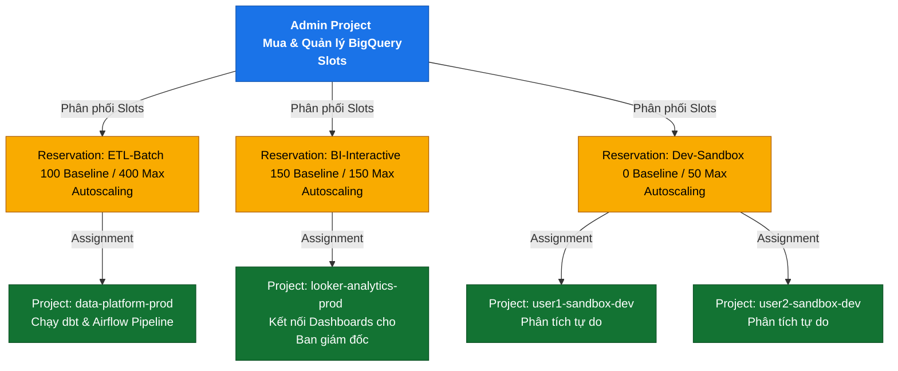

Trong các hệ thống dữ liệu hiện đại, việc quản trị tài nguyên tính toán để cân bằng giữa hiệu năng và chi phí luôn là bài toán đau đầu của các kỹ sư dữ liệu (Data Engineers) và chuyên gia FinOps. Trên nền tảng [Google BigQuery](/concepts/2-storage/cloud-data-platform/google-bigquery), tài nguyên tính toán này được định nghĩa và quản lý dưới dạng **Slots**. Khi quy mô dữ liệu của doanh nghiệp tăng từ mức Gigabytes lên Petabytes, việc chuyển đổi từ mô hình tính phí theo dung lượng quét (On-demand) sang mô hình mua khoán năng lực tính toán (Capacity Pricing) trở thành một bước đi chiến lược quan trọng.

Bài viết này sẽ cung cấp một cái nhìn sâu sắc, toàn diện về cách vận hành của BigQuery Slots, cách thiết lập và quản lý hệ thống phân phối tài nguyên (Reservations), cùng các kỹ thuật tối ưu hóa truy vấn nâng cao giúp cắt giảm chi phí tối đa.

---

## BigQuery Slots là gì & Cơ chế phân bổ của Scheduler

### Định nghĩa BigQuery Slots
**BigQuery Slot** là đơn vị tính toán (computational unit) ảo đại diện cho một lượng tài nguyên CPU, RAM và băng thông mạng được Google Cloud Platform (GCP) phân bổ để thực thi các câu lệnh SQL. Có thể hình dung một slot tương đương với một phần của máy chủ xử lý dữ liệu. Số lượng slot bạn sử dụng càng nhiều, khả năng tính toán song song càng lớn, dẫn đến tốc độ truy vấn càng nhanh.

Khác với các Cloud Data Warehouse truyền thống như [Snowflake](/concepts/2-storage/cloud-data-platform/snowflake) hay Amazon Redshift vốn định hình tài nguyên theo kích thước cụm máy chủ cố định (Virtual Warehouses hoặc Nodes), BigQuery trừu tượng hóa toàn bộ hạ tầng vật lý và quản lý tài nguyên dưới dạng một \"bể chứa\" (pool) các slots dùng chung.

### Cơ chế phân bổ động của Scheduler qua các DAG Stages
Khi một truy vấn SQL được gửi đến BigQuery, nó không chạy trực tiếp dưới dạng một khối lệnh duy nhất mà được phân rã thông qua các bước xử lý sau:

1. **Query Compilation & Optimization**: BigQuery Engine phân tích cú pháp SQL và tạo ra một kế hoạch thực thi tối ưu nhất.
2. **DAG Generation**: Kế hoạch thực thi được biểu diễn dưới dạng một đồ thị có hướng không chu trình (Directed Acyclic Graph - DAG) gồm nhiều giai đoạn (Stages), mỗi giai đoạn chứa nhiều tác vụ (Steps) nhỏ hơn như đọc dữ liệu (Input/Read), lọc và biến đổi (Filter/Project), băm và trộn dữ liệu (Hash/Shuffle), và tổng hợp dữ liệu (Aggregate/Write).
3. **Dynamic Scheduling**: Đây là lúc BigQuery Scheduler (bộ lập lịch) thể hiện sức mạnh. Thay vì gán cứng một số lượng slots cố định cho toàn bộ truy vấn từ đầu đến cuối, Scheduler sẽ cấp phát slots linh hoạt cho từng giai đoạn (Stage) đang hoạt động dựa trên:
   - **Độ lớn dữ liệu đầu vào**: Giai đoạn đọc dữ liệu ban đầu thường cần số lượng slot lớn để quét song song hàng triệu file lưu trữ trên hệ thống Colossus.
   - **Khả năng song song hóa (Parallelizability)**: Các giai đoạn trộn (Shuffle Stage) hoặc gom nhóm kết quả cuối cùng thường bị giới hạn bởi thuật toán và phân phối khóa, do đó Scheduler sẽ tự động giảm số lượng slot để tránh lãng phí.
   - **Tài nguyên trống trong hệ thống**: Nếu có nhiều truy vấn chạy đồng thời, Scheduler áp dụng cơ chế chia sẻ công bằng (Fair Sharing) để đảm bảo không một truy vấn nào chiếm dụng toàn bộ tài nguyên, gây nghẽn hệ thống.

```
[SQL Query] ──> [Optimizer] ──> [DAG of Stages] ──> [Scheduler] ──> [Dynamic Slots Allocation]
                                                           ├── Stage 1: Read & Filter (1000 slots)
                                                           ├── Stage 2: Hash & Shuffle (500 slots)
                                                           └── Stage 3: Aggregate (100 slots)
```

Cơ chế phân bổ động này giúp tối đa hóa hiệu suất sử dụng tài nguyên (Slot Utilization) và giảm thiểu thời gian chờ đợi (Queue Time) của các tác vụ khác.

---

## So sánh các Mô hình giá: On-demand vs Capacity Pricing (Editions)

Để thực hiện [tối ưu hóa chi phí đám mây](/concepts/2-storage/cloud-data-platform/cost-optimization) hiệu quả, bước đầu tiên là hiểu rõ và chọn lựa đúng mô hình tính giá (Pricing Models) của BigQuery. Hiện tại, Google Cloud cung cấp hai phương thức tính chi phí tính toán chính:

### Mô hình On-demand (Trả theo dung lượng quét)
Mô hình mặc định này tính tiền dựa trên **số lượng bytes dữ liệu thực tế được quét** bởi câu lệnh SQL của bạn.
- **Mức giá**: Khoảng \\$6.25 cho mỗi Terabyte (TB) dữ liệu được quét (áp dụng cho khu vực US, giá có thể thay đổi theo Region).
- **Giới hạn**: Dự án của bạn được cấp một hạn mức slot tạm thời (bursting capacity) lên tới tối đa **2,000 slots** để xử lý truy vấn nhanh nhất có thể. Tuy nhiên, giới hạn này không được cam kết (soft limit) và có thể bị ảnh hưởng nếu toàn bộ Data Center của Google đang bị quá tải.
- **Phù hợp với**: Doanh nghiệp có lượng truy vấn không liên tục, dữ liệu nhỏ hoặc đang trong giai đoạn thử nghiệm (Sandbox).

### Mô hình Capacity Pricing (Mua khoán slots qua các Editions)
Từ giữa năm 2023, Google Cloud đã thay thế mô hình Flat-rate cũ bằng hệ thống **BigQuery Editions** với ba phân cấp dịch vụ chính:

| Đặc tính | Standard Edition | Enterprise Edition | Enterprise Plus Edition |
| :--- | :--- | :--- | :--- |
| **Giá cơ bản (mỗi slot-hour)** | ~\\$0.04 | ~\\$0.06 | ~\\$0.10 |
| **Tính năng tự động co giãn (Autoscaling)** | Có | Có | Có |
| **Phân vùng tài nguyên (Reservations)** | Không hỗ trợ | Có hỗ trợ | Có hỗ trợ |
| **Chia sẻ slot rảnh (Idle Slot Sharing)** | Không hỗ trợ | Có hỗ trợ | Có hỗ trợ |
| **Tính năng nâng cao** | Phù hợp truy vấn cơ bản | Hỗ trợ VPC-SC, dbt, BI | Bảo mật tối đa (CMEK), Disaster Recovery |

### Cách tính điểm giao thoa để chuyển đổi mô hình (Inflection Point)
Để xác định thời điểm doanh nghiệp nên chuyển từ On-demand sang Capacity Pricing (Editions), chúng ta cần thực hiện phân tích tài chính dựa trên dữ liệu lịch sử từ bộ giám sát chi phí (Information Schema).

Giả sử doanh nghiệp đang cân nhắc chuyển sang **Enterprise Edition** với giá thuê cam kết là **\\$0.06 / slot-hour** (khoảng \\$43.8 / slot-month cho 1 slot chạy liên tục 730 giờ).

**Công thức tính toán cơ bản:**

$$\text{Chi phí On-demand hàng tháng} = \text{Dung lượng quét (TB)} \times \$6.25$$

$$\text{Chi phí Capacity hàng tháng} = \text{Số lượng Slots cam kết} \times \$43.8 + \text{Chi phí Autoscaling phát sinh}$$

**Ví dụ thực tế:**
Doanh nghiệp quét trung bình **800 TB** dữ liệu mỗi tháng dưới dạng On-demand.
- Chi phí On-demand: \\$800 \times \$6.25 = \$5,000 / \text{tháng}$.
- Nếu chuyển sang mua một gói **Enterprise Edition Reservation** cố định tối thiểu **100 slots** (đáp ứng 80% nhu cầu công việc hàng ngày):
  - Chi phí cố định: \\$100 \text{ slots} \times \$43.8 = \$4,380 / \text{tháng}$.
  - Nếu hệ thống tự động tăng quy mô (autoscaling) thêm tối đa 100 slots nữa trong các khung giờ cao điểm (giả sử chạy hết công suất 2 giờ mỗi ngày):
    - Chi phí Autoscaling: \\$100 \text{ slots} \times 2 \text{ giờ} \times 30 \text{ ngày} \times \$0.06 = \$360$.
  - Tổng chi phí Capacity ước tính: $\$4,380 + \$360 = \$4,740 / \text{tháng}$.

Trong kịch bản này, doanh nghiệp tiết kiệm được **\\$260 / tháng** và quan trọng hơn là có được sự kiểm soát tài chính tuyệt đối nhờ thiết lập giới hạn slot trần (hard limit), loại bỏ hoàn toàn rủi ro một câu truy vấn tồi vô tình quét qua hàng chục Terabytes làm tăng vọt hóa đơn đột biến.

---

## Chiến lược phân bổ Slot & Phân vùng Workloads

Khi áp dụng mô hình Capacity, việc quản lý và phân chia tài nguyên là chìa khóa để đảm bảo chất lượng dịch vụ (SLA) cho từng phòng ban và ứng dụng khác nhau.

### Baseline Slots vs Autoscaling Slots
Khi tạo một **Reservation**, bạn có hai thông số cần cấu hình:
- **Baseline Slots**: Số lượng tài nguyên tính toán luôn được cấp phát cứng và chạy thường trực. Bạn sẽ bị tính phí cho số lượng slot này 24/7 bất kể có truy vấn chạy hay không.
- **Autoscaling Slots**: Số lượng tài nguyên dự phòng tối đa mà BigQuery được phép tự động mở rộng khi nhu cầu tính toán tăng cao đột biến. Tài nguyên này chỉ được tính phí theo từng giây thực tế sử dụng.

> [!TIP]
> Một chiến lược tối ưu là đặt **Baseline Slots** ở mức tải nền (thấp nhất trong ngày) và cấu hình **Autoscaling Slots** để xử lý các đỉnh tải (peaks) phát sinh khi chạy báo cáo đầu ngày hoặc chạy ETL cuối ngày.

### Phân vùng Workloads thông qua Reservations và Assignments
Để tránh tình trạng xung đột tài nguyên giữa các tác vụ phân tích nặng (Batch ETL) và các báo cáo tương tác trực tiếp (Interactive BI), bạn nên tạo cấu trúc phân vùng tài nguyên rõ ràng:

1. **Reservation cho ETL**: Cấp phát tài nguyên cho các công cụ như dbt, Airflow, Spark. Nhóm này thường chấp nhận độ trễ nhất định nhưng đòi hỏi năng lực xử lý lượng dữ liệu khổng lồ.
2. **Reservation cho BI/Ad-hoc**: Dành riêng cho các công cụ trực quan hóa dữ liệu như Looker, Tableau, PowerBI và các nhà phân tích dữ liệu viết truy vấn trực tiếp. Nhóm này yêu cầu phản hồi tức thời (sub-second đến vài giây) nên cần được cô lập tài nguyên để tránh bị ETL chiếm dụng slots.
3. **Cơ chế Idle Slot Sharing (Chia sẻ slot rảnh)**: Khi Reservation ETL đang rảnh rỗi (ví dụ: ban ngày không có batch job nào chạy), các slots này sẽ tự động được chuyển sang cho Reservation BI mượn tạm thời. Ngay khi có job ETL xuất hiện, Scheduler sẽ thu hồi lại tài nguyên ngay lập tức mà không gây gián đoạn cho cả hai bên.

---

## Sơ đồ Phân bổ Slot (Reservation Hierarchy)

Dưới đây là sơ đồ cấu trúc phân tầng tài nguyên từ dự án quản trị (Admin Project) xuống các Reservations cụ thể và gán cho các dự án nghiệp vụ (Workload Projects) trong doanh nghiệp:



---

## Các mẫu Tối ưu hóa Truy vấn nâng cao

Dù sử dụng mô hình giá nào, việc thực hành viết code SQL chuẩn mực luôn là biện pháp cốt lõi để nâng cao hiệu năng và cắt giảm chi phí.

### Partition Pruning (Lọc phân vùng hiệu quả)
Khi tạo các bảng lớn, hãy luôn thiết lập phân vùng (Partitioning) theo các trường thời gian (`TIMESTAMP`, `DATE`) hoặc trường số nguyên (`INTEGER`). Khi truy vấn, hãy chắc chắn sử dụng bộ lọc `WHERE` để loại bỏ các phân vùng không cần thiết (Partition Pruning).

```sql
-- KHÔNG TỐT: Quét toàn bộ bảng lịch sử giao dịch
SELECT user_id, sum(amount)
FROM `my-project.analytics.transactions`
WHERE FORMAT_DATE('%Y-%m', transaction_date) = '2026-06';

-- TỐT HƠN: BigQuery nhận biết được phân vùng trực tiếp từ cột transaction_date
SELECT user_id, sum(amount)
FROM `my-project.analytics.transactions`
WHERE transaction_date BETWEEN '2026-06-01' AND '2026-06-30';
```

### Cluster-based Indexing (Phân cụm dữ liệu)
Phân cụm (Clustering) giúp sắp xếp thứ tự vật lý của dữ liệu trên đĩa dựa trên tối đa 4 cột thường xuyên được sử dụng để lọc (`WHERE`) hoặc gom nhóm (`GROUP BY`). Khác với Partitioning, Clustering hoạt động hiệu quả ngay cả trên các cột có độ phân tán cao (cardinality lớn) như `customer_id` hoặc `product_code`.

### Materialized Views (Bảng ảo vật lý hóa)
Với các bảng tổng hợp báo cáo (Aggregated Reports) được truy vấn liên tục bởi BI, hãy sử dụng **Materialized Views**. BigQuery sẽ tự động tính toán trước các biểu thức tổng hợp này dưới nền và lưu trữ chúng. Khi người dùng chạy một truy vấn SQL thông thường, BigQuery Smart Query Optimizer sẽ tự động chuyển hướng câu lệnh sang đọc trực tiếp từ Materialized View mà không cần quét lại bảng gốc, giúp tiết kiệm đáng kể slot time.

### Query Dry Runs (Chạy thử nghiệm ước lượng)
Trước khi khởi chạy một câu truy vấn lớn hoặc triển khai một script tự động, hãy kích hoạt tùy chọn **Dry Run** (thông qua CLI `bq query --dry_run` hoặc trên giao diện Web UI). Thao tác này hoàn toàn miễn phí và trả về chính xác số lượng dữ liệu sẽ bị quét, giúp bạn ngăn chặn những câu truy vấn tồi hủy hoại ví tiền doanh nghiệp.

### Phân tích Kế hoạch Thực thi (Execution Plan Analysis)
Khi điều tra hiệu năng của một truy vấn chạy chậm, hãy phân tích kỹ hai chỉ số:
- **Elapsed Time**: Thời gian thực tế trôi qua từ lúc bấm chạy đến lúc nhận kết quả (Wall-clock time).
- **Slot Time**: Tổng thời gian tích lũy của tất cả các slots tham gia xử lý câu truy vấn (Slot-seconds hoặc Slot-hours).

> $\text{Slot Time} = \text{Average Slots Used} \times \text{Elapsed Time}$

Nếu câu truy vấn có **Slot Time** rất lớn (ví dụ: 10 slot-hours) nhưng **Elapsed Time** rất ngắn (ví dụ: 18 giây), điều này chứng tỏ truy vấn đã tận dụng khả năng tính toán song song cực kỳ tốt từ hàng ngàn slots của BigQuery. Ngược lại, nếu **Elapsed Time** rất dài nhưng **Slot Time** thấp, hệ thống có thể đang gặp tình trạng xếp hàng chờ cấp phát tài nguyên (Queue Time) hoặc bị nghẽn cổ chai ghi kết quả cuối cùng (Serialization bottlenecks).

---

## Điểm mạnh (Pros) và Điểm yếu (Cons)

Khi chuyển dịch từ mô hình On-demand sang quản lý tài nguyên theo cụm Slots (Capacity Pricing), doanh nghiệp cần đánh giá kỹ lưỡng hai mặt của vấn đề:

### Điểm mạnh (Pros)
- **Kiểm soát chi phí cố định (Cost Predictability)**: Giúp ngân sách CNTT hàng tháng của doanh nghiệp luôn nằm trong tầm kiểm soát, không bị biến động theo lượng truy vấn của người dùng cuối.
- **Tùy biến tài nguyên linh hoạt**: Khả năng gán các mức ưu tiên tài nguyên khác nhau cho từng phòng ban thông qua cơ chế tạo các Reservation riêng biệt.
- **Hiệu năng nhất quán cho các tác vụ quan trọng**: Cam kết số lượng Baseline Slots tối thiểu giúp các dashboard quan trọng của doanh nghiệp không bao giờ bị chậm do tranh chấp tài nguyên với các tác vụ khác.
- **Tiết kiệm chi phí ở quy mô lớn**: Khi tổng dung lượng quét dữ liệu hàng tháng vượt ngưỡng điểm giao thoa tài chính (Inflection Point), Capacity Pricing đem lại ROI tốt hơn rõ rệt.

### Điểm yếu (Cons)
- **Đòi hỏi năng lực vận hành cao**: Đội ngũ kỹ sư dữ liệu phải chủ động theo dõi và điều chỉnh cấu hình Baseline/Autoscaling slots liên tục để tránh lãng phí tài nguyên hoặc gây nghẽn hệ thống.
- **Lãng phí tài nguyên khi nhàn rỗi**: Nếu cấu hình Baseline quá cao mà không có các tác vụ sử dụng, doanh nghiệp vẫn phải trả tiền cho phần tài nguyên nhàn rỗi đó (mặc dù có thể giảm thiểu bằng cơ chế chia sẻ idle slot).
- **Độ trễ khởi động của Autoscaling**: Quá trình tự động co giãn (autoscaling) của BigQuery cần một khoảng thời gian ngắn (vài chục giây đến vài phút) để cấp phát thêm slots mới, có thể gây ra độ trễ nhẹ cho các truy vấn phát sinh đột xuất.

---

## Khi nào nên dùng

Để đưa ra quyết định đúng đắn cho doanh nghiệp của bạn, hãy tham khảo các tình huống thực tế dưới đây:

### Khi nào nên dùng mô hình On-demand (hoặc không nên dùng Capacity):
- Doanh nghiệp mới bắt đầu xây dựng kho dữ liệu đám mây, quy mô dữ liệu lưu trữ dưới 10 TB.
- Tần suất chạy truy vấn không liên tục (ví dụ: chỉ chạy báo cáo vào cuối tuần hoặc cuối tháng).
- Không có nhân sự chuyên trách quản trị hệ thống và tối ưu hóa tài nguyên (No dedicated Data Platform Team).

### Khi nào nên dùng mô hình Capacity (Editions & Reservations):
- Hóa đơn BigQuery On-demand hàng tháng vượt quá ngưỡng \\$4,000 - \\$5,000 một cách thường xuyên.
- Có các cam kết chặt chẽ về mặt thời gian phản hồi (SLA) đối với các ứng dụng BI và Dashboards của doanh nghiệp.
- Cần cô lập tài nguyên tính toán giữa môi trường Production (ETL/Reporting) và môi trường Phát triển/Thử nghiệm (Sandbox/Data Science).
- Doanh nghiệp áp dụng quy trình FinOps nghiêm ngặt, yêu cầu dự báo và phân bổ chi phí BigQuery chính xác đến từng phòng ban hàng tháng.

---

## Trọng tâm ôn luyện phỏng vấn

Dưới đây là một số câu hỏi phỏng vấn thường gặp dành cho vị trí Senior Data Engineer hoặc Cloud Architect liên quan đến BigQuery Slot Management và cách trả lời chuẩn xác nhất:

### Q1: BigQuery Slots hoạt động như thế nào trong cơ chế Fair Sharing khi có nhiều truy vấn chạy đồng thời trong cùng một Reservation?
**Trả lời:**
Khi nhiều truy vấn chạy đồng thời trong một Reservation, BigQuery Scheduler áp dụng thuật toán chia sẻ công bằng (Fair Sharing). Ban đầu, tổng số slots khả dụng trong Reservation sẽ được chia đều cho các truy vấn đang hoạt động. Ví dụ, nếu Reservation có 200 slots và có 2 truy vấn chạy cùng lúc, mỗi truy vấn sẽ được cấp tối đa 100 slots. 

Tuy nhiên, cơ chế này hoạt động động ở cấp độ giai đoạn (Stage). Nếu một truy vấn bước vào giai đoạn ít cần song song hóa hơn (chỉ cần 20 slots), Scheduler sẽ lập tức thu hồi 80 slots dư thừa và cấp phát chúng cho câu truy vấn còn lại đang cần tài nguyên để quét dữ liệu. Khi một truy vấn kết thúc, tài nguyên của nó ngay lập tức được giải phóng và phân phối lại cho các truy vấn còn lại trong hàng đợi.

### Q2: Sự khác biệt lớn nhất giữa Enterprise Edition và Enterprise Plus Edition của BigQuery là gì? Khi nào tôi thực sự cần Enterprise Plus?
**Trả lời:**
Sự khác biệt lớn nhất nằm ở **tính năng bảo mật nâng cao**, **khả năng tuân thủ pháp lý** và **độ tin cậy hạ tầng**.
- **Enterprise Edition**: Cung cấp đầy đủ các tính năng tối ưu hóa chi phí như Autoscaling, Reservations, Idle Slot Sharing và bảo mật cơ bản (VPC Service Controls).
- **Enterprise Plus Edition**: Bổ sung thêm các tính năng cao cấp như:
  - Khóa mã hóa tự quản lý bởi khách hàng (Customer-Managed Encryption Keys - CMEK).
  - Khả năng khắc phục sự cố sau thảm họa đa vùng (Multi-region Disaster Recovery) với RTO/RPO tối thiểu.
  - Tuân thủ các tiêu chuẩn bảo mật khắt khe nhất của ngành tài chính/y tế như FedRAMP High, HIPAA, PCI-DSS.
  
Doanh nghiệp chỉ thực sự cần nâng cấp lên **Enterprise Plus** khi hoạt động trong các lĩnh vực có quy định pháp lý nghiêm ngặt về dữ liệu (Ngân hàng, Fintech, Y tế) hoặc yêu cầu hệ thống kho dữ liệu phải duy trì tính sẵn sàng cực cao trên phạm vi toàn cầu.

### Q3: Tại sao một câu truy vấn có dung lượng quét (bytes billed) rất nhỏ nhưng lại sử dụng một lượng slot-seconds khổng lồ? Làm thế nào để khắc phục?
**Trả lời:**
Hiện tượng này thường xảy ra khi câu truy vấn có khối lượng tính toán cực kỳ phức tạp mặc dù dữ liệu đầu vào nhỏ. Các nguyên nhân phổ biến bao gồm:
1. **Phép toán Cross Join (Cartesian Product)**: Tạo ra hàng triệu tổ hợp dòng dữ liệu ở các stage trung gian, khiến các slots phải hoạt động liên tục để tính toán kết quả.
2. **Lạm dụng các hàm User-Defined Functions (UDFs)** hoặc các biểu thức chính quy (`REGEXP`) phức tạp trên tập dữ liệu lớn.
3. **Hiện tượng lệch dữ liệu (Data Skew)**: Khi thực hiện gom nhóm (`GROUP BY`) hoặc kết nối (`JOIN`) trên một khóa có phân phối dữ liệu không đều (ví dụ: 90% dòng dữ liệu có cùng một giá trị khóa). Một số lượng nhỏ slots chứa khóa đó sẽ bị quá tải và phải làm việc lâu hơn rất nhiều so với các slots khác, làm kéo dài tổng thời gian chạy và tăng vọt slot-seconds.
  
**Cách khắc phục:**
- Thay thế các phép toán `CROSS JOIN` bằng các điều kiện kết nối rõ ràng.
- Tối ưu hóa các biểu thức regex hoặc chuyển đổi UDFs sang các hàm built-in của BigQuery vốn được tối ưu hóa ở tầng C++.
- Xử lý Data Skew bằng cách lọc bỏ các giá trị null/mặc định trước khi thực hiện `JOIN` hoặc sử dụng kỹ thuật phân tách khóa (key salting).

---

## English Summary

### Overview of BigQuery Slot Management and Cost Optimization
BigQuery Slots are the virtual execution units (composed of CPU, RAM, and networking) that power SQL query execution. This guide details how the BigQuery Dynamic Scheduler allocates slots dynamically across execution stages based on query DAG complexity and workload demands.

### Key Takeaways:
- **Pricing Models**: Transitioning from On-demand (\\$6.25/TB scanned) to Capacity Pricing (BigQuery Editions: Standard, Enterprise, Enterprise Plus) is a strategic move for organizations looking to ensure budget predictability. The financial inflection point can be calculated by comparing historical scan volumes against slot-hour commitment costs.
- **Resource Isolation**: Utilizing **Reservations** allows organizations to partition slots among different workloads (e.g., dedicating a pool to interactive Looker dashboards while isolating heavy batch ETL jobs). The **Idle Slot Sharing** mechanism ensures that unused capacity from one reservation is dynamically borrowed by active workloads, avoiding resource waste.
- **Optimization Techniques**: Implementing partition pruning, clustering, materialized views, and dry runs directly reduces both billing metrics (bytes scanned under On-demand, and slot-seconds under Capacity models).
- **Monitoring**: Performance troubleshooting should focus on the relationship between **Slot Time** (accumulated compute time) and **Elapsed Time** (wall-clock duration) to identify serialization bottlenecks or data skew.

---

## Xem thêm các khái niệm liên quan
* [Amazon Redshift](/concepts/2-storage/cloud-data-platform/amazon-redshift/)
* [Azure Synapse Analytics](/concepts/2-storage/cloud-data-platform/azure-synapse/)
* [Google BigQuery Optimization & Storage Write API](/concepts/2-storage/cloud-data-platform/bigquery-optimization/)

## Tài liệu tham khảo

Dưới đây là các tài liệu hướng dẫn chính thức từ Google Cloud và các tổ chức uy tín về FinOps giúp bạn nghiên cứu sâu hơn về quản lý BigQuery Slots:

1. [Google Cloud BigQuery: Introduction to slots](https://cloud.google.com/bigquery/docs/slots-intro) - Tài liệu chính thức từ GCP giải thích chi tiết khái niệm và kiến trúc phân bổ slot của BigQuery.
2. [Google Cloud BigQuery: Workload management using reservations](https://cloud.google.com/bigquery/docs/reservations-intro) - Hướng dẫn thiết lập Reservations, phân bổ tài nguyên và cơ chế chia sẻ slot rảnh.
3. [Google Cloud BigQuery: Understanding billing and pricing models](https://cloud.google.com/bigquery/pricing) - Chi tiết bảng giá các phiên bản BigQuery Editions (Standard, Enterprise, Enterprise Plus).
4. [Google Cloud BigQuery: Optimize query performance for compute capacity](https://cloud.google.com/bigquery/docs/best-practices-performance-compute) - Hướng dẫn chi tiết các kỹ thuật tối ưu hóa truy vấn nâng cao nhằm giảm thiểu số lượng slot-seconds tiêu thụ.
5. [FinOps Foundation: Cloud Rate Optimization and BigQuery Cost Control](https://www.finops.org/framework/practices/cloud-rate-optimization/) - Khung hướng dẫn tối ưu hóa chi phí từ tổ chức FinOps toàn cầu áp dụng cho kho dữ liệu đám mây.
6. [AWS Redshift Concurrency Scaling vs BigQuery Slots](https://docs.aws.amazon.com/redshift/latest/dg/concurrency-scaling.html) - So sánh cơ chế tự động co giãn tài nguyên tính toán giữa AWS Redshift và BigQuery.
