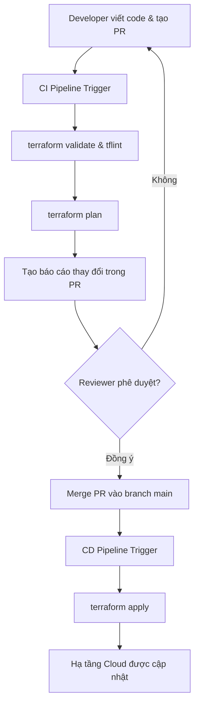

## Giới thiệu về IaC trong Kỷ nguyên Data Engineering

Trong kỷ nguyên Big Data và Cloud Computing, hạ tầng của một nền tảng dữ liệu không còn là những máy chủ vật lý đặt trong phòng server của doanh nghiệp. Thay vào đó, nó bao gồm hàng chục dịch vụ đám mây kết nối với nhau: từ [Cloud Storage](/concepts/2-storage/cloud-data-platform/cloud-storage) làm Data Lake, [Google BigQuery](/concepts/2-storage/cloud-data-platform/google-bigquery) làm Data Warehouse, cho đến các dịch vụ [Serverless Data Platform](/concepts/2-storage/cloud-data-platform/serverless-data) như AWS Glue, Google Cloud Run để chạy các pipeline ETL/ELT.

Nếu quản lý các tài nguyên này bằng cách click chọn thủ công trên giao diện web (thường gọi là "ClickOps"), Data Engineer sẽ nhanh chóng đối mặt với hàng loạt vấn đề:
1. **Thiếu tính nhất quán**: Rất khó để tái tạo chính xác môi trường Development sang Staging và Production.
2. **Không thể theo dõi lịch sử**: Ai đã thay đổi quyền truy cập của một bảng dữ liệu vào tuần trước? Không có Git log để đối chứng.
3. **Rủi ro bảo mật**: Cấu hình sai quyền IAM, mở public bucket S3, hoặc quên xóa tài nguyên thử nghiệm gây lãng phí chi phí.

**Infrastructure as Code (IaC)** ra đời như một phương thức quản lý hạ tầng hiện đại. Và trong các công cụ IaC, **HashiCorp Terraform** là tiêu chuẩn công nghiệp (de-facto standard) nhờ khả năng hỗ trợ đa đám mây (multi-cloud), kiến trúc khai báo (declarative) và cộng đồng phát triển mạnh mẽ.

---

## Tầm quan trọng của IaC đối với Modern Data Platform

### 1. Ngăn chặn trôi lệch cấu hình (Preventing Environment Drift)
Khi xây dựng hạ tầng dữ liệu, việc đồng nhất giữa các môi trường (Dev, Staging, Prod) là vô cùng quan trọng. Trôi lệch cấu hình (Environment Drift) xảy ra khi có ai đó sửa đổi trực tiếp tài nguyên trên Cloud Console mà không đồng bộ lại mã nguồn. Ví dụ, một pipeline Spark chạy thành công trên Dev nhưng thất bại trên Prod do schema của AWS Glue Catalog Database khác nhau, hoặc do IAM Role trên Prod thiếu quyền ghi vào S3. Terraform giải quyết triệt để điều này bằng cách biểu diễn toàn bộ hạ tầng dưới dạng mã nguồn duy nhất.

### 2. Quản lý phiên bản hạ tầng dữ liệu (Version-Controlling Data Resources)
Bằng cách lưu trữ mã nguồn Terraform trên Git, toàn bộ tài nguyên dữ liệu như bảng BigQuery, bucket S3, hay lịch trình chạy Glue Job đều được phiên bản hóa. Mọi thay đổi đều được thực hiện qua Pull Request (PR), giúp cả đội ngũ kiểm tra (review) được thiết kế hạ tầng, phân quyền truy cập, và [tối ưu hóa chi phí](/concepts/2-storage/cloud-data-platform/cost-optimization) trước khi đưa vào vận hành.

### 3. Tự động hóa kiểm thử và triển khai qua CI/CD (Automating CI/CD Deployments)
Với IaC, hạ tầng dữ liệu của bạn có thể được triển khai tự động. Quy trình CI/CD tích hợp Terraform giúp kiểm thử cấu hình (validate), dự báo các thay đổi (plan), và tự động cập nhật hạ tầng (apply) ngay khi code được merge vào branch chính thức.

---

## Kiến trúc Terraform CI/CD Workflow cho Data Platform

Dưới đây là sơ đồ mô tả luồng tự động hóa CI/CD tiêu chuẩn từ lúc Data Engineer viết code Terraform cho đến khi hạ tầng dữ liệu được cập nhật trên Cloud:



Quy trình này đảm bảo không có bất kỳ thay đổi đơn phương nào được thực hiện trực tiếp trên môi trường Production mà không qua kiểm duyệt và ghi nhận lịch sử.

---

## Quản lý State an toàn (Secure State Management)

Terraform ghi nhớ trạng thái của hạ tầng thực tế thông qua một file gọi là `terraform.tfstate`. File này chứa toàn bộ thông tin chi tiết về các tài nguyên đã tạo, bao gồm cả các thông tin nhạy cảm như mật khẩu cơ sở dữ liệu, IAM Access Keys. Do đó, **tuyệt đối không bao giờ được commit file state này lên Git**.

Để quản lý state an toàn trong môi trường doanh nghiệp lớn, chúng ta cần:
1. **Remote Backend**: Lưu trữ state tập trung trên Cloud Storage (AWS S3 hoặc GCP GCS) với tính năng mã hóa (encryption-at-rest) và phân quyền truy cập nghiêm ngặt.
2. **State Locking**: Khóa state khi có một phiên deploy đang chạy để ngăn chặn tình trạng hai pipeline hoặc hai kỹ sư cùng chạy `terraform apply` đồng thời, tránh làm hỏng file state.

### Cấu hình Backend cho AWS (S3 & DynamoDB State Lock)

Dưới đây là cấu hình hoàn chỉnh để lưu trữ State trên AWS S3 và khóa state thông qua AWS DynamoDB:

```hcl
# backend.tf
terraform {
  required_version = ">= 1.5.0"
  
  required_providers {
    aws = {
      source  = "hashicorp/aws"
      version = "~> 5.0"
    }
  }

  backend "s3" {
    bucket         = "my-company-terraform-state-prod"
    key            = "data-platform/state/terraform.tfstate"
    region         = "ap-southeast-1"
    encrypt        = true
    dynamodb_table = "my-company-terraform-lock-prod"
  }
}

provider "aws" {
  region = "ap-southeast-1"
}
```

### Cấu hình Backend cho GCP (Google Cloud Storage)

Đối với Google Cloud, GCS hỗ trợ tính năng State Locking gốc (native) nên bạn không cần đến một dịch vụ ngoài như DynamoDB:

```hcl
# backend-gcp.tf
terraform {
  required_version = ">= 1.5.0"

  required_providers {
    google = {
      source  = "hashicorp/google"
      version = "~> 5.0"
    }
  }

  backend "gcs" {
    bucket = "my-company-terraform-state-prod"
    prefix = "data-platform/state"
  }
}

provider "google" {
  project = "my-gcp-project-id"
  region  = "asia-southeast1"
}
```

---

## Thực hành: Triển khai Hạ tầng Dữ liệu với Terraform

### 1. Cấu hình Cloud Storage (AWS S3) làm Data Lake với Lifecycle Rules

Trong Data Lake, dữ liệu thường được phân vùng thành các Layer: **Raw (Bronze)**, **Cleaned (Silver)**, và **Curated (Gold)**. Để tối ưu hóa chi phí, dữ liệu cũ tại Raw Zone ít khi được truy vấn cần được chuyển xuống các lớp lưu trữ rẻ hơn như Glacier Instant Retrieval hoặc Glacier Deep Archive.

Dưới đây là file HCL tạo bucket S3 cho Raw Zone, thiết lập chặn truy cập công khai (block public access), kích hoạt mã hóa và cấu hình vòng đời (lifecycle):

```hcl
# s3_datalake.tf

resource "aws_s3_bucket" "raw_zone" {
  bucket        = "my-company-datalake-raw-prod"
  force_destroy = false # Đảm bảo không vô tình xóa mất dữ liệu lịch sử
}

# 1. Kích hoạt Versioning để khôi phục khi lỡ xóa nhầm
resource "aws_s3_bucket_versioning" "raw_versioning" {
  bucket = aws_s3_bucket.raw_zone.id
  versioning_configuration {
    status = "Enabled"
  }
}

# 2. Bắt buộc mã hóa dữ liệu tại chỗ (Server-Side Encryption)
resource "aws_s3_bucket_server_side_encryption_configuration" "raw_encryption" {
  bucket = aws_s3_bucket.raw_zone.id

  rule {
    apply_server_side_encryption_by_default {
      sse_algorithm = "AES256"
    }
  }
}

# 3. Chặn hoàn toàn quyền truy cập công khai từ Internet
resource "aws_s3_bucket_public_access_block" "raw_public_block" {
  bucket = aws_s3_bucket.raw_zone.id

  block_public_acls       = true
  block_public_policy     = true
  ignore_public_acls      = true
  restrict_public_buckets = true
}

# 4. Cấu hình Lifecycle Rule chuyển dữ liệu sang Glacier sau 90 ngày
resource "aws_s3_bucket_lifecycle_configuration" "raw_lifecycle" {
  bucket = aws_s3_bucket.raw_zone.id

  rule {
    id     = "archive-old-raw-data"
    status = "Enabled"

    # Chuyển đổi dữ liệu sau 90 ngày sang Glacier Deep Archive
    transition {
      days          = 90
      storage_class = "GLACIER_DEEP_ARCHIVE"
    }

    # Tự động dọn dẹp các noncurrent versions cũ sau 180 ngày
    noncurrent_version_transition {
      noncurrent_days = 90
      storage_class   = "GLACIER_DEEP_ARCHIVE"
    }

    noncurrent_version_expiration {
      noncurrent_days = 180
    }
  }
}
```

### 2. Cấu hình BigQuery (GCP) Datasets & Tables với Partitioning & Clustering

Trong GCP, Google BigQuery là trung tâm của Modern Data Stack. Để tối ưu hóa chi phí truy vấn SQL và cải thiện hiệu năng, chúng ta cần cấu hình Partitioning (ví dụ: phân vùng theo cột ngày) và Clustering (ví dụ: gom cụm theo ID khách hàng hoặc loại sự kiện).

```hcl
# bigquery.tf

# Khởi tạo BigQuery Dataset đại diện cho lớp Gold (Curated Zone)
resource "google_bigquery_dataset" "gold_analytics" {
  dataset_id                  = "gold_analytics"
  friendly_name               = "Gold Analytics Dataset"
  description                 = "Chứa dữ liệu đã tổng hợp phục vụ cho việc BI Report và Machine Learning"
  location                    = "asia-southeast1" # Singapore
  default_table_expiration_ms = null               # Giữ dữ liệu vĩnh viễn

  labels = {
    env      = "production"
    owner    = "data_team"
    critical = "true"
  }
}

# Khởi tạo bảng dữ liệu có phân vùng và gom cụm
resource "google_bigquery_table" "user_transactions" {
  dataset_id          = google_bigquery_dataset.gold_analytics.dataset_id
  table_id            = "user_transactions"
  deletion_protection = true # Chống vô tình chạy terraform destroy làm mất bảng dữ liệu quan trọng

  # Định nghĩa phân vùng theo ngày của giao dịch
  time_partitioning {
    type  = "DAY"
    field = "transaction_date"
  }

  # Gom cụm theo mã khách hàng và mã chi nhánh để tối ưu truy vấn filter/join
  clustering = ["user_id", "branch_id"]

  # Định nghĩa Schema của bảng dưới dạng JSON
  schema = <<EOF
[
  {
    "name": "transaction_id",
    "type": "STRING",
    "mode": "REQUIRED",
    "description": "Mã định danh duy nhất của giao dịch"
  },
  {
    "name": "user_id",
    "type": "STRING",
    "mode": "REQUIRED",
    "description": "Mã định danh người dùng"
  },
  {
    "name": "branch_id",
    "type": "STRING",
    "mode": "NULLABLE",
    "description": "Mã chi nhánh thực hiện giao dịch"
  },
  {
    "name": "amount",
    "type": "NUMERIC",
    "mode": "REQUIRED",
    "description": "Giá trị giao dịch"
  },
  {
    "name": "transaction_date",
    "type": "DATE",
    "mode": "REQUIRED",
    "description": "Ngày xảy ra giao dịch"
  },
  {
    "name": "created_at",
    "type": "TIMESTAMP",
    "mode": "REQUIRED",
    "description": "Thời gian hệ thống ghi nhận giao dịch"
  }
]
EOF
}
```

### 3. Cấu hình IAM Role & Policy theo Nguyên lý Đặc quyền Tối thiểu (Least-Privilege)

Khi xây dựng Data Pipeline (ví dụ: dùng AWS Glue hoặc một công cụ ETL chạy trên Kubernetes), pipeline đó cần quyền đọc dữ liệu từ Raw S3 Bucket và ghi kết quả vào Cleaned S3 Bucket. Chúng ta không được phép cấp quyền Admin, thay vào đó là quyền đọc/ghi giới hạn chuẩn xác.

```hcl
# iam_pipeline.tf

# 1. Định nghĩa Trust Policy cho phép AWS Glue Service Assume Role này
data "aws_iam_policy_document" "glue_assume_role" {
  statement {
    actions = ["sts:AssumeRole"]

    principals {
      type        = "Service"
      identifiers = ["glue.amazonaws.com"]
    }
  }
}

# 2. Khởi tạo IAM Role
resource "aws_iam_role" "etl_pipeline_role" {
  name               = "etl-pipeline-execution-role"
  assume_role_policy = data.aws_iam_policy_document.glue_assume_role.json
  description        = "IAM Role dành riêng cho ETL pipeline AWS Glue để xử lý dữ liệu từ Raw sang Cleaned"
}

# 3. Định nghĩa Policy chỉ cho phép đọc từ raw bucket và ghi vào cleaned bucket
data "aws_iam_policy_document" "etl_s3_permissions" {
  # Quyền đọc từ Raw Bucket
  statement {
    actions = [
      "s3:GetObject",
      "s3:ListBucket"
    ]
    resources = [
      "arn:aws:s3:::my-company-datalake-raw-prod",
      "arn:aws:s3:::my-company-datalake-raw-prod/*"
    ]
  }

  # Quyền đọc/ghi vào Cleaned Bucket
  statement {
    actions = [
      "s3:GetObject",
      "s3:PutObject",
      "s3:ListBucket",
      "s3:DeleteObject"
    ]
    resources = [
      "arn:aws:s3:::my-company-datalake-cleaned-prod",
      "arn:aws:s3:::my-company-datalake-cleaned-prod/*"
    ]
  }

  # Quyền ghi Logs vào CloudWatch để phục vụ debug và monitor
  statement {
    actions = [
      "logs:CreateLogGroup",
      "logs:CreateLogStream",
      "logs:PutLogEvents"
    ]
    resources = [
      "arn:aws:logs:*:*:*"
    ]
  }
}

# 4. Khởi tạo IAM Policy từ tài liệu mô tả trên
resource "aws_iam_policy" "etl_policy" {
  name        = "etl-pipeline-s3-policy"
  description = "Chỉ cho phép đọc dữ liệu raw và ghi dữ liệu cleaned phục vụ ETL pipeline"
  policy      = data.aws_iam_policy_document.etl_s3_permissions.json
}

# 5. Gắn Policy vào Role tương ứng
resource "aws_iam_role_policy_attachment" "attach_etl_policy" {
  role       = aws_iam_role.etl_pipeline_role.name
  policy_arn = aws_iam_policy.etl_policy.arn
}
```

---

## Tự động hóa CI/CD cho Terraform qua GitHub Actions

Để tự động hóa hoàn toàn việc kiểm thử và triển khai Terraform, chúng ta có thể sử dụng GitHub Actions. Luồng tự động hóa bao gồm hai giai đoạn:

### Giai đoạn 1: Chạy trên các Pull Request (CI)
* Thực hiện kiểm tra định dạng (`terraform fmt`).
* Khởi tạo thư mục làm việc và tải các provider cần thiết (`terraform init`).
* Kiểm tra cú pháp lỗi (`terraform validate`).
* Tạo dự báo thay đổi hạ tầng (`terraform plan`) và bình luận trực tiếp vào PR.

### Giai đoạn 2: Chạy trên branch main sau khi merge (CD)
* Thực thi thay đổi trực tiếp lên hạ tầng cloud (`terraform apply`).

Dưới đây là file cấu hình GitHub Action YAML chi tiết:

```yaml
# .github/workflows/terraform.yml
name: "Terraform CI/CD"

on:
  push:
    branches:
      - main
  pull_request:
    branches:
      - main

permissions:
  id-token: write # Cần thiết để xác thực OIDC với AWS/GCP
  contents: read
  pull-requests: write

jobs:
  terraform:
    name: "Terraform Run"
    runs-on: ubuntu-latest
    steps:
      - name: Checkout Code
        uses: actions/checkout@v3

      # Thiết lập AWS credentials bằng phương thức bảo mật OIDC (không dùng hardcode keys)
      - name: Configure AWS Credentials
        uses: aws-actions/configure-aws-credentials@v2
        with:
          role-to-assume: arn:aws:iam::123456789012:role/github-actions-terraform-role
          aws-region: ap-southeast-1

      - name: Setup Terraform
        uses: hashicorp/setup-terraform@v2
        with:
          terraform_version: 1.5.7

      - name: Format Check
        run: terraform fmt -check

      - name: Initialize Workspace
        run: terraform init

      - name: Validate Configurations
        run: terraform validate

      - name: Generate Infrastructure Plan
        if: github.event_name == 'pull_request'
        id: plan
        run: terraform plan -no-color
        continue-on-error: false

      - name: Apply Infrastructure Changes
        if: github.event_name == 'push' && github.ref == 'refs/heads/main'
        run: terraform apply -auto-approve
```

---

## Điểm mạnh (Pros) và Điểm yếu (Cons)

### Điểm mạnh (Pros)
* **Khả năng tái tạo cao**: Dễ dàng nhân bản hạ tầng dữ liệu của doanh nghiệp sang nhiều vùng địa lý (multi-region) hoặc nhiều tài khoản khác nhau trong vài phút.
* **Ngăn ngừa lỗi do con người**: Hạn chế tối đa các lỗi cấu hình sai quyền truy cập hay vô tình xóa nhầm dữ liệu lịch sử trên Cloud Portal.
* **Tự động hóa hoàn toàn**: Tích hợp chặt chẽ vào quy trình CI/CD giúp Data Team bàn giao sản phẩm hạ tầng nhanh chóng, tin cậy.
* **Tài liệu hóa tự động**: Mã nguồn chính là tài liệu mô tả chính xác nhất cấu hình hệ thống hiện tại, không còn tình trạng tài liệu thiết kế bị cũ so với thực tế.

### Nhược điểm (Cons)
* **Đường cong học tập dốc**: Data Engineer cần học thêm ngôn ngữ cấu hình HCL, nguyên lý hoạt động của Terraform State, và tư duy quản lý hệ thống.
* **Rủi ro mất dữ liệu nếu cấu hình sai**: Một câu lệnh `terraform destroy` hoặc thay đổi cấu hình cột không đúng cách của các database resource (như BigQuery tables) có thể dẫn đến việc Terraform tự động xóa bảng dữ liệu và tạo mới, làm mất toàn bộ dữ liệu lịch sử. Cần sử dụng thuộc tính `prevent_destroy = true` và `deletion_protection = true` để giảm thiểu rủi ro này.
* **Quản lý State phức tạp**: Việc tệp tin State bị khóa (locked) do pipeline lỗi đột ngột đòi hỏi kỹ năng xử lý gỡ khóa thủ công (`terraform force-unlock`).

---

## Khi nào nên dùng

### Khi nào nên dùng
* **Hệ thống dữ liệu lớn và phức tạp**: Khi hạ tầng bao gồm nhiều thành phần giao tiếp chéo nhau (S3, Redshift, Glue, IAM, Lambda).
* **Môi trường Multi-Cloud**: Doanh nghiệp kết hợp cả AWS và GCP (ví dụ: lưu raw trên AWS S3 nhưng chạy analytics trên GCP BigQuery).
* **Đội ngũ Data Team đông thành viên**: Cần sự phối hợp nhịp nhàng, kiểm duyệt chéo và ghi lại lịch sử thay đổi thông qua Git.

### Khi nào không nên dùng
* **Dự án nghiên cứu thử nghiệm (PoC) siêu nhỏ**: Khi hạ tầng chỉ cần một máy chủ và một database nhỏ chạy thử trong vài ngày, việc khởi tạo qua giao diện web trực tiếp sẽ tiết kiệm thời gian thiết lập ban đầu hơn.
* **Hệ thống dữ liệu tĩnh hoàn toàn**: Nếu hạ tầng được thiết lập một lần duy nhất và không bao giờ thay đổi trong nhiều năm, việc đầu tư thời gian viết IaC có thể không đem lại hiệu quả đầu tư xứng đáng.

---

## Trọng tâm ôn luyện phỏng vấn

### Câu hỏi 1: Làm cách nào để bảo vệ dữ liệu trong BigQuery hoặc S3 khỏi bị xóa nhầm khi chạy các lệnh của Terraform?
**Trả lời:**
Để bảo vệ dữ liệu, chúng ta sử dụng hai cơ chế bảo vệ cốt lõi trong Terraform:
1. Trong block tài nguyên (ví dụ: S3 bucket), chúng ta sử dụng meta-argument `lifecycle { prevent_destroy = true }`. Điều này khiến Terraform từ chối thực hiện bất kỳ hành động nào dẫn đến việc xóa tài nguyên này.
2. Đối với các tài nguyên cơ sở dữ liệu chuyên biệt như BigQuery Table, AWS RDS hay Elasticsearch, provider cung cấp tham số cấu hình riêng biệt như `deletion_protection = true`. Khi tham số này được bật, ngay cả khi chúng ta xóa dòng code đó ra khỏi file `.tf`, Terraform cũng sẽ báo lỗi và không xóa bảng trên Cloud thực tế cho đến khi chúng ta sửa tham số này về `false` và áp dụng trước.

### Câu hỏi 2: Sự khác biệt giữa `terraform state` cục bộ và từ xa (Remote State) là gì? Tại sao phải dùng State Locking?
**Trả lời:**
* **Local State**: Lưu tệp `terraform.tfstate` trên máy tính cá nhân của người chạy. Rất nguy hiểm vì dễ lộ thông tin nhạy cảm, không thể làm việc nhóm vì người khác không biết trạng thái hạ tầng thực tế bạn vừa tạo.
* **Remote State**: Lưu tệp state trên Cloud (S3/GCS). Cho phép toàn bộ thành viên trong đội ngũ dùng chung một nguồn sự thật (Single Source of Truth) duy nhất.
* **State Locking**: Khi chạy `terraform apply`, Terraform sẽ khóa file state lại. Điều này cực kỳ quan trọng vì nếu hai thành viên cùng lúc thực hiện thay đổi hạ tầng, hoặc hai pipeline CI/CD chạy song song, việc ghi đè lên file state sẽ dẫn đến xung đột dữ liệu (race conditions) và làm hỏng hoàn toàn tệp state, khiến Terraform không quản lý được hạ tầng nữa.

### Câu hỏi 3: Nếu bạn phát hiện một tài nguyên (ví dụ: một bảng BigQuery) bị chỉnh sửa thủ công ngoài giao diện Cloud Console (Environment Drift), bạn sẽ giải quyết như thế nào bằng Terraform?
**Trả lời:**
Chúng ta có hai bước để giải quyết:
1. Chạy lệnh `terraform plan`. Terraform sẽ so sánh cấu hình hiện tại trong mã nguồn với trạng thái thực tế của Cloud. Lệnh này sẽ chỉ ra điểm khác biệt (drift).
2. Nếu muốn đưa cấu hình trên Cloud quay trở lại giống với mã nguồn: Ta chỉ cần chạy `terraform apply`. Terraform sẽ tự động ghi đè và cấu hình lại bảng trên Cloud theo đúng đặc tả trong code.
3. Nếu muốn giữ lại thay đổi thủ công đó và đưa vào mã nguồn: Ta cập nhật mã nguồn Terraform của mình khớp với cấu hình mới trên Cloud, sau đó chạy `terraform plan` cho đến khi kết quả hiển thị "No changes. Infrastructure is up-to-date".

---

## English Summary

**Infrastructure as Code (IaC) with Terraform** is an indispensable practice for modern Data Engineers to manage cloud data platforms at scale. Instead of performing manual click operations on the cloud console, engineers define their data lakes (AWS S3, Google Cloud Storage), data warehouses (Google BigQuery, AWS Redshift), ETL compute resources (AWS Glue), and IAM configurations in declarative HashiCorp Configuration Language (HCL). 

Key take-aways:
* **Preventing Drift**: Using IaC ensures environment parity across Development, Staging, and Production, preventing unexpected pipeline failures.
* **Secure State Management**: The infrastructure state file (`terraform.tfstate`) must be securely stored in remote backends (S3 or GCS) with encryption-at-rest and state locking enabled (using DynamoDB or native GCS locking) to prevent write conflicts.
* **Least-Privilege Security**: Data pipeline permissions must be explicitly locked down using minimal IAM policies, granting read-write privileges only to specific data buckets and databases.
* **CI/CD Automation**: A robust GitOps workflow tests Terraform configuration via `terraform validate` and `terraform plan` on Pull Requests, and applies changes automatically via `terraform apply` when merged into the `main` branch.

---

## Xem thêm các khái niệm liên quan
* [Amazon Redshift](/concepts/2-storage/cloud-data-platform/amazon-redshift/)
* [Azure Synapse Analytics](/concepts/2-storage/cloud-data-platform/azure-synapse/)
* [Google BigQuery Optimization & Storage Write API](/concepts/2-storage/cloud-data-platform/bigquery-optimization/)

## Tài liệu tham khảo

1. [Terraform AWS Provider S3 Bucket Documentation](https://registry.terraform.io/providers/hashicorp/aws/latest/docs/resources/s3_bucket)
2. [Terraform GCP Provider BigQuery Dataset Documentation](https://registry.terraform.io/providers/hashicorp/google/latest/docs/resources/bigquery_dataset)
3. [AWS S3 Lifecycle Management Guide](https://docs.aws.amazon.com/AmazonS3/latest/userguide/object-lifecycle-mgmt.html)
4. [Google Cloud Storage Lifecycle Management](https://cloud.google.com/storage/docs/lifecycle)
5. [AWS Glue Developer Guide](https://docs.aws.amazon.com/glue/latest/dg/what-is-glue.html)
6. [Google BigQuery Introduction](https://cloud.google.com/bigquery/docs/introduction)
