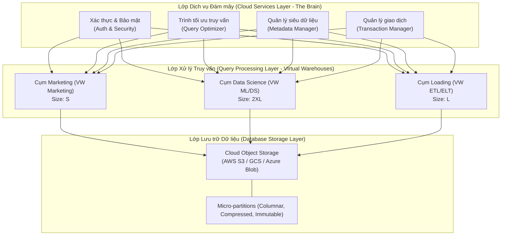

Trong thế giới của các nền tảng dữ liệu đám mây (Cloud Data Platforms), Snowflake nổi lên như một cuộc cách mạng nhờ vào thiết kế kiến trúc đột phá. Để thực sự làm chủ Snowflake và tối ưu hóa hiệu năng cũng như chi phí, việc hiểu rõ kiến trúc ba lớp (Three-Tier Architecture) và các cơ chế vận hành bên trong (Internals) như Micro-partitioning, Zero-Copy Cloning, hay cơ chế quản lý dữ liệu lịch sử là vô cùng quan trọng. 

Bài viết này sẽ đi sâu phân tích từng chi tiết kỹ thuật cốt lõi tạo nên sức mạnh và sự linh hoạt của Snowflake.

---

## Kiến trúc 3 lớp của Snowflake (Three-Tier Architecture)

Điểm cốt lõi giúp Snowflake vượt qua các hạn chế của [Kho dữ liệu (Data Warehouse)](/concepts/2-storage/data-warehouse/data-warehouse/) truyền thống là thiết kế **tách rời hoàn toàn giữa Lưu trữ (Storage) và Tính toán (Compute)**, được điều phối bởi một lớp **Dịch vụ Đám mây (Cloud Services)** thông minh.

Dưới đây là sơ đồ tổng quan về kiến trúc 3 lớp của Snowflake:




### 1. Lớp Lưu trữ Dữ liệu (Database Storage Layer)
Khi dữ liệu được nạp (load) vào Snowflake, nó sẽ được tổ chức lại thành một định dạng tối ưu nội bộ. Dữ liệu được nén (compressed), chuyển đổi sang định dạng lưu trữ dạng cột (columnar format), và lưu trữ dưới dạng các tệp tin bất biến gọi là **Micro-partitions**.

*   **Vị trí vật lý**: Các tệp tin này được lưu trữ trực tiếp trên hạ tầng Cloud Object Storage (như Amazon S3, Google Cloud Storage, hoặc Azure Blob Storage) tùy thuộc vào nền tảng đám mây mà tài khoản Snowflake của bạn được cấu hình.
*   **Truy cập trực tiếp**: Người dùng không thể trực tiếp truy cập các tệp tin vật lý này. Mọi thao tác đọc/ghi đều phải thông qua các câu lệnh SQL được xử lý bởi các lớp phía trên của Snowflake. Điều này đảm bảo tính toàn vẹn và bảo mật tuyệt đối cho dữ liệu.

### 2. Lớp Xử lý Truy vấn (Query Processing Layer / Virtual Warehouses)
Việc thực thi các truy vấn SQL được đảm nhận bởi lớp tính toán, sử dụng các cụm máy chủ ảo gọi là **Virtual Warehouses** (thường được gọi tắt là Warehouses).

*   **Bản chất**: Mỗi Virtual Warehouse thực chất là một cụm máy tính xử lý song song MPP (Massively Parallel Processing) gồm nhiều nút tính toán (compute nodes) được Snowflake cấp phát tài nguyên từ nhà cung cấp dịch vụ đám mây (Cloud Provider).
*   **Tính độc lập (Isolation)**: Các Virtual Warehouse hoạt động hoàn toàn độc lập với nhau. Team Marketing có thể chạy các truy vấn phân tích nặng trên một Warehouse cỡ `Large`, trong khi team Data Science chạy các mô hình máy học trên một Warehouse cỡ `2XL` mà không hề xảy ra hiện tượng tranh chấp tài nguyên (Resource Contention). Cả hai cụm máy này cùng đọc từ một nguồn dữ liệu vật lý ở lớp Storage nhưng không chia sẻ CPU/RAM.
*   **SSD Caching**: Mỗi nút tính toán trong Virtual Warehouse đều có ổ cứng SSD cục bộ để lưu trữ tạm thời (cache) dữ liệu được đọc từ lớp Storage. Nếu một truy vấn sau đó cần các dữ liệu tương tự, nó sẽ đọc trực tiếp từ bộ nhớ đệm SSD cục bộ này, tăng tốc độ truy vấn lên gấp nhiều lần.

### 3. Lớp Dịch vụ Đám mây (Cloud Services Layer)
Được ví như "bộ não" điều phối của toàn bộ hệ thống Snowflake. Lớp này chạy trên các thực thể máy chủ có tính sẵn sàng cao (high availability) và phục vụ nhiều tài khoản (multi-tenant).

Các thành phần chính bao gồm:
*   **Quản lý Siêu dữ liệu (Metadata Management)**: Lưu trữ thông tin về cấu trúc bảng (schema), các phiên bản dữ liệu, danh sách và đường dẫn của tất cả các file Micro-partitions, cũng như các thông tin thống kê phục vụ tối ưu hóa truy vấn.
*   **Tối ưu hóa Truy vấn (Query Parsing & Optimization)**: Phân tích cú pháp SQL và tạo ra kế hoạch thực thi tối ưu nhất trước khi gửi tới lớp Compute.
*   **Bảo mật và Xác thực (Access Control & Security)**: Quản lý đăng nhập, mã hóa khóa dữ liệu và kiểm soát quyền truy cập dựa trên vai trò (Role-Based Access Control - RBAC).
*   **Quản lý Giao dịch (Transaction Management)**: Hỗ trợ các giao dịch chuẩn ACID, quản lý tính nhất quán của dữ liệu qua cơ chế Multi-Version Concurrency Control (MVCC).

---

## Cơ chế hoạt động của Micro-partitioning (Micro-partitioning Mechanics)

Trái ngược với các cơ sở dữ liệu truyền thống yêu cầu người dùng phải định nghĩa các khóa phân vùng (partition keys) hay chỉ mục (indexes) một cách thủ công, Snowflake tự động hóa hoàn toàn quy trình này thông qua **Micro-partitions**.

### 1. Định dạng cấu trúc (Columnar & Compressed Layout)
Mỗi bảng dữ liệu trong Snowflake được chia theo chiều dọc thành các phân mảnh siêu nhỏ (Micro-partitions) có kích thước từ 50MB đến 500MB dữ liệu thô chưa nén.

*   **Lưu trữ dạng cột (Columnar Storage)**: Trong mỗi micro-partition, dữ liệu được nhóm và lưu trữ theo từng cột thay vì theo dòng. Điều này cho phép khi thực hiện truy vấn, Snowflake chỉ cần đọc đúng các cột được yêu cầu, giảm thiểu đáng kể I/O tài nguyên.
*   **Nén dữ liệu tự động**: Snowflake tự động phân tích phân phối dữ liệu trong mỗi cột của từng micro-partition để áp dụng thuật toán nén tối ưu nhất (ví dụ: Run-length encoding, Dictionary encoding).

### 2. Tính bất biến (Immutability)
Các tệp micro-partition là **bất biến (immutable)**. Một khi đã được ghi xuống đĩa, chúng không bao giờ bị sửa đổi.

*   Khi thực hiện lệnh `UPDATE` hoặc `DELETE`, thay vì sửa đổi trực tiếp trên file hiện tại, Snowflake sẽ đọc micro-partition cũ, tạo ra một hoặc nhiều micro-partition mới chứa dữ liệu đã được cập nhật hoặc loại bỏ các dòng bị xóa, và ghi chúng xuống Storage.
*   Sau đó, lớp Cloud Services sẽ cập nhật siêu dữ liệu (metadata) để đánh dấu các micro-partition cũ là "hết hạn" (deprecated) và trỏ các truy vấn tương lai tới các micro-partition mới. Đây chính là nền tảng giúp Snowflake triển khai các tính năng như Time Travel và Zero-Copy Cloning.

### 3. Tối ưu hóa truy vấn thông qua Metadata (Partition Pruning)
Lớp Cloud Services lưu trữ các thông tin thống kê chi tiết cho từng cột trong mỗi micro-partition bao gồm:
*   Giá trị nhỏ nhất và lớn nhất (Min/Max values).
*   Số lượng giá trị NULL (Number of NULLs).
*   Số lượng giá trị duy nhất (Distinct values).

Khi một câu lệnh SQL có chứa bộ lọc (ví dụ: `WHERE transaction_date >= '2026-06-01'`), trình tối ưu hóa truy vấn của Snowflake sẽ quét siêu dữ liệu này trước. Nó sẽ xác định và loại bỏ ngay lập tức (pruning) các micro-partitions có khoảng Min/Max không chứa giá trị cần tìm. Nhờ đó, Virtual Warehouse chỉ cần đọc một lượng file cực kỳ nhỏ thay vì thực hiện quét toàn bộ bảng (Full Table Scan).

---

## Khóa phân cụm (Clustering Keys) và Tái phân cụm (Reclustering)

Mặc định, Snowflake phân bổ dữ liệu vào các micro-partition theo thứ tự nạp dữ liệu tự nhiên (Natural Clustering). Tuy nhiên, khi dung lượng bảng lên tới hàng Terabyte hoặc Petabyte, thứ tự tự nhiên này có thể không còn tối ưu cho các câu lệnh truy vấn thường xuyên lọc theo các trường cụ thể.

### 1. Clustering Keys là gì?
Người dùng có thể chỉ định một hoặc nhiều cột làm **Clustering Key** cho một bảng. Lựa chọn này báo hiệu cho Snowflake biết rằng dữ liệu trong bảng cần được sắp xếp vật lý dựa trên các cột này để tối ưu hóa hiệu năng cắt tỉa (pruning).

*   **Khi nào nên dùng**: Chỉ áp dụng cho các bảng có kích thước rất lớn (thường từ vài trăm GB trở lên) và các câu lệnh truy vấn có các bộ lọc hoặc phép nối (JOIN) thường xuyên lặp lại trên cùng một số cột cụ thể.
*   **Cách thức**: Cú pháp khai báo dạng:
    ```sql
    ALTER TABLE large_sales_table CLUSTER BY (store_id, sale_date);
    ```

### 2. Cơ chế Reclustering tự động (Automatic Reclustering)
Sau khi định nghĩa Clustering Key, Snowflake sẽ theo dõi mức độ hỗn loạn (clustering depth) của bảng. Khi dữ liệu mới được chèn vào phá vỡ cấu trúc sắp xếp, Snowflake sẽ kích hoạt một tiến trình nền tự động tái phân cụm (Automatic Reclustering).

*   **Không ảnh hưởng hiệu năng**: Tiến trình này chạy hoàn toàn độc lập và sử dụng tài nguyên tính toán do Snowflake quản lý, đảm bảo không ảnh hưởng đến tài nguyên của các Virtual Warehouses hiện tại của người dùng.
*   **Chi phí**: Mặc dù hoạt động tự động, Reclustering sẽ tiêu tốn tài nguyên tính toán của Snowflake và người dùng sẽ phải trả chi phí tính bằng credit cho các hoạt động nền này. Vì vậy, cần cân nhắc kỹ khi chọn Clustering Keys để tránh việc hệ thống liên tục sắp xếp lại dữ liệu gây lãng phí chi phí.

---

## Cơ chế nhân bản không tốn dung lượng (Zero-Copy Cloning)

Tính năng **Zero-Copy Cloning** cho phép tạo ra các bản sao (clone) của bảng, schema, hoặc toàn bộ database gần như ngay lập tức mà không cần sao chép dữ liệu vật lý và không phát sinh thêm chi phí lưu trữ ban đầu.

### 1. Cơ chế hoạt động (Sharing Metadata Pointers)
Khi bạn chạy lệnh nhân bản:
```sql
CREATE TABLE sales_dev CLONE sales_prod;
```

Thay vì đọc 10TB dữ liệu từ bảng `sales_prod` và ghi lại thành một bản sao mới, Snowflake chỉ đơn thuần tạo ra một tập hợp các con trỏ siêu dữ liệu (metadata pointers) mới trong lớp Cloud Services trỏ tới cùng các tệp micro-partition vật lý của bảng gốc `sales_prod`. Lệnh này thường hoàn thành chỉ trong vài giây.

### 2. Nguyên lý cô lập ghi đè (Copy-on-Write) và Phân rã dữ liệu
Khi người dùng thực hiện các thao tác chỉnh sửa dữ liệu trên bảng clone `sales_dev`:

1.  **Ghi dữ liệu mới**: Nếu có dòng dữ liệu mới được chèn (INSERT) vào `sales_dev`, Snowflake sẽ tạo ra các micro-partition mới và cập nhật metadata của `sales_dev` để trỏ tới các file mới này. Bảng gốc `sales_prod` hoàn toàn không biết đến sự tồn tại của các file mới đó.
2.  **Sửa đổi dữ liệu cũ**: Nếu một dòng dữ liệu cũ bị cập nhật (UPDATE) hoặc xóa (DELETE) trên `sales_dev`, cơ chế Copy-on-Write sẽ được kích hoạt. Snowflake tạo bản sao mới của micro-partition bị ảnh hưởng, áp dụng thay đổi, ghi xuống storage và trỏ metadata của `sales_dev` vào file mới. Metadata của `sales_prod` vẫn tiếp tục trỏ vào file gốc không đổi.
3.  **Tách biệt chi phí**: Từ thời điểm này, người dùng chỉ phải trả thêm chi phí lưu trữ cho các micro-partition mới được tạo ra do sự sai khác dữ liệu giữa hai bảng (data drift).

---

## So sánh Time Travel và Fail-Safe

Để bảo vệ dữ liệu chống lại các sai sót của con người hoặc sự cố hệ thống, Snowflake cung cấp hai lớp bảo vệ dữ liệu lịch sử bổ trợ cho nhau: **Time Travel** và **Fail-Safe**.

### 1. Cơ chế hoạt động của Time Travel
Cơ chế **Time Travel** tận dụng tính chất bất biến của các micro-partitions. Khi dữ liệu bị thay đổi hoặc xóa, các file cũ không bị xóa ngay lập tức mà được giữ lại trong một khoảng thời gian xác định (Retention Period).

*   **Thời gian lưu trữ**: Từ 0 đến 90 ngày (mặc định là 1 ngày). Đối với phiên bản Standard, giới hạn tối đa là 1 ngày. Đối với phiên bản Enterprise trở lên, có thể cấu hình lên đến 90 ngày cho các bảng vĩnh viễn (permanent tables).
*   **Khả năng truy vấn**: Người dùng có thể sử dụng mệnh đề `AT` hoặc `BEFORE` trong SQL để truy vấn dữ liệu tại một thời điểm chính xác trong quá khứ hoặc trước khi một câu lệnh cụ thể được thực thi:
    ```sql
    -- Đọc dữ liệu bảng tại thời điểm cách đây 1 giờ
    SELECT * FROM orders AT(OFFSET => -3600);
    ```

### 2. Cơ chế hoạt động của Fail-Safe
Khi thời hạn của Time Travel kết thúc, dữ liệu lịch sử sẽ tự động chuyển sang trạng thái **Fail-Safe**.

*   **Thời gian lưu trữ**: Cố định là 7 ngày và không thể cấu hình thay đổi hay tắt đi.
*   **Mục đích**: Đây là lớp phòng thủ cuối cùng phòng trường hợp xảy ra thiên tai hoặc thảm họa hệ thống nghiêm trọng.
*   **Cách khôi phục**: Người dùng không thể tự truy vấn hay khôi phục dữ liệu trong Fail-Safe bằng SQL. Quy trình này bắt buộc phải yêu cầu sự can thiệp từ đội ngũ hỗ trợ kỹ thuật của Snowflake (Snowflake Support).

### 3. Bảng so sánh chi tiết: Time Travel vs Fail-Safe

| Tiêu chí so sánh | Time Travel (Du hành thời gian) | Fail-Safe (Bảo vệ lỗi hệ thống) |
| :--- | :--- | :--- |
| **Mục đích sử dụng** | Phục hồi lỗi do người dùng (xóa nhầm, cập nhật sai) hoặc kiểm thử dữ liệu quá khứ. | Khôi phục sau thảm họa hệ thống nghiêm trọng hoặc lỗi dữ liệu hệ thống. |
| **Thời gian lưu trữ** | 0 đến 90 ngày (tùy cấu hình và loại bảng). | Cố định 7 ngày (không thể thay đổi). |
| **Cách thức khôi phục** | Người dùng tự thực hiện qua câu lệnh SQL (`AT`, `BEFORE`, `UNDROP`). | Phải liên hệ Snowflake Support để khôi phục thủ công. |
| **Chi phí lưu trữ** | Tính phí lưu trữ bình thường cho các micro-partitions lịch sử được giữ lại. | Tính phí lưu trữ bình thường cho dữ liệu lưu trong Fail-Safe. |
| **Đối tượng áp dụng** | Bảng Temporary, Transient (tối đa 1 ngày) và Permanent. | Chỉ áp dụng cho bảng Permanent. |

---

## Điểm mạnh và điểm yếu

Hiểu rõ ưu nhược điểm của Snowflake giúp các kiến trúc sư dữ liệu đưa ra quyết định thiết kế tối ưu nhất khi tích hợp nền tảng này vào hệ sinh thái dữ liệu của doanh nghiệp.

### Điểm mạnh (Pros)
*   **Không cần quản trị hạ tầng (Zero Management)**: Snowflake tự động xử lý các tác vụ phức tạp như phân mảnh dữ liệu, tối ưu hóa truy vấn, cấu hình index và nén dữ liệu. Đội ngũ kỹ sư dữ liệu có thể tập trung hoàn toàn vào việc khai thác giá trị từ dữ liệu.
*   **Tách biệt Compute và Storage**: Cho phép co giãn tài nguyên tính toán độc lập mà không cần di chuyển hay cấu hình lại dữ liệu lưu trữ. Khả năng bật/tắt (Auto-Suspend/Resume) giúp tiết kiệm chi phí tối đa.
*   **Chia sẻ dữ liệu bảo mật (Secure Data Sharing)**: Cho phép chia sẻ trực tiếp dữ liệu theo thời gian thực với các tài khoản Snowflake khác mà không cần sao chép dữ liệu vật lý hay tạo các đường ống dữ liệu phức tạp.
*   **Tính năng phục hồi mạnh mẽ**: Time Travel và Zero-Copy Cloning giúp việc quản lý các môi trường thử nghiệm (Dev/Test) và khôi phục dữ liệu bị lỗi trở nên dễ dàng và nhanh chóng hơn bao giờ hết.

### Điểm yếu (Cons)
*   **Chi phí khó kiểm soát (Runaway Costs)**: Do cơ chế co giãn tự động và tính tiền theo Credit, nếu không cấu hình chặt chẽ công cụ giám sát tài nguyên (Resource Monitors) hoặc quên cài đặt thời gian tự động tắt (Auto-Suspend), doanh nghiệp có thể phải đối mặt với các hóa đơn khổng lồ.
*   **Không tối ưu cho OLTP**: Snowflake được thiết kế tối ưu cho các truy vấn phân tích dạng lô lớn ([OLAP](/concepts/2-storage/database-storage/olap/)). Việc thực hiện hàng triệu truy vấn ghi/đọc từng dòng nhỏ lẻ liên tục (single-row inserts/updates) sẽ dẫn đến hiệu năng kém và tạo ra quá nhiều tệp micro-partition rác.
*   **Khóa chặt vào hệ sinh thái (Vendor Lock-in)**: Mặc dù chạy được trên đa đám mây, nhưng các tính năng nâng cao và định dạng lưu trữ của Snowflake hoàn toàn là độc quyền. Việc chuyển đổi từ Snowflake sang một giải pháp khác như [Google BigQuery](/concepts/2-storage/cloud-data-platform/google-bigquery/) hay [Amazon Redshift](/concepts/2-storage/cloud-data-platform/amazon-redshift/) đòi hỏi rất nhiều công sức di chuyển dữ liệu và viết lại mã nguồn SQL.

---

## Khi nào nên dùng và không nên dùng

### Khi nào nên dùng
*   **Xây dựng Modern Data Warehouse**: Phù hợp cho các doanh nghiệp cần một kho dữ liệu trung tâm tập hợp từ nhiều nguồn dữ liệu khác nhau để phục vụ báo cáo BI và phân tích dữ liệu.
*   **Nhiều đội nhóm dùng chung dữ liệu**: Khi doanh nghiệp có nhiều phòng ban (Data Analyst, Data Scientist, Finance) cùng cần truy vấn dữ liệu nhưng không muốn công việc của nhóm này làm ảnh hưởng đến hiệu năng của nhóm khác.
*   **Môi trường Dev/Test thay đổi liên tục**: Tận dụng Zero-Copy Cloning để tạo nhanh các môi trường kiểm thử dữ liệu thực tế từ Production mà không lo tốn chi phí lưu trữ gấp đôi.

### Khi nào không nên dùng
*   **Hệ thống xử lý giao dịch thời gian thực (OLTP)**: Các ứng dụng web cần ghi/đọc dữ liệu người dùng liên tục với độ trễ cực thấp (dưới vài mili-giây) nên sử dụng các cơ sở dữ liệu quan hệ truyền thống như PostgreSQL hoặc MySQL.
*   **Dữ liệu kích thước quá nhỏ**: Nếu tổng dung lượng dữ liệu của doanh nghiệp chỉ dưới vài chục Gigabyte và không có nhu cầu mở rộng phức tạp, việc sử dụng các giải pháp SQL server truyền thống hoặc cơ sở dữ liệu serverless gọn nhẹ sẽ tiết kiệm chi phí hơn rất nhiều.
*   **Truy vấn Streaming với tần suất cực cao**: Với các yêu cầu phân tích dòng dữ liệu trực tuyến yêu cầu độ trễ dưới giây (sub-second latency), các công cụ chuyên dụng như Apache Druid, ClickHouse hay Apache Flink sẽ là lựa chọn phù hợp hơn.

---

## Trọng tâm ôn luyện phỏng vấn

### 1. Tại sao Snowflake không cần hệ thống chỉ mục (Index) truyền thống mà vẫn đạt hiệu năng truy vấn cao?
*   **Gợi ý trả lời**: Snowflake đạt được điều này nhờ sự kết hợp giữa kiến trúc lưu trữ dạng cột (Columnar Storage) của **Micro-partitions** và cơ chế quản lý siêu dữ liệu tại lớp **Cloud Services**. 
    Khi dữ liệu được nạp vào, Snowflake tự động chia nhỏ thành các micro-partitions bất biến và lưu trữ các thống kê Min/Max của từng cột trong siêu dữ liệu. Khi thực thi truy vấn có bộ lọc, bộ tối ưu hóa truy vấn sẽ đối chiếu điều kiện lọc với siêu dữ liệu Min/Max này để loại bỏ ngay lập tức các micro-partitions không chứa dữ liệu phù hợp (gọi là cơ chế **Partition Pruning**). Do đó, hệ thống chỉ cần đọc một lượng nhỏ file dữ liệu thực tế từ Storage thay vì quét toàn bộ bảng, giúp đạt hiệu năng cực cao mà không cần người dùng duy trì hay tối ưu hóa chỉ mục thủ công.

### 2. Sự khác biệt cốt lõi giữa Zero-Copy Cloning và việc chạy lệnh tạo bảng sao chép thông thường (`CREATE TABLE ... AS SELECT`) là gì?
*   **Gợi ý trả lời**: Sự khác biệt nằm ở tốc độ thực thi, dung lượng đĩa và chi phí:
    *   Lệnh tạo bảng sao chép thông thường (`CTAS`) yêu cầu hệ thống phải đọc toàn bộ dữ liệu từ bảng gốc, phân bổ tài nguyên Compute để xử lý và ghi một bản sao dữ liệu vật lý mới xuống lớp Storage. Quá trình này tốn thời gian (tỷ lệ thuận với dung lượng dữ liệu), tiêu hao tài nguyên tính toán của Warehouse và làm tăng gấp đôi chi phí lưu trữ.
    *   **Zero-Copy Cloning** chỉ tạo ra các con trỏ siêu dữ liệu mới trỏ tới cùng các tệp micro-partition vật lý của bảng gốc tại lớp Cloud Services. Quá trình này hoàn thành gần như tức thì, không sử dụng tài nguyên tính toán của Warehouse và hoàn toàn không phát sinh thêm chi phí lưu trữ ban đầu. Chi phí lưu trữ chỉ tăng lên khi có sự thay đổi dữ liệu giữa hai bảng (Copy-on-Write).

### 3. Điều gì xảy ra đối với các micro-partition khi ta chạy lệnh `UPDATE` trên một bảng? Cơ chế này liên quan thế nào đến Time Travel?
*   **Gợi ý trả lời**: Do các micro-partition trong Snowflake là bất biến (immutable), khi ta chạy lệnh `UPDATE`, Snowflake không ghi đè trực tiếp lên file vật lý cũ. Thay vào đó, nó sẽ đọc dữ liệu từ các micro-partition cũ bị ảnh hưởng, tạo ra các micro-partition mới chứa dữ liệu đã được cập nhật, ghi chúng xuống storage và cập nhật metadata để trỏ tới các file mới. 
    Các micro-partition cũ không bị xóa ngay mà được chuyển sang trạng thái "lịch sử" (historical). Cơ chế **Time Travel** hoạt động dựa trên các micro-partition lịch sử này. Bằng cách lưu trữ lịch sử thay đổi của siêu dữ liệu trong lớp Cloud Services, Snowflake có thể biết được tại một thời điểm cụ thể trong quá khứ, những micro-partition nào đang có hiệu lực và tái dựng lại trạng thái dữ liệu chính xác tại thời điểm đó cho người dùng truy vấn.

---

## Xem thêm các khái niệm liên quan
* [Amazon Redshift](/concepts/2-storage/cloud-data-platform/amazon-redshift/)
* [Azure Synapse Analytics](/concepts/2-storage/cloud-data-platform/azure-synapse/)
* [Google BigQuery Optimization & Storage Write API](/concepts/2-storage/cloud-data-platform/bigquery-optimization/)

## Tài liệu tham khảo

1. [Snowflake Architecture & Key Concepts](https://docs.snowflake.com/en/user-guide/intro-key-concepts) - Official overview of Snowflake's unique three-layer architecture and cloud services.
2. [Snowflake Micro-partitions & Data Clustering](https://docs.snowflake.com/en/user-guide/tables-micro-partitions) - Detailed technical documentation on physical storage structure and partition pruning.
3. [Snowflake Zero-Copy Cloning Guide](https://docs.snowflake.com/en/user-guide/object-clone) - Official guide on cloning databases, schemas, and tables without duplicating storage.
4. [Snowflake Time Travel & Fail-Safe Mechanics](https://docs.snowflake.com/en/user-guide/data-availability) - Explanation of historical data storage, retention periods, and disaster recovery.
5. [AWS Integration with Snowflake Data Cloud](https://docs.aws.amazon.com/whitepapers/latest/building-data-lakes-aws/snowflake.html) - AWS best practices whitepaper for integrating Snowflake with Amazon Web Services ecosystem.
6. [Google Cloud and Snowflake Integration Reference](https://cloud.google.com/architecture/partners/snowflake) - Google Cloud partner guide for architecting data solutions using Google Cloud Storage and Snowflake.
7. [Microsoft Azure Architecture Guide for Snowflake](https://learn.microsoft.com/en-us/azure/architecture/reference-architectures/data/snowflake-data-warehouse) - Architectural blueprints for deploying Snowflake enterprise warehouse on Microsoft Azure platform.

## Các khái niệm liên quan

* [Snowflake Data Cloud](/concepts/2-storage/cloud-data-platform/snowflake/)
* [Snowflake Search Optimization Service & Clustering](/concepts/2-storage/cloud-data-platform/snowflake-search-optimization/)

## English Summary

Snowflake Data Cloud is a modern, cloud-native Enterprise Data Warehouse (EDW) that features a unique three-tier architecture: **Database Storage** (centralized, compressed columnar micro-partitions stored on Cloud Object Storage), **Query Processing** (independent, MPP clusters called Virtual Warehouses that eliminate resource contention), and **Cloud Services** (the control plane managing metadata, security, queries, and ACID transactions). 

At its core, Snowflake automates physical database design through **Micro-partitioning**, where immutable files (50-500MB) are generated with auto-collected metadata (Min/Max statistics) enabling highly efficient **Partition Pruning** without traditional indexing. For tables with complex, high-volume queries, users can define **Clustering Keys** to trigger background **Automatic Reclustering**. Snowflake's **Zero-Copy Cloning** leverages metadata copying, utilizing Copy-on-Write (CoW) to ensure write isolation and zero initial storage overhead. Lastly, for data protection, Snowflake couples **Time Travel** (0-90 days user-queryable history using immutable micro-partitions) with **Fail-Safe** (a 7-day non-configurable disaster recovery state managed exclusively by Snowflake Support), delivering a highly resilient SaaS data platform.
