Trong các nền tảng dữ liệu đám mây lớn, việc tối ưu hóa hiệu năng truy vấn và quản lý chi phí là những ưu tiên hàng đầu. Khi kích thước dữ liệu tăng lên hàng chục Terabyte hoặc Petabyte, việc thực thi các câu lệnh truy vấn mà không có chiến lược tối ưu hóa hợp lý sẽ dẫn đến hiện tượng quét toàn bộ bảng (Full Table Scan), gây lãng phí tài nguyên tính toán và tiêu tốn một lượng Credit khổng lồ. 

Để giải quyết bài toán này, bên cạnh cơ chế phân mảnh mặc định (Micro-partitioning), Snowflake cung cấp hai tính năng nâng cao vô cùng mạnh mẽ: **Phân cụm tự động (Automatic Clustering)** và **Dịch vụ tối ưu hóa tìm kiếm (Search Optimization Service - SOS)**. Bài viết này sẽ đi sâu phân tích cơ chế hoạt động bên trong (internals), so sánh chi tiết và đưa ra hướng dẫn lựa chọn giải pháp tối ưu cho từng kịch bản thực tế.

Để hiểu rõ hơn về nền tảng cơ bản của Snowflake, bạn có thể tham khảo thêm về [Kiến trúc Snowflake](/concepts/2-storage/cloud-data-platform/snowflake-internals) cũng như [Snowflake Data Cloud](/concepts/2-storage/cloud-data-platform/snowflake).

---

## Cơ chế hoạt động của Micro-partitioning và Metadata Pruning

Trước khi tìm hiểu về các giải pháp tối ưu nâng cao, chúng ta cần nắm vững cách Snowflake tổ chức lưu trữ vật lý mặc định thông qua cơ chế **Micro-partitioning** và cách lớp dịch vụ sử dụng siêu dữ liệu (**Metadata**) để lọc bỏ dữ liệu thừa (**Query Pruning**).

### Micro-partitioning là gì?
Khi dữ liệu được nạp vào một bảng trong Snowflake, hệ thống sẽ tự động phân chia bảng thành các tệp tin vật lý bất biến gọi là **Micro-partitions**.
* **Kích thước**: Mỗi micro-partition chứa từ 50MB đến 500MB dữ liệu thô chưa nén.
* **Lưu trữ dạng cột (Columnar Storage)**: Dữ liệu bên trong mỗi micro-partition được tổ chức theo từng cột (columns) thay vì theo dòng (rows). Điều này cho phép câu lệnh truy vấn chỉ cần tải đúng các cột được yêu cầu, giảm thiểu tối đa I/O tài nguyên.
* **Tính bất biến (Immutability)**: Các micro-partition là bất biến. Khi có thao tác sửa đổi dữ liệu (DML như `INSERT`, `UPDATE`, `DELETE`), Snowflake không ghi đè lên file cũ mà sẽ tạo ra các micro-partition mới và cập nhật siêu dữ liệu để trỏ tới các file mới này. Đây cũng chính là cơ sở cho tính năng [Zero-copy Cloning](/concepts/2-storage/cloud-data-platform/zero-copy-cloning/).

### Cơ chế Metadata Pruning
Lớp Dịch vụ Đám mây (Cloud Services Layer) của Snowflake duy trì một kho lưu trữ siêu dữ liệu (Metadata) tập trung cho tất cả các micro-partition. Đối với mỗi cột trong từng micro-partition, Snowflake ghi nhận:
* Giá trị nhỏ nhất và lớn nhất (Min/Max values).
* Số lượng giá trị NULL (Number of NULLs).
* Số lượng giá trị duy nhất (Distinct values).

Khi một truy vấn SQL có chứa bộ lọc (ví dụ: `WHERE transaction_date = '2026-06-01'`), Cloud Services Layer sẽ kiểm tra siêu dữ liệu trước tiên. Nó sẽ loại bỏ ngay lập tức (pruning) các micro-partition có khoảng giá trị Min/Max không bao phủ giá trị cần tìm. Do đó, Virtual Warehouse chỉ cần đọc một số lượng rất nhỏ các file thực sự chứa dữ liệu.

```mermaid
graph TD
    subgraph "Không có Search Optimization Service (Without SOS)"
        QueryA["Câu truy vấn: WHERE col_high_card = 'A'"] --> CS_PruningA["Cloud Services: Metadata Pruning (Dựa trên Min/Max)"]
        CS_PruningA --> ScanAllA["Quét toàn bộ Micro-partitions còn lại"]
        ScanAllA --> FilterA["Đọc dữ liệu và lọc từng dòng trên Compute Node"]
    end

    subgraph "Có Search Optimization Service (With SOS)"
        QueryB["Câu truy vấn: WHERE col_high_card = 'A'"] --> CS_PruningB["Cloud Services: Metadata Pruning (Dựa trên Min/Max)"]
        CS_PruningB --> SOS_Path["Sử dụng Search Access Path - SOS Index (Xác định chính xác micro-partition chứa giá trị)"]
        SOS_Path --> ScanSelective["Chỉ quét các Micro-partition đích thực sự chứa giá trị"]
        ScanSelective --> FilterB["Lọc kết quả nhanh chóng với I/O cực thấp"]
    end
```



### Hạn chế của Min/Max Pruning
Cơ chế Pruning mặc định dựa trên khoảng Min/Max hoạt động cực kỳ hiệu quả khi dữ liệu được nạp theo một thứ tự tự nhiên (ví dụ như theo thời gian ghi nhận). Tuy nhiên, đối với các cột có độ chọn lọc cao (High-cardinality) như số định danh cá nhân (UUID), địa chỉ email, hoặc mã giao dịch, và dữ liệu nạp vào ngẫu nhiên, khoảng Min/Max của hầu hết các micro-partition sẽ bị chồng chéo (overlapping) lên nhau. 

Lúc này, khoảng Min/Max của hầu như tệp tin nào cũng chứa giá trị cần tìm, khiến cơ chế lọc mặc định mất tác dụng và buộc hệ thống phải quét toàn bộ bảng. Đây chính là lúc chúng ta cần đến **Automatic Clustering** hoặc **Search Optimization Service**.

---

## So sánh Automatic Clustering và Search Optimization Service (SOS)

Mặc dù cả hai tính năng đều nhằm mục đích tăng tốc độ truy vấn bằng cách giảm thiểu số lượng micro-partition cần quét, bản chất kỹ thuật và kịch bản ứng dụng của chúng hoàn toàn khác nhau.

### Automatic Clustering (Phân cụm tự động)
* **Bản chất**: Sắp xếp vật lý lại dữ liệu (Physical sorting/reorganization) trong bảng dựa trên một khóa phân cụm cụ thể (`Clustering Key`) do người dùng định nghĩa (có thể là một hoặc nhiều cột).
* **Cơ chế**: Một dịch vụ chạy ngầm của Snowflake (Automatic Clustering Service) sẽ liên tục theo dõi độ phân mảnh dữ liệu (Clustering Depth). Khi phát hiện dữ liệu mới nạp vào làm xáo trộn trật tự, dịch vụ này sẽ tự động chạy các tác vụ gom nhóm và sắp xếp lại dữ liệu, tạo ra các micro-partition mới đã được sắp xếp và giải phóng các micro-partition cũ.
* **Tối ưu cho**: Các truy vấn quét dải dữ liệu (Range Scan), quét chọn lọc, hoặc gom nhóm (Group By) trên các cột có độ chọn lọc từ thấp đến trung bình (Low-to-medium cardinality) như cột ngày tháng (`DATE`), mã vùng (`REGION_ID`), hoặc trạng thái (`STATUS`). Nó cũng giúp cải thiện hiệu năng cho các phép liên kết bảng (`JOIN`) nếu cả hai bảng lớn được phân cụm theo cùng một khóa.

### Search Optimization Service - SOS (Dịch vụ tối ưu hóa tìm kiếm)
* **Bản chất**: Tạo ra và bảo trì một cấu trúc dữ liệu phụ trợ (Auxiliary search access path) hoạt động tương tự như một chỉ mục phụ (Secondary Index) nằm ngoài các micro-partition chính. SOS không thay đổi cấu trúc vật lý của dữ liệu gốc.
* **Cơ chế**: Dịch vụ bảo trì của Snowflake sẽ quét các micro-partition và tạo ra Bloom Filters cùng các cấu trúc chỉ mục điểm khác cho các cột được kích hoạt SOS.
* **Tối ưu cho**: Các truy vấn tìm kiếm điểm (Point Lookup) - tìm một vài dòng dữ liệu cụ thể trong một bảng khổng lồ (needle-in-a-haystack). Nó hoạt động tốt nhất trên các cột có độ chọn lọc rất cao (High-cardinality) như mã UUID, số điện thoại, địa chỉ IP, địa chỉ email. Nó hỗ trợ các truy vấn tìm kiếm chính xác (`=`), tìm kiếm chuỗi con (`LIKE '%value%'`), dữ liệu bán cấu trúc (VARIANT/JSON) và dữ liệu không gian địa lý (Geospatial).

Để có cái nhìn tổng quan về các phương pháp lập chỉ mục và phân cụm dữ liệu nói chung trong hệ thống cơ sở dữ liệu, bạn có thể xem thêm bài viết về [Phân cụm dữ liệu (Clustering)](/concepts/2-storage/database-storage/clustering).

### Bảng so sánh chi tiết giữa Automatic Clustering và SOS

| Tiêu chí so sánh (Criteria) | Phân cụm tự động (Automatic Clustering) | Dịch vụ tối ưu hóa tìm kiếm (Search Optimization Service - SOS) |
| :--- | :--- | :--- |
| **Bản chất kỹ thuật** | Tái cấu trúc vật lý (Physical reorganization/sorting) của dữ liệu trong bảng. | Tạo cấu trúc dữ liệu phụ trợ (Auxiliary search access path) tương tự Secondary Index. |
| **Loại truy vấn tối ưu** | Truy vấn dải (Range Scan), quét chọn lọc, gom nhóm (Group By), Join. | Truy vấn điểm (Point Lookup), tìm kiếm "kim đáy bể" (needle-in-a-haystack). |
| **Độ dị biệt của cột (Cardinality)** | Thấp đến trung bình (Low-to-medium cardinality) (ví dụ: ngày tháng, danh mục). | Rất cao (High cardinality) (ví dụ: UUID, mã giao dịch, email, IP). |
| **Số lượng cột tối ưu** | Giới hạn (thường từ 1-3 cột ghép thành khóa phân cụm). | Nhiều cột trên cùng một bảng (hỗ trợ nhiều kiểu dữ liệu khác nhau). |
| **Ảnh hưởng đến ghi dữ liệu (DML)** | Không ghi đè trực tiếp, nhưng việc nạp dữ liệu mới có thể yêu cầu Reclustering ngầm. | Yêu cầu cập nhật Search Access Path khi có dữ liệu mới (DML). |
| **Bộ nhớ và Lưu trữ phụ** | Không tốn thêm dung lượng lưu trữ dài hạn (chỉ phát sinh phiên bản file trong thời gian Time Travel). | Tốn thêm dung lượng lưu trữ cho các file access path (có thể chiếm 20%-100% dung lượng bảng gốc). |
| **Chi phí hoạt động** | Tiêu thụ credit cho tiến trình Reclustering của Snowflake. | Tiêu thụ credit cho tiến trình tạo và bảo trì Index ngầm (Maintenance Service). |

---

## Sơ đồ Query Pruning có và không có SOS

Xem lại phần sơ đồ Mermaid ở mục đầu tiên để so sánh trực quan cách Snowflake duyệt qua siêu dữ liệu và tối ưu hóa việc quét tệp tin khi có và không có sự hỗ trợ từ SOS.

---

## Nguyên lý hoạt động bên trong của Search Optimization Service (SOS Internals)

Khi chúng ta bật Search Optimization Service trên một bảng hoặc trên các cột cụ thể của bảng, Snowflake sẽ triển khai một cơ chế xử lý thông minh để tạo ra **Search Access Path**.

### Cấu trúc dữ liệu phụ trợ (Auxiliary Structures)
SOS sử dụng các cấu trúc dữ liệu toán học để tối ưu hóa việc định vị dữ liệu mà không cần đọc toàn bộ micro-partition:
1. **Bloom Filters**: Đối với phép so sánh bằng (`=`), Snowflake xây dựng Bloom Filter cho từng cột trong mỗi micro-partition. Bloom Filter là một cấu trúc dữ liệu xác suất (probabilistic data structure) cực kỳ nhỏ gọn. Khi kiểm tra một giá trị, Bloom Filter có thể đưa ra câu trả lời chắc chắn 100% rằng giá trị đó **không tồn tại** trong micro-partition, hoặc trả về kết quả là giá trị đó **có thể tồn tại** (với một tỷ lệ dương tính giả rất nhỏ). Nhờ đó, Snowflake có thể bỏ qua phần lớn các file không chứa dữ liệu.
2. **Chỉ mục chuỗi (String/Substring Indexes)**: Đối với các truy vấn sử dụng toán tử `LIKE` hoặc tìm kiếm chuỗi con, Snowflake xây dựng các chỉ mục chuỗi đặc biệt để theo dõi các mảnh chuỗi con tồn tại trong mỗi micro-partition.
3. **Chỉ mục bán cấu trúc (Semi-structured Indexes)**: Đối với dữ liệu dạng VARIANT/JSON, SOS tự động phân tách các đường dẫn thuộc tính (attribute paths) và xây dựng chỉ mục cho các khóa-giá trị cụ thể nằm bên trong tài liệu JSON.
4. **Chỉ mục địa lý (Geospatial Indexes)**: Hỗ trợ tìm kiếm các đối tượng hình học địa lý nằm trong một khu vực cụ thể.

### Cơ chế cập nhật không đồng bộ (Asynchronous Maintenance)
Một trong những điểm ưu việt của SOS là thiết kế tách rời tiến trình ghi dữ liệu (DML) khỏi tiến trình cập nhật chỉ mục:
* **Ghi dữ liệu tốc độ cao**: Khi người dùng chạy lệnh `INSERT` hoặc `COPY INTO` để nạp dữ liệu mới, dữ liệu được ghi trực tiếp vào các micro-partition mới một cách nhanh chóng. Giao dịch DML kết thúc thành công mà không phải chờ đợi cập nhật chỉ mục SOS.
* **Tiến trình bảo trì ngầm**: Một tiến trình chạy ngầm không đồng bộ (asynchronous background maintenance service) được điều phối bởi Cloud Services Layer sẽ phát hiện các thay đổi dữ liệu mới. Tiến trình này sử dụng tài nguyên máy chủ do Snowflake quản lý để quét các micro-partition mới được tạo ra, xây dựng thêm Bloom Filters và bổ sung chúng vào Search Access Path hiện tại.
* **Truy vấn trong quá trình bảo trì**: Nếu một truy vấn được thực thi trước khi tiến trình bảo trì ngầm hoàn thành, Snowflake vẫn trả về kết quả chính xác 100%. Đối với phần dữ liệu cũ đã được lập chỉ mục, Snowflake sử dụng SOS để truy cập nhanh; đối với phần dữ liệu mới chưa lập chỉ mục, Snowflake sẽ thực hiện quét micro-partition thông thường.

---

## Chi phí và ảnh hưởng hiệu năng (Cost and Performance Implications)

Mặc dù mang lại hiệu năng vượt trội cho các truy vấn điểm, SOS không phải là một giải pháp "miễn phí". Việc áp dụng SOS đòi hỏi doanh nghiệp phải cân nhắc kỹ lưỡng giữa bài toán hiệu năng và chi phí.

### Tối ưu hóa hiệu năng truy vấn
Với các bảng dữ liệu khổng lồ (hàng tỷ dòng), một truy vấn điểm thông thường có thể mất từ vài phút đến hàng chục phút do phải quét qua hàng trăm ngàn micro-partition. Khi bật SOS, số lượng file cần quét có thể giảm xuống chỉ còn vài file đơn lẻ. Thời gian thực thi truy vấn giảm xuống chỉ còn vài giây hoặc thậm chí mili-giây. Điều này giúp:
* Cải thiện đáng kể trải nghiệm người dùng cuối (ví dụ: các ứng dụng tìm kiếm thông tin khách hàng thời gian thực).
* Tiết kiệm Credit của Virtual Warehouse do thời gian CPU chạy câu lệnh cực kỳ ngắn.

### Chi phí lưu trữ phụ trội (Storage Cost)
Chỉ mục SOS đòi hỏi dung lượng lưu trữ riêng. Dung lượng này được tính vào tổng chi phí lưu trữ hàng tháng của tài khoản Snowflake.
* Đối với các bảng có cấu trúc đơn giản và kiểu dữ liệu số/chuỗi ngắn, dung lượng SOS Index có thể chỉ chiếm khoảng 20% đến 30% dung lượng bảng gốc.
* Đối với các bảng có dữ liệu Variant phức tạp hoặc các chuỗi ký tự dài, kích thước của SOS Index có thể tăng lên đến 100% hoặc thậm chí lớn hơn dung lượng của chính bảng dữ liệu gốc.

### Chi phí tính toán bảo trì (Maintenance Compute Cost)
Snowflake sử dụng các server ảo chuyên dụng để chạy tiến trình bảo trì ngầm SOS. Người dùng sẽ phải trả Credit cho lượng tài nguyên tính toán này dựa trên số giây hoạt động thực tế.
* **Initial Build**: Khi lần đầu tiên kích hoạt SOS trên một bảng dữ liệu lớn sẵn có, tiến trình bảo trì sẽ phải quét toàn bộ bảng để dựng index ban đầu. Thao tác này có thể tiêu tốn một lượng lớn Credit.
* **Ongoing Maintenance**: Mỗi khi có dữ liệu mới được nạp vào hoặc sửa đổi, tiến trình bảo trì sẽ khởi động để cập nhật index. Đối với các bảng có tần suất ghi/nạp dữ liệu liên tục và lượng dữ liệu thay đổi lớn (high-churn tables), chi phí bảo trì SOS có thể tăng phi mã và đôi khi vượt quá lượng Credit tiết kiệm được từ việc tăng tốc truy vấn.

---

## Điểm mạnh và điểm yếu

### Phân cụm tự động (Automatic Clustering)
* **Điểm mạnh (Pros)**:
  * Tối ưu hóa tuyệt vời cho các truy vấn dải (Range scan), lọc dữ liệu theo thời gian, phân tích dữ liệu lịch sử.
  * Tăng tốc đáng kể cho các phép toán nối bảng (`JOIN`) trên các bảng lớn có cùng khóa phân cụm.
  * Không tốn thêm chi phí lưu trữ dữ liệu phụ trợ dài hạn.
* **Điểm yếu (Cons)**:
  * Không hiệu quả đối với các truy vấn tìm kiếm điểm trên các cột có độ dị biệt cao (High-cardinality) nếu dữ liệu không được sắp xếp theo cột đó.
  * Chỉ có thể chọn tối đa một vài cột làm khóa phân cụm cho một bảng.
  * Chi phí Reclustering ngầm có thể rất cao nếu dữ liệu nạp vào liên tục bị xáo trộn thứ tự vật lý.

### Dịch vụ tối ưu hóa tìm kiếm (Search Optimization Service - SOS)
* **Điểm mạnh (Pros)**:
  * Mang lại hiệu năng tìm kiếm điểm (Point lookup) vượt trội, giảm thời gian truy vấn từ phút xuống giây.
  * Hỗ trợ nhiều loại cột và nhiều kiểu dữ liệu khác nhau trên cùng một bảng (không bị giới hạn như khóa phân cụm).
  * Hỗ trợ đắc lực cho dữ liệu bán cấu trúc (JSON/Variant), tìm kiếm chuỗi con (`LIKE`), và địa lý.
  * Thiết kế không đồng bộ đảm bảo không gây suy giảm hiệu năng ghi dữ liệu trực tiếp (DML Latency).
* **Điểm yếu (Cons)**:
  * Tiêu tốn thêm chi phí lưu trữ phụ trợ đáng kể (lên đến 100% dung lượng bảng gốc).
  * Chi phí tính toán bảo trì index liên tục có thể rất cao đối với các bảng có tần suất DML lớn.
  * Không hỗ trợ tối ưu hóa cho các truy vấn quét dải rộng (Range Scan) hoặc các phép toán JOIN trên diện rộng.

---

## Khi nào nên dùng

1. Bảng dữ liệu lớn (thường từ vài trăm GB trở lên) và có tốc độ tăng trưởng ổn định.
2. Các câu lệnh truy vấn thường xuyên có điều kiện lọc theo dải (ví dụ: `WHERE order_date BETWEEN '2026-06-01' AND '2026-06-07'`).
3. Dữ liệu thường xuyên được gom nhóm (`GROUP BY order_date`) hoặc thực hiện nối bảng (`JOIN`) với bảng khác trên cùng một cột khóa.
4. Cột phân cụm có độ dị biệt từ thấp đến trung bình (Low-to-medium cardinality) và số lượng giá trị duy nhất không quá lớn.
5. Cột dùng để lọc trong các truy vấn điểm có độ dị biệt rất cao (High-cardinality), chẳng hạn như ID giao dịch (`transaction_id`), mã UUID khách hàng (`customer_uuid`), số điện thoại, địa chỉ IP.
6. Cần tìm kiếm chuỗi con bằng toán tử `LIKE` với các từ khóa dạng `LIKE '%search_value%'`.
7. Truy vấn lọc sâu vào các thuộc tính bên trong dữ liệu bán cấu trúc VARIANT (JSON) hoặc các đối tượng địa lý.

---

## Khi nào không nên dùng

1. Bảng dữ liệu nhỏ (dưới vài chục GB) vì cơ chế metadata pruning mặc định của Snowflake đã đủ nhanh và không tốn thêm chi phí.
2. Cột định nghĩa khóa phân cụm có độ dị biệt quá cao (như UUID) hoặc quá thấp (chỉ có 2 giá trị như `GENDER`). Phân cụm trên các cột này không mang lại hiệu quả pruning tốt mà chỉ gây tốn Credit reclustering.
3. Bảng dữ liệu có tần suất nạp/ghi quá cao và dữ liệu ghi vào không được sắp xếp trước, dẫn đến việc Snowflake phải liên tục sắp xếp lại dữ liệu ngầm, tiêu tốn nhiều Credit.
4. Truy vấn cần đọc hoặc quét một tỷ lệ lớn dữ liệu trong bảng (ví dụ các tác vụ phân tích, báo cáo tổng hợp BI, quét toàn bộ bảng).
5. Bảng dữ liệu là bảng tạm (Temporary tables) hoặc bảng có vòng đời rất ngắn, vì thời gian bảo trì dựng index ngầm của SOS có thể dài hơn thời gian tồn tại của bảng.
6. Bảng dữ liệu có tần suất ghi/nạp (DML) cực kỳ lớn liên tục nhưng số lượng câu lệnh truy vấn tìm kiếm điểm lại rất ít. Chi phí bảo trì SOS index ngầm lúc này sẽ vượt trội so với lợi ích mang lại cho các truy vấn.

---

## Trọng tâm ôn luyện phỏng vấn

### Câu hỏi 1: Làm thế nào để kích hoạt Search Optimization Service cho một bảng và kiểm tra xem nó có đang hoạt động hay không?
**Trả lời**:
Để kích hoạt SOS cho toàn bộ các cột được hỗ trợ trong một bảng, ta dùng câu lệnh:
```sql
ALTER TABLE my_table ADD SEARCH OPTIMIZATION;
```
Nếu chỉ muốn kích hoạt SOS cho các cột cụ thể nhằm tiết kiệm chi phí lưu trữ và bảo trì, ta có thể chỉ định rõ phương thức cấu hình (ví dụ tối ưu phép toán bằng `=` cho một cột cụ thể):
```sql
ALTER TABLE my_table ADD SEARCH OPTIMIZATION ON EQUALITY(customer_uuid);
```
Để kiểm tra xem tiến trình bảo trì ngầm đã hoàn thành việc dựng index cho bảng hay chưa, ta sử dụng lệnh:
```sql
SHOW TABLES LIKE 'my_table';
```
Trong kết quả trả về, cột `search_optimization` sẽ hiển thị giá trị `ON`, và cột `search_optimization_progress` sẽ hiển thị tỷ lệ phần trăm tiến trình hoàn thành (ví dụ: `100%` nghĩa là index đã được dựng hoàn tất cho toàn bộ dữ liệu hiện tại).

### Câu hỏi 2: Tại sao chi phí bảo trì (Maintenance Cost) của Search Optimization Service lại tăng cao bất thường trên một số bảng? Cách tối ưu hóa là gì?
**Trả lời**:
Chi phí bảo trì SOS tăng cao thường do hai nguyên nhân chính:
1. **Tần suất thay đổi dữ liệu (Churn rate) cao**: Bảng chịu nhiều hoạt động DML (`INSERT`, `UPDATE`, `DELETE`, `MERGE`) liên tục. Mỗi khi dữ liệu thay đổi, Snowflake phải tiêu thụ Credit tính toán để cập nhật lại Bloom Filters cho các micro-partition mới.
2. **Kích hoạt SOS cho quá nhiều cột hoặc cột có cấu trúc phức tạp**: Việc bật SOS cho toàn bộ bảng thay vì các cột tìm kiếm điểm cụ thể sẽ ép hệ thống phải xây dựng và bảo trì index cho cả các cột không bao giờ được truy vấn tới.

**Cách tối ưu hóa**:
* Chỉ kích hoạt SOS trên các cột cụ thể thực sự được sử dụng trong điều kiện lọc truy vấn điểm (sử dụng cú pháp `ADD SEARCH OPTIMIZATION ON EQUALITY(...)`).
* Gom các lệnh nạp dữ liệu nhỏ thành các lô lớn (Batching) để giảm số lượng micro-partition mới được tạo ra và số lần tiến trình bảo trì SOS phải khởi động.
* Cân nhắc sử dụng Automatic Clustering thay thế nếu cột tìm kiếm có độ dị biệt thấp và truy vấn thường lọc theo dải.

### Câu hỏi 3: Sự khác biệt lớn nhất giữa chỉ mục truyền thống (B-Tree Index) trong RDBMS và Search Optimization Service trong Snowflake là gì?
**Trả lời**:
* **B-Tree Index truyền thống**: Lưu trữ các con trỏ trực tiếp trỏ tới địa chỉ vật lý của từng dòng dữ liệu (Row ID). Khi truy vấn, hệ thống đi theo cây chỉ mục để tìm chính xác dòng và đọc dòng đó từ đĩa. B-Tree index hoạt động đồng bộ và cần được cập nhật ngay lập tức khi có lệnh ghi dữ liệu (DML), điều này có thể làm chậm quá trình ghi.
* **Snowflake Search Optimization Service**: Hoạt động ở cấp độ **Micro-partition**. SOS index (như Bloom Filters) không trỏ trực tiếp tới từng dòng dữ liệu cụ thể mà chỉ ra xem một micro-partition cụ thể **có chứa hoặc chắc chắn không chứa** giá trị tìm kiếm hay không. Sau khi xác định được các micro-partition tiềm năng, Virtual Warehouse vẫn phải nạp các file này và lọc dòng trên Compute Node. SOS được cập nhật không đồng bộ (Asynchronous) ở phía sau để đảm bảo không làm giảm hiệu năng của các tác vụ ghi dữ liệu trực tiếp.

---

## English Summary

* **Micro-partitioning**: Snowflake's default physical storage layout. Data is automatically partitioned into immutable, compressed columnar files (50MB - 500MB). Cloud Services stores metadata (Min/Max values) to perform **Query Pruning**.
* **Automatic Clustering**: Physically reorganizes and sorts table data based on user-defined **Clustering Keys**. It is best suited for **Range Scans** and selective queries on **low-to-medium cardinality** columns (e.g., dates, regions).
* **Search Optimization Service (SOS)**: Creates and maintains an auxiliary **Search Access Path** (e.g., Bloom Filters) without changing the physical layout of the base table. It acts as a secondary index and is highly optimized for **Point Lookups** (needle-in-a-haystack queries) on **high-cardinality** columns (e.g., UUIDs, email, transaction IDs).
* **Storage Overhead**: Automatic Clustering does not incur long-term storage overhead. SOS can consume substantial storage space (20% to over 100% of the base table size) to store Bloom Filters and indexes.
* **Compute Costs**: Both services consume Snowflake compute credits via background services. SOS maintenance can be expensive for high-churn tables with frequent DML operations. Batching data loads and restricting SOS to specific columns are key best practices.

---

## Xem thêm các khái niệm liên quan
* [Amazon Redshift](/concepts/2-storage/cloud-data-platform/amazon-redshift/)
* [Azure Synapse Analytics](/concepts/2-storage/cloud-data-platform/azure-synapse/)
* [Google BigQuery Optimization & Storage Write API](/concepts/2-storage/cloud-data-platform/bigquery-optimization/)

## Tài liệu tham khảo

1. [Snowflake Search Optimization Service Official Guide](https://docs.snowflake.com/en/user-guide/search-optimization-service)
2. [Snowflake Micro-partitions and Data Clustering Mechanics](https://docs.snowflake.com/en/user-guide/tables-micro-partitions)
3. [Snowflake Automatic Clustering Service Overview](https://docs.snowflake.com/en/user-guide/tables-clustering-service)
4. [Snowflake Query Pruning and Metadata Management](https://docs.snowflake.com/en/user-guide/querying-metadata-pruning)
5. [AWS Big Data Blog: Benchmarking Snowflake Performance on AWS](https://aws.amazon.com/blogs/big-data/benchmarking-snowflake-performance-on-aws/)
6. [Google Cloud Architecture Guide: Migrating from Snowflake to BigQuery](https://cloud.google.com/architecture/dw-migration-snowflake-to-bigquery)
7. [Microsoft Azure Databricks and Snowflake Data Access Integration](https://learn.microsoft.com/en-us/azure/databricks/data-sharing/)
