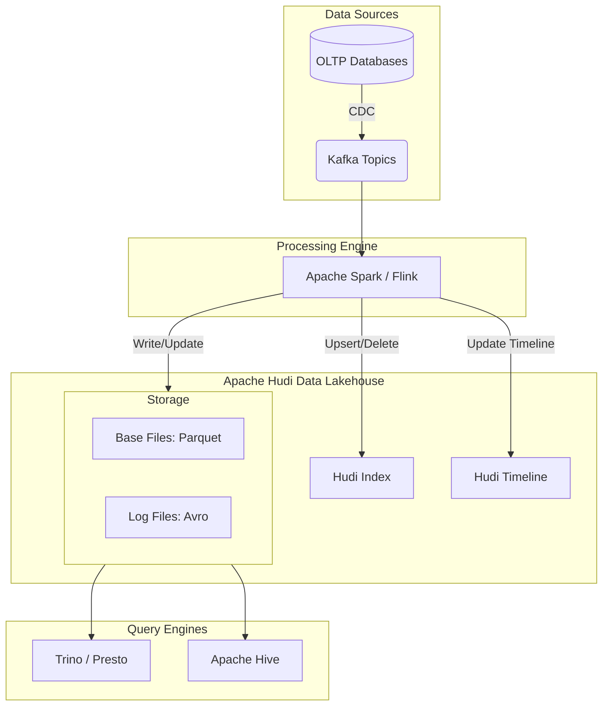

Trong thế giới Kỹ thuật Dữ liệu, Data Lake (Hồ dữ liệu) luôn là lựa chọn hàng đầu nhờ khả năng lưu trữ lượng thông tin khổng lồ với chi phí cực thấp. Thế nhưng, việc vận hành một Data Lake truyền thống chứa đầy file Parquet thô lại là một câu chuyện đau đầu: làm sao để cập nhật một vài dòng dữ liệu bị sai? Làm sao để xóa thông tin người dùng theo luật bảo mật mà không cần ghi đè lại toàn bộ phân vùng (partition) khổng lồ? Và làm cách nào để đồng bộ dữ liệu thay đổi liên tục từ cơ sở dữ liệu nguồn (CDC) theo thời gian thực?

Để giải quyết những câu hỏi hóc búa này, Uber đã phát triển và đóng góp cho cộng đồng mã nguồn mở **Apache Hudi** (viết tắt của Hadoop Upserts Deletes and Incrementals). 

Đóng vai trò là một định dạng bảng (Table Format) hiện đại, Hudi mang lại các tính năng quan trọng như giao dịch ACID, cập nhật (Upserts), xóa (Deletes) và xử lý dữ liệu gia tăng (Incremental Processing) trực tiếp trên các hệ thống lưu trữ phân tán như AWS S3, Google [Cloud Storage](/concepts/2-storage/cloud-data-platform/cloud-storage/) hay HDFS, biến Data Lake của bạn thành một Data [Lakehouse](/concepts/2-storage/data-lake-lakehouse/lakehouse/) tin cậy.


## Tại sao Data Lake truyền thống cần đến Hudi?

Trước khi có sự xuất hiện của các Table Format như Apache Hudi, việc quản lý dữ liệu trên Data Lake giống như cố gắng chỉnh sửa một cuốn sách được in trên giấy đá:
1. **Không hỗ trợ cập nhật và xóa (Upsert/Delete):** Các file dữ liệu trên Data Lake thường ở dạng chỉ thêm mới (Append-only). Nếu bạn muốn sửa đổi hoặc xóa chỉ một vài bản ghi, cách duy nhất là dùng Spark đọc toàn bộ file Parquet chứa bản ghi đó lên, lọc bỏ/chỉnh sửa dữ liệu, rồi ghi đè file mới. Quy trình này cực kỳ tốn tài nguyên và thời gian.
2. **Khó khăn khi đồng bộ CDC (Change Data Capture):** Khi dữ liệu ở các cơ sở dữ liệu giao dịch (như MySQL, Postgres) thay đổi liên tục, việc đồng bộ các thay đổi đó vào Data Lake theo thời gian thực gần như là điều bất khả thi nếu không có cơ chế ghi đè thông minh.
3. **Không hỗ trợ truy vấn gia tăng (Incremental Query):** Rất khó để một ứng dụng phía sau biết được từ lần quét cuối cùng, những bản ghi nào đã bị thay đổi để chỉ lấy phần dữ liệu mới đó đi xử lý tiếp, thay vì quét lại toàn bộ bảng.

Hudi ra đời như một vị cứu tinh, cung cấp khả năng thao tác ở cấp độ bản ghi (record-level), giúp việc đồng bộ CDC diễn ra mượt mà và hỗ trợ truy vấn gia tăng hiệu quả.

## Ba cột trụ công nghệ làm nên sức mạnh của Hudi

Kiến trúc độc đáo của Apache Hudi xoay quanh ba khái niệm cốt lõi:

### 1. Record-level Indexing (Chỉ mục cấp bản ghi)
Hudi sử dụng các cơ chế chỉ mục tiên tiến (như Bloom Filter, HBase Index hoặc Bucket Index) để nhanh chóng định vị xem bản ghi cần cập nhật hoặc xóa đang nằm ở tệp tin Parquet vật lý nào trên ổ đĩa. Nhờ đó, Hudi tránh được việc phải quét toàn bộ bảng dữ liệu để tìm kiếm bản ghi cần sửa.

### 2. Timeline (Dòng thời gian hoạt động)
Hudi duy trì một dòng thời gian ghi lại lịch sử của mọi thao tác diễn ra trên bảng (như commit mới, rollback lỗi, [compaction](/concepts/2-storage/data-lake-lakehouse/compaction/) gộp file). Dòng thời gian này chính là điểm tựa giúp Hudi hỗ trợ các giao dịch ACID, đồng thời cho phép người dùng xem lại trạng thái của bảng ở một thời điểm bất kỳ trong quá khứ ([Time Travel](/concepts/2-storage/data-lake-lakehouse/time-travel/)).

### 3. Hai loại hình lưu trữ dữ liệu (Table Types)
Để cân bằng giữa hiệu suất ghi dữ liệu và tốc độ đọc dữ liệu, Hudi cung cấp hai lựa chọn cấu trúc bảng:
* **Copy-on-Write (CoW):** Đúng như tên gọi, khi có bất kỳ cập nhật nào, Hudi sẽ đọc file Parquet cũ lên, cập nhật bản ghi mới, sao chép dữ liệu cũ và ghi ra một file Parquet mới hoàn chỉnh. Cách này giúp việc đọc dữ liệu luôn đạt tốc độ tối đa (vì dữ liệu luôn nằm trong các file Parquet sạch sẽ), phù hợp cho các bảng đọc nhiều (Read-heavy).
* **Merge-on-Read (MoR):** Khi có cập nhật mới, Hudi không đụng vào file Parquet cũ mà ghi nhanh các thay đổi đó vào một file log định dạng Avro nằm ngay bên cạnh. Khi người dùng truy vấn, Hudi sẽ tự động gộp (merge) dữ liệu từ file Parquet cơ sở và file Avro log lại để trả về kết quả mới nhất. Cơ chế này giúp ghi dữ liệu cực nhanh, rất phù hợp cho các luồng dữ liệu thời gian thực (Write-heavy). Các file log Avro sau đó sẽ được tự động gộp vào file Parquet cơ sở thông qua tiến trình Compaction chạy ngầm định kỳ.

## Cơ chế hoạt động: Khi luồng cập nhật và ghi đè phối hợp

Hãy cùng xem quy trình hoạt động của Hudi khi thực hiện cập nhật hoặc thêm mới (Upsert) dữ liệu trên một bảng cấu trúc Merge-on-Read (MoR):

1. **Nhận dữ liệu (Ingestion):** Dữ liệu mới (ví dụ từ Kafka thông qua Spark Streaming) được nạp vào Hudi.
2. **Kiểm tra chỉ mục ([Indexing](/concepts/2-storage/database-storage/indexing/)):** Hudi quét chỉ mục Bloom Filter để xác định xem các bản ghi đi vào đã từng tồn tại trong hệ thống chưa.
3. **Thực thi ghi (Writing):**
   * Nếu là bản ghi mới tinh (Insert): Hudi ghi chúng vào các tệp tin Parquet cơ sở mới.
   * Nếu là bản ghi cập nhật (Update): Hudi chỉ ghi phần thay đổi vào tệp log Avro tương ứng với file Parquet chứa bản ghi cũ.
4. **Hợp nhất dữ liệu (Compaction):** Định kỳ, tiến trình Compaction sẽ chạy để gộp tất cả các tệp log Avro vào tệp Parquet cơ sở để tạo ra phiên bản tệp Parquet mới sạch sẽ, sẵn sàng cho các câu truy vấn phân tích tiếp theo diễn ra nhanh hơn.

## Sơ đồ kiến trúc tổng quan của Apache Hudi

Dưới đây là sơ đồ mô tả cách dữ liệu chảy từ các nguồn giao dịch vào kho lưu trữ Hudi và được truy vấn bởi các công cụ phân tích:


## Bắt tay vào code: Thao tác cơ bản với Hudi bằng Spark

Dưới đây là ví dụ sử dụng Spark Shell (ngôn ngữ Scala) để thực hiện các thao tác Insert và Upsert dữ liệu vào bảng Hudi:

### 1. Khởi tạo dữ liệu mẫu và ghi mới (Insert)

```scala
import org.apache.hudi.QuickstartUtils._
import scala.collection.JavaConversions._
import org.apache.spark.sql.SaveMode._
import org.apache.hudi.DataSourceWriteOptions._
import org.apache.hudi.config.HoodieWriteConfig._

val tableName = "hudi_trips_cow"
val basePath = "file:///tmp/hudi_trips_cow"
val dataGen = new DataGenerator

// Tạo 10 bản ghi ngẫu nhiên dưới dạng DataFrame
val inserts = convertToStringList(dataGen.generateInserts(10))
val df = spark.read.json(spark.sparkContext.parallelize(inserts, 2))

// Ghi dữ liệu vào đường dẫn vật lý theo định dạng Hudi
df.write.format("hudi").
  options(getQuickstartWriteConfigs).
  option(PRECOMBINE_FIELD_OPT_KEY, "ts").
  option(RECORDKEY_FIELD_OPT_KEY, "uuid").
  option(PARTITIONPATH_FIELD_OPT_KEY, "partitionpath").
  option(TABLE_NAME, tableName).
  mode(Overwrite).
  save(basePath)
```

### 2. Cập nhật dữ liệu hiện tại (Upsert)

```scala
// Sinh ra dữ liệu cập nhật cho các bản ghi vừa tạo
val updates = convertToStringList(dataGen.generateUpdates(10))
val dfUpdates = spark.read.json(spark.sparkContext.parallelize(updates, 2))

// Thực hiện ghi đè thông minh (Upsert) sử dụng chế độ ghi Append
dfUpdates.write.format("hudi").
  options(getQuickstartWriteConfigs).
  option(PRECOMBINE_FIELD_OPT_KEY, "ts").
  option(RECORDKEY_FIELD_OPT_KEY, "uuid").
  option(PARTITIONPATH_FIELD_OPT_KEY, "partitionpath").
  option(TABLE_NAME, tableName).
  mode(Append). 
  save(basePath)
```

## Những "bí kíp" giúp tối ưu hóa hiệu năng Hudi

* **Chọn đúng loại bảng (Table Type):** Hãy chọn Copy-on-Write (CoW) cho các bảng dữ liệu ít khi cập nhật (ví dụ: chạy batch hàng ngày) để ưu tiên tối đa cho tốc độ đọc. Chọn Merge-on-Read (MoR) khi bạn có nguồn dữ liệu CDC liên tục từ Kafka đổ về để tránh nghẽn luồng ghi.
* **Cấu hình Compaction hợp lý:** Nếu chọn bảng MoR, bạn cần thiết lập cấu hình Compaction chạy đều đặn để tránh việc các tệp log Avro phình to quá mức, khiến câu truy vấn đọc bị chậm do phải gộp quá nhiều file cùng lúc.
* **Thiết kế phân vùng ([Partitioning](/concepts/2-storage/database-storage/partitioning/)) thông minh:** Phân chia thư mục lưu trữ theo ngày tháng (`year/month/day`) hoặc khu vực giúp khoanh vùng dữ liệu cần quét khi truy vấn, cải thiện tốc độ xử lý rõ rệt.

## Những sai lầm thường gặp khi vận hành Hudi

* **Quên cấu hình chính sách dọn dẹp (Cleaner Policy):** Mỗi khi thực hiện cập nhật hoặc compaction, Hudi sẽ tạo ra các phiên bản file Parquet mới và giữ lại file cũ để hỗ trợ tính năng Time Travel. Nếu bạn không thiết lập số lượng phiên bản cũ tối đa cần giữ lại, kho lưu trữ của bạn sẽ nhanh chóng bị tràn và phát sinh chi phí lưu trữ khổng lồ.
* **Gặp lỗi file nhỏ (Small Files Problem):** Nếu bạn liên tục ghi dữ liệu streaming với lượng bản ghi quá nhỏ, Hudi sẽ sinh ra vô số file Parquet nhỏ lẻ trên đĩa. Việc này làm nghẽn hệ thống tìm kiếm file của hệ điều hành. Hãy bật cấu hình tự động tối ưu hóa kích thước file (`hoodie.keep.min.commits` và `hoodie.keep.max.commits`) để Hudi tự gom các file nhỏ lại.

## Đánh đổi: Điểm mạnh và điểm yếu của Hudi

### Điểm mạnh (Pros):
* Hỗ trợ cập nhật (Upsert) và xóa (Delete) dữ liệu ở cấp bản ghi cực kỳ mạnh mẽ.
* Cung cấp cơ chế Incremental Query xuất sắc, giúp tối ưu các pipeline xử lý dữ liệu tiếp nối.
* Cho phép quay ngược thời gian (Time Travel) để kiểm tra lịch sử dữ liệu.
* Tích hợp cực kỳ sâu sắc với hệ sinh thái Hadoop và các engine tính toán lớn như [Apache Spark](/concepts/3-integration/batch-processing/apache-spark/), Flink.

### Điểm yếu (Cons):
* **Cấu hình cực kỳ phức tạp:** Hudi cung cấp hàng trăm tham số cấu hình liên quan đến Index, Compaction, Cleaning, [Clustering](/concepts/2-storage/database-storage/clustering/)... Việc này đòi hỏi kỹ sư vận hành phải có kiến thức sâu rộng để tránh cấu hình sai gây sập hệ thống.
* **Chi phí tài nguyên tính toán:** Tiến trình duy trì index Bloom Filter và chạy Compaction định kỳ sẽ tiêu tốn một phần năng lực xử lý đáng kể của cụm máy chủ.

## Khi nào nên dùng và không nên dùng

* **Nên dùng khi:**
  * Bạn cần xây dựng một đường ống dẫn dữ liệu CDC để đồng bộ liên tục dữ liệu từ các cơ sở dữ liệu quan hệ ([OLTP](/concepts/2-storage/database-storage/oltp/)) của doanh nghiệp lên Data Lake với độ trễ thấp (vài phút).
  * Bạn phải tuân thủ nghiêm ngặt các quy định về bảo mật dữ liệu cá nhân như GDPR hay CCPA (đòi hỏi phải xóa sạch thông tin người dùng khi có yêu cầu).
  * Bạn muốn xây dựng một Data Lakehouse hiện đại hỗ trợ cả hai mô hình xử lý batch truyền thống và streaming thời gian thực.

* **Không nên dùng khi:**
  * Hệ thống của bạn chỉ ghi dữ liệu dạng log (Append-only) và không bao giờ sửa đổi dữ liệu lịch sử. Việc áp dụng Hudi lúc này chỉ mang lại độ trễ (overhead) và độ phức tạp không đáng có.
  * Bạn mong muốn một giải pháp quản lý bảng cực kỳ đơn giản và dễ vận hành với ít tham số cấu hình. Delta Lake hoặc Iceberg sẽ phù hợp hơn trong kịch bản này.

## Các khái niệm liên quan

* [Data Lake](/concepts/2-storage/data-lake-lakehouse/data-lake/)
* Data Lakehouse
* [Change Data Capture (CDC)](/concepts/3-integration/etl-elt/change-data-capture/)
* [Table Format](/concepts/2-storage/data-lake-lakehouse/table-format/)
* [So sánh Delta Lake vs Apache Iceberg vs Apache Hudi](/concepts/2-storage/data-lake-lakehouse/table-format-comparison/)

## Trọng tâm ôn luyện phỏng vấn

### 1. Hãy so sánh sự khác biệt và trường hợp sử dụng của hai loại bảng Copy-on-Write (CoW) và Merge-on-Read (MoR) trong Hudi.
* **Gợi ý trả lời:** 
  * **CoW (Copy-on-Write):** Khi có thay đổi, Hudi sẽ sao chép file dữ liệu cũ, ghi đè các thay đổi và lưu ra một file Parquet mới hoàn chỉnh. Cách này gây tốn thời gian khi ghi dữ liệu (Write Amplification) nhưng lại giúp tốc độ đọc dữ liệu cực nhanh vì dữ liệu luôn ở dạng Parquet sạch sẽ. Phù hợp cho các bảng phân tích dữ liệu dạng batch hàng ngày.
  * **MoR (Merge-on-Read):** Khi có thay đổi, Hudi ghi các bản ghi mới hoặc thay đổi vào các file log Avro riêng biệt nằm cạnh file Parquet gốc. Khi người dùng truy vấn, Hudi mới tiến hành gộp dữ liệu lại để trả kết quả. Cách này giúp ghi dữ liệu cực nhanh (phù hợp cho streaming) nhưng sẽ làm chậm tốc độ đọc (Read Amplification). Hệ thống cần cấu hình thêm tiến trình Compaction để định kỳ gộp file log vào file Parquet cơ sở.

### 2. Làm thế nào để xây dựng một đường ống đồng bộ dữ liệu CDC từ MySQL lên Data Lake sử dụng Apache Hudi?
* **Gợi ý trả lời:** Chúng ta sử dụng một công cụ Change Data Capture chuyên dụng (như Debezium) để theo dõi transaction log (binlog) của MySQL. Debezium sẽ đẩy các sự kiện thay đổi dữ liệu (insert, update, delete) vào các topic của [Apache Kafka](/concepts/4-realtime/streaming-processing/apache-kafka/). Tiếp theo, một ứng dụng Spark Streaming hoặc Flink Streaming sẽ đọc dữ liệu từ Kafka và sử dụng thư viện ghi của Hudi (thường dùng bảng MoR) cấu hình theo khóa chính (`Record Key`) để tự động cập nhật hoặc xóa dữ liệu trên Data Lake, đảm bảo tính nhất quán dữ liệu thời gian thực.

## Xem thêm các khái niệm liên quan
* [ACID Transactions trên Data Lake](/concepts/2-storage/data-lake-lakehouse/acid-transactions-on-lake/)
* [Apache Iceberg - Định dạng bảng thế hệ mới](/concepts/2-storage/data-lake-lakehouse/apache-iceberg/)
* [Compaction](/concepts/2-storage/data-lake-lakehouse/compaction/)

## Tài liệu tham khảo

1. [Apache Hudi Overview](https://hudi.apache.org/docs/overview) - Official Apache Hudi documentation detailing its core concepts, timeline, and architecture.
2. [Apache Hudi GitHub Repository](https://github.com/apache/hudi) - The open-source code repository, release notes, and community contributions for Hudi.
3. [Building a Large-scale Transactional Data Lake at Uber Using Apache Hudi](https://www.uber.com/blog/building-a-large-scale-transactional-data-lake-at-uber-using-apache-hudi/) - The foundational Uber Engineering Blog post introducing the history and design of Hudi.
4. [AWS EMR Release Guide: Apache Hudi](https://docs.aws.amazon.com/emr/latest/ReleaseGuide/emr-hudi.html) - AWS documentation on how to configure and run Apache Hudi on Amazon EMR.
5. [Apache Hudi AWS Integrations](https://docs.aws.amazon.com/emr/latest/ReleaseGuide/emr-hudi-integration.html) - Guide on integrating Apache Hudi with AWS services such as AWS Glue [Data Catalog](/concepts/5-quality-governance/governance-metadata/data-catalog/), Athena, and EMR Serverless.
6. [Google Cloud Dataproc - Hudi Connector](https://cloud.google.com/dataproc/docs/concepts/connectors/apache-hudi) - Google Cloud documentation on using Dataproc to process Hudi tables.
7. [Microsoft Azure Synapse Analytics - Apache Hudi](https://azure.microsoft.com/en-us/blog/hudi-on-azure-synapse/) - Azure blog detailing Hudi support on Azure Synapse Spark pools.
8. [Snowflake - Querying Hudi Tables](https://docs.snowflake.com/en/user-guide/tables-external-hudi) - Snowflake documentation for querying external Apache Hudi tables.
9. [Confluent - Streaming to Apache Hudi](https://www.confluent.io/blog/apache-hudi-and-confluent/) - Confluent blog post on streaming ETL with Apache Hudi.

## English Summary

Apache Hudi (Hadoop Upserts Deletes and Incrementals) is an open-source data management framework and table format that simplifies incremental data processing and [data pipeline](/concepts/1-foundations/foundation/data-pipeline/) development by providing record-level insert, update, delete, and upsert capabilities on data lakes (like HDFS or cloud object storage). It introduces ACID transactions and offers two table types—Copy-on-Write (optimized for read-heavy analytical workloads) and Merge-on-Read (optimized for write-heavy streaming scenarios). Core features like time travel, [schema evolution](/concepts/2-storage/data-lake-lakehouse/schema-evolution/), and automated compaction make Hudi essential for building modern Data Lakehouses and managing massive CDC pipelines.