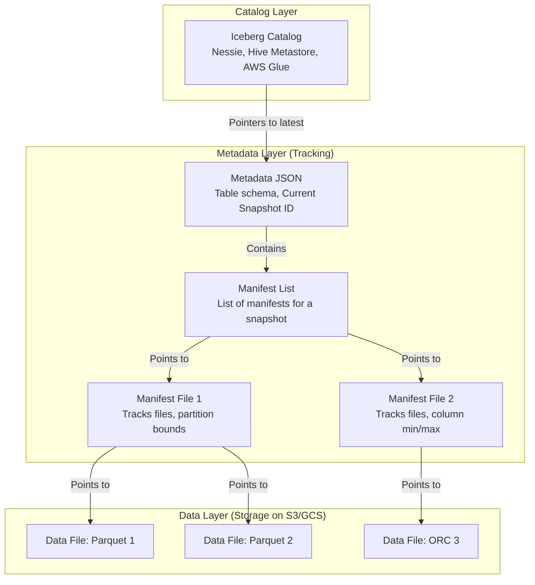

Khi xây dựng các kho dữ liệu phân tích khổng lồ, việc tối ưu hóa hiệu năng truy vấn và đảm bảo tính nhất quán dữ liệu luôn là những thử thách cực kỳ khó khăn. Để giải quyết vấn đề này, Netflix đã phát triển và giới thiệu **Apache Iceberg** – một định dạng bảng mở (Open [Table Format](/concepts/2-storage/data-lake-lakehouse/table-format/)) hiệu năng cao dành cho các kho dữ liệu quy mô Petabyte.

Đóng vai trò là một lớp quản lý siêu dữ liệu (Metadata Layer) trung gian nằm giữa các engine tính toán (như Spark, Trino, Flink, [Snowflake](/concepts/2-storage/cloud-data-platform/snowflake/)) và các hệ thống lưu trữ đám mây vật lý (S3, GCS, HDFS), Iceberg mang lại khả năng thực thi giao dịch ACID an toàn, nâng cấp cấu trúc bảng ([Schema Evolution](/concepts/2-storage/data-lake-lakehouse/schema-evolution/)) mượt mà và tính năng phân vùng ẩn (Hidden [Partitioning](/concepts/2-storage/database-storage/partitioning/)) độc đáo. Cùng với Delta Lake, Iceberg hiện đang là tiêu chuẩn thiết kế kiến trúc Lakehouse hiện đại.


## Cơn ác mộng Petabyte tại Netflix và sự sụp đổ của Apache Hive

Suốt một thời gian dài, Apache Hive là chuẩn mực chung để định nghĩa cấu trúc bảng dữ liệu trên Hadoop và [Data Lake](/concepts/2-storage/data-lake-lakehouse/data-lake/). Hive quản lý dữ liệu bằng cách theo dõi các thư mục vật lý (Folder-based). Ví dụ: một tệp tin Parquet khi được thả vào thư mục `year=2026/month=06` sẽ tự động được coi là thuộc về phân vùng (partition) tháng 6 năm 2026.

Tuy nhiên, khi quy mô dữ liệu của Netflix phình to lên hàng Petabyte, thiết kế dựa trên thư mục của Hive bắt đầu bộc lộ những điểm yếu chí mạng:

1. **Quá trình chuẩn bị truy vấn (Query Planning) quá chậm:** Nếu một bảng dữ liệu chứa khoảng 100.000 tệp tin, mỗi khi người dùng chạy câu lệnh `SELECT`, Hive hoặc Spark buộc phải gửi hàng ngàn yêu cầu API (list files) lên AWS S3 chỉ để quét toàn bộ cấu trúc thư mục nhằm tìm xem các file nằm ở đâu. Tác vụ khởi động này có thể tốn từ vài phút đến hàng chục phút trước khi câu truy vấn thực sự được bắt đầu tính toán.
2. **Thiếu tính nguyên tử (No ACID):** Nếu một tiến trình đang ghi dữ liệu vào thư mục S3 mà bị sập giữa chừng, một nửa dữ liệu mới và một nửa dữ liệu cũ sẽ bị trộn lẫn. Bất kỳ ai truy vấn bảng vào lúc đó sẽ đọc phải dữ liệu rác, chắp vá.
3. **Lỗi người dùng gây sập hệ thống (Full Table Scan):** Người dùng khi truy vấn bắt buộc phải tự biết cấu trúc phân vùng để viết câu lệnh điều kiện (ví dụ: `WHERE date_str = '2026-06-07'`). Nếu họ quên viết điều kiện này, Spark sẽ thực hiện quét toàn bộ (Full-scan) hàng Petabyte dữ liệu, làm hóa đơn tiền điện toán tăng vọt chỉ trong vài phút.

Đó là lý do Netflix quyết định thiết kế lại hoàn toàn cách theo dõi dữ liệu: quản lý ở cấp độ từng tệp tin (File-level) thay vì cấp độ thư mục (Folder-level), và Apache Iceberg ra đời từ đó.

## Triết lý thiết kế: Một bảng dữ liệu là tập hợp của các Files, không phải Thư mục

Ý tưởng cốt lõi làm nên sự khác biệt của Iceberg là: **"Một bảng dữ liệu thực chất là một tập hợp các Files, chứ không phải là một Thư mục chứa các Files."**

Bằng cách xây dựng một cây siêu dữ liệu phân cấp (Metadata files $\rightarrow$ Manifest lists $\rightarrow$ Manifest files), Iceberg theo dõi chính xác vị trí và thông tin của từng tệp tin dữ liệu vật lý (như Parquet, ORC). Nó biết rõ từng file chứa những cột nào, giá trị nhỏ nhất (min) và lớn nhất (max) của mỗi cột trong file đó là bao nhiêu.

Khi bạn chạy một câu truy vấn, Iceberg hoàn toàn không cần gọi API để quét thư mục lưu trữ. Nó chỉ cần tải cây siêu dữ liệu siêu nhỏ này vào bộ nhớ RAM, thực hiện cắt tỉa (Pruning) dựa trên các giá trị min/max để tìm ra chính xác những file Parquet chứa dữ liệu cần thiết. Quá trình chọn lọc thông minh này (Data Skipping) diễn ra chỉ trong vòng vài mili-giây, giúp tăng tốc độ truy vấn lên đáng kể.

## Những vũ khí tối tân làm nên thương hiệu của Iceberg

### 1. Giao dịch ACID chuẩn xác
Iceberg cung cấp cơ chế Snapshot Isolation. Khi một tiến trình đang ghi dữ liệu mới, người dùng khác đọc bảng vẫn nhìn thấy snapshot an toàn hiện tại. Chỉ khi tiến trình ghi thành công hoàn toàn và cập nhật con trỏ metadata, dữ liệu mới mới chính thức hiển thị.

### 2. Phân vùng ẩn (Hidden Partitioning)
Đây là tính năng độc quyền và cực kỳ đắt giá của Iceberg.
* Với Hive, nếu bạn có cột `timestamp` (ví dụ: `2026-06-07 10:15:00`), bạn phải viết code [ETL](/concepts/3-integration/etl-elt/etl/) để tạo thêm một cột phụ là `date_str = '2026-06-07'` và cấu hình phân vùng theo cột này. Người dùng truy vấn bắt buộc phải nhớ gõ `WHERE date_str = ...`.
* Với Iceberg, bạn chỉ cần chỉ định: *"Hãy phân vùng bảng theo ngày từ cột event_time"*. Iceberg sẽ tự động xử lý ngầm toàn bộ logic phân chia. Người dùng chỉ việc viết truy vấn tự nhiên: `WHERE event_time > '2026-06-07'`, Iceberg sẽ tự hiểu và chỉ quét đúng phân vùng của ngày đó, loại bỏ hoàn toàn nguy cơ quét nhầm toàn bộ bảng do sơ suất của con người.

### 3. Tiến hóa cấu trúc bảng không giới hạn (Schema Evolution)
Bạn có thể tự do đổi tên cột, xóa cột, đổi kiểu dữ liệu (từ INT sang BIGINT), thêm cột mới hoặc thay đổi thứ tự các cột mà không sợ làm hỏng dữ liệu lịch sử. Iceberg quản lý các cột bằng một ID duy nhất ẩn bên trong (ID-based) chứ không dựa vào tên cột (Name-based), do đó các tệp tin dữ liệu cũ bên dưới không bao giờ bị ảnh hưởng khi cấu trúc bảng thay đổi.

### 4. Quay ngược thời gian (Time Travel)
Iceberg cho phép bạn dễ dàng truy vấn dữ liệu của bảng tại một mốc thời gian cụ thể hoặc tại một Snapshot ID nhất định trong quá khứ, cực kỳ hữu ích cho việc đối chiếu báo cáo hoặc phục hồi dữ liệu khi xảy ra sự cố.

## Cân cảnh kiến trúc 3 tầng của Apache Iceberg

Hệ thống Iceberg quản lý một bảng dữ liệu thông qua cấu trúc phân cấp gồm 3 tầng rõ rệt:


Khi có yêu cầu đọc dữ liệu, luồng xử lý sẽ đi tuần tự từ **Catalog** (nơi lưu trữ con trỏ trỏ tới file metadata mới nhất) $\rightarrow$ đọc file **Metadata JSON** $\rightarrow$ duyệt qua **Manifest List** $\rightarrow$ chọn lọc các **Manifest Files** phù hợp $\rightarrow$ truy xuất trực tiếp các tệp tin dữ liệu vật lý (**Data Files**) tương ứng.

## Thực hành nhanh: Làm việc với Iceberg qua Spark SQL

### 1. Tạo bảng dữ liệu sử dụng Hidden Partitioning

```sql
CREATE TABLE local.db.events (
    event_id BIGINT,
    event_time TIMESTAMP,
    user_name STRING,
    event_type STRING
)
USING iceberg
-- Tự động gom nhóm phân vùng theo ngày dựa trên cột event_time
PARTITIONED BY (days(event_time));
```

### 2. Tiến hóa Schema: Đổi tên cột tức thì

```sql
-- Thao tác này chỉ mất vài mili-giây vì hệ thống chỉ cập nhật file metadata JSON
ALTER TABLE local.db.events 
RENAME COLUMN user_name TO account_id;
```

### 3. Truy vấn ngược thời gian (Time Travel)

```sql
-- Truy xuất dữ liệu tại một phiên bản snapshot cũ
SELECT * FROM local.db.events 
FOR SYSTEM_VERSION AS OF 10963874102873;
```

## Những nguyên tắc vàng khi vận hành Apache Iceberg

* **Lựa chọn Catalog đáng tin cậy:** Catalog chính là xương sống của Iceberg, nơi định vị file metadata mới nhất. Hãy ưu tiên sử dụng các dịch vụ Catalog chất lượng như AWS Glue, Snowflake Catalog hoặc Project Nessie (hỗ trợ quản lý phiên bản dữ liệu tương tự Git như tạo nhánh branch, merge dữ liệu).
* **Định kỳ tối ưu hóa tệp tin ([Compaction](/concepts/2-storage/data-lake-lakehouse/compaction/)):** Quá trình cập nhật hoặc xóa dữ liệu (DML) sẽ liên tục sinh ra các tệp tin nhỏ lẻ hoặc các file log thay đổi. Bạn cần lên lịch chạy các tác vụ Compaction (lệnh `rewriteDataFiles` trong Spark) định kỳ để gộp các file nhỏ thành các file Parquet có kích thước tối ưu (khoảng 128MB - 512MB).
* **Quản lý vòng đời Snapshot:** Để tránh việc kho lưu trữ phình to và cây siêu dữ liệu quá nặng nề, hãy lên lịch dọn dẹp các snapshot cũ (`ExpireSnapshots`) và xóa bỏ các tệp tin mồ côi (`DeleteOrphanFiles`) không còn liên kết với metadata hiện tại.

## Những sai lầm kinh điển dễ gây lãng phí tài nguyên

* **Bỏ quên các tệp tin mồ côi (Orphan Files):** Khi các tác vụ Spark bị lỗi đột ngột giữa chừng, các file Parquet rác có thể đã kịp ghi lên S3 nhưng không được ghi nhận trong file Manifest của Iceberg. Chúng sẽ nằm im lìm trên đĩa lưu trữ của bạn mãi mãi, làm tăng hóa đơn tiền cloud một cách vô ích. Hãy nhớ định kỳ quét và dọn dẹp các file này.
* **Cấu hình phân vùng quá nhỏ (Over-partitioning):** Việc phân vùng bảng theo một cột có quá nhiều giá trị riêng biệt (như cột `customer_id`) sẽ khiến Iceberg sinh ra hàng triệu file Manifest nhỏ. Việc xử lý siêu dữ liệu lúc này còn nặng nề hơn cả việc đọc dữ liệu thực tế, làm triệt tiêu hoàn toàn lợi thế về mặt hiệu năng của Iceberg.

## Điểm mạnh và điểm yếu

### Ưu điểm:
* **Tính mở tuyệt đối (True Open Source):** Không bị độc quyền bởi một nhà cung cấp phần mềm thương mại nào. Iceberg nhận được sự ủng hộ rộng rãi từ tất cả các ông lớn công nghệ như AWS, Google Cloud, Snowflake, Cloudera,...
* **Khả năng mở rộng vượt trội:** Tối ưu hóa siêu dữ liệu cực tốt cho các bảng dữ liệu quy mô khổng lồ lên tới hàng Petabyte.
* **Tính năng phân vùng ẩn (Hidden Partitioning):** Giúp ngăn chặn triệt để các lỗi truy vấn quét toàn bộ bảng do sơ suất của người dùng.

### Nhược điểm:
* **Yêu cầu kỹ năng vận hành cao:** So với Delta Lake (vốn được tối ưu sẵn chỉ bằng một nút bấm trên Databricks), việc thiết lập và tự vận hành Iceberg kết hợp với Spark, Kafka và Catalog đòi hỏi đội ngũ kỹ sư phải có nền tảng kỹ thuật hệ thống rất vững vàng.
* **Overhead lớn khi ghi streaming tần suất cao:** Nếu bạn liên tục ghi dữ liệu thời gian thực với hàng ngàn transaction mỗi giây, việc cập nhật và đồng bộ cây siêu dữ liệu liên tục sẽ tạo ra áp lực rất lớn cho hệ thống.

## Khi nào nên dùng và không nên dùng

* **Nên dùng khi:**
  * Bạn muốn xây dựng một hệ thống Open Lakehouse đa đám mây, đa nền tảng, không muốn bị khóa chặt (lock-in) vào bất kỳ nhà cung cấp dịch vụ nào.
  * Công ty của bạn sử dụng nhiều công cụ tính toán khác nhau (ví dụ: Data Science dùng Spark, phân tích BI dùng Trino/Athena, Finance dùng Snowflake) nhưng muốn tất cả cùng chia sẻ và truy vấn chung một vùng lưu trữ dữ liệu trung tâm.
  * Các bảng dữ liệu của bạn có dung lượng lưu trữ cực kỳ lớn (từ hàng trăm Terabyte đến Petabyte).

* **Không nên dùng khi:**
  * Doanh nghiệp của bạn đang sử dụng hệ sinh thái Databricks làm cốt lõi (khi đó Delta Lake sẽ là lựa chọn tối ưu hơn).
  * Quy mô dữ liệu của bạn nhỏ (dưới vài chục Gigabyte), việc thiết lập Iceberg chỉ làm tăng độ phức tạp của hệ thống mà không đem lại cải thiện hiệu năng nào rõ rệt.

## Các khái niệm liên quan

* [Data Lakehouse](/concepts/2-storage/data-lake-lakehouse/lakehouse/)
* [Delta Lake](/concepts/2-storage/data-lake-lakehouse/delta-lake/)
* [Apache Spark](/concepts/3-integration/batch-processing/apache-spark/)
* [Apache Iceberg Metadata Internals & Snapshot Management](/concepts/2-storage/data-lake-lakehouse/iceberg-metadata-internals/)

## Trọng tâm ôn luyện phỏng vấn

### 1. Hãy giải thích sự khác biệt giữa cơ chế phân vùng dựa trên thư mục (Folder-based partition) của Hive và phân vùng ẩn (Hidden Partition) của Iceberg. Tại sao Hidden Partition lại giúp ngăn chặn lỗi Full Table Scan?
* **Gợi ý trả lời:** Trong Hive, logic phân vùng gắn chặt với cấu trúc thư mục vật lý (ví dụ: `month=06`). Người dùng bắt buộc phải biết rõ cấu trúc này và viết đúng cột phân vùng trong câu lệnh `WHERE month=06`. Nếu họ lọc theo cột ngày gốc `WHERE order_date = '2026-06-01'`, Hive sẽ không hiểu và buộc phải quét toàn bộ bảng (Full Table Scan) để tìm dữ liệu. 
Trong khi đó, Iceberg tách biệt hoàn toàn logic logic lưu trữ vật lý khỏi logic hiển thị của người dùng. Nó tự động theo dõi mối quan hệ giữa cột ngày gốc `event_time` và cách phân vùng. Người dùng chỉ cần viết truy vấn tự nhiên theo cột ngày gốc, Iceberg sẽ tự động phân tích và chỉ quét đúng phân vùng cần thiết, loại bỏ hoàn toàn rủi ro Full Table Scan do thiếu sót của con người.

### 2. Tại sao việc đổi tên cột (Rename) trong Iceberg diễn ra tức thì mà không cần ghi đè lại toàn bộ file dữ liệu vật lý?
* **Gợi ý trả lời:** Các hệ thống cũ quản lý cột dựa trên tên gọi (Name-based). Nếu file Parquet gốc ghi tên cột là `user_id`, bạn không thể đổi tên hiển thị thành `account_id` nếu không ghi đè lại file Parquet đó để thay đổi dữ liệu vật lý bên trong. 
Iceberg giải quyết vấn đề này bằng cách gán cho mỗi cột một ID duy nhất ẩn bên trong (Unique Column ID). File Parquet vật lý dưới đĩa được đọc theo ID này (ví dụ ID `123`). Trong tệp `metadata.json`, Iceberg sẽ lưu bản đồ ánh xạ ID `123` tương ứng với tên hiển thị là `user_id`. Khi bạn chạy lệnh đổi tên cột thành `account_id`, Iceberg chỉ cập nhật lại bản đồ ánh xạ trong file `metadata.json` (ID `123` nay đổi tên hiển thị thành `account_id`). Thao tác sửa file JSON này chỉ mất vài mili-giây, còn các file Parquet vật lý bên dưới vẫn giữ nguyên vì chúng chỉ quan tâm đến ID `123`.

## Xem thêm các khái niệm liên quan
* [ACID Transactions trên Data Lake](/concepts/2-storage/data-lake-lakehouse/acid-transactions-on-lake/)
* [Apache Hudi](/concepts/2-storage/data-lake-lakehouse/apache-hudi/)
* [Compaction](/concepts/2-storage/data-lake-lakehouse/compaction/)

## Tài liệu tham khảo

1. [Apache Iceberg Table Spec](https://iceberg.apache.org/spec/) - Detailed specifications of the Iceberg table format including manifest and metadata layouts.
2. [Apache Iceberg GitHub Repository](https://github.com/apache/iceberg) - The official open-source code repository and community hub for Apache Iceberg.
3. [Incremental Processing using Netflix Maestro and Apache Iceberg](https://netflixtechblog.com/incremental-processing-using-netflix-maestro-and-apache-iceberg-e4c19460a876) - Netflix Tech Blog post explaining how Iceberg enables low-latency incremental data processing.
4. [Snowflake Iceberg Tables Guide](https://docs.snowflake.com/en/user-guide/tables-iceberg) - Snowflake's documentation on configuring and querying external Apache Iceberg tables.
5. [Fundamentals of Data Engineering](https://www.oreilly.com/library/view/fundamentals-of-data/9781098108298/) - Joe Reis and Matt Housley's book on modern data systems, storage, and architecture.
6. [AWS Athena - Querying Iceberg Tables](https://docs.aws.amazon.com/athena/latest/ug/querying-iceberg.html) - AWS documentation on using Athena to query transactional Iceberg tables stored on Amazon S3.
7. [Google Cloud Dataproc - Iceberg Connection](https://cloud.google.com/dataproc/docs/concepts/connectors/apache-iceberg) - Google Cloud documentation on integrating Dataproc with Iceberg.
8. [Microsoft Azure Synapse - Iceberg Integration](https://azure.microsoft.com/en-us/blog/apache-iceberg-support-on-azure/) - Microsoft Azure blog detailing Iceberg support.
9. [Confluent - Iceberg Metadata Sync](https://www.confluent.io/blog/iceberg-on-confluent/) - Confluent blog post on streaming data directly into Apache Iceberg.

## English Summary

Apache Iceberg is a high-performance open table format designed to manage massive analytics datasets on Data Lakes (Lakehouse architecture). Originating at Netflix to solve the severe performance scalability and reliability issues of Apache Hive, Iceberg completely abandons folder-based tracking in favor of precise, file-level metadata tracking (via Manifest trees). This innovative design enables robust ACID transactions, safe and instant Schema Evolution (via unique column IDs), and the game-changing "Hidden Partitioning" feature, which protects users from accidental full-table scans without requiring them to know the physical data layout. As an independent open standard, Iceberg serves as the universal metadata bridge allowing various analytical engines (Spark, Trino, Snowflake) to concurrently process petabytes of data on cost-effective [cloud storage](/concepts/2-storage/cloud-data-platform/cloud-storage/).