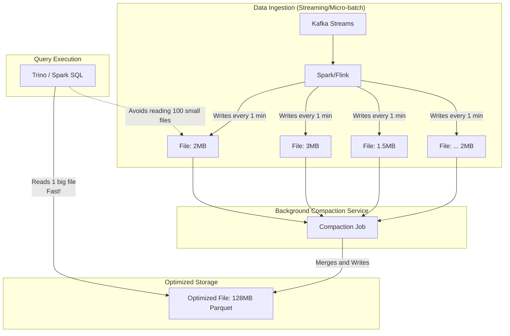

Trong thế giới [Data Engineering](/concepts/1-foundations/foundation/data-engineering/), việc thiết lập các luồng dữ liệu streaming hay micro-batch để liên tục cập nhật thông tin thời gian thực là một yêu cầu cực kỳ phổ biến. Thế nhưng, đằng sau sự tiện lợi đó ẩn chứa một "bệnh lý" kinh điển của hệ thống lưu trữ: sự xuất hiện của hàng triệu file nhỏ lẻ. **Compaction (Gom tệp)** chính là phương thuốc đặc trị, đóng vai trò như một người dọn dẹp âm thầm giúp duy trì hiệu năng đỉnh cao cho toàn bộ hệ thống [Data Lake](/concepts/2-storage/data-lake-lakehouse/data-lake/) của doanh nghiệp.

## Compaction: Người dọn dẹp âm thầm phía sau Data Lake

Về mặt định nghĩa, **Compaction** là quá trình bảo trì định kỳ chạy ẩn nhằm gom hàng ngàn tệp tin dữ liệu có kích thước quá nhỏ thành một số lượng ít hơn các tệp tin có kích thước tối ưu hơn. 

Khi các luồng dữ liệu liên tục đổ về Data Lake, chúng thường được ghi xuống dưới dạng các file nhỏ (từ vài chục KB đến vài MB). Tiến trình Compaction sẽ làm nhiệm vụ đọc các file vụn vặt này lên bộ nhớ RAM, giải nén, sắp xếp, gộp chúng lại rồi ghi ra đĩa thành các file mới có dung lượng chuẩn mực hơn (thường từ `128MB đến 1GB` tùy thuộc vào thiết lập hệ thống).

Trong các kiến trúc [Table Format](/concepts/2-storage/data-lake-lakehouse/table-format/) hiện đại như Apache Hudi, Delta Lake hay [Apache Iceberg](/concepts/2-storage/data-lake-lakehouse/apache-iceberg/), Compaction còn đảm nhận thêm việc dọn dẹp các bản ghi cũ bị xóa cứng `(deletions)` hoặc hợp nhất các file nhật ký biến động `(changelogs)` vào file dữ liệu gốc `(base files)` để tối ưu hóa tối đa cấu trúc lưu trữ.

## "Nỗi sợ hãi" mang tên Tệp tin nhỏ (Small Files Problem)

Tại sao các kỹ sư dữ liệu lại e sợ các file nhỏ đến vậy? Việc ghi dữ liệu liên tục theo giây/phút sẽ dẫn đến hiện tượng tích tụ hàng triệu file nhỏ trên [Cloud Storage](/concepts/2-storage/cloud-data-platform/cloud-storage/) (như Amazon S3 hay GCS) sau một thời gian ngắn. Điều này dẫn tới 3 hậu quả nghiêm trọng:

1. **Nghẽn cổ chai khi liệt kê file (Listing Bottleneck)**: Các công cụ truy vấn như Spark, Presto hay Trino trước khi thực sự đọc dữ liệu đều phải gửi yêu cầu liệt kê danh sách tệp tin hiện có. Việc phải xếp hàng liệt kê hàng triệu file trên S3 có thể tốn của bạn hàng chục phút chỉ để... bắt đầu chạy câu lệnh `SELECT`.
2. **Quá tải kết nối mạng (File Opening Latency)**: Mỗi khi mở một file trên Cloud, hệ thống luôn phải chịu một độ trễ kết nối mạng cố định. Việc mở 1 triệu file kích thước 10KB sẽ tốn thời gian hơn hàng trăm lần so với việc mở 10 file kích thước 1GB, dù tổng dung lượng dữ liệu là như nhau.
3. **Giảm hiệu quả nén dữ liệu**: Các định dạng file cột như Parquet sử dụng các thuật toán nén mạnh mẽ (như Snappy hay Zstd). Tuy nhiên, các thuật toán này cần một lượng dữ liệu đủ lớn để phân tích và tạo từ điển nén tối ưu. Nếu file quá nhỏ, khả năng nén sẽ cực kỳ kém, làm lãng phí dung lượng lưu trữ.

## Bản chất của Compaction: Sự đánh đổi khôn ngoan

Triết lý cốt lõi của Compaction là chấp nhận **đánh đổi tài nguyên tính toán (CPU/RAM)** chạy ngầm ở chế độ nền để đổi lấy **tốc độ truy vấn đọc dữ liệu (Read Performance)** cực nhanh ở tầng người dùng.

Tùy vào nhu cầu hệ thống, bạn có thể lựa chọn hai hướng triển khai chính:

* **Synchronous Compaction (Gom tệp đồng bộ)**: Hệ thống cố gắng thực hiện gộp tệp ngay lập tức cùng lúc với câu lệnh ghi dữ liệu. Cách này giúp dữ liệu luôn sạch sẽ nhưng sẽ làm chậm tiến trình nạp dữ liệu đầu vào `(Ingestion)`. Thao tác này thường được kích hoạt qua câu lệnh `OPTIMIZE`.
* **Asynchronous Compaction (Gom tệp bất đồng bộ)**: Quy trình ghi cứ việc đẩy dữ liệu xuống đĩa nhanh nhất có thể dưới dạng các file nhỏ. Một tiến trình chạy ngầm độc lập sẽ âm thầm quét các file này và gộp chúng lại sau mà không làm gián đoạn luồng ghi chính.

## Sơ đồ hóa quy trình Gom tệp chạy nền

Hãy quan sát luồng đi của dữ liệu từ khi được ghi dưới dạng các file nhỏ bởi Spark/Flink cho đến khi được gộp thành file lớn tối ưu:


## Làm thế nào để thực hiện Compaction? (Ví dụ thực tế)

Trong môi trường Delta Lake chạy trên nền [Apache Spark](/concepts/3-integration/batch-processing/apache-spark/), bạn có thể kích hoạt quy trình gom file thủ công cực kỳ đơn giản bằng lệnh `OPTIMIZE`:
```sql
-- Gom toàn bộ các file nhỏ trong bảng thành các file lớn tối ưu (mặc định là 1GB)
OPTIMIZE delta.`s3://bucket/events_table`;

-- Kết hợp gom tệp với kỹ thuật sắp xếp đa chiều Z-Ordering để tăng tốc truy vấn lọc
OPTIMIZE delta.`s3://bucket/events_table` ZORDER BY (customer_id, event_date);
```

Đối với hệ thống Apache Iceberg, chúng ta có thể sử dụng Java API để gọi tiến trình gom tệp nền như sau:
```java
// Kích hoạt tiến trình gom tệp nền trong Iceberg
SparkActions
    .get()
    .rewriteDataFiles(table)
    .filter(Expressions.equal("date", "2026-06-07")) // Chỉ gom tệp tại phân vùng ngày cụ thể
    .option("target-file-size-bytes", Long.toString(512 * 1024 * 1024)) // Đặt mục tiêu file ra là 512 MB
    .execute();
```

## Nghệ thuật triển khai Compaction (Best Practices)

* **Thiết lập mục tiêu kích thước file hợp lý**: Dung lượng tệp lý tưởng phụ thuộc vào hạ tầng của bạn. Với HDFS truyền thống, con số tốt nhất thường là 128MB để khớp với kích thước block size của HDFS. Với Cloud Object Storage (S3/GCS), kích thước từ `256MB đến 1GB` mang lại sự cân bằng hoàn hảo nhất giữa tốc độ tải song song và băng thông mạng.
* **Lên lịch chạy vào giờ thấp điểm**: Tiến trình gom file tiêu tốn rất nhiều CPU và tài nguyên mạng. Hãy thiết lập lịch chạy tự động `(Cron Job)` vào lúc nửa đêm hoặc cuối tuần khi hệ thống ít người dùng, tránh gây ảnh hưởng đến các job [ETL](/concepts/3-integration/etl-elt/etl/) nghiệp vụ chính vào ban ngày.
* **Chỉ tập trung vào các phân vùng "nóng"**: Đừng lãng phí tài nguyên quét toàn bộ Data Lake quy mô Petabytes. Hãy viết script cấu hình chỉ thực hiện Compaction cho dữ liệu của vài ngày gần nhất – nơi dữ liệu mới liên tục được chèn vào. Dữ liệu lịch sử của các tháng trước đa số đã ổn định và không cần phải xử lý lại.

## Những cạm bẫy dễ mắc phải khi gom tệp

* **Thiết lập kích thước file đích quá lớn**: Nếu bạn cố ép hệ thống gom file thành các tệp khổng lồ từ 5GB-10GB, bạn sẽ tự đánh mất khả năng đọc song song của Spark. Một Spark Worker (chạy đơn nhân) sẽ mất rất nhiều thời gian và bộ nhớ RAM để kéo và giải nén hết 10GB dữ liệu này, dễ dẫn đến lỗi tràn bộ nhớ `(OOM)`.
* **Tần suất chạy compaction quá dày đặc**: Chạy compaction liên tục mỗi 5 phút một lần sẽ gây ra hiện tượng khuếch đại ghi `(Write Amplification)`. Một bản ghi dữ liệu sẽ liên tục bị đọc ra và ghi lại nhiều lần một cách vô ích, làm tốn chi phí hạ tầng không cần thiết. Hãy chỉ chạy Compaction khi số lượng file nhỏ đạt tới một ngưỡng quy định.

## Điểm mạnh và điểm yếu

### Ưu điểm
* Giải quyết triệt để vấn đề "Small Files Problem".
* Giảm tải áp lực lưu trữ metadata cho Catalog (như Hive Metastore), giúp việc lập kế hoạch truy vấn `(query planning)` diễn ra nhanh chóng hơn.
* Tăng tốc độ đọc dữ liệu lên gấp nhiều lần nhờ tối ưu hóa băng thông mạng và thuật toán nén tệp.

### Nhược điểm
* Tiêu tốn tài nguyên hệ thống (CPU/RAM/Disk I/O) cho tiến trình đọc-sắp xếp-ghi lại dữ liệu.
* Hiện tượng khuếch đại ghi: Dữ liệu phải được ghi xuống ổ đĩa nhiều lần qua các chu kỳ gom tệp.

## Khi nào nên dùng và không nên dùng

**Nên dùng khi:**
* Bạn xây dựng các hệ thống Data Lake / Data [Lakehouse](/concepts/2-storage/data-lake-lakehouse/lakehouse/) thu thập dữ liệu dạng streaming (từ Kafka, CDC) hoặc micro-batches liên tục.
* Nhận thấy tốc độ của các câu lệnh SQL bắt đầu bị chậm dần theo thời gian dù lượng dữ liệu thực tế tăng không nhiều.
* Hệ thống của bạn phục vụ các thiết bị IoT gửi logs liên tục với tần suất cao.

**Không cần áp dụng khi:**
* Hệ thống của bạn chủ yếu xử lý theo lô định kỳ 1 lần mỗi ngày (Daily Batch ETL). Bản thân các job batch nếu được thiết kế phân vùng hợp lý (ví dụ dùng `repartition()` trước khi ghi) đã có thể tạo ra các file có kích thước lý tưởng ngay từ đầu.

## Trọng tâm ôn luyện phỏng vấn

### 1. Tại sao "Small Files Problem" lại gây ảnh hưởng đến hiệu năng của Hadoop HDFS nghiêm trọng hơn so với Amazon S3?
* **Mục đích câu hỏi**: Kiểm tra kiến thức chuyên sâu của ứng viên về kiến trúc hệ thống tệp phân tán (HDFS NameNode) và Cloud Storage.
* **Gợi ý trả lời**:
  * Trong kiến trúc Hadoop HDFS, mọi thông tin siêu dữ liệu (metadata) như đường dẫn tệp tin, vị trí của các blocks đều được quản lý tập trung và lưu trữ trực tiếp trên RAM của nút NameNode để phục vụ tra cứu nhanh. Trung bình, mỗi tệp tin (dù dung lượng chỉ vài KB) đều tiêu tốn khoảng 150 bytes trên RAM của NameNode. Nếu hệ thống tích tụ hàng trăm triệu file nhỏ, NameNode sẽ bị cạn kiệt RAM và sập cụm máy chủ, bất kể dung lượng đĩa cứng ở các DataNode bên dưới còn trống bao nhiêu.
  * Ngược lại, Amazon S3 được thiết kế với kiến trúc metadata phân tán khổng lồ nên không lo ngại vấn đề sập RAM. Tuy nhiên, nếu có quá nhiều file nhỏ, bạn sẽ chịu thiệt hại về tốc độ liệt kê file `(listing)` cực kỳ chậm và có nguy cơ bị S3 giới hạn request `(throttling)`.

### 2. Sự khác biệt giữa Asynchronous Compaction và Synchronous Compaction (như OPTIMIZE). Khi nào nên dùng loại nào?
* **Mục đích câu hỏi**: Đánh giá khả năng thiết kế và vận hành luồng dữ liệu ([Data Pipeline](/concepts/1-foundations/foundation/data-pipeline/) Architecture) của ứng viên.
* **Gợi ý trả lời**:
  * *Synchronous Compaction*: Được thực thi ngay trong luồng ghi chính của ứng dụng. Ưu điểm là dữ liệu ở đích luôn được tối ưu và sạch sẽ, nhưng nhược điểm là làm tăng thời gian hoàn thành tác vụ ghi `(write latency)`, không thích hợp cho các pipeline streaming thời gian thực yêu cầu ghi nhanh.
  * *Asynchronous Compaction*: Chạy như một tiến trình ngầm độc lập hoàn toàn với luồng ghi chính. Luồng ghi cứ việc chèn file nhỏ xuống đĩa để đạt tốc độ tối đa. Tiến trình ngầm sẽ gom dữ liệu sau đó. Đây là lựa chọn bắt buộc cho các luồng streaming thời gian thực (như kiến trúc Merge-on-Read của Apache Hudi).

## Khái niệm liên quan

* Data Lakehouse
* [Apache Hudi](/concepts/2-storage/data-lake-lakehouse/apache-hudi/)
* [Delta Lake](/concepts/2-storage/data-lake-lakehouse/delta-lake/)
* [Data Ingestion](/concepts/3-integration/etl-elt/data-ingestion/)

## Xem thêm các khái niệm liên quan
* [ACID Transactions trên Data Lake](/concepts/2-storage/data-lake-lakehouse/acid-transactions-on-lake/)
* [Apache Hudi](/concepts/2-storage/data-lake-lakehouse/apache-hudi/)
* [Apache Iceberg - Định dạng bảng thế hệ mới](/concepts/2-storage/data-lake-lakehouse/apache-iceberg/)

## Tài liệu tham khảo

1. [Databricks: Optimize Data File Layout](https://docs.databricks.com/en/delta/optimize.html) - Official guide on using the OPTIMIZE command to compact Delta Lake files.
2. [Apache Hudi Compaction Guide](https://hudi.apache.org/docs/compaction/) - Technical documentation explaining compaction execution and tuning for Hudi tables.
3. [Apache Iceberg Spark Procedures: rewrite_data_files](https://iceberg.apache.org/docs/latest/spark-procedures/) - Official Iceberg guide on compaction procedures using Spark.
4. [Snowflake Automatic Clustering and Compaction](https://docs.snowflake.com/en/user-guide/tables-auto-reclustering) - Explanation of [Snowflake](/concepts/2-storage/cloud-data-platform/snowflake/)'s background services that automatically cluster and compact micro-partitions.
5. [Hadoop: The Definitive Guide](https://www.oreilly.com/library/view/hadoop-the-definitive/9781491901687/) - Tom White's authoritative book covering HDFS block sizing and the small files problem.
6. [AWS EMR: Iceberg Compaction](https://docs.aws.amazon.com/emr/latest/ReleaseGuide/emr-iceberg.html) - AWS documentation on how to perform compaction for Apache Iceberg on Amazon EMR.
7. [Google Cloud Dataproc - Iceberg Compaction Procedures](https://cloud.google.com/dataproc/docs/concepts/connectors/apache-iceberg) - Google Cloud documentation detailing compaction integration.
8. [Microsoft Azure Databricks Delta Lake Optimization](https://azure.microsoft.com/en-us/blog/azure-databricks-delta-lake-now-generally-available/) - Microsoft Azure documentation detailing Delta Lake optimization and compaction.
9. [Confluent - Iceberg Streaming Compaction](https://www.confluent.io/blog/iceberg-on-confluent/) - Confluent blog detailing streaming ingestion and compaction.

## English Summary

Compaction is a crucial background maintenance process in Data Engineering designed to solve the "Small Files Problem." When data is ingested continuously via streaming or micro-batches, it creates millions of tiny files that severely degrade query performance due to metadata listing overhead, inefficient file opening times, and poor compression ratios. Compaction asynchronously (or synchronously via OPTIMIZE commands) reads these small files, merges them, and rewrites them into larger, optimally-sized blocks (e.g., 256MB - 1GB Parquet files). This drastically improves read performance and reduces metadata catalog pressure in modern Data Lakehouses.