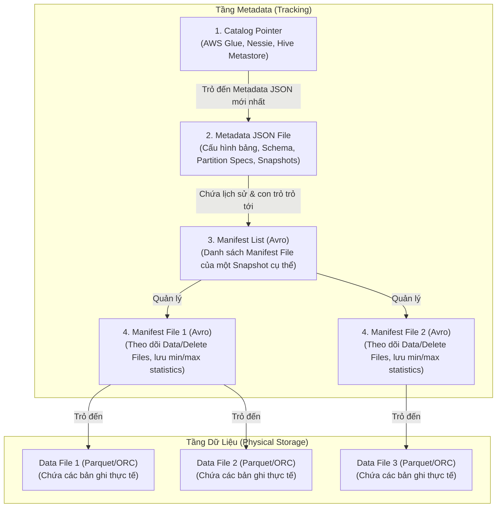

Để xây dựng một kiến trúc [Data Lakehouse](/concepts/2-storage/data-lake-lakehouse/lakehouse/) hiện đại hoạt động ổn định ở quy mô Petabyte, việc hiểu rõ cơ chế vận hành bên dưới của các định dạng bảng (Table Format) là cực kỳ quan trọng. Trong số các định dạng phổ biến hiện nay, [Apache Iceberg](/concepts/2-storage/data-lake-lakehouse/apache-iceberg/) nổi bật nhờ thiết kế cây Metadata phân cấp (Hierarchical Metadata Tree) thông minh. Thiết kế này loại bỏ hoàn toàn sự phụ thuộc vào cấu trúc thư mục vật lý của hệ thống file, mang lại khả năng xử lý giao dịch ACID, tiến hóa cấu trúc bảng ([Schema Evolution](/concepts/2-storage/data-lake-lakehouse/schema-evolution/)) và phân vùng động (Partition Evolution) vô cùng linh hoạt.

Bài viết này đi sâu vào phân tích cấu trúc Metadata nội bộ của Apache Iceberg, cơ chế hoạt động của các giao dịch đồng thời và các kỹ thuật quản lý Snapshot nâng cao nhằm duy trì [tối ưu hóa hiệu năng Lakehouse](/concepts/2-storage/data-lake-lakehouse/lakehouse-optimization/) qua thời gian.

---

## 1. Cấu trúc cây Metadata phân cấp (Hierarchical Metadata Tree)

Khác biệt cốt lõi giữa Apache Iceberg và Apache Hive truyền thống là cách theo dõi dữ liệu. Hive quản lý dữ liệu ở cấp độ thư mục (Folder-level), dẫn đến các vấn đề nghiêm trọng về hiệu năng khi số lượng tệp tin lớn. Ngược lại, Iceberg quản lý dữ liệu ở cấp độ tệp tin (File-level) thông qua một cấu trúc cây Metadata phân cấp chặt chẽ gồm 4 tầng.



### 1.1. Catalog Pointer (Con trỏ danh mục)
Catalog đóng vai trò là nguồn sự thật duy nhất (Single Source of Truth) lưu trữ vị trí của tệp tin Metadata JSON hiện tại. Khi một câu truy vấn được thực thi, engine (ví dụ: Amazon Athena, Spark, Trino) sẽ giao tiếp với Catalog để lấy đường dẫn chính xác của tệp tin Metadata JSON mới nhất.
Các dịch vụ Catalog phổ biến bao gồm **AWS Glue Data Catalog**, **Project Nessie**, **Hive Metastore**, hoặc các bảng cơ sở dữ liệu quan hệ (JDBC).

### 1.2. Metadata JSON File (Tệp siêu dữ liệu gốc)
Tệp Metadata JSON lưu trữ toàn bộ lịch sử cấu trúc và trạng thái của bảng tại mọi thời điểm. Các thông tin chính bao gồm:
*   **Schema hiện tại và lịch sử cấu trúc bảng:** Định nghĩa kiểu dữ liệu và Column ID của từng cột.
*   **Partition Specs:** Lịch sử cấu trúc phân vùng của bảng.
*   **Lịch sử Snapshots (Snapshot History):** Danh sách tất cả các Snapshot hợp lệ cùng với thời gian tạo và đường dẫn đến tệp tin Manifest List tương ứng của chúng.
*   **Table Properties:** Các tham số cấu hình vận hành bảng.

### 1.3. Manifest List (Danh sách tệp kê khai)
Mỗi Snapshot trong Iceberg tương ứng với một tệp Manifest List (định dạng Avro). Tệp này chứa danh sách các Manifest File tạo nên Snapshot đó.
Để tối ưu hóa quá trình lập kế hoạch truy vấn (Query Planning), Manifest List lưu trữ các thông tin thống kê tổng hợp cho từng Manifest File:
*   Phân vùng vật lý mà Manifest File đó quản lý.
*   Số lượng tệp dữ liệu được thêm, sửa, hoặc xóa.
*   Khoảng giá trị phân vùng (partition bounds) mà các tệp dữ liệu bên trong Manifest File bao phủ.
Nhờ các thông tin này, engine truy vấn có thể thực hiện **Manifest Pruning** (cắt tỉa tệp kê khai) ngay lập tức mà không cần tải hay đọc nội dung chi tiết của các Manifest File không liên quan.

### 1.4. Manifest File (Tệp kê khai chi tiết)
Manifest File (định dạng Avro) theo dõi chi tiết từng Data File (tệp dữ liệu) hoặc Delete File (tệp xóa). Đối với mỗi tệp dữ liệu vật lý, Manifest File lưu trữ:
*   Đường dẫn lưu trữ tuyệt đối (URI) của tệp dữ liệu.
*   Định dạng tệp (Parquet, ORC, Avro).
*   Thông tin thống kê cấp cột (Column-level statistics): số lượng giá trị null, số lượng bản ghi, giá trị nhỏ nhất (min) và giá trị lớn nhất (max) của từng cột.
Các số liệu thống kê này là nền tảng cho cơ chế **Data Skipping** (bỏ qua dữ liệu). Engine tính toán có thể dùng bộ lọc của câu lệnh SQL đối chiếu với giá trị min/max của từng file để loại bỏ các tệp tin không chứa dữ liệu cần tìm mà không cần mở chúng ra đọc.

---

## 2. Cơ chế giao dịch ACID & Kiểm soát đồng thời lạc quan (Optimistic Concurrency Control)

Một trong những tính năng mạnh mẽ nhất của Apache Iceberg là khả năng cung cấp giao dịch ACID hoàn chỉnh, hỗ trợ đồng thời nhiều tiến trình đọc ghi mà không gây xung đột dữ liệu. Để làm được điều này, Iceberg sử dụng cơ chế **Snapshot Isolation** (Cô lập ảnh chụp nhanh) kết hợp với **Optimistic Concurrency Control - OCC** (Kiểm soát truy cập đồng thời lạc quan).

### 2.1. Snapshot Isolation (Cô lập ảnh chụp nhanh)
Khi một tiến trình đọc bắt đầu, nó sẽ truy vấn Catalog để xác định Snapshot ID mới nhất tại thời điểm đó và chỉ đọc dữ liệu thuộc Snapshot này. Ngay cả khi có một tiến trình ghi đang diễn ra song song và tạo ra các tệp dữ liệu mới, tiến trình đọc vẫn hoàn toàn không bị ảnh hưởng vì nó truy cập qua một cây Metadata tĩnh. Điều này đảm bảo tính nhất quán của dữ liệu đọc (Read Consistency).

### 2.2. Quy trình Commit của Giao dịch ghi
Quy trình thêm hoặc cập nhật dữ liệu diễn ra theo các bước sau:
1.  **Read:** Tiến trình ghi đọc Metadata JSON hiện hành để xác định trạng thái bảng hiện tại.
2.  **Write:** Tiến trình ghi tạo ra các Data Files mới trên bộ nhớ đám mây (S3/GCS) và tạo các Manifest Files tương ứng để theo dõi chúng.
3.  **Prepare:** Tạo một tệp Manifest List mới trỏ đến các Manifest Files mới viết cùng các Manifest Files cũ vẫn còn hiệu lực. Sau đó, tiến trình tạo một file Metadata JSON mới chứa Snapshot ID mới trỏ đến Manifest List này.
4.  **Commit:** Tiến trình ghi cố gắng cập nhật Catalog Pointer từ Metadata JSON cũ sang Metadata JSON mới một cách nguyên tử (Atomic Swap).

### 2.3. Giải quyết xung đột ghi đồng thời (Conflict Resolution)
Nếu hai tiến trình ghi (Writer A và Writer B) cùng thực hiện commit song song:
1.  Cả hai đều đọc cùng một phiên bản Metadata gốc (ví dụ: `v1.json`).
2.  Writer A thực hiện cập nhật Catalog Pointer thành công và tạo ra phiên bản `v2.json`.
3.  Writer B cố gắng commit nhưng Catalog phát hiện con trỏ hiện tại đã thay đổi từ `v1.json` sang `v2.json`. Yêu cầu cập nhật của Writer B bị từ chối.
4.  Lúc này, thay vì lập tức báo lỗi thất bại, Writer B sẽ thực hiện kiểm tra xung đột (Conflict Validation). Writer B đọc `v2.json` để kiểm tra xem các thay đổi mà Writer A vừa commit có tác động đến cùng các phân vùng dữ liệu mà Writer B đang cố gắng sửa đổi hay không.
    *   **Không xung đột:** Nếu Writer A ghi vào phân vùng `year=2026/month=05` còn Writer B ghi vào phân vùng `year=2026/month=06`, Iceberg sẽ tự động trộn (merge) hai thay đổi này. Writer B viết lại tệp Metadata JSON mới trỏ đến snapshot của Writer A và thử commit lại (retry) lần nữa.
    *   **Có xung đột:** Nếu cả hai cùng chỉnh sửa hoặc xóa dữ liệu trên cùng một tập dữ liệu hoặc phân vùng trùng lặp, giao dịch của Writer B sẽ bị huỷ bỏ (abort) và hệ thống sẽ ném ra ngoại lệ `CommitFailedException`.

---

## 3. Tiến hóa Schema & Phân vùng động (Schema & Partition Evolution)

### 3.1. Schema Evolution bằng Column IDs (Tiến hóa cấu trúc bảng)
Trong các định dạng bảng truyền thống như Hive, cấu trúc bảng được quản lý bằng tên cột (Name-based). Khi bạn đổi tên một cột từ `user_name` thành `customer_id`, engine sẽ không thể đọc được dữ liệu lịch sử trong các tệp Parquet cũ (vốn vẫn lưu nhãn `user_name`).

Iceberg giải quyết triệt để vấn đề này bằng cơ chế quản lý dựa trên **Column IDs** (Định danh cột):
*   Khi tạo bảng, mỗi cột được gán một ID số nguyên duy nhất và không bao giờ thay đổi (ví dụ: `name` $\rightarrow$ ID 1, `age` $\rightarrow$ ID 2).
*   Các tệp dữ liệu vật lý (Parquet/ORC) lưu trữ dữ liệu và ánh xạ cấu trúc theo Column ID này chứ không phải theo tên cột.
*   Tệp Metadata JSON lưu bản đồ ánh xạ (mapping) giữa tên hiển thị hiện tại và Column ID tương ứng.

Nhờ cơ chế này, các thao tác thay đổi cấu trúc bảng diễn ra vô cùng nhanh chóng (chỉ mất vài mili-giây để cập nhật tệp Metadata JSON) và an toàn tuyệt đối:
*   **Đổi tên cột:** Hệ thống chỉ thay đổi nhãn hiển thị ánh xạ với Column ID trong Metadata JSON. Dữ liệu vật lý bên dưới không cần viết lại.
*   **Thêm cột:** Gán một ID mới chưa từng xuất hiện. Khi truy vấn các file dữ liệu cũ không chứa ID này, engine tự động trả về giá trị `null`.
*   **Xóa cột:** Loại bỏ Column ID khỏi danh sách schema hoạt động trong Metadata. Engine sẽ bỏ qua dữ liệu của ID này khi đọc.

### 3.2. Partition Evolution (Tiến hóa cấu trúc phân vùng)
Một trong những cải tiến đột phá nhất của Iceberg là khả năng tiến hóa cấu trúc phân vùng (Partition Evolution) theo thời gian mà không cần ghi lại (rewrite) toàn bộ dữ liệu lịch sử.

Khi thay đổi cấu trúc phân vùng (ví dụ: chuyển từ phân vùng theo tháng `month(event_time)` sang phân vùng theo ngày `day(event_time)` do lượng dữ liệu tăng đột biến):
1.  Iceberg tạo một **Partition Spec** mới với một Spec ID mới (ví dụ Spec ID 1, trong khi cấu trúc cũ là Spec ID 0).
2.  Dữ liệu mới ghi vào bảng kể từ thời điểm này sẽ được tổ chức vật lý theo cấu trúc phân vùng mới (Spec ID 1).
3.  Dữ liệu lịch sử cũ (Spec ID 0) được giữ nguyên vị trí, không cần di chuyển hay ghi đè.
4.  Khi thực hiện truy vấn, engine sẽ đọc thông tin Spec ID đi kèm với từng tệp dữ liệu trong Manifest File. Iceberg tự động áp dụng bộ lọc phân vùng tương ứng với từng Spec ID để lọc các tệp dữ liệu phù hợp, sau đó gộp kết quả lại một cách trong suốt đối với người dùng.

---

## 4. Quản lý Snapshot & Các kỹ thuật dọn dẹp dữ liệu (Snapshot Management & Maintenance)

Mỗi giao dịch ghi thành công trong Iceberg tạo ra một Snapshot mới. Mặc dù điều này giúp thực hiện tính năng quay ngược thời gian (Time Travel) dễ dàng, việc tích tụ quá nhiều Snapshot qua thời gian sẽ làm phình to dung lượng lưu trữ siêu dữ liệu và dữ liệu vật lý, trực tiếp ảnh hưởng đến tốc độ lập kế hoạch truy vấn.

Để duy trì hiệu năng tối ưu, hệ thống cần thực hiện các công việc bảo trì định kỳ sau:

### 4.1. Hết hạn Snapshot (Snapshot Expiration)
Tác vụ `expireSnapshots` dùng để gỡ bỏ các Snapshot cũ vượt quá thời gian lưu trữ cấu hình (Retention Period) hoặc số lượng snapshot tối đa cho phép.
Quy trình thực hiện bao gồm:
1.  Xác định các Snapshot nằm ngoài khoảng thời gian hiệu lực và không cần giữ lại.
2.  Xóa bỏ các bản ghi Snapshot này khỏi danh sách lịch sử trong tệp Metadata JSON.
3.  Quét các tệp dữ liệu vật lý (Data Files, Delete Files) và tệp Metadata. Nếu một tệp tin không còn được tham chiếu bởi bất kỳ Snapshot hoạt động nào nữa, Iceberg sẽ thực hiện xóa vật lý tệp đó khỏi bộ nhớ đám mây (S3/GCS).

```sql
-- Thực thi hết hạn Snapshot thông qua Spark SQL
CALL local.system.expire_snapshots(
    table => 'db.events', 
    older_than => TIMESTAMP '2026-06-01 00:00:00',
    retain_last => 10
);
```

### 4.2. Dọn dẹp tệp tin mồ côi (Orphan Files Cleanup)
Trong quá trình vận hành, các sự cố đột ngột như lỗi mạng, Spark Executor bị tràn bộ nhớ (OOM), hoặc tiến trình ghi bị ép buộc dừng (kill) có thể khiến các tệp dữ liệu vật lý đã được ghi thành công lên S3/GCS nhưng chưa kịp commit lên Catalog. Các tệp này được gọi là **Orphan Files** (tệp tin mồ côi).

Do không thuộc bất kỳ Snapshot nào và không được ghi nhận trong bất kỳ Manifest File nào, tác vụ `expireSnapshots` thông thường không thể phát hiện ra chúng. Để dọn dẹp, ta cần chạy tác vụ `deleteOrphanFiles`:
*   Hệ thống thực hiện so sánh đối chiếu giữa danh sách tất cả các tệp tin thực tế đang tồn tại trong thư mục lưu trữ của bảng và danh sách các tệp tin được tham chiếu hợp lệ trong toàn bộ lịch sử Metadata của bảng.
*   Các tệp tin có trên đĩa nhưng không nằm trong Metadata sẽ bị xóa bỏ.
*   **Lưu ý quan trọng:** Cần cấu hình thời gian kiểm tra tối thiểu (ví dụ chỉ xóa tệp mồ côi được tạo trước thời điểm hiện tại 3 ngày) để tránh xóa nhầm các tệp tin đang được viết bởi các giao dịch đang chạy song song chưa hoàn thành.

### 4.3. Quản lý sự tích tụ tệp Metadata (Metadata File Accumulation)
Mỗi lần commit tạo ra một tệp Metadata JSON mới. Để tránh việc thư mục chứa hàng ngàn tệp tin JSON gây chậm tiến trình liệt kê tệp, ta có thể cấu hình bảng để tự động dọn dẹp các tệp Metadata cũ sau mỗi lần commit bằng các thuộc tính:
*   `write.metadata.delete-after-commit.enabled = true`: Tự động xóa các file metadata JSON cũ không còn cần thiết.
*   `write.metadata.previous-versions-max = 100`: Giới hạn số lượng tệp metadata JSON lịch sử tối đa được giữ lại.

---

## Điểm mạnh và điểm yếu

### Điểm mạnh (Pros):
*   **Quản lý tệp tin chi tiết:** Cung cấp tốc độ lập kế hoạch truy vấn vượt trội nhờ loại bỏ các thao tác quét thư mục (file listing) chậm chạp trên lưu trữ đối tượng đám mây.
*   **Giao dịch ACID mạnh mẽ:** Đảm bảo tính nhất quán dữ liệu cao với cơ chế OCC và hỗ trợ phục hồi/truy vấn lịch sử dữ liệu (Time Travel) an toàn.
*   **Tiến hóa cấu trúc và phân vùng linh hoạt:** Cho phép thay đổi cấu hình bảng và phân vùng tức thời mà không phải thực hiện các tác vụ ETL tốn kém để ghi lại dữ liệu cũ.

### Điểm yếu (Cons):
*   **Metadata Overhead cao:** Các tác vụ ghi dữ liệu liên tục với tần suất cao (ví dụ: streaming ghi từng dòng) sẽ tạo ra quá nhiều Snapshot và tệp metadata nhỏ, yêu cầu phải nén gộp liên tục.
*   **Độ phức tạp vận hành:** Đòi hỏi đội ngũ kỹ sư phải hiểu rõ và cấu hình đúng các tác vụ bảo trì định kỳ như Compaction, Expire Snapshots và Delete Orphan Files để tránh lãng phí dung lượng lưu trữ.

---

## Khi nào nên dùng và không nên dùng

### Khi nào nên dùng:
*   Bảng dữ liệu của bạn có quy mô rất lớn (từ hàng chục Terabyte đến hàng Petabyte) và chạy trên các hệ thống lưu trữ đám mây như AWS S3 hoặc Google Cloud Storage.
*   Dữ liệu của bạn được truy vấn đồng thời bởi nhiều công cụ tính toán khác nhau (ví dụ: Spark ghi dữ liệu, Trino chạy truy vấn BI, Athena thực hiện ad-hoc query).
*   Cấu trúc dữ liệu và yêu cầu phân vùng thường xuyên thay đổi theo nhu cầu kinh doanh.

### Khi nào không nên dùng:
*   Quy mô dữ liệu nhỏ (dưới 100 Gigabyte), việc sử dụng các định dạng file Parquet trực tiếp hoặc cơ sở dữ liệu quan hệ truyền thống sẽ đơn giản và hiệu quả hơn.
*   Hệ thống của bạn yêu cầu ghi dữ liệu real-time with độ trễ cực thấp dưới 1 giây (sub-second latency). Khi đó, các hệ thống cơ sở dữ liệu chuyên dụng cho streaming hoặc NoSQL sẽ phù hợp hơn lớp Table Format.

---

## Trọng tâm ôn luyện phỏng vấn

### 1. Phân biệt cơ chế lọc dữ liệu (Data Skipping) ở cấp độ Manifest List và Manifest File trong Apache Iceberg?
*   **Gợi ý trả lời:**
    *   **Manifest List** hoạt động ở mức độ vĩ mô. Nó chứa danh sách các Manifest File tạo nên một Snapshot và lưu trữ phạm vi giá trị phân vùng (partition bounds) của từng Manifest File. Khi chạy truy vấn, engine đối chiếu điều kiện `WHERE` với các phạm vi này để loại bỏ toàn bộ những Manifest File không chứa dữ liệu cần thiết.
    *   **Manifest File** hoạt động ở mức độ vi mô. Nó theo dõi từng Data File cụ thể và lưu trữ số liệu thống kê chi tiết cấp cột (min/max, null counts). Sau khi lọc qua Manifest List, engine tiếp tục đối chiếu điều kiện truy vấn với các thống kê min/max của từng Data File để chỉ đọc các file thực sự chứa dữ liệu khớp điều kiện, bỏ qua các file dữ liệu thừa.

### 2. Tại sao cơ chế tiến hóa phân vùng (Partition Evolution) của Iceberg lại không cần ghi đè lại dữ liệu lịch sử? Làm thế nào engine truy vấn hiểu được cấu trúc phân vùng cũ và mới?
*   **Gợi ý trả lời:** Iceberg không lưu trữ cấu trúc phân vùng cố định cho toàn bộ bảng. Thay vào đó, nó định nghĩa cấu trúc phân vùng bằng **Partition Spec** và gán cho mỗi cấu trúc một Spec ID duy nhất. Khi phân vùng tiến hóa, Iceberg chỉ tạo thêm một Spec mới trong Metadata JSON. Các tệp dữ liệu cũ lưu dưới Spec ID cũ vẫn được giữ nguyên vị trí vật lý. Mỗi Manifest File sẽ ghi nhận rõ Spec ID của các tệp dữ liệu mà nó quản lý. Khi thực hiện truy vấn, engine sẽ đọc Spec ID này để biết cách áp dụng logic lọc phân vùng tương ứng cho từng tệp dữ liệu cụ thể, giúp hợp nhất kết quả truy vấn của cả hai cấu trúc phân vùng một cách liền mạch.

### 3. Điều gì xảy ra nếu tiến trình ghi dữ liệu bị crash giữa chừng? Làm cách nào để dọn dẹp các tệp dữ liệu rác phát sinh từ sự cố này?
*   **Gợi ý trả lời:** Nếu tiến trình ghi bị crash trước khi thực hiện commit thành công lên Catalog, các tệp dữ liệu vật lý đã được ghi lên bộ nhớ đám mây sẽ trở thành tệp mồ côi (Orphan Files) vì chúng chưa được liên kết vào bất kỳ Manifest File hay Metadata JSON nào. Do Catalog chưa cập nhật con trỏ, người dùng đọc bảng hoàn toàn không nhìn thấy các file rác này, đảm bảo tính nguyên tử (ACID). Để dọn dẹp các tệp mồ côi này, ta cần chạy định kỳ tác vụ `deleteOrphanFiles` để so sánh danh sách file vật lý trên đĩa với danh sách file hợp lệ được theo dõi trong Metadata và xóa bỏ các tệp tin dư thừa.

---

## Xem thêm các khái niệm liên quan
* [ACID Transactions trên Data Lake](/concepts/2-storage/data-lake-lakehouse/acid-transactions-on-lake/)
* [Apache Hudi](/concepts/2-storage/data-lake-lakehouse/apache-hudi/)
* [Apache Iceberg - Định dạng bảng thế hệ mới](/concepts/2-storage/data-lake-lakehouse/apache-iceberg/)

## Tài liệu tham khảo

1. [Apache Iceberg Table Specification](https://iceberg.apache.org/spec/) - Trang đặc tả kỹ thuật chính thức của định dạng bảng Apache Iceberg.
2. [Amazon Athena - Querying Iceberg Tables](https://docs.aws.amazon.com/athena/latest/ug/querying-iceberg.html) - Hướng dẫn tích hợp, tối ưu hóa truy vấn bảng Iceberg trên dịch vụ Amazon Athena.
3. [AWS Glue Developer Guide - Using Apache Iceberg in AWS Glue](https://docs.aws.amazon.com/glue/latest/dg/aws-glue-programming-etl-format-iceberg.html) - Tài liệu lập trình ETL và quản lý catalog bảng Iceberg bằng AWS Glue.
4. [Databricks Blog - Introducing Apache Iceberg Support on Databricks](https://www.databricks.com/blog/introducing-apache-iceberg-support-databricks) - Phân tích hiệu năng và khả năng tương thích của Iceberg trong hệ sinh thái Databricks.
5. [Snowflake - Iceberg Tables Overview](https://docs.snowflake.com/en/user-guide/tables-iceberg) - Hướng dẫn thiết lập và truy vấn bảng Iceberg sử dụng Snowflake làm catalog hoặc công cụ xử lý.
6. [Confluent - Iceberg Metadata Sync & Streaming Integration](https://www.confluent.io/blog/iceberg-on-confluent/) - Kỹ thuật truyền dẫn dữ liệu thời gian thực trực tiếp vào định dạng bảng Iceberg.

---

## English Summary

Apache Iceberg utilizes a sophisticated **Hierarchical Metadata Tree** (consisting of a Catalog Pointer, Metadata JSON, Manifest Lists, and Manifest Files) to manage transactional analytical tables on cloud object storage. By abstracting the physical file directory structure, Iceberg achieves full **ACID transactions** via **Optimistic Concurrency Control (OCC)** and Snapshot Isolation. In Iceberg, files are tracked individually rather than by folders, allowing for instant **Schema Evolution** (powered by column IDs instead of names) and **Partition Evolution** (which supports querying data written under different partition specs simultaneously without rewrite). 

However, frequent write operations accumulate snapshots, causing metadata bloat and higher storage costs. To address this, platform operators must periodically execute maintenance operations such as **Snapshot Expiration** (`expireSnapshots`) to clean up outdated physical files, **Orphan Files Cleanup** (`deleteOrphanFiles`) to remove uncommitted files left by aborted writers, and automatic metadata pruning. This metadata-driven approach makes Iceberg an ideal engine-agnostic table format for petabyte-scale cloud data lakes.
