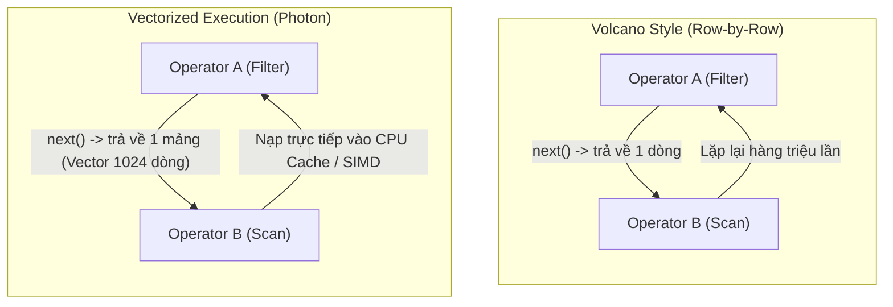
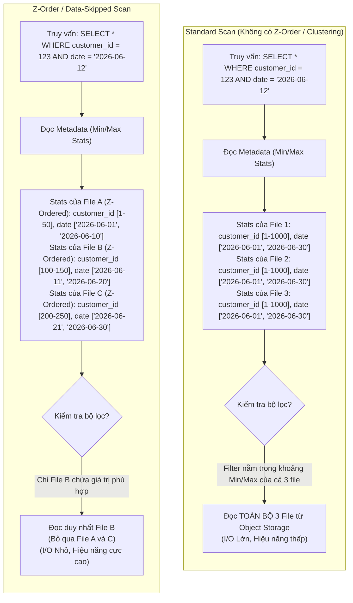

Sự ra đời của kiến trúc [Data Lakehouse](/concepts/2-storage/data-lake-lakehouse/lakehouse/) đánh dấu bước chuyển mình lớn từ các hệ thống Data Warehouse đóng gói sang các hồ dữ liệu mở (Open Data Lakes) dựa trên các định dạng bảng như [Delta Lake](/concepts/2-storage/data-lake-lakehouse/delta-lake/), [Apache Iceberg](/concepts/2-storage/data-lake-lakehouse/apache-iceberg/), hay Apache Hudi. Tuy nhiên, thách thức lớn nhất của Lakehouse là làm thế nào đạt được hiệu năng truy vấn ngang ngửa với Data Warehouse truyền thống trong khi dữ liệu được lưu trữ trực tiếp dưới dạng các tệp tin tĩnh trên Cloud Object Storage (như Amazon S3, Google Cloud Storage, Azure Blob Storage).

Để giải quyết bài toán này, các nền tảng Lakehouse hiện đại sử dụng hai nhóm kỹ thuật tối ưu hóa cốt lõi: tối ưu hóa tầng tính toán (Compute-level) thông qua **Vectorized Execution Engine (Photon)** và tối ưu hóa cách bố trí dữ liệu vật lý (Storage-level) thông qua **Compaction**, **Z-Ordering**, **Liquid Clustering**, và **Data Skipping**.

---


## 1. Vectorized Execution Engine: Photon
Trong các hệ thống phân tán truyền thống như Apache Spark, việc thực thi câu lệnh SQL dựa trên máy ảo Java (JVM). Spark sử dụng kỹ thuật *Whole-Stage Code Generation* để biên dịch các kế hoạch truy vấn thành mã Java byte-code khi chạy. Tuy nhiên, kiến trúc này gặp phải những giới hạn vật lý của JVM: overhead từ Garbage Collection (GC), không tận dụng được tối đa hiệu năng của CPU hiện đại và gặp khó khăn trong việc tối ưu hóa mức phần cứng (như các thanh ghi CPU và bộ nhớ đệm Cache).

Để bứt phá giới hạn này, Databricks đã phát triển **Photon** - một công cụ thực thi vectorized (vector hóa) được viết hoàn toàn bằng C++. Photon hoạt động như một engine chạy song song với Spark, đảm nhận việc thực thi các tác vụ nặng nhất của truy vấn.

### Cơ chế hoạt động của Photon: Volcano Style vs Vectorized Execution
Mô hình thực thi truyền thống của hầu hết các database là **Volcano-style (Row-by-Row)**. Mỗi toán tử (Operator) sẽ gọi phương thức `next()` để lấy ra từng dòng dữ liệu từ toán tử bên dưới nó. Phương pháp này cực kỳ trực quan nhưng lại gây ra rất nhiều lời gọi hàm ảo (virtual function calls), làm giảm hiệu năng CPU do liên tục bị rẽ nhánh (branch misprediction) và làm mất tính cục bộ của dữ liệu trong bộ nhớ đệm (L1/L2/L3 Cache).

Ngược lại, **Vectorized Execution (Thực thi vector hóa)** của Photon xử lý dữ liệu theo từng lô dạng cột (Columnar batches). Thay vì trả về từng dòng, mỗi lần gọi `next()`, Photon trả về một vector (mảng dữ liệu của một cột) chứa hàng ngàn giá trị.



### Các ưu thế kỹ thuật của Photon
* **SIMD (Single Instruction Multiple Data)**: CPU hiện đại hỗ trợ các tập lệnh SIMD cho phép thực hiện một phép toán (ví dụ: cộng, nhân, so sánh) trên nhiều phần tử dữ liệu đồng thời trong một chu kỳ xung nhịp. Viết bằng C++ giúp Photon ánh xạ trực tiếp các phép toán vector sang lệnh SIMD của CPU phần cứng.
* **Tối ưu hóa Cache Locality**: Vì dữ liệu được lưu và xử lý theo từng vector cột liên tiếp trong bộ nhớ, CPU có thể nạp toàn bộ vector này vào các bộ đệm nhanh L1, L2 mà không gặp hiện tượng Cache Miss (lỗi truy xuất dữ liệu ngoài RAM).
* **Quản lý bộ nhớ ngoài JVM**: Tự quản lý bộ nhớ thủ công trong C++ giúp Photon loại bỏ hoàn toàn hiện tượng nghẽn do Garbage Collection (GC) của JVM, giảm thiểu tối đa rủi ro Out Of Memory (OOM) khi xử lý các phép toán Join hoặc Group By quy mô lớn.

---

## 2. File Compaction Strategies & Bin-Packing
Trong các hệ thống Lakehouse ghi dữ liệu liên tục hoặc streaming, dữ liệu thường được ghi xuống đĩa dưới dạng hàng ngàn tệp tin rất nhỏ (Small Files Problem). Điều này dẫn đến sự chậm trễ nghiêm trọng khi đọc vì công cụ truy vấn phải liệt kê (list) tệp tin và thực hiện quá nhiều thao tác kết nối I/O.

### Thuật toán Bin-Packing
Để giải quyết vấn đề trên, Lakehouse sử dụng kỹ thuật [Compaction](/concepts/2-storage/data-lake-lakehouse/compaction/) (Gom tệp) chạy nền. Trọng tâm của quy trình Compaction là thuật toán **Bin-Packing** (Đóng gói thùng).
Thuật toán này gom các tệp tin có kích thước ngẫu nhiên vào các nhóm (bins) sao cho tổng kích thước của mỗi nhóm tiệm cận nhất với kích thước tệp mục tiêu (target file size) – thường được cấu hình từ 128MB đến 1GB tùy thuộc vào cấu hình của Spark hoặc Iceberg.

Khi chạy lệnh `OPTIMIZE` trong Delta Lake hoặc tiến trình dọn dẹp trong Apache Iceberg, hệ thống sẽ:
1. Quét qua metadata để tìm các tệp tin nhỏ hơn ngưỡng cấu hình (ví dụ: nhỏ hơn 100MB).
2. Áp dụng thuật toán Bin-Packing để gom chúng lại thành các nhóm 1GB.
3. Đọc dữ liệu từ các nhóm này lên, ghép lại và ghi ra các tệp Parquet mới lớn hơn.
4. Cập nhật Transaction Log để đánh dấu xóa các tệp cũ và kích hoạt các tệp mới.

---

## 3. Data Skipping Indexes
**Data Skipping** (Bỏ qua dữ liệu) là cơ chế tối ưu hóa then chốt giúp loại bỏ các tệp tin không liên quan ngay từ bước đọc metadata, trước khi thực hiện bất kỳ thao tác I/O nào đối với dữ liệu thực tế.

### Cách thức hoạt động
Khi một tệp dữ liệu được ghi xuống Lakehouse, định dạng bảng (Delta Lake hoặc Iceberg) tự động tính toán và lưu trữ các chỉ số thống kê (statistics) vào file metadata hoặc transaction log. Các chỉ số này bao gồm:
* Giá trị nhỏ nhất (Minimum) của mỗi cột.
* Giá trị lớn nhất (Maximum) của mỗi cột.
* Số lượng giá trị Null (Null Count).

Ví dụ, Delta Lake theo mặc định sẽ tự động thu thập các chỉ số min/max cho 32 cột đầu tiên được định nghĩa trong cấu trúc bảng (Schema).

Khi người dùng thực hiện một câu truy vấn có bộ lọc:
```sql
SELECT * FROM orders WHERE order_id = 5005;
```
Bộ máy truy vấn sẽ đọc transaction log và so sánh giá trị `5005` với khoảng `[Min, Max]` của từng tệp tin. Nếu một tệp có `Min = 1000` và `Max = 2000`, hệ thống biết chắc chắn tệp đó không chứa bản ghi cần tìm và sẽ bỏ qua (skip) việc tải tệp đó.

---

## 4. Multidimensional Clustering: Z-Ordering vs Liquid Clustering
Dù Data Skipping rất hiệu quả, khả năng bỏ qua dữ liệu phụ thuộc rất lớn vào việc dữ liệu có được sắp xếp vật lý theo cột lọc hay không. Nếu dữ liệu phân bố hoàn toàn ngẫu nhiên, khoảng `[Min, Max]` của mọi tệp sẽ rất rộng và chồng lấn lên nhau, khiến tỷ lệ tệp tin bị bỏ qua gần như bằng 0.

### Z-Ordering: Đường cong lấp đầy không gian (Space-Filling Curve)
Để tối ưu hóa truy vấn lọc trên nhiều cột đồng thời mà không làm phình to số lượng phân vùng (Partition), kỹ thuật **Z-Ordering** được áp dụng.
Z-Ordering sử dụng thuật toán sắp xếp đa chiều dựa trên đường cong Z-Order (Z-order curve) nhằm ánh xạ dữ liệu đa chiều về không gian 1 chiều mà vẫn giữ được tính cục bộ không gian (spatial locality).

#### Nguyên lý Interlacing Bits (Xen kẽ bit)
Để hiểu cách Z-Ordering hoạt động, giả sử chúng ta muốn sắp xếp dữ liệu theo hai cột `X` và `Y`. Hệ thống sẽ chuyển đổi giá trị của `X` và `Y` sang dạng nhị phân, sau đó xen kẽ các bit của chúng để tạo ra một giá trị khóa Z duy nhất:
* Giả sử $X = 3$ (nhị phân: `011`) và $Y = 5$ (nhị phân: `101`).
* Xen kẽ các bit từ trái qua phải (lấy bit của Y trước, rồi đến X):
  * Bit thứ 1 của Y là `1`, của X là `0` $\rightarrow$ `10`
  * Bit thứ 2 của Y là `0`, của X là `1` $\rightarrow$ `1011`
  * Bit thứ 3 của Y là `1`, của X là `1` $\rightarrow$ `101111`
* Giá trị Z thu được là `101111` (thập phân: `47`).

Bằng cách sắp xếp các dòng dữ liệu vật lý theo thứ tự tăng dần của giá trị Z này, các điểm dữ liệu gần nhau trong không gian đa chiều (X, Y) sẽ được gom vào chung một tệp tin Parquet. Điều này giúp thu hẹp đáng kể khoảng `[Min, Max]` của cả hai cột trên mỗi file, tối đa hóa hiệu quả của Data Skipping.

#### Hạn chế của Z-Ordering
Mặc dù mạnh mẽ, Z-Ordering vẫn tồn tại các điểm yếu chí mạng:
1. **Chi phí tính toán cực lớn (High CPU Overhead)**: Việc tính toán Z-value và thực hiện sắp xếp toàn bộ dữ liệu yêu cầu thực hiện phép toán xáo trộn dữ liệu (Shuffle) trên quy mô lớn, tốn rất nhiều tài nguyên tính toán.
2. **Không có tính lũy tiến (Non-incremental)**: Khi có dữ liệu mới ghi vào bảng, Z-Ordering không thể tự động áp dụng cho phần dữ liệu mới này. Bạn phải chạy lại lệnh `OPTIMIZE ZORDER BY` trên toàn bộ bảng (hoặc phân vùng) để tái cấu trúc lại dữ liệu, dẫn đến hiện tượng ghi lặp (Write Amplification) rất cao.
3. **Giới hạn số lượng cột**: Hiệu năng lọc của Z-Ordering giảm mạnh khi số lượng cột sắp xếp tăng lên quá 3 hoặc 4 cột do hiện tượng "lời nguyền đa chiều" (curse of dimensionality).

### Liquid Clustering: Tương lai của phân cụm dữ liệu
Để khắc phục triệt để các hạn chế của Z-Ordering, Databricks đã phát triển **Liquid Clustering** (Phân cụm động). Đây là một cơ chế phân cụm thế hệ mới được tích hợp sâu vào Delta Lake.

Liquid Clustering không phụ thuộc vào cách phân vùng vật lý truyền thống (như phân vùng theo ngày, theo tỉnh thành) cũng như không yêu cầu sắp xếp lại toàn bộ bảng. Thay vào đó, nó hoạt động dựa trên các nguyên lý:
* **Phân cụm lũy tiến (Incremental Clustering)**: Khi dữ liệu mới được chép vào bảng, Liquid Clustering chỉ thực hiện phân cụm trên dữ liệu mới đó mà không cần ghi đè các tệp tin cũ không thay đổi.
* **Tự động điều chỉnh kích thước tệp (Dynamic File Sizing)**: Tự động gom và chia nhỏ các tệp tin dựa trên mật độ dữ liệu thực tế tại từng vùng khóa cụ thể.
* **Hỗ trợ khóa linh hoạt**: Cho phép khai báo tối đa 4 cột làm khóa phân cụm mà không lo suy giảm hiệu năng của Data Skipping. Khóa này có thể được thay đổi dễ dàng thông qua lệnh `ALTER TABLE` mà không cần ghi lại toàn bộ bảng dữ liệu lịch sử.

### So sánh trực quan: Z-Ordering vs Liquid Clustering

| Đặc tính so sánh | Z-Ordering | Liquid Clustering |
| :--- | :--- | :--- |
| **Tính lũy tiến (Incremental)** | Không hỗ trợ (phải ghi đè toàn bộ dữ liệu để sắp xếp lại). | Hỗ trợ hoàn toàn (chỉ phân cụm dữ liệu mới ghi vào). |
| **Độ phức tạp khi ghi dữ liệu (Write Cost)** | Rất cao do phải Shuffle và sắp xếp lại toàn bộ. | Rất thấp, hiệu năng ghi nhanh chóng và ổn định. |
| **Số lượng khóa tối ưu** | Khuyên dùng 1-3 cột, hiệu năng giảm mạnh nếu nhiều hơn. | Hỗ trợ tốt lên đến 4 cột mà không suy giảm hiệu năng. |
| **Độ linh hoạt của khóa** | Muốn thay đổi khóa phải tổ chức và rewrite toàn bộ dữ liệu. | Thay đổi khóa nhanh chóng bằng lệnh `ALTER TABLE`. |
| **Độ phức tạp quản lý** | Phải kết hợp phân vùng thủ công (Partitioning) và tối ưu hóa Z-Order. | Loại bỏ hoàn toàn sự phụ thuộc vào phân vùng vật lý tĩnh. |

---

## 5. Sơ đồ so sánh cơ chế quét dữ liệu
Dưới đây là sơ đồ so sánh trực quan giữa cơ chế quét dữ liệu tiêu chuẩn (Standard Scan) và quét dữ liệu tối ưu hóa với Z-Ordering / Data Skipping:



---

## 6. Các quy tắc tối ưu hóa hiệu năng thực chiến
Để đạt hiệu quả tối ưu nhất khi vận hành hệ thống Data Lakehouse, các kỹ sư dữ liệu cần tuân thủ các quy tắc cốt lõi sau:

1. **Lựa chọn đúng cột để làm Z-Order hoặc Clustering Keys**: Chỉ chọn các cột xuất hiện thường xuyên trong mệnh đề lọc `WHERE` hoặc các cột làm khóa liên kết `JOIN`. Tránh chọn các cột có độ phân tán cực kỳ cao (high cardinality) mà hiếm khi được truy vấn.
2. **Không lạm dụng số lượng khóa**: Với Z-Ordering, giữ số lượng khóa ở mức tối đa là 3. Với Liquid Clustering, không chọn quá 4 khóa.
3. **Bật cơ chế Photon trên Databricks**: Đảm bảo cấu hình tính toán sử dụng Photon-enabled cluster cho các job phân tích ad-hoc (BI queries) hoặc các job ETL phức tạp chứa nhiều lệnh gom nhóm và kết hợp bảng.
4. **Lên lịch chạy định kỳ lệnh OPTIMIZE và VACUUM**: 
   * Chạy `OPTIMIZE` hàng ngày/hàng tuần để giải quyết vấn đề Small Files thông qua cơ chế Bin-packing.
   * Chạy `VACUUM` định kỳ (mặc định giữ lại dữ liệu 7 ngày) để loại bỏ các tệp tin rác cũ đã bị đánh dấu xóa, giúp tiết kiệm chi phí lưu trữ Cloud Object Storage.
5. **Tinh chỉnh kích thước tệp mục tiêu (Target File Size)**: Sử dụng các thuộc tính bảng như `delta.targetFileSize` để đặt mục tiêu kích thước file phù hợp (ví dụ: đặt là 256MB đối với các bảng nhỏ, hoặc 1GB đối với bảng cực lớn lớn hơn 10TB).

---

## Điểm mạnh (Pros)
* **Photon Engine**:
  * Đạt tốc độ xử lý nhanh hơn từ 2x đến 10x so với Spark engine thông thường đối với các truy vấn nặng về CPU.
  * Tương thích 100% với các APIs của Apache Spark, không yêu cầu viết lại mã nguồn ứng dụng.
* **Z-Ordering**:
  * Tăng tốc độ truy vấn lọc đa chiều vượt trội nhờ tối ưu hóa Data Skipping.
  * Giảm thiểu đáng kể dung lượng dữ liệu cần quét qua mạng, từ đó tiết kiệm chi phí I/O trên Cloud.
* **Liquid Clustering**:
  * Loại bỏ hoàn toàn nhược điểm "Write Amplification" của Z-Ordering nhờ cơ chế phân cụm lũy tiến.
  * Cho phép thay đổi cấu trúc khóa phân cụm linh hoạt mà không làm gián đoạn hệ thống.

---

## Khi nào nên dùng
* **Nên sử dụng Photon**: Khi hệ thống của bạn thực hiện nhiều tác vụ tổng hợp dữ liệu phức tạp (Complex Aggregations), kết nối bảng lớn (Big Joins) hoặc chạy các ứng dụng báo cáo BI (Business Intelligence) yêu cầu thời gian phản hồi thấp (low-latency).
* **Nên sử dụng Z-Ordering**: Khi bạn đang vận hành một bảng Delta Lake có dung lượng lớn (từ hàng trăm GB đến vài TB) và các truy vấn của người dùng cuối thường xuyên sử dụng bộ lọc trên 1 đến 3 cột cố định (ví dụ: `customer_id`, `store_id`).
* **Nên sử dụng Liquid Clustering**: Phù hợp cho các bảng dữ liệu có tốc độ ghi cao và liên tục (như dữ liệu IoT streaming, Clickstream logs) nơi việc chạy Z-Ordering thông thường gây ra quá tải tài nguyên ghi đĩa hoặc khi các yêu cầu lọc dữ liệu thay đổi liên tục theo thời gian.

---

## Trọng tâm ôn luyện phỏng vấn

### 1. Tại sao Z-Ordering lại gây ra hiện tượng Write Amplification lớn và Liquid Clustering khắc phục điều này bằng cách nào?
* **Gợi ý trả lời**: Z-Ordering yêu cầu dữ liệu trong toàn bộ phân vùng vật lý phải được đọc lên, sắp xếp lại theo giá trị Z-value nhị phân, sau đó ghi đè lại toàn bộ các tệp tin mới xuống đĩa. Khi có dữ liệu mới chèn vào, dữ liệu này chưa được sắp xếp. Để giữ hiệu năng Data Skipping ổn định, chúng ta buộc phải chạy lại toàn bộ quy trình sắp xếp trên (bao gồm cả dữ liệu cũ và mới), dẫn đến lượng dữ liệu ghi lại lớn gấp nhiều lần lượng dữ liệu thực tế chèn vào (Write Amplification).
* Liquid Clustering giải quyết triệt để vấn đề này bằng cách áp dụng cơ chế phân cụm lũy tiến (incremental clustering). Nó chia dữ liệu thành các nhóm cụm động (dynamic clusters). Khi ghi dữ liệu mới, hệ thống chỉ phân cụm riêng cho phần dữ liệu mới đó và tạo ra các tệp mới tương ứng với các nhóm cụm hiện tại mà không chạm vào hay rewrite các tệp tin cũ đang chạy ổn định.

### 2. Sự khác biệt cốt lõi giữa cơ chế thực thi của Photon (Vectorized Engine) và Spark JVM (Whole-Stage Code Generation) là gì?
* **Gợi ý trả lời**: 
  * Spark JVM sử dụng kỹ thuật biên dịch lúc chạy (JIT compilation) để gộp các toán tử truy vấn thành một hàm Java duy nhất nhằm xử lý dữ liệu theo dòng (Row-by-Row). Cơ chế này tối ưu cuộc gọi hàm ảo nhưng bị giới hạn bởi hiệu suất quản lý bộ nhớ của JVM, gặp overhead do Garbage Collection và không thể can thiệp sâu để sử dụng tối ưu các lệnh tăng tốc phần cứng của CPU.
  * Photon được viết bằng C++ và sử dụng cơ chế xử lý vector hóa (Vectorized Execution). Thay vì xử lý từng dòng dữ liệu đơn lẻ, Photon xử lý theo từng khối (Batch) dữ liệu dạng cột dưới dạng các vector trong bộ nhớ. Photon tận dụng trực tiếp các tập lệnh SIMD (Single Instruction Multiple Data) trên CPU hiện đại và lưu trữ các vector liên tiếp trong bộ nhớ đệm L1/L2 của CPU, loại bỏ hoàn toàn các lỗi Cache Miss và Garbage Collection của JVM.

### 3. Khi nào chúng ta không nên chạy lệnh OPTIMIZE trên một bảng Lakehouse?
* **Gợi ý trả lời**: Chúng ta không nên chạy lệnh `OPTIMIZE` trong các trường hợp sau:
  * **Đang trong giờ cao điểm của hệ thống**: Tiến trình Compaction ngầm của `OPTIMIZE` tiêu thụ lượng lớn tài nguyên CPU/RAM và băng thông mạng I/O để đọc/ghi tệp. Chạy lệnh này lúc hệ thống đang tải nặng sẽ gây nghẽn cho các job ghi dữ liệu thời gian thực.
  * **Bảng dữ liệu có tần suất thay đổi cực cao và chỉ cần lưu giữ ngắn hạn**: Nếu bảng liên tục bị ghi đè hoàn toàn hoặc bị xóa định kỳ sau vài giờ, việc gom file là không cần thiết và gây lãng phí tài nguyên tính toán.
  * **Bảng đã được áp dụng Liquid Clustering**: Với Liquid Clustering, việc phân cụm và quản lý kích thước file đã được thực hiện tự động và lũy tiến trong quá trình ghi dữ liệu. Do đó, việc chạy lệnh `OPTIMIZE` thủ công theo kiểu truyền thống là không cần thiết.

---

## Khái niệm liên quan
* [Data Lakehouse](/concepts/2-storage/data-lake-lakehouse/lakehouse/) - Mô hình kiến trúc tích hợp hồ dữ liệu và kho dữ liệu.
* [Delta Lake](/concepts/2-storage/data-lake-lakehouse/delta-lake/) - Định dạng bảng giao dịch mở phổ biến.
* [Apache Iceberg](/concepts/2-storage/data-lake-lakehouse/apache-iceberg/) - Định dạng bảng thế hệ mới tối ưu cho quy mô lớn.
* [Compaction](/concepts/2-storage/data-lake-lakehouse/compaction/) - Cơ chế giải quyết bài toán tệp tin nhỏ.
* [So sánh Delta Lake vs Apache Iceberg vs Apache Hudi](/concepts/2-storage/data-lake-lakehouse/table-format-comparison/) - So sánh chi tiết các định dạng bảng.
* [Dự án AWS: Real-time Ingestion & Analytics](/projects/aws-e2e-project/) - Dự án thực tế triển khai Apache Iceberg.

---

## Xem thêm các khái niệm liên quan
* [ACID Transactions trên Data Lake](/concepts/2-storage/data-lake-lakehouse/acid-transactions-on-lake/)
* [Apache Hudi](/concepts/2-storage/data-lake-lakehouse/apache-hudi/)
* [Apache Iceberg - Định dạng bảng thế hệ mới](/concepts/2-storage/data-lake-lakehouse/apache-iceberg/)

## Tài liệu tham khảo
1. [Databricks Photon Engine Paper](https://www.databricks.com/blog/2022/06/17/photon-c-vectorized-query-engine-on-lakehouse.html) - Technical blog and research insights on the C++ vectorized execution engine on Lakehouse.
2. [Databricks Delta Lake Optimization](https://docs.databricks.com/en/delta/optimizations-write.html) - Official guide on writing and optimization strategies for Delta Lake tables.
3. [Delta Lake Z-Ordering in Databricks](https://docs.databricks.com/en/delta/data-skipping.html) - Documentation on how to leverage Z-Ordering and Data Skipping for multi-column filtering.
4. [Apache Iceberg File Layout and Compaction](https://iceberg.apache.org/docs/latest/maintenance/) - Official maintenance guide on how to rewrite data files and resolve small files in Iceberg.
5. [Google Cloud Dataproc Serverless with Photon](https://cloud.google.com/dataproc/docs/concepts/photon) - GCP documentation on using Photon acceleration in Dataproc environments.
6. [AWS EMR Delta Lake Z-Order Optimization](https://docs.aws.amazon.com/emr/latest/ReleaseGuide/emr-spark-performance-delta.html) - AWS guide on running Delta Lake and enabling optimization features on EMR clusters.
7. [Snowflake Search Optimization Service](https://docs.snowflake.com/en/user-guide/search-optimization-service) - Snowflake's documentation on their proprietary data skipping and search optimization.

---

## English Summary
**Lakehouse Optimization** refers to a suite of hardware-aware computation and physical storage layout techniques designed to bring data warehouse-level query performance directly to cloud-based object storage. At the computational layer, **Photon**—a native C++ vectorized execution engine—bypasses the JVM to execute Spark queries using CPU cache locality and SIMD (Single Instruction Multiple Data) registers, drastically reducing CPU bottlenecks. At the storage layer, formats like **Delta Lake** and **Apache Iceberg** implement file compaction via bin-packing algorithms to resolve the "small files problem." By maintaining min-max statistics on column values, they enable **Data Skipping** to skip reading irrelevant files. Performance is further amplified by multidimensional clustering: **Z-Ordering** leverages space-filling curves and bit interlacing to cluster multi-column values, though it incurs high write amplification; **Liquid Clustering** solves this limitation by incrementally clustering incoming data dynamically without static partitioning. Together, these optimizations unify high-throughput streaming ingestion with low-latency analytical queries.
