Trong kỷ nguyên của hệ thống dữ liệu hiện đại, việc chuyển đổi từ kiến trúc hai tầng truyền thống (gồm [Data Lake](/concepts/2-storage/data-lake-lakehouse/data-lake/) chứa file thô và [Data Warehouse](/concepts/2-storage/data-warehouse/data-warehouse/) chứa dữ liệu cấu trúc) sang mô hình kiến trúc thống nhất **[Lakehouse](/concepts/2-storage/data-lake-lakehouse/lakehouse/) (Data Lakehouse)** đã trở thành một tiêu chuẩn bắt buộc. Trọng tâm của cuộc cách mạng này là sự xuất hiện của các **Open Table Format (Định dạng bảng mở)**. 

Bằng cách xây dựng một lớp siêu dữ liệu (metadata layer) thông minh phía trên các định dạng tệp tin lưu trữ cột (columnar storage) như Parquet hay ORC, các định dạng bảng mở cho phép các hệ thống xử lý dữ liệu thực hiện các giao dịch ACID mạnh mẽ, áp đặt lược đồ (schema enforcement), truy vấn ngược thời gian (time travel), và tiến hóa phân vùng (partition evolution) trực tiếp trên các dịch vụ Object Storage giá rẻ như AWS S3, Google Cloud Storage, hay Azure Blob Storage.

Ba định dạng bảng mở phổ biến nhất và đang thống trị thị trường hiện nay bao gồm:
1. **[Delta Lake](/concepts/2-storage/data-lake-lakehouse/delta-lake/)**: Khởi xướng bởi Databricks, tích hợp sâu sắc với hệ sinh thái Apache Spark.
2. **[Apache Iceberg](/concepts/2-storage/data-lake-lakehouse/apache-iceberg/)**: Phát triển đầu tiên bởi Netflix, hướng đến thiết kế trung lập về mặt động cơ tính toán (engine-agnostic) và giải quyết các vấn đề vận hành quy mô lớn của Hive.
3. **[Apache Hudi](/concepts/2-storage/data-lake-lakehouse/apache-hudi/)**: Phát sinh từ Uber nhằm giải quyết các bài toán streaming ingestion thời gian thực với độ trễ thấp và các thao tác cập nhật/xóa dòng dữ liệu lớn (upsert/delete).

Dưới đây là phân tích chuyên sâu về kiến trúc, cơ chế vận hành bên trong và hướng dẫn chi tiết giúp các kỹ sư dữ liệu đưa ra quyết định lựa chọn định dạng bảng tối ưu nhất cho hệ thống của mình.

---


## Bảng so sánh trực diện (Head-to-Head Comparison Matrix)

| Tiêu chí so sánh (Comparison Criteria) | Delta Lake | Apache Iceberg | Apache Hudi |
| :--- | :--- | :--- | :--- |
| **Cấu trúc Nhật ký Giao dịch (Transaction Log Structure)** | Sử dụng thư mục `_delta_log` chứa các tệp JSON commit tuần tự kết hợp tệp checkpoint Parquet định kỳ để tránh quá tải metadata. | Cấu trúc cây phân cấp (Hierarchical Tree) gồm Catalog, Metadata JSON, Manifest List và Manifest File dạng Avro. | Hudi Timeline (`.hoodie/`) lưu trữ trạng thái chi tiết của từng hành động (Instant) dưới dạng các tệp metadata. |
| **Xác thực ACID & Concurrency Control** | Optimistic Concurrency Control (OCC). Cần cơ chế khóa ngoài (External Lock) cho các hệ thống Object Storage không có ghi đè nguyên tử. | OCC hỗ trợ mức cô lập Serializable Isolation thông qua Catalog atomic swaps, độc lập hoàn toàn với File System. | OCC kết hợp MVCC (Multi-Version Concurrency Control). Hỗ trợ lock provider (ZooKeeper, DynamoDB) khi chạy chế độ ghi đồng thời. |
| **Tiến hóa Phân vùng (Partition Evolution)** | Không hỗ trợ thay đổi phân vùng vật lý trực tiếp. Hỗ trợ **Liquid Clustering** để gom cụm linh hoạt thay thế phân vùng tĩnh. | Hỗ trợ tuyệt đối thông qua **Hidden Partitioning** và **Partition Evolution** mà không cần viết lại (rewrite) dữ liệu cũ. | Yêu cầu viết lại dữ liệu (clustering hoặc table rewrite) nếu muốn thay đổi cấu trúc phân vùng vật lý. |
| **Chiến lược Ghi dữ liệu (Write Strategies)** | Chủ yếu là Copy-on-Write (CoW). Từ Delta 2.x hỗ trợ Merge-on-Read (MoR) thông qua cơ chế Deletion Vectors hiệu năng cao. | Hỗ trợ đầy đủ cả Copy-on-Write (CoW) và Merge-on-Read (MoR) (với các chế độ Positional Deletes và Equality Deletes). | Thiết kế tối ưu cho cả hai loại bảng: Copy-on-Write Table và Merge-on-Read Table với cơ chế Compaction linh hoạt. |
| **Tối ưu hóa Object Storage (Storage Optimizations)** | Auto-compaction, Z-Ordering, Liquid Clustering, Data Skipping dựa trên min/max statistics. | Min/max stats ở mức manifest, Z-Order/Hilbert curves, Object Storage layout (ngẫu nhiên hóa prefix để tránh S3 throttling). | File Compaction nền, Clustering, Indexing (Bloom Filter, Bucket Index, Record-level index) cho phép point-lookup siêu nhanh. |
| **Khả năng tương thích Động cơ (Interoperability)** | Tối ưu hóa cực mạnh cho Spark/Databricks. Hỗ trợ các engine khác thông qua UniForm (Unity Catalog) hoặc Delta Sharing. | Tương thích đa động cơ tốt nhất (Trino, Spark, Flink, Athena, Snowflake, ClickHouse, Presto, StarRocks). | Tối ưu cho Spark và Flink (streaming). Việc tích hợp với các công cụ ad-hoc SQL như Trino hay Athena có độ phức tạp cao hơn. |

---

## Chi tiết cơ chế hoạt động của Transaction Log (Internal Transaction Log Mechanisms)

Để đảm bảo tính toàn vẹn dữ liệu trong môi trường phân tán nơi hàng trăm worker ghi dữ liệu đồng thời, mỗi định dạng bảng đều phát triển một cơ chế quản lý metadata riêng biệt.

### Delta Lake: flat JSON logs kết hợp checkpoint Parquet
Kiến trúc transaction log của Delta Lake được thiết kế xoay quanh thư mục `_delta_log` nằm ở thư mục gốc của bảng.
- **JSON commit files**: Mỗi giao dịch (transaction) thành công trên bảng sẽ ghi lại một tệp JSON tuần tự bắt đầu từ `00000000000000000000.json`, tiếp theo là `00000000000000000001.json`, v.v. Tệp JSON này mô tả chi tiết các thay đổi (actions) như: thêm tệp dữ liệu (`add`), đánh dấu xóa tệp dữ liệu (`remove`), thay đổi lược đồ (`metaData`), hoặc thay đổi cấu hình bảng.
- **Checkpoint Parquet files**: Nếu hệ thống phải đọc hàng nghìn tệp JSON để dựng lại trạng thái hiện tại của bảng (ví dụ: xác định xem tệp Parquet nào là phiên bản mới nhất), hiệu năng sẽ bị ảnh hưởng nghiêm trọng. Để giải quyết việc này, cứ sau mỗi 10 commit, Delta Lake tự động chạy một tiến trình gộp và lưu trữ toàn bộ trạng thái metadata hiện tại thành một tệp Parquet checkpoint (ví dụ: `00000000000000000010.checkpoint.parquet`). Động cơ truy vấn chỉ cần đọc tệp checkpoint gần nhất và cộng dồn các thay đổi từ các tệp JSON commit sau checkpoint đó.
- **Tệp `_last_checkpoint`**: Lưu trữ thông tin chỉ số phiên bản của tệp checkpoint mới nhất, giúp động cơ truy vấn bỏ qua việc duyệt thư mục (directory listing) để tìm file checkpoint.

### Apache Iceberg: Cấu trúc cây phân cấp (Tree-based Hierarchical Metadata)
Apache Iceberg hoàn toàn loại bỏ sự phụ thuộc vào cấu trúc thư mục vật lý bằng cách lưu trữ toàn bộ sơ đồ bảng dưới dạng một cây metadata phân cấp.
1. **Iceberg Catalog**: Đóng vai trò là nguồn chân lý duy nhất (source of truth). Catalog lưu giữ con trỏ trỏ tới tệp Metadata JSON hiện tại của bảng. Các Catalog phổ biến bao gồm Hive Metastore, AWS Glue, Nessie, Snowflake, JDBC, hoặc REST Catalog.
2. **Metadata JSON file**: Chứa thông tin cấu trúc schema của bảng, cấu hình phân vùng (partition specs), lịch sử của tất cả các phiên bản (snapshots), và đường dẫn đến tệp Manifest List hiện tại ứng với từng snapshot.
3. **Manifest List (Avro)**: Mỗi snapshot đại diện cho trạng thái của bảng tại một thời điểm cụ thể và tương ứng với một Manifest List. Tệp này liệt kê danh sách các Manifest File thuộc về snapshot đó, kèm theo các thông tin thống kê quan trọng ở mức cao như phạm vi phân vùng (partition range) của từng manifest file để cho phép query engine lọc bỏ nhanh các manifest không liên quan.
4. **Manifest File (Avro)**: Liệt kê danh sách các tệp dữ liệu thực tế (data files - Parquet/ORC) kèm theo siêu dữ liệu chi tiết cho từng cột (chỉ số min/max, null counts, kích thước tệp). Nhờ lưu trữ min/max ở tầng metadata này, Iceberg có khả năng thực hiện **Hidden Partitioning (Phân vùng ẩn)** và **Partition Evolution (Tiến hóa phân vùng)** mà không cần cấu trúc thư mục vật lý.

### Apache Hudi: Timeline Metadata và File Group Layout
Kiến trúc của Apache Hudi được tối ưu cho các bài toán ghi dữ liệu liên tục (streaming data) và xử lý gia tăng (incremental processing).
- **Hudi Timeline**: Nằm trong thư mục `.hoodie/`, đây là một nhật ký ghi lại tất cả các hành động (Actions) được thực hiện trên bảng tại các mốc thời gian (Instant times). Mỗi giao dịch đi qua ba trạng thái:
  - `.requested`: Đánh dấu một hành động đã được lên lịch.
  - `.inflight`: Đánh dấu hành động đang được thực thi bởi ghi nhận dữ liệu (writer).
  - `.commit` hoặc `.deltacommit`: Đánh dấu hành động đã hoàn tất thành công.
- **File Groups & File Slices**: Hudi chia bảng thành các File Groups dựa trên các Record Keys (khóa bản ghi). Mỗi File Group chứa một tệp cơ sở (Base File - định dạng cột Parquet) và một chuỗi các tệp nhật ký ghi nhận thay đổi (Delta Log Files - định dạng dòng Avro). Tập hợp của Base File và các Delta Log tương ứng tạo thành một File Slice.
- **Index (Chỉ mục)**: Hudi sử dụng một hệ thống chỉ mục mạnh mẽ (Bloom Filter, Bucket Index, Record Level Index) để ánh xạ trực tiếp mỗi Record Key vào một File Group cụ thể. Khi thực hiện lệnh `UPSERT` (cập nhật hoặc thêm mới), Hudi không cần quét toàn bộ bảng mà chỉ cần định vị đúng File Group cần sửa đổi thông qua chỉ mục, tối ưu hóa tối đa thời gian xử lý ghi.

---

## Quy trình Commit Metadata (Metadata Commit Write Path)

Sơ đồ dưới đây minh họa sự khác biệt trong luồng ghi nhận (commit path) của ba định dạng bảng khi thực hiện một giao dịch ghi dữ liệu mới:

```mermaid
flowchart TD
    subgraph DeltaCommit ["Delta Lake Commit Path"]
        d1[Write Data Files to S3/ADLS/GCS] --> d2[Prepare JSON commit log entry _delta_log/x.json]
        d2 --> d3[Atomic Rename / Mutual Exclusion Lock]
        d3 -->|Lock Acquired / Success| d4[Commit JSON & Update _last_checkpoint]
        d3 -->|Conflict Detected| d5[Occur Conflict / Retry or Fail]
        d4 --> d6[Compile checkpoint.parquet every 10 commits]
    end

    subgraph IcebergCommit ["Apache Iceberg Commit Path"]
        i1[Write Data Files to Object Storage] --> i2[Create Manifest Files listing Data Files & Stats]
        i2 --> i3[Create Manifest List referencing all Manifests for Snapshot]
        i3 --> i4[Write new Metadata JSON file]
        i4 --> i5[Atomic Swap Pointer in Catalog Hive/Glue/JDBC/Nessie]
        i5 -->|Success| i6[New Snapshot Exposed to Consumers]
        i5 -->|Conflict/Concurrent Commit| i7[Retry Commit with updated Metadata JSON]
    end

    subgraph HudiCommit ["Hudi Commit Path"]
        h1[Write Data/Log Files to Storage] --> h2[Register Action in Hoodie Timeline requested/inflight]
        h2 --> h3[Lookup & Update Index Bloom Filter/Bucket/Record]
        h3 --> h4[Write completed .commit / .deltacommit to Timeline]
        h4 --> h5[Trigger Compaction / Cleaner / Archiver background jobs]
    end
```



---

## Điểm mạnh và điểm yếu

### Delta Lake
#### Điểm mạnh và điểm yếu
* **Điểm mạnh (Pros)**:
  * **Hiệu năng vượt trội trong hệ sinh thái Spark**: Tích hợp chặt chẽ với Spark SQL và Databricks Runtime.
  * **Cơ chế Deletion Vectors**: Mang lại tốc độ xóa/cập nhật cực nhanh mà không gây ra hiện tượng khuếch đại ghi lớn như phương pháp Copy-on-Write thông thường.
  * **Liquid Clustering**: Thay thế hoàn toàn cơ chế phân vùng tĩnh kiểu cũ bằng thuật toán gom cụm tự động điều chỉnh theo phân phối của dữ liệu thô, loại bỏ hoàn toàn vấn đề phân vùng quá nhỏ (over-partitioning).
* **Điểm yếu (Cons)**:
  * **Phụ thuộc vào nhà cung cấp (Vendor Lock-in)**: Một số tính năng tối ưu hóa cao cấp và bảo mật (như Unity Catalog, Delta Live Tables) chỉ có phiên bản đầy đủ nhất trên nền tảng trả phí của Databricks.
  * **Khả năng tương thích ngoài Spark hạn chế**: Mặc dù UniForm đã ra đời để tự động dịch siêu dữ liệu sang định dạng Iceberg/Hudi, việc chạy trực tiếp Delta Lake trên các engine khác (như Presto hay Flink) vẫn không mượt mà bằng Iceberg.

### Apache Iceberg
#### Điểm mạnh và điểm yếu
* **Điểm mạnh (Pros)**:
  * **Độc lập và đa dạng hệ sinh thái (Engine-Agnostic)**: Được hỗ trợ mạnh mẽ bởi Snowflake, Cloudera, AWS Athena, Trino, Flink và Google BigQuery. Không có xu hướng thiên vị bất cứ một động cơ tính toán nào.
  * **Hidden Partitioning**: Người dùng không cần hiểu rõ cấu trúc phân vùng vật lý của bảng để viết câu lệnh SQL tối ưu. Hệ thống tự động ánh xạ điều kiện truy vấn xuống mức file metadata, ngăn ngừa các lỗi suy giảm hiệu năng do viết truy vấn sai cấu trúc thư mục.
  * **Hỗ trợ tiến hóa phân vùng (Partition Evolution)**: Cho phép thay đổi chiến lược phân vùng lịch sử (ví dụ từ phân vùng theo ngày sang phân vùng theo giờ) mà không cần viết lại dữ liệu cũ.
* **Điểm yếu (Cons)**:
  * **Độ trễ ghi (Write Latency)**: Cơ chế cập nhật con trỏ Catalog nguyên tử (Atomic Swap) có thể trở thành điểm nghẽn (bottleneck) khi có hàng trăm tác vụ ghi đồng thời với tần suất cao (high-frequency streaming ingestion).
  * **Độ phức tạp ở lớp Catalog**: Bắt buộc phải duy trì một Catalog đáng tin cậy. Nếu Catalog gặp sự cố, bảng dữ liệu trên Object Storage sẽ hoàn toàn mất khả năng truy cập mặc dù các file Parquet vẫn nguyên vẹn.

### Apache Hudi
#### Điểm mạnh và điểm yếu
* **Điểm mạnh (Pros)**:
  * **Tối ưu tuyệt vời cho Streaming & Incremental processing**: Thích hợp cho việc xây dựng các đường ống dữ liệu thời gian thực (real-time pipelines) từ Kafka/CDC thông qua Apache Flink hoặc Spark Streaming.
  * **Hệ thống chỉ mục (Index Layout) đa dạng**: Cho phép thực hiện các truy vấn điểm (Point Lookups) và cập nhật bản ghi đơn lẻ (Single Record Upserts) cực nhanh so với hai định dạng còn lại.
  * **Dịch vụ tích hợp sẵn**: Hudi cung cấp sẵn các công cụ tự động dọn dẹp (`Cleaner`), nén file (`Compaction`), gom cụm (`Clustering`), và lưu trữ lịch sử (`Archival`) chạy trực tiếp dưới dạng luồng nền (background threads).
* **Điểm yếu (Cons)**:
  * **Độ phức tạp cấu hình cực kỳ cao**: Hudi có hàng trăm tham số cấu hình phức tạp liên quan đến index, compaction và write path. Yêu cầu đội ngũ kỹ sư có trình độ chuyên môn sâu để vận hành ổn định.
  * **Hiệu năng truy vấn ad-hoc thấp hơn**: Các bảng Merge-on-Read nếu không được compaction thường xuyên sẽ gây ảnh hưởng lớn đến hiệu năng của các truy vấn phân tích ad-hoc từ Trino hay Athena do phải merge tệp Avro log và Parquet thời điểm đọc.

---

## Khi nào nên dùng

Việc lựa chọn định dạng bảng Lakehouse không dựa trên việc định dạng nào "mạnh nhất", mà phụ thuộc hoàn toàn vào hệ sinh thái hiện tại và đặc thù luồng dữ liệu của doanh nghiệp.

```
                  ┌──────────────────────────────────────────────┐
                  │   Doanh nghiệp của bạn đang dùng gì chủ yếu?  │
                  └──────────────────────┬───────────────────────┘
                                         │
                    ┌────────────────────┼────────────────────┐
                    ▼                    ▼                    ▼
             [Databricks/Spark]   [Multi-engine/BI]   [Real-time Stream/CDC]
                    │                    │                    │
                    ▼                    ▼                    ▼
            ┌──────────────┐     ┌──────────────┐     ┌──────────────┐
            │  Delta Lake  │     │Apache Iceberg│     │ Apache Hudi  │
            └──────────────┘     └──────────────┘     └──────────────┘
```

### Lựa chọn Delta Lake khi:
* Hệ sinh thái dữ liệu của bạn được xây dựng xung quanh **Databricks hoặc Apache Spark** làm động cơ tính toán chính.
* Bạn muốn có một định dạng bảng dễ thiết lập nhất, có hiệu năng ghi/đọc mặc định tốt mà không cần tinh chỉnh quá nhiều cấu hình sâu.
* Bạn muốn sử dụng tính năng **Liquid Clustering** để tránh việc thiết kế phân vùng bảng phức tạp ngay từ đầu.

### Lựa chọn Apache Iceberg khi:
* Hệ thống của bạn phục vụ mô hình **đa động cơ truy cập (Multi-engine Architecture)**: ETL bằng Spark, phân tích ad-hoc bằng Trino/Athena, báo cáo BI thời gian thực bằng Snowflake hoặc Google BigQuery.
* Bạn muốn tách biệt hoàn toàn lớp lưu trữ dữ liệu khỏi sự phụ thuộc vào bất kỳ nhà cung cấp công nghệ hay đám mây nào (vendor neutrality).
* Cấu trúc bảng của bạn thường xuyên thay đổi cách thức phân vùng dữ liệu theo thời gian và bạn không muốn tốn chi phí viết lại dữ liệu cũ.

### Lựa chọn Apache Hudi khi:
* Hệ thống của bạn chủ yếu xử lý các nguồn dữ liệu luồng (**Streaming Data Ingestion**) từ Apache Kafka, Debezium (CDC) với yêu cầu độ trễ cập nhật ở mức phút.
* Bạn đang sử dụng **Apache Flink** làm công cụ xử lý chính cho các tác vụ streaming.
* Bạn cần thực hiện các thao tác cập nhật/xóa dữ liệu dựa trên khóa (Primary Keys / Record Keys) với khối lượng lớn và tần suất liên tục.

---

## Trọng tâm ôn luyện phỏng vấn

### Q1: Phân biệt cơ chế Copy-on-Write (CoW) và Merge-on-Read (MoR). Việc lựa chọn giữa hai cơ chế này ảnh hưởng thế nào đến hiện tượng khuếch đại ghi (Write Amplification) và khuếch đại đọc (Read Amplification)?
* **Trả lời**:
  - **Copy-on-Write (CoW)**: Khi có bản ghi bị thay đổi hoặc xóa trong một file dữ liệu, CoW sẽ đọc file dữ liệu đó lên, áp dụng các thay đổi, và ghi ra một file dữ liệu hoàn toàn mới.
    - *Ảnh hưởng*: Gây ra hiện tượng **Write Amplification (Khuếch đại ghi)** rất lớn vì chỉ cần thay đổi 1 dòng dữ liệu, hệ thống cũng phải ghi lại toàn bộ tệp Parquet 128MB. Tuy nhiên, nó tối ưu hóa hiệu năng đọc (không có **Read Amplification**) vì các truy vấn sau đó chỉ cần đọc trực tiếp các file Parquet sạch.
  - **Merge-on-Read (MoR)**: Khi có thay đổi, hệ thống chỉ ghi lại dòng thay đổi đó vào một file nhật ký riêng biệt (delta log/delete file).
    - *Ảnh hưởng*: Tối thiểu hóa Write Amplification vì tốc độ ghi cực nhanh và dung lượng ghi nhỏ. Tuy nhiên, nó lại làm tăng **Read Amplification** vì tại thời điểm đọc, query engine bắt buộc phải thực hiện phép ghép nối (merge/join) thời gian thực giữa file dữ liệu gốc và file nhật ký thay đổi để trả về kết quả chính xác nhất.

### Q2: Tại sao cơ chế Hidden Partitioning của Apache Iceberg lại giải quyết được vấn đề suy giảm hiệu năng truy vấn (query performance regression) thường gặp trong Hive?
* **Trả lời**:
  - Trong Hive truyền thống, phân vùng được thể hiện bằng cấu trúc thư mục vật lý (ví dụ: `/year=2026/month=06/day=12/`). Kỹ sư dữ liệu khi viết SQL phải thêm đúng điều kiện lọc trên thư mục này (ví dụ: `WHERE year = '2026' AND month = '06'`) thì query engine mới có thể bỏ qua các phân vùng khác. Nếu người dùng quên không thêm điều kiện lọc theo phân vùng vật lý mà chỉ lọc theo cột thời gian thô (ví dụ: `WHERE event_time >= '2026-06-12 00:00:00'`), engine sẽ quét toàn bộ bảng (Full Table Scan), gây nghẽn hệ thống.
  - **Apache Iceberg** giải quyết vấn đề này bằng cách tách biệt logic phân vùng khỏi cấu trúc đường dẫn vật lý. Iceberg lưu trữ mối quan hệ ánh xạ phân vùng trực tiếp trong file metadata. Khi người dùng lọc theo cột thời gian thô `event_time`, Iceberg tự động tính toán xem khoảng thời gian đó thuộc về những phân vùng nào trong metadata và chỉ đọc các file dữ liệu tương ứng. Người dùng không cần biết bảng được phân vùng như thế nào vẫn có thể viết các câu truy vấn SQL có hiệu năng tối ưu nhất.

### Q3: Delta Lake đảm bảo giao dịch ACID trên các dịch vụ Object Storage như AWS S3 (vốn không hỗ trợ đổi tên nguyên tử - Atomic Rename) bằng cách nào?
* **Trả lời**:
  - Delta Lake dựa trên khả năng ghi đè/đổi tên nguyên tử (Atomic Rename) của hệ thống tệp tin để đảm bảo chỉ có duy nhất một transaction log JSON được ghi thành công tại một thời điểm phiên bản (ví dụ: `000002.json`). Tuy nhiên, AWS S3 là một Object Storage thuần túy, không có khái niệm thư mục thật sự và không hỗ trợ atomic rename.
  - Để đảm bảo tính ACID trên S3, Delta Lake sử dụng cơ chế **Coordinated Commits**. Nó tận dụng một hệ thống khóa ngoài (External Lock Provider) hoặc một dịch vụ Catalog trung tâm như **Databricks Unity Catalog**, **AWS Glue Database Catalog (với tính năng hỗ trợ giao dịch)**, hoặc một bảng lưu trữ trạng thái khóa trên **DynamoDB** để thực hiện ghi nhận giao dịch độc quyền (mutual exclusion). Chỉ khi tiến trình ghi giành được khóa từ Catalog/Lock Provider thì tệp JSON log mới được xác nhận commit thành công vào S3.

### Q4: Tại sao Apache Hudi cần sử dụng cơ chế Bloom Filter Index trong khi ghi dữ liệu? Iceberg có sử dụng cơ chế tương tự không?
* **Trả lời**:
  - Apache Hudi được thiết kế chuyên biệt cho việc cập nhật dữ liệu ở mức dòng (upserts). Khi một luồng dữ liệu mới được đẩy vào, Hudi cần xác định ngay lập tức xem bản ghi mới này (dựa trên Record Key) đã tồn tại trong bảng hay chưa, và nếu có thì nó nằm ở file dữ liệu vật lý nào để tiến hành cập nhật. **Bloom Filter Index** được tích hợp vào footer của các file Parquet trong Hudi. Khi ghi dữ liệu, Hudi sẽ kiểm tra Bloom Filter của từng file để nhanh chóng loại trừ các file chắc chắn không chứa khóa đó mà không cần đọc toàn bộ dữ liệu, giúp tăng tốc độ upsert lên đáng kể.
  - **Apache Iceberg** không sử dụng cơ chế Record-level Index như Hudi vì Iceberg không có khái niệm Record Key mặc định và không hướng tới việc tối ưu hóa cho các tác vụ cập nhật điểm (point updates) siêu nhanh. Iceberg xử lý cập nhật bằng cách viết lại file (CoW) hoặc ghi nhận delete file (MoR) dựa trên quét điều kiện (equality/positional deletes) thông qua cấu trúc metadata phân cấp.

---

## English Summary

The Data Lakehouse architecture represents a major paradigm shift in modern data engineering, combining the cost-effective scalability of open [Data Lakes](/concepts/2-storage/data-lake-lakehouse/data-lake/) with the advanced transactional features of traditional [Data Warehouses](/concepts/2-storage/data-warehouse/data-warehouse/). Open table formats, specifically **Delta Lake**, **Apache Iceberg**, and **Apache Hudi**, serve as the foundational metadata layer that enables these capabilities by abstracting physical file storage into structured tables.

* **Delta Lake** excels in Spark-centric environments, offering seamless integration with Databricks and outstanding performance benefits like Liquid Clustering and high-speed write paths using Deletion Vectors.
* **Apache Iceberg** stands out for its engine-agnostic architecture, providing exceptional multi-engine query capabilities (Trino, Snowflake, Spark, Flink) and solving operational pain points via Hidden Partitioning and Partition Evolution.
* **Apache Hudi** is highly specialized for low-latency streaming ingestion and real-time CDC updates, employing sophisticated index types (Bloom Filter, Bucket Index) and background maintenance services to manage high-frequency upserts.

Understanding the internal transaction log designs—Delta's JSON/Parquet checkpoint logs, Iceberg's hierarchical Avro metadata trees, and Hudi's instant timeline—is critical for designing robust Lakehouse architectures. Data Engineers must evaluate their query engine diversity, ingestion latency requirements, and maintenance overhead before choosing the optimal table format for their data platform.

---

## Xem thêm các khái niệm liên quan
* [ACID Transactions trên Data Lake](/concepts/2-storage/data-lake-lakehouse/acid-transactions-on-lake/)
* [Apache Hudi](/concepts/2-storage/data-lake-lakehouse/apache-hudi/)
* [Apache Iceberg - Định dạng bảng thế hệ mới](/concepts/2-storage/data-lake-lakehouse/apache-iceberg/)

## Tài liệu tham khảo

1. [Databricks Delta Lake Guide](https://docs.databricks.com/delta/index.html) - Hướng dẫn chính thức từ Databricks về các tính năng tối ưu, tối giản hóa của định dạng bảng Delta Lake.
2. [Apache Iceberg Table Specification](https://iceberg.apache.org/spec/) - Tài liệu đặc tả chi tiết kiến trúc metadata của Apache Iceberg từ trang chủ dự án Apache.
3. [Apache Hudi Design and Architecture](https://hudi.apache.org/docs/overview) - Tài liệu tổng quan về mô hình timeline, cơ chế chỉ mục index và thiết kế bảng CoW/MoR của Apache Hudi.
4. [AWS Architecture Blog: Choosing a Lakehouse Table Format](https://aws.amazon.com/blogs/big-data/choosing-a-lakehouse-table-format-on-aws/) - Phân tích kiến trúc và hướng dẫn lựa chọn định dạng bảng Lakehouse phù hợp trên môi trường đám mây AWS.
5. [Google Cloud: Building a Lakehouse on GCP](https://cloud.google.com/blog/products/data-analytics/open-lakehouse-architecture-on-google-cloud) - Bài viết hướng dẫn thiết kế hệ thống dữ liệu mở theo mô hình Lakehouse sử dụng BigQuery và Dataproc trên GCP.
6. [Snowflake: Iceberg Tables Design](https://docs.snowflake.com/en/user-guide/tables-iceberg) - Tài liệu hướng dẫn thiết kế và tối ưu hiệu năng khi sử dụng bảng Iceberg trực tiếp trong hệ sinh thái Snowflake.
7. [Microsoft Azure: Delta Lake in Azure Synapse](https://learn.microsoft.com/en-us/azure/synapse-analytics/spark/apache-spark-what-is-delta-lake) - Hướng dẫn chi tiết cách tích hợp Delta Lake trong Spark pool của nền tảng phân tích Azure Synapse.
