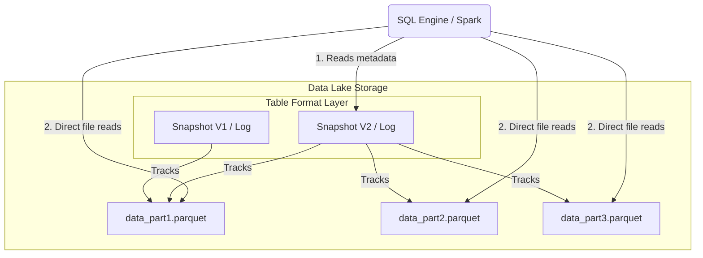

Hãy tưởng tượng bạn đang có một kho lưu trữ khổng lồ chứa hàng triệu tệp tin dữ liệu định dạng Parquet hay CSV nằm rải rác trên Amazon S3 hoặc Google [Cloud Storage](/concepts/2-storage/cloud-data-platform/cloud-storage/). Đối với các công cụ truy vấn SQL, đống tệp tin này giống như một mê cung hỗn loạn. **Table Format (Định dạng bảng)** chính là lớp bản đồ thông minh (abstraction layer) giúp gom tất cả các tệp tin riêng lẻ đó lại, tổ chức chúng một cách khoa học để máy tính hiểu được chúng là một bảng dữ liệu logic duy nhất.

Nhờ có Table Format, chúng ta có thể mang các tính năng cao cấp vốn chỉ có ở các cơ sở dữ liệu quan hệ truyền thống như giao dịch ACID, tự động cập nhật cấu trúc ([schema evolution](/concepts/2-storage/data-lake-lakehouse/schema-evolution/)) hay quay ngược thời gian truy vấn ([time travel](/concepts/2-storage/data-lake-lakehouse/time-travel/)) đặt vào trong các [Data Lake](/concepts/2-storage/data-lake-lakehouse/data-lake/) giá rẻ. Đây chính là xương sống định hình nên kiến trúc Data [Lakehouse](/concepts/2-storage/data-lake-lakehouse/lakehouse/) hiện đại.


## Định dạng bảng là gì? Sự nhầm lẫn phổ biến với Định dạng tệp

Trong kỹ thuật dữ liệu, có một sự nhầm lẫn cực kỳ phổ biến giữa hai khái niệm: **Table Format** và **File Format**. Hãy cùng phân biệt rõ:

* **File Format (Định dạng tệp):** Chịu trách nhiệm quyết định cấu trúc lưu trữ của dữ liệu thô bên trong *một tệp tin vật lý duy nhất*. Ví dụ: Parquet (lưu trữ dạng cột tối ưu cho việc đọc), CSV (dạng văn bản đơn giản), Avro (lưu trữ theo dòng tối ưu cho việc ghi).
* **Table Format (Định dạng bảng):** Chịu trách nhiệm quản lý *tập hợp của hàng ngàn hoặc hàng triệu tệp tin đó*. Nó theo dõi xem tệp nào thuộc phiên bản nào của bảng, tệp nào chứa dữ liệu mới nhất, đảm bảo tính nhất quán (ACID) khi nhiều người cùng ghi dữ liệu một lúc.

> [!NOTE]
> Nói một cách đơn giản: Parquet hay CSV là những viên gạch (File Format), còn Delta Lake hay Apache Iceberg là bản thiết kế để xếp những viên gạch đó thành một ngôi nhà hoàn chỉnh (Table Format).

## Tại sao chúng ta cần Table Format? Câu chuyện từ thời Apache Hive

Trước khi các Table Format hiện đại ra đời, thế giới Data Lake sử dụng **Apache Hive** như một tiêu chuẩn mặc định để quản lý bảng. Cách tiếp cận của Hive rất đơn giản: nó lấy một thư mục (directory) trên hệ thống lưu trữ (HDFS/S3) và coi mọi file nằm trong thư mục đó chính là dữ liệu của bảng. 

Tuy nhiên, khi quy mô dữ liệu bùng nổ lên mức hàng Petabyte, cách quản lý dựa trên thư mục này bộc lộ những điểm yếu chí mạng:
1. **Mất an toàn dữ liệu (Thiếu giao dịch ACID):** Nếu hai tiến trình cùng ghi dữ liệu vào một thư mục cùng lúc, dữ liệu sẽ bị ghi đè, hỏng hóc hoặc người đọc sẽ đọc phải những dữ liệu ghi dở dang (dirty reads).
2. **Nghẽn cổ chai khi quét thư mục (File Listing):** Để thực hiện một câu truy vấn, hệ thống phải liệt kê (list) toàn bộ hàng triệu file trong thư mục trên S3. Tác vụ này cực kỳ tốn thời gian và đôi khi làm treo cả hệ thống trước khi thực sự bắt đầu đọc dữ liệu.
3. **Không hỗ trợ thay đổi cấu trúc linh hoạt (Schema Evolution):** Nếu bạn muốn đổi tên một cột hoặc thay đổi kiểu dữ liệu, Hive bắt buộc bạn phải viết lại toàn bộ dữ liệu từ đầu, hoặc sẽ gây ra lỗi không tương thích cho các truy vấn cũ.

Các Table Format hiện đại (như Delta Lake, Apache Iceberg, Apache Hudi) ra đời để giải quyết triệt để các vấn đề này bằng cách chuyển đổi từ quản lý dựa trên thư mục sang **quản lý dựa trên siêu dữ liệu (metadata-based)**.

## Ý tưởng cốt lõi và Cơ chế hoạt động của Table Format hiện đại

Bí quyết của một Table Format hiện đại nằm ở việc duy trì một lớp siêu dữ liệu (metadata) cực kỳ chi tiết về bảng:

1. **Nhật ký giao dịch (Transactional Metadata):** Mọi thao tác ghi, sửa, xóa trên bảng đều tạo ra một "commit" mới (tương tự như cách hoạt động của Git). Thông tin này được lưu trữ trong nhật ký giao dịch (Transaction Log hoặc Metadata Tree).
2. **Cô lập Snapshot (Snapshot Isolation):** Tại một thời điểm, người đọc (reader) chỉ nhìn thấy dữ liệu từ snapshot đã commit hoàn tất gần nhất. Điều này giúp tiến trình đọc và tiến trình ghi diễn ra song song mà không hề xung đột hay gây lỗi dữ liệu.
3. **Thống kê mức tệp tin (File-Level Statistics):** Table Format tự động lưu trữ các thông tin thống kê như giá trị lớn nhất/nhỏ nhất (min/max) của từng cột trong mỗi tệp tin. Khi chạy câu lệnh SQL có điều kiện `WHERE`, engine tính toán có thể dựa vào đây để bỏ qua việc đọc các file không chứa dữ liệu cần thiết (Data Skipping), giúp tăng tốc độ truy vấn đáng kể.

Khi bạn chạy một câu truy vấn SQL:
* Engine tính toán sẽ không quét thư mục chứa file dữ liệu. Thay vào đó, nó đọc file metadata trước.
* File metadata sẽ chỉ ra snapshot mới nhất (ví dụ: phiên bản 5) gồm những file cụ thể nào.
* Engine tính toán chỉ tải đúng các file đó lên bộ nhớ để xử lý và trả kết quả về cho bạn.

## Sơ đồ kiến trúc tầng Table Format

Dưới đây là mô hình hoạt động của một Table Format (như Delta Lake hoặc Iceberg) quản lý các tệp tin Parquet vật lý:


## Ví dụ thực tế: Cập nhật dữ liệu với Delta Lake

Trong thực tế, khi bạn làm việc với Spark hay Trino, các thao tác này diễn ra rất tự nhiên. Đoạn code Python dưới đây minh họa việc ghi và cập nhật dữ liệu bằng Delta Lake format:
```python
# 1. Ghi dữ liệu dưới định dạng Delta Lake
df.write.format("delta").save("s3://bucket/my_table/")

# 2. Thực hiện cập nhật dữ liệu - điều bất khả thi nếu chỉ dùng file Parquet thông thường
from delta.tables import *
deltaTable = DeltaTable.forPath(spark, "s3://bucket/my_table/")
deltaTable.update(
  condition = "id = 5",
  set = { "status": "'shipped'" }
)
```

Khi đoạn code trên chạy, Delta Lake sẽ âm thầm ghi một file Parquet mới chứa dữ liệu đã được cập nhật, đồng thời đánh dấu file Parquet cũ là không còn hiệu lực (tombstone) trong Transaction Log.

## Chọn lựa "Big 3" và những Best Practices cần nhớ

### Chọn lựa định dạng phù hợp
Hiện tại, thị trường Table Format đang được thống trị bởi bộ ba "Big 3":
* **Apache Iceberg:** Được thiết kế cực kỳ thanh lịch, độc lập với các engine tính toán và được hỗ trợ rất mạnh mẽ bởi cộng đồng ([Snowflake](/concepts/2-storage/cloud-data-platform/snowflake/), Trino, Cloudera).
* **Delta Lake:** Được phát triển bởi Databricks, tích hợp hoàn hảo với [Apache Spark](/concepts/3-integration/batch-processing/apache-spark/) và hệ sinh thái của Databricks.
* **Apache Hudi:** Được Uber phát triển, tối ưu hóa rất mạnh cho các bài toán CDC ([Change Data Capture](/concepts/3-integration/etl-elt/change-data-capture/)) và xử lý dữ liệu tăng dần (incremental processing).

### Một số nguyên tắc thiết kế tốt (Best Practices)
* **Kết hợp với một Catalog chung:** Hãy sử dụng một hệ thống Catalog (như AWS Glue Catalog, Hive Metastore, hoặc Nessie) để lưu trữ con trỏ trỏ tới file metadata mới nhất. Điều này giúp các engine tính toán khác nhau có thể cùng làm việc trên một bảng dữ liệu một cách đồng bộ.
* **Dọn dẹp và tối ưu định kỳ:** Metadata và các file cũ (từ các phiên bản time travel cũ) sẽ phình to theo thời gian. Hãy lên lịch chạy các lệnh dọn dẹp như `VACUUM` (để xóa file cũ quá hạn) và `OPTIMIZE` / `COMPACT` (để gom các file nhỏ thành các file lớn hơn) nhằm giữ hiệu năng hệ thống ở mức tốt nhất.

## Điểm mạnh và điểm yếu

### Điểm mạnh (Pros)
* Mang lại đầy đủ các tính năng mạnh mẽ của RDBMS (ACID, Upsert, Schema Evolution) lên bộ lưu trữ đám mây giá rẻ.
* Loại bỏ hoàn toàn bottleneck quét file (File Listing) trên S3/GCS nhờ cơ chế Metadata Pruning.
* Đặt nền móng vững chắc để xây dựng kiến trúc Data Lakehouse thống nhất.

### Điểm yếu (Cons)
* **Sự phụ thuộc (Lock-in mềm):** Một khi dữ liệu của bạn đã được ghi bằng Delta Lake, việc chuyển đổi toàn bộ sang Iceberg sẽ tốn công sức chuyển đổi metadata (mặc dù hiện tại đã có các công cụ dịch metadata như Apache XTable).
* **Độ trễ khi ghi (Overhead):** Do mỗi lần ghi dữ liệu hệ thống đều phải tạo và cập nhật thêm các file metadata, tốc độ ghi của Table Format sẽ chậm hơn một chút so với việc ghi file thô thông thường.

---

## Khi nào nên dùng và không nên dùng

* **Nên dùng khi:**
  * Bạn xây trúc Data Lakehouse sử dụng các công cụ tính toán phân tán (Spark, Trino, Flink) trên các Object Storage như S3 hoặc GCS.
  * Đường ống dữ liệu yêu cầu giao dịch ACID và cập nhật, xóa dữ liệu liên tục.

* **Không nên dùng khi:**
  * Hệ thống dữ liệu rất nhỏ (dưới vài chục GB) và không có luồng dữ liệu thay đổi liên tục. Sử dụng file Parquet trần trụi hoặc database quan hệ sẽ đơn giản và hiệu quả hơn.

---

## Các khái niệm liên quan

* [Data Lakehouse](/concepts/2-storage/data-lake-lakehouse/lakehouse/)
* [Apache Iceberg](/concepts/2-storage/data-lake-lakehouse/apache-iceberg/)
* [Delta Lake](/concepts/2-storage/data-lake-lakehouse/delta-lake/)
* [Apache Hudi](/concepts/2-storage/data-lake-lakehouse/apache-hudi/)
* [ACID Transactions on Data Lake](/concepts/2-storage/data-lake-lakehouse/acid-transactions-on-lake/)
* [So sánh Delta Lake vs Apache Iceberg vs Apache Hudi](/concepts/2-storage/data-lake-lakehouse/table-format-comparison/)
* [Di chuyển sang Open Table Formats](/concepts/2-storage/data-lake-lakehouse/table-format-migration/)

---

## Trọng tâm ôn luyện phỏng vấn

### 1. Hãy phân biệt rõ sự khác nhau giữa File Format và Table Format trong Data Lake. Cho ví dụ.
* **Gợi ý trả lời:**
  * **File Format (như Parquet, ORC, CSV):** Định nghĩa cách cấu trúc và nén các byte dữ liệu trong phạm vi một tệp tin vật lý đơn lẻ (ví dụ: lưu theo cột hay theo dòng).
  * **Table Format (như Delta Lake, Apache Iceberg):** Là một lớp quản lý siêu dữ liệu (metadata) nằm bên trên, có nhiệm vụ liên kết và quản lý hàng loạt tệp tin vật lý đó để trình bày chúng dưới dạng một bảng logic duy nhất cho người dùng. 
  * **Ví dụ:** Khi dùng Delta Lake, định dạng bảng là Delta, nhưng thực tế các tệp tin dữ liệu bên dưới vẫn được lưu dưới dạng các file Parquet (File Format).

### 2. Table Format giải quyết bài toán "Small Files Problem" (nhiều file nhỏ) trên Data Lake như thế nào?
* **Gợi ý trả lời:**
  Trong kiến trúc Hive cũ, việc có quá nhiều file nhỏ sẽ làm nghẽn cổ chai hệ thống do tốn thời gian listing file. Table Format giải quyết bài toán này qua hai cơ chế:
  * **Không quét thư mục:** Nhờ lưu trực tiếp đường dẫn file trong metadata, engine tính toán không cần gọi lệnh listing file vật lý trên S3.
  * **Cơ chế Compaction:** Các Table Format đều hỗ trợ các câu lệnh tối ưu hóa (ví dụ: `OPTIMIZE` trong Delta Lake hoặc API Compaction của Iceberg). Tiến trình này sẽ chạy ngầm để gom hàng ngàn file nhỏ lại thành các file lớn (~128MB - 1GB) giúp tối ưu hóa hiệu năng đọc dữ liệu, sau đó cập nhật lại file metadata để trỏ sang các file mới một cách an toàn mà không làm gián đoạn người dùng đang đọc bảng.

## Xem thêm các khái niệm liên quan
* [ACID Transactions trên Data Lake](/concepts/2-storage/data-lake-lakehouse/acid-transactions-on-lake/)
* [Apache Hudi](/concepts/2-storage/data-lake-lakehouse/apache-hudi/)
* [Apache Iceberg - Định dạng bảng thế hệ mới](/concepts/2-storage/data-lake-lakehouse/apache-iceberg/)

## Tài liệu tham khảo

1. [Delta Lake: High-Performance ACID Table Storage over Cloud Object Stores](https://www.vldb.org/pvldb/vol13/p3411-armbrust.pdf) - Armbrust et al., VLDB 2020 research paper introducing Delta Lake's architecture and performance design.
2. [Apache Iceberg Table Format Specification](https://iceberg.apache.org/spec/) - Official Apache Iceberg technical specification detailing metadata layouts and design.
3. [Building a Large-scale Transactional Data Lake at Uber Using Apache Hudi](https://www.uber.com/blog/building-a-large-scale-transactional-data-lake-at-uber-using-apache-hudi/) - Uber Engineering Blog post detailing the design and rollout of Apache Hudi.
4. [What is a Data Lakehouse?](https://www.databricks.com/blog/2020/01/30/what-is-a-data-lakehouse.html) - Databricks Blog post introducing the lakehouse architecture and the role of ACID table formats.
5. [AWS - What is a Table Format?](https://aws.amazon.com/what-is/data-lakehouse/) - AWS overview of data lakehouse table formats.
6. [Google Cloud Dataproc - Open Table Formats](https://cloud.google.com/blog/products/databases/acid-transactions-on-cloud-storage) - Google Cloud blog post on transactional table formats.
7. [Microsoft Azure Databricks Delta Lake](https://azure.microsoft.com/en-us/blog/azure-databricks-delta-lake-now-generally-available/) - Microsoft Azure post on Delta Lake integration.
8. [Snowflake - Iceberg Tables Support](https://docs.snowflake.com/en/user-guide/tables-iceberg) - Snowflake's documentation on creating Iceberg tables.

## English Summary

A Table Format is an abstraction layer that brings [relational database](/concepts/2-storage/database-storage/relational-database/) functionalities—such as ACID transactions, schema evolution, and time travel—to massive datasets residing in data lakes (like S3 or GCS). Unlike [file formats](/concepts/2-storage/database-storage/file-formats/) (e.g., Parquet, Avro) that define physical data encoding, a table format (e.g., Apache Iceberg, Delta Lake, Apache Hudi) uses metadata to track which data files comprise a given snapshot of a table. This approach eliminates inefficient file listing operations, ensures data consistency during concurrent read/write operations, and serves as the foundational architecture for the modern Data Lakehouse paradigm.