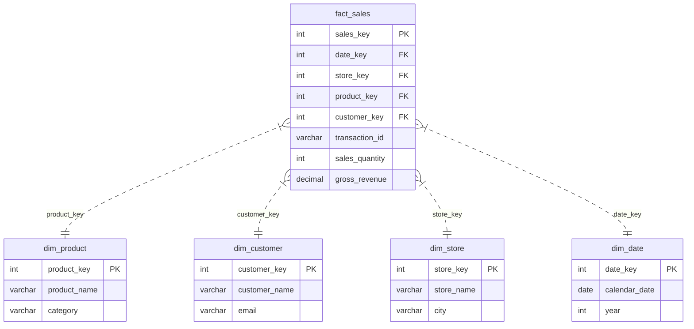

Mỗi khi bạn đi siêu thị và nghe tiếng "bíp" vang lên lúc nhân viên thu ngân quét mã vạch trên sản phẩm, một giao dịch mới đã được ghi nhận. Trong thế giới lưu trữ dữ liệu, hành động quét mã vạch đó sẽ sinh ra một loạt các con số: số lượng mua, đơn giá, số tiền chiết khấu và tổng doanh thu. 

Để phục vụ cho việc phân tích và báo cáo sau này, tất cả những con số đo lường thực tế đó sẽ được gom về một bảng lưu trữ trung tâm. Bảng đó được gọi là **Bảng sự kiện (Fact Table)** – xương sống của mọi mô hình dữ liệu đa chiều ([Dimensional Modeling](/concepts/2-storage/data-warehouse/dimensional-modeling/)) trong [Data Warehouse](/concepts/2-storage/data-warehouse/data-warehouse/).

## Điểm hội tụ của những con số biết nói

Trong thiết kế Kho dữ liệu, **Fact Table** đóng vai trò là nơi lưu trữ các sự thật có thể định lượng được (quantifiable truths) về một quy trình kinh doanh. 

Nếu các bảng chiều (Dimension Tables) xung quanh trả lời cho các câu hỏi mang tính ngữ cảnh như *Ai mua hàng?*, *Mua ở cửa hàng nào?*, *Vào thời gian nào?*, thì Fact Table tập trung trả lời cho câu hỏi cốt lõi: *"Chúng ta đã đạt được những chỉ số kinh doanh cụ thể nào?"*.

Việc phân tách rõ ràng giữa "Chỉ số cần đo" (nằm ở Fact Table) và "Ngữ cảnh của phép đo" (nằm ở các Dimension Tables) giúp các công cụ phân tích (BI Tools) thực hiện các hàm tổng hợp (như `SUM()`, `AVG()`, `COUNT()`) nhanh hơn gấp hàng nghìn lần so với cấu trúc cơ sở dữ liệu quan hệ (ER) thông thường.

## Kiến trúc và Cấu trúc: Siêu dài nhưng siêu hẹp

Về mặt vật lý, một Fact Table tiêu chuẩn sở hữu một cấu trúc rất đặc trưng: **Cực kỳ dài nhưng lại rất hẹp**.

* **Nó "hẹp"** vì bảng này chứa rất ít cột. Các cột chủ yếu có kiểu dữ liệu là số nguyên (Integer) đại diện cho các Khóa ngoại (Foreign Keys) trỏ tới các bảng Dimension, và các cột số thực (Decimal/Float) đại diện cho các chỉ số đo lường (Metrics). Bảng Fact tuyệt đối không chứa các cột văn bản dài lê thê (như mô tả sản phẩm hay địa chỉ khách hàng).
* **Nó "dài"** vì cứ mỗi sự kiện kinh doanh phát sinh, một dòng dữ liệu mới lại được chèn vào (Insert-only). Với các doanh nghiệp lớn, Fact Table có thể chứa tới hàng triệu, thậm chí hàng tỷ dòng dữ liệu.

Tập hợp tất cả các Khóa ngoại (Foreign Keys) trong bảng Fact thường được kết hợp lại để làm Khóa chính tổng hợp (Composite Primary Key) cho chính bảng đó.

Dưới đây là sơ đồ mối quan hệ giữa Fact Table (`fact_sales`) và các Dimension Tables trong mô hình Hình sao (Star Schema):


## Ba thuộc tính đo lường cần phân biệt

Khi thiết kế các chỉ số đo lường trong Fact Table, các kỹ sư dữ liệu phân chia chúng làm 3 loại dựa trên tính chất cộng gộp (Additivity) của chúng:

1. **Additive Facts (Cộng gộp hoàn toàn)**: Là các chỉ số mà bạn có thể cộng dồn (SUM) thoải mái theo bất kỳ chiều phân tích nào. Ví dụ: `doanh thu (revenue)`, `số lượng bán (quantity)`. Bạn có thể cộng dồn doanh thu theo ngày, theo tháng, theo cửa hàng hay theo danh mục sản phẩm để ra con số tổng.
2. **Semi-Additive Facts (Cộng gộp một phần)**: Là các chỉ số chỉ có thể cộng dồn theo một số chiều nhất định, và hoàn toàn vô nghĩa nếu cộng dồn theo chiều thời gian. Ví dụ điển hình là `Số dư tài khoản ngân hàng`. Bạn có thể cộng số dư của 10 khách hàng trong ngày hôm nay để biết tổng tiền ngân hàng đang giữ. Nhưng bạn không thể lấy số dư ngày thứ Hai cộng với số dư ngày thứ Ba để tính số dư của cả tuần.
3. **Non-Additive Facts (Không thể cộng gộp)**: Là các con số mà bạn tuyệt đối không thể dùng phép cộng (SUM) để tính toán, vì chúng thường là tỷ lệ phần trăm hoặc các chỉ số đo lường trạng thái tĩnh. Ví dụ: `đơn giá sản phẩm`, `nhiệt độ phòng`, `tỷ lệ chuyển đổi (%)`. Với các chỉ số này, bạn phải dùng các hàm tính trung bình (`AVG`), tìm giá trị lớn nhất (`MAX`) hoặc nhỏ nhất (`MIN`).

## Phân loại Fact Table theo quy trình nghiệp vụ

Tùy thuộc vào cách thức ghi nhận dữ liệu trong thực tế kinh doanh, Ralph Kimball chia Fact Table làm 3 loại chính:

* **Transaction Fact Table (Bảng sự kiện giao dịch)**: Ghi nhận sự kiện ngay lập tức khi giao dịch phát sinh (mỗi dòng đại diện cho một tiếng "bíp" quét mã vạch). Đây là loại bảng Fact chi tiết nhất, phổ biến nhất và cũng phình to nhanh nhất.
* **Periodic Snapshot Fact Table (Bảng sự kiện chụp chu kỳ)**: Lưu trữ dữ liệu tổng hợp sau mỗi khoảng thời gian định kỳ (như cuối ngày, cuối tuần hoặc cuối tháng). Ví dụ: Sao kê số dư tài khoản ngân hàng vào ngày 30 hàng tháng.
* **Accumulating Snapshot Fact Table (Bảng sự kiện tích lũy)**: Dùng để theo dõi toàn bộ vòng đời của một quy trình có điểm bắt đầu và điểm kết thúc rõ ràng. Bảng này sẽ được liên tục cập nhật (Update) khi quy trình đi qua các bước mới. Ví dụ: Quy trình giao hàng gồm các mốc thời gian: *Ngày đặt hàng $\rightarrow$ Ngày đóng gói $\rightarrow$ Ngày xuất kho $\rightarrow$ Ngày giao hàng thành công*.

## Ví dụ thực tế: Thiết kế bảng fact_sales cho siêu thị

Dưới đây là minh họa cấu trúc của một bảng `fact_sales` dạng giao dịch:

| sales_key (PK) | date_key (FK) | store_key (FK) | product_key (FK) | order_id (DD) | quantity (Fact) | revenue (Fact) |
| :--- | :--- | :--- | :--- | :--- | :--- | :--- |
| 1001 | 20260601 | 55 | 889 | INV-992 | 2 | 1500.00 |
| 1002 | 20260601 | 55 | 442 | INV-992 | 1 | 300.00 |
| 1003 | 20260602 | 12 | 889 | INV-993 | 5 | 3750.00 |

*Ghi chú: Cột `order_id` ở đây được gọi là **Degenerate Dimension (Chiều suy biến)**. Nó là một thông tin ngữ cảnh (mã hóa đơn) nhưng do không cần tạo một bảng Dimension riêng nên được lưu trữ trực tiếp ngay trong bảng Fact.*

Dưới đây là câu lệnh SQL để khởi tạo bảng Fact này trên Data Warehouse:
```sql
CREATE TABLE fact_sales (
    -- Khóa chính thay thế cho dòng Fact
    sales_fact_id BIGINT PRIMARY KEY,
    
    -- Các khóa ngoại trỏ tới các bảng Dimension
    date_key INT NOT NULL,
    customer_key INT NOT NULL,
    store_key INT NOT NULL,
    product_key INT NOT NULL,
    
    -- Chiều suy biến (Mã hóa đơn)
    transaction_id VARCHAR(50), 
    
    -- Các chỉ số đo lường (Metrics/Facts)
    sales_quantity INT,
    gross_revenue DECIMAL(18,4),
    discount_amount DECIMAL(18,4),
    
    -- Cột kiểm toán ETL
    etl_load_timestamp TIMESTAMP
);

-- Tạo Index trên các cột khóa ngoại để tối ưu hóa hiệu năng JOIN hình sao
CREATE INDEX idx_fact_date ON fact_sales(date_key);
CREATE INDEX idx_fact_store ON fact_sales(store_key);
```

## Sai lầm thường gặp và Best Practices

### Nguyên tắc vàng (Best Practices)
* **Thiết lập độ mịn sâu nhất có thể (Atomic Grain)**: Hãy luôn lưu trữ dữ liệu ở mức độ chi tiết nhất (ví dụ: từng sản phẩm trong hóa đơn) thay vì lưu dữ liệu đã được tổng hợp sẵn theo ngày hay theo cửa hàng. Việc tổng hợp số liệu hãy để công cụ BI thực hiện. Dữ liệu càng chi tiết sẽ càng giúp doanh nghiệp trả lời được mọi câu hỏi phân tích phát sinh ngẫu nhiên (Ad-hoc queries) trong tương lai.
* **Không để NULL ở các khóa ngoại (FK)**: Nếu một giao dịch bán hàng diễn ra mà không có thông tin khách hàng (khách vãng lai), tuyệt đối không để giá trị NULL ở cột `customer_key`. Hệ thống [ETL](/concepts/3-integration/etl-elt/etl/) phải gán giá trị này bằng `-1` (trỏ đến bản ghi "Khách vãng lai/Không xác định" trong bảng `dim_customer`). NULL ở bảng Fact sẽ làm hỏng kết quả báo cáo khi thực hiện phép JOIN.

### Sai lầm dễ mắc phải (Common Mistakes)
* **Chèn các cột chuỗi văn bản (VARCHAR) dài vào bảng Fact**: Đôi khi do lười viết câu lệnh JOIN, Data Engineer chèn thẳng cột `product_name` hay `customer_email` vào bảng `fact_sales`. Việc này làm dung lượng bảng Fact phình to một cách khủng khiếp, làm giảm hiệu năng truy vấn của toàn bộ hệ thống.
* **Trộn lẫn các độ mịn khác nhau**: Lưu trữ cả dòng dữ liệu mức "Chi tiết sản phẩm" và dòng dữ liệu mức "Tổng hóa đơn" trong cùng một bảng Fact. Khi chạy hàm `SUM()`, doanh thu của bạn sẽ bị nhân đôi một cách tai hại.

## Điểm mạnh và điểm yếu

### Điểm mạnh (Pros)
* **Tốc độ truy vấn cao**: Do bảng Fact có chiều rộng hẹp (chứa chủ yếu số nguyên là các ID khóa ngoại), cơ sở dữ liệu phân tích có thể quét và xử lý các phép toán tổng hợp (`SUM`, `AVG`) cực nhanh.
* **Tối ưu hóa thiết kế**: Dễ dàng phân vùng bảng ([Partitioning](/concepts/2-storage/database-storage/partitioning/)) theo thời gian để tăng hiệu năng đọc.
* **Mở rộng dễ dàng**: Việc gắn thêm chiều phân tích mới chỉ cần thêm một cột khóa ngoại và tạo bảng Dimension tương ứng, không thay đổi cấu trúc cốt lõi.

### Điểm yếu (Cons)
* **Dung lượng phình to nhanh**: Lưu trữ thông tin chi tiết của hàng tỷ giao dịch có thể tiêu tốn rất nhiều dung lượng đĩa cứng.
* **Bảo trì dữ liệu phức tạp**: Việc sửa đổi hoặc cập nhật một dòng dữ liệu trong bảng Fact (đặc biệt là dữ liệu lịch sử) cực kỳ tốn CPU và thời gian.
* **Không thân thiện nếu đứng một mình**: Nếu không JOIN với bảng Dimension, bảng Fact chỉ là một chuỗi khóa ngoại và số liệu vô nghĩa đối với người dùng cuối.

## Khi nào nên và không nên dùng

### Khi nào nên dùng
* Thiết kế mô hình đa chiều (Star Schema, Snowflake Schema) phục vụ phân tích dữ liệu lớn và thiết lập báo cáo BI.
* Lưu trữ và đo lường các giao dịch, nhật ký (logs), hoặc chụp nhanh số liệu định kỳ (periodic snapshots) của doanh nghiệp.

### Khi nào không nên dùng
* Thiết kế cơ sở dữ liệu cho hệ thống xử lý giao dịch thời gian thực (OLTP) vốn cần cập nhật nhanh, liên tục và chuẩn hóa 3NF để tránh trùng lặp.
* Lưu trữ thông tin dạng văn bản mô tả hoặc phân loại phân cấp nghiệp vụ phức tạp (những thông tin này nên nằm ở Dimension Table).

---

## Trọng tâm ôn luyện phỏng vấn

### 1. Bạn hãy giải thích khái niệm "Factless Fact Table" là gì và đưa ra một ví dụ thực tế khi nào cần dùng nó?
* **Gợi ý trả lời**: 
  * "Factless Fact Table" (Bảng sự kiện không chứa số liệu) là một loại Fact Table đặc biệt chỉ chứa các khóa ngoại (Foreign Keys) liên kết đến các Dimension mà không hề có bất kỳ cột chỉ số đo lường (Metrics) dạng số nào.
  * **Khi nào dùng**: Chúng ta dùng nó để ghi nhận các sự kiện thực tế xảy ra nhưng bản thân sự kiện đó không phát sinh bất kỳ giá trị định lượng trực tiếp nào. Ví dụ điển hình nhất là **Bảng điểm danh sinh viên**: Bảng `fact_attendance` chỉ chứa `date_key`, `student_key`, và `class_key`. Bản thân việc tồn tại một dòng ghi nhận sự xuất hiện của sinh viên tại lớp học vào ngày đó chính là một sự kiện (Fact), dù không có con số doanh thu hay số lượng nào đi kèm. Chúng ta có thể dùng hàm `COUNT()` trên bảng này để thống kê số buổi đi học của sinh viên.

### 2. Sự khác biệt cốt lõi giữa Transaction Fact Table và Accumulating Snapshot Fact Table là gì?
* **Gợi ý trả lời**: 
  * **Transaction Fact Table**: Được thiết kế theo cơ chế *Insert-Only* (chỉ chèn thêm, không cập nhật). Mỗi khi một giao dịch kinh doanh đơn lẻ phát sinh (ví dụ: một giao dịch quẹt thẻ), hệ thống sẽ chèn ngay một dòng mới vào bảng. Dữ liệu lịch sử đã ghi nhận sẽ không bao giờ bị thay đổi.
  * **Accumulating Snapshot Fact Table**: Được thiết kế để theo dõi *toàn bộ vòng đời* của một quy trình gồm nhiều bước (ví dụ: quy trình xử lý đơn hàng hay xử lý hồ sơ bảo hiểm). Bảng này sẽ có nhiều cột khóa ngoại ngày tháng đại diện cho từng bước (`order_date_key`, `ship_date_key`, `delivery_date_key`). Khi đơn hàng mới được tạo, chỉ cột `order_date_key` có giá trị. Khi đơn hàng được giao, hệ thống ETL sẽ thực hiện lệnh `UPDATE` chính dòng dữ liệu đó để điền tiếp giá trị vào cột `delivery_date_key`. Chuỗi bảng Fact này rất hữu ích khi cần tính toán độ trễ (lag time) giữa các bước trong một quy trình.

### 3. Làm thế nào để bạn xử lý trường hợp một thuộc tính của Dimension thay đổi theo thời gian trong Fact Table?
* **Gợi ý trả lời**: 
  * Chúng ta sử dụng kỹ thuật SCD (Slowly Changing Dimensions) để quản lý lịch sử thay đổi của Dimension. Khi một thuộc tính Dimension thay đổi (ví dụ: khách hàng đổi địa chỉ), tùy thuộc vào loại SCD (SCD Type 1, 2, hay 3), khóa ngoại tương ứng trong Fact Table sẽ liên kết đến bản ghi phù hợp.
  * Đặc biệt với SCD Type 2, một bản ghi mới với khóa thay thế ([surrogate key](/concepts/2-storage/data-warehouse/surrogate-key/)) mới được tạo ra trong bảng Dimension, và các giao dịch Fact phát sinh sau thời điểm thay đổi sẽ tự động liên kết với khóa mới này, từ đó giúp bảo toàn tính chính xác lịch sử của báo cáo.

---

## Khái niệm liên quan
* [Dimension Table](/concepts/2-storage/data-warehouse/dimension-table/) - Bảng chiều mô tả ngữ cảnh.
* [Star Schema](/concepts/2-storage/data-warehouse/star-schema/) - Mô hình hình sao trong thiết kế DWH.
* [Grain](/concepts/2-storage/data-warehouse/grain/) - Độ mịn dữ liệu trong thiết kế Fact Table.

## Xem thêm các khái niệm liên quan
* [Kho dữ liệu phân tích - Data Warehouse](/concepts/2-storage/data-warehouse/data-warehouse/)
* [Bảng chiều - Dimension Table](/concepts/2-storage/data-warehouse/dimension-table/)
* [Mô hình hóa dữ liệu đa chiều - Dimensional Modeling](/concepts/2-storage/data-warehouse/dimensional-modeling/)

## Tài liệu tham khảo

1. [AWS: Redshift Designing Fact Tables](https://aws.amazon.com/blogs/big-data/best-practices-for-designing-dimensional-models-in-amazon-redshift/) - Best practices for developing highly scalable fact tables on Redshift.
2. [Google Cloud: Star Schema and Fact Tables](https://cloud.google.com/bigquery/docs/schemas) - Optimizing relational schemas and fact tables in Google BigQuery.
3. [Azure: Designing Relational Fact Tables](https://learn.microsoft.com/en-us/azure/architecture/data-guide/relational-data/data-warehousing) - Design patterns and guidelines for Azure Synapse analytical fact tables.
4. [Snowflake: Fact Table Optimization Guide](https://docs.snowflake.com/en/user-guide/tables-temp-transient) - Managing transient, temporary, and analytical fact tables in Snowflake.
5. [Databricks: Fact Table Loading Practices](https://docs.databricks.com/en/delta-live-tables/cdc.html) - Ingesting and updating factual metric tables within the lakehouse architecture.
6. [Apache Hive: LanguageManual Partitioning](https://cwiki.apache.org/confluence/display/Hive/LanguageManual+DDL#LanguageManualDDL-PartitionedTables) - Managing and partitioning large fact tables in Hive.

## English Summary

A Fact Table is the central table in a star schema of a data warehouse, storing the quantitative measurements (facts/metrics) of business events alongside foreign keys that link to descriptive dimension tables. Characterized as being highly atomic, deeply granular, and massively long (often containing billions of rows), fact tables are optimized for rapid numerical aggregation. Facts can be additive (summable across all dimensions), semi-additive, or non-additive. Additionally, fact tables are categorized into transaction (insert-only events), periodic snapshot (regular interval summaries), and accumulating snapshot (tracking a process pipeline via updates), forming the analytical backbone of any enterprise BI system.