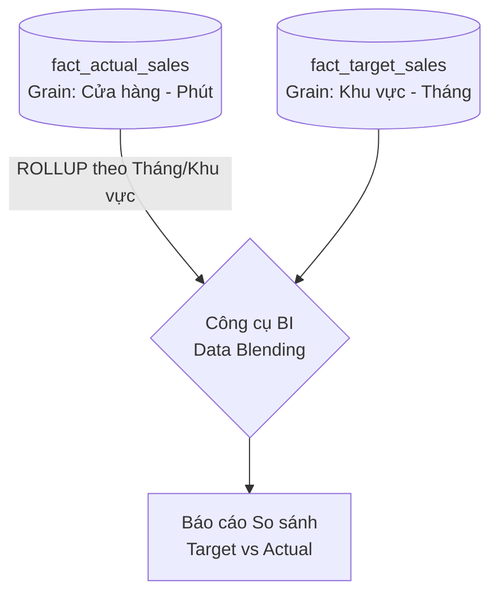

Trong thiết kế kiến trúc dữ liệu, có những quyết định tuy nhỏ nhưng lại mang tính sống còn đối với sự thành bại của cả dự án. Một trong số đó là việc xác định **Grain** (Độ mịn hay Độ hạt dữ liệu). Nếu bạn định nghĩa Grain một cách hời hợt hoặc tệ hơn là trộn lẫn các mức độ chi tiết khác nhau vào cùng một bảng, hệ thống báo cáo của bạn sẽ nhanh chóng hiển thị những con số sai lệch, đánh mất hoàn toàn niềm tin từ phía người dùng kinh doanh.

## Câu hỏi sống còn: Một dòng dữ liệu đại diện cho cái gì?

Trong phương pháp mô hình hóa chiều (Dimensional Modeling) và xây dựng kho dữ liệu ([Data Warehouse](/concepts/2-storage/data-warehouse/data-warehouse/)), Độ mịn (Grain hoặc Granularity) định nghĩa mức độ chi tiết vật lý chính xác mà một dòng dữ liệu (record) trong Bảng sự kiện (Fact Table) đại diện.

Để xác định Grain của một bảng, bạn chỉ cần trả lời duy nhất một câu hỏi: *"Một dòng dữ liệu trong bảng Fact này mô tả chính xác sự kiện thực tế gì?"*

Dưới đây là một số ví dụ về việc phát biểu Grain rõ ràng:
* *"Mỗi dòng đại diện cho một sản phẩm cụ thể được quét mã vạch trên một hóa đơn mua sắm."* (Grain: Dòng sản phẩm / Line item).
* *"Mỗi dòng đại diện cho tổng doanh số của một cửa hàng cụ thể thu được trong một ngày."* (Grain: Cửa hàng - Ngày).
* *"Mỗi dòng đại diện cho số dư tài khoản ngân hàng của một khách hàng vào cuối mỗi tháng."* (Grain: Tài khoản - Tháng).

Dữ liệu được lưu trữ ở mức độ chi tiết càng cao (ví dụ: từng giao dịch đơn lẻ), chúng ta gọi là **Fine Grain** (Độ mịn cao). Ngược lại, dữ liệu được gom nhóm hoặc tổng hợp trước khi lưu trữ (ví dụ: tổng doanh thu theo tuần/tháng), chúng ta gọi là **Coarse Grain** (Độ mịn thô/thấp).

## Tại sao việc bỏ quên "độ mịn" lại khiến hệ thống báo cáo đổ vỡ?

Dữ liệu doanh nghiệp đến từ rất nhiều nguồn và phục vụ các nhóm đối tượng khác nhau. Phòng Marketing có thể chỉ quan tâm đến ngân sách ở mức "Tháng", trong khi quản lý cửa hàng lại cần giám sát hiệu năng bán hàng theo "Từng hóa đơn". 

Nếu bạn thiết kế các bảng dữ liệu mà không thống nhất và công bố rõ ràng về độ mịn từ trước, hệ thống sẽ phải gánh chịu hai hệ quả tai hại:

1. **Lỗi Nhân đôi số liệu (Double-counting)**: Nếu bạn vô tình nhét dòng tổng hợp doanh thu ngày Thứ Hai và Thứ Ba vào chung một bảng với dòng tổng doanh thu của cả tuần đó, khi người dùng thực hiện hàm tính tổng `SUM(revenue)`, con số tổng thu về sẽ bị nhân lên gấp đôi.
2. **Mất khả năng phân tích sâu (Drill-down)**: Nếu bạn nạp dữ liệu vào kho đã qua xử lý gom nhóm theo ngày, bạn sẽ mãi mãi không thể giúp sếp trả lời câu hỏi: *"Vào khung giờ vàng 9:00 - 10:00 sáng hôm qua, chúng ta đã bán được bao nhiêu ly trà sữa?"*.

Khái niệm Grain sinh ra như một bộ quy tắc chặt chẽ giúp các kỹ sư dữ liệu định hình cấu trúc trước khi đặt những viên gạch đầu tiên xây dựng bảng.

## Quy tắc thép của Kimball và cách nó định hình Fact Table

Triết lý của Ralph Kimball, cha đẻ của Dimensional Modeling, nhấn mạnh quy trình thiết kế gồm 4 bước:
1. Chọn quy trình nghiệp vụ (Business Process).
2. **Khai báo độ mịn dữ liệu (Declare the Grain)** — *Bước then chốt nhất!*
3. Xác định các chiều (Dimensions).
4. Xác định các chỉ số (Facts).

Quy tắc bất di dịch của Kimball là: **"Mọi dòng dữ liệu trong một Fact Table bắt buộc phải có cùng một mức Grain duy nhất."** Không có bất kỳ ngoại lệ nào.

Khi đã tuyên bố Grain ở Bước 2, tất cả các chiều dữ liệu (Dimensions) ở Bước 3 phải hoàn toàn tương thích với mức Grain đó. Ví dụ: Nếu Grain được chọn là "Doanh số cấp độ Cửa hàng - Ngày", bạn không thể chèn khóa ngoại khách hàng (`customer_key`) vào bảng Fact này. Lý do rất đơn giản: Trong một ngày, một cửa hàng có thể đón tiếp hàng ngàn khách hàng khác nhau, một khóa ngoại duy nhất không thể đại diện cho toàn bộ họ.

## Minh họa thực tế: Khi sự lẫn lộn phá hủy con số

Hãy xem xét một bảng dữ liệu vi phạm nguyên tắc thiết kế Grain:

**Bảng `fact_sales_bad` (Lẫn lộn Grain: Vừa lưu chi tiết sản phẩm, vừa lưu dòng tổng hóa đơn)**

| order_id | product_name | quantity | revenue |
| :--- | :--- | :--- | :--- |
| O-01 | Apple | 1 | 100 |
| O-01 | Banana | 2 | 50 |
| **O-01** | **(TỔNG ĐƠN HÀNG O-01)** | **3** | **150** |

Nếu một chuyên viên phân tích chạy câu lệnh `SELECT SUM(revenue)` trên bảng này, kết quả nhận được sẽ là **300** thay vì doanh thu thực tế là **150**. Điều này sẽ phá hủy hoàn toàn độ tin cậy của báo cáo.

### Xử lý chênh lệch Grain (Drill Across)

Giả sử doanh nghiệp của bạn có 2 luồng dữ liệu nghiệp vụ:
1. Mục tiêu doanh thu (Target) được giao theo cấp độ **Khu vực (Region)** và **Tháng (Month)**.
2. Doanh thu thực tế (Actual) đổ về chi tiết theo **Cửa hàng (Store)** và **Phút (Minute)**.




Chúng ta tuyệt đối không được gộp chung 2 luồng này vào một bảng duy nhất. Giải pháp chuẩn mực là tách làm 2 Fact Table riêng biệt với 2 mức Grain tương ứng:

**1. Bảng Doanh thu thực tế (Atomic Grain)**

```sql
CREATE TABLE fact_actual_sales (
    date_key INT,
    time_key INT,
    store_key INT,
    product_key INT,
    quantity INT,
    revenue DECIMAL(10,2)
);
-- Grain: 1 dòng = 1 sản phẩm bán ra tại 1 cửa hàng vào 1 phút cụ thể.
```

**2. Bảng Mục tiêu kinh doanh (Aggregated Grain)**

```sql
CREATE TABLE fact_target_sales (
    month_key INT,
    region_key INT,
    target_revenue DECIMAL(15,2)
);
-- Grain: 1 dòng = Mục tiêu giao cho 1 khu vực trong 1 tháng.
```

Khi cần lập báo cáo so sánh, chúng ta sẽ thực hiện tổng hợp (Roll-up) dữ liệu thực tế từ bảng `fact_actual_sales` lên cấp độ (Tháng + Khu vực) bằng các công cụ BI hoặc SQL trước, rồi mới ghép (JOIN) với bảng `fact_target_sales`.

## Quy tắc "vàng" cho kỹ sư dữ liệu

* **Ưu tiên hàng đầu cho dữ liệu nguyên bản (Atomic Grain)**: Hãy luôn cố gắng lưu trữ dữ liệu ở mức độ chi tiết nguyên bản, sâu nhất có thể.

## Điểm mạnh và điểm yếu (Pros & Cons)

### Điểm mạnh (Pros)
* **Tối đa hóa tính linh hoạt (với Atomic Grain)**: Cho phép người dùng BI thực hiện bất kỳ phép phân tích ngẫu nhiên nào và khoan sâu (drill-down) dữ liệu đến mức tối đa.
* **Ngăn chặn lỗi số liệu**: Khai báo rõ ràng và tuân thủ Grain thống nhất giúp triệt tiêu hoàn toàn lỗi nhân đôi số liệu (double-counting).
* **Đơn giản hóa mô hình hóa**: Định nghĩa Grain chuẩn giúp việc xác định các chiều Dimension và các chỉ số Fact trở nên rõ ràng, không bị lẫn lộn.

### Điểm yếu (Cons)
* **Gánh nặng dung lượng**: Lưu trữ ở mức độ hạt mịn sâu nhất (Atomic) làm kích thước bảng Fact tăng lên nhanh chóng, tốn chi phí lưu trữ.
* **Suy giảm hiệu năng truy vấn**: Khi cần xem báo cáo tổng hợp cấp cao, hệ thống sẽ phải xử lý và tính toán trên hàng tỷ dòng dữ liệu chi tiết, tăng độ trễ báo cáo.

## Khi nào nên và không nên dùng

### Khi nào nên dùng
* Bắt đầu bất kỳ quy trình thiết kế Fact Table hoặc Dimensional Model nào (bắt buộc phải tuyên bố Grain rõ ràng).
* Ưu tiên thiết kế mức hạt mịn nguyên bản (Atomic Grain) cho các hệ thống BI hiện đại có khả năng xử lý truy vấn mạnh mẽ.

### Khi nào không nên dùng
* Khi thiết kế các hệ thống báo cáo tổng quan cấp cao mà hiệu năng tính toán bị giới hạn nghiêm trọng (lúc này nên dùng các bảng tổng hợp sẵn - Aggregated Summary Tables).
* Trộn lẫn nhiều Grain khác nhau trong cùng một bảng Fact.

---

## Các khái niệm liên quan
* [Fact Table (Bảng sự kiện)](/concepts/2-storage/data-warehouse/fact-table/)
* [Dimensional Modeling (Mô hình hóa chiều)](/concepts/2-storage/data-warehouse/dimensional-modeling/)
* [Kimball Methodology (Phương pháp luận Kimball)](/concepts/2-storage/data-warehouse/kimball-methodology/)

## Trọng tâm ôn luyện phỏng vấn

### 1. Nếu hệ thống hiện tại đang lưu trữ số liệu bán hàng ở mức Grain là "Ngày". Sếp đột ngột yêu cầu xuất báo cáo theo "Giờ". Bạn sẽ giải quyết bài toán này như thế nào?
* **Gợi ý trả lời**: Từ dữ liệu có độ hạt thô (coarse-grained) như "Ngày", chúng ta hoàn toàn không có cách nào dùng thuật toán để phân rã ngược lại thành mức chi tiết hơn là "Giờ", vì thông tin thời gian chi tiết đã bị lược bỏ trong quá trình tổng hợp trước đó. Để giải quyết yêu cầu này, tôi bắt buộc phải quay lại hệ thống nguồn, điều chỉnh hoặc xây dựng một luồng ETL mới để trích xuất dữ liệu ở mức nguyên bản (Atomic Grain - chi tiết từng giao dịch kèm mốc giờ cụ thể) và lưu vào một Fact Table mới. Bảng cũ có thể được giữ lại để làm bảng tổng hợp (Summary Table) giúp tăng tốc cho các báo cáo ngày.

### 2. Làm thế nào để xử lý chi phí vận chuyển (Freight) phát sinh ở mức "Đơn hàng" (Header), trong khi Fact Table của bạn lại được thiết kế ở mức "Chi tiết sản phẩm" (Line Item)?
* **Gợi ý trả lời**: Đây là một bài toán rất phổ biến trong thiết kế Data Warehouse. Tôi có hai hướng giải quyết tùy thuộc vào nhu cầu phân tích của doanh nghiệp:
  * *Cách 1 - Tách bảng*: Xây dựng 2 Fact Table riêng biệt. Một bảng `fact_order_header` chứa các chỉ số ở cấp độ đơn hàng (như phí vận chuyển, mã giảm giá của cả đơn). Một bảng `fact_order_line` chứa chi tiết từng sản phẩm. Cách này đảm bảo dữ liệu sạch sẽ, không bị lặp lại, nhưng khi cần tính lợi nhuận ròng chi tiết cho từng sản phẩm thì việc viết câu lệnh JOIN sẽ phức tạp hơn.
  * *Cách 2 - Phân bổ (Allocation)*: Giữ nguyên một Fact Table ở mức Line Item, nhưng tại khâu ETL, tôi sẽ dùng một thuật toán phân bổ hợp lý để chia nhỏ chi phí vận chuyển từ cấp đơn hàng xuống từng sản phẩm. Tiêu chí phân bổ có thể dựa trên tỷ trọng giá trị sản phẩm hoặc trọng lượng của chúng. Ví dụ, phí vận chuyển đơn hàng là 100k, sản phẩm A chiếm 70% giá trị đơn hàng thì nó sẽ được gán 70k phí vận chuyển. Cách này giúp phân tích lợi nhuận sản phẩm rất nhanh chóng và tránh được lỗi nhân đôi chi phí khi chạy hàm `SUM`.

## Xem thêm các khái niệm liên quan
* [Kho dữ liệu phân tích - Data Warehouse](/concepts/2-storage/data-warehouse/data-warehouse/)
* [Bảng chiều - Dimension Table](/concepts/2-storage/data-warehouse/dimension-table/)
* [Mô hình hóa dữ liệu đa chiều - Dimensional Modeling](/concepts/2-storage/data-warehouse/dimensional-modeling/)

## Tài liệu tham khảo

1. [Declaring the Grain](https://www.kimballgroup.com/2003/03/declaring-the-grain/) - Ralph Kimball's guide on declaring the grain of a fact table on Kimball Group.
2. [Grain - Kimball Dimensional Modeling Techniques](https://www.kimballgroup.com/data-warehouse-business-intelligence-resources/kimball-techniques/dimensional-modeling-techniques/grain/) - Official Kimball Group techniques index definition for dimensional grain.
3. [Databricks Dimensional Modeling Guide](https://docs.databricks.com/en/lakehouse-architecture/dimensional-modeling.html) - Databricks architectural recommendations for defining granularity and star schema structures.
4. [Snowflake Dimensional Modeling Considerations](https://docs.snowflake.com/en/user-guide/design-schemas-dimensional) - Snowflake guidelines for designing fact and dimension schemas on the cloud data platform.
5. [Google Cloud BigQuery Dimensional Modeling](https://cloud.google.com/bigquery/docs/dimensional-modeling) - Google Cloud guide on designing fact and dimension tables, handling grains, and schema optimizations in BigQuery.

## English Summary

In dimensional modeling, "Grain" (or Granularity) defines the exact level of detail represented by a single row within a Fact Table. Establishing the grain is the most critical and uncompromisable step in Data Warehouse design (Step 2 of the Kimball methodology). A fact table must strictly adhere to a single, uniform grain. Mixing different grains (e.g., storing both individual transaction lines and daily summary totals in the same table) will inevitably lead to catastrophic double-counting and data integrity failures. Best practice strongly advocates designing fact tables at the lowest possible atomic grain to preserve maximum flexibility for unpredictable ad-hoc queries, handling aggregation dynamically at the BI layer.