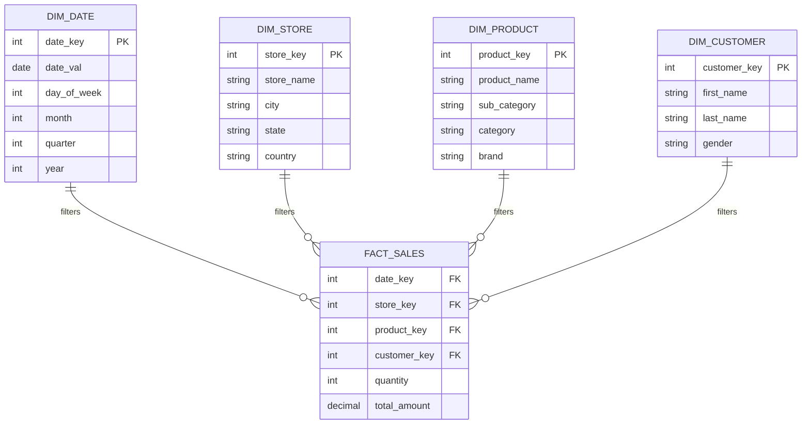

Trong thiết kế kho dữ liệu ([Data Warehouse](/concepts/2-storage/data-warehouse/data-warehouse/)) theo trường phái Dimensional Modeling, **Star Schema (Lược đồ hình sao)** được ví như một "tiêu chuẩn vàng" kinh điển. Cái tên đầy hình tượng này bắt nguồn từ việc biểu đồ quan hệ của hệ thống trông giống hệt như một ngôi sao: nằm ở trung tâm là một bảng sự kiện (Fact Table) lưu trữ các chỉ số đo lường, bao quanh và kết nối trực tiếp với nó là các bảng chiều (Dimension Tables) chứa các thông tin mô tả ngữ cảnh. 

Nhờ cấu trúc đơn giản, trực quan và có phần phi chuẩn hóa (denormalized) này, Star Schema mang lại tốc độ truy vấn phân tích đáng kinh ngạc, đồng thời cực kỳ thân thiện với các công cụ Business Intelligence (BI) như Power BI hay Tableau.

## Giải mã cấu trúc của một "Ngôi sao"

Về mặt kỹ thuật, Star Schema là một dạng mô hình dữ liệu đa chiều đơn giản nhưng cực kỳ hiệu quả, được nhận diện bởi ba đặc điểm cốt lõi:

1. **Bảng Fact (Fact Table) làm trung tâm:** Đây là trái tim của lược đồ, nơi lưu giữ các con số đo lường định lượng (như doanh thu, số lượng bán) và hệ thống khóa ngoại (Foreign Keys) liên kết ra xung quanh.
2. **Các bảng Dimension (Dimension Tables) vệ tinh:** Các bảng này chứa các thuộc tính mô tả (như tên sản phẩm, thông tin khách hàng, ngày tháng năm) và kết nối trực tiếp vào bảng Fact ở giữa thông qua các khóa liên kết (thường là Surrogate Keys - khóa giả).
3. **Thiết kế phi chuẩn hóa (Denormalized):** Đây là điểm khác biệt lớn nhất. Các bảng Dimension trong Star Schema hoàn toàn không có bảng con nào khác bám vào. Ví dụ, một bảng sản phẩm (`DIM_PRODUCT`) sẽ chứa luôn cả thông tin tiểu mục (SubCategory) và danh mục (Category), thay vì chia nhỏ thành 3 bảng riêng lẻ.

## Tại sao chúng ta cần Star Schema?

Để hiểu tại sao Star Schema lại quan trọng, hãy thử nhìn vào thế giới của các cơ sở dữ liệu giao dịch truyền thống ([OLTP](/concepts/2-storage/database-storage/oltp/)). Để lấy được doanh thu của một cửa hàng thuộc khu vực Miền Nam, bán sản phẩm thuộc danh mục Đồ gia dụng trong ngày hôm nay, hệ thống OLTP thường phải thực hiện phép nối (`JOIN`) qua 5-6 bảng liên tiếp. Trong thế giới dữ liệu, `JOIN` các bảng lớn là một trong những tác vụ tốn kém CPU và RAM nhất, có thể dễ dàng "bóp nghẹt" hiệu năng hệ thống.

Star Schema ra đời để giải quyết triệt để vấn đề này. Bằng cách gom tất cả các thuộc tính mô tả liên quan vào một bảng Dimension duy nhất và gắn trực tiếp vào bảng Fact, chúng ta đã biến một câu truy vấn phức tạp với 6 phép JOIN lồng vòng thành một câu truy vấn siêu đơn giản chỉ với 2 hoặc 3 phép JOIN trực tiếp. Kết quả là các báo cáo dữ liệu khổng lồ có thể trả về chỉ trong vài giây.

## Đánh đổi dung lượng lấy tốc độ: Triết lý đằng sau Star Schema

Thiết kế Star Schema dựa trên một triết lý đánh đổi kinh điển trong khoa học máy tính: **Chấp nhận dư thừa dữ liệu (Redundancy) để đổi lấy hiệu năng truy xuất.**

Do các bảng Dimension được thiết kế theo dạng phi chuẩn hóa, dữ liệu mô tả sẽ bị lặp đi lặp lại. Giả sử hệ thống có 1 triệu sản phẩm, trong đó có 100,000 sản phẩm thuộc danh mục "Điện thoại". Khi đó, từ khóa "Điện thoại" sẽ được lưu lặp lại đúng 100,000 lần trên ổ đĩa. 

Trong tư duy thiết kế cơ sở dữ liệu giao dịch (3NF), đây là một điều tối kỵ vì gây lãng phí bộ nhớ và dễ dẫn đến mất đồng bộ dữ liệu. Thế nhưng, trong tư duy thiết kế kho dữ liệu ([OLAP](/concepts/2-storage/database-storage/olap/)):
* Chi phí cho ổ cứng lưu trữ hiện nay vô cùng rẻ. Việc dư thừa vài Gigabyte dữ liệu dạng văn bản không còn là vấn đề đau đầu.
* Thời gian chờ đợi của người dùng và tài nguyên tính toán (CPU & Memory) khi chạy báo cáo mới là thứ đắt đỏ.

Chính vì vậy, Star Schema đã chọn tối ưu hóa tốc độ truy vấn và chấp nhận hy sinh một phần không gian lưu trữ.

## Cách thức vận hành dưới góc nhìn của Database

Khi bạn kéo thả một biểu đồ trên công cụ BI hoặc chạy một câu lệnh SQL, hệ thống sẽ thực hiện theo các bước:
1. Xác định các bộ lọc từ các bảng **Dimension** (ví dụ: lấy năm 2026 từ bảng Date, lấy vùng Hà Nội từ bảng Store).
2. Xác định phép tính tổng hợp trên bảng **Fact** (ví dụ: tính tổng doanh thu `SUM(total_amount)`).
3. Database engine sẽ tận dụng các bộ lọc từ Dimension để tìm ra danh sách các khóa (`date_key`, `store_key`), sau đó chiếu thẳng vào bảng Fact để lọc nhanh các bản ghi phù hợp và tiến hành cộng dồn. Cơ chế tối ưu này thường được các hệ quản trị cơ sở dữ liệu gọi là **Star-join optimization**.

## Kiến trúc và Sơ đồ quan hệ (ERD) điển hình

Hãy cùng quan sát sơ đồ ERD của một Star Schema tiêu chuẩn dưới đây:



> [!NOTE]
> Tất cả các mối quan hệ đều là Một-Nhiều (1-to-Many), đi từ bảng Dimension trỏ thẳng vào bảng Fact ở trung tâm. Hoàn toàn không có các bảng phụ nối tiếp từ Dimension ra ngoài.

## Ví dụ thực tế

Hãy xem một ví dụ thực tế khi chúng ta cần tính: *"Tổng doanh thu bán các sản phẩm Apple tại cửa hàng khu vực Hà Nội trong năm 2026"*.

Câu SQL tương ứng trên Star Schema sẽ cực kỳ gọn gàng và trực quan:
```sql
SELECT 
    d.month,
    SUM(f.total_amount) AS revenue
FROM fact_sales f
JOIN dim_date d ON f.date_key = d.date_key
JOIN dim_store s ON f.store_key = s.store_key
JOIN dim_product p ON f.product_key = p.product_key
WHERE 
    d.year = 2026
    AND s.city = 'Hà Nội'
    AND p.brand = 'Apple'
GROUP BY 
    d.month
ORDER BY 
    d.month;
```

Bộ tối ưu hóa (Optimizer) của database sẽ lọc nhanh các bản ghi thỏa mãn điều kiện ở các bảng Dimension trước để lấy ra danh sách các Key, sau đó mới quét qua bảng `fact_sales` khổng lồ. Cách làm này giúp giảm thiểu tối đa lượng dữ liệu cần xử lý.

## Nghệ thuật thiết kế Star Schema: Nguyên tắc vàng và cạm bẫy cần tránh

### Các Best Practices nên áp dụng
* **Giữ liên kết trực tiếp:** Mọi bảng Dimension bắt buộc phải nối thẳng tới bảng Fact. Tránh tạo ra các bảng trung gian (Bridge tables) trừ khi bạn đang phải giải quyết bài toán quan hệ Nhiều-Nhiều (Many-to-Many) cực kỳ phức tạp.
* **Xác định rõ độ chi tiết ([Grain](/concepts/2-storage/data-warehouse/grain/)):** Mỗi dòng trong bảng Fact phải đại diện cho cùng một mức độ chi tiết dữ liệu. Ví dụ: nếu bảng Fact lưu chi tiết đơn hàng ở mức từng sản phẩm, bạn tuyệt đối không được chèn thêm các dòng tổng hợp của cả hóa đơn vào bảng này.
* **Sử dụng [Surrogate Key](/concepts/2-storage/data-warehouse/surrogate-key/) làm khóa chính:** Hãy dùng các số nguyên (`INT`/`BIGINT`) làm khóa liên kết thay vì dùng các chuỗi văn bản (`VARCHAR`). Khóa dạng số giúp việc JOIN diễn ra nhanh hơn và giảm thiểu dung lượng của bảng Fact.
* **Xây dựng Conformed Dimensions:** Thiết kế các bảng Dimension có thể dùng chung cho nhiều bảng Fact khác nhau. Ví dụ, bảng `dim_date` nên được dùng chung cho cả bảng `fact_sales` và bảng `fact_inventory` để đảm bảo số liệu báo cáo đồng nhất theo thời gian.

### Những sai lầm phổ biến (Common Mistakes)
* **Nhét dữ liệu văn bản vào bảng Fact:** Đưa các trường thông tin như `product_name` hay `customer_email` trực tiếp vào bảng Fact cho "tiện". Việc này sẽ khiến bảng Fact (vốn chứa hàng trăm triệu đến hàng tỷ dòng) phình to khủng khiếp, làm nghẹt đường truyền và bộ nhớ.
* **Vô tình biến Star thành [Snowflake](/concepts/2-storage/cloud-data-platform/snowflake/):** Đôi khi vì cảm thấy khó chịu với việc dữ liệu bị trùng lặp trong bảng Dimension (như danh mục sản phẩm lặp đi lặp lại), lập trình viên quyết định tách nó ra thành bảng `dim_category`. Hành động này đã vô tình phá vỡ cấu trúc Star Schema và biến nó thành Snowflake Schema, làm tăng số lượng JOIN và giảm hiệu năng truy vấn.
* **Lạm dụng giá trị NULL ở khóa ngoại:** Nếu một đơn hàng không có ngày giao, việc để giá trị `NULL` ở trường `delivery_date_key` có thể làm hỏng các phép `INNER JOIN`. Thay vào đó, hãy trỏ nó về một dòng mặc định trong bảng Date có khóa là `-1` với ý nghĩa "Không áp dụng" hoặc "Chưa xác định".

## Điểm mạnh và điểm yếu (Trade-offs)

### Điểm mạnh
* **Hiệu năng vượt trội:** Đường dẫn JOIN ngắn nhất, số lượng phép JOIN vật lý tối thiểu.
* **Dễ tiếp cận và sử dụng:** Rất dễ hiểu đối với người dùng nghiệp vụ (Business Users) khi họ muốn tự tạo báo cáo kéo thả trên các công cụ BI.
* **Tương thích hoàn hảo:** Các công cụ phân tích hiện đại đều được thiết kế để nhận diện và tối ưu hóa tốt nhất cho Star Schema.

### Điểm yếu
* **Dư thừa dữ liệu:** Tốn thêm dung lượng lưu trữ do phi chuẩn hóa dữ liệu mô tả ở các bảng Dimension.
* **Bảo trì phức tạp (SCD):** Khi thông tin mô tả thay đổi (ví dụ: khách hàng chuyển địa chỉ, sản phẩm đổi nhóm), chúng ta phải có các chiến lược xử lý dữ liệu thay đổi theo thời gian (Slowly Changing Dimensions - SCD) để cập nhật hoặc lưu vết lịch sử một cách khéo léo.

## Khi nào nên dùng và Khi nào nên tránh?

**Nên dùng khi:**
* Bạn thiết kế Data Warehouse, Data Mart hoặc Semantic Layer phục vụ trực tiếp cho báo cáo và phân tích.
* Bạn đang xây dựng mô hình dữ liệu cho Power BI (DAX engine được tối ưu hóa cực mạnh cho Star Schema).

**Nên tránh khi:**
* Bạn đang xây dựng các hệ thống giao dịch (OLTP) đòi hỏi ghi dữ liệu liên tục với tốc độ cao và yêu cầu tính toàn vẹn dữ liệu ở mức tối đa.
* Xây dựng tầng lưu trữ dữ liệu trung tâm Enterprise Data Warehouse theo kiến trúc chuẩn hóa 3NF của Inmon.

## Khái niệm liên quan & Tài liệu tham khảo

**Khái niệm liên quan:**
* [Dimensional Modeling - Mô hình hóa đa chiều](/concepts/2-storage/data-warehouse/dimensional-modeling/)
* [Snowflake Schema - Lược đồ bông tuyết](/concepts/2-storage/data-warehouse/snowflake-schema/)
* [Fact Table - Bảng sự kiện](/concepts/2-storage/data-warehouse/fact-table/)
* [Dimension Table - Bảng chiều](/concepts/2-storage/data-warehouse/dimension-table/)

## Xem thêm các khái niệm liên quan
* [Kho dữ liệu phân tích - Data Warehouse](/concepts/2-storage/data-warehouse/data-warehouse/)
* [Bảng chiều - Dimension Table](/concepts/2-storage/data-warehouse/dimension-table/)
* [Mô hình hóa dữ liệu đa chiều - Dimensional Modeling](/concepts/2-storage/data-warehouse/dimensional-modeling/)

## Tài liệu tham khảo

1. [AWS: Redshift Designing Star Schemas](https://aws.amazon.com/blogs/big-data/best-practices-for-designing-dimensional-models-in-amazon-redshift/) - Architectural guidelines for building star schemas on Amazon Redshift.
2. [Google Cloud: Star Schema Best Practices on BigQuery](https://cloud.google.com/bigquery/docs/schemas) - Best practices on modeling star schemas and dimension tables in BigQuery.
3. [Azure: Relational Data Warehousing architecture](https://azure.microsoft.com/en-us/solutions/data-warehouse/) - Microsoft handbook on designing and deploying Kimball star schemas in Azure Synapse.
4. [Snowflake: Star Schema Design Patterns](https://docs.snowflake.com/en/user-guide/data-sharing-intro) - Guide on optimizing tables and designing star schemas in Snowflake.
5. [Databricks: Gold Layer Star Schema Modeling](https://www.databricks.com/glossary/medallion-architecture) - Implementing structured star schemas within Databricks Medallion lakehouse architecture.
6. [Apache Hive: Design Patterns and Star Schemas](https://cwiki.apache.org/confluence/display/Hive/DesignPatterns) - Setting up partitioned star schemas in Hive.

---

## Trọng tâm ôn luyện phỏng vấn

### 1. Tại sao Star Schema thường cho tốc độ truy vấn nhanh hơn Snowflake Schema?
**Gợi ý trả lời:**
Star Schema giữ các bảng Dimension ở trạng thái phi chuẩn hóa (denormalized), nghĩa là toàn bộ thông tin mô tả ngữ cảnh đều nằm chung trong một bảng duy nhất. Khi cần truy vấn, hệ thống chỉ cần thực hiện 1 phép JOIN từ bảng Fact ra bảng Dimension đó. 

Trong khi đó, Snowflake Schema chuẩn hóa các bảng Dimension bằng cách băm nhỏ chúng ra thành các bảng phân cấp (ví dụ: tách Product thành Product $\rightarrow$ SubCategory $\rightarrow$ Category). Khi truy vấn, database engine buộc phải thực hiện một chuỗi JOIN liên hoàn để lấy đủ thông tin. Các phép JOIN vật lý cực kỳ tiêu tốn tài nguyên CPU và RAM. Vì thế, việc giảm thiểu số lượng JOIN giúp Star Schema luôn có tốc độ vượt trội hơn.

### 2. Nếu bảng Dimension của bạn có tới 100 triệu dòng và việc phi chuẩn hóa Star Schema gây tốn hàng trăm GB ổ cứng, bạn sẽ giải quyết thế nào?
**Gợi ý trả lời:**
Đây là một bài toán thực tế thú vị liên quan đến việc cân bằng giữa hiệu năng và chi phí. Nếu gặp phải bảng Dimension khổng lồ (Monster Dimension) mà việc phi chuẩn hóa làm tốn quá nhiều dung lượng lưu trữ, chúng ta có thể áp dụng giải pháp lai (Hybrid approach):
* Đối với nhánh Dimension quá lớn đó, ta chủ động chuẩn hóa một phần (như tách nhỏ ra theo mô hình Snowflake) để tiết kiệm không gian lưu trữ và dễ quản lý.
* Đối với các nhánh Dimension nhỏ khác, ta vẫn giữ nguyên cấu trúc Star Schema để đảm bảo hiệu năng truy vấn cho các thuộc tính thường xuyên sử dụng.
Mục tiêu cuối cùng của Data Engineer là tìm ra điểm cân bằng tối ưu nhất giữa Performance (Hiệu năng) và Cost (Chi phí).

---

## English Summary

A Star Schema is the quintessential database architecture in dimensional modeling, characterized by a central Fact Table containing quantitative metrics (facts) linked directly to multiple denormalized Dimension Tables containing descriptive attributes. It earns its name from its visual resemblance to a star. By intentionally denormalizing the dimension tables (allowing data redundancy), the Star Schema minimizes complex table joins, thereby delivering lightning-fast query performance for OLAP workloads. Its intuitive structure makes it the "gold standard" for Data Marts and modern Business Intelligence tools, trading inexpensive disk space for expensive compute speed and user accessibility.