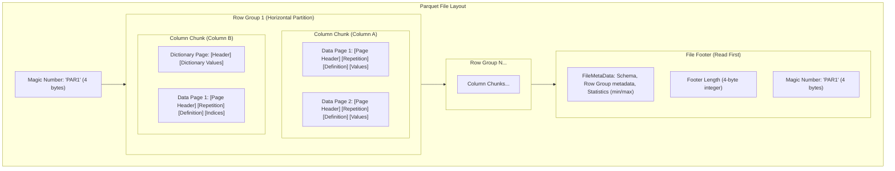
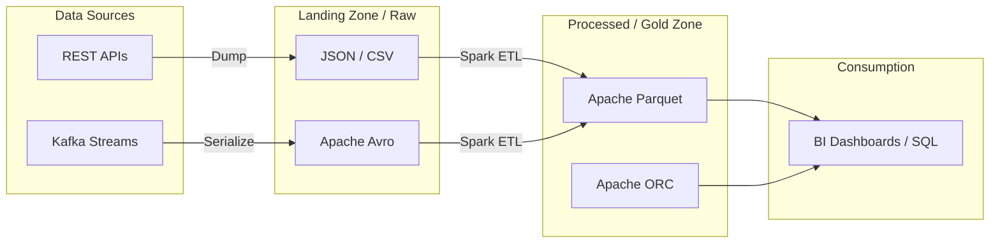

Trong các hệ quản trị cơ sở dữ liệu truyền thống (như MySQL hay PostgreSQL), dữ liệu được ẩn giấu và quản lý khép kín trong các cấu trúc lưu trữ riêng của hệ thống. Tuy nhiên, trong kiến trúc [Data Lake](/concepts/2-storage/data-lake-lakehouse/data-lake/) và Big Data, bức tranh hoàn toàn thay đổi. Dữ liệu được lưu trữ công khai dưới dạng các tệp tin vật lý trên các hệ thống Object Storage (như Amazon S3, Google [Cloud Storage](/concepts/2-storage/cloud-data-platform/cloud-storage/)). 

Việc lựa chọn định dạng tệp (File format) như Apache Parquet, ORC, Avro hay CSV không đơn thuần là cách lưu trữ, mà nó quyết định trực tiếp đến chi phí lưu trữ, tốc độ đọc/ghi dữ liệu và hiệu năng vận hành của toàn bộ hệ thống Data Pipeline.

---

## 1. Lưu trữ theo Dòng (Row-based) vs Lưu trữ theo Cột (Columnar)

Để hiểu rõ tại sao Parquet và Avro lại được thiết kế theo hai hướng hoàn toàn trái ngược, trước tiên chúng ta cần so sánh triết lý lưu trữ cốt lõi: [Lưu trữ dạng dòng (Row-based Storage)](/concepts/2-storage/database-storage/row-based-storage/) và [Lưu trữ dạng cột (Columnar Storage)](/concepts/2-storage/database-storage/columnar-storage/).

```
Row-based (Avro)              Columnar (Parquet)
+-------------------------+   +---------------------------------------+
| Row 1: ID, Name, Salary |   | Column ID:     [Row1_ID, Row2_ID]     |
| Row 2: ID, Name, Salary |   | Column Name:   [Row1_Name, Row2_Name] |
+-------------------------+   | Column Salary: [Row1_Sal, Row2_Sal]   |
                              +---------------------------------------+
```

### Triết lý của Row-based Serialization (Avro)
Trong định dạng Row-based, tất cả dữ liệu của một hàng (row) được lưu trữ liên tục bên cạnh nhau trên đĩa.
* **Ghi dữ liệu (Write-heavy)**: Cực kỳ nhanh vì khi thêm một hàng mới, hệ thống chỉ cần nối (append) dữ liệu hàng đó vào cuối file một cách tuần tự.
* **Đọc toàn bộ hàng (Point Lookup/Full Row Access)**: Rất hiệu quả vì chỉ cần một thao tác I/O đơn lẻ để nạp toàn bộ thông tin của một đối tượng cụ thể.
* **Điểm yếu**: Nếu bạn chỉ cần tính trung bình của cột `Salary` trên 1 tỷ dòng, hệ thống vẫn phải quét qua đĩa để đọc toàn bộ các cột khác (`ID`, `Name`, `Address`, v.v.) rồi bỏ chúng đi. Điều này gây lãng phí nghiêm trọng băng thông I/O đĩa và bộ nhớ đệm (cache lines).

### Triết lý của Columnar Serialization (Parquet)
Trong định dạng Columnar, dữ liệu của từng cột được nhóm lại và lưu trữ liên tục với nhau. Dữ liệu của cột `ID` nằm cạnh nhau, cột `Name` nằm cạnh nhau, và tương tự cho cột `Salary`.
* **Đọc phân tích (Analytical Queries/OLAP)**: Tối ưu vượt trội nhờ kỹ thuật **Column Pruning** (Bỏ qua các cột không truy vấn) và **Projection Pushdown** (Chỉ quét đĩa tại vị trí các cột được yêu cầu).
* **Nén dữ liệu (Compression efficiency)**: Vì dữ liệu trong một cột luôn có cùng kiểu dữ liệu (data type) và thường lặp lại (ví dụ: cột quốc gia, giới tính), các thuật toán nén có thể đạt tỷ lệ nén (compression ratio) cực kỳ cao.
* **Điểm yếu**: Việc cập nhật hoặc chèn từng dòng đơn lẻ (single-row insertion) rất tốn kém vì hệ thống phải phân rã dòng đó và ghi phân tán vào các vùng đĩa của từng cột tương ứng.

---

## 2. Kiến trúc Bên trong của Apache Parquet (Parquet Internals)

Apache Parquet là một định dạng lưu trữ dạng cột tự mô tả (self-describing columnar storage format) phức tạp. Để ghi dữ liệu tuần tự hiệu quả, phần Metadata quan trọng nhất được đặt ở **Footer** (cuối tệp).



### Chi tiết các thành phần cấu trúc:
1. **Magic Header & Footer (`PAR1`)**: Tệp Parquet luôn bắt đầu bằng 4 byte ký tự ASCII `'P' 'A' 'R' '1'` và kết thúc bằng chính 4 byte đó để nhận biết và kiểm tra tính toàn vẹn của tệp tin.
2. **Row Groups (Nhóm dòng)**: Đây là các phân vùng ngang (horizontal partitioning) của tập dữ liệu. Kích thước mặc định của mỗi Row Group thường dao động từ 128 MB đến 1 GB để tối ưu hóa việc đọc tuần tự dữ liệu lớn từ HDFS hoặc Object Storage.
3. **Column Chunks (Khối cột)**: Trong mỗi Row Group, dữ liệu của từng cột được phân tách thành một Column Chunk duy nhất. Chúng được đọc độc lập, hỗ trợ trực tiếp cho kỹ thuật lọc cột.
4. **Pages (Trang dữ liệu)**: Mỗi Column Chunk được chia nhỏ thành các đơn vị nhỏ hơn gọi là Page (thường có kích thước khoảng 1 MB). Page là đơn vị cơ bản để thực hiện nén (compression) và mã hóa (encoding). Có hai loại Page chính:
   * **Data Page**: Chứa các giá trị dữ liệu thực tế cùng với Repetition levels (mức độ lặp) và Definition levels (mức độ định nghĩa) để biểu diễn các cấu trúc dữ liệu lồng nhau (nested schema).
   * **Dictionary Page**: Chứa bảng tra cứu từ điển khi sử dụng cơ chế mã hóa từ điển (Dictionary Encoding).
5. **Page Headers**: Mỗi Page bắt đầu bằng một Page Header định dạng nhị phân Thrift chứa thông tin mô tả bao gồm: kiểu Page, kích thước sau/trước khi nén, số lượng giá trị, và các chỉ số thống kê nội bộ.
6. **File Footer Metadata**: Khi một engine truy vấn (như Spark, Trino, Athena) đọc một file Parquet, hành động đầu tiên của nó là **nhảy xuống cuối file (seek to end)** để đọc Footer Metadata. Footer Metadata chứa lược đồ dữ liệu, Row Group Metadata, Column Chunk Metadata (vị trí offset trên đĩa, các thuật toán mã hóa/nén được áp dụng, và thông tin thống kê **Min/Max Statistics**).

### Tại sao Min/Max Statistics trong Footer lại thay đổi cuộc chơi?
Nhờ việc lưu trữ thống kê giá trị tối thiểu (Min) và tối đa (Max) cho từng Column Chunk ngay trong Footer Metadata, các công cụ truy vấn có thể thực hiện **Row Group Skipping** (hoặc Predicate Pushdown). 

Nếu câu lệnh SQL của bạn yêu cầu `WHERE age > 40`, engine truy vấn chỉ cần đọc Footer Metadata. Nếu một Row Group có thống kê `age` với `Min = 18` và `Max = 35`, engine sẽ bỏ qua hoàn toàn việc tải và giải nén toàn bộ Row Group đó khỏi ổ đĩa. Điều này giảm thiểu tối đa tài nguyên I/O cần thiết.

---

## 3. Các Phương thức Mã hóa trong Parquet (Encoding Types)

Mã hóa (Encoding) là bước đầu tiên để chuyển đổi dữ liệu thô sang dạng nhị phân tối ưu trước khi nén. Parquet sử dụng nhiều kỹ thuật mã hóa kết hợp:

### Dictionary Encoding (Mã hóa Từ điển)
Khi một cột chứa nhiều giá trị lặp đi lặp lại (ví dụ: cột `City` chứa các chuỗi "Hanoi", "Saigon", "Da Nang"), Parquet xây dựng một bảng từ điển (Dictionary Page) ánh xạ các chuỗi duy nhất sang một chỉ số số nguyên (Integer ID), ví dụ: `0 -> "Hanoi"`, `1 -> "Saigon"`. Dữ liệu thực tế trong Data Page sẽ chỉ lưu trữ các số nguyên ngắn này thay vì toàn bộ chuỗi ký tự.

### Run-Length Encoding (RLE)
Kỹ thuật này cực kỳ hiệu quả khi dữ liệu có nhiều giá trị giống nhau xuất hiện liên tiếp. Thay vì lưu chuỗi giá trị `[A, A, A, A, B, B, B]`, RLE mã hóa nó thành cặp `(số lần lặp, giá trị)` $\rightarrow$ `(4, A), (3, B)`. RLE được sử dụng mặc định để mã hóa **Repetition levels** và **Definition levels**.

### Bit-packing (Đóng gói Bit)
Nếu giá trị lớn nhất trong mảng chỉ là `3` (chỉ cần tối đa 2 bit để biểu diễn nhị phân: `00, 01, 10, 11`), việc dùng 32-bit (4 bytes) cho mỗi số nguyên là rất lãng phí. Bit-packing loại bỏ các bit `0` dư thừa ở đầu và "gói" sát các bit có nghĩa lại với nhau. Ví dụ: Lưu trữ 8 số nguyên từ `0` đến `3` gộp lại chỉ tốn đúng `8 * 2 = 16 bits` (được nhồi gọn vào 2 byte bộ nhớ) thay vì `8 * 32 = 256 bits`.

---

## 4. Các Thuật toán Nén trong Parquet (Compression Algorithms)

Sau khi dữ liệu đã được mã hóa thô bằng Dictionary hay Bit-packing, Parquet sẽ áp dụng tiếp các [thuật toán nén](/concepts/2-storage/database-storage/compression-algorithms/) lên từng trang (Page). Ba thuật toán phổ biến nhất bao gồm:

| Thuật toán | Tốc độ Nén/Giải nén | Tỷ lệ Nén | Sử dụng Tài nguyên CPU | Trường hợp Sử dụng Tốt nhất |
| :--- | :--- | :--- | :--- | :--- |
| **Snappy** | Cực kỳ nhanh | Trung bình | Thấp | Phù hợp cho các hệ thống cần truy vấn thời gian thực, cân bằng giữa tốc độ và dung lượng. |
| **Gzip** | Chậm | Cao | Rất cao | Phù hợp cho lưu trữ dữ liệu lịch sử (cold data), ít khi truy vấn nhưng cần tiết kiệm ổ đĩa tối đa. |
| **ZSTD** (Zstandard) | Nhanh đến rất nhanh | Rất cao | Trung bình | **Tiêu chuẩn hiện đại**. ZSTD mang lại tỷ lệ nén tiệm cận Gzip nhưng tốc độ giải nén lại nhanh gần bằng Snappy. |

---

## 5. Kiến trúc Tuần tự hóa Lược đồ của Apache Avro (Avro Internals)

Apache Avro là một hệ thống tuần tự hóa dữ liệu hướng dòng (row-oriented). Điểm đặc biệt nhất của Avro là tính chất ghép đôi chặt chẽ giữa **Dữ liệu nhị phân (Binary Data)** và **Lược đồ JSON (JSON Schema)**.

```
+------------------------------------------------------------+
| AVRO OBJECT CONTAINER FILE (OCF) LAYOUT                    |
+------------------------------------------------------------+
| 1. Magic Number: 'O' 'b' 'j' 0x01                          |
| 2. File Metadata (Contains 'avro.schema' in JSON, codec)   |
| 3. Unique Sync Marker (16 random bytes)                    |
+------------------------------------------------------------+
| Block 1:                                                   |
| - Object Count (Long)                                      |
| - Block Serialized Size (Long)                             |
| - Binary Encoded Records (No schema overhead per row!)     |
| - 16-byte Sync Marker                                      |
+------------------------------------------------------------+
| Block 2: ...                                               |
+------------------------------------------------------------+
```

### Cách thức hoạt động và Schema Serialization của Avro:
1. **Schema dạng JSON nằm trong Header**: Trong một tệp tin container của Avro (Avro Object Container File - OCF), lược đồ dữ liệu (schema) định nghĩa các trường và kiểu dữ liệu được viết bằng cú pháp JSON và được nhúng trực tiếp vào phần đầu (Header) của tệp tin.
2. **Dữ liệu nhị phân siêu tinh gọn (Compact Binary Encoding)**: Vì lược đồ đã được khai báo ở đầu file, các dòng dữ liệu bên dưới (trong các Block) chỉ chứa các giá trị nhị phân thuần túy mà không kèm theo thông tin nào về tên cột hay kiểu dữ liệu. Hệ thống đọc dữ liệu nhị phân tuần tự và map ngược lại dựa trên vị trí định nghĩa trong JSON Schema. Kích thước của mỗi record nhỏ hơn rất nhiều so với JSON thô hay CSV.
3. **Sync Marker (Dấu phân tách khối)**: Tại Header và sau mỗi Block dữ liệu nhị phân, Avro chèn vào một chuỗi ngẫu nhiên dài 16 byte gọi là **Sync Marker**. Nó giúp các công cụ xử lý phân tán như MapReduce hay Spark thực hiện **Splitting** (chia nhỏ file để đọc song song). Khi nhảy vào giữa một file Avro khổng lồ, luồng đọc chỉ cần quét tuần tự cho đến khi tìm thấy chuỗi 16 byte trùng khớp với Sync Marker ở Header để định vị ranh giới Block mới.
4. **Schema Evolution (Tiến hóa lược đồ)**: Avro hỗ trợ tiến hóa lược đồ cực kỳ mạnh mẽ nhờ cơ chế so khớp giữa **Writer's Schema** (lược đồ khi ghi file) và **Reader's Schema** (lược đồ hiện tại khi đọc file). Engine tự động dịch chuyển và map dữ liệu dựa trên tên trường, xử lý các trường hợp thêm/bớt trường mà không làm hỏng pipeline.

---

## 6. Luồng phân chia dữ liệu trong Data Lake

Trong một Data Lake điển hình, việc lựa chọn định dạng tệp sẽ thay đổi tùy theo từng phân vùng (zone) của dữ liệu:



---

## 7. Thực chiến: So sánh kích thước lưu trữ CSV vs Parquet bằng Python

Đoạn code Python dưới đây (sử dụng thư viện `pandas` và `pyarrow`) sẽ minh họa rõ nét sự chênh lệch đáng kinh ngạc về kích thước lưu trữ giữa CSV và Parquet khi xử lý 1 triệu dòng dữ liệu:

```python
import pandas as pd
import numpy as np

# Tạo 1 triệu dòng dữ liệu giả lập
df = pd.DataFrame({
    'id': range(1000000),
    'status': np.random.choice(['SUCCESS', 'FAIL', 'PENDING'], 1000000),
    'revenue': np.random.random(1000000) * 100
})

# Lưu dưới dạng CSV
df.to_csv('data.csv', index=False)
# Kích thước: ~ 35 MB

# Lưu dưới dạng Parquet (mặc định nén Snappy)
df.to_parquet('data.parquet')
# Kích thước: ~ 4 MB (Nhỏ hơn gần 10 lần do cột 'status' được Dictionary Encoding và nén)
```

---

## Khi nào nên dùng

*   **Apache Parquet / ORC (Columnar)**: 
    *   Phù hợp cho các hệ thống Data Warehouse, Data Lakehouse hoặc các truy vấn phân tích (OLAP) quy mô lớn cần tối ưu hóa Disk/Network I/O.
    *   Khi bạn cần chạy các báo cáo BI, tổng hợp dữ liệu (aggregation) trên một vài cột cụ thể với hàng tỷ dòng dữ liệu.
*   **Apache Avro (Row-based)**:
    *   Phù hợp cho các ứng dụng streaming thời gian thực (Kafka), các Landing Zone lưu trữ dữ liệu thô và các hệ thống có Schema thay đổi liên tục.
*   **CSV / JSON (Text)**:
    *   Phù hợp cho các tập dữ liệu nhỏ cần trao đổi nhanh giữa các hệ thống khác nhau hoặc khi con người cần đọc trực tiếp nội dung file.

---

## Điểm mạnh và điểm yếu (Trade-offs)

### Điểm mạnh và điểm yếu

#### JSON / CSV
*   **Ưu điểm**: Thân thiện với con người (Human-readable), dễ dàng chia sẻ và tương thích với hầu như mọi công cụ.
*   **Nhược điểm**: Kích thước lưu trữ cồng kềnh, phân tích chậm, không có schema nội tại và khả năng nén kém, không thể nhảy dòng (seek) hiệu quả.

#### Apache Parquet
*   **Ưu điểm**: Tối ưu hóa cho các câu lệnh SQL phân tích (OLAP) với tốc độ vượt trội nhờ Column Pruning và Projection Pushdown, tiết kiệm tới 70-90% dung lượng lưu trữ trên đám mây.
*   **Nhược điểm**: Thời gian ghi dữ liệu lâu hơn, tốn RAM khi ghi (cần buffer dữ liệu), không thích hợp cho các tác vụ OLTP hoặc Streaming thời gian thực.

#### Apache Avro
*   **Ưu điểm**: Ghi dữ liệu nhanh, hỗ trợ Schema Evolution mạnh mẽ, là lựa chọn số một cho các kiến trúc Microservices truyền tin qua Kafka.
*   **Nhược điểm**: Phân tích SQL chậm hơn đáng kể so với Parquet do cấu trúc lưu trữ theo dòng (Row-based), buộc phải quét toàn bộ các cột.

---

## Trọng tâm ôn luyện phỏng vấn

### 1. Tại sao Parquet lại có tốc độ truy vấn nhanh hơn JSON rất nhiều trên Data Lake?
*   **Gợi ý trả lời**: Khi thực hiện câu lệnh truy vấn như `SELECT id FROM table`:
    *   Với JSON (dạng dòng): Các công cụ truy vấn (như Spark/Athena) bắt buộc phải quét qua toàn bộ file văn bản, phân tích cú pháp (parse) từng dòng để bóc tách trường `id`. Điều này gây tốn tài nguyên I/O đĩa và CPU rất lớn.
    *   Với Parquet (dạng cột nhị phân): Trình truy vấn chỉ cần đọc phần Metadata ở cuối file để xác định cột `id` nằm chính xác ở dải byte (offset) nào. Nó sẽ bỏ qua toàn bộ các cột khác và chỉ nạp đúng các byte của cột `id` lên bộ nhớ RAM. Nhờ dữ liệu được nén tối đa, thời gian truyền tải I/O giảm đi đáng kể.

### 2. Tại sao việc đọc dữ liệu từ một file Parquet lại bắt đầu từ cuối file thay vì đầu file?
*   **Gợi ý trả lời**: 
    Parquet được thiết kế để hỗ trợ truy vấn phân tích hiệu năng cao. Tất cả thông tin quan trọng nhất như: vị trí bắt đầu của các cột (Column Chunk offsets), kiểu dữ liệu (schema), và các chỉ số thống kê (min/max, null counts) đều được gom lại và ghi ở phần **File Footer Metadata** ở cuối tệp. 
    Nếu Metadata được đặt ở đầu file, khi ghi dữ liệu, hệ thống sẽ không thể biết trước kích thước chính xác của các cột để ghi offset chuẩn xác, buộc phải thực hiện ghi đệm toàn bộ dữ liệu vào memory (rất tốn RAM) hoặc phải cập nhật lại đầu file sau khi ghi xong (tốn I/O). Bằng cách đặt Metadata ở cuối file, Parquet có thể ghi dữ liệu tuần tự các Row Group xuống đĩa trước, sau đó tổng hợp thông tin và ghi Footer cuối cùng. Khi đọc, các engine chỉ cần đọc ngược lại vài byte cuối để xác định chiều dài Footer, nạp toàn bộ Metadata lên RAM, từ đó định vị chính xác byte offset của cột cần đọc mà không cần quét toàn bộ file.

### 3. Giải thích cơ chế Schema Evolution trong Avro. Làm thế nào Avro xử lý sự khác biệt giữa cấu trúc dữ liệu của người ghi (Writer) và người đọc (Reader)?
*   **Gợi ý trả lời**: 
    Avro thực hiện giải quyết khác biệt lược đồ (Schema Resolution) khi đọc dữ liệu. Khi một file Avro được ghi, nó luôn mang theo **Writer's Schema** bên trong header. Khi ứng dụng đọc file, nó sẽ truyền vào **Reader's Schema** (lược đồ mà code hiện tại đang mong muốn xử lý). Bộ giải mã của Avro (Avro Decoder) sẽ so sánh song song hai lược đồ này:
    1. Nếu một trường có mặt ở cả hai lược đồ, dữ liệu sẽ được đọc bình thường.
    2. Nếu Reader's Schema có thêm một trường mới so với Writer's Schema, Avro sẽ tự động điền giá trị mặc định (`default` value) được định nghĩa trong Reader's Schema cho trường đó.
    3. Nếu Reader's Schema không có một trường xuất hiện trong Writer's Schema, Avro sẽ bỏ qua (skip) các byte nhị phân tương ứng của trường đó một cách an toàn.
    Nhờ cơ chế này, hệ thống có thể nâng cấp ứng dụng đọc hoặc ghi một cách độc lập mà không sợ làm sập pipeline dữ liệu.

### 4. Sự khác biệt giữa Repetition Level và Definition Level trong cơ chế lưu trữ dữ liệu lồng nhau (nested data) của Parquet là gì?
*   **Gợi ý trả lời**: 
    Parquet sử dụng thuật toán Dremel để dẹt hóa (flatten) các cấu trúc lồng nhau (như Array, Struct, Map) thành các mảng phẳng mà vẫn bảo toàn cấu trúc dữ liệu:
    *   **Definition Level (Mức độ định nghĩa)**: Là một số nguyên cho biết có bao nhiêu trường tùy chọn (optional) hoặc lặp lại (repeated) trong đường dẫn của một trường thực sự được định nghĩa (tức là không phải NULL). Nó giúp xác định chính xác ở cấp bậc nào trong cấu trúc lồng nhau thì giá trị bị NULL.
    *   **Repetition Level (Mức độ lặp)**: Là một số nguyên cho biết ở cấp độ nào dữ liệu của danh sách (list/array) được lặp lại. Nó cho phép engine tái cấu trúc lại mảng phẳng thành các danh sách lồng nhau ban đầu bằng cách biết khi nào một danh sách kết thúc và một danh sách mới bắt đầu.
    Cả hai chỉ số này đều được nén bằng RLE kết hợp Bit-packing và được lưu trữ ngay trước các giá trị dữ liệu thực tế trong Data Page.

---

## Xem thêm các khái niệm liên quan
* [Phân cụm Dữ liệu - Clustering](/concepts/2-storage/database-storage/clustering/)
* [Lưu trữ dạng Cột - Columnar Storage](/concepts/2-storage/database-storage/columnar-storage/)
* [Thuật toán nén dữ liệu - Compression Algorithms](/concepts/2-storage/database-storage/compression-algorithms/)

## Tài liệu tham khảo

* [Apache Parquet - Official File Format Specifications](https://parquet.apache.org/docs/file-format/)
* [Apache Avro - Official Binary Serialization Specifications](https://avro.apache.org/docs/current/spec.html)
* [Apache ORC - Optimized Row Columnar Documentation](https://orc.apache.org/docs/)
* [AWS Athena - Columnar Storage Formats Performance Guide](https://docs.aws.amazon.com/athena/latest/ug/columnar-storage.html)
* [Google Cloud BigQuery - Storage and Ingestion Optimization](https://cloud.google.com/bigquery/docs/loading-data)
* [Databricks - File Formats Benchmarks: Parquet, Avro, and JSON](https://docs.databricks.com/data/index.html)
* [Confluent - Schema Registry and Avro Serialization Best Practices](https://docs.confluent.io/platform/current/schema-registry/index.html)

---

## English Summary

In Big Data and Data Lake architectures, choosing the right file format is crucial for balancing query performance, network bandwidth, and storage costs. Row-oriented formats like **Apache Avro** embed JSON schemas directly in their file headers and utilize compact binary encoding alongside 16-byte sync markers. This design makes Avro files splittable and highly efficient for write-heavy pipelines, data ingestion, and message streaming platforms like Apache Kafka. Conversely, columnar formats like **Apache Parquet** and **ORC** group data by columns rather than rows. Parquet organizes files into horizontal partitions called **Row Groups**, which are divided into **Column Chunks** and smaller **Pages**. By embedding detailed metadata and column statistics (min/max) at the bottom of the file (Footer), Parquet enables query engines to skip irrelevant Row Groups (Predicate Pushdown) and read only query-relevant columns (Column Pruning). This makes Parquet the standard format for read-heavy OLAP workloads on cloud object storage.
