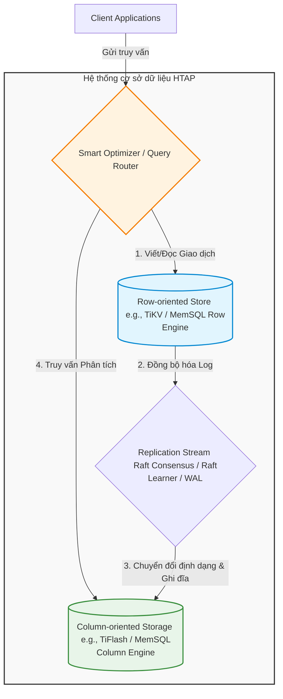
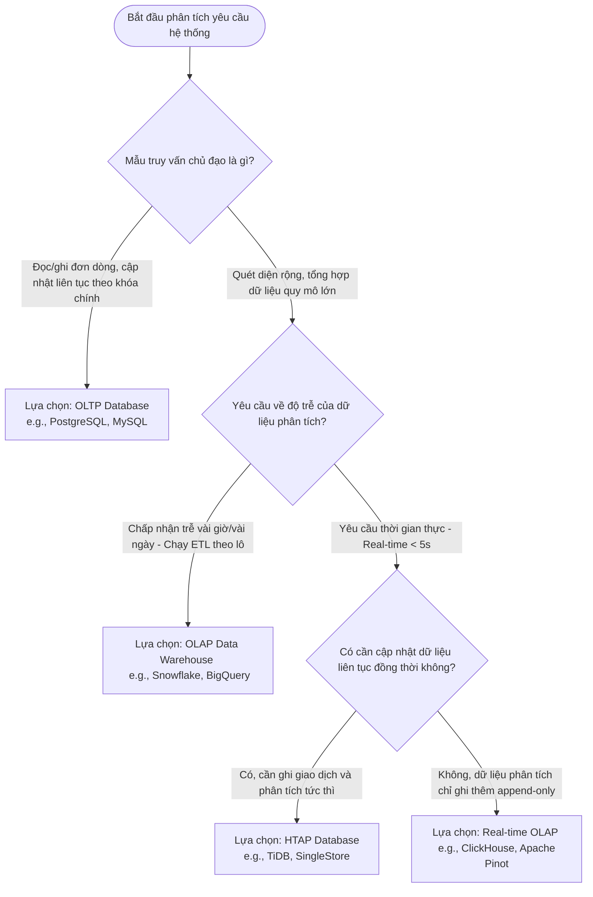

Trong lĩnh vực kỹ thuật dữ liệu và thiết kế hệ thống (system design), việc chọn lựa và thiết kế cơ sở dữ liệu là một trong những quyết định quan trọng nhất. Ba mô hình kiến trúc xử lý dữ liệu chính hiện nay bao gồm **OLTP (Online Transaction Processing)**, **OLAP (Online Analytical Processing)** và **HTAP (Hybrid Transactional/Analytical Processing)**. Mỗi kiến trúc phục vụ một mục tiêu thiết kế và tập hợp các mẫu truy vấn (query patterns) hoàn toàn khác nhau.

Bài viết này đi sâu phân tích so sánh cấu trúc vật lý của hệ thống lưu trữ, cơ chế kiểm soát đồng thời, và các đặc trưng kiến trúc của ba mô hình này, đồng thời tham chiếu đến các công nghệ cơ sở dữ liệu hàng đầu hiện nay như PostgreSQL, Snowflake, BigQuery, TiDB và SingleStore.

---

## 1. Sự khác biệt cốt lõi về cấu trúc vật lý (Core Architectural Differences)

### Layout lưu trữ vật lý: Dạng hàng (Row-oriented) vs Dạng cột (Column-oriented)
Sự khác biệt cơ bản nhất giữa OLTP và OLAP bắt nguồn từ cách dữ liệu được sắp xếp vật lý trên đĩa cứng hoặc bộ nhớ.

*   **Row-oriented Storage (Lưu trữ hướng dòng)**:
    *   **Nguyên lý**: Trong các hệ thống OLTP truyền thống (như PostgreSQL, MySQL), dữ liệu của một bản ghi (dòng) được lưu trữ liên tục trên các khối đĩa (disk pages).
    *   **Ưu điểm**: Giúp các thao tác ghi dữ liệu (`INSERT`), cập nhật dữ liệu (`UPDATE`) và xóa dữ liệu (`DELETE`) cực kỳ hiệu quả vì hệ thống chỉ cần định vị và thao tác trên một vùng không gian lưu trữ duy nhất. Các câu lệnh đọc toàn bộ thông tin của một đối tượng cụ thể (ví dụ: `SELECT * FROM users WHERE id = 123`) chỉ yêu cầu một lần đọc đĩa (single I/O operation).
    *   **Nhược điểm**: Khi thực hiện các câu lệnh phân tích tổng hợp (ví dụ: tính giá trị trung bình đơn hàng `SELECT AVG(amount) FROM orders`), hệ thống vẫn buộc phải đọc toàn bộ dòng dữ liệu (bao gồm cả các cột không cần thiết như `shipping_address`, `buyer_name`, `created_at`) vào bộ nhớ cache, gây lãng phí băng thông I/O và dung lượng bộ nhớ.
    *   *Tham khảo thêm tại bài viết [Lưu trữ dạng dòng (Row-based Storage)](../row-based-storage/).*

*   **Column-oriented Storage (Lưu trữ hướng cột)**:
    *   **Nguyên lý**: Trong các hệ thống OLAP hiện đại (như Snowflake, Google BigQuery, ClickHouse), dữ liệu được tổ chức theo từng cột. Nghĩa là tất cả các giá trị của cột `amount` sẽ được lưu trữ liên tiếp nhau, tách biệt hoàn toàn với cột `buyer_name`.
    *   **Ưu điểm**: Cực kỳ tối ưu cho các truy vấn phân tích chỉ cần đọc một vài cột cụ thể trên hàng tỷ dòng dữ liệu. Hệ thống chỉ cần nạp đúng các cột cần thiết từ đĩa. Ngoài ra, việc lưu trữ các dữ liệu có cùng kiểu và đặc tính gần nhau trong một cột giúp tăng tỷ lệ nén dữ liệu (data compression ratio) lên gấp 5-10 lần nhờ áp dụng các thuật toán chuyên dụng như **Run-Length Encoding (RLE)**, **Dictionary Encoding**, hay **Delta Encoding**.
    *   **Nhược điểm**: Các thao tác ghi đơn dòng (`single-row INSERT`) hoặc cập nhật nhỏ lẻ trở nên rất chậm chạp và tốn kém tài nguyên vì hệ thống phải phân tán việc ghi dữ liệu đến nhiều file cột khác nhau trên đĩa.
    *   *Tham khảo thêm tại bài viết [Lưu trữ dạng cột (Columnar Storage)](../columnar-storage/).*

### Hệ thống chỉ mục: B-Tree vs Min/Max & Bloom Filters
Để đẩy nhanh tốc độ truy vấn, mỗi hệ thống sử dụng các cấu trúc chỉ mục (indexing) phù hợp với cách thức truy xuất dữ liệu của mình.

*   **B-Tree và B+ Tree (OLTP)**:
    *   Được sử dụng rộng rãi trong các cơ sở dữ liệu quan hệ (RDBMS). Cấu trúc cây tự cân bằng này cho phép tìm kiếm điểm (point queries) và truy vấn khoảng ngắn (range queries) với độ phức tạp thời gian là $O(\log N)$.
    *   Ví dụ: Tìm một người dùng theo khóa chính hoặc tìm danh sách đơn hàng của một tài khoản cụ thể. B-Tree lưu giữ liên kết trực tiếp tới vị trí vật lý của dòng dữ liệu trên đĩa.
    *   *Xem thêm chi tiết tại bài viết [Chỉ mục cơ sở dữ liệu (Indexing)](../indexing/).*

*   **Min/Max Metadata & Bloom Filters (OLAP)**:
    *   Trong môi trường OLAP, việc tạo và duy trì B-Tree cho hàng tỷ dòng dữ liệu là bất khả thi vì dung lượng chỉ mục sẽ cực kỳ lớn và làm suy giảm nghiêm trọng hiệu năng ghi dữ liệu.
    *   Thay vào đó, các cơ sở dữ liệu hướng cột phân chia dữ liệu thành các khối lớn (ví dụ: *Micro-partitions* trong Snowflake, kích thước khoảng 50MB-500MB). Đối với mỗi khối, hệ thống lưu trữ Metadata chứa giá trị cực tiểu (Min) và cực đại (Max) cho từng cột. Khi một truy vấn lọc dữ liệu (ví dụ: `WHERE date BETWEEN '2026-06-01' AND '2026-06-05'`) được thực hiện, Query Engine sẽ đối chiếu với dữ liệu Min/Max của từng khối để loại bỏ (pruning/skipping) các khối không khớp mà không cần phải quét dữ liệu bên trong chúng.
    *   **Bloom Filter** là một cấu trúc dữ liệu dạng xác suất (probabilistic data structure) cho biết một phần tử chắc chắn không thuộc một tập hợp hay có thể thuộc tập hợp đó. Nó được tích hợp trong các khối lưu trữ để giúp Query Engine nhanh chóng bỏ qua các khối đĩa không chứa giá trị tìm kiếm cụ thể, đặc biệt hữu ích cho các truy vấn có phép nối (`JOIN`) phức tạp.

### Kiểm soát truy cập đồng thời: Khóa (Locking) vs MVCC
Môi trường OLTP yêu cầu khả năng xử lý hàng chục nghìn giao dịch ghi đồng thời từ người dùng mà vẫn bảo toàn tính nhất quán (ACID). Trong khi đó, OLAP chủ yếu xử lý các tác vụ đọc dữ liệu nặng nề mà không làm ảnh hưởng đến hiệu năng chung.

*   **Pessimistic Locking (Khóa bi quan)**:
    *   Hệ thống sử dụng các cơ chế khóa vật lý như Shared Lock (Khóa chia sẻ - đọc) và Exclusive Lock (Khóa độc quyền - ghi) để ngăn chặn các xung đột. Khi một dòng dữ liệu đang bị khóa để cập nhật, các giao dịch khác muốn ghi hoặc thậm chí đọc dòng đó (tùy thuộc vào Isolation Level) sẽ phải chờ đợi. Cơ chế này đảm bảo an toàn tuyệt đối nhưng dễ dẫn đến tình trạng nghẽn cổ chai (bottleneck) hoặc khóa chết (deadlock).

*   **MVCC (Multi-Version Concurrency Control - Kiểm soát đồng thời đa phiên bản)**:
    *   Hệ thống như PostgreSQL hay Oracle giải quyết tranh chấp đọc-ghi bằng cách không ghi đè trực tiếp lên dữ liệu cũ. Khi một dòng được cập nhật, hệ thống tạo ra một phiên bản mới (version) của dòng đó và đánh dấu số hiệu giao dịch (Transaction ID/Timestamp).
    *   Nhờ đó, một truy vấn đọc (Reader) có thể đọc phiên bản dữ liệu cũ hơn mà vẫn đảm bảo tính nhất quán (Snapshot Isolation) mà không bị chặn bởi một giao dịch viết (Writer) đang cập nhật dòng đó. Điều này giúp loại bỏ hoàn toàn hiện tượng Reader chặn Writer và ngược lại.

---

## 2. Kiến trúc lai HTAP (Hybrid Transactional/Analytical Processing)

### Bản chất và lý do ra đời của HTAP
Trong các mô hình dữ liệu truyền thống, dữ liệu phát sinh từ các ứng dụng giao dịch (OLTP) phải được định kỳ trích xuất, biến đổi và nạp (**ETL - Extract, Transform, Load**) vào kho dữ liệu phân tích (OLAP/Data Warehouse). Quá trình này thường mất từ vài giờ cho đến cả ngày, dẫn đến một khoảng trống lớn về tính cập nhật của thông tin phân tích.

Mô hình **HTAP (Hybrid Transactional/Analytical Processing)** ra đời nhằm xóa bỏ ranh giới này, cho phép doanh nghiệp thực hiện các truy vấn phân tích thời gian thực (real-time analytics) ngay trên dòng dữ liệu giao dịch vừa mới phát sinh mà không làm ảnh hưởng đến hiệu năng của hệ thống giao dịch cốt lõi.

### Nguyên lý thiết kế: Tách biệt lưu trữ (Decoupled Storage)
Để giải quyết bài toán xung đột tài nguyên (resource contention) khi chạy các truy vấn quét lượng dữ liệu lớn của OLAP cùng lúc với các giao dịch ngắn của OLTP, các cơ sở dữ liệu HTAP hiện đại áp dụng thiết kế lưu trữ kép (Dual-Storage Engine):

1.  **Row-store Engine**: Xử lý các yêu cầu ghi dữ liệu tần suất cao và các truy vấn point lookup nhanh.
2.  **Column-store Engine**: Nhận dữ liệu đồng bộ từ Row-store để phục vụ các truy vấn phân tích chuyên sâu.

### Phân tích kiến trúc cụ thể của các hệ thống tiêu biểu

#### TiDB (PingCAP)
TiDB là một trong những hệ thống cơ sở dữ liệu HTAP phân tán nguồn mở tiên tiến nhất. Kiến trúc của nó phân tách rõ ràng thành hai lớp lưu trữ dưới sự điều phối của một lớp tính toán:

*   **TiKV (Transactional Row-Store)**: Dữ liệu được lưu trữ dưới dạng dòng (row-oriented) sử dụng kiến trúc phân tán dựa trên giao thức đồng thuận **Raft**. TiKV đảm nhận toàn bộ các giao dịch ACID.
*   **TiFlash (Analytical Column-Store)**: Dữ liệu được tổ chức dưới dạng cột (columnar) để phục vụ cho các truy vấn OLAP. Điểm đặc biệt là TiFlash không tham gia trực tiếp vào việc bầu chọn Leader trong nhóm Raft mà đóng vai trò là một **Raft Learner**. Điều này có nghĩa là các thay đổi dữ liệu từ TiKV được sao chép không đồng bộ hoặc cận đồng bộ (asynchronous/semi-synchronous replication) qua mạng trực tiếp vào bộ nhớ của TiFlash dưới dạng log replication stream.
*   **Resource Isolation (Cô lập tài nguyên)**: Nhờ cơ chế Raft Learner, hoạt động đọc ghi của TiKV không bị ảnh hưởng bởi tải phân tích của TiFlash. Bộ tối ưu hóa (SQL Optimizer) của TiDB sẽ phân tích chi phí truy vấn (Cost-based Optimizer) để tự động quyết định gửi câu lệnh tới TiKV (nếu là OLTP) hay gửi tới TiFlash (nếu là OLAP).

#### Snowflake Hybrid Tables (Unistore)
Snowflake vốn nổi tiếng với kiến trúc OLAP hướng cột cực mạnh. Để mở rộng sang phân khúc HTAP, Snowflake giới thiệu **Hybrid Tables** thuộc kiến trúc Unistore:

*   Hybrid Tables hỗ trợ các tính năng của cơ sở dữ liệu giao dịch như khóa ngoại (foreign key), ràng buộc duy nhất (unique constraints) và chỉ mục chính (primary keys) với độ trễ cực thấp.
*   Kiến trúc này sử dụng một công cụ lưu trữ dạng hàng được tối ưu hóa cho các thao tác ghi và đọc điểm (point read/write), trong khi dữ liệu đó vẫn được đồng bộ ngầm định với các micro-partitions dạng cột của Snowflake. Do đó, người dùng có thể thực hiện truy vấn phân tích trực tiếp trên dữ liệu Hybrid Tables kết hợp với các bảng OLAP tiêu chuẩn bằng các câu lệnh SQL liền mạch mà không cần thiết lập bất kỳ đường ống dẫn dữ liệu (ETL pipeline) nào.

---

## 3. Bảng so sánh toàn diện (Detailed Comparison Table)

Dưới đây là bảng đối chiếu chi tiết các tiêu chí kiến trúc và vận hành của OLTP, OLAP và HTAP:

| Tiêu chí | OLTP (Online Transaction Processing) | OLAP (Online Analytical Processing) | HTAP (Hybrid Transactional/Analytical) |
| :--- | :--- | :--- | :--- |
| **Cấu trúc lưu trữ vật lý** | Dạng hàng (Row-oriented) | Dạng cột (Column-oriented) | Lưu trữ kép (Row-store + Column-store) |
| **Cơ chế chỉ mục chính** | B-Tree, B+ Tree, Hash Index | Min/Max metadata, Bloom Filters, Zone Maps | B-Tree trên Row-store + Min/Max trên Column-store |
| **Kiểm soát đồng thời** | Khóa vật lý (Locking), MVCC mạnh mẽ | Thường không dùng khóa (Read-only snapshots) | MVCC tách biệt trên hai phân vùng lưu trữ |
| **Mẫu truy vấn (Query Pattern)** | Đọc/Ghi vài dòng cụ thể theo ID | Quét lượng lớn dòng trên một số ít cột | Hỗ trợ cả hai loại mẫu truy vấn đồng thời |
| **Tần suất ghi (Write Pattern)** | Rất cao, các giao dịch nhỏ cập nhật liên tục | Ghi theo lô (batch upload) định kỳ | Ghi giao dịch tần suất cao vào Row-store |
| **Độ trễ truy vấn** | Mili-giây (miliseconds) | Vài giây đến vài phút | Tùy thuộc truy vấn (mili-giây đến vài giây) |
| **Mức độ chuẩn hóa** | Chuẩn hóa cao (3NF) để tránh dư thừa | Phi chuẩn hóa (Denormalized), Star/Snowflake Schema | Chuẩn hóa ở Row-store, tự đồng bộ Column-store |
| **Ví dụ hệ thống tiêu biểu** | PostgreSQL, MySQL, Oracle, Amazon Aurora | Snowflake, Google BigQuery, ClickHouse, Redshift | TiDB (PingCAP), SingleStore, CockroachDB |

---

## 4. Hướng dẫn lựa chọn kiến trúc (Selection Guidelines)

Việc áp dụng sai kiến trúc cơ sở dữ liệu có thể dẫn đến hậu quả nghiêm trọng về hiệu năng hệ thống hoặc chi phí vận hành. Quy trình quyết định lựa chọn cần dựa trên các phân tích cụ thể sau:

### Khi nào nên chọn OLTP?
Hệ thống OLTP là lựa chọn bắt buộc khi ứng dụng của bạn yêu cầu:
1.  **Tính nhất quán tuyệt đối (Strict ACID)**: Các ứng dụng tài chính, hệ thống ví điện tử, quản lý số dư tài khoản ngân hàng, nơi mà một lỗi nhỏ trong giao dịch cũng không được phép xảy ra.
2.  **Tương tác đồng thời cực cao**: Hàng ngàn người dùng cùng thực hiện hành động thêm sản phẩm vào giỏ hàng, đặt vé máy bay hoặc thanh toán trực tuyến cùng lúc.
3.  **Thao tác ghi đơn dòng chiếm ưu thế**: Hệ thống nhận hàng triệu yêu cầu tạo mới hoặc cập nhật bản ghi mỗi ngày (point insert/update).

### Khi nào nên chọn OLAP?
Hệ thống OLAP phù hợp nhất cho các kịch bản:
1.  **Xây dựng Kho dữ liệu doanh nghiệp (Enterprise Data Warehouse)**: Nơi gom dữ liệu từ nhiều nguồn khác nhau (CRM, ERP, Web Logs) để phân tích bức tranh tổng thể của doanh nghiệp.
2.  **Báo cáo Business Intelligence (BI)**: Chạy các truy vấn phức tạp kết hợp nhiều bảng lớn (`JOIN`) để vẽ biểu đồ doanh thu theo quý, phân tích hành vi khách hàng qua nhiều năm.
3.  **Không yêu cầu dữ liệu thời gian thực tức thì**: Dữ liệu có thể được nạp theo lô định kỳ (batch job) vào ban đêm và người dùng chấp nhận phân tích trên dữ liệu của ngày hôm trước.

### Khi nào nên chọn HTAP?
Kiến trúc HTAP là giải pháp cứu cánh cho các bài toán:
1.  **Phát hiện gian lận giao dịch thời gian thực (Real-time Fraud Detection)**: Khi khách hàng quẹt thẻ tín dụng, hệ thống cần đối chiếu tức thì lịch sử giao dịch trong quá khứ của họ để phát hiện hành vi bất thường và ra quyết định chặn giao dịch trong vòng vài trăm mili-giây.
2.  **Báo cáo Dashboard thời gian thực**: Các sàn thương mại điện tử cần hiển thị biểu đồ doanh số bán hàng, số lượng đơn hàng thành công theo từng giây trong các chiến dịch khuyến mãi lớn.
3.  **Giảm thiểu độ phức tạp của hạ tầng (Infrastructure Simplification)**: Loại bỏ sự phụ thuộc vào các hệ thống ETL phức tạp và dễ gặp lỗi, giảm thiểu chi phí vận hành và lưu trữ khi không cần phải duy trì hai cụm cơ sở dữ liệu riêng biệt.

---

## Điểm mạnh và điểm yếu

### Kiến trúc OLTP
*   **Điểm mạnh**:
    *   Tối ưu hóa băng thông ghi đĩa tốt cho các tác vụ ghi nhỏ lẻ.
    *   Đảm bảo toàn vẹn dữ liệu cực kỳ tốt thông qua các ràng buộc khóa ngoại và tính chất giao dịch ACID.
    *   Độ trễ phản hồi cực thấp đối với các truy vấn tìm kiếm điểm.
*   **Điểm yếu**:
    *   Hiệu năng giảm mạnh khi chạy các câu lệnh truy vấn phân tích quét trên diện rộng (full table scan).
    *   Khả năng mở rộng chiều ngang (horizontal scaling) của các RDBMS truyền thống gặp nhiều khó khăn và tốn kém tài nguyên.

### Kiến trúc OLAP
*   **Điểm mạnh**:
    *   Khả năng xử lý các truy vấn tổng hợp trên hàng tỷ dòng dữ liệu chỉ trong vài giây.
    *   Hiệu quả lưu trữ tối ưu nhờ tỷ lệ nén dữ liệu cực kỳ cao trên cấu trúc cột.
    *   Dễ dàng mở rộng quy mô tính toán và lưu trữ độc lập (separation of storage and compute).
*   **Điểm yếu**:
    *   Không hỗ trợ tốt cho các giao dịch ACID đồng thời cao với tần suất cập nhật liên tục trên từng dòng.
    *   Độ trễ ghi dữ liệu cao, không phù hợp làm cơ sở dữ liệu chính cho các ứng dụng người dùng cuối (customer-facing applications).

### Kiến trúc HTAP
*   **Điểm mạnh**:
    *   Cung cấp khả năng phân tích dữ liệu với độ tươi mới (data freshness) gần như tức thì.
    *   Đơn giản hóa kiến trúc dữ liệu bằng cách loại bỏ các đường ống ETL trung gian.
    *   Tự động tối ưu hóa việc phân bổ tài nguyên tính toán giữa tác vụ OLTP và OLAP thông qua cơ chế cô lập vật lý (physical resource isolation).
*   **Điểm yếu**:
    *   Độ phức tạp trong vận hành và quản lý hệ thống rất cao.
    *   Chi phí phần cứng lớn do hệ thống thường yêu cầu lượng lớn bộ nhớ RAM và băng thông mạng nội bộ cực cao để duy trì việc sao chép dữ liệu đồng bộ liên tục giữa Row-store và Column-store.
    *   Chưa đạt được hiệu năng phân tích tối đa so với các hệ thống OLAP thuần túy khi xử lý các truy vấn cực lớn có quy mô lên tới mức Petabyte.

---

## Khi nào nên dùng

### Đối với OLTP
*   **Nên dùng**:
    *   Xây dựng hệ thống quản lý thông tin người dùng (User Profiles).
    *   Xây dựng hệ thống quản lý đơn hàng trực tuyến (E-commerce Order Processing).
    *   Hệ thống lõi ngân hàng (Core Banking Transactions).
*   **Không nên dùng**:
    *   Lưu trữ dữ liệu nhật ký hoạt động (system log) khổng lồ để phân tích hành vi người dùng.
    *   Xây dựng hệ thống lưu trữ và tính toán các mô hình học máy (Machine Learning feature store).

### Đối với OLAP
*   **Nên dùng**:
    *   Xây dựng hệ thống báo cáo tài chính cuối năm cho doanh nghiệp lớn.
    *   Phân tích hành trình người dùng trên ứng dụng di động thông qua clickstream logs.
    *   Xây dựng các Dashboard quản trị (Executive Dashboards) với các chỉ số KPI cập nhật theo ngày.
*   **Không nên dùng**:
    *   Làm backend lưu trữ cho các ứng dụng Chat thời gian thực.
    *   Hệ thống đặt vé tàu xe yêu cầu cập nhật liên tục trạng thái ghế trống của từng chuyến đi.

### Đối với HTAP
*   **Nên dùng**:
    *   Xây dựng hệ thống định giá sản phẩm động (dynamic pricing) trong thương mại điện tử dựa trên cung cầu thực tế.
    *   Hệ thống cá nhân hóa trải nghiệm người dùng (Real-time Personalization) hiển thị sản phẩm gợi ý dựa trên lịch sử duyệt web vừa diễn ra.
    *   Hệ thống giám sát và quản lý rủi ro giao dịch chứng khoán trực tuyến.
*   **Không nên dùng**:
    *   Các ứng dụng khởi nghiệp quy mô nhỏ với ngân sách hạn chế và dữ liệu chưa vượt quá mức vài trăm Gigabyte.
    *   Các hệ thống lưu trữ dữ liệu tĩnh hoặc dữ liệu lịch sử ít khi thay đổi.

---

## Trọng tâm ôn luyện phỏng vấn

### Câu hỏi 1: Tại sao việc chạy một câu lệnh SQL phân tích lớn trên cơ sở dữ liệu OLTP truyền thống (ví dụ: PostgreSQL) lại có thể làm sập hệ thống hoặc khiến các giao dịch khác bị timeout?
**Trả lời**:
Khi một truy vấn phân tích lớn được thực hiện (ví dụ: quét toàn bộ bảng chứa hàng trăm triệu dòng để tính tổng doanh thu), PostgreSQL sẽ phải thực hiện quét toàn bộ bảng (Full Table Scan). Việc này dẫn đến các vấn đề nghiêm trọng sau:
1.  **I/O Bottleneck**: Hệ thống phải nạp một khối lượng khổng lồ các trang dữ liệu (disk pages) từ đĩa cứng vào bộ nhớ đệm (shared buffers). Việc này chiếm dụng toàn bộ băng thông I/O của đĩa, làm chậm các tiến trình ghi dữ liệu khác.
2.  **Buffer Cache Pollution**: Các trang dữ liệu của bảng phân tích sẽ đẩy các trang dữ liệu thường dùng của các giao dịch OLTP ngắn ra khỏi bộ nhớ đệm, dẫn đến việc các truy vấn OLTP sau đó phải đọc trực tiếp từ đĩa thay vì bộ nhớ cache.
3.  **Lock Contention**: Mặc dù MVCC giúp các câu lệnh đọc không chặn câu lệnh ghi, tuy nhiên các tác vụ phân tích lớn thường thực hiện các phép nối (`JOIN`) hoặc tạo bảng tạm. Nếu có các câu lệnh cập nhật cấu trúc bảng hoặc khóa dòng do tranh chấp logic nghiệp vụ diễn ra đồng thời, nó có thể dẫn đến hiện tượng xếp hàng đợi khóa (lock queue accumulation), gây tràn kết nối (connection pool exhaustion) và cuối cùng làm sập hệ thống hoặc gây timeout.

### Câu hỏi 2: Trong kiến trúc HTAP của TiDB, cơ chế Raft Learner hoạt động ra sao và tại sao nó lại giải quyết được bài toán cô lập tài nguyên (resource isolation) giữa OLTP và OLAP?
**Trả lời**:
Trong giao thức Raft truyền thống, các node trong nhóm (Raft Group) tham gia vào việc bầu chọn Leader và biểu quyết để đạt được sự đồng thuận trước khi ghi dữ liệu. Nếu một node phân tích dữ liệu dạng cột (như TiFlash) tham gia trực tiếp vào quá trình này, các truy vấn OLAP nặng nề chiếm dụng CPU/RAM trên node đó có thể làm chậm quá trình phản hồi biểu quyết của nó, dẫn đến việc làm chậm hoặc tắc nghẽn toàn bộ quá trình ghi giao dịch của các node Row-store (TiKV).

Để giải quyết vấn đề này, TiDB áp dụng cơ chế **Raft Learner**:
*   Node TiFlash tham gia vào nhóm Raft dưới tư cách là một *Learner* - chỉ nhận dữ liệu sao chép (log replication stream) từ Leader của TiKV mà không tham gia vào việc biểu quyết (voting) hoặc bầu chọn (leader election).
*   Do không tham gia biểu quyết, tải tính toán và truy vấn của TiFlash có cao đến mức nào đi chăng nữa thì cũng không thể gây ảnh hưởng hay làm chậm tốc độ đạt đồng thuận ghi giao dịch của các node TiKV.
*   Điều này giúp đạt được sự cô lập tài nguyên vật lý tuyệt đối: CPU, RAM và tài nguyên đĩa của các node giao dịch (TiKV) hoàn toàn độc lập với các node phân tích (TiFlash).

### Câu hỏi 3: Tại sao các hệ thống OLAP hướng cột không sử dụng chỉ mục B-Tree để tăng tốc độ truy vấn?
**Trả lời**:
Có ba nguyên nhân chính khiến hệ thống OLAP hướng cột loại bỏ chỉ mục B-Tree:
1.  **Đặc trưng của cấu trúc lưu trữ dạng cột**: Dữ liệu hướng cột được lưu trữ phân tán theo từng cột. Nếu sử dụng B-Tree, hệ thống phải duy trì một cây chỉ mục riêng biệt ánh xạ từ giá trị của cột đến số hiệu dòng vật lý. Khi thực hiện truy vấn trên nhiều cột, việc kết hợp kết quả từ nhiều cây chỉ mục B-Tree khác nhau (index intersection) đòi hỏi chi phí tính toán cực kỳ lớn.
2.  **Tải trọng ghi dữ liệu**: Các hệ thống OLAP thường nạp dữ liệu theo lô lớn (bulk load) hàng triệu dòng cùng một lúc. Việc cập nhật đồng thời nhiều cây chỉ mục B-Tree khổng lồ trong quá trình nạp dữ liệu sẽ làm giảm nghiêm trọng tốc độ nạp dữ liệu (ingestion rate).
3.  **Sự hiệu quả của các cơ chế thay thế**: Các cơ chế như Min/Max metadata (Zone Maps) kết hợp với kỹ thuật bỏ qua khối dữ liệu (block pruning) và Bloom Filters tỏ ra hiệu quả hơn rất nhiều đối với các truy vấn quét phạm vi lớn. Chúng có dung lượng lưu trữ cực kỳ nhỏ (chỉ chiếm dưới 1% dung lượng dữ liệu) và có thể dễ dàng tải toàn bộ vào RAM để xử lý nhanh chóng mà không cần các thao tác di chuyển con trỏ đĩa phức tạp của B-Tree.

---

## English Summary

To reinforce key database engineering terms and architecture design principles, here is a concise English summary of the concepts covered in this guide:

*   **OLTP (Online Transaction Processing)**: Optimized for fast, high-concurrency, single-row write and read operations. It relies on **Row-oriented storage layouts** to keep all column values of a single record contiguous on disk, utilizes **B-Tree indexes** for $O(\log N)$ point lookups, and ensures data integrity through strict **ACID transactions** using mechanisms like **MVCC** or locks.
*   **OLAP (Online Analytical Processing)**: Tailored for complex, read-heavy analytical queries over large datasets. It uses **Column-oriented storage** to read only necessary columns and achieve superior data compression ratios (via RLE, dictionary encoding). Instead of heavy B-Trees, OLAP utilizes **Min/Max block pruning** and **Bloom filters** to skip irrelevant data blocks during scans.
*   **HTAP (Hybrid Transactional/Analytical Processing)**: Combines OLTP and OLAP workloads within a single database system to enable **real-time analytics** on live operational data. It solves resource contention via a **decoupled dual-storage design** (Row-store for transactions + Column-store for analytics).
*   **Replication & Isolation**: Modern HTAP systems like PingCAP's **TiDB** leverage **Raft Learner replicas** (e.g., TiFlash) to asynchronously replicate logs from the transactional engine (e.g., TiKV) to the columnar engine. This architecture prevents heavy OLAP queries from degrading critical OLTP transaction performance.

---

## Xem thêm các khái niệm liên quan
* [Phân cụm Dữ liệu - Clustering](/concepts/2-storage/database-storage/clustering/)
* [Lưu trữ dạng Cột - Columnar Storage](/concepts/2-storage/database-storage/columnar-storage/)
* [Thuật toán nén dữ liệu - Compression Algorithms](/concepts/2-storage/database-storage/compression-algorithms/)

## Tài liệu tham khảo

1.  [Snowflake Hybrid Tables - Snowflake Documentation](https://docs.snowflake.com/en/user-guide/tables-hybrid)
2.  [Google Spanner HTAP - Google Cloud Documentation](https://cloud.google.com/spanner/docs/htap)
3.  [AWS Aurora Architecture & HTAP Capabilities - AWS Documentation](https://docs.aws.amazon.com/AmazonRDS/latest/AuroraUserGuide/CHAP_AuroraOverview.html)
4.  [Apache Pinot Columnar Storage Engine - Apache Software Foundation](https://docs.pinot.apache.org/basics/architecture)
5.  [Azure Synapse Link for HTAP - Azure Microsoft Documentation](https://azure.microsoft.com/en-us/products/cosmos-db/)
6.  [TiDB HTAP Architecture - PingCAP Documentation](https://docs.pingcap.com/tidb/stable/tiflash-overview)
