Trong kỷ nguyên dữ liệu lớn (Big Data), việc khai thác thông tin từ các kho dữ liệu khổng lồ đòi hỏi các công cụ truy vấn phải có khả năng xử lý hàng tỷ bản ghi trong thời gian dưới một giây (sub-second latency). Để đạt được hiệu năng kinh ngạc này, các công nghệ hiện đại đã đi theo những hướng tiếp cận kiến trúc khác nhau, giải quyết các bài toán tối ưu hóa phần cứng, lưu trữ và tính toán theo những triết lý riêng biệt.

Bài viết này sẽ đi sâu phân tích và so sánh ba đại diện tiêu biểu cho ba trường phái kiến trúc "truy vấn nhanh" phổ biến nhất hiện nay:
1. **Trino (tiền thân là Presto)** – Đại diện cho trường phái **Data Virtualization / Federated Query Compute-only** (tách rời tính toán và lưu trữ, truy vấn liên kết).
2. **ClickHouse** – Đại diện cho trường phái **Vectorized Columnar DBMS Localized Storage** (hệ quản trị cơ sở dữ liệu dạng cột với lưu trữ cục bộ và xử lý vector hóa).
3. **Apache Druid** – Đại diện cho trường phái **Real-time Analytical Engine with Inverted Index & Deep Storage** (động cơ phân tích thời gian thực với chỉ mục ngược bitmap và lưu trữ phân lớp).

Hiểu rõ sự khác biệt bản chất giữa ba công cụ này là chìa khóa để thiết kế [Hệ thống OLAP](/concepts/2-storage/database-storage/olap) hiệu quả, tối ưu chi phí phần cứng và đáp ứng chính xác yêu cầu của người dùng cuối.

---

## Kiến trúc Cốt lõi và Sự Khác biệt Bản chất

Để thấy rõ sự khác biệt, trước hết chúng ta cần đi sâu vào cấu trúc vận hành bên trong của từng động cơ truy vấn.

### Trino: Động cơ truy vấn liên kết, tách rời tính toán (Decoupled Compute-only Federated Query Engine)

Trino được thiết kế ban đầu bởi Facebook nhằm thay thế Apache Hive cho các truy vấn phân tích tương tác trên hệ thống HDFS và Amazon S3. 

```
┌────────────────────────────────────────────────────────┐
│                   Trino Coordinator                    │
└──────────────────────────┬─────────────────────────────┘
                           │ (Query Execution Plan)
         ┌─────────────────┴─────────────────┐
         ▼                                   ▼
┌─────────────────┐                 ┌─────────────────┐
│  Trino Worker   │                 │  Trino Worker   │
└────────┬────────┘                 └────────┬────────┘
         ├───────────────┐                   ├───────────────┐
         ▼               ▼                   ▼               ▼
 ┌──────────────┐ ┌──────────────┐   ┌──────────────┐ ┌──────────────┐
 │  S3 Connector│ │  PG Connector│   │  S3 Connector│ │  PG Connector│
 └───────┬──────┘ └───────┬──────┘   └───────┬──────┘ └───────┬──────┘
         ▼               ▼                   ▼               ▼
   ┌───────────┐   ┌───────────┐       ┌───────────┐   ┌───────────┐
   │ Parquet/S3│   │ PostgresDB│       │ Parquet/S3│   │ PostgresDB│
   └───────────┘   └───────────┘       └───────────┘   └───────────┘
```

Triết lý cốt lõi của Trino là **không sở hữu dữ liệu** (no data ownership). Trino đóng vai trò là một động cơ tính toán MPP (Massive Parallel Processing) thuần túy, hoạt động hoàn toàn tách rời khỏi lớp lưu trữ (Decoupled Compute and Storage). 
- Dữ liệu có thể nằm ở bất kỳ đâu: Object Storage (S3, GCS, MinIO) dưới dạng các file [Lưu trữ dạng Cột (Columnar Storage)](/concepts/2-storage/database-storage/columnar-storage) (như Parquet, ORC), hoặc các hệ quản trị cơ sở dữ liệu quan hệ (PostgreSQL, MySQL), cơ sở dữ liệu NoSQL (Cassandra, MongoDB, Elasticsearch), và cả các hệ thống streaming như Apache Kafka.
- Trino sử dụng các **Catalogs** kết hợp với các **Connectors** chuyên biệt. Khi người dùng gửi một câu lệnh SQL, Coordinator của Trino sẽ giao tiếp với Connector tương ứng để lấy thông tin metadata (ví dụ: cấu trúc bảng, vị trí vật lý của các file dữ liệu qua Hive Metastore hoặc AWS Glue Catalog) mà không cần nạp trước dữ liệu thô vào bộ nhớ của Trino.
- Cấu trúc mạng lưới của Trino gồm hai thành phần chính:
  - **Coordinator**: Chịu trách nhiệm nhận câu truy vấn SQL, phân tích cú pháp (parsing), tối ưu hóa kế hoạch thực thi (query planning) thành các giai đoạn (stages) và nhiệm vụ (tasks), sau đó điều phối chúng xuống các Worker.
  - **Worker**: Chịu trách nhiệm thực thi các task. Worker sử dụng connector để đọc trực tiếp dữ liệu từ nguồn ngoài, thực hiện các phép lọc (filter), chiếu (project), join và gom nhóm (aggregation) hoàn toàn trong bộ nhớ (in-memory pipelined execution). Dữ liệu được chuyển giao trực tiếp giữa các Worker qua mạng (shuffle) mà không ghi ra đĩa.

### ClickHouse: Hệ quản trị cơ sở dữ liệu dạng cột cục bộ (Columnar DBMS with Localized Storage)

Ngược lại với Trino, ClickHouse là một **Hệ quản trị cơ sở dữ liệu phân tích quan hệ hoàn chỉnh** (Columnar Relational DBMS). ClickHouse kiểm soát toàn bộ vòng đời của dữ liệu, từ cấu trúc lưu trữ trên đĩa vật lý, lập chỉ mục cho đến tối ưu hóa truy vấn.

Triết lý của ClickHouse là **Shared-Nothing** và **Localized Storage** (lưu trữ cục bộ). ClickHouse đạt được hiệu năng truy vấn đơn luồng cực đại nhờ tối ưu hóa phần cứng ở mức thấp nhất:
- **Vectorized Execution (Xử lý Vector hóa)**: ClickHouse không xử lý dữ liệu theo từng dòng một (Volcano Iterator Model). Thay vào đó, dữ liệu được gom thành các khối (blocks), mỗi khối chứa các cột dưới dạng các mảng bộ nhớ liên tục. ClickHouse áp dụng các phép tính trực tiếp trên các mảng này bằng các tập lệnh **SIMD (Single Instruction Multiple Data)** của CPU hiện đại (như AVX2, AVX-512). Điều này giúp giảm thiểu số lượng chỉ thị lệnh của CPU, tăng tốc độ xử lý tính toán lên mức giới hạn vật lý của phần cứng.
- **MergeTree Storage Engine**: Đây là trái tim của ClickHouse. Dữ liệu ghi vào ClickHouse được sắp xếp vật lý theo khóa chính trên đĩa cứng cục bộ (SSD/NVMe) dưới dạng các phân đoạn gọi là Parts. Các tiến trình nền (background threads) liên tục thực hiện gộp (merge) các Part nhỏ thành Part lớn để tối ưu hóa hiệu năng đọc ghi và duy trì cấu trúc sắp xếp dữ liệu. ClickHouse cực kỳ mạnh mẽ khi thực hiện các câu truy vấn aggregate trên một bảng phẳng duy nhất đã được phi chuẩn hóa (denormalized tables).

### Druid: Công cụ phân tích thời gian thực phân tán (Distributed Real-time Analytical Engine)

Apache Druid được thiết kế đặc biệt cho các ứng dụng có độ tương tác cao, yêu cầu phân tích luồng dữ liệu thời gian thực (real-time streaming analytics) với độ trễ truy vấn dưới một giây (sub-second latency) và mức độ đồng thời cực cao (concurrency).

Druid kết hợp ba nguyên lý thiết kế: **Lưu trữ dạng cột (Columnar Storage)**, **Chỉ mục ngược Bitmap (Inverted Bitmap Indexing)**, và **Cơ chế lưu trữ phân lớp (Tiered Storage/Deep Storage)**.
- Kiến trúc của Druid bao gồm nhiều dịch vụ hoạt động độc lập (tương tự microservices):
  - **Broker Nodes**: Nhận truy vấn từ client, phân tích và định tuyến câu truy vấn đến các node chứa dữ liệu tương ứng (Historicals hoặc MiddleManagers), sau đó tổng hợp kết quả trung gian để trả về cho client.
  - **Historical Nodes**: Xương sống của hệ thống, chịu trách nhiệm lưu trữ và truy vấn dữ liệu lịch sử đã được đóng gói thành các phân đoạn bất biến (immutable Segments).
  - **MiddleManager Nodes**: Chịu trách nhiệm nạp dữ liệu (ingestion) trực tiếp từ các nguồn streaming (như Kafka, Kinesis) hoặc batch, nén dữ liệu thành các segment tạm thời và phục vụ truy vấn ngay lập tức cho dữ liệu thời gian thực vừa nạp.
  - **Coordinator Nodes**: Điều phối và quản lý các segment trên Historicals (phân phối, nhân bản, cân bằng tải).
  - **Overlord Nodes**: Quản lý và phân phối các ingestion tasks cho MiddleManagers.
  - **Deep Storage**: Nơi lưu trữ lâu dài và bền vững các segment (S3, HDFS, Google Cloud Storage). Historical nodes sẽ tải các segment từ Deep Storage về đĩa cục bộ của mình để làm cache phục vụ truy vấn. Nếu một Historical node bị sập, một node khác sẽ tải lại segment tương ứng từ Deep Storage để tiếp tục phục vụ mà không làm mất dữ liệu.

---

## Cơ chế Quản lý Bộ nhớ, Cấu trúc Phân đoạn & Ảo hóa dữ liệu

Mỗi engine có cơ chế quản trị bộ nhớ và tổ chức file vật lý rất khác nhau, ảnh hưởng trực tiếp đến cách tối ưu hóa tài nguyên phần cứng.

### Trino: Ảo hóa dữ liệu & Quản lý bộ nhớ Pipelined

Do Trino không trực tiếp quản lý dữ liệu trên đĩa, nó dựa vào cơ chế **Data Virtualization (Ảo hóa dữ liệu)** thông qua SPI Connector:
- Khi nhận truy vấn, Coordinator sử dụng connector để chia dữ liệu thành các phần nhỏ gọi là **Splits** (ví dụ: một vùng dòng trong file Parquet trên S3). Coordinator sau đó gán các Splits này cho các Worker trống.
- Các Worker thực hiện đọc song song dữ liệu từ nguồn ngoài thông qua luồng I/O mạng. Dữ liệu được phân tích cú pháp (parsed) trực tiếp thành các cấu trúc trang bộ nhớ (Pages) của Trino.
- **Memory Tracking**: Trino thực hiện các phép Join và Group By hoàn toàn trong RAM. Để tránh việc một câu truy vấn ngốn hết RAM của cả hệ thống gây sập node (OOM), Trino liên tục theo dõi lượng bộ nhớ sử dụng của từng luồng truy vấn.
  - **User Memory**: Bộ nhớ dành cho các thuật toán tính toán trực tiếp của người dùng như xây dựng bảng băm (hash tables) cho phép Join hoặc gom nhóm.
  - **System Memory**: Bộ nhớ dành cho các tác vụ hệ thống như đệm truyền dữ liệu qua mạng (network transfer buffers) và đọc ghi tệp.
  - Khi một câu truy vấn vượt quá giới hạn RAM cho phép, Trino có thể kích hoạt cơ chế **Spill-to-disk**, ghi tạm các bảng băm của phép Join hoặc Group By ra đĩa cứng của Worker, giúp câu truy vấn hoàn thành dù tốc độ sẽ bị giảm đáng kể.

### ClickHouse: Khóa chính dạng thưa (Sparse Index) & Gộp phân đoạn MergeTree

ClickHouse tổ chức dữ liệu cực kỳ chặt chẽ trên ổ đĩa cục bộ thông qua họ động cơ MergeTree:
- **Cấu trúc Parts**: Khi thực hiện lệnh `INSERT`, ClickHouse tạo ra một Part mới chứa các file dữ liệu dạng cột (`.bin`) và file đánh dấu (`.mrk`). Các file này được sắp xếp vật lý theo khóa sorting key của bảng.
- **Sparse Index (Chỉ mục thưa)**: Khác với cơ chế B-Tree thông thường của OLTP database trỏ tới từng dòng dữ liệu, ClickHouse sử dụng Sparse Index. Cứ mỗi khoảng 8192 dòng dữ liệu liên tiếp (gọi là một *granule*), ClickHouse chỉ lưu trữ một giá trị khóa đại diện trong file index (`primary.idx`). 
- Khi truy vấn có điều kiện lọc theo khóa chính, ClickHouse quét Sparse Index để tìm ra các granule tương ứng, sau đó sử dụng file mark (`.mrk`) để nhảy trực tiếp đến vị trí byte offset của cột đó trong file dữ liệu `.bin` để đọc. Cơ chế này giúp ClickHouse bỏ qua tới 99% lượng I/O đĩa không cần thiết mà không cần duy trì một index quá lớn trong RAM.
- **Vectorized Memory Allocation**: Trong bộ nhớ, ClickHouse phân bổ RAM theo dạng mảng liên tục cho các block dữ liệu. ClickHouse sử dụng allocator hiệu năng cao (như `jemalloc`) để giảm thiểu phân mảnh bộ nhớ và tối ưu hóa việc tái sử dụng cache của CPU.

### Apache Druid: Cấu trúc Segment & Áo hóa bộ nhớ (Memory Mapping)

Druid đóng gói dữ liệu thành các **Segments** bất biến (immutable), phân vùng vật lý theo thời gian nhờ trường dữ liệu `__time`:
- **Segment Layout**: Bên trong một Segment, Druid tổ chức dữ liệu thành 3 phần:
  1. **Timestamp**: Cột thời gian bắt buộc để phân vùng dữ liệu qua cơ chế [Phân vùng dữ liệu](/concepts/2-storage/database-storage/partitioning).
  2. **Dimensions**: Các cột dùng để lọc và gom nhóm. Druid tự động áp dụng **Dictionary Encoding** (chuyển chuỗi thành số nguyên ID để tiết kiệm dung lượng) và xây dựng **Inverted Bitmap Index** (chỉ mục ngược lưu chuỗi bit biểu diễn vị trí các dòng chứa giá trị tương ứng). Druid sử dụng cấu trúc nén Bitmap (Roaring Bitmaps) để thực hiện các phép toán logic (`AND`, `OR`, `NOT`) trực tiếp trên chuỗi bit mà không cần giải nén dữ liệu gốc. Các chi tiết về chỉ mục được mô tả tại [Cơ chế Indexing](/concepts/2-storage/database-storage/indexing).
  3. **Metrics**: Các cột số dùng để tính toán (Sum, Min, Max), được lưu trữ và nén riêng biệt.
- **Memory Mapping (mmap)**: Druid Historical nodes sử dụng lệnh hệ điều hành `mmap` để ánh xạ trực tiếp các file Segment trên đĩa vào bộ nhớ ảo. Hệ điều hành Linux sẽ tự động tải các trang đĩa cần thiết vào RAM (page cache) và giải phóng chúng khi thiếu bộ nhớ. Việc này giúp Druid tránh việc nạp các đối tượng Java lớn vào heap của JVM, giảm thiểu tối đa hiện tượng dừng hệ thống do bộ dọn rác (JVM Garbage Collection pauses).
- Druid thực hiện các phép toán truy vấn trực tiếp trên vùng bộ nhớ ngoài heap (off-heap memory), mang lại hiệu năng ổn định cao khi chạy ở môi trường sản xuất tải nặng.

---

## Biểu đồ luồng thực thi truy vấn

Dưới đây là flowchart thể hiện sự khác biệt trong đường đi của một câu truy vấn giữa cơ chế truy vấn liên kết (Federated Query) của Trino và truy vấn cục bộ (Localized Query) của ClickHouse.

```mermaid
graph TD
    subgraph Trino [Kiến trúc Truy vấn Liên kết của Trino]
        ClientT[Client / BI Tool] -->|1. Gửi SQL| CoordT[Trino Coordinator]
        CoordT -->|2. Lấy Metadata| MetaT[Hive Metastore / Glue Catalog]
        CoordT -->|3. Lập Kế hoạch & Phân chia Splits| WorkerT1[Trino Worker 1]
        CoordT -->|3. Lập Kế hoạch & Phân chia Splits| WorkerT2[Trino Worker 2]
        WorkerT1 -->|4a. Đọc song song| S3[Object Storage S3/GCS - Parquet]
        WorkerT2 -->|4b. Đọc song song| Postgres[(External Postgres DB)]
        WorkerT1 <-->|5. Trao đổi Dữ liệu In-Memory Shuffle| WorkerT2
        WorkerT1 -->|6. Trả kết quả trung gian| CoordT
        CoordT -->|7. Trả kết quả cuối cùng| ClientT
    end

    subgraph ClickHouse [Kiến trúc Truy vấn Cục bộ của ClickHouse]
        ClientC[Client / BI Tool] -->|1. Gửi SQL| ServerC[ClickHouse Coordinator Node]
        ServerC -->|2. Gửi truy vấn con| Shard1[ClickHouse Shard Node 1]
        ServerC -->|2. Gửi truy vấn con| Shard2[ClickHouse Shard Node 2]
        Shard1 -->|3a. Quét Sparse Index & Đọc Cột| Disk1[(Local Disk: Parts MergeTree)]
        Shard2 -->|3b. Quét Sparse Index & Đọc Cột| Disk2[(Local Disk: Parts MergeTree)]
        Disk1 -->|4a. Đọc Khối mảng| SIMD1[Vectorized Execution CPU SIMD]
        Disk2 -->|4b. Đọc Khối mảng| SIMD2[Vectorized Execution CPU SIMD]
        SIMD1 -->|5. Trả kết quả cục bộ| ServerC
        SIMD2 -->|5. Trả kết quả cục bộ| ServerC
        ServerC -->|6. Hợp nhất kết quả| ClientC
    end
```



---

## Bảng so sánh chi tiết (Detailed Comparison Matrix)

Dưới đây là ma trận so sánh chi tiết các thông số kỹ thuật và khả năng vận hành của Trino, ClickHouse và Apache Druid:

| Tiêu chí so sánh | Trino (Presto) | ClickHouse | Apache Druid |
| :--- | :--- | :--- | :--- |
| **Kiến trúc cơ bản** | Compute-Only, Decoupled Storage, MPP | Shared-Nothing, Vectorized Columnar DBMS | Real-time Analytical Engine, Segment-based |
| **Quyền sở hữu dữ liệu** | Không sở hữu (Virtualization / Federated) | Sở hữu hoàn toàn (Cục bộ hoặc Object Store qua MergeTree) | Sở hữu hoàn toàn (MiddleManager & Historicals, Deep Storage) |
| **Độ trễ truy vấn (Latency)** | Trung bình (Vài giây đến vài phút) | Cực thấp (Vài mili-giây đến vài giây) | Cực thấp (Dưới một giây - sub-second) |
| **Độ đồng thời (Concurrency)** | Thấp đến Trung bình (Vài chục đến hàng trăm queries đồng thời) | Trung bình đến Cao (Hàng trăm queries đồng thời) | Rất cao (Hàng ngàn đến hàng vạn queries đồng thời) |
| **Cơ chế ghi/nạp (Write/Ingestion)** | Phù hợp Batch write (INSERT INTO), nạp qua Spark/Flink | Batch INSERT trực tiếp, chịu tải chèn dữ liệu tần suất cao rất tốt | Stream Ingestion thời gian thực (Kafka/Kinesis) & Batch Ingestion |
| **Cơ chế đánh chỉ mục (Indexing)** | Phụ thuộc Catalog bên ngoài (Min/Max trong Parquet/ORC, Partitioning) | Sparse Index trên MergeTree, Primary Key (Sorting Key), Skip Indexes | Inverted Index (Bitmap Index), Dictionary Encoding, Spatial Index |
| **Phép JOIN dữ liệu** | Rất mạnh, hỗ trợ Broadcast Join, Partitioned Join đa nguồn | Hỗ trợ tốt các phép JOIN nhưng tối ưu nhất trên bảng phẳng (Denormalized) | Hạn chế, chỉ tối ưu cho Broadcast Join với bảng chiều (Dimension) nhỏ |
| **Tận dụng CPU** | Đa luồng song song (Multi-threaded MPP) | Đa luồng song song kết hợp Vector hóa SIMD cực mạnh | Đa luồng song song trên cấu trúc dữ liệu mmap / off-heap |
| **Tối ưu hóa Storage** | Tách rời, trả phí lưu trữ rẻ (S3/GCS) | Lưu trữ cục bộ đắt hơn, nén dữ liệu cực kỳ tốt | Tách rời phần lớn qua Deep Storage, Historical cache cục bộ |

---

## Hướng dẫn & Lưu đồ Quyết định chọn Công nghệ

Để lựa chọn công cụ phù hợp nhất cho dự án, các kiến trúc sư dữ liệu có thể tham khảo lưu trình quyết định sau:

```text
Bắt đầu lựa chọn:
│
├── 1. Bạn có cần truy vấn liên kết (Federated Queries) trên nhiều Data Sources khác nhau không?
│    └── Có  => Chọn TRINO
│
├── 2. Bạn có cần nạp dữ liệu Real-time trực tiếp từ Kafka với độ trễ < 1 giây và phục vụ hàng ngàn người dùng đồng thời?
│    └── Có  => Chọn APACHE DRUID
│
└── 3. Bạn cần truy vấn phân tích siêu tốc trên dữ liệu khổng lồ đã phi chuẩn hóa (Denormalized Flat Table) với chi phí phần cứng tối ưu nhất?
     └── Có  => Chọn CLICKHOUSE
```

### Khi nào nên chọn Trino?
- **Data Lakehouse / Data Lake**: Khi bạn đã lưu trữ sẵn hàng Petabyte dữ liệu dạng Parquet, ORC, Iceberg trên S3/GCS và chỉ cần một lớp tính toán SQL tốc độ cao để kết nối với các BI Tools (Tableau, PowerBI).
- **Federated Queries (Truy vấn liên kết)**: Khi dữ liệu bị phân mảnh ở nhiều nơi (ví dụ: một ít ở Postgres, một ít ở MongoDB, một ít ở S3) và bạn muốn chạy câu lệnh SQL để `JOIN` chúng lại với nhau mà không muốn tốn công sức xây dựng đường ống ETL dịch chuyển dữ liệu.
- **Tối ưu hóa chi phí Compute**: Khi tần suất truy vấn không liên tục, bạn có thể tắt bớt các Worker node để tiết kiệm chi phí phần cứng và chỉ scale-out khi cần thiết.

### Khi nào nên chọn ClickHouse?
- **User-Facing Analytics (Phân tích hướng người dùng)**: Khi bạn đang xây dựng các tính năng phân tích trực tiếp trên ứng dụng (ví dụ: báo cáo hiệu quả quảng cáo cho đối tác, thống kê traffic cho người dùng web) yêu cầu thời gian phản hồi dưới 100ms.
- **Phân tích Log / Telemetry / IoT**: Khi bạn có luồng ghi dữ liệu cực lớn (hàng triệu bản ghi mỗi giây) và cần thực hiện truy vấn phân tích tức thời trên các bảng phẳng phi chuẩn hóa.
- **Tối ưu hiệu năng trên một Server**: ClickHouse tận dụng tối đa năng lực phần cứng của CPU và SSD cục bộ, thích hợp cho các doanh nghiệp muốn tự vận hành hệ thống với ngân sách phần cứng tối thiểu.

### Khi nào nên chọn Apache Druid?
- **Real-time Streaming Analytics**: Khi nguồn dữ liệu chính là các event streams từ Kafka hoặc Kinesis, và yêu cầu dữ liệu vừa phát sinh phải hiển thị ngay trên dashboard trong vòng 1-2 giây.
- **High Concurrency & Interactive UI**: Khi dashboard của bạn có hàng ngàn nhân viên hoặc khách hàng truy cập đồng thời, thực hiện các thao tác "slice-and-dice" (kéo thả, lọc đa điều kiện) liên tục.
- **Tiered Storage Architecture**: Khi bạn muốn lưu trữ dữ liệu lịch sử lâu dài trên S3/GCS giá rẻ (Deep Storage) nhưng vẫn muốn duy trì dữ liệu nóng (hot data) trên Historical local disk để truy vấn nhanh.

---

## Điểm mạnh (Pros) & Nhược điểm (Cons)

### Trino

#### Ưu điểm (Pros)
- **Truy vấn đa nguồn mạnh mẽ**: Hỗ trợ kết nối và JOIN dữ liệu trực tiếp giữa hơn 30 hệ thống dữ liệu khác nhau thông qua cơ chế Catalog/Connector.
- **Chuẩn SQL ANSI hoàn chỉnh**: Tương thích tốt với mọi công cụ BI, hỗ trợ đầy đủ các phép toán phức tạp, subqueries và window functions.
- **Tách rời Compute và Storage**: Tiết kiệm chi phí lưu trữ, dễ dàng mở rộng tài nguyên tính toán độc lập.
- **Zero Ingestion latency**: Không cần nạp dữ liệu, có thể truy vấn trực tiếp dữ liệu thô ngay khi nó được ghi xuống Object Storage.

#### Nhược điểm (Cons)
- **Độ trễ truy vấn trung bình**: Phải đọc dữ liệu qua mạng từ Storage đến Worker, dẫn đến độ trễ cao hơn so với ClickHouse và Druid (vốn đọc từ đĩa cục bộ hoặc page cache).
- **Tốn bộ nhớ RAM**: Do tính toán in-memory, các câu truy vấn phức tạp hoặc JOIN bảng lớn rất dễ gây lỗi Out Of Memory (OOM) nếu không cấu hình tài nguyên hợp lý.
- **Không tối ưu cho ghi dữ liệu**: Trino không hỗ trợ ghi dữ liệu tần suất cao theo từng dòng (point-writes).

### ClickHouse

#### Ưu điểm (Pros)
- **Hiệu năng đọc vô địch**: Tốc độ xử lý thô cực kỳ nhanh nhờ Vectorized Execution và tối ưu hóa tập lệnh SIMD của CPU.
- **Nén dữ liệu xuất sắc**: Tỷ lệ nén cao (lên đến 5x-10x) nhờ lưu trữ dạng cột và các thuật toán nén hiện đại (LZ4, ZSTD), tiết kiệm dung lượng đĩa cứng.
- **Hỗ trợ SQL phong phú**: ClickHouse cung cấp nhiều hàm chuyên dụng cho phân tích chuỗi thời gian, mảng, và các cấu trúc dữ liệu lồng nhau.
- **Chi phí phần cứng rẻ**: Đạt hiệu năng cực cao chỉ với cấu hình phần cứng tối thiểu.

#### Nhược điểm (Cons)
- **Khả năng JOIN hạn chế**: Phép JOIN lớn tốn rất nhiều RAM và chạy chậm. ClickHouse khuyến khích người dùng thiết kế bảng phẳng phi chuẩn hóa để đạt hiệu năng tối đa.
- **Vận hành phức tạp**: Quản lý cụm ClickHouse phân tán yêu cầu cấu hình ClickHouse Keeper hoặc ZooKeeper để đồng bộ metadata, gây khó khăn cho đội ngũ DevOps.
- **Schema Evolution kém linh hoạt**: Việc thay đổi cấu trúc bảng (ALTER TABLE) trên các bảng lớn tốn nhiều thời gian và tài nguyên CPU.

### Apache Druid

#### Ưu điểm (Pros)
- **Nạp dữ liệu thời gian thực vượt trội**: Hỗ trợ nạp trực tiếp dữ liệu từ Kafka với cơ chế Exactly-once semantics được tích hợp sẵn.
- **Độ đồng thời (Concurrency) cực cao**: Xử lý hàng ngàn truy vấn đồng thời nhờ cấu trúc Bitmap Index và cơ chế off-heap memory.
- **Tự động quản lý Storage**: Cơ chế tự động đẩy dữ liệu cũ ra Deep Storage giúp hệ thống hoạt động ổn định và tối ưu chi phí lưu trữ dài hạn.

#### Nhược điểm (Cons)
- **Hệ thống quá cồng kềnh**: Kiến trúc gồm quá nhiều thành phần microservices riêng biệt khiến việc cài đặt, cấu hình, giám sát và debug gặp nhiều khó khăn.
- **Phép JOIN rất yếu**: Druid chỉ tối ưu cho các phép JOIN dạng Lookups (bảng chiều kích thước rất nhỏ), không phù hợp cho JOIN giữa hai bảng dữ liệu lớn.
- **Cập nhật dữ liệu rất tốn kém**: Không hỗ trợ cập nhật hoặc xóa dữ liệu tùy ý một cách nhanh chóng. Việc sửa đổi dữ liệu lịch sử yêu cầu chạy lại toàn bộ tác vụ nạp (re-indexing task).

---

## Khi nào nên dùng và không nên dùng

### Trino

#### Khi nào nên dùng
- Khi bạn cần xây dựng hệ thống **Ad-hoc Query** cho các Data Analysts chạy các truy vấn khám phá dữ liệu trực tiếp trên Data Lake (S3/GCS).
- Khi bạn cần tích hợp dữ liệu từ nhiều nguồn khác nhau (ví dụ: so khớp dữ liệu giao dịch trong PostgreSQL với log hành vi người dùng trong Parquet trên S3).
- Khi bạn muốn áp dụng kiến trúc **Data Mesh**, cung cấp dữ liệu dạng dịch vụ cho nhiều phòng ban mà không cần xây dựng thêm các đường ống ETL phức tạp.

#### Khi nào không nên dùng
- Khi bạn cần xây dựng ứng dụng Web Analytics phục vụ hàng triệu người dùng bên ngoài với yêu cầu thời gian phản hồi dưới 100ms.
- Khi bạn muốn sử dụng làm cơ sở dữ liệu giao dịch (OLTP) hỗ trợ cập nhật dữ liệu liên tục.

### ClickHouse

#### Khi nào nên dùng
- Khi bạn cần phân tích các luồng sự kiện lớn như clickstream, log hệ thống, log bảo mật (SIEM), dữ liệu đo lường IoT.
- Khi bạn có thể tổ chức dữ liệu thành các bảng phẳng khổng lồ và các câu truy vấn chủ yếu thực hiện lọc, gom nhóm và tính toán trên bảng này.
- Khi bạn muốn tự xây dựng một hệ thống Data Warehouse hiệu năng cao với chi phí hạ tầng tối ưu.

#### Khi nào không nên dùng
- Khi ứng dụng của bạn đòi hỏi phải JOIN liên tục giữa nhiều bảng dữ liệu lớn (ví dụ: kiến trúc schema dạng Snowflake phức tạp).
- Khi bạn cần thay đổi hoặc xóa bỏ dữ liệu thường xuyên để tuân thủ các quy định bảo mật thông tin (như GDPR/CCPA).

### Apache Druid

#### Khi nào nên dùng
- Khi bạn cần xây dựng các dashboard phân tích thời gian thực (real-time dashboards) hướng người dùng cuối (User-facing Analytics) với yêu cầu độ trễ sub-second.
- Khi dữ liệu đầu vào là luồng sự kiện liên tục từ Apache Kafka, Spark Streaming hoặc Apache Flink.
- Khi các truy vấn của bạn tập trung vào việc lọc đa điều kiện ("slice-and-dice") theo thời gian trên các trường dữ liệu có độ đàm thoại thấp đến trung bình (low-to-medium cardinality).

#### Khi nào không nên dùng
- Khi bạn cần thực hiện các câu truy vấn xuất báo cáo chi tiết (data dumping) hàng triệu dòng dữ liệu thô ra các file CSV/Excel.
- Khi đội ngũ kỹ thuật của bạn mỏng, không có đủ nguồn lực DevOps để duy trì và vận hành một cụm hệ thống Druid phức tạp.

---

## Trọng tâm ôn luyện phỏng vấn

Dưới đây là các câu hỏi phỏng vấn kỹ thuật chuyên sâu thường gặp về chủ đề Fast Query Engines cùng hướng dẫn trả lời chi tiết:

### Câu hỏi 1: Vectorized Execution trong ClickHouse hoạt động như thế nào và tại sao nó lại nhanh hơn mô hình Volcano Iterator truyền thống?
**Trả lời:**
- **Mô hình Volcano Iterator truyền thống**: Xử lý dữ liệu theo cơ chế dòng nối tiếp dòng (row-by-row). Mỗi bản ghi đi qua cây toán tử (operator tree) thông qua việc gọi hàm `next()`. Điều này gây ra rất nhiều cuộc gọi hàm ảo (virtual function calls), tăng tỷ lệ cache miss của CPU và ngăn cản trình biên dịch tối ưu hóa đường ống lệnh (instruction pipelining).
- **Vectorized Execution của ClickHouse**: Thay vì xử lý từng dòng, ClickHouse gom dữ liệu thành các khối (blocks). Mỗi block chứa các cột dữ liệu được tổ chức dưới dạng các mảng bộ nhớ liên tục (arrays). Thay vì gọi `next()` cho từng dòng, ClickHouse áp dụng một vòng lặp đơn giản trên mảng để xử lý hàng ngàn dòng cùng lúc. Nhờ dữ liệu được sắp xếp liền mạch trong bộ nhớ, ClickHouse tận dụng tối đa tập lệnh **SIMD (Single Instruction Multiple Data)** của CPU (như AVX2, AVX-512) để thực hiện một phép toán (ví dụ: cộng hai cột hoặc lọc giá trị) trên nhiều phần tử dữ liệu đồng thời trong một chu kỳ xung nhịp. Điều này giảm thiểu tối đa tình trạng cache miss và tối ưu hóa tối đa hiệu năng tính toán của CPU.

### Câu hỏi 2: Tại sao Trino có thể thực hiện JOIN dữ liệu từ hai nguồn hoàn toàn khác nhau (ví dụ: S3 Parquet và MySQL) mà không cần di chuyển dữ liệu trước? Cơ chế phân tán Join của Trino diễn ra như thế nào?
**Trả lời:**
- Trino thực hiện điều này nhờ cơ chế ảo hóa dữ liệu qua SPI Connector:
  1. **Lấy Metadata**: Trino Coordinator gửi yêu cầu truy vấn đến MySQL Connector và Hive Connector để lấy metadata của hai bảng, xác định cấu trúc dữ liệu và vị trí vật lý.
  2. **Phân chia Splits**: Coordinator chia câu truy vấn thành các Splits. Splits của bảng MySQL là các khoảng khóa để truy vấn song song, Splits của bảng trên S3 là các file Parquet.
  3. **Đọc song song**: Các Worker của Trino đồng thời đọc dữ liệu từ MySQL và S3.
  4. **Phân tán Join**: Để thực hiện phép JOIN phân tán (thường là Hash Join), Trino chọn bảng nhỏ làm build-table và bảng lớn làm probe-table. Trino phân phối dữ liệu từ hai nguồn đến các Worker thông qua mạng lưới mạng nội bộ (network shuffle) dựa trên giá trị hash của khóa JOIN (Partitioned Join) hoặc gửi toàn bộ bảng nhỏ đến tất cả Worker (Broadcast Join).
  5. **So khớp**: Quá trình so khớp khóa JOIN được thực hiện hoàn toàn trong RAM của Worker, sau đó trả kết quả về cho Coordinator để trả lại cho client.

### Câu hỏi 3: Sự khác biệt giữa Sparse Index của ClickHouse và Bitmap Index của Apache Druid là gì? Trường hợp nào mỗi loại chỉ mục phát huy tác dụng tối đa?
**Trả lời:**
- **Sparse Index (Chỉ mục thưa) của ClickHouse**:
  - Hoạt động bằng cách chỉ ghi lại giá trị khóa chính của một dòng đại diện sau mỗi khoảng 8192 dòng (một granule). Nó không trỏ trực tiếp đến từng dòng cụ thể mà chỉ ra một vùng dữ liệu trên đĩa. ClickHouse sử dụng nó để quét đĩa tuần tự nhanh chóng, bỏ qua các vùng không chứa dữ liệu cần tìm.
  - *Tối ưu nhất cho*: Các câu truy vấn quét dải dữ liệu lớn (range scans) theo khóa chính. Chỉ mục thưa cực kỳ gọn nhẹ (chỉ tốn vài Megabyte cho hàng tỷ dòng dữ liệu), giúp nạp toàn bộ vào RAM dễ dàng.
- **Bitmap Index (Chỉ mục bitmap) của Apache Druid**:
  - Là một dạng inverted index (chỉ mục ngược). Đối với mỗi giá trị duy nhất trong một cột Dimension, Druid tạo ra một mảng các bit (0 và 1), trong đó bit thứ $i$ được set là 1 nếu dòng thứ $i$ chứa giá trị đó. Druid áp dụng các thuật toán nén bitmap (như Roaring Bitmaps) để tối ưu dung lượng.
  - *Tối ưu nhất cho*: Các truy vấn "slice-and-dice" có độ chọn lọc cao (high selectivity filters) trên các cột có độ đàm thoại thấp đến trung bình (low-to-medium cardinality). Khi truy vấn có nhiều điều kiện lọc phức tạp (ví dụ: `WHERE country = 'VN' AND device = 'Mobile'`), Druid chỉ cần thực hiện các phép toán bitwise `AND` / `OR` trực tiếp trên các chuỗi bit này trong bộ nhớ để xác định chính xác các dòng cần lấy mà không cần quét toàn bộ cột dữ liệu thô.

---

## English Summary

This concept guide explores the architectural designs and comparison between three prominent open-source fast analytical query engines: Trino, ClickHouse, and Apache Druid.

- **Trino** serves as a decoupled, compute-only, federated query engine. It operates on top of object storage (S3, GCS) via catalogs (Hive, Iceberg) without owning the underlying data, making it highly effective for federated queries across multiple data sources.
- **ClickHouse** is a localized, vectorized columnar database management system (DBMS) utilizing the MergeTree engine family. It focuses on ultra-low latency queries on flat, denormalized tables by leveraging SIMD CPU instructions and sparse indexes.
- **Apache Druid** combines columnar storage, inverted bitmap indexing, and deep storage (S3, HDFS) to support high-concurrency ingestion and sub-second slice-and-dice queries, specializing in real-time stream ingestion from systems like Kafka.

Understanding these architectural patterns helps data engineers select the optimal tool based on concurrency, throughput, latency, and operational complexity.

---

## Xem thêm các khái niệm liên quan
* [Phân cụm Dữ liệu - Clustering](/concepts/2-storage/database-storage/clustering/)
* [Lưu trữ dạng Cột - Columnar Storage](/concepts/2-storage/database-storage/columnar-storage/)
* [Thuật toán nén dữ liệu - Compression Algorithms](/concepts/2-storage/database-storage/compression-algorithms/)

## Tài liệu tham khảo

Dưới đây là danh sách các tài liệu tham khảo chính thức từ các nguồn tài liệu kỹ thuật uy tín:

1. [Trino Architecture and MPP Execution Model on AWS](https://docs.aws.amazon.com/emr/latest/ReleaseGuide/emr-trino.html) - Hướng dẫn vận hành Trino trên nền tảng AWS EMR.
2. [Google Cloud Dataproc Integration with Trino](https://cloud.google.com/dataproc/docs/concepts/components/trino) - Tài liệu tích hợp và triển khai Trino cho truy vấn liên kết trên Google Cloud.
3. [Apache Druid Architecture and Design Guidelines](https://druid.apache.org/docs/latest/design/architecture.html) - Tài liệu kiến trúc phân tán chính thức của Apache Druid.
4. [Apache Druid Segment Storage and Compression Formats](https://druid.apache.org/docs/latest/design/segments.html) - Chi tiết cấu trúc lưu trữ Segment và bitmap index trong Druid.
5. [Confluent: A Guide to Real-Time OLAP Databases (ClickHouse vs Druid vs Pinot)](https://www.confluent.io/blog/real-time-analytics-databases/) - Bài phân tích chuyên sâu về hệ thống OLAP thời gian thực trên Confluent.
6. [Databricks: Understanding Query Engines and Lakehouse Optimization](https://www.databricks.com/glossary/query-engine) - Khái niệm động cơ truy vấn và tối ưu hóa truy vấn trên Lakehouse.
7. [ClickHouse MergeTree Engine Documentation](https://clickhouse.com/docs/en/engines/table-engines/mergetree-family/mergetree) - Tài liệu chi tiết về cơ chế lưu trữ vật lý và gộp phân đoạn của MergeTree.
