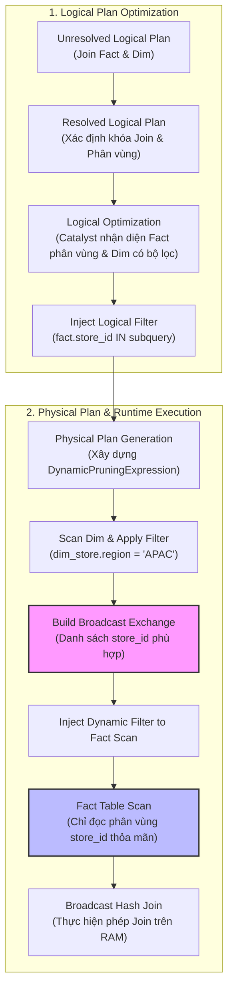

Trong các hệ thống xử lý dữ liệu lớn bằng [Apache Spark](/concepts/3-integration/batch-processing/apache-spark/), việc viết code chạy đúng mới chỉ là bước khởi đầu. Khi quy mô dữ liệu tăng từ gigabyte lên terabyte hoặc petabyte, các thiết lập mặc định của Spark sẽ nhanh chóng bộc lộ hạn chế, dẫn đến tình trạng job chạy chậm, nghẽn mạng do [Shuffle](/concepts/3-integration/batch-processing/shuffle/) dữ liệu hoặc phổ biến nhất là lỗi Out of Memory (OOM) trên các Executor.

Để làm chủ và tối ưu hóa hiệu năng Spark ở mức nâng cao, kỹ sư dữ liệu cần hiểu rõ các cơ chế tối ưu hóa động của Catalyst Optimizer bao gồm **Dynamic Partition Pruning (DPP)**, **Adaptive Query Execution (AQE)**, và cấu trúc quản trị bộ nhớ **Spark JVM Memory Management**. Bài viết này sẽ phân tích chi tiết nguyên lý hoạt động của các cơ chế này và hướng dẫn thực hành cấu hình tối ưu chi tiết.

---


## 1. Dynamic Partition Pruning (DPP)

### Khái niệm và sự khác biệt với Static Partition Pruning
Trong các kỹ thuật tối ưu hóa cơ sở dữ liệu truyền thống, **Static Partition Pruning (Cắt tỉa phân vùng tĩnh)** xảy ra tại thời điểm biên dịch (compile-time). Khi người dùng thực hiện truy vấn có bộ lọc tĩnh trên khóa phân vùng (ví dụ: `WHERE date_key = '2026-06-12'`), Spark Catalyst Optimizer sẽ nhận diện và chỉ đọc các thư mục/phân vùng tương ứng trên ổ đĩa, loại bỏ việc quét toàn bộ bảng (Full Table Scan).

Tuy nhiên, trong các mô hình dữ liệu thực tế (như Star Schema hoặc Snowflake Schema), các bộ lọc thường không nằm trực tiếp trên bảng dữ liệu thực tế (Fact Table) mà nằm trên bảng chiều (Dimension Table) và được liên kết qua phép nối (Join):
```sql
SELECT * FROM fact_sales f 
JOIN dim_store d ON f.store_id = d.store_id 
WHERE d.region = 'APAC';
```
Bảng `fact_sales` được phân vùng theo `store_id`, nhưng bộ lọc lại nằm trên cột `region` của bảng `dim_store`. Với cơ chế tối ưu hóa tĩnh thông thường, Spark không thể biết trước những `store_id` nào thuộc vùng `APAC` tại thời điểm compile-time. Do đó, Spark bắt buộc phải đọc toàn bộ bảng `fact_sales` trước khi thực hiện phép Join, gây lãng phí Disk I/O cực kỳ lớn.

**Dynamic Partition Pruning (DPP - Cắt tỉa phân vùng động)** được giới thiệu từ Spark 3.0 nhằm giải quyết bài toán này bằng cách truyền bộ lọc từ bảng chiều sang bảng thực tế một cách động ngay tại thời điểm thực thi (runtime).

### Cơ chế hoạt động của DPP trong Catalyst Optimizer
Quá trình tối ưu hóa và thực thi DPP được chia thành hai giai đoạn chính:

#### Điều chỉnh kế hoạch Logic (Logical Plan Adjustment)
Khi Catalyst phân tích câu lệnh Join giữa một bảng phân vùng lớn (Fact) và một bảng nhỏ đã được lọc (Dim), nó sẽ tự động tiêm (inject) một bộ lọc logic dưới dạng subquery vào nhánh quét của Fact Table.
*   **Trước khi có DPP:** Kế hoạch logic chỉ đơn thuần là quét toàn bộ `fact_sales`, quét `dim_store` với điều kiện lọc, rồi thực hiện Join.
*   **Sau khi có DPP:** Catalyst biến đổi kế hoạch logic của nhánh Fact thành:
    `Filter store_id IN (SELECT store_id FROM dim_store WHERE region = 'APAC')` phía trên toán tử quét `fact_sales`.

#### Điều chỉnh kế hoạch Vật lý (Physical Plan Adjustment)
Tại thời điểm thực thi vật lý, subquery trên không được chạy độc lập như một câu truy vấn con thông thường (vì như vậy sẽ quét bảng Dim hai lần). Thay vào đó, Spark tận dụng cơ chế **Broadcast Hash Join (BHJ)**.
1.  Spark quét bảng `dim_store` trước, áp dụng bộ lọc `region = 'APAC'`.
2.  Kết quả của phép quét này (danh sách các `store_id` thỏa mãn) được lưu trong bộ nhớ và xây dựng thành một **Relation** để chuẩn bị broadcast.
3.  Spark đóng gói danh sách này thành một `DynamicPruningExpression` (dưới dạng Broadcast Exchange) và gửi trực tiếp tới các tác vụ đang quét bảng `fact_sales`.
4.  Các Executor quét bảng `fact_sales` nhận danh sách `store_id` này và sử dụng nó để bỏ qua việc đọc các phân vùng không khớp ngay từ lớp lưu trữ (file system/metadata level), tương tự như việc áp dụng bộ lọc tĩnh.

### Sơ đồ luồng thực thi DPP và Catalyst
Dưới đây là sơ đồ minh họa cách Catalyst Optimizer chuyển đổi và thực thi DPP:



---

## 2. Adaptive Query Execution (AQE)

Trước Spark 3.0, kế hoạch thực thi vật lý của một câu truy vấn được quyết định tĩnh dựa trên các số liệu thống kê sẵn có (Cost-Based Optimizer - CBO). Tuy nhiên, các số liệu này thường lỗi thời hoặc không chính xác khi đi qua các bộ lọc phức tạp, các hàm UDF hoặc các phép biến đổi trung gian. 

**Adaptive Query Execution (AQE - Thực thi truy vấn thích ứng)** thay đổi cách tiếp cận này bằng cách cho phép Spark liên tục thu thập số liệu thống kê tại runtime sau mỗi **Query Stage** (các ranh giới Shuffle) và biên dịch lại kế hoạch thực thi cho các giai đoạn tiếp theo dựa trên dữ liệu thực tế.

AQE tập trung giải quyết 3 vấn đề hiệu năng cốt lõi:

### a. Tự động gộp các phân vùng Shuffle (Dynamic Coalescing of Shuffle Partitions)
Khi thực hiện các phép toán yêu cầu Shuffle (như `GROUP BY` hoặc `JOIN`), số lượng phân vùng đầu ra mặc định được xác định bởi cấu hình `spark.sql.shuffle.partitions` (mặc định là 200).
*   Nếu cấu hình này quá nhỏ, kích thước mỗi phân vùng sẽ rất lớn, dẫn đến tràn bộ nhớ (OOM) hoặc phải ghi tràn ra đĩa cứng (Spill to Disk).
*   Nếu cấu hình này quá lớn, dữ liệu bị xé nhỏ thành hàng nghìn phân vùng tí hon, phát sinh chi phí quản lý tác vụ (Task scheduling overhead) và gây tắc nghẽn Driver.

**Cơ chế hoạt động của AQE:**
1.  Người dùng thiết lập `spark.sql.shuffle.partitions` ở một giá trị đủ lớn (ví dụ: 1000 hoặc 2000).
2.  Sau khi giai đoạn Map hoàn tất và dữ liệu Shuffle được ghi xuống đĩa, AQE sẽ đo đạc kích thước thực tế của từng phân vùng.
3.  AQE tự động gộp các phân vùng nhỏ liền kề lại với nhau sao cho kích thước của phân vùng mới xấp xỉ cấu hình mục tiêu `spark.sql.adaptive.advisoryPartitionSizeInBytes` (mặc định là 64MB).
4.  Nhờ đó, số lượng Task ở stage tiếp theo được giảm thiểu tối đa, tối ưu hóa thời gian chạy.

### b. Chuyển đổi chiến lược Join động (Dynamic Join Adaptation)
Quyết định lựa chọn giữa [Spark Joins](/concepts/3-integration/batch-processing/spark-joins/) dạng SortMergeJoin (SMJ) hay BroadcastHashJoin (BHJ) phụ thuộc vào cấu hình `spark.sql.autoBroadcastJoinThreshold` (mặc định là 10MB). Nếu CBO ước tính sai kích thước bảng sau bộ lọc, Spark sẽ chọn SMJ, buộc toàn bộ dữ liệu phải Shuffle qua mạng.

**Cơ chế hoạt động của AQE:**
Tại ranh giới Shuffle của giai đoạn Map, AQE thu thập kích thước thực tế của các bảng sau khi đã lọc. Nếu một trong hai bên tham gia Join có kích thước thực tế nhỏ hơn ngưỡng broadcast, AQE sẽ tự động loại bỏ kế hoạch SortMergeJoin ban đầu và chuyển sang BroadcastHashJoin. Điều này giúp loại bỏ hoàn toàn giai đoạn Shuffle và Sort của phép Join tiếp theo.

### c. Xử lý lệch dữ liệu động (Dynamic Skew Join Handling)
Lệch dữ liệu (Data Skew) là hiện tượng một vài phân vùng có lượng dữ liệu lớn vượt trội so với trung bình (ví dụ: phân vùng chứa giá trị `NULL` hoặc các ID phổ biến). Trong các phép Join truyền thống, tác vụ xử lý phân vùng bị lệch này sẽ kéo dài thời gian chạy của toàn bộ Stage (hiện tượng "Straggler Task").

**Cơ chế hoạt động của AQE:**
1.  Spark giám sát kích thước phân vùng tại runtime. Một phân vùng được coi là bị lệch (skewed) nếu nó thỏa mãn cả hai điều kiện:
    *   Kích thước lớn hơn `spark.sql.adaptive.skewJoin.skewedPartitionFactor * median partition size` (mặc định factor = 5).
    *   Kích thước vượt quá ngưỡng tuyệt đối `spark.sql.adaptive.skewJoin.skewedPartitionThresholdInBytes` (mặc định 256MB).
2.  When phát hiện phân vùng lệch ở bảng A, AQE sẽ chia nhỏ phân vùng đó thành các phần nhỏ hơn (sub-partitions).
3.  Đối với phần dữ liệu tương ứng ở bảng B, AQE sẽ nhân bản (duplicate) nó để khớp với các sub-partitions của bảng A.
4.  Các tác vụ Join con sẽ được thực thi song song độc lập, phân bổ đều tải trọng cho các Executor khác nhau, giải quyết dứt điểm hiện tượng nghẽn do lệch dữ liệu.

---

## 3. Quản lý bộ nhớ Spark JVM (Spark JVM Memory Management)

Hiểu và tinh chỉnh cấu trúc bộ nhớ JVM trên mỗi Executor là chìa khóa để ngăn ngừa lỗi Out of Memory (OOM) và tối đa hóa hiệu suất xử lý dữ liệu trên RAM.

### Cấu trúc chi tiết của Executor JVM Memory
Bộ nhớ vật lý phân bổ cho một Spark Executor được chia làm hai khu vực chính: **On-Heap Memory** (nằm trong sự quản lý của JVM Garbage Collector) và **Off-Heap Memory** (nằm ngoài JVM, được quản lý trực tiếp bằng mã native).

```
+------------------------------------------------------------------------------------+
|                                  Total Container Memory                            |
+-------------------------------------------------+----------------------------------+
|               On-Heap Memory                    |         Off-Heap Memory          |
|  (spark.executor.memory)                        |  (spark.executor.memoryOverhead) |
+------------------+------------------------------+------------------+---------------+
|   Reserved Memory|        Usable Memory         |  Project Tungsten|  OS Overhead  |
|   (Fixed 300MB)  |                              |  Direct Memory   |  PySpark / JNI|
|                  +---------------+--------------+------------------+---------------+
|                  |  User Memory  | Spark Memory |                                  |
|                  |  (Default 40%)| (Default 60%)|                                  |
|                  |               +--------------+                                  |
|                  |               |Storage Memory|                                  |
|                  |               |Execution Mem |                                  |
+------------------+---------------+--------------+----------------------------------+
```

#### a. On-Heap Memory (spark.executor.memory)
Tổng lượng bộ nhớ heap của Executor JVM được chia thành các phân vùng logic sau:

*   **Reserved Memory (Bộ nhớ dự phòng):** Bị khóa cứng ở mức **300 MB**. Đây là vùng nhớ dành riêng cho các tiến trình nội bộ của Spark (Spark engine internals) và không thể thay đổi. Nếu cấu hình executor memory nhỏ hơn 1.5 lần Reserved Memory, Spark sẽ báo lỗi ngay khi khởi động.
*   **Usable Memory (Bộ nhớ khả dụng):** Bằng `(spark.executor.memory - 300 MB)`. Vùng nhớ này tiếp tục được chia nhỏ theo tỷ lệ cấu hình:
    *   **Spark Memory (Mặc định 60% - cấu hình qua `spark.memory.fraction`):** Vùng nhớ chính phục vụ việc tính toán dữ liệu và lưu trữ cache.
    *   **User Memory (Mặc định 40% - phần còn lại):** Dành cho các cấu trúc dữ liệu do người dùng định nghĩa trong code, siêu dữ liệu của các Spark internal metadata, thông tin lớp (class metadata), và các biến sinh ra khi chạy UDF.
*   **Phân rã Spark Memory:**
    *   **Execution Memory:** Phục vụ các tác vụ tính toán trực tiếp như Shuffles, Joins, Aggregations.
    *   **Storage Memory:** Phục vụ việc lưu trữ dữ liệu được cache (`.cache()`, `.persist()`) và các biến broadcast.
    *   **Cơ chế vay mượn động (Unified Memory Manager):** Ranh giới giữa Execution và Storage memory là một ranh giới mềm (mặc định chia đôi 50/50 qua `spark.memory.storageFraction`). 
        *   Nếu Storage memory trống, Execution memory có thể mượn toàn bộ không gian của Storage.
        *   Nếu Execution memory trống, Storage memory cũng có thể mượn không gian của Execution.
        *   Khi có tranh chấp: Nếu Execution cần thêm bộ nhớ tính toán mà Storage đang mượn của nó, Spark sẽ đuổi (evict) các block dữ liệu cache của Storage ra đĩa cứng hoặc giải phóng khỏi RAM để nhường chỗ cho Execution. Ngược lại, Storage **không thể** đuổi Execution; nó bắt buộc phải đợi cho đến khi Execution hoàn thành tác vụ tính toán hoặc phải ghi tràn dữ liệu cache xuống đĩa.

#### b. Off-Heap Memory
*   **Off-Heap Execution/Storage Memory (`spark.memory.offHeap.size`):** Khi được kích hoạt thông qua `spark.memory.offHeap.enabled = true`, Spark sẽ phân bổ trực tiếp bộ nhớ ngoài heap cho các cấu trúc dữ liệu nhị phân của Project Tungsten. Việc này giúp giảm thiểu đáng kể chi phí quét dọn của JVM Garbage Collector và bỏ qua bước tuần tự hóa (serialization) dữ liệu.
*   **Memory Overhead (`spark.executor.memoryOverhead`):** Là bộ nhớ bổ sung được hệ thống quản lý container (YARN hoặc Kubernetes) cấp phát ngoài JVM heap for mỗi Executor. Nó dùng cho các bộ đệm Direct Byte Buffers (NIO), lưu trữ các luồng thực thi (Thread stacks), mã máy (Shared libraries), và đặc biệt là bộ nhớ cho các tiến trình không phải JVM chạy cùng (như Python Worker trong PySpark). Kích thước mặc định là `max(384MB, 10% của spark.executor.memory)`.

### GC Tuning (Bộ tối ưu hóa dọn rác JVM G1GC)
Với các ứng dụng xử lý dữ liệu lớn, Executor heap thường có dung lượng từ 8GB đến 32GB hoặc hơn. Các trình dọn rác truyền thống (như Parallel GC) sẽ dừng toàn bộ ứng dụng (Stop-The-World) để dọn dẹp bộ nhớ thế hệ già (Old Generation), gây ra những khoảng trễ rất lớn (lên đến vài phút), làm mất kết nối Executor với Driver.

Để tối ưu, Spark khuyến nghị sử dụng **G1GC (Garbage-First Garbage Collector)**:
```properties
spark.executor.extraJavaOptions=-XX:+UseG1GC -XX:InitiatingHeapOccupancyPercent=35 -XX:G1ReservePercent=15 -XX:MaxGCPauseMillis=200
```
*   `-XX:+UseG1GC`: Kích hoạt trình dọn rác G1.
*   `-XX:InitiatingHeapOccupancyPercent=35`: Bắt đầu chu kỳ dọn rác khi bộ nhớ heap đầy 35% (mặc định là 45%). Việc dọn dẹp sớm giúp tránh hiện tượng hết bộ nhớ đột ngột trong các giai đoạn Shuffle căng thẳng.
*   `-XX:G1ReservePercent=15`: Giữ lại 15% bộ nhớ làm vùng đệm để tránh lỗi "to-space exhaustion" (hiện tượng G1 không tìm đủ không gian trống để chuyển các đối tượng còn sống sang vùng nhớ mới).
*   `-XX:MaxGCPauseMillis=200`: Đặt mục tiêu thời gian dừng ứng dụng tối đa cho mỗi chu kỳ dọn rác là 200 mili giây.

### Chẩn đoán và xử lý lỗi Out of Memory (OOM)

| Loại lỗi OOM | Triệu chứng & Nguyên nhân | Giải pháp khắc phục |
| :--- | :--- | :--- |
| **Driver OOM** | - Driver dừng hoạt động với thông báo `OutOfMemoryError: Java heap space`. <br>- Nguyên nhân: Sử dụng `.collect()` đưa tập dữ liệu quá lớn về Driver; hoặc Broadcast một bảng quá kích thước cho phép; hoặc quá nhiều phân vùng nhỏ gây phình metadata trên Driver. | - Tránh sử dụng `.collect()`. Thay vào đó, ghi trực tiếp ra hệ thống lưu trữ bằng `.write`. <br>- Tăng bộ nhớ Driver qua `spark.driver.memory`. <br>- Giảm hoặc tắt tự động broadcast: hạ thấp `spark.sql.autoBroadcastJoinThreshold`. |
| **Executor OOM (Heap)** | - Executor bị mất kết nối, log ghi nhận `java.lang.OutOfMemoryError: Java heap space`. <br>- Nguyên nhân: Do lệch dữ liệu (skew) dẫn đến một task nhận quá nhiều dữ liệu; hoặc cài đặt số lượng phân vùng quá ít khiến kích thước mỗi phân vùng vượt quá RAM khả dụng. | - Bật AQE để tự động xử lý Skew Join và Coalesce partitions. <br>- Tăng số lượng phân vùng thủ công bằng cách tăng `spark.sql.shuffle.partitions`. <br>- Hạ thấp tỷ lệ `spark.memory.fraction` nếu ứng dụng sử dụng nhiều cấu trúc dữ liệu người dùng (User Memory). |
| **Executor OOM (Container Killed)** | - YARN/K8s báo lỗi `Container killed by YARN for exceeding memory limits`. <br>- Nguyên nhân: Bộ nhớ native vượt ngưỡng cho phép; hoặc rò rỉ bộ nhớ (memory leak) ngoài JVM; hoặc sử dụng PySpark mà lượng dữ liệu gửi qua Python Worker vượt quá dung lượng memoryOverhead. | - Tăng bộ nhớ overhead thông qua cấu hình `spark.executor.memoryOverhead` (ví dụ tăng lên 15% - 20% dung lượng heap). <br>- Giảm số lượng luồng chạy đồng thời trên mỗi executor bằng cách hạ thấp `spark.executor.cores` (giúp giảm áp lực cấp phát Direct Byte Buffers). |

---

## 4. Tối ưu hóa Shuffle và Tuần tự hóa (Shuffle & Serialization)

Hiệu năng của Spark phụ thuộc trực tiếp vào việc giảm thiểu khối lượng dữ liệu truyền qua mạng và tối ưu hóa tốc độ ghi đĩa trong quá trình Shuffle.

### Tinh chỉnh `spark.sql.shuffle.partitions`
Cấu hình này quyết định số lượng phân vùng đích sau các bước xáo trộn dữ liệu. 
*   **Quy tắc ngón tay cái (Rule of Thumb):** Số lượng phân vùng shuffle nên được cấu hình sao cho mỗi task xử lý một lượng dữ liệu từ **100MB đến 200MB** dữ liệu đầu vào.
*   **Công thức ước lượng:** 
    $$\text{Shuffle Partitions} = \frac{\text{Tổng dung lượng dữ liệu Shuffle thực tế (từ Spark UI)}}{150 \text{ MB}}$$
*   **Liên kết với số CPU Cores:** Số lượng phân vùng nên lớn hơn hoặc bằng **2 đến 3 lần** tổng số cores của toàn bộ cụm máy chủ để đảm bảo các core luôn được tận dụng tối đa công suất (tránh hiện tượng core bị đói việc).
*   **Tận dụng AQE:** Luôn kích hoạt AQE (`spark.sql.adaptive.enabled = true`). Thiết lập cấu hình tĩnh `spark.sql.shuffle.partitions` ở mức cao (ví dụ: 1000) làm giới hạn trên, sau đó để AQE tự động gộp các phân vùng nhỏ lại tại runtime.

### Tối ưu hóa tuần tự hóa: Kryo Serialization vs Java Serialization
Theo mặc định, Spark sử dụng thư viện tuần tự hóa tiêu chuẩn của Java (`JavaSerializer`). Cơ chế này rất linh hoạt và dễ sử dụng nhưng cực kỳ chậm, tạo ra chuỗi byte nhị phân cồng kềnh chứa nhiều thông tin lớp thừa thãi, gây tốn băng thông mạng và dung lượng lưu trữ trên đĩa.

**Kryo Serialization** là giải pháp thay thế hiệu năng cao:
*   Tốc độ tuần tự hóa và giải tuần tự hóa nhanh hơn từ **2 đến 10 lần** so với Java Serialization.
*   Dung lượng chuỗi byte đầu ra nhỏ hơn đến **10 lần**, giúp giảm trực tiếp thời gian truyền tải qua mạng trong giai đoạn Shuffle Write/Read.

#### Cấu hình kích hoạt Kryo:
```properties
# Kích hoạt Kryo Serializer làm mặc định
spark.serializer=org.apache.spark.serializer.KryoSerializer

# Yêu cầu bắt buộc đăng ký các class tự định nghĩa (khuyến nghị cho môi trường production)
spark.kryo.registrationRequired=true
```

> [!IMPORTANT]
> Khi bật `spark.kryo.registrationRequired=true`, bạn bắt buộc phải đăng ký tất cả các class tự định nghĩa (custom classes/case classes) với Kryo thông qua cấu hình `spark.kryo.registrator` hoặc gọi `.registerKryoClasses()` trên SparkSession. Nếu không đăng ký, Spark sẽ ném ra ngoại lệ và dừng chạy. Điều này giúp loại bỏ hoàn toàn việc lưu trữ tên class đầy đủ (fully qualified class names) trong mỗi bản ghi nhị phân, tối đa hóa hiệu quả nén của Kryo.

---

## Điểm mạnh (Pros) và Nhược điểm (Cons)

### 1. Dynamic Partition Pruning (DPP)
*   **Ưu điểm (Pros):**
    *   Giảm thiểu đáng kể dung lượng Disk I/O bằng cách bỏ qua các phân vùng không cần thiết trực tiếp từ nguồn lưu trữ.
    *   Tự động tối ưu hóa các câu lệnh truy vấn Star Schema phức tạp mà không cần lập trình viên phải viết lại câu lệnh SQL.
*   **Nhược điểm (Cons):**
    *   Chỉ hoạt động hiệu quả khi phép nối Join được triển khai theo cơ chế Broadcast Hash Join (yêu cầu một bảng đủ nhỏ để broadcast).
    *   Tốn thêm một khoản chi phí nhỏ (overhead) để quét bảng chiều trước và truyền phát danh sách khóa qua mạng.

### 2. Adaptive Query Execution (AQE)
*   **Ưu điểm (Pros):**
    *   Loại bỏ hoàn toàn công việc phán đoán và tinh chỉnh thủ công các thông số shuffle partitions.
    *   Tự động ngăn ngừa các lỗi OOM do lệch dữ liệu (skew) ở runtime.
    *   Tận dụng dữ liệu thực tế để tối ưu hóa chiến lược Join chính xác hơn CBO tĩnh.
*   **Nhược điểm (Cons):**
    *   Phát sinh độ trễ nhỏ giữa các Query Stage do Spark phải dừng lại để thu thập số liệu thống kê và biên dịch lại kế hoạch.
    *   Khó debug và theo dõi lỗi hơn vì kế hoạch thực thi thay đổi liên tục tùy thuộc vào phân phối dữ liệu đầu vào.

### 3. Tinh chỉnh bộ nhớ Spark JVM & Kryo Serialization
*   **Ưu điểm (Pros):**
    *   Tối ưu hóa khả năng tận dụng tài nguyên phần cứng, giảm thiểu tần suất dọn rác dừng ứng dụng (GC pause time).
    *   Kryo giúp tăng tốc độ truyền tải dữ liệu shuffle lên nhiều lần.
*   **Nhược điểm (Cons):**
    *   Đòi hỏi sự hiểu biết sâu rộng về kiến trúc phần cứng và phân phối dữ liệu của ứng dụng.
    *   Cấu hình Kryo nghiêm ngặt yêu cầu bảo trì mã nguồn liên tục khi định nghĩa thêm các class mới.

---

## Khi nào nên dùng

Các kỹ thuật tối ưu hóa nâng cao nên được áp dụng theo các kịch bản sau:

1.  **Kích hoạt mặc định (AQE & DPP):** Trong môi trường Spark 3.2 trở lên, hãy luôn bật `spark.sql.adaptive.enabled = true` và `spark.sql.optimizer.dynamicPartitionPruning.enabled = true`. Đây là các tối ưu hóa an toàn và mang lại lợi ích lớn cho hầu hết các tác vụ batch processing phổ biến.
2.  **Sử dụng Kryo Serialization:** Áp dụng cho các ứng dụng có lượng dữ liệu Shuffle lớn (hàng trăm GB trở lên) hoặc các mô hình Machine Learning phân tán sử dụng RDD/Dataframe có cấu trúc phức tạp.
3.  **Điều chỉnh tỷ lệ bộ nhớ thủ công:** Chỉ nên can thiệp vào `spark.memory.fraction` và `spark.memory.storageFraction` khi:
    *   Ứng dụng sử dụng rất nhiều cache dữ liệu phục vụ tính toán lặp (Iterative algorithms như MLlib) nhưng thiếu RAM $\rightarrow$ tăng `storageFraction`.
    *   Ứng dụng hầu như không dùng `.cache()` mà tập trung vào các phép biến đổi nặng như GroupBy, Join $\rightarrow$ giảm `storageFraction` để nhường toàn bộ tài nguyên cho Execution memory.
4.  **Tinh chỉnh GC G1GC:** Bắt buộc phải cấu hình khi kích thước executor memory vượt quá 8GB để giảm thiểu rủi ro nghẽn Driver do mất nhịp tim (heartbeat timeout) từ Executor.

---

## Trọng tâm ôn luyện phỏng vấn

### Q1: Sự khác biệt bản chất giữa Static Partition Pruning và Dynamic Partition Pruning (DPP) là gì?
**Trả lời:**
*   **Static Partition Pruning** hoạt động tại thời điểm compile-time. Nó lọc phân vùng dựa trên một giá trị hằng số đã biết trong câu lệnh SQL (ví dụ: `WHERE year = 2026`).
*   **Dynamic Partition Pruning (DPP)** hoạt động tại runtime. Nó giải quyết bài toán join giữa một bảng chiều nhỏ có điều kiện lọc và một bảng thực tế lớn được phân vùng. Spark chạy quét bảng chiều trước, thu thập các khóa phân vùng thỏa mãn, sau đó đóng gói thành một Broadcast Exchange để gửi tới toán tử quét bảng thực tế, giúp loại bỏ việc đọc các phân vùng không cần thiết ngay từ nguồn đĩa vật lý.

### Q2: Cơ chế Dynamic Skew Join Handling của AQE hoạt động như thế nào để giải quyết lỗi OOM trên một Task duy nhất?
**Trả lời:**
Khi AQE phát hiện một phân vùng shuffle vượt quá ngưỡng lệch quy định (ví dụ lớn gấp 5 lần trung vị và lớn hơn 256MB), nó sẽ:
1.  Chia nhỏ phân vùng lệch của bảng A thành $N$ phân vùng con (sub-partitions).
2.  Nhân bản phần dữ liệu tương ứng trên khóa join đó ở bảng B thành $N$ bản sao.
3.  Tạo ra $N$ task Join song song thay vì 1 task duy nhất. Mỗi task con sẽ thực hiện join một sub-partition của bảng A với một bản sao dữ liệu của bảng B.
Kết quả là tải trọng tính toán được chia đều cho các Executor khác nhau, ngăn chặn lỗi nghẽn hoặc tràn bộ nhớ do một Task xử lý quá tải.

### Q3: Nếu ứng dụng Spark liên tục bị lỗi `Container killed by YARN/K8s for exceeding memory limits`, bạn sẽ xử lý như thế nào?
**Trả lời:**
Lỗi này xảy ra khi tổng lượng bộ nhớ thực tế (physical memory) của tiến trình Executor vượt quá tổng lượng bộ nhớ được cấp phát bởi bộ quản lý tài nguyên. Để giải quyết:
1.  Tăng cấu hình `spark.executor.memoryOverhead` lên khoảng 15% - 20% của `spark.executor.memory` để tạo vùng đệm lớn hơn cho bộ nhớ native.
2.  Nếu ứng dụng sử dụng PySpark, hãy kiểm tra xem dữ liệu có bị gửi quá mức về phía tiến trình Python hay không; cân nhắc tăng `spark.executor.pyspark.memory`.
3.  Giảm số lượng cores trên mỗi executor thông qua `spark.executor.cores` để hạn chế số lượng luồng chạy đồng thời yêu cầu cấp phát bộ nhớ Direct Byte Buffers.

### Q4: Giải thích quy chế Unified Memory Manager của Spark. Tại sao Execution Memory lại có thể đuổi (evict) Storage Memory và cơ chế này diễn ra như thế nào?
**Trả lời:**
Unified Memory Manager quản lý chung một vùng nhớ gọi là Spark Memory bao gồm Execution (tính toán) và Storage (lưu trữ cache).
*   Hai vùng nhớ này có một ranh giới động và có thể vay mượn lẫn nhau khi bên kia không sử dụng.
*   Khi xảy ra tranh chấp tài nguyên, **Execution Memory có độ ưu tiên cao hơn**. Nếu Execution cần không gian mà Storage đang chiếm giữ (mượn), Spark sẽ đuổi các block dữ liệu cache của Storage ra đĩa cứng hoặc giải phóng khỏi RAM để nhường chỗ cho tính toán. 
*   Ở chiều ngược lại, Storage không thể đuổi Execution. Nếu Storage cần thêm bộ nhớ mà Execution đang chiếm dụng, Storage buộc phải chấp nhận ghi tràn dữ liệu cache mới xuống đĩa hoặc đợi cho đến khi tác vụ tính toán giải phóng bộ nhớ.

---

## English Summary

Advanced Spark performance optimization focuses on minimizing disk I/O, reducing network shuffle overhead, and managing Executor memory efficiently.
1.  **Dynamic Partition Pruning (DPP):** Automatically injects partition-filtering criteria from a dimension table scan into a partitioned fact table scan at runtime via Broadcast Exchange, preventing full table scans in star-schema joins.
2.  **Adaptive Query Execution (AQE):** Enhances physical plan execution stages dynamically by coalescing small shuffle partitions, adapting Sort-Merge Joins to Broadcast Hash Joins, and splitting skewed partitions to avoid straggler tasks.
3.  **Spark JVM Memory Management:** Utilizes a unified memory architecture where execution and storage memory dynamically borrow from each other. Tuning executor heap layout (`spark.memory.fraction`), configuring off-heap allocations, and deploying Garbage-First GC (`G1GC`) are critical to prevent driver and executor `OutOfMemoryError`.
4.  **Shuffle & Serialization:** Fine-tuning shuffle partitions and replacing default Java serialization with Kryo serializer reduces overall execution times and network overhead up to 10x in heavy batch workloads.

---

## Xem thêm các khái niệm liên quan
* [Apache Spark](/concepts/3-integration/batch-processing/apache-spark/)
* [Xử lý dữ liệu theo lô - Batch Processing](/concepts/3-integration/batch-processing/batch-processing/)
* [Lệch dữ liệu - Data Skew](/concepts/3-integration/batch-processing/data-skew/)

## Tài liệu tham khảo

1.  **Apache Spark Performance Tuning Guide**: [Apache Spark Official Documentation](https://spark.apache.org/docs/latest/tuning.html)
2.  **Databricks Spark SQL Adaptive Query Execution Guide**: [Databricks AQE Blog Post](https://www.databricks.com/blog/2020/06/18/introducing-adaptive-query-execution-in-apache-spark-3-0.html)
3.  **Deep Dive into Dynamic Partition Pruning in Apache Spark**: [Databricks DPP Deep Dive](https://www.databricks.com/blog/2020/05/29/dynamic-partition-pruning-in-apache-spark.html)
4.  **Garbage Collection Tuning for Spark Applications**: [AWS EMR Optimization Guide](https://docs.aws.amazon.com/emr/latest/ReleaseGuide/emr-spark-performance.html)
5.  **Understanding Spark Memory Management**: [Google Cloud Dataproc Spark Tuning Guide](https://cloud.google.com/dataproc/docs/concepts/workflows/spark-tuning)
6.  **Optimizing Shuffle Performance in Apache Spark**: [Microsoft Azure HDInsight Spark Tuning](https://learn.microsoft.com/en-us/azure/hdinsight/spark/apache-spark-perf)
7.  **Project Tungsten: GPU-Class Performance for Spark**: [Databricks Tungsten Architecture](https://www.databricks.com/blog/2015/04/28/introducing-project-tungsten-bringing-spark-closer-to-bare-metal.html)
