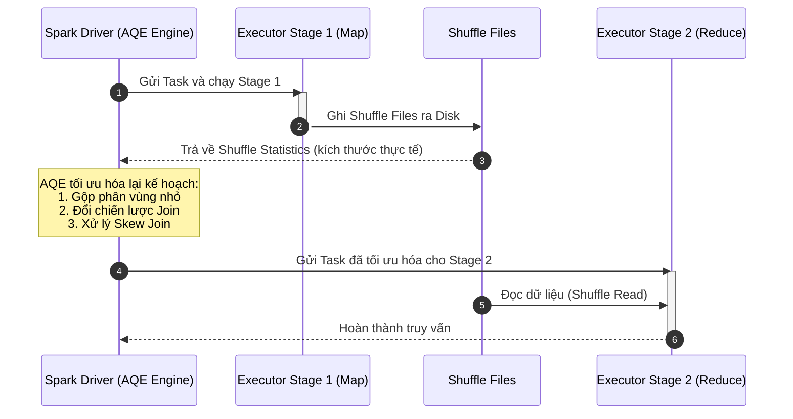

Trong hệ sinh thái [Apache Spark](/concepts/3-integration/batch-processing/apache-spark/), hiệu năng của một ứng dụng xử lý dữ liệu lớn không chỉ phụ thuộc vào cấu hình phần cứng hay cách lập trình mà còn phụ thuộc rất lớn vào cách Spark biên dịch câu lệnh SQL/DataFrame thành các tác vụ chạy song song trên cụm máy chủ. Hai công nghệ đóng vai trò kiến trúc cốt lõi cho việc tối ưu hóa này là **Catalyst Optimizer** (Bộ tối ưu hóa tĩnh) và **Adaptive Query Execution (AQE)** (Bộ tối ưu hóa động khi chạy). 

Bài viết này sẽ đi sâu vào nguyên lý hoạt động của cả hai công nghệ, giúp bạn hiểu rõ cách Spark "suy nghĩ" và tự động điều chỉnh kế hoạch thực thi để đạt hiệu năng tối ưu nhất.

---

## 1. Catalyst Optimizer: Bộ tối ưu hóa tĩnh

**Catalyst Optimizer** là một bộ tối ưu hóa truy vấn có cấu trúc (structured query optimizer) được viết bằng ngôn ngữ Scala, sử dụng lập trình hàm (functional programming) để chuyển đổi các câu lệnh truy vấn của người dùng thành một kế hoạch thực thi vật lý tối ưu nhất. 

Catalyst hoạt động dựa trên cơ chế duyệt cây (tree transformation rules). Toàn bộ quá trình tối ưu hóa tĩnh này trải qua **4 giai đoạn chính**:

```mermaid
graph TD
    subgraph "Catalyst Optimizer Pipeline"
        A["Unresolved Logical Plan\n(Cây cú pháp trừu tượng AST)"] -->|1. Analysis\n(Đối chiếu Catalog)| B["Resolved Logical Plan\n(Đã xác thực kiểu & cột)"]
        B -->|2. Logical Optimization\n(Quy luật RBO)| C["Optimized Logical Plan\n(Kế hoạch logic tối ưu)"]
        C -->|3. Physical Planning\n(Mô hình chi phí CBO)| D["Physical Plan\n(Kế hoạch thực thi vật lý)"]
        D -->|4. Code Generation\n(Biên dịch Janino)| E["Java Bytecode\n(Thực thi trên Executor)"]
    end
```

### Stage 1: Analysis (Phân tích cú pháp và ngữ nghĩa)
Khi bạn chạy một câu lệnh SQL hoặc thao tác DataFrame API, Spark trước hết sẽ phân tích cú pháp để tạo ra một **Abstract Syntax Tree (AST - Cây cú pháp trừu tượng)** nhưng chưa được xác thực thông tin. Giai đoạn này được gọi là **Unresolved Logical Plan** vì Spark chưa biết các bảng hay các cột được truy vấn có thực sự tồn tại hay không, hoặc kiểu dữ liệu của chúng có hợp lệ không.

Tiếp theo, bộ **Analyzer** sẽ kết hợp với **Catalog** (danh mục lưu trữ siêu dữ liệu về bảng, cột, kiểu dữ liệu, hàm) để kiểm tra ngữ nghĩa và phân giải (resolve) các đối tượng này. Kết quả sau bước này là một **Resolved Logical Plan**, trong đó mọi quan hệ và kiểu dữ liệu đã được xác định rõ ràng.

### Stage 2: Logical Optimization (Tối ưu hóa logic)
Trong giai đoạn này, Spark áp dụng phương pháp **Rule-Based Optimization (RBO - Tối ưu hóa dựa trên quy luật)** để chuyển đổi kế hoạch logic ban đầu thành một **Optimized Logical Plan**. Catalyst sử dụng hàng chục quy luật tối ưu hóa kinh điển của hệ quản trị cơ sở dữ liệu:
*   **Predicate Pushdown (Đẩy bộ lọc xuống dưới):** Đẩy các điều kiện lọc (`WHERE` hoặc `.filter()`) xuống vị trí gần nguồn dữ liệu nhất có thể. Điều này giúp lọc bỏ các bản ghi không cần thiết ngay khi đọc file, giảm lượng dữ liệu cần chuyển qua mạng hoặc nạp vào bộ nhớ.
*   **Projection Pruning (Cắt tỉa cột):** Chỉ đọc các cột cần thiết cho câu truy vấn và loại bỏ các cột thừa ngay từ bước quét nguồn (scan), giúp giảm Disk I/O.
*   **Constant Folding (Tính toán trước hằng số):** Nếu có biểu thức chứa các hằng số tĩnh (ví dụ: `1 + 1` hoặc `100 * 365`), Spark sẽ tính toán trước kết quả thành `2` hoặc `36500` ngay tại thời điểm compile, tránh tính lặp đi lặp lại trên hàng triệu dòng dữ liệu tại runtime.
*   **Simplifying Boolean Expressions:** Tối giản các biểu thức logic phức tạp (ví dụ: `NOT (A OR B)` thành `NOT A AND NOT B`) giúp máy tính xử lý nhanh hơn.

### Stage 3: Physical Planning (Lập kế hoạch vật lý)
Sau khi có kế hoạch logic tối ưu, Spark bước vào giai đoạn quyết định xem dữ liệu sẽ thực sự được xử lý thế nào trên cụm máy chủ. Giai đoạn này chuyển đổi **Optimized Logical Plan** thành một hoặc nhiều **Physical Plans (Kế hoạch vật lý)**. 

Spark sử dụng **Cost-Based Optimizer (CBO - Bộ tối ưu hóa dựa trên chi phí)** để ước tính chi phí thực thi (CPU, Memory, Network I/O) của từng kế hoạch dựa trên các thông số thống kê của bảng (như tổng số dòng, kích thước file, tần suất xuất hiện giá trị...). Kế hoạch vật lý có chi phí ước tính thấp nhất (Selected Physical Plan) sẽ được chọn để thực thi. 

*Ví dụ:* Tại bước này, Spark sẽ quyết định sử dụng [Spark Joins](/concepts/3-integration/batch-processing/spark-joins) theo chiến lược nào: **Broadcast Hash Join (BHJ)** hay **Sort Merge Join (SMJ)** dựa trên kích thước ước lượng của các bảng.

### Stage 4: Code Generation (Phát sinh mã nguồn)
Để đạt hiệu năng thực thi cực đại, Spark không chạy kế hoạch vật lý dưới dạng diễn giải cây (tree interpretation) vì điều này gây ra quá nhiều cuộc gọi hàm ảo (virtual function calls) và tốn bộ nhớ cache CPU. Thay vào đó, Spark sử dụng tính năng **Whole-Stage Code Generation (WSCG - Phát sinh mã nguồn toàn bộ giai đoạn)**.

Sử dụng trình biên dịch **Janino Compiler** gọn nhẹ viết bằng Java, Spark sẽ dịch toàn bộ kế hoạch vật lý thành mã bytecode Java cực kỳ tối giản tại runtime. Các toán tử (như filter, project, join) được gộp chung vào một vòng lặp `for` duy nhất, cho phép dữ liệu nằm nguyên trong các thanh ghi CPU (CPU registers) thay vì liên tục chuyển qua lại giữa các vùng nhớ.

---

## 2. Adaptive Query Execution (AQE): Bộ tối ưu hóa động tại Runtime

Mặc dù Catalyst Optimizer rất mạnh mẽ, nó vẫn có một điểm yếu chí mạng: **Nó là một bộ tối ưu hóa tĩnh**. Tất cả các quyết định của nó đều dựa trên dữ liệu thống kê trước khi truy vấn chạy (static statistics). Trong thực tế, các số liệu này thường bị thiếu, lỗi thời, hoặc bị sai lệch nghiêm trọng sau khi dữ liệu đi qua nhiều bộ lọc phức tạp hoặc các phép toán ghép nối tùy biến.

Để khắc phục giới hạn đó, từ Spark 3.0, **Adaptive Query Execution (AQE)** được giới thiệu như một cuộc cách mạng. Thay vì áp đặt một kế hoạch thực thi cố định từ đầu đến cuối, AQE cho phép Spark tự động thay đổi và tối ưu hóa kế hoạch thực thi ngay trong khi truy vấn đang chạy (run-time) dựa trên các số liệu thống kê thực tế được thu thập sau mỗi stage.

### Cơ chế hoạt động của AQE: Phân ranh giới truy vấn (Query Stages)
Khi kích hoạt AQE (`spark.sql.adaptive.enabled = true`), Spark sẽ chia kế hoạch vật lý thành các **Query Stages** độc lập ngăn cách bởi các **Shuffle Boundaries (Ranh giới xáo trộn)**. 

Mỗi khi một Stage hoàn thành, dữ liệu sẽ được ghi ra disk dưới dạng các shuffle files. Lúc này, Driver sẽ thu thập chính xác các thông số thống kê thực tế (actual runtime statistics) như kích thước dữ liệu thực tế của từng phân vùng ([Spark Partition](/concepts/3-integration/batch-processing/spark-partition)), số lượng bản ghi thực tế, vân vân. AQE sẽ sử dụng dữ liệu này để tính toán lại và tối ưu hóa kế hoạch thực thi cho các Stage tiếp theo.



---

## 3. Ba tính năng cốt lõi của AQE

AQE cung cấp ba vũ khí tối tân để giải quyết các vấn đề hiệu năng thực tế của Spark:

### 3.1. Dynamic Coalescing of Shuffle Partitions (Tự động gộp phân vùng xáo trộn)
Trong Spark Classic, số lượng phân vùng sau các thao tác [Shuffle](/concepts/3-integration/batch-processing/shuffle/) (như `join`, `groupBy`) được quyết định bởi cấu hình tĩnh `spark.sql.shuffle.partitions` (mặc định là 200). 
*   Nếu cấu hình này quá lớn so với lượng dữ liệu thực tế, Spark sẽ tạo ra hàng trăm task rác siêu nhỏ, dẫn đến chi phí lập lịch task (task scheduling overhead) và ghi chép siêu dữ liệu cực kỳ lớn.
*   Nếu quá nhỏ, các task sẽ phải xử lý lượng dữ liệu khổng lồ, dễ gây ra lỗi tràn bộ nhớ (Out Of Memory - OOM).

**Giải pháp của AQE:** Bạn chỉ cần cấu hình `spark.sql.shuffle.partitions` ở mức tương đối lớn để dự phòng cho trường hợp dữ liệu lớn nhất. Sau khi Map Stage kết thúc, AQE sẽ kiểm tra kích thước của từng phân vùng. Những phân vùng nào có kích thước quá nhỏ sẽ được tự động gộp (coalesce) lại với nhau thành các phân vùng lớn hơn để khớp với kích thước tối ưu mục tiêu (target size), cấu hình qua biến `spark.sql.adaptive.advisoryPartitionSizeInBytes` (mặc định là 64MB).

```
Trước AQE: [Part 1: 2MB] [Part 2: 1MB] [Part 3: 50MB] [Part 4: 3MB]  --> Chạy 4 Tasks tách biệt
Sau AQE:  [------- Coalesced Part: 6MB -------] [Part 3: 50MB]      --> Chỉ chạy 2 Tasks tối ưu
```

### 3.2. Dynamic Join Selection (Tự động chuyển đổi chiến lược Join)
Như đã phân tích ở bài viết [Spark Joins](/concepts/3-integration/batch-processing/spark-joins), **Broadcast Hash Join (BHJ)** là phép join nhanh nhất vì nó không yêu cầu shuffle dữ liệu qua mạng. Tuy nhiên, nó đòi hỏi một trong hai bảng phải nhỏ hơn ngưỡng cấu hình `spark.sql.autoBroadcastJoinThreshold` (mặc định là 10MB).

Trong quá trình lập kế hoạch tĩnh, Spark có thể chọn **Sort-Merge Join (SMJ)** vì dữ liệu thô ban đầu của bảng là 100MB (lớn hơn 10MB). Tuy nhiên, trong thực tế, câu truy vấn có chứa một bộ lọc rất mạnh (`WHERE country = 'VN'`) khiến lượng dữ liệu sau khi lọc thực tế chỉ còn lại 2MB.

**Giải pháp của AQE:** Sau khi chạy xong giai đoạn quét và lọc dữ liệu (Map Stage), AQE phát hiện kích thước thực tế của bảng đã giảm xuống dưới ngưỡng broadcast. Spark sẽ lập tức "quay xe", hủy bỏ kế hoạch chạy Sort-Merge Join ban đầu và chuyển sang thực hiện **Broadcast Hash Join** động. Điều này giúp loại bỏ hoàn toàn giai đoạn shuffle read và sort cực kỳ tốn kém của bảng còn lại.

### 3.3. Dynamic Skew Join Optimization (Tối ưu hóa lệch dữ liệu động)
Hiện tượng lệch dữ liệu ([Data Skew](/concepts/3-integration/batch-processing/data-skew)) xảy ra khi phân phối dữ liệu không đồng đều, dẫn đến một vài phân vùng chứa lượng dữ liệu khổng lồ trong khi các phân vùng khác lại rất nhỏ. Khi thực hiện join, điều này tạo ra hiện tượng **Stragglers** - một vài task chạy mất hàng giờ đồng hồ để xử lý phân vùng bị lệch, trong khi 99% các task khác đã hoàn thành từ lâu.

**Giải pháp của AQE:** AQE liên tục giám sát kích thước các phân vùng shuffle tại runtime. Nếu phát hiện một phân vùng có kích thước lớn đột biến (vượt quá ngưỡng lệch cấu hình), AQE sẽ tự động can thiệp bằng cách:
1.  **Chia nhỏ (Split):** Chia phân vùng bị skew (lệch) của bảng A thành nhiều phân vùng con nhỏ hơn (Sub-partitions).
2.  **Nhân bản (Duplicate):** Nhân bản phân vùng tương ứng của bảng B ở phía đối diện phép Join.
3.  **Join song song:** Thực hiện các phép join con này một cách song song trên nhiều task khác nhau, sau đó gộp kết quả lại. Nhờ đó, nút thắt cổ chai hiệu năng được tháo gỡ hoàn toàn.

```
Bảng A (Skewed):  [ Part A1 (Khổng lồ) ]    --> Chia thành: [ Part A1_1 ] [ Part A1_2 ]
Join với:
Bảng B:           [ Part B1 ]                --> Nhân bản:   [ Part B1   ] [ Part B1   ]
-----------------------------------------------------------------------------------------
Kết quả: Chạy 2 Task song song: (A1_1 Join B1) và (A1_2 Join B1) thay vì 1 Task nặng nề duy nhất.
```

---

## 4. Các cấu hình quan trọng cho AQE

Để tối ưu hóa AQE trên các môi trường đám mây lớn như AWS EMR hay GCP Dataproc, kỹ sư dữ liệu cần nắm vững các tham số cấu hình sau:

| Tham số cấu hình | Giá trị mặc định | Ý nghĩa |
| :--- | :--- | :--- |
| `spark.sql.adaptive.enabled` | `true` (từ Spark 3.2) | Kích hoạt hoặc vô hiệu hóa tính năng AQE toàn cục. |
| `spark.sql.adaptive.coalescePartitions.enabled` | `true` | Cho phép tự động gộp các phân vùng shuffle nhỏ. |
| `spark.sql.adaptive.advisoryPartitionSizeInBytes` | `64MB` (`67108864`) | Kích thước đích của phân vùng sau khi gộp. Tăng lên 128MB hoặc 256MB nếu dữ liệu cực lớn. |
| `spark.sql.adaptive.skewJoin.enabled` | `true` | Kích hoạt cơ chế tự động tối ưu hóa phép join bị lệch dữ liệu. |
| `spark.sql.adaptive.skewJoin.skewedPartitionFactor` | `5` | Một phân vùng được coi là bị lệch nếu lớn hơn gấp 5 lần trung vị kích thước các phân vùng khác. |
| `spark.sql.adaptive.skewJoin.skewedPartitionThresholdInBytes` | `256MB` | Ngưỡng kích thước tối thiểu để một phân vùng được xem xét xử lý lệch dữ liệu động. |

---

## Điểm mạnh và điểm yếu

### Điểm mạnh (Pros)
*   **Tự động hóa hoàn toàn:** Nhà phát triển không cần phải cấu hình số lượng phân vùng một cách thủ công hay viết code phức tạp để xử lý nghi vấn dữ liệu lệch.
*   **Tiết kiệm tài nguyên cụm:** Giảm thiểu đáng kể dữ liệu shuffle ghi xuống đĩa cứng và băng thông truyền tải mạng nhờ chuyển đổi sang Broadcast Join và gộp phân vùng nhỏ.
*   **Tránh lỗi OOM:** Tự động chia nhỏ các phân vùng quá tải giúp giảm thiểu nguy cơ các Executor bị sập do thiếu bộ nhớ RAM.
*   **Tăng tốc độ xử lý:** Giúp giải quyết triệt để vấn đề "straggler tasks", rút ngắn tổng thời gian thực thi (wall-clock time) của các job ETL lớn.

### Điểm yếu (Cons)
*   **Chỉ áp dụng sau Shuffle Boundary:** AQE không thể tối ưu hóa các phần của câu truy vấn chạy trước khi có bất kỳ shuffle nào xảy ra (ví dụ: giai đoạn lọc và đọc dữ liệu ban đầu).
*   **Chi phí lập lịch và quản lý:** Việc thu thập số liệu thống kê giữa các stage đòi hỏi giao tiếp liên tục giữa Driver và Executor, có thể tạo ra một lượng nhỏ overhead thời gian trễ đối với các truy vấn siêu ngắn (dưới 1 giây).
*   **Yêu cầu ghi Shuffle file:** Để thu thập số liệu, dữ liệu bắt buộc phải đi qua ranh giới Shuffle và ghi ra đĩa. Nếu phép toán hoàn toàn không có Shuffle, AQE sẽ không có cơ hội can thiệp tối ưu.

---

## Khi nào nên dùng

AQE nên được bật trong hầu hết các kịch bản thực tế, đặc biệt là:
*   Các ứng dụng xử lý dữ liệu theo lô ([Batch Processing](/concepts/3-integration/batch-processing/batch-processing)) có quy mô dữ liệu biến động hàng ngày (ngày nhiều ngày ít), nơi cấu hình tĩnh dễ bị lỗi thời.
*   Các pipeline ETL thực hiện nhiều phép nối phức tạp ([Spark Joins](/concepts/3-integration/batch-processing/spark-joins)) giữa các bảng dữ liệu khổng lồ thu thập từ hành vi người dùng, nơi hiện tượng lệch dữ liệu ([Data Skew](/concepts/3-integration/batch-processing/data-skew)) xảy ra thường xuyên.
*   Các hệ thống phân tích ad-hoc (như Spark SQL trên Databricks hay AWS EMR), nơi người dùng chạy các câu lệnh SQL tùy biến không thể dự đoán trước kế hoạch thực thi tối ưu.

**Khi nào cân nhắc tắt AQE:**
*   Đối với các tác vụ xử lý streaming thời gian thực (Spark Structured Streaming) với yêu cầu độ trễ cực thấp (Sub-second latency), việc thu thập thông số và tính toán lại kế hoạch động có thể làm tăng nhẹ độ trễ của các micro-batch.

---

## Trọng tâm ôn luyện phỏng vấn

:::question Q1: Điểm khác biệt lớn nhất giữa Catalyst Optimizer và AQE là gì?
**Trả lời:** Catalyst Optimizer thực hiện tối ưu hóa truy vấn tĩnh (static optimization) tại thời điểm biên dịch (compile-time) trước khi ứng dụng chạy. Nó hoàn toàn dựa vào các ước tính chi phí lý thuyết và số liệu thống kê tĩnh. Ngược lại, AQE thực hiện tối ưu hóa động (dynamic optimization) tại thời điểm chạy (runtime). Nó sử dụng dữ liệu đo đạc thực tế sau khi kết thúc một Stage để thay đổi kế hoạch thực thi cho Stage tiếp theo.
:::

:::question Q2: Cơ chế Dynamic Join Selection của AQE hoạt động như thế nào để chuyển đổi từ Sort-Merge Join sang Broadcast Hash Join?
**Trả lời:** Ban đầu, Spark chọn Sort-Merge Join (SMJ) vì dữ liệu ước tính của cả hai bảng đều lớn hơn ngưỡng `spark.sql.autoBroadcastJoinThreshold` (10MB). Khi chạy Stage 1 (ví dụ quét bảng kèm lọc dữ liệu), dữ liệu thực tế sau khi lọc chỉ còn 3MB. Khi kết thúc Stage 1, Driver nhận được thông tin thống kê kích thước thực tế là 3MB (nhỏ hơn 10MB). AQE lập tức cập nhật kế hoạch thực thi của Stage tiếp theo, chuyển đổi SMJ thành Broadcast Hash Join (BHJ) bằng cách broadcast bảng 3MB này tới các Executor, bỏ qua bước shuffle read và sort của bảng đối diện.
:::

:::question Q3: Làm thế nào AQE phát hiện và xử lý một phân vùng bị lệch (Skew Partition)?
**Trả lời:** AQE liên tục theo dõi kích thước của các phân vùng dữ liệu sau shuffle. Một phân vùng được coi là bị lệch nếu nó thỏa mãn đồng thời hai điều kiện:
1. Kích thước lớn hơn ngưỡng tối thiểu `spark.sql.adaptive.skewJoin.skewedPartitionThresholdInBytes` (mặc định 256MB).
2. Kích thước lớn hơn trung vị kích thước của tất cả các phân vùng nhân với hệ số `spark.sql.adaptive.skewJoin.skewedPartitionFactor` (mặc định là 5).

Khi phát hiện phân vùng bị lệch của bảng A, AQE sẽ chia nó thành các phân vùng con nhỏ hơn, đồng thời nhân bản phân vùng tương ứng của bảng B để thực hiện phép Join song song độc lập.
:::

---

## English Summary

**Catalyst Optimizer** is Spark's core compile-time static query optimizer. It translates user queries into optimized physical plans using a four-stage pipeline: **Analysis** (resolving names against catalog), **Logical Optimization** (applying rule-based optimizations like predicate pushdown and projection pruning), **Physical Planning** (generating multiple physical execution plans and selecting the cheapest one using a Cost-Based Optimizer), and **Code Generation** (generating efficient Java bytecode at runtime using the Janino compiler).

**Adaptive Query Execution (AQE)** extends Catalyst by enabling dynamic run-time optimizations. By partitioning the execution plan into **Query Stages** separated by shuffle boundaries, AQE leverages actual execution statistics collected at runtime to adjust subsequent stages. AQE's three signature features are:
1.  **Dynamic Coalescing of Shuffle Partitions:** Combines small post-shuffle partitions into larger, optimal sizes to minimize task scheduling overhead.
2.  **Dynamic Join Selection:** Dynamically demotes Sort-Merge Joins to Broadcast Hash Joins if runtime filtering reduces one table's size below the broadcast threshold.
3.  **Dynamic Skew Join Optimization:** Detects skewed partitions at runtime, splits them into smaller sub-partitions, duplicates the matching join relation, and executes the joins in parallel to eliminate straggler tasks.

---

## Xem thêm các khái niệm liên quan
* [Apache Spark](/concepts/3-integration/batch-processing/apache-spark/)
* [Xử lý dữ liệu theo lô - Batch Processing](/concepts/3-integration/batch-processing/batch-processing/)
* [Lệch dữ liệu - Data Skew](/concepts/3-integration/batch-processing/data-skew/)

## Tài liệu tham khảo

1. [Apache Spark - SQL Performance Tuning and Adaptive Query Execution](https://spark.apache.org/docs/latest/sql-performance-tuning.html#adaptive-query-execution)
2. [Databricks - Adaptive Query Execution: Speeding Up Spark SQL at Runtime](https://www.databricks.com/blog/2020/05/29/adaptive-query-execution-speeding-up-spark-sql-at-runtime.html)
3. [AWS Amazon EMR - Spark Adaptive Query Execution Configuration](https://docs.aws.amazon.com/emr/latest/ReleaseGuide/emr-spark-performance.html)
4. [Google Cloud Dataproc - Workflow templates and Spark Execution](https://cloud.google.com/dataproc/docs/concepts/workflows/work-with-spark)
5. [Azure Microsoft - What's New in Apache Spark 3.0 on Azure Synapse Analytics](https://azure.microsoft.com/en-us/blog/whats-new-in-apache-spark-3-0-on-azure-synapse-analytics/)
