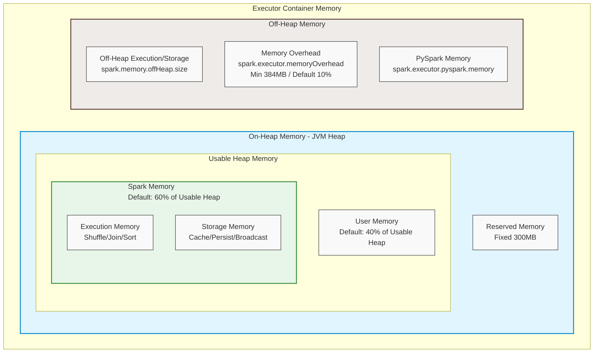

Trong các hệ thống xử lý dữ liệu lớn bằng [Apache Spark](/concepts/3-integration/batch-processing/apache-spark/), bộ nhớ (RAM) là tài nguyên quan trọng nhất nhưng cũng là nơi dễ xảy ra lỗi nhất. Hầu hết các kỹ sư dữ liệu (Data Engineers) đều đã từng đối mặt với lỗi **OutOfMemoryError (OOM)** huyền thoại khiến ứng dụng bị sập giữa chừng. 

Để tối ưu hóa hiệu năng và xây dựng các đường ống dẫn dữ liệu (data pipelines) ổn định, việc hiểu rõ kiến trúc quản lý bộ nhớ của Spark (Spark Memory Management) là điều bắt buộc. Bài viết này sẽ phân tích chi tiết cơ chế phân bổ bộ nhớ của Spark Executor và Driver, cách cấu hình On-heap/Off-heap, vấn đề thu dọn rác (Garbage Collection), và các bước xử lý lỗi OOM thực tế trong production chạy trên AWS EMR hay GCP Dataproc.

---

## Kiến trúc bộ nhớ Spark Executor JVM (Executor JVM Memory Layout)

Khi Spark chạy một ứng dụng phân tán, mỗi **Executor** được khởi chạy dưới dạng một tiến trình máy ảo Java (JVM process) trên một Worker Node. Bộ nhớ tổng thể của một Executor được chia thành hai phần chính: **On-Heap Memory** (bộ nhớ trong Heap JVM) và **Off-Heap Memory** (bộ nhớ ngoài Heap JVM).



### Phân rã các phân vùng bộ nhớ JVM Heap (JVM Heap Divisions)

Kể từ phiên bản Spark 1.6, Spark sử dụng cơ chế **Unified Memory Manager** (Quản lý bộ nhớ hợp nhất). Tổng bộ nhớ JVM Heap khả dụng (`spark.executor.memory`) được phân chia thành các vùng sau:

#### 1. Reserved Memory (Bộ nhớ dự phòng)
*   **Kích thước**: Mặc định cố định là **300 MB**.
*   **Vai trò**: Vùng nhớ này được dành riêng cho các tác vụ nội bộ của Spark (Spark’s internal runtime system) nhằm đảm bảo hoạt động của Spark không bị ảnh hưởng bởi code của người dùng.
*   **Đặc điểm**: Người dùng không thể cấu hình trực tiếp thông qua tham số, và dung lượng này bị trừ trực tiếp khỏi tổng JVM Heap trước khi tính toán các vùng nhớ khác. Nếu bộ nhớ JVM Heap cấp cho Executor nhỏ hơn 450 MB, Spark sẽ báo lỗi khởi động.

#### 2. User Memory (Bộ nhớ người dùng)
*   **Công thức**: `(Java Heap - Reserved Memory) * (1 - spark.memory.fraction)`
*   **Tỷ lệ mặc định**: **40%** của bộ nhớ khả dụng (khi `spark.memory.fraction = 0.6`).
*   **Vai trò**: Lưu trữ các cấu trúc dữ liệu do người dùng định nghĩa trong code (user-defined data structures), metadata của RDD, các phép biến đổi tùy chỉnh (custom transformations), dữ liệu tạm thời của các hàm UDF, và siêu dữ liệu (metadata) của các thư viện bên thứ ba.
*   **Rủi ro**: Nếu bạn sử dụng các cấu trúc dữ liệu lớn như HashMap hoặc Array tự định nghĩa trong các tác vụ `map` hay `flatMap`, vùng nhớ này sẽ nhanh chóng bị quá tải và gây ra lỗi OOM.

#### 3. Spark Memory (Bộ nhớ Spark - Unified Memory)
*   **Công thức**: `(Java Heap - Reserved Memory) * spark.memory.fraction`
*   **Tỷ lệ mặc định**: **60%** của bộ nhớ khả dụng (khi `spark.memory.fraction` mặc định là `0.6`).
*   **Vai trò**: Đây là vùng nhớ cốt lõi phục vụ trực tiếp cho việc xử lý dữ liệu và lưu trữ đệm trong Spark. Vùng nhớ này tiếp tục được chia thành hai phần có thể vay mượn lẫn nhau một cách linh hoạt:
    *   **Execution Memory (Bộ nhớ thực thi)**: Được sử dụng để lưu trữ dữ liệu tạm thời phục vụ cho các phép toán nặng như [Shuffle trong Spark](/concepts/3-integration/batch-processing/shuffle/), Joins (Sort-Merge Join), Aggregations (hàm gom nhóm), và Sorting.
    *   **Storage Memory (Bộ nhớ lưu trữ)**: Được sử dụng cho việc lưu trữ các RDD/DataFrame đã được cache hoặc persist (bằng cách dùng `.cache()` hoặc `.persist()`), các biến quảng bá (Broadcast variables), và việc giải nén (unrolling) các khối dữ liệu.

### Cơ chế vay mượn bộ nhớ động (Dynamic Memory Sharing)

Ranh giới giữa **Execution Memory** và **Storage Memory** không phải là cố định mà được điều chỉnh động dựa trên nhu cầu thực tế của job:
*   Nếu không có khối dữ liệu nào được cache (Storage Memory trống), Execution Memory có thể vay mượn toàn bộ 100% dung lượng của Spark Memory.
*   If Execution Memory trống, Storage Memory cũng có thể mở rộng tối đa 100% dung lượng Spark Memory.
*   **Cơ chế thu hồi (Eviction)**:
    *   Nếu Execution Memory cần thêm bộ nhớ và phát hiện Storage Memory đang chiếm giữ không gian, Spark sẽ **thu hồi (evict)** bộ nhớ của Storage. Các khối dữ liệu đang cache sẽ bị đẩy xuống đĩa (spilled to disk) hoặc bị giải phóng khỏi bộ nhớ (dropped) tùy thuộc vào Storage Level được cấu hình.
    *   Ngược lại, nếu Storage Memory cần thêm không gian nhưng Execution Memory đang chiếm giữ, Storage Memory **không thể thu hồi** bộ nhớ của Execution. Điều này là do dữ liệu trong Execution Memory đang phục vụ trực tiếp cho các phép tính toán vật lý đang chạy; việc giải phóng chúng sẽ làm hỏng kết quả của tác vụ (Task).
*   **Ngưỡng bảo vệ (`spark.memory.storageFraction`)**: Mặc định là `0.5` (50% của Spark Memory). Đây là vùng nhớ Storage được bảo vệ. Nếu lượng bộ nhớ Storage sử dụng vượt quá ngưỡng này, phần vượt quá sẽ bị Execution Memory thu hồi khi cần. Nếu dưới ngưỡng này, Storage sẽ được bảo vệ và không bị Execution Memory xâm phạm.

---

## Bộ nhớ ngoài Heap (Off-heap Memory) và các phân vùng phụ trợ

Bên cạnh bộ nhớ On-Heap thuộc quyền quản lý của Garbage Collector (GC), Spark Executor còn sử dụng và quản lý bộ nhớ ngoài Heap (Off-heap Memory) để nâng cao hiệu năng và tránh hiện tượng dừng hệ thống do GC (GC pauses).

### 1. Spark Off-Heap Memory (`spark.memory.offHeap.enabled`)
*   **Cấu hình**: Kích hoạt bằng `spark.memory.offHeap.enabled = true` và khai báo dung lượng qua `spark.memory.offHeap.size` (tính bằng byte).
*   **Vai trò**: Được sử dụng bởi **Project Tungsten** – dự án tối ưu hóa động cơ thực thi của Spark. Tungsten quản lý bộ nhớ ở định dạng nhị phân thô (raw binary format) trực tiếp trên Off-heap, giúp loại bỏ hoàn toàn chi phí tuần tự hóa (serialization overhead) và giảm tải cho JVM Garbage Collector.
*   **Ứng dụng**: Rất hữu ích cho các job thực hiện [Shuffle trong Spark](/concepts/3-integration/batch-processing/shuffle/) dung lượng lớn hoặc các tác vụ tính toán toán học phức tạp cần quản lý bộ nhớ chặt chẽ.

### 2. Memory Overhead (`spark.executor.memoryOverhead`)
*   **Mặc định**: Chiếm **10%** của `spark.executor.memory` hoặc tối thiểu là **384 MB** (tùy thuộc vào giá trị nào lớn hơn).
*   **Vai trò**: Đây là bộ nhớ ngoài Heap được cấp phát bởi Hệ điều hành (OS) cho chính tiến trình Executor JVM. Nó bao gồm:
    *   Bộ nhớ overhead của máy ảo Java (JVM overhead, ví dụ: Metaspace lưu trữ metadata của class, Thread Stacks).
    *   Các thư viện liên kết động C/C++ (Native libraries) được tải bởi Java.
    *   Bộ đệm I/O của hệ điều hành (OS Page Cache).
*   **Rủi ro**: Nếu tổng bộ nhớ thực tế của Executor (gồm On-heap + Off-heap + Overhead) vượt quá giới hạn tài nguyên được cấp phát bởi trình quản lý tài nguyên (Resource Manager như YARN hoặc Kubernetes), container sẽ bị hệ điều hành hoặc trình quản lý tài nguyên giết ngay lập tức (Container killed with exit code 147/143/137).

### 3. PySpark Worker Memory (`spark.executor.pyspark.memory`)
*   **Mặc định**: Không cấu hình (không giới hạn).
*   **Vai trò**: Khi bạn sử dụng PySpark, Spark Driver sẽ khởi chạy các tiến trình Python Worker độc lập bên ngoài JVM Executor để chạy code Python (ví dụ: các hàm Python UDF). Tham số này giới hạn bộ nhớ vật lý tối đa cho mỗi tiến trình Python Worker này.
*   **Lưu ý**: Nếu code Python của bạn gọi các thư viện nặng về bộ nhớ như Pandas, NumPy hoặc TensorFlow, bạn bắt buộc phải cấu hình tham số này để tránh việc Python chiếm dụng toàn bộ RAM của node máy chủ và làm sập container.

---

## Kiến trúc bộ nhớ Driver (Driver Memory Layout)

**Driver** đóng vai trò là "bộ não" điều phối toàn bộ ứng dụng Spark. Driver chịu trách nhiệm khởi tạo `SparkContext`/`SparkSession`, tạo đồ thị thực thi DAG (Directed Acyclic Graph), phân chia công việc thành các Stages và Tasks, và thu thập kết quả cuối cùng từ các Executor.

Bộ nhớ của Driver cũng được tổ chức tương tự như Executor (gồm On-Heap, Off-Heap và Overhead), cấu hình qua các tham số:
*   `spark.driver.memory`: Bộ nhớ JVM Heap cho Driver.
*   `spark.driver.memoryOverhead`: Mặc định là 10% của bộ nhớ Driver hoặc tối thiểu 384 MB.

Mặc dù Driver không trực tiếp tham gia xử lý tính toán phân tán song song, nó lại là đối tượng rất dễ gặp lỗi OOM khi:
1.  **Sử dụng `.collect()` không kiểm soát**: Kéo toàn bộ dữ liệu từ các Executor về Driver. Nếu dữ liệu thu thập lớn hơn `spark.driver.memory`, Driver sẽ lập tức bị sập.
2.  **Broadcast quá lớn**: Khi thực hiện Broadcast Join, bảng dữ liệu nhỏ sẽ được Driver chuyển đổi và gửi đến tất cả Executor. Trước khi gửi đi, Driver phải giữ bảng này trong bộ nhớ của nó.
3.  **Số lượng phân vùng quá lớn**: Mỗi phân vùng (Partition) yêu cầu một lượng siêu dữ liệu (Metadata) nhất định để Driver quản lý. Nếu ứng dụng có hàng triệu phân vùng (ví dụ đọc từ hàng vạn file nhỏ), Driver sẽ cạn kiệt bộ nhớ để lưu metadata.

---

## Cơ chế Cấp phát Bộ nhớ Động (Dynamic Memory Allocation)

Trong môi trường chia sẻ tài nguyên như AWS EMR hay K8s, việc cấp phát cố định số lượng Executor cho một ứng dụng có thể gây lãng phí tài nguyên cực lớn. Spark cung cấp cơ chế **Dynamic Resource Allocation (DRA)** giúp tự động điều chỉnh số lượng Executor dựa trên khối lượng công việc thực tế:

*   **Kích hoạt**: Thiết lập `spark.dynamicAllocation.enabled = true`.
*   **Cơ chế hoạt động**:
    *   Nếu có các task bị xếp hàng đợi (backlogged) trong một khoảng thời gian (`spark.dynamicAllocation.schedulerBacklogTimeout`, mặc định 1s), Spark sẽ yêu cầu cấp phát thêm các Executor mới.
    *   Nếu một Executor ở trạng thái rảnh rỗi (idle) lâu hơn khoảng thời gian (`spark.dynamicAllocation.executorIdleTimeout`, mặc định 60s), Spark sẽ giải phóng Executor đó để trả lại RAM/CPU cho cụm cluster.
*   **Thách thức về bộ nhớ**: Khi một Executor bị giải phóng, các tệp tin dữ liệu trung gian (Shuffle files) do nó tạo ra có thể vẫn cần thiết cho các Stage tiếp theo. Nếu Executor bị xóa, dữ liệu Shuffle đó sẽ bị mất, buộc Spark phải chạy lại các Task trước đó để tái tạo dữ liệu.
*   **Giải pháp**: Cần cấu hình External Shuffle Service (`spark.shuffle.service.enabled = true`) hoặc tính năng Shuffle Tracking (`spark.dynamicAllocation.shuffleTracking.enabled = true`) để giữ lại các file Shuffle trên đĩa cục bộ ngay cả khi Executor đã bị tắt.

---

## Vấn đề Thu dọn Rác JVM (Garbage Collection Issues)

Vì Spark xử lý lượng dữ liệu khổng lồ bằng cách nạp hàng triệu đối tượng Java lên bộ nhớ, JVM Garbage Collector (GC) phải hoạt động liên tục. Khi GC chạy, nó có thể kích hoạt các pha **Stop-the-World (STW)** – tạm dừng hoàn toàn mọi luồng tính toán của Spark để dọn dẹp bộ nhớ.

### Triệu chứng của lỗi Garbage Collection trong Spark
*   Thời gian chạy job kéo dài bất thường mà không có nguyên nhân rõ ràng từ code.
*   Executor bị mất kết nối với Driver và báo lỗi: `Executor heartbeats lost`. Điều này xảy ra vì GC pause kéo dài hơn thời gian timeout mặc định (`spark.network.timeout` hoặc `spark.executor.heartbeatInterval`), khiến Driver tưởng Executor đã chết và hủy bỏ nó.

### Các kỹ thuật tối ưu hóa GC (GC Tuning)

#### 1. Sử dụng G1 GC (Garbage-First Garbage Collector)
Thay vì sử dụng Parallel GC mặc định của các phiên bản Java cũ, hãy chuyển sang G1 GC, trình dọn rác tối ưu cho các hệ thống có bộ nhớ RAM lớn (trên 4GB) và yêu cầu độ trễ thấp.
*   Cấu hình trong Spark:
    ```bash
    --conf "spark.executor.extraJavaOptions=-XX:+UseG1GC -XX:InitiatingHeapOccupancyPercent=35"
    ```
*   `InitiatingHeapOccupancyPercent` (IHOP): Mặc định là 45. Thiết lập xuống 35 giúp JVM kích hoạt quá trình dọn rác sớm hơn khi bộ nhớ heap đạt 35% công suất, tránh tình trạng bộ nhớ đầy đột ngột dẫn đến Full GC kéo dài.

#### 2. Giảm thiểu số lượng đối tượng Java tạo ra
*   Sử dụng cấu trúc dữ liệu dạng nguyên thủy (primitive types) thay vì các lớp bao bọc (Wrapper classes như Integer, Double).
*   Sử dụng định dạng lưu trữ cột hóa như Parquet/ORC để đọc ít dữ liệu hơn lên RAM.
*   Hạn chế tối đa việc sử dụng hàm UDF viết bằng Python thông thường trên PySpark (thay vào đó hãy dùng Spark SQL built-in functions hoặc Vectorized UDFs với Apache Arrow).

---

## Hướng dẫn chẩn đoán và khắc phục lỗi Out of Memory (OOM)

Khi một ứng dụng Spark bị lỗi OOM, việc đầu tiên Data Engineer cần làm là xác định lỗi xảy ra ở đâu: trên **Driver** hay trên **Executor**, và lỗi do tràn Heap JVM hay bị giết bởi hệ điều hành.

### Driver OOM (OutOfMemoryError: Java heap space on Driver)

| Triệu chứng | Nguyên nhân gốc rễ (Root Cause) | Giải pháp xử lý (Remediation) |
| :--- | :--- | :--- |
| Driver log xuất hiện `java.lang.OutOfMemoryError: Java heap space`. Spark UI không phản hồi, job sập ngay lập tức. | 1. Gọi lệnh `.collect()` trên một DataFrame/RDD lớn.<br>2. Thực hiện Broadcast Join một bảng lớn vượt quá dung lượng Driver RAM.<br>3. Số lượng phân vùng quá lớn gây quá tải metadata. | 1. Tránh sử dụng `.collect()`. Thay vào đó, hãy ghi trực tiếp kết quả xuống Storage (S3, HDFS) bằng `.write`, hoặc dùng `.take(n)` nếu muốn xem trước dữ liệu.<br>2. Giảm giá trị `spark.sql.autoBroadcastJoinThreshold` (mặc định 10MB) hoặc tắt hẳn bằng cách đặt về `-1`. <br>3. Tăng bộ nhớ Driver thông qua `--driver-memory`. |

### Executor OOM (OutOfMemoryError: Java heap space on Executor)

| Triệu chứng | Nguyên nhân gốc rễ (Root Cause) | Giải pháp xử lý (Remediation) |
| :--- | :--- | :--- |
| Task thất bại liên tục với lỗi `java.lang.OutOfMemoryError: Java heap space` trên Executor. | 1. [Data Skew (Lệch dữ liệu)](/concepts/3-integration/batch-processing/data-skew/): Một vài phân vùng chứa lượng dữ liệu khổng lồ trong khi các phân vùng khác trống rỗng.<br>2. Cấp phát quá nhiều Core cho mỗi Executor (`spark.executor.cores`), dẫn đến quá nhiều Task chạy song song chia sẻ chung một dung lượng JVM Heap nhỏ. | 1. Sử dụng kỹ thuật **Salting** (thêm khóa ngẫu nhiên) để chia nhỏ các phân vùng bị lệch dữ liệu, kích hoạt AQE (Adaptive Query Execution).<br>2. Giảm số lượng Core trên mỗi Executor xuống khoảng **3 đến 5 cores** (đây là con số tối ưu cho I/O đĩa và GC).<br>3. Tăng số lượng phân vùng shuffle thông qua `spark.sql.shuffle.partitions` (được cấu hình trong [Shuffle trong Spark](/concepts/3-integration/batch-processing/shuffle/)) để giảm dung lượng dữ liệu trên mỗi phân vùng. |

### Container Killed (Exit Code 137 / 143)

| Triệu chứng | Nguyên nhân gốc rễ (Root Cause) | Giải pháp xử lý (Remediation) |
| :--- | :--- | :--- |
| Log của YARN/K8s báo lỗi: `Container killed by YARN/K8s for exceeding memory limits`. Thường đi kèm mã exit code 143 hoặc 137. | Tổng bộ nhớ thực tế của Executor container (bao gồm On-heap + Off-heap + Memory Overhead) vượt quá giới hạn cấp phát của cluster. Nguyên nhân thường do rò rỉ bộ nhớ native (native memory leaks), hoặc sử dụng thư viện C++ nặng thông qua JNI, hoặc tiến trình Python Worker trong PySpark chiếm dụng RAM quá lớn. | 1. Tăng bộ nhớ overhead của Executor thông qua cấu hình `spark.executor.memoryOverhead` lên 15% - 20% dung lượng Executor memory.<br>2. Đối với PySpark, cấu hình giới hạn bộ nhớ cho Python thông qua `spark.executor.pyspark.memory`. <br>3. Giới hạn kích thước lô dữ liệu tải lên RAM khi dùng PySpark với Arrow bằng cách giảm cấu hình `spark.sql.execution.arrow.maxRecordsPerBatch`. |

---

## Điểm mạnh và điểm yếu

### Điểm mạnh (Pros)
*   **Quản lý bộ nhớ hợp nhất (Unified Memory)**: Khả năng chia sẻ động giữa Execution Memory và Storage Memory giúp tối ưu hóa tài nguyên cực kỳ linh hoạt mà không cần can thiệp cấu hình thủ công quá nhiều.
*   **Hỗ trợ Off-heap mạnh mẽ**: Project Tungsten mang lại hiệu năng vượt trội cho các phép toán tính toán nhờ lưu trữ dữ liệu nhị phân thô, bỏ qua sự phụ thuộc vào JVM Garbage Collector.
*   **Khả năng tự phục hồi (Spill to Disk)**: Khi bộ nhớ Execution bị cạn kiệt, Spark không sập ngay lập tức mà chủ động ghi tràn dữ liệu xuống đĩa cục bộ, cho phép job tiếp tục chạy.

### Điểm yếu (Cons)
*   **Exit Code khó chẩn đoán**: Lỗi container bị giết bởi YARN/K8s (Exit code 137/143) không để lại stack trace trong log của JVM, gây khó khăn lớn cho việc chẩn đoán nguyên nhân rò rỉ bộ nhớ native.
*   **Vẫn phụ thuộc vào JVM GC**: Mặc dù có Off-heap, việc lạm dụng các hàm UDF và cấu trúc dữ liệu Java không tối ưu vẫn dễ dẫn đến tình trạng Stop-the-world kéo dài.

---

## Khi nào nên dùng

*   **Sử dụng cấu hình mặc định (Default Tuning)**: Phù hợp cho các dự án vừa và nhỏ, dữ liệu ít bị lệch (skew) và không sử dụng các kỹ thuật phức tạp như Cache/Persist liên tục.
*   **Cần cấu hình chuyên sâu (Advanced Memory Tuning)**:
    *   Khi xây dựng các ứng dụng xử lý dòng dữ liệu liên tục (Spark Streaming) chạy 24/7 để tránh rò rỉ bộ nhớ theo thời gian.
    *   Khi xử lý dữ liệu quy mô Terabyte/Petabyte, nơi các bước [Shuffle trong Spark](/concepts/3-integration/batch-processing/shuffle/) có thể gây tràn đĩa vật lý nghiêm trọng.
    *   Khi chạy các mô hình Machine Learning lớn trên cụm máy chủ sử dụng PySpark.

---

## Trọng tâm ôn luyện phỏng vấn

### Câu hỏi 1: Trình bày chi tiết cơ chế chia sẻ động giữa Execution Memory và Storage Memory trong Spark Unified Memory.
**Trả lời**:
Spark chia nhỏ vùng nhớ dùng chung **Spark Memory** thành **Execution Memory** (dùng cho shuffle, join, sort) và **Storage Memory** (dùng cho cache, broadcast). Ranh giới giữa hai vùng này là động:
1.  Nếu không có nhu cầu cache dữ liệu, Execution Memory có thể sử dụng toàn bộ vùng Spark Memory.
2.  Nếu không có nhu cầu tính toán nặng, Storage Memory cũng có thể sử dụng toàn bộ vùng Spark Memory.
3.  Khi có sự tranh chấp:
    *   Nếu Execution Memory cần thêm không gian và Storage Memory đang chiếm giữ, Spark sẽ thu hồi bộ nhớ từ Storage (eviction). Bộ nhớ Storage bị thu hồi sẽ đẩy dữ liệu cache xuống đĩa (spilled to disk) hoặc giải phóng hoàn toàn.
    *   Nếu Storage Memory cần thêm không gian và Execution Memory đang chiếm giữ, Storage **không thể** thu hồi bộ nhớ từ Execution để đảm bảo các task tính toán không bị gián đoạn.
4.  Cấu hình `spark.memory.storageFraction` (mặc định 0.5) đảm bảo một lượng bộ nhớ tối thiểu cho Storage mà Execution không được phép thu hồi dưới mọi tình huống.

### Câu hỏi 2: Sự khác biệt giữa lỗi "Java heap space" trên Executor và lỗi "Container killed by YARN/K8s" là gì? Cách debug từng trường hợp.
**Trả lời**:
*   **Java heap space on Executor**:
    *   *Bản chất*: Lỗi xảy ra bên trong máy ảo JVM Heap. Bộ nhớ On-Heap bị cạn kiệt do dữ liệu tính toán của task hoặc cấu trúc dữ liệu người dùng quá lớn.
    *   *Cách debug*: Kiểm tra xem có bị [Data Skew (Lệch dữ liệu)](/concepts/3-integration/batch-processing/data-skew/) không (qua Spark UI task timeline), kiểm tra kích thước phân vùng, hoặc xem lại có hàm UDF nào giữ lại quá nhiều đối tượng trong bộ nhớ heap.
*   **Container killed by YARN/K8s**:
    *   *Bản chất*: Lỗi xảy ra bên ngoài JVM. Tổng bộ nhớ vật lý của container (Heap + Off-Heap + Overhead) vượt quá giới hạn RAM mà hệ thống quản lý tài nguyên cấp phát.
    *   *Cách debug*: Kiểm tra log của YARN NodeManager hoặc mô tả Pod trên Kubernetes (`kubectl describe pod`). Khắc phục bằng cách tăng `spark.executor.memoryOverhead` để tăng bộ đệm native memory, hoặc cấu hình `spark.executor.pyspark.memory` nếu sử dụng PySpark.

### Câu hỏi 3: Tại sao việc đặt cấu hình `spark.executor.cores` quá cao (ví dụ: 16 cores) lại dễ gây ra lỗi OOM trên Executor?
**Trả lời**:
Mỗi Core được cấu hình cho Executor tương đương với việc chạy song song một Task cùng một lúc. Nếu đặt `spark.executor.cores = 16`, Executor đó sẽ cố gắng chạy song song 16 tác vụ cùng lúc trên cùng một tiến trình JVM.
1.  Tất cả 16 tác vụ này sẽ chia sẻ chung một không gian bộ nhớ JVM Heap được cấu hình qua `spark.executor.memory`.
2.  Nếu các tác vụ này thực hiện các phép toán ngốn nhiều RAM (nhên nạp dữ liệu lớn, join, sort), việc chạy đồng thời 16 tác vụ sẽ làm tăng đột biến nhu cầu sử dụng bộ nhớ và dễ dẫn đến vượt quá giới hạn Heap, gây ra OOM.
3.  *Giải pháp*: Con số tối ưu được khuyến nghị là từ **3 đến 5 cores** cho mỗi Executor để cân bằng hiệu quả xử lý song song, hiệu năng I/O đĩa cứng và kiểm soát Garbage Collection tốt nhất.

---

## English Summary

Understanding Spark Memory Management is essential for debugging and tuning big data applications. The Spark Executor JVM memory layout consists of On-Heap memory (further split into Reserved, User, Execution, and Storage memory under the Unified Memory Manager) and Off-Heap memory (including memory overhead and PySpark worker memory). 

When memory pressure occurs, Execution memory can evict Storage memory blocks, but Storage memory cannot evict Execution memory due to the critical nature of active tasks. 

Troubleshooting Out of Memory (OOM) issues requires distinguishing between Driver OOM (often caused by `.collect()` or massive Broadcast Joins) and Executor OOM (often caused by [Data Skew (Lệch dữ liệu)](/concepts/3-integration/batch-processing/data-skew/) or over-allocating executor cores). In containerized environments, "Container Killed" errors are typically resolved by increasing the memory overhead configuration (`spark.executor.memoryOverhead`).

---

## Xem thêm các khái niệm liên quan
* [Apache Spark](/concepts/3-integration/batch-processing/apache-spark/)
* [Xử lý dữ liệu theo lô - Batch Processing](/concepts/3-integration/batch-processing/batch-processing/)
* [Lệch dữ liệu - Data Skew](/concepts/3-integration/batch-processing/data-skew/)

## Tài liệu tham khảo

1.  [Apache Spark Tuning Guide - Memory Tuning](https://spark.apache.org/docs/latest/tuning.html#memory-tuning)
2.  [Databricks Spark Performance Tuning Optimizations](https://docs.databricks.com/en/optimizations/index.html)
3.  [AWS EMR Spark Memory Tuning Best Practices](https://docs.aws.amazon.com/emr/latest/ReleaseGuide/emr-spark-performance.html)
4.  [GCP Dataproc Spark Configuration and Tuning](https://cloud.google.com/dataproc/docs/concepts/configuring-clusters/spark-tuning)
5.  [Snowflake Blog - Spark Memory Management Concepts](https://www.snowflake.com/blog/spark-memory-management-vs-snowflake/)
