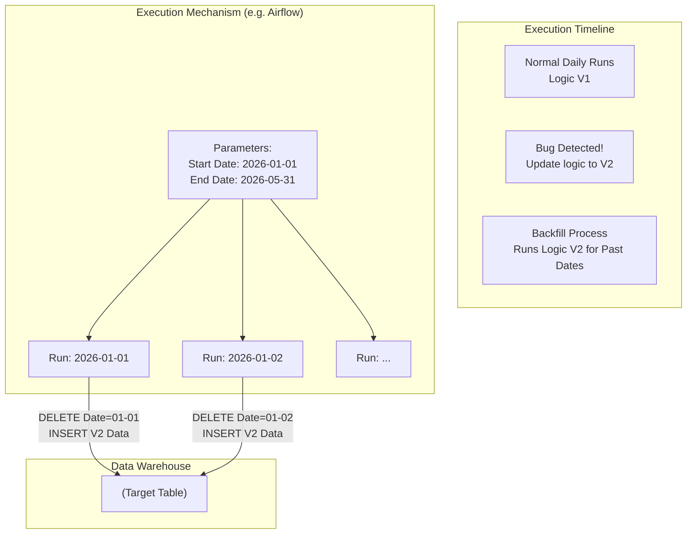

Trong trạng thái vận hành bình thường, một đường ống dẫn dữ liệu ([Data Pipeline](/concepts/1-foundations/foundation/data-pipeline/)) hoạt động giống như một dòng sông chảy xuôi theo thời gian. Mỗi ngày, đến giờ hẹn, hệ thống sẽ tự động thức dậy, thu thập dữ liệu phát sinh của ngày hôm đó, biến đổi và nạp vào kho lưu trữ (Incremental Run). 

Thế nhưng, cuộc sống không phải lúc nào cũng êm đềm như vậy. Sẽ có những ngày đường ống bị lỗi kết nối, code tính toán cũ bị phát hiện có lỗi sai từ vài tháng trước hoặc doanh nghiệp yêu cầu thêm một chỉ số phân tích mới áp dụng cho toàn bộ lịch sử 3 năm qua.

Để xử lý những tình huống này, chúng ta cần đến một kỹ thuật cực kỳ quan trọng trong [Data Engineering](/concepts/1-foundations/foundation/data-engineering/): **Backfill (Chạy bù dữ liệu lịch sử)**. Đây là hành động "quay ngược thời gian" của hệ thống [ETL](/concepts/3-integration/etl-elt/etl/)/ELT, buộc các tiến trình phải tính toán lại dữ liệu của các ngày hoặc các tháng đã trôi qua trong quá khứ nhằm lấp đầy các khoảng trống và sửa đổi dữ liệu cho đúng chuẩn.

## Tại sao chúng ta bắt buộc phải chạy lại dữ liệu quá khứ?

Dù hệ thống dữ liệu của bạn có được thiết kế hoàn hảo đến đâu, việc phải chạy Backfill vẫn là một phần tất yếu trong vòng đời phát triển vì ba nguyên nhân phổ biến sau:

1. **Khắc phục sự cố mất kết nối hoặc sập nguồn (System Outage):** Cuối tuần qua, hệ thống mạng của bên đối tác bị sập, khiến đường ống dữ liệu của bạn không thể cào thông tin giao dịch về trong hai ngày Thứ Bảy và Chủ Nhật. Sáng Thứ Hai đi làm, việc đầu tiên bạn cần làm là chạy "backfill" bù cho hai ngày cuối tuần đó để các bảng báo cáo (Dashboard) không bị trống số liệu.
2. **Sửa lỗi công thức tính toán cũ (Bug Fixes):** Bạn phát hiện ra công thức tính phần trăm hoa hồng trong code cũ bị sai lệch 0.5% suốt 6 tháng qua. Bạn đã sửa lại code cho đúng kể từ ngày hôm nay, nhưng Ban giám đốc yêu cầu toàn bộ dữ liệu báo cáo doanh thu của nửa năm qua cũng phải được tính toán lại cho đúng chuẩn thực tế.
3. **Triển khai tính năng hoặc nguồn dữ liệu mới (New Features):** Doanh nghiệp quyết định áp dụng một cột phân loại khách hàng VIP mới. Bạn viết thêm logic xử lý để tạo cột `is_vip`. Để có dữ liệu phân tích xu hướng dài hạn, bạn buộc phải chạy Backfill để tạo cột này cho toàn bộ dữ liệu lịch sử khách hàng đã đăng ký từ nhiều năm trước.

## Triết lý cốt lõi: Tính lũy đẳng (Idempotency) và Tham số hóa

Chìa khóa vàng giúp bạn thực hiện Backfill một cách dễ dàng và an toàn tuyệt đối là **Tính lũy đẳng ([Idempotency](/concepts/3-integration/etl-elt/idempotency/))**.

> [!IMPORTANT]  
> Một đường ống dữ liệu được coi là lũy đẳng nếu việc bạn chạy nó 1 lần hay chạy lại 100 lần cho cùng một ngày (ví dụ: ngày 01/01/2026) thì kết quả cuối cùng ghi nhận trên [Data Warehouse](/concepts/2-storage/data-warehouse/data-warehouse/) vẫn luôn giống hệt nhau, hoàn toàn không bị nhân đôi số liệu hay sinh ra các bản ghi rác.

Để đạt được tính lũy đẳng, các script SQL hoặc code ETL của bạn phải tuyệt đối tránh việc sử dụng các hàm thời gian động của hệ thống như `CURRENT_DATE()` hay `NOW()`. Thay vào đó, mọi câu lệnh lọc dữ liệu phải được **tham số hóa (Parameterization)** để nhận ngày xử lý từ bên ngoài truyền vào:

* **Viết sai (Không thể Backfill):**  
  `SELECT * FROM sales WHERE order_date = CURRENT_DATE()`  
  *(Khi bạn chạy lại câu lệnh này vào ngày mai, nó sẽ chỉ lấy dữ liệu của ngày mai chứ không thể lấy dữ liệu quá khứ).*
* **Viết đúng (Hỗ trợ Backfill):**  
  `SELECT * FROM sales WHERE order_date = '{{ ds }}'`  
  *(Khi cần chạy bù cho ngày 01/01, hệ thống điều phối sẽ tự động thay thế `{{ ds }}` bằng `'2026-01-01'`).*

## Quy trình thực hiện Backfill diễn ra như thế nào?

Hãy cùng xem các bước thực thi một chiến dịch Backfill dữ liệu trong thực tế sử dụng công cụ điều phối [Apache Airflow](/concepts/3-integration/orchestration/apache-airflow/):

1. **Xác định phạm vi:** Kỹ sư dữ liệu xác định cần chạy lại toàn bộ dữ liệu lịch sử trong tháng 5 (từ ngày `2026-05-01` đến `2026-05-31`).
2. **Đánh giá tác động:** Kiểm tra bản đồ Lineage để đảm bảo việc ghi đè (Overwrite) lại dữ liệu tháng 5 sẽ không làm gián đoạn hoặc sai lệch số liệu của các bảng dữ liệu liên quan ở hạ nguồn (Downstream).
3. **Kích hoạt lệnh:** Kỹ sư chạy câu lệnh Backfill chuyên dụng từ dòng lệnh terminal:  
   `airflow dags backfill my_daily_etl_job -s 2026-05-01 -e 2026-05-31`
4. **Thực thi song song:** Airflow sẽ tự động chia nhỏ khoảng thời gian 31 ngày thành các lượt chạy nhỏ độc lập, truyền tham số ngày tương ứng và thực thi song song (ví dụ chạy 5 ngày cùng lúc) để rút ngắn tối đa thời gian xử lý. Với mỗi ngày, hệ thống sẽ thực hiện xóa dữ liệu cũ và chèn dữ liệu mới được tính toán theo logic mới.
5. **Hoàn tất:** Sau khi hoàn thành, toàn bộ bảng dữ liệu lịch sử đã được cập nhật sạch sẽ và các Dashboard BI tự động hiển thị số liệu mới nhất.

## Sơ đồ kiến trúc và luồng xử lý Backfill

Sơ đồ dưới đây minh họa cơ chế hoạt động của quá trình Backfill: hệ thống điều phối chia nhỏ khoảng thời gian quá khứ cần xử lý và thực hiện ghi đè dữ liệu lũy đẳng vào Data Warehouse:


## Thực hành thực tế: Chạy Backfill / Full Refresh với dbt

Nếu bạn sử dụng công cụ biến đổi dữ liệu **[dbt](/concepts/3-integration/transformation-analytics/dbt/)** (data build tool), việc thực hiện Backfill cho toàn bộ lịch sử cực kỳ đơn giản nhờ tính năng `Full Refresh`.

Khi bạn thay đổi một logic tính toán hoặc thêm một cột mới vào model (ví dụ: `fact_orders`) và muốn áp dụng cho toàn bộ dữ liệu từ trước tới nay, bạn chỉ cần chạy duy nhất dòng lệnh sau:
```bash
# Chạy dbt kèm theo cờ full-refresh để xây dựng lại toàn bộ bảng
dbt run --select fact_orders --full-refresh
```

Dưới nền, dbt sẽ tự động chuyển hóa câu lệnh và gửi xuống Data Warehouse (như BigQuery hay [Snowflake](/concepts/2-storage/cloud-data-platform/snowflake/)) hai bước truy vấn:
1. `DROP TABLE fact_orders` (Xóa bỏ hoàn toàn bảng dữ liệu cũ).
2. `CREATE TABLE fact_orders AS SELECT ... (logic mới) FROM raw_data` (Quét lại toàn bộ dữ liệu thô lịch sử để dựng lại bảng mới).

## Những "bí kíp" giúp Backfill an toàn và tiết kiệm

* **Bảo vệ tuyệt đối dữ liệu thô (Raw Data):** Nguyên tắc vàng trong Data Engineering: bạn chỉ có thể Backfill thành công nếu bạn còn giữ nguyên vẹn dữ liệu thô ban đầu. Nếu luồng Ingestion của bạn có thói quen cập nhật/ghi đè trực tiếp dữ liệu thô ngay khi nạp vào hồ, bạn sẽ vĩnh viễn mất khả năng chạy lại lịch sử khi code gặp lỗi. Hãy luôn thiết kế tầng lưu trữ thô ([Data Lake](/concepts/2-storage/data-lake-lakehouse/data-lake/)) ở dạng chỉ ghi thêm (Append-only).
* **Thiết lập phân vùng ([Partitioning](/concepts/2-storage/database-storage/partitioning/)) chặt chẽ:** Việc chạy Full-refresh xây dựng lại một bảng dữ liệu 100 tỷ dòng có thể tiêu tốn hàng ngàn USD chi phí tính toán đám mây. Nếu bảng dữ liệu được phân vùng tốt theo ngày (`event_date`), bạn có thể cấu hình Backfill chỉ ghi đè đúng những phân vùng (ngày) bị lỗi, bỏ qua toàn bộ phần dữ liệu chính xác còn lại để tiết kiệm chi phí.

## Những sai lầm kinh điển dễ gây thảm họa

* **Lặng lẽ Backfill không thông báo cho các bên liên quan:** Bạn phát hiện ra lỗi tính toán của 3 tháng trước và âm thầm chạy Backfill để sửa lại số liệu trên Data Warehouse cho đúng. Tuy nhiên, bộ phận Kế toán và Tài chính của công ty đã dùng số liệu cũ của 3 tháng trước để làm báo cáo tài chính chốt sổ gửi cho các nhà đầu tư. Việc số liệu lịch sử bị thay đổi đột ngột mà không có sự đồng bộ trước sẽ gây ra thảm họa mất niềm tin nghiêm trọng vào chất lượng dữ liệu của bạn.
* **Hệ thống nguồn không lưu trữ lịch sử trạng thái:** Giả sử bạn muốn chạy Backfill để lấy lại trạng thái đơn hàng của tháng trước từ API của một hệ thống CRM. Tuy nhiên, API của họ được thiết kế chỉ trả về trạng thái hiện tại (ví dụ: đã hoàn thành) chứ không lưu trữ lịch sử chuyển đổi trạng thái. Lúc này, việc Backfill lịch sử là hoàn toàn bất khả thi.

## Điểm mạnh và điểm yếu

### Điểm mạnh
* Khả năng sửa chữa hoàn toàn mọi sai sót về logic tính toán và sự cố hạ tầng trong quá khứ.
* Mang lại sự linh hoạt tuyệt vời cho hệ thống phân tích: bạn có quyền sai lầm trong thiết kế hôm nay, và ngày mai bạn có thể viết lại code để sửa đổi toàn bộ lịch sử một cách nhất quán.

### Điểm yếu
* **Rủi ro quá tải hệ thống:** Việc chạy lại đồng loạt nhiều tác vụ quá khứ song song (Massive Parallelism) sẽ tiêu tốn 100% tài nguyên CPU/RAM của cụm Data Warehouse, có thể khóa bảng (table lock) và làm gián đoạn các truy vấn báo cáo hiện hành của người dùng.
* **Cực kỳ phức tạp đối với môi trường Streaming:** Việc Backfill trên các luồng dữ liệu thời gian thực (như Apache Flink, Kafka) phức tạp hơn rất nhiều so với chạy batch truyền thống do phải xử lý các khái niệm đặc thù như Watermarks, Event-time và Processing-time.

## Khi nào nên dùng

* Hệ thống mạng hoặc máy chủ gặp sự cố làm đứt gãy luồng kéo dữ liệu hàng ngày.
* Doanh nghiệp thêm mới các chỉ số phân tích quan trọng và có nhu cầu phân tích xu hướng lịch sử dài hạn (Trend Analysis).
* Sửa đổi các lỗi logic nghiệp vụ đã chạy sai trong một khoảng thời gian dài.

## Các khái niệm liên quan

* [Incremental Load](/concepts/3-integration/etl-elt/incremental-load/)
* [Data Transformation](/concepts/3-integration/etl-elt/data-transformation/)
* [ELT](/concepts/3-integration/etl-elt/elt/)

## Trọng tâm ôn luyện phỏng vấn

### 1. Ý nghĩa của "Tính lũy đẳng (Idempotency)" trong thiết kế Data Pipeline là gì? Tại sao nó lại là điều kiện tiên quyết để chạy Backfill an toàn?
* **Gợi ý trả lời:** Idempotency (Lũy đẳng) là tính chất đảm bảo một tác vụ dù được thực thi 1 lần hay nhiều lần với cùng một tham số đầu vào thì kết quả cuối cùng nhận được vẫn không bao giờ thay đổi. Nếu một Data Pipeline không có tính lũy đẳng (ví dụ: code chỉ viết lệnh `INSERT` đơn thuần mà không có cơ chế `DELETE` dữ liệu cũ trước), khi ta chạy lại hoặc chạy Backfill cho một ngày cụ thể, dữ liệu ngày đó sẽ bị chèn lặp lại nhiều lần, gây sai lệch nghiêm trọng cho các báo cáo phân tích. Thiết kế lũy đẳng giúp kỹ sư dữ liệu tự tin bấm nút chạy lại lịch sử mà không sợ làm hư hỏng dữ liệu.

### 2. Khi cần Backfill một bảng Fact khổng lồ dung lượng 5 Terabyte trên Data Warehouse, nếu chạy DROP TABLE và tạo lại bảng sẽ gây mất kết nối (Downtime) cho hệ thống báo cáo BI. Bạn sẽ giải quyết bài toán này như thế nào?
* **Gợi ý trả lời:** Để tránh Downtime, chúng ta sử dụng kỹ thuật hoán đổi bảng (Blue-Green Deployment / Table Swap):
  1. Tạo một bảng tạm ẩn độc lập (ví dụ: `fact_orders_temp`).
  2. Thực hiện chạy Backfill, tính toán toàn bộ logic mới và ghi 5 Terabyte dữ liệu vào bảng tạm ẩn đó. Trong suốt quá trình này (có thể mất vài tiếng), bảng Production cũ vẫn hoạt động bình thường để phục vụ người dùng.
  3. Sau khi kiểm tra dữ liệu trên bảng tạm ẩn đạt yêu cầu, chạy một câu lệnh thay đổi metadata cực nhanh để đổi tên bảng (Rename/Swap) hoặc trỏ View chính từ bảng cũ sang bảng tạm ẩn. Thao tác này diễn ra chỉ trong vòng 0.1 giây, giúp cập nhật dữ liệu lịch sử mới ngay lập tức mà hoàn toàn không gây ra bất kỳ giây Downtime nào cho hệ thống.
  4. Cuối cùng, thực hiện xóa bỏ (Drop) bảng cũ để giải phóng không gian lưu trữ.

## Xem thêm các khái niệm liên quan
* [Thu thập dữ liệu thay đổi - Change Data Capture (CDC)](/concepts/3-integration/etl-elt/change-data-capture/)
* [Data Extraction](/concepts/3-integration/etl-elt/data-extraction/)
* [Data Ingestion](/concepts/3-integration/etl-elt/data-ingestion/)

## Tài liệu tham khảo

1. [Apache Airflow: Catchup and Backfill](https://airflow.apache.org/docs/apache-airflow/stable/core-concepts/dag-run.html#catchup) - Official guide on managing execution runs, backfilling, and scheduler catchup.
2. [Google Cloud: Orchestrating Backfills with Cloud Composer](https://cloud.google.com/composer/docs/composer-2/backfill-dag-runs) - Google Cloud documentation on executing backfill operations using Composer.
3. [AWS Blog: Backfilling Data from Amazon S3 to Snowflake](https://aws.amazon.com/blogs/apn/backfilling-data-from-amazon-s3-to-snowflake/) - AWS APN blog post illustrating patterns for historical data backfills.
4. [dbt Documentation: Incremental Models and Full-Refresh](https://docs.getdbt.com/docs/build/incremental-models) - Official dbt guide explaining how to handle backfills using the `--full-refresh` flag.
5. [Monte Carlo: How to Backfill Data Pipelines](https://www.getmontecarlo.com/blog/the-data-engineers-guide-to-backfilling-data/) - Best practices and patterns for safely backfilling data warehouses without causing downtime.


## English Summary

Backfilling is the process of executing a data pipeline for historical dates rather than the current or next expected interval. It involves re-running extraction, transformation, and loading logic over past data periods. Data engineering teams rely on backfilling to recover from system outages, retroactively apply bug fixes to calculations, or back-propagate new business rules (like a newly created dimension column) to the entire dataset. A successful backfilling architecture heavily depends on maintaining immutable raw data and designing pipeline jobs to be idempotent—ensuring that running a job multiple times for the same historical window yields identical, safe, and correct results in the Data Warehouse.