Hãy tưởng tượng bạn đang chạy một chiến dịch gửi mã giảm giá tri ân khách hàng thân thiết. Do một lỗi kỹ thuật nào đó, thông tin của khách hàng tên Bob bị trùng lặp thành 5 dòng trong cơ sở dữ liệu. Kết quả là Bob nhận được 5 email chứa 5 mã giảm giá khác nhau, còn báo cáo gửi sếp thì ghi nhận số lượng khách hàng hoạt động tăng vọt gấp nhiều lần thực tế.

Trong ngành kỹ thuật dữ liệu, hiện tượng này được gọi là dữ liệu bị trùng lặp (Duplicate Data). Để bảo vệ hệ thống báo cáo khỏi những số liệu ảo này, chúng ta cần áp dụng **Deduplication (Khử trùng lặp dữ liệu)**.


## Deduplication là gì?

**Deduplication (Khử trùng lặp)** là quá trình nhận diện và loại bỏ các bản ghi trùng lặp trong một tập dữ liệu. Mục tiêu cuối cùng là đảm bảo tính duy nhất (Uniqueness) của các thực thể ở một mức độ chi tiết (Granularity) nhất định.

Khi phát hiện nhiều dòng dữ liệu mô tả cùng một sự kiện hoặc đối tượng, quy trình khử trùng lặp sẽ tìm cách chọn ra duy nhất một bản ghi "chuẩn vàng" (Golden Record) đại diện tốt nhất và loại bỏ hoặc bỏ qua tất cả các dòng còn lại.

## Tại sao "rác" trùng lặp lại xuất hiện trong hệ thống của bạn?

Dữ liệu bị trùng lặp không tự nhiên sinh ra, nó thường là kết quả của các lỗi hệ thống hoặc đặc thù kiến trúc:

1. **Lỗi từ phía ứng dụng nguồn (Application Errors)**: Người dùng nhấn nút mua hàng hoặc nút đăng ký liên tiếp hai lần do mạng lag. Hoặc ứng dụng di động tự động thử lại (Retry) việc gọi API khi gặp sự cố timeout, vô tình tạo ra nhiều bản ghi giống hệt nhau trên server.
2. **Cơ chế truyền tin của Ingestion (Message Queues)**: Các hệ thống phân phối tin nhắn lớn như [Apache Kafka](/concepts/4-realtime/streaming-processing/apache-kafka/) hay Google Pub/Sub thường sử dụng cơ chế phân phối **At-least-once** (đảm bảo tin nhắn được gửi đi ít nhất một lần). Điều này có nghĩa là việc một tin nhắn bị gửi lặp lại 2-3 lần trong điều kiện mạng chập chờn là hành vi bình thường của hệ thống.
3. **Lỗi thiết kế pipeline (Non-idempotent Pipelines)**: Đường ống dẫn dữ liệu bị lỗi giữa chừng và khi chạy lại, do thiết kế không tuân thủ tính lũy đẳng ([Idempotency](/concepts/3-integration/etl-elt/idempotency/)), hệ thống tiếp tục ghi đè/nạp thêm (Append) đè lên tập dữ liệu cũ đã nạp trước đó.

## 3 Con đường khử trùng lặp dữ liệu

Tùy vào công cụ và cấu trúc dữ liệu, các kỹ sư dữ liệu thường sử dụng 3 kỹ thuật SQL cơ bản để làm sạch trùng lặp:

```mermaid
flowchart TD
    A[Dữ liệu thô trùng lặp] --> B{Phương pháp Deduplication}
    B --> C[1. DISTINCT<br/>Loại bỏ giống 100%]
    B --> D[2. GROUP BY<br/>Dùng Aggregation MAX/MIN]
    B --> E[3. Window Functions<br/>Chia nhóm & Gán số thứ tự]
    E -. "Cách tối ưu nhất" .-> F[ROW_NUMBER = 1<br/>Giữ dòng mới nhất]
```


1. **Sử dụng toán tử `DISTINCT`**: Đây là cách đơn giản nhất. Nó quét qua toàn bộ các dòng và loại bỏ những dòng giống nhau 100% trên tất cả các cột. Tuy nhiên, cách này cực kỳ kém linh hoạt vì chỉ cần một cột (như timestamp) lệch nhau 1 mili-giây, `DISTINCT` sẽ không nhận diện được trùng lặp.
2. **Sử dụng gom nhóm `GROUP BY`**: Nhóm dữ liệu theo các cột khóa chính (Key) và sử dụng các hàm gom nhóm như `MAX(updated_at)` hay `MIN(created_at)` để chọn ra dòng mong muốn.
3. **Sử dụng hàm cửa sổ (Window Functions)**: Đây là phương thức chuẩn mực và mạnh mẽ nhất. Chúng ta sử dụng hàm `ROW_NUMBER()` để phân mảnh dữ liệu theo khóa (`PARTITION BY`) và sắp xếp theo tiêu chí ưu tiên (`ORDER BY updated_at DESC`), sau đó chỉ lấy những dòng có số thứ tự bằng `1`.

---

## Ví dụ thực tế: Chọn bản ghi "chuẩn vàng" bằng SQL

Xét một bảng dữ liệu người dùng (`users`) ở vùng Staging đang bị trùng lặp thông tin của Bob như sau:

| user_id | email            | status   | updated_at          |
|---------|------------------|----------|---------------------|
| 1       | bob@gmail.com    | pending  | 2026-06-07 10:00:00 |
| 1       | bob@gmail.com    | active   | 2026-06-07 10:05:00 |
| 2       | alice@gmail.com  | active   | 2026-06-07 09:00:00 |

Mục tiêu của chúng ta là lọc bỏ dòng trạng thái cũ (`pending`) của Bob và giữ lại dòng trạng thái mới nhất (`active`) dựa trên mốc thời gian `updated_at`.

### Câu lệnh SQL sử dụng hàm cửa sổ `ROW_NUMBER()`

```sql
WITH ranked_users AS (
    SELECT 
        user_id,
        email,
        status,
        updated_at,
        ROW_NUMBER() OVER (
            PARTITION BY user_id 
            ORDER BY updated_at DESC
        ) AS rn
    FROM staging_users
)
SELECT 
    user_id,
    email,
    status,
    updated_at
FROM ranked_users
WHERE rn = 1;
```

Sau khi thực thi, kết quả trả về sẽ chỉ còn duy nhất 2 dòng: Bản ghi của Bob lúc `10:05:00` (trạng thái active) và bản ghi của Alice. Dòng dữ liệu cũ của Bob đã được loại bỏ hoàn hảo.

---

## Điểm mạnh và điểm yếu

### Điểm mạnh
* Đảm bảo tính duy nhất và chính xác của dữ liệu, loại bỏ hiện tượng trùng lặp số liệu báo cáo.
* Tối ưu hóa không gian lưu trữ và tài nguyên tính toán cho các tác vụ phân tích hạ nguồn.

### Điểm yếu
* Việc thực hiện sắp xếp và chia nhóm trên tập dữ liệu lớn cực kỳ ngốn tài nguyên (Shuffle I/O).
* Tăng thời gian chạy và độ trễ cho pipeline xử lý dữ liệu.

## Khi nào nên dùng

* Nên dùng trong mọi pipeline tích hợp dữ liệu từ các hệ thống At-least-once (như Kafka, RabbitMQ) hoặc khi hệ thống nguồn cho phép người dùng nhập trùng.
* Thực hiện khử trùng lặp ở tầng Staging hoặc Landing Zone trước khi nạp dữ liệu vào kho lưu trữ chính.

## Trọng tâm ôn luyện phỏng vấn

### 1. Phân biệt `RANK()`, `DENSE_RANK()`, và `ROW_NUMBER()` trong việc loại bỏ trùng lặp?
* **Gợi ý trả lời**:
  * **`ROW_NUMBER()`**: Luôn gán một số thứ tự duy nhất và tăng dần (1, 2, 3...) cho từng dòng trong nhóm, kể cả khi các dòng đó có giá trị sắp xếp giống hệt nhau. Đây là hàm an toàn nhất và được sử dụng nhiều nhất để khử trùng lặp (lọc lấy dòng có `rn = 1`).
  * **`RANK()`**: Sẽ gán cùng một số thứ tự cho các dòng đồng hạng, nhưng sẽ nhảy số ở dòng tiếp theo (ví dụ: 1, 1, 3). Nếu dùng hàm này để khử trùng lặp, bạn có nguy cơ lấy ra nhiều hơn 1 bản ghi nếu chúng trùng mốc thời gian sắp xếp.
  * **`DENSE_RANK()`**: Tương tự như `RANK()`, gán cùng số thứ tự cho các dòng đồng hạng nhưng không nhảy số (ví dụ: 1, 1, 2). Hàm này cũng gặp rủi ro tương tự như `RANK()` khi dùng để khử trùng lặp.

### 2. Làm thế nào để xử lý trùng lặp trong luồng dữ liệu thời gian thực (Streaming) với hàng triệu sự kiện mỗi giây?
* **Gợi ý trả lời**: Trong hệ thống thời gian thực (Streaming), chúng ta không thể dùng các câu lệnh `GROUP BY` hay Window Functions trên toàn bộ bảng vì dữ liệu chưa kết thúc. Thay vào đó, chúng ta phải sử dụng một bộ lưu trữ trạng thái (State Store - ví dụ như RocksDB trong Apache Flink hoặc Spark Structured Streaming) kết hợp với cơ chế **Watermark** (cửa sổ thời gian). Hệ thống sẽ chỉ lưu lại các khóa duy nhất (Unique Keys) trong bộ nhớ trong một khoảng thời gian giới hạn (ví dụ 10 phút) để đối chiếu chéo. Nếu một sự kiện trùng lặp rơi vào đúng cửa sổ 10 phút đó, nó sẽ bị loại bỏ. Sau khi cửa sổ đóng lại, trạng thái cũ trong bộ nhớ sẽ được giải phóng để tiết kiệm RAM.

## Xem thêm các khái niệm liên quan
* [Backfill](/concepts/3-integration/etl-elt/backfill/)
* [Thu thập dữ liệu thay đổi - Change Data Capture (CDC)](/concepts/3-integration/etl-elt/change-data-capture/)
* [Data Extraction](/concepts/3-integration/etl-elt/data-extraction/)

## Tài liệu tham khảo

1. [Google Cloud: Deduplicating Data in BigQuery](https://cloud.google.com/bigquery/docs/deduplicate-data) - Official GCP guide on deduplication methods.
2. [AWS Blog: How to Deduplicate Data on Amazon S3](https://aws.amazon.com/blogs/big-data/how-to-deduplicate-data-on-amazon-s3-using-aws-glue-and-delta-lake/) - AWS post explaining S3/Delta Lake deduplication pipelines.
3. [Databricks Delta Lake: Merge and Deduplication](https://docs.databricks.com/en/delta/merge.html) - Databricks best practices for loading and deduplicating records.
4. [Confluent: Event Deduplication Patterns in Kafka](https://www.confluent.io/blog/event-deduplication-patterns-in-kafka-streams/) - Real-time stream deduplication architectures.
5. [Apache Spark Docs: PySpark dropDuplicates](https://spark.apache.org/docs/latest/api/python/reference/pyspark.sql/api/pyspark.sql.DataFrame.dropDuplicates.html) - Official Apache Spark reference for dropDuplicates function.
6. [Designing Data-Intensive Applications](https://www.oreilly.com/library/view/designing-data-intensive-applications/9781491903063/) - Book by Martin Kleppmann explaining at-least-once message delivery.

## English Summary

**Deduplication** is the process of identifying and removing duplicate records in a dataset to ensure uniqueness. It is highly critical for maintaining [data quality](/concepts/5-quality-governance/data-quality/data-quality/), avoiding issues like double-counting in analytical reports. Often required due to "at-least-once" delivery semantics from upstream [source systems](/concepts/1-foundations/foundation/source-systems/), deduplication is typically implemented via SQL window functions (`ROW_NUMBER()`) prioritizing the most recent record. While it ensures accuracy, it introduces computational overhead associated with sorting and shuffling large volumes of data.