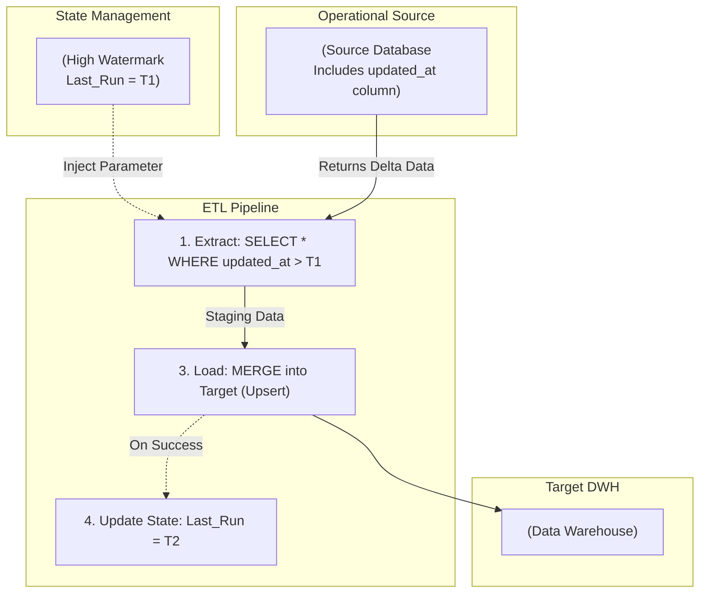

Khi bắt đầu xây dựng một kho dữ liệu ([Data Warehouse](/concepts/2-storage/data-warehouse/data-warehouse/)), phương pháp đơn giản nhất mà ai cũng nghĩ tới là mỗi ngày quét toàn bộ dữ liệu từ hệ thống nguồn rồi ghi đè lên hệ thống đích (Full Load). Tuy nhiên, khi doanh nghiệp phát triển và lượng dữ liệu phình to lên cấp độ hàng trăm Gigabytes hay Terabytes, cách tiếp cận ngây thơ này sẽ sớm bóp nghẹt hệ thống của bạn. Đây chính là lúc bạn cần chuyển đổi sang một chiến lược thông minh và tối ưu hơn: **Incremental Load** (Nạp gia tăng).


## Chỉ kéo và xử lý phần thay đổi

Incremental Load (Nạp dữ liệu gia tăng) là một cơ chế trích xuất và nạp dữ liệu trong quy trình [ETL](/concepts/3-integration/etl-elt/etl/)/ELT. Thay vì tải lại toàn bộ kho dữ liệu khổng lồ từ thuở sơ khai, hệ thống chỉ chủ động kéo về phần dữ liệu "Delta" — tức là những bản ghi mới được tạo hoặc vừa bị chỉnh sửa trạng thái kể từ lần chạy thành công gần nhất của đường ống dữ liệu ([Data Pipeline](/concepts/1-foundations/foundation/data-pipeline/)).

Để nhận diện được phần Delta này, luồng Ingestion (thu thập dữ liệu) cần được thiết kế dựa trên hai cột mốc quan trọng:
1. **Cột theo dõi thời gian (Tracking Column) ở hệ thống nguồn**: Có thể là cột `created_at`, `updated_at` hoặc một chuỗi số ID tăng dần (`auto_increment_id`). Cột này giúp hệ thống xác định dòng dữ liệu nào vừa xuất hiện hoặc vừa thay đổi.
2. **Khóa chính (Primary Key) ở hệ thống đích**: Đóng vai trò là mốc đối chiếu giúp hệ thống phân biệt bản ghi nào cần được thêm mới hoàn toàn (`INSERT`) và bản ghi nào cần được cập nhật trạng thái mới (`UPDATE` đè lên bản ghi cũ).

## Tại sao chúng ta không thể mãi dùng Full Load?

Hãy hình dung một bảng ghi nhận lịch sử giao dịch của một ngân hàng lớn có dung lượng khoảng 2 Terabytes (tương đương 5 tỷ dòng). Trung bình mỗi ngày hệ thống chỉ phát sinh thêm khoảng 1 triệu giao dịch mới (chỉ nặng khoảng 50 Megabytes).

* Nếu áp dụng **Full Load**: Mỗi ngày, hệ thống ETL của bạn bắt buộc phải đọc và truyền tải toàn bộ 2 Terabytes dữ liệu qua đường truyền mạng chỉ để cập nhật thêm 50 Megabytes dữ liệu mới. Quá trình này sẽ ngốn băng thông mạng khủng khiếp, mất hàng chục giờ để hoàn thành, và có nguy cơ cao làm sập cơ sở dữ liệu vận hành (Production DB) của doanh nghiệp.
* Nếu áp dụng **Incremental Load**: Đường ống dữ liệu chỉ gửi một yêu cầu truy vấn nhỏ để lấy đúng 50 Megabytes dữ liệu phát sinh trong ngày hôm nay. Thời gian xử lý lập tức được rút ngắn từ 10 tiếng xuống còn vỏn vẹn 2 phút.

Incremental Load ra đời như một vị cứu tinh giúp kho dữ liệu của doanh nghiệp luôn duy trì tốc độ cập nhật nhanh chóng mà không làm phình to hóa đơn chi phí tính toán đám mây.

## Dấu mực nước: Khái niệm then chốt High Watermark

Ý tưởng cốt lõi giúp Incremental Load vận hành trơn tru nằm ở khái niệm **High [Watermark](/concepts/4-realtime/streaming-processing/watermark/) (Dấu mực nước cao nhất)**.

Hãy tưởng tượng bạn đang đọc một cuốn sách dày 1,000 trang. Thay vì mỗi ngày mở sách ra đọc lại từ trang 1, bạn dùng một chiếc kẹp sách (Bookmark) để đánh dấu trang 100 mà bạn vừa đọc xong. Ngày hôm sau, bạn chỉ việc mở đúng trang 101 để đọc tiếp.

Trong kỹ thuật dữ liệu, High Watermark chính là chiếc kẹp sách đó:
1. Hệ thống ETL duy trì một bảng quản lý trạng thái (State Storage). Bảng này ghi nhận: *"Lần chạy gần nhất cho bảng X hoàn thành lúc `2026-06-05 23:59:59`"*. Dấu mốc thời gian này chính là High Watermark.
2. Ở lần chạy tiếp theo, hệ thống ETL sẽ tự động gửi câu lệnh truy vấn kèm bộ lọc:
   ```sql
   SELECT * FROM table_X WHERE updated_at > '2026-06-05 23:59:59';
   ```
3. Sau khi xử lý và ghi dữ liệu thành công, hệ thống tiến hành cập nhật High Watermark mới (ví dụ: `2026-06-06 23:59:59`) để chuẩn bị cho chu kỳ tiếp theo.

## Quy trình vận hành của Incremental Load

Dưới đây là sơ đồ kiến trúc minh họa một chu trình nạp dữ liệu gia tăng sử dụng mô hình Upsert (Merge) phổ biến:


1. **Extract (Trích xuất theo Watermark)**: Lấy giá trị kẹp sách cuối cùng (T1) để truy vấn Database nguồn. Hệ thống bốc ra phần Delta dữ liệu (ví dụ 100 dòng mới tạo và 20 dòng cũ vừa được chỉnh sửa trạng thái).
2. **Transform (Biến đổi)**: Tiến hành làm sạch và chuẩn hóa 120 dòng dữ liệu Delta này tại vùng đệm Staging.
3. **Load (Nạp dữ liệu dạng Upsert)**: Thực hiện lệnh so sánh 120 dòng Staging với bảng dữ liệu chính trên Data Warehouse dựa trên Khóa chính:
   * Đối với 100 dòng mới tinh (ID chưa từng xuất hiện) -> thực hiện `INSERT`.
   * Đối với 20 dòng đã có sẵn nhưng bị thay đổi -> thực hiện `UPDATE` đè lên bản ghi cũ để cập nhật trạng thái mới nhất.
4. **Cập nhật State**: Sau khi nạp thành công, ghi nhận mốc thời gian mới (T2) vào kho lưu trữ Watermark.

## Thực chiến: Triển khai Incremental Model với dbt

Công cụ [dbt](/concepts/3-integration/transformation-analytics/dbt/) (Data Build Tool) cung cấp giải pháp thiết lập Incremental Load cực kỳ thanh lịch thông qua mã SQL kết hợp với Jinja template.

Dưới đây là ví dụ cấu hình cho file `daily_sales.sql`:
```sql
-- Khai báo cho dbt biết đây là model Incremental, và khóa chính là order_id
{{ config(
    materialized='incremental',
    unique_key='order_id'
) }}

SELECT 
    order_id,
    customer_id,
    amount,
    status,
    updated_at
FROM raw_orders

-- Khối lệnh này CHỈ CHẠY ở những lần chạy sau (không chạy lần đầu tạo bảng)

  -- Filter chỉ lấy những dòng có updated_at LỚN HƠN thời gian max của bảng đích
  WHERE updated_at > (SELECT MAX(updated_at) FROM {{ this }})

```

Khi chạy lệnh, dbt sẽ tự động biên dịch đoạn code trên thành một câu lệnh `MERGE` (Upsert) phức tạp và xử lý việc so sánh Watermark hoàn toàn tự động.

## Những quy tắc "vàng" chống mất mát dữ liệu

* **Thiết lập Cửa sổ lùi thời gian (Look-back Window)**: Trong môi trường thực tế, các Database nguồn có thể gặp độ trễ khi commit giao dịch (ví dụ: giao dịch A bắt đầu lúc 10:00 nhưng đến 10:02 mới ghi xong đĩa; trong khi giao dịch B bắt đầu lúc 10:01 và ghi xong ngay lập tức). Nếu Watermark lấy mốc 10:01, bạn sẽ bỏ sót hoàn toàn giao dịch A ở chu kỳ sau. Hãy luôn cấu hình quét lùi lại quá khứ một khoảng ngắn: `WHERE updated_at >= (watermark - interval '1 hour')` để đảm bảo không bỏ sót dữ liệu. Việc quét trùng một chút dữ liệu cũ sẽ được xử lý an toàn bởi cơ chế Upsert mà không gây trùng lặp.
* **Đánh chỉ mục (Index) cho cột thời gian**: Đảm bảo các cột `updated_at` hoặc `created_at` ở cơ sở dữ liệu nguồn được đánh chỉ mục. Nếu không, mỗi câu lệnh truy vấn lọc theo Watermark sẽ ép DB nguồn phải quét toàn bộ bảng (Full Table Scan), gây nghẽn hệ thống không khác gì Full Load.
* **Xử lý các trường hợp xóa vật lý (Hard Deletes)**: Cơ chế lọc theo cột `updated_at` hoàn toàn bất lực trước các bản ghi bị xóa vật lý (xóa bay khỏi ổ cứng ở hệ thống nguồn). Hãy yêu cầu đội ngũ phát triển ứng dụng sử dụng phương pháp xóa mềm (Soft Delete - đánh dấu cột `is_deleted = true` thay vì DELETE dòng). Khi đó cột `updated_at` sẽ thay đổi và hệ thống ETL có thể nhận diện để đồng bộ.

## Những sai lầm kinh điển cần né tránh

* **Sử dụng ID tự tăng làm Watermark**: Một số kỹ sư thiết lập lọc theo kiểu `WHERE id > last_id`. Cơ chế này hoạt động rất tốt đối với các bản ghi được thêm mới (`INSERT`), nhưng nó sẽ bỏ lỡ hoàn toàn các bản ghi cũ được cập nhật trạng thái (`UPDATE`), vì ID của chúng không hề thay đổi.
* **Thiếu khóa chính đáng tin cậy**: Việc cố gắng thiết lập nạp gia tăng Upsert trên các bảng dữ liệu không có Khóa chính (như bảng log click chuột của người dùng) sẽ khiến cơ sở dữ liệu đích không có mốc đối chiếu, dẫn đến việc dữ liệu bị nhân đôi vô tội vạ sau mỗi lần chạy.

## Điểm mạnh và điểm yếu

### Điểm mạnh
* Rút gọn dung lượng truyền tải mạng và giảm tải chi phí I/O đi hàng trăm lần.
* Rút ngắn thời gian chạy job, cho phép tăng tần suất nạp dữ liệu (ví dụ 15 phút một lần thay vì chờ qua đêm), đáp ứng nhu cầu phân tích thời gian thực (Near Real-time).
* Tiết kiệm đáng kể chi phí điện toán trên các kho dữ liệu đám mây (như [Snowflake](/concepts/2-storage/cloud-data-platform/snowflake/) hay BigQuery).

### Điểm yếu
* **Độ phức tạp kiến trúc tăng cao**: Bạn phải thiết lập và duy trì một hệ thống quản lý trạng thái (Watermark Storage). Nếu file cấu hình này bị hỏng, đường ống dữ liệu sẽ bị gián đoạn.
* **Rủi ro sai lệch dữ liệu tích tụ (Data Drift)**: Do là luồng dữ liệu ghép nối theo từng ngày, nếu một ngày job gặp lỗi mà không được phát hiện kịp thời, sự sai lệch thông tin sẽ tích tụ dần theo thời gian. Giải pháp khắc phục là hãy lên lịch chạy Full Refresh định kỳ (ví dụ mỗi tháng một lần) để đồng bộ hoàn toàn bảng đích với bảng nguồn.

## Khi nào nên dùng

* Nên dùng khi kích thước bảng dữ liệu nguồn lớn (trên 100MB) và lượng dữ liệu phát sinh hàng ngày nhỏ hơn nhiều so với tổng lượng dữ liệu lịch sử.
* Phù hợp cho các bảng dữ liệu giao dịch có cột theo dõi thời gian chỉnh sửa (`updated_at`, `modified_at`) rõ ràng và tin cậy.

## Trọng tâm ôn luyện phỏng vấn

### 1. Hãy nêu ra nhược điểm lớn nhất của phương pháp Incremental Load dựa trên cột thời gian `updated_at`. Bạn đề xuất giải pháp công nghệ nào để khắc phục hoàn toàn nhược điểm đó?
* **Gợi ý trả lời**: Nhược điểm chí mạng của phương pháp dùng cột `updated_at` là không thể phát hiện các bản ghi bị xóa cứng (Hard Deletes) ở hệ thống nguồn. Khi một dòng dữ liệu bị xóa trực tiếp khỏi database, không còn cột `updated_at` nào để kiểm tra, dẫn đến việc kho dữ liệu đích vẫn lưu trữ các bản ghi "ma" này.
  Để xử lý triệt để, tôi sẽ đề xuất chuyển sang giải pháp **Change Data Capture dựa trên Log (Log-based CDC)** sử dụng các công cụ như Debezium hoặc Fivetran. Các công cụ này đọc trực tiếp file nhật ký giao dịch (Transaction Logs như Binlog của MySQL hay WAL của Postgres). Bất kỳ hành động nào, kể cả câu lệnh `DELETE` vật lý, đều được ghi nhận vào nhật ký và truyền đi ngay lập tức dưới dạng sự kiện (event) để đồng bộ xóa ở bảng đích.

### 2. Định nghĩa khái niệm "Look-back window" và giải thích lý do vì sao nó lại cần thiết trong quy trình Incremental Load?
* **Gợi ý trả lời**: Look-back window (Cửa sổ lùi thời gian) là kỹ thuật chủ động trừ đi một khoảng thời gian ngắn (ví dụ lùi lại 30 phút hoặc 1 tiếng) vào giá trị High Watermark khi thực hiện câu lệnh trích xuất dữ liệu ở chu kỳ tiếp theo.
  Kỹ thuật này cần thiết vì trong thực tế, các Database vận hành thường có những giao dịch chạy dài (long-running transactions). Giao dịch A có thể bắt đầu lúc 10:00 (được cấp timestamp lúc 10:00) nhưng do xử lý chậm nên đến 10:02 mới hoàn thành ghi đĩa (commit). Trong khi đó, giao dịch B bắt đầu lúc 10:01 và ghi xong ngay. Nếu job ETL chạy lúc 10:01.5 và lấy watermark dựa trên giao dịch B, ở chu kỳ chạy tiếp theo hệ thống sẽ quét từ mốc 10:01 trở đi và bỏ qua hoàn toàn giao dịch A. Thiết lập cửa sổ lùi sẽ giúp hệ thống quét vớt lại các giao dịch bị trễ này, đảm bảo tính toàn vẹn của dữ liệu.

## Xem thêm các khái niệm liên quan
* [Backfill](/concepts/3-integration/etl-elt/backfill/)
* [Thu thập dữ liệu thay đổi - Change Data Capture (CDC)](/concepts/3-integration/etl-elt/change-data-capture/)
* [Data Extraction](/concepts/3-integration/etl-elt/data-extraction/)

## Tài liệu tham khảo

1. [Airbyte Docs: Incremental Sync Modes](https://docs.airbyte.com/understanding-concepts/sync-modes) - Official documentation on incremental sync configurations.
2. [dbt Docs: Configure incremental models](https://docs.getdbt.com/docs/build/incremental-models) - Developer Hub guide on building and configuring incremental models.
3. [Fivetran Blog: Building Efficient Data Pipelines With Incremental Updates](https://fivetran.com/blog/building-efficient-data-pipelines-with-incremental-updates) - Sync patterns and strategies.
4. [AWS Glue ETL Jobs Incremental Load](https://docs.aws.amazon.com/glue/latest/dg/glue-etl-jobs-incremental-load.html) - AWS Glue official documentation on managing incremental loading.
5. [Microsoft Learn: Incrementally load data from Azure Synapse](https://learn.microsoft.com/en-us/azure/data-factory/tutorial-incremental-copy-overview) - Tutorial on incremental copy patterns.
6. [Google Cloud: Incremental Data Loading with Dataflow](https://cloud.google.com/dataflow/docs/guides/incremental-load) - Official GCP documentation on incremental pipelines.
7. [Databricks: Incremental Data Ingestion](https://docs.databricks.com/ingestion/index.html) - Databricks best practices for loading data incrementally.

## English Summary

Incremental Load is a highly efficient data pipeline strategy that extracts and loads only new or updated records rather than pulling the entire dataset from the source (Full Load). By utilizing a tracking column (like `updated_at`) and maintaining a state cursor (High Watermark), pipelines query only the delta changes since the last run. Combined with an Upsert/Merge strategy at the destination (Data Warehouse), incremental loading dramatically reduces network bandwidth, execution time, and cloud computing costs. However, it requires careful handling of edge cases such as long-running transactions (solved by look-back windows) and struggles to detect physical hard deletes (often requiring CDC as an alternative).

Incremental Load is a highly efficient data pipeline strategy that extracts and loads only new or updated records rather than pulling the entire dataset from the source (Full Load). By utilizing a tracking column (like `updated_at`) and maintaining a state cursor (High Watermark), pipelines query only the delta changes since the last run. Combined with an Upsert/Merge strategy at the destination (Data Warehouse), incremental loading dramatically reduces network bandwidth, execution time, and cloud computing costs. However, it requires careful handling of edge cases such as long-running transactions (solved by look-back windows) and struggles to detect physical hard deletes (often requiring CDC as an alternative).