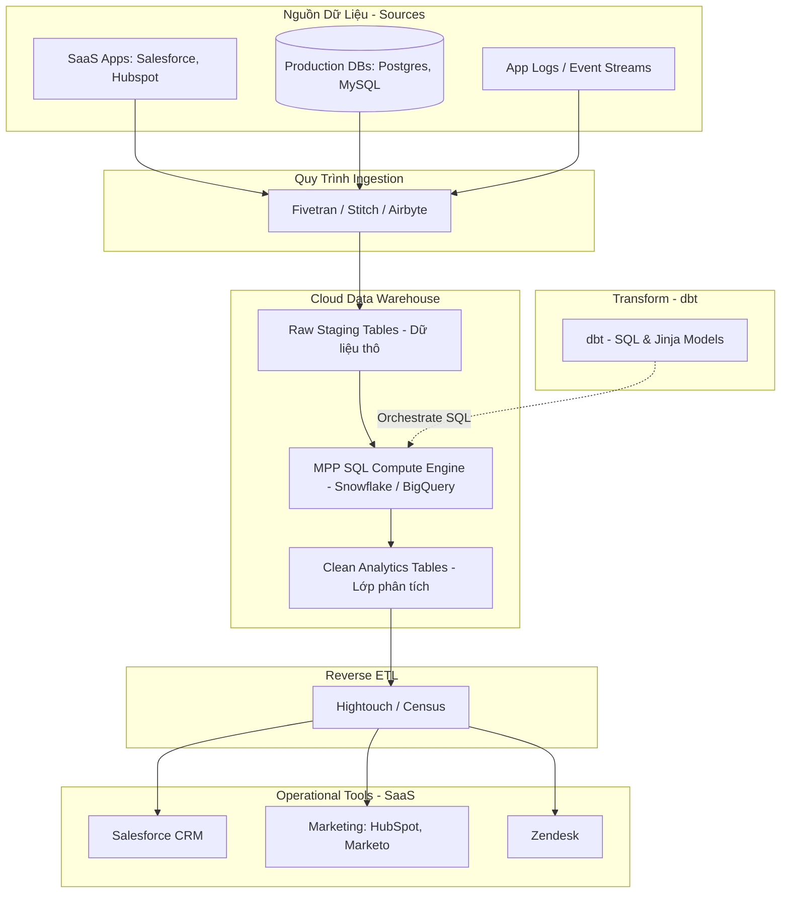

Trong kỷ nguyên số, dữ liệu được ví như "dầu mỏ" mới của doanh nghiệp. Tuy nhiên, dữ liệu thô (raw data) nằm rải rác ở hàng trăm hệ thống khác nhau: từ cơ sở dữ liệu giao dịch (OLTP Databases như PostgreSQL, MySQL), các ứng dụng SaaS (Salesforce, HubSpot, Stripe), đến các tệp tin log hệ thống và chuỗi sự kiện người dùng (event streams). Để chuyển đổi dữ liệu thô này thành các quyết định kinh doanh có giá trị, các doanh nghiệp cần một hạ tầng tích hợp dữ liệu (data integration infrastructure) mạnh mẽ.

Trong lịch sử ngành kỹ thuật dữ liệu (Data Engineering), chúng ta đã chứng kiến sự tiến hóa vượt bậc của các mô hình tích hợp dữ liệu. Bắt đầu từ [ETL](/concepts/3-integration/etl-elt/etl/) truyền thống, chuyển dịch sang [ELT](/concepts/3-integration/etl-elt/elt/) hiện đại gắn liền với sự bùng nổ của [Cloud Data Warehouse](/concepts/2-storage/data-warehouse/data-warehouse/) (kho dữ liệu đám mây), và gần đây nhất là sự xuất hiện của **Reverse ETL** để đưa dữ liệu phân tích quay trở lại phục vụ các hoạt động vận hành thời gian thực. Bài viết này sẽ phân tích chuyên sâu các mô hình tích hợp dữ liệu này, so sánh kiến trúc kỹ thuật, ưu nhược điểm và đưa ra hướng dẫn chi tiết giúp bạn lựa chọn mô hình phù hợp cho doanh nghiệp.

## Kiến trúc & So sánh Kỹ thuật (Technical & Architecture Comparison)

### 1. ETL (Extract - Transform - Load)

Mô hình ETL truyền thống ra đời từ những năm 1970 và thống trị trong suốt nhiều thập kỷ. Đặc điểm cốt lõi của ETL là quá trình biến đổi dữ liệu (Transform) được thực hiện **trước** khi nạp (Load) vào hệ thống đích.

- **Trích xuất (Extract)**: Dữ liệu được lấy ra từ các nguồn dữ liệu gốc (source systems).
- **Biến đổi (Transform)**: Đây là giai đoạn phức tạp nhất. Dữ liệu thô được đưa vào một máy chủ trung gian gọi là **ETL Server (Middleware)** hoặc Integration Server (ví dụ: Informatica PowerCenter, Talend, hoặc các cụm Apache Spark). Tại đây, CPU và RAM của máy chủ ETL sẽ thực hiện các tác vụ làm sạch (data cleaning), lọc (filtering), mã hóa/che giấu thông tin nhạy cảm (data masking), chuẩn hóa định dạng (normalization), liên kết (join) các bảng và tổng hợp dữ liệu (aggregation).
- **Nạp (Load)**: Dữ liệu sau khi đã được biến đổi sạch sẽ, có cấu trúc rõ ràng mới được nạp vào kho dữ liệu đích (Data Warehouse hoặc Data Mart).

### 2. ELT (Extract - Load - Transform)

Sự ra đời của điện toán đám mây và các [Cloud Data Warehouse](/concepts/2-storage/data-warehouse/data-warehouse/) thế hệ mới (như Snowflake, Google BigQuery, AWS Redshift) đã làm thay đổi hoàn toàn tư duy thiết kế hệ thống. ELT đảo ngược thứ tự của hai bước Load và Transform.

- **Trích xuất (Extract)**: Thu thập dữ liệu thô từ các nguồn.
- **Nạp (Load)**: Toàn bộ dữ liệu thô (raw data) được nạp trực tiếp và nguyên bản vào Cloud Data Warehouse nhờ các công cụ ingestion tự động hóa như Fivetran, Stitch, hoặc Airbyte. Dữ liệu thường được lưu dưới dạng bán cấu trúc (Semi-structured như JSON) hoặc các bảng thô (Staging tables).
- **Biến đổi (Transform)**: Quá trình biến đổi dữ liệu không còn diễn ra trên một máy chủ trung gian nữa mà được thực thi **trực tiếp bên trong Data Warehouse** bằng cách tận dụng sức mạnh tính toán song song phân tán (MPP - Massively Parallel Processing) của chính nó. Công cụ phổ biến nhất để quản lý và vận hành bước Transform này là [dbt](/concepts/3-integration/transformation-analytics/dbt/) (Data Build Tool), cho phép viết mã nguồn biến đổi bằng SQL chuẩn kết hợp với Jinja.

### 3. Reverse ETL (Operational Analytics)

Trong khi ETL và ELT chịu trách nhiệm kéo dữ liệu từ các nguồn vào Data Warehouse để phục vụ báo cáo BI (Business Intelligence) và phân tích lịch sử, thì **Reverse ETL** giải quyết bài toán ngược lại. Nó đồng bộ dữ liệu đã được xử lý và làm sạch từ Data Warehouse quay trở lại các hệ thống vận hành (SaaS CRMs như Salesforce, HubSpot, hệ thống hỗ trợ Zendesk, hoặc các công cụ marketing automation).

- **Tại sao cần Reverse ETL?**: Kho dữ liệu rất tốt cho việc phân tích nhưng các nhân viên kinh doanh, hỗ trợ khách hàng hay marketing không sử dụng các công cụ BI hàng ngày. Họ làm việc trực tiếp trên Salesforce, HubSpot hay Zendesk. Reverse ETL giúp đưa các chỉ số quan trọng (ví dụ: điểm tiềm năng của khách hàng - lead scoring, tần suất sử dụng sản phẩm - product usage metrics, trạng thái tài khoản) trực tiếp vào các công cụ vận hành đó để họ có hành động kịp thời.
- **Cơ chế hoạt động**: Công cụ Reverse ETL (như Census, Hightouch) sẽ truy vấn dữ liệu từ các bảng phân tích trong Data Warehouse, so sánh sự thay đổi (differential sync), và gọi API của các ứng dụng SaaS đích để cập nhật dữ liệu một cách tự động và liên tục.

## Sự chuyển dịch Luồng dữ liệu (Data Flow Architectures Shift)

Trong mô hình ETL truyền thống, luồng dữ liệu bị giới hạn bởi hiệu năng của máy chủ trung gian. Khi khối lượng dữ liệu tăng vọt, máy chủ ETL trở thành nút thắt cổ chai lớn (performance bottleneck). Việc mở rộng (scaling) một hệ thống ETL truyền thống cực kỳ phức tạp và tốn kém chi phí phần cứng.

Với sự phát triển của công nghệ lưu trữ và tính toán đám mây, các Cloud Data Warehouse hiện đại áp dụng mô hình **Tách rời Tính toán và Lưu trữ (Separation of Compute and Storage)**. Chi phí lưu trữ dữ liệu thô trên đám mây trở nên cực kỳ rẻ. Điều này cho phép doanh nghiệp lưu trữ toàn bộ lịch sử dữ liệu thô mà không cần lọc bỏ trước. Đồng thời, tài nguyên tính toán có thể được co giãn linh hoạt theo nhu cầu (elastic compute). Nhờ đó, luồng xử lý chuyển từ máy chủ ETL trung gian sang **SQL Execution Engines** phân tán bên trong Data Warehouse (mô hình ELT). 

Dưới đây là sơ đồ Mermaid thể hiện toàn bộ vòng đời của dữ liệu từ các nguồn ban đầu, qua các bước xử lý ELT, đến phân tích và đồng bộ ngược về các công cụ vận hành (Reverse ETL):

## Điểm mạnh và điểm yếu

### 1. ETL (Extract - Transform - Load)

#### Điểm mạnh
- **Bảo mật và quyền riêng tư tối đa**: Dữ liệu nhạy cảm hoặc thông tin cá nhân định danh (PII - Personally Identifiable Information) có thể được lọc sạch, mã hóa hoặc che giấu (masking) ngay trên đường truyền trước khi đi vào kho lưu trữ. Điều này giúp doanh nghiệp dễ dàng tuân thủ các quy định bảo mật khắt khe như GDPR hay HIPAA.
- **Tối ưu dung lượng lưu trữ**: Chỉ dữ liệu đã được làm sạch và nén mới được nạp vào kho lưu trữ, giúp tiết kiệm không gian và chi phí lưu trữ (đặc biệt quan trọng đối với các hệ thống On-premise cũ).

#### Điểm yếu
- **Nút thắt cổ chai hiệu năng**: Việc xử lý biến đổi dữ liệu trên máy chủ trung gian giới hạn khả năng chịu tải. Khi dữ liệu tăng lớn, quá trình biến đổi sẽ kéo dài thời gian nạp dữ liệu.
- **Chi phí bảo trì cao**: Mỗi khi cấu hình bảng nguồn thay đổi (schema drift), pipeline ETL sẽ bị lỗi và cần kỹ sư can thiệp sửa đổi code, dẫn đến chu kỳ phát triển chậm.

### 2. ELT (Extract - Load - Transform)

#### Điểm mạnh
- **Khả năng mở rộng không giới hạn (Scalability)**: Tận dụng trực tiếp sức mạnh xử lý song song khổng lồ của Cloud Data Warehouse. Tốc độ biến đổi dữ liệu nhanh hơn vượt trội nhờ không phải luân chuyển dữ liệu qua mạng nhiều lần.
- **Linh hoạt và nhanh chóng**: Dữ liệu thô được nạp nguyên bản, cho phép Analytics Engineers dễ dàng thay đổi logic biến đổi bằng SQL bất cứ lúc nào mà không cần kéo lại dữ liệu từ nguồn gốc.
- **Bảo toàn lịch sử dữ liệu thô**: Vì toàn bộ dữ liệu thô được lưu trữ, doanh nghiệp có thể dễ dàng chạy lại các phân tích lịch sử khi có nhu cầu phát sinh mới.

#### Điểm yếu
- **Rủi ro chi phí tính toán tăng đột biến**: Nếu các câu lệnh SQL viết không tối ưu (ví dụ: Full Table Scan bảng lớn, Cross Join), chi phí tính toán của Data Warehouse có thể tăng vọt ngoài tầm kiểm soát do tính phí theo lượng tài nguyên tiêu thụ thực tế.
- **Rủi ro bảo mật dữ liệu thô**: Dữ liệu nhạy cảm (PII) được nạp trực tiếp vào kho dữ liệu thô trước khi được phân quyền hoặc che giấu, đòi hỏi doanh nghiệp phải có chính sách kiểm soát truy cập và mã hóa dữ liệu nghiêm ngặt trong Data Warehouse.

### 3. Reverse ETL (Operational Analytics)

#### Điểm mạnh
- **Operational Analytics (Phân tích vận hành)**: Đưa dữ liệu tĩnh trong kho dữ liệu vào hoạt động thực tế, giúp các bộ phận kinh doanh, hỗ trợ khách hàng và marketing có được thông tin khách hàng toàn diện theo thời gian thực (Customer 360).
- **Nhất quán dữ liệu**: Đảm bảo tất cả các ứng dụng SaaS nghiệp vụ đều đồng bộ và sử dụng chung một phiên bản dữ liệu duy nhất (Single Source of Truth) từ Data Warehouse.
- **Loại bỏ viết code API thủ công**: Kỹ sư không cần tự viết và bảo trì các script kết nối API với từng SaaS, giảm thiểu rủi ro bảo trì khi API của các đối tác thay đổi.

#### Điểm yếu
- **Phụ thuộc vào giới hạn API (Rate Limiting)**: Các ứng dụng SaaS (như Salesforce) áp dụng giới hạn số lượng request API nghiêm ngặt mỗi ngày. Việc đồng bộ khối lượng dữ liệu quá lớn có thể làm cạn kiệt tài nguyên API của doanh nghiệp.
- **Độ trễ đồng bộ**: Reverse ETL hoạt động chủ yếu dựa trên cơ chế batch định kỳ (ví dụ: mỗi 15 phút hoặc mỗi giờ), không hoàn toàn là thời gian thực (real-time stream) cho các tác vụ cần độ trễ mili-giây.

## Khi nào nên dùng

Quyết định lựa chọn mô hình tích hợp dữ liệu phụ thuộc vào nhiều yếu tố: chi phí, an ninh thông tin, khối lượng dữ liệu và độ trễ mong muốn. Dưới đây là bảng so sánh chi tiết giữa ba mô hình:

| Tiêu chí | ETL (Extract - Transform - Load) | ELT (Extract - Load - Transform) | Reverse ETL (Operational Analytics) |
| :--- | :--- | :--- | :--- |
| **Kiến trúc luồng** | Nguồn -> ETL Server -> Đích | Nguồn -> Đích -> Biến đổi nội bộ | Đích (Warehouse) -> Nguồn (SaaS) |
| **Nơi biến đổi** | Máy chủ trung gian (Spark/Informatica) | Trực tiếp trong Data Warehouse (Snowflake/BigQuery) | Biến đổi trong Warehouse trước khi đẩy |
| **Khối lượng dữ liệu** | Phù hợp với quy mô nhỏ tới trung bình | Cực kỳ tối ưu cho quy mô lớn (Petabyte) | Phụ thuộc vào giới hạn API hệ thống đích |
| **Tốc độ nạp (Ingest)**| Chậm (do phải chờ biến đổi xong) | Cực kỳ nhanh (nạp nguyên bản dữ liệu thô) | Nhanh nhờ cơ chế đồng bộ vi sai (differential) |
| **Chi phí** | Phí phần cứng ETL server cố định | Phí biến động theo mức sử dụng Cloud Warehouse | Phí theo số lượng connector hoặc volume sync |
| **Bảo mật PII** | Che giấu dữ liệu nhạy cảm trước khi nạp | Cần phân quyền và che giấu trực tiếp trong CDW | Đẩy dữ liệu sạch đã tuân thủ bảo mật ra ngoài |
| **Công cụ phổ biến** | Informatica, Talend, Apache Spark, Pentaho | Fivetran, Stitch, Airbyte, dbt, Coalesce | Hightouch, Census, Grouparoo, Polytomic |

### Hướng dẫn lựa chọn cụ thể

1. **Chọn ETL khi**:
   - Bạn vận hành hệ thống dữ liệu cục bộ (On-premise) có tài nguyên lưu trữ hạn chế.
   - Có những quy định pháp lý vô cùng ngặt nghèo về bảo mật thông tin (như ngành tài chính, y tế), yêu cầu tuyệt đối không được ghi dữ liệu nhạy cảm chưa che giấu vào bất kỳ kho lưu trữ đám mây nào.
   - Luồng biến đổi dữ liệu đơn giản, ít thay đổi cấu trúc nguồn.

2. **Chọn ELT khi**:
   - Doanh nghiệp sử dụng Cloud Data Warehouse làm trung tâm dữ liệu và muốn xây dựng hạ tầng Modern Data Stack.
   - Khối lượng dữ liệu lớn từ nhiều nguồn đa dạng (bán cấu trúc, phi cấu trúc).
   - Đội ngũ phân tích dữ liệu giỏi SQL và muốn tự chủ trong việc thiết lập logic nghiệp vụ thay vì phụ thuộc vào Data Engineer viết code Python/Scala.

3. **Áp dụng Reverse ETL khi**:
   - Bạn đã xây dựng thành công kho dữ liệu trung tâm thông qua ELT và có các chỉ số phân tích chất lượng (Customer Health Score, CLV - Customer Lifetime Value, Lead Scoring).
   - Các bộ phận vận hành (Sales, Marketing, Support) cần truy cập các chỉ số này trực tiếp trong công cụ làm việc hàng ngày của họ để ra quyết định nhanh chóng, thay vì xem báo cáo tĩnh trên BI tools.

## Trọng tâm ôn luyện phỏng vấn

### Q1: Sự khác biệt về mặt kiến trúc phần cứng và phân bổ tính toán giữa ETL và ELT. Tại sao MPP và Separation of Compute & Storage lại là chìa khóa cho ELT?
**Trả lời**: 
- Trong **ETL**, việc biến đổi dữ liệu diễn ra trên máy chủ trung gian độc lập. Máy chủ này phải tự chịu trách nhiệm về cả bộ nhớ RAM và năng lực CPU để xử lý các phép join, aggregation. Nếu khối lượng dữ liệu tăng vọt vượt quá giới hạn phần cứng của máy chủ ETL, hệ thống sẽ gặp lỗi tràn bộ nhớ (Out of Memory) hoặc nghẽn cổ chai. Việc nâng cấp (scaling) yêu cầu cấu hình lại cụm máy chủ phân tán (như Spark) rất phức tạp.
- Trong **ELT**, việc lưu trữ dữ liệu thô cực kỳ rẻ nhờ Cloud Storage (như Amazon S3, Google Cloud Storage) hoạt động độc lập với tài nguyên tính toán. Khi cần thực hiện các biến đổi phức tạp, Cloud Data Warehouse (như Snowflake) cho phép khởi tạo các cụm máy chủ tính toán ảo (Virtual Warehouses) có năng lực xử lý song song khổng lồ (MPP - Massively Parallel Processing) trong vài giây. Các cụm máy chủ này sẽ đọc dữ liệu từ Cloud Storage, xử lý bằng SQL và ghi lại kết quả, sau đó tắt đi ngay khi hoàn thành để tiết kiệm chi phí. Đây chính là kiến trúc **Separation of Compute & Storage** - yếu tố cốt lõi giúp ELT trở nên khả thi và tối ưu về mặt kinh tế.

### Q2: Hãy thiết kế giải pháp bảo mật và tuân thủ (GDPR/HIPAA) khi áp dụng ELT. Làm cách nào để che giấu PII trước hoặc ngay sau khi load vào Data Warehouse?
**Trả lời**: 
Khi áp dụng ELT, rủi ro lớn nhất là dữ liệu PII thô được nạp thẳng vào Data Warehouse. Có hai cách tiếp cận chính để giải quyết bài toán này:
1. **Hybrid ELT (Masking before load)**: Sử dụng các tính năng mã hóa gọn nhẹ ngay trong công cụ ingestion (như mã hóa trường dữ liệu nhạy cảm tại nguồn trước khi truyền qua Internet) hoặc sử dụng các proxy mã hóa.
2. **Che giấu dữ liệu tại tầng Data Warehouse (In-warehouse Security)**:
   - Sử dụng các kỹ thuật phân quyền truy cập mức cột (Column-level security) và mức dòng (Row-level security).
   - Sử dụng tính năng Dynamic Data Masking của các Cloud Data Warehouse (ví dụ: Snowflake Masking Policies). Người dùng thông thường chỉ thấy dữ liệu bị che giấu (như `*****@gmail.com`), trong khi chỉ những vai trò được cấp phép đặc biệt mới xem được dữ liệu thực tế.
   - Mã hóa bất đối xứng các trường nhạy cảm ngay khi nạp vào lớp Staging và chỉ giải mã ở lớp phân tích cuối cùng cho những người dùng có khóa giải mã phù hợp.

### Q3: Phân biệt Reverse ETL với các giải pháp tích hợp ứng dụng truyền thống như iPaaS (MuleSoft, Zapier) hoặc Webhooks.
**Trả lời**: 
- **iPaaS và Webhooks**: Hoạt động dựa trên cơ chế kích hoạt theo sự kiện (Event-driven / Trigger-based). Ví dụ: "Khi có một đơn hàng mới được tạo trên Shopify (sự kiện), hãy gửi dữ liệu đơn hàng đó sang Salesforce CRM ngay lập tức". Luồng đi của dữ liệu là điểm-đến-điểm (Point-to-Point) và chứa thông tin cục bộ của một sự kiện duy nhất. Nó không có cái nhìn toàn diện về lịch sử và hành vi của khách hàng.
- **Reverse ETL**: Hoạt động dựa trên dữ liệu đã được tổng hợp và phân tích từ toàn bộ các nguồn trong Data Warehouse (Data-driven). Ví dụ: "Tìm tất cả người dùng hoạt động tích cực trong 30 ngày qua nhưng chưa mua hàng, tính toán điểm số tiềm năng và đồng bộ danh sách này vào Salesforce". Dữ liệu đồng bộ ở đây là kết quả của các phép tính toán phức tạp trên toàn bộ dữ liệu lịch sử (Customer 360) chứ không chỉ là một sự kiện đơn lẻ. Reverse ETL đóng vai trò là cầu nối đưa kết quả phân tích (analytical insights) thành hành động vận hành (operational actions).

### Q4: Làm thế nào để giải quyết vấn đề API Rate Limit và đảm bảo tính nhất quán (idempotency, retry logic) trong các hệ thống Reverse ETL?
**Trả lời**: 
Để giải quyết bài toán này, các hệ thống Reverse ETL chuyên nghiệp áp dụng các kỹ thuật sau:
1. **Đồng bộ vi sai (Differential Sync / Change Data Capture)**: Chỉ truy vấn và gửi đi những bản ghi có sự thay đổi so với lần đồng bộ trước đó. Điều này giúp giảm thiểu tới 90-95% số lượng request API so với việc đồng bộ toàn bộ bảng (Full Sync).
2. **Batching API Requests**: Gom nhiều bản ghi vào một request API duy nhất (Bulk API) thay vì gọi API cho từng bản ghi riêng lẻ, giúp tiết kiệm số lượng API quota của hệ thống đích.
3. **Rate Limiting & Queue Management**: Thiết lập hàng đợi tin nhắn (Message Queue) và bộ điều phối tốc độ gọi API (Rate Limiter) để đảm bảo không vượt quá ngưỡng quy định của nhà cung cấp SaaS. Nếu bị trả về lỗi HTTP 429 (Too Many Requests), hệ thống áp dụng cơ chế tự động thử lại với thời gian chờ tăng dần (Exponential Backoff).
4. **Tính nhất quán (Idempotency)**: Đảm bảo mỗi bản ghi gửi đi có một định danh duy nhất (External ID). Nếu quá trình gửi bị gián đoạn và phải thử lại, hệ thống đích sẽ nhận diện được và thực hiện ghi đè (upsert) chứ không tạo ra các bản ghi trùng lặp.

## English Summary

Data integration patterns have evolved significantly to meet the demands of modern cloud ecosystems. **ETL (Extract-Transform-Load)** remains relevant for strict on-premise security architectures where sensitive data (PII) must be masked prior to ingestion. However, **ELT (Extract-Load-Transform)** has become the industry standard for the Modern Data Stack, leveraging the separation of compute and storage in Cloud Data Warehouses (like Snowflake, BigQuery) to run high-performance SQL transformations orchestrated by tools like [dbt](/concepts/3-integration/transformation-analytics/dbt/). 

To close the loop, **Reverse ETL** bridges the gap between analytical insights and day-to-day operations. Instead of keeping clean, aggregated metrics locked within BI dashboards, Reverse ETL tools (like Hightouch and Census) sync data from the warehouse back to operational SaaS platforms (e.g., Salesforce, HubSpot). This enables operational analytics, ensuring that business teams work with a unified single source of truth. Selecting the right pattern requires balancing cost, data security, volume, and API rate-limiting constraints.

## Xem thêm các khái niệm liên quan
* [Backfill](/concepts/3-integration/etl-elt/backfill/)
* [Thu thập dữ liệu thay đổi - Change Data Capture (CDC)](/concepts/3-integration/etl-elt/change-data-capture/)
* [Data Extraction](/concepts/3-integration/etl-elt/data-extraction/)

## Tài liệu tham khảo

1. [AWS Glue Integration Patterns](https://docs.aws.amazon.com/glue/latest/dg/what-is-glue.html) - Official AWS guide detailing serverless integration and ETL/ELT pipelines in cloud environments.
2. [Google Cloud Dataflow Ingestion Architecture](https://cloud.google.com/dataflow/docs/concepts/streaming-pipelines) - Google Cloud documentation detailing managed pipeline execution for data ingestion.
3. [Snowflake Data Loading Best Practices](https://docs.snowflake.com/en/user-guide/data-load-overview) - Official Snowflake user guide for loading raw data into staging environments for ELT.
4. [Databricks Lakehouse Platform Design](https://docs.databricks.com/en/introduction/index.html) - Databricks reference guide for building robust data pipelines using Spark SQL and Delta Lake.
5. [dbt Labs: What is ELT?](https://docs.getdbt.com/docs/introduction) - Official dbt Labs resource explaining the transformation layer in modern data warehousing.
6. [Fivetran: ETL vs. ELT - Modern Data Stack](https://www.fivetran.com/blog/what-is-elt) - Extensive analysis of ingestion processes and data architecture patterns by Fivetran.
7. [Stitch: Understanding ETL and ELT](https://www.stitchdata.com/resources/etl-vs-elt/) - Stitch guide outlining architectural trade-offs, developer velocity, and platform costs.
8. [Census: The Guide to Reverse ETL](https://www.getcensus.com/blog/what-is-reverse-etl) - Detailed industry guide on operationalizing warehouse data back to operational systems.
9. [Hightouch: What is Reverse ETL?](https://hightouch.com/blog/reverse-etl) - Architectural resource highlighting how Reverse ETL bridges the gap between BI and SaaS tools.
